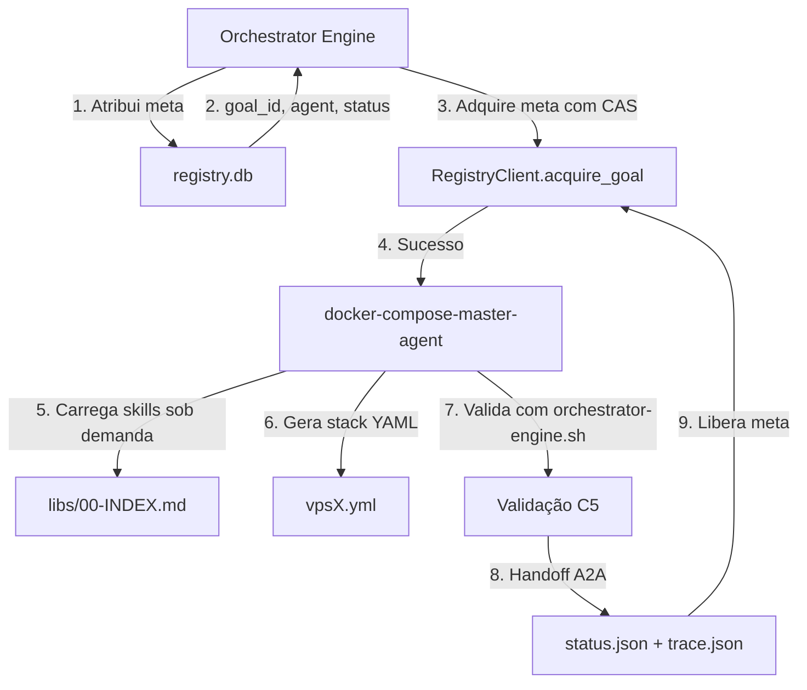
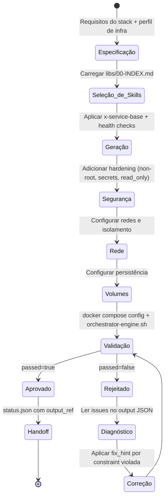
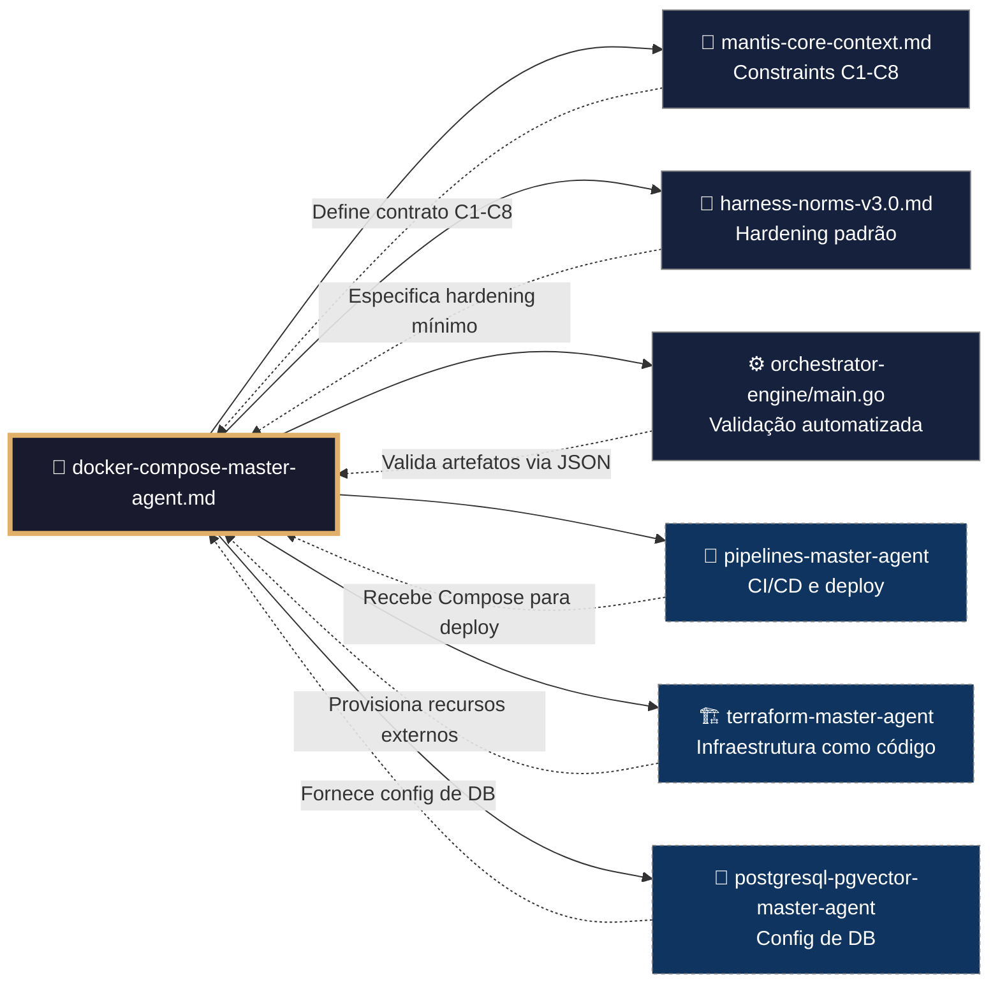
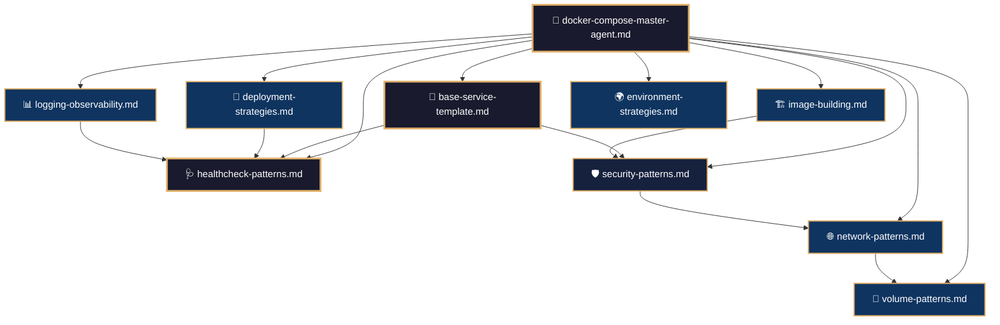
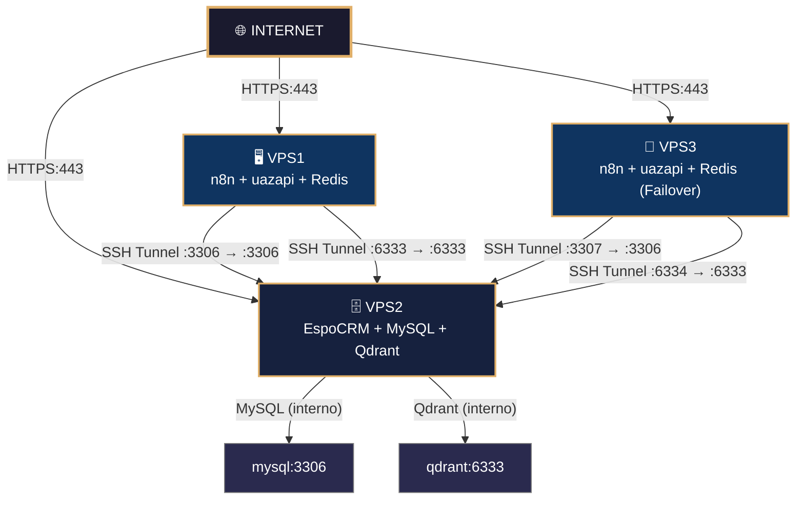
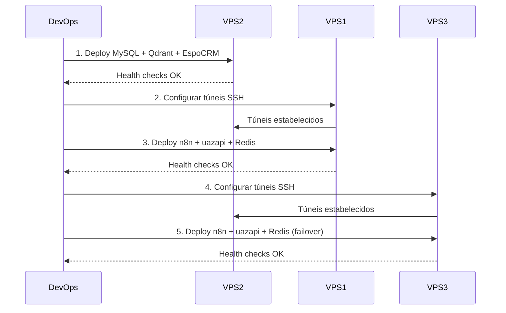

# 🐳 Procedimento Operacional Padrão — Docker Compose MANTIS Agentic

**Objetivo**: Estabelecer o fluxo de trabalho completo para operação do domínio `docker-compose/`, incluindo geração de stacks, configuração de túneis SSH, deploy ordenado, validação e recuperação de falhas.

**Público-alvo**: Arquitetos humanos, agentes mestres, engenheiros DevOps, operadores de infraestrutura.

---

## 1. Visão Geral do Domínio

O domínio `05-CONFIGURATIONS/docker-compose/` é responsável pela orquestração de contêineres no ecossistema MANTIS. Ele contém:

- **Agente Mestre** (`docker-compose-master-agent.md`): framework executável de geração de stacks.
- **Skills Modulares** (`libs/`): padrões reutilizáveis de YAML, health checks, segurança, redes, volumes.
- **Arquivos Compose** (`vps1-n8n-uazapi.yml`, `vps2-crm-qdrant.yml`, `vps3-n8n-uazapi.yml`): stacks de produção para 3 VPS interconectados.

### 1.1 Conexão com o Ecossistema `goals/`



---

## 2. Fluxo de Geração de Stacks



---

## 3. Conexão com Outros Domínios



---

## 4. Inter-relação dos Módulos Internos (`libs/`)



---

## 5. Arquitetura de Rede 3-VPS



---

## 6. Configuração de Túneis SSH

Os túneis SSH permitem que VPS1 e VPS3 acessem MySQL e Qdrant no VPS2 sem expor esses serviços à internet.

### 6.1 Pré-requisito: Chaves SSH

```bash
# Em VPS1 e VPS3: gerar chave e copiar para VPS2
ssh-keygen -t ed25519 -C "vps1-mantis-tunnel" -f ~/.ssh/vps1_tunnel -N ""
ssh-copy-id -i ~/.ssh/vps1_tunnel.pub root@IP_VPS2
ssh -i ~/.ssh/vps1_tunnel root@IP_VPS2 "echo 'Conexão OK'"
```

### 6.2 Configurar SSH Config

```bash
cat > ~/.ssh/config << 'EOF'
Host vps2
    HostName IP_VPS2
    User root
    IdentityFile ~/.ssh/vps1_tunnel
    ServerAliveInterval 30
    ServerAliveCountMax 3
    StrictHostKeyChecking accept-new
    ConnectTimeout 10
EOF
chmod 600 ~/.ssh/config
```

### 6.3 Criar Túneis Persistentes com Systemd

```bash
# Instalar autossh
apt-get install -y autossh

# Criar serviço para túnel MySQL
cat > /etc/systemd/system/mantis-tunnel-mysql.service << 'EOF'
[Unit]
Description=MANTIS SSH Tunnel — MySQL VPS2
After=network-online.target
Wants=network-online.target

[Service]
Type=simple
User=root
EnvironmentFile=/etc/mantis/tunnels.env
ExecStart=/usr/bin/autossh -M 0 -N \
  -o "ServerAliveInterval=30" \
  -o "ServerAliveCountMax=3" \
  -o "ExitOnForwardFailure=yes" \
  -i /root/.ssh/vps1_tunnel \
  -L "127.0.0.1:3306:127.0.0.1:3306" \
  root@${VPS2_IP}
Restart=on-failure
RestartSec=5s

[Install]
WantedBy=multi-user.target
EOF

# Repetir para Qdrant REST (porta 6333) e Qdrant gRPC (porta 6334)
# Habilitar e iniciar
systemctl daemon-reload
systemctl enable --now mantis-tunnel-mysql mantis-tunnel-qdrant-rest mantis-tunnel-qdrant-grpc
```

---

## 7. Processo de Deploy Ordenado

**Ordem obrigatória**: VPS2 → VPS1 → VPS3



### 7.1 Comandos de Deploy

```bash
# PASSO 1: Deploy VPS2
ssh root@IP_VPS2 "cd /opt/mantis && docker compose -f vps2-crm-qdrant.yml up -d --wait"
sleep 90

# PASSO 2: Túneis em VPS1
ssh root@IP_VPS1 "systemctl start mantis-tunnel-mysql mantis-tunnel-qdrant-rest mantis-tunnel-qdrant-grpc"

# PASSO 3: Deploy VPS1
ssh root@IP_VPS1 "cd /opt/mantis && docker compose -f vps1-n8n-uazapi.yml up -d --wait"

# PASSO 4: Túneis em VPS3
ssh root@IP_VPS3 "systemctl start mantis-tunnel-mysql mantis-tunnel-qdrant-rest"

# PASSO 5: Deploy VPS3
ssh root@IP_VPS3 "cd /opt/mantis && docker compose -f vps3-n8n-uazapi.yml up -d --wait"
```

---

## 8. Validação Pós-Deploy

| # | Verificação | Constraint | Comando | ✅ Esperado |
|---|---|---|---|---|
| 1 | MySQL não acessível da internet | C3 | `nc -zv IP_VPS2 3306` | Connection refused |
| 2 | Qdrant não acessível da internet | C3 | `nc -zv IP_VPS2 6333` | Connection refused |
| 3 | Túnel MySQL ativo em VPS1 | C7 | `ss -tulpn \| grep 127.0.0.1:3306` | 127.0.0.1:3306 |
| 4 | Túnel Qdrant ativo em VPS1 | C7 | `ss -tulpn \| grep 127.0.0.1:6333` | 127.0.0.1:6333 |
| 5 | MySQL responde via túnel | C7 | `mysqladmin ping -h 127.0.0.1 -P 3306 -u root -p$PASS` | mysqld is alive |
| 6 | EspoCRM acessível via HTTPS | C3 | `curl -sf https://crm.dominio.com` | HTTP 200 |
| 7 | n8n protegido com BasicAuth | C3 | `curl -sf https://n8n.dominio.com` | HTTP 401 |
| 8 | Redis não acessível da internet | C3 | `redis-cli -h IP_VPS1 -p 6379 ping` | Could not connect |
| 9 | Subnets Docker sem colisão | C7 | `docker network ls` | 172.20.x, 172.21.x, 172.22.x |
| 10 | Health checks dos serviços | C8 | `docker ps --filter 'health=unhealthy'` | Nenhum unhealthy |
| 11 | Túneis com restart automático | C7 | `systemctl show mantis-tunnel-mysql \| grep Restart=` | Restart=on-failure |
| 12 | tenant_id nos contêineres | C4 | `docker inspect mantis-n8n \| grep TENANT_ID` | TENANT_ID configurado |
| 13 | Logs em JSON | C8 | `docker logs mantis-n8n --tail 1 \| python3 -m json.tool` | JSON válido |
| 14 | ICC desabilitado em redes internas | C3 | `docker network inspect mantis-internal \| grep icc` | enable_icc: false |
| 15 | autossh reconecta após queda | C7 | Parar docker no VPS2 → esperar 60s → verificar túnel | Túnel reconectado |

---

## 9. Operações Diárias

### 9.1 Ver Estado dos Serviços

```bash
for vps in $VPS1_IP $VPS2_IP $VPS3_IP; do
  echo "─── $vps ───"
  ssh root@$vps "docker ps --format 'table {{.Names}}\t{{.Status}}\t{{.Ports}}'"
done
```

### 9.2 Backup Manual

```bash
# MySQL (VPS2)
ssh root@$VPS2_IP "
  TIMESTAMP=\$(date +%Y%m%d_%H%M%S)
  docker exec mantis-mysql mysqldump -u root -p\$MYSQL_ROOT_PASSWORD \
    --all-databases --single-transaction | gzip > /opt/mantis/backups/mysql_\$TIMESTAMP.sql.gz
  sha256sum /opt/mantis/backups/mysql_\$TIMESTAMP.sql.gz
"

# Qdrant (VPS2)
ssh root@$VPS2_IP "
  curl -X POST -H 'api-key: \$QDRANT_API_KEY' 'http://127.0.0.1:6333/snapshots'
"
```

### 9.3 Failover VPS1 → VPS3

```bash
# 1. Verificar VPS3
ssh root@$VPS3_IP "docker ps | grep mantis-vps3-n8n"

# 2. Atualizar DNS: n8n.dominio.com → IP_VPS3

# 3. Notificar
echo "⚠️ FAILOVER ATIVADO: n8n em VPS3 ($VPS3_IP)"
```

---

## 10. Troubleshooting

| Sintoma | VPS | Causa Provável | Diagnóstico | Solução |
|---------|-----|---------------|-------------|---------|
| `n8n não conecta ao MySQL` | VPS1 | Túnel SSH caído | `systemctl status mantis-tunnel-mysql` | `systemctl restart mantis-tunnel-mysql` |
| `EspoCRM: Erro de BD` | VPS2 | MySQL reiniciando | `docker logs mantis-mysql` | `docker compose restart mysql` |
| `Qdrant: Connection refused` | VPS1/3 | Túnel Qdrant caído | `ss -tulpn \| grep 6333` | `systemctl restart mantis-tunnel-qdrant-rest` |
| `OOM: MySQL killed` | VPS2 | Buffer pool > RAM | `dmesg \| grep killed` | Reduzir `innodb_buffer_pool_size` ou escalar KVM2 |
| `Traefik: 502 Bad Gateway` | VPS1/2/3 | Backend caído | `docker logs mantis-traefik --tail 20` | Reiniciar serviço backend |
| `SSH: Host key verification failed` | Qualquer | Chave do servidor mudou | `ssh-keygen -R IP_VPS2` | Remover chave antiga e reconectar |

---

## 11. Rollback de Emergência

```bash
# 1. Reverter para tag de imagem anterior
ssh root@$VPS1_IP "
  cd /opt/mantis
  export VERSION=<versão-anterior>
  docker compose -f vps1-n8n-uazapi.yml up -d --wait
"

# 2. Se necessário, restaurar banco de dados
ssh root@$VPS2_IP "
  cd /opt/mantis
  gunzip -c backups/mysql_<timestamp>.sql.gz | docker exec -i mantis-mysql mysql -u root -p\$MYSQL_ROOT_PASSWORD
"

# 3. Verificar saúde
bash scripts/health-check.sh prod
```

---

## 12. Referências Cruzadas

- [[05-CONFIGURATIONS/docker-compose/docker-compose-master-agent.md]] — Agente mestre
- [[05-CONFIGURATIONS/docker-compose/libs/00-INDEX.md]] — Índice de skills
- [[05-CONFIGURATIONS/docker-compose/vps1-n8n-uazapi.yml]] — Stack VPS1
- [[05-CONFIGURATIONS/docker-compose/vps2-crm-qdrant.yml]] — Stack VPS2
- [[05-CONFIGURATIONS/docker-compose/vps3-n8n-uazapi.yml]] — Stack VPS3
- [[05-CONFIGURATIONS/validation/orchestrator-engine.sh]] — Motor de validação
- [[05-CONFIGURATIONS/terraform/modules/vps-base/main.tf]] — IaC complementar
- [[goals/README.md]] — Sistema de metas
- [[01-RULES/harness-norms-v3.0.md]] — Hardening padrão
- [[01-RULES/11-A2A-COMMUNICATION-RULES.md]] — Contrato A2A (C9)

---

> **Versão 2.3.0** | Procedimento Operacional Padrão do domínio `docker-compose/` — MANTIS Agentic.
> Aplicável a partir de 2026-05-23.
