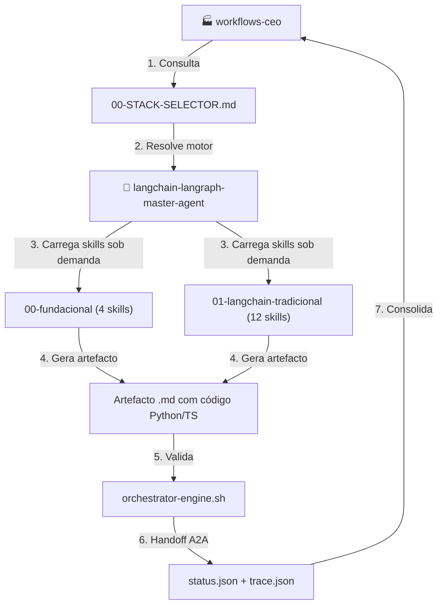
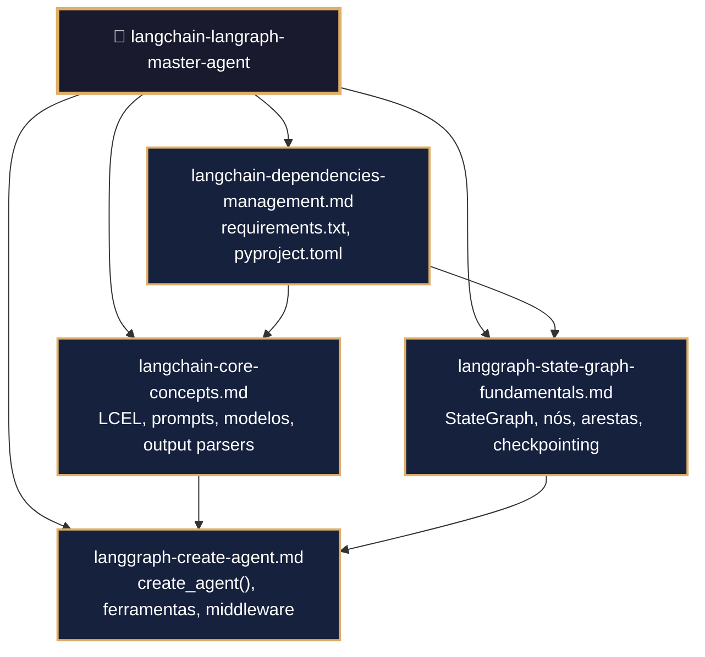
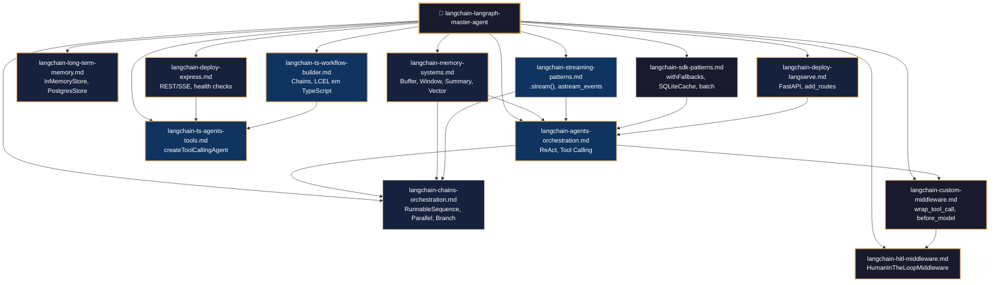
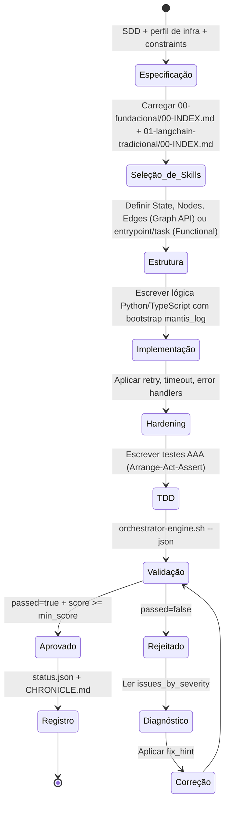
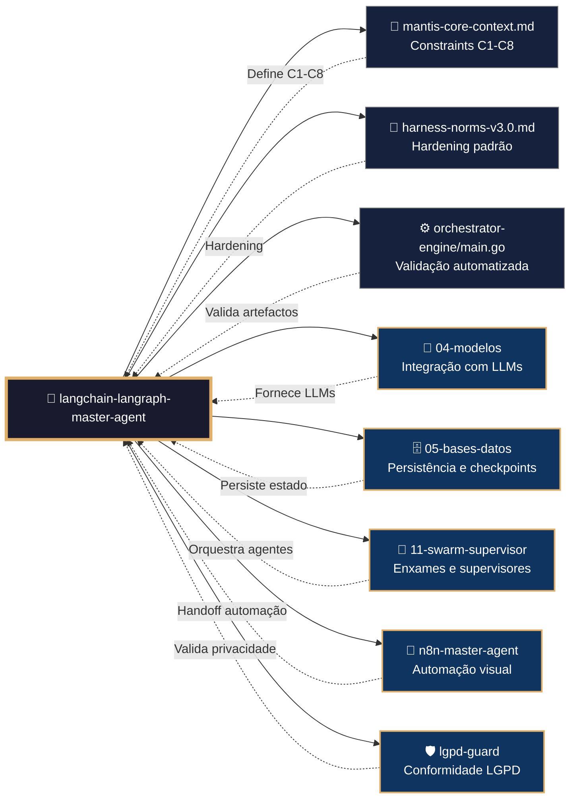

# 📐 Procedimento Operacional Padrão — LangChain/LangGraph: Fundacional e Tradicional

**Objetivo**: Estabelecer o fluxo de trabalho completo para criação, validação, teste e deploy de pipelines e agentes usando as bibliotecas fundacionais (`00-fundacional`) e os padrões tradicionais (`01-langchain-tradicional`) do ecossistema LangChain/LangGraph no domínio `04-WORKFLOWS/langchain-langraph/`.

**Público-alvo**: Arquitetos humanos, agentes mestres, engenheiros de IA, desenvolvedores Python/TypeScript, operadores de infraestrutura.

---

## 1. Visão Geral dos Subdomínios

O domínio `04-WORKFLOWS/langchain-langraph/libs/` contém dois subdomínios iniciais que formam a base de todo o ecossistema:

- **00‑fundacional** (4 skills): Blocos de construção essenciais — LCEL, `create_agent`, `StateGraph`, gerenciamento de dependências.
- **01‑langchain‑tradicional** (12 skills): Padrões clássicos — chains, agentes ReAct, middleware, memória, streaming, deploy.

### 1.1 Conexão com o Ecossistema `goals/`



---

## 2. Mapa de Skills e Inter-relações

### 2.1 00‑fundacional (4 skills)



### 2.2 01‑langchain‑tradicional (12 skills)



---

## 3. Fluxo de Geração de Artefactos



---

## 4. Conexão com Outros Domínios



---

## 5. Estrutura de Diretórios

```
04-WORKFLOWS/langchain-langraph/libs/
├── 00-fundacional/
│   ├── langchain-core-concepts.md       # LCEL, prompts, modelos, output parsers, RAG básico
│   ├── langgraph-create-agent.md        # create_agent() com ferramentas e checkpointer
│   ├── langgraph-state-graph-fundamentals.md  # StateGraph, TypedDict, checkpointing
│   └── langchain-dependencies-management.md   # Gestão de dependências
└── 01-langchain-tradicional/
    ├── langchain-agents-orchestration.md      # Agentes ReAct, Tool Calling
    ├── langchain-chains-orchestration.md      # Chains sequenciais e paralelas
    ├── langchain-custom-middleware.md         # Middleware customizado
    ├── langchain-hitl-middleware.md           # Human-in-the-Loop tradicional
    ├── langchain-memory-systems.md            # Buffer, Window, Summary, Vector
    ├── langchain-long-term-memory.md          # InMemoryStore, PostgresStore
    ├── langchain-streaming-patterns.md        # .stream(), astream_events
    ├── langchain-sdk-patterns.md              # Fallbacks, batch, caching
    ├── langchain-deploy-langserve.md          # FastAPI, add_routes, Docker
    ├── langchain-deploy-express.md            # Endpoints REST/SSE, Docker
    ├── langchain-ts-workflow-builder.md       # TypeScript workflow builder
    └── langchain-ts-agents-tools.md           # TypeScript agents e tools
```

---

## 6. Exemplos de Código e Padrões

### 6.1 Pipeline LCEL com RAG (langchain-core-concepts.md)

```python
from langchain_core.prompts import ChatPromptTemplate
from langchain_core.output_parsers import StrOutputParser
from langchain_openai import ChatOpenAI

model = ChatOpenAI(model="gpt-4o", temperature=0)
prompt = ChatPromptTemplate.from_template("Resuma: {texto}")
parser = StrOutputParser()

chain = prompt | model | parser
result = chain.invoke({"texto": "O gato subiu no telhado..."})
print(result)
```

### 6.2 Agente com create_agent (langgraph-create-agent.md)

```python
from langchain.agents import create_agent
from langgraph.checkpoint.memory import InMemorySaver

def buscar_clima(cidade: str) -> str:
    """Busca o clima de uma cidade."""
    return f"Clima em {cidade}: 25°C, ensolarado"

agent = create_agent(
    model="gpt-4o",
    tools=[buscar_clima],
    system_prompt="Você é um assistente prestativo.",
    checkpointer=InMemorySaver()
)

result = agent.invoke({
    "messages": [{"role": "user", "content": "Qual o clima em São Paulo?"}]
})
```

### 6.3 StateGraph com Nós e Arestas (langgraph-state-graph-fundamentals.md)

```python
from typing import TypedDict
from langgraph.graph import StateGraph, START, END

class State(TypedDict):
    contador: int

def incrementar(state: State) -> dict:
    return {"contador": state["contador"] + 1}

def duplicar(state: State) -> dict:
    return {"contador": state["contador"] * 2}

builder = StateGraph(State)
builder.add_node("incrementar", incrementar)
builder.add_node("duplicar", duplicar)
builder.add_edge(START, "incrementar")
builder.add_edge("incrementar", "duplicar")
builder.add_edge("duplicar", END)

graph = builder.compile()
result = graph.invoke({"contador": 5})  # 5 → 6 → 12
print(result["contador"])  # 12
```

### 6.4 Middleware Customizado (langchain-custom-middleware.md)

```python
from langchain.agents.middleware import wrap_tool_call

@wrap_tool_call
def log_tool_call(request, handler):
    print(f"[LOG] Chamando ferramenta: {request.tool_name}")
    response = handler(request)
    print(f"[LOG] Resultado: {response}")
    return response

agent = create_agent(
    "gpt-4o",
    tools=[buscar_clima],
    middleware=[log_tool_call]
)
```

### 6.5 Streaming de Tokens (langchain-streaming-patterns.md)

```python
for chunk in graph.stream(
    {"topic": "programação"},
    stream_mode="messages",
    version="v2"
):
    if chunk["type"] == "messages":
        msg, metadata = chunk["data"]
        if hasattr(msg, "content") and msg.content:
            print(msg.content, end="", flush=True)
```

### 6.6 Deploy com LangServe (langchain-deploy-langserve.md)

```python
from fastapi import FastAPI
from langserve import add_routes

app = FastAPI()
add_routes(app, agent, path="/agent")

# Executar: uvicorn app:app --host 0.0.0.0 --port 8000
```

---

## 7. Processo de Validação

### 7.1 Comandos de Validação por Artefacto

```bash
# Validação de skill individual
bash 05-CONFIGURATIONS/validation/orchestrator-engine.sh \
  --file 04-WORKFLOWS/langchain-langraph/libs/00-fundacional/langchain-core-concepts.md \
  --json

# Validação completa do subdomínio 00-fundacional
for f in 04-WORKFLOWS/langchain-langraph/libs/00-fundacional/*.md; do
  bash 05-CONFIGURATIONS/validation/orchestrator-engine.sh --file "$f" --json
done

# Validação completa do subdomínio 01-langchain-tradicional
for f in 04-WORKFLOWS/langchain-langraph/libs/01-langchain-tradicional/*.md; do
  bash 05-CONFIGURATIONS/validation/orchestrator-engine.sh --file "$f" --json
done
```

### 7.2 Checklist de Validação Manual

| # | Verificação | Constraint | Comando | ✅ Esperado |
|---|---|---|---|---|
| 1 | Frontmatter YAML válido | C5 | `validate-frontmatter.sh` | passed=true |
| 2 | Bootstrap com mantis_log | C8 | `grep 'def mantis_log' <file>` | Encontrado |
| 3 | Testes TDD presentes | C5 | `grep 'def test_' <file>` | ≥3 testes |
| 4 | Wikilinks canônicos | C5 | `check-wikilinks.sh` | Zero quebrados |
| 5 | Código ≥500 linhas | C5 | `wc -l <file>` | ≥500 |
| 6 | Constraints mapeadas | C5 | `grep 'constraints_mapped' <file>` | Lista válida |
| 7 | Sem secrets hardcoded | C3 | `audit-secrets.sh` | Zero violações |
| 8 | Exemplos executáveis | C5 | `python3 -c "..."` | Sem erros de sintaxe |

---

## 8. Troubleshooting

| Sintoma | Causa Provável | Diagnóstico | Solução |
|---------|---------------|-------------|---------|
| `ImportError: cannot import 'create_agent'` | LangChain desatualizado | `pip show langchain` | `pip install -U langchain>=1.0` |
| `StateGraph não compila` | Reducer ausente ou chave incorreta | `graph.get_graph().draw_mermaid_png()` | Verificar TypedDict e Annotated |
| `ToolCall não reconhecido` | Modelo sem suporte a function calling | `model.bind_tools()` | Usar modelo compatível (gpt-4, claude-3) |
| `Streaming sem output` | Modo `messages` requer `version="v2"` | `graph.stream(stream_mode="messages")` | Adicionar `version="v2"` |
| `HITL não pausa` | `interrupt_on` mal configurado | `graph.get_state(config)` | Verificar `interrupt_on` no middleware |
| `Memória não persiste` | Checkpointer ausente | `graph.compile(checkpointer=...)` | Adicionar `InMemorySaver` ou `PostgresSaver` |
| `LangServe não expõe rota` | `langgraph.json` ausente ou inválido | `langgraph dev` | Verificar estrutura do projeto |
| `TypeScript: type errors` | `tsconfig.json` ausente | `tsc --noEmit` | Configurar `tsconfig.json` |

---

## 9. Referências Cruzadas

- [[04-WORKFLOWS/langchain-langraph/langchain-langraph-master-agent.md]] — Master Agent central
- [[04-WORKFLOWS/langchain-langraph/libs/00-fundacional/langchain-core-concepts.md]]
- [[04-WORKFLOWS/langchain-langraph/libs/00-fundacional/langgraph-create-agent.md]]
- [[04-WORKFLOWS/langchain-langraph/libs/00-fundacional/langgraph-state-graph-fundamentals.md]]
- [[04-WORKFLOWS/langchain-langraph/libs/00-fundacional/langchain-dependencies-management.md]]
- [[04-WORKFLOWS/langchain-langraph/libs/01-langchain-tradicional/]] — 12 skills tradicionais
- [[04-WORKFLOWS/workflows-ceo.md]] — CEO de workflows
- [[04-WORKFLOWS/00-STACK-SELECTOR.md]] — Stack Selector
- [[05-CONFIGURATIONS/validation/orchestrator-engine.sh]] — Motor de validação
- [[01-RULES/harness-norms-v3.0.md]] — Hardening padrão
- [[01-RULES/11-A2A-COMMUNICATION-RULES.md]] — Contrato A2A (C9)
- [[07-PROCEDURES/rag-langchain-langraph-sop.md]] — SOP de RAG (próximo)

---

> **Versão 2.3.0** | Procedimento Operacional Padrão dos subdomínios `00-fundacional` e `01-langchain-tradicional` — MANTIS Agentic.
> Aplicável a partir de 2026-05-28.
