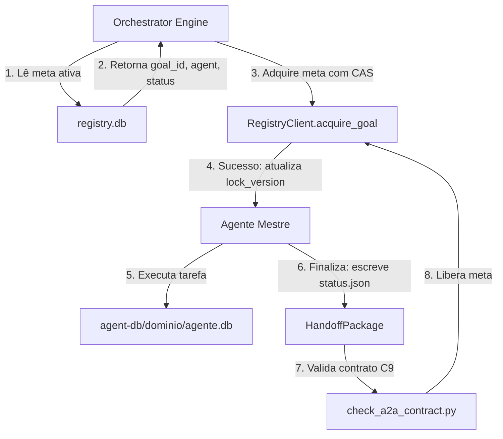
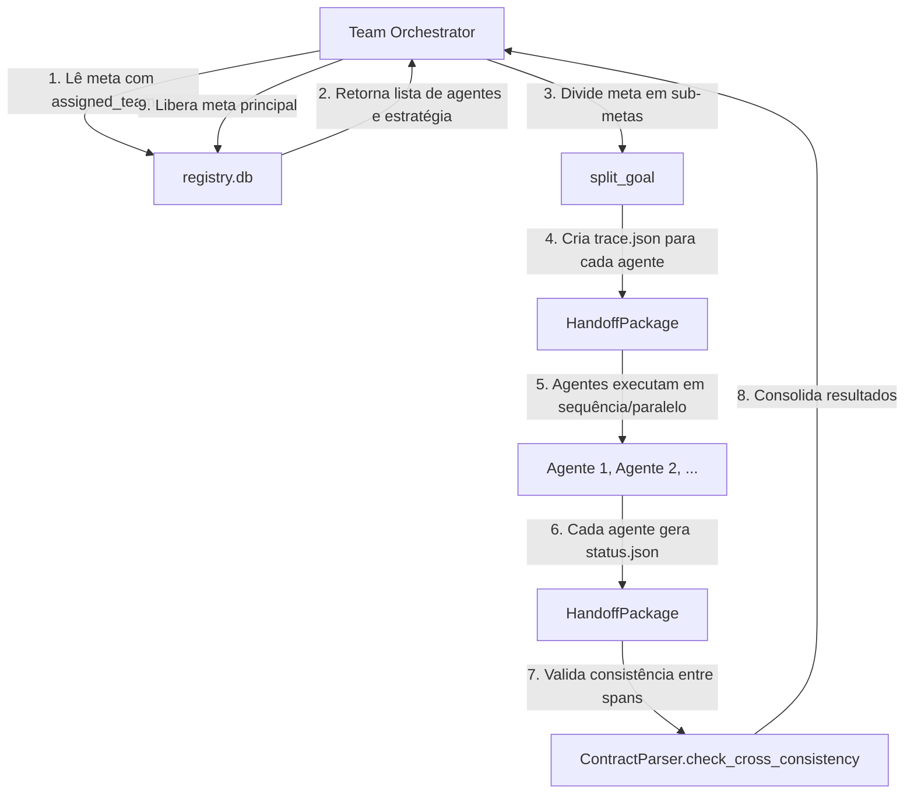
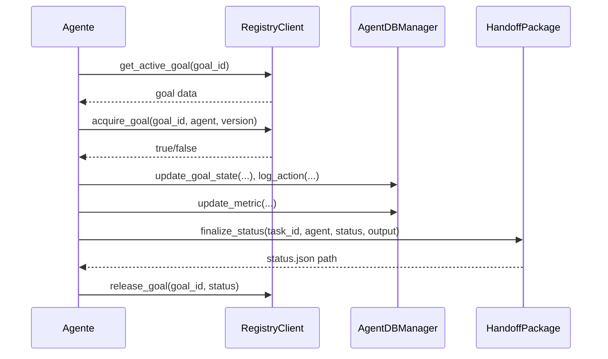
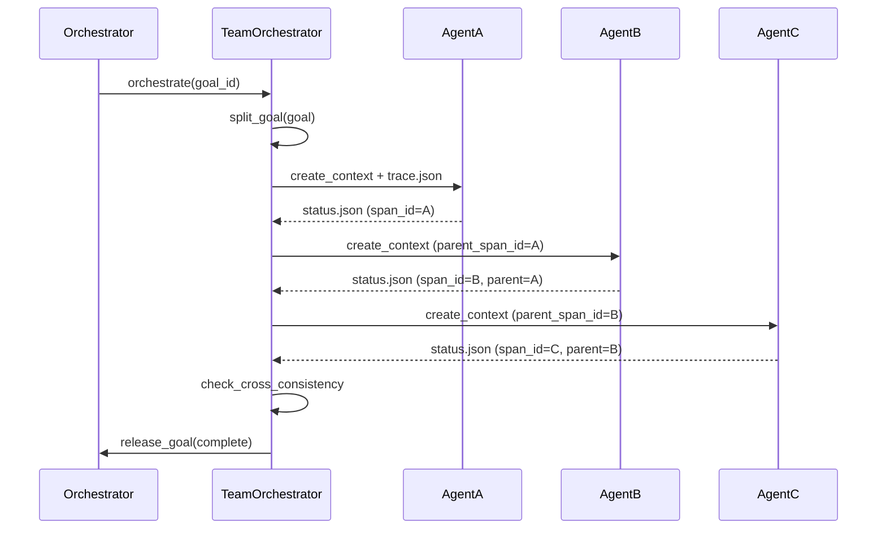
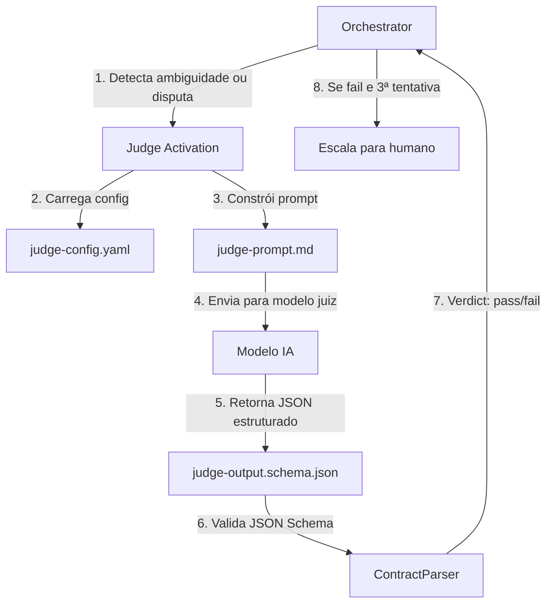
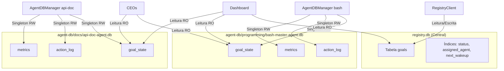
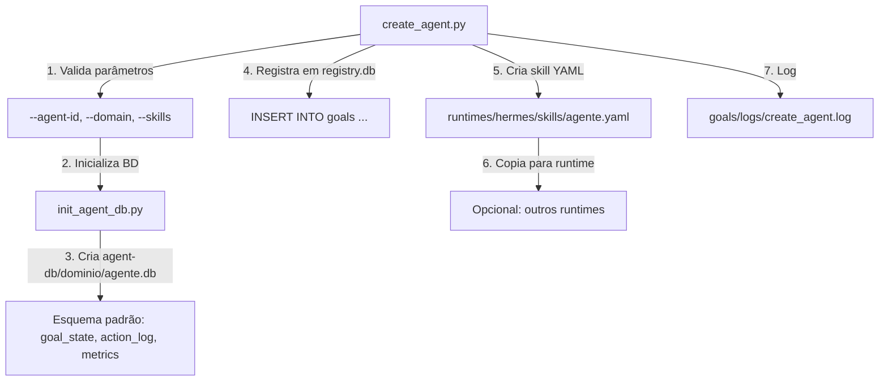
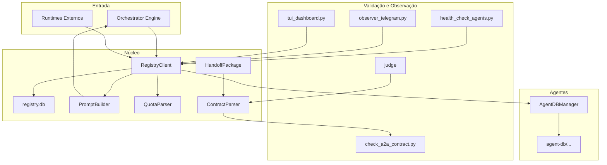

# 🔧 Procedimento Operacional Padrão — Domínio `goals/`

**Objetivo**: Estabelecer o fluxo de trabalho, a arquitetura de componentes e as regras de utilização do domínio `goals/` do ecossistema MANTIS Agentic, incluindo a conexão de IAs, formação de grupos de trabalho, mecanismos de segurança e manutenção do sistema.

**Público-alvo**: Arquitetos humanos, agentes mestres (Tier ≥2), orquestrador central.

---

## 1. Visão Geral do Ecossistema `goals/`

O domínio `goals/` é o **motor de autonomia** do ecossistema MANTIS. Ele gerencia metas declarativas, coordena agentes especializados, garante rastreabilidade completa via contrato A2A (C9) e permite a operação contínua por dias, mesmo com interrupções de créditos dos provedores de IA.

### 1.1 Princípios Fundamentais

| Princípio | Descrição |
|-----------|-----------|
| **Autocontido** | O domínio não importa código de outros domínios. Todas as dependências estão em `goals/libs/` e `goals/schemas/`. |
| **Singleton** | Cada agente é dono exclusivo de sua base SQLite em `agent-db/<domínio>/`. Nenhum outro agente pode escrever nela. |
| **CAS Atômico** | O registro central (`registry.db`) usa `lock_version` e `UPDATE...WHERE` para garantir atomicidade em concorrência. |
| **C9 (A2A)** | Toda transferência de controle entre agentes mestres é registrada em `trace.json` e `status.json`, validados por JSON Schema. |
| **Reativação Automática** | Metas pausadas por falta de créditos são reativadas automaticamente com base nas políticas de recarga dos provedores. |

---

## 2. Estrutura de Diretórios e Artefatos

```
goals/
├── registry.db                   # Banco central transacional (ACID, CAS)
├── completed.yaml                # Bitácora imutável de metas finalizadas
├── budget.yaml                   # Orçamentos de tokens/tempo por agente
├── provider-policies.yaml        # Políticas de recarga de 15 provedores
├── observer-config.yaml          # Configuração do observer Telegram
├── sync-config.yaml              # Configuração de sincronização externa
├── agent-db/                     # Bases SQLite individuais (Singleton)
│   ├── programming/              # Agentes de programação
│   ├── configurations/           # Agentes de infraestrutura
│   ├── docs/                     # Agentes de documentação
│   ├── agents/                   # Agentes de QA/CI-CD
│   ├── workflow/                 # Agentes de workflow
│   └── runtime/                  # Agentes de runtime
├── schemas/                      # JSON Schemas (status, trace, judge-output)
├── scripts/                      # Scripts Python (inicialização, validação, manutenção)
├── libs/                         # Bibliotecas (RegistryClient, AgentDBManager, etc.)
├── templates/                    # Modelos de trace.json e status.json
├── continuation/                 # Prompt de continuação
├── judge/                        # Configuração e prompt do juiz de qualidade
├── runbooks/                     # Documentação operacional
├── recursive-test/               # Suíte de testes (unitários, integração, estresse)
├── dashboard/                    # Dashboard web
├── mcp-deploy/                   # Dockerfile, docker-compose, backup, DRP
└── runtimes/                     # Conectores para sistemas externos
    ├── hermes/
    ├── paperclip/
    ├── claude-code/
    ├── codex/
    ├── antigravity/
    ├── opencode/
    ├── deepseek/
    ├── qwen/
    └── minimax/
```

---

## 3. Fluxo de Trabalho Padrão

### 3.1 Conexão da IA Agêntica



**Descrição**:
1. O Orquestrador consulta `registry.db` para obter metas ativas.
2. O agente adquire a meta com `acquire_goal()`, que usa CAS (Compare-and-Swap) via SQL atômico.
3. O agente registra seu progresso em sua própria base (`agent-db/<domínio>/<agente>.db`), sem interferir em outras bases.
4. Ao finalizar, o agente gera `status.json` (via `HandoffPackage`) e libera a meta.
5. O contrato A2A é validado pelo script `check_a2a_contract.py`.

### 3.2 Formação de Grupos de Trabalho



**Estratégias de Coordenação**:
- `sequential`: cada agente depende do `span_id` do anterior (parent_span_id).
- `parallel`: todos os agentes disparam simultaneamente com `parent_span_id=null`.
- `pipeline`: semelhante ao sequencial, mas com sobreposição parcial.

### 3.3 Uso por um Único Agente



### 3.4 Uso por Enxame de Agentes



---

## 4. Funcionamento do Juiz de Qualidade



**Critérios de Avaliação**:
- Completitude (peso 0.40)
- Consistência (peso 0.25)
- Compliance (peso 0.25)
- Elegância (peso 0.10)

**Ativação**: Apenas em casos de request ambígua, falha de auditoria, disputa de qualidade ou operação destrutiva.

---

## 5. Conexão das Bases de Dados



**Regras**:
- `RegistryClient`: único ponto de acesso ao `registry.db`.
- `AgentDBManager`: único ponto de acesso à base do agente. Verifica `agent_id` antes de permitir escrita.
- **CEOs**: podem ler bases de seus subordinados em modo read-only, mas nunca escrever.
- **Dashboard/Observer**: leem `registry.db` e bases de agentes para monitoramento.

---

## 6. Adição de Novos Agentes



**Procedimento Manual** (detalhado em `AGENT-CREATION-PROTOCOL.md`):
1. Definir o agente com frontmatter canônico (`agent_role`, `skills`, `domain`).
2. Executar `python3 goals/scripts/create_agent.py --agent-id <id> --domain <domínio> --skills <skills>`.
3. O agente agora pode ser invocado por qualquer runtime que leia `registry.db`.

---

## 7. Mecanismos de Segurança Incorporados

| Mecanismo | Descrição | Localização |
|-----------|-----------|-------------|
| **CAS Atômico** | `UPDATE...WHERE lock_version=X` previne sobrescrição concorrente. | `libs/registry_client.py` |
| **Singleton** | `AgentDBManager` rejeita abertura de base que não pertence ao agente. | `libs/agent_db_manager.py` |
| **C9 Validation** | `status.json` e `trace.json` validados contra JSON Schema. | `libs/contract_parser.py`, `scripts/check_a2a_contract.py` |
| **API Key** | Servidor MCP exige header `X-API-Key`. | `mcp-deploy/server.py` |
| **Rate Limiting** | 100 req/min por IP (slowapi). | `mcp-deploy/server.py` |
| **Health Check** | Endpoint `/health` público sem detalhes internos. | `mcp-deploy/server.py` |
| **Heartbeat** | `health_check_agents.py` detecta agentes caídos e libera locks. | `scripts/health_check_agents.py` |
| **Backup com Integridade** | `backup.py` verifica `PRAGMA integrity_check` antes de copiar. | `mcp-deploy/backup.py` |
| **Rotação Segura** | `rotate_agent_db.py` consulta heartbeat antes de deletar bases antigas. | `scripts/rotate_agent_db.py` |

---

## 8. Função dos Scripts em `goals/scripts/`

| Script | Função | Uso Principal |
|--------|--------|---------------|
| `init_registry.py` | Cria `registry.db` com esquema SQL. | Primeira execução do sistema. |
| `init_agent_db.py` | Cria a base SQLite de um agente. | Adição de novos agentes. |
| `create_agent.py` | Automação completa de criação de agente. | Expansão do ecossistema. |
| `check_a2a_contract.py` | Valida contrato C9 (trace.json + status.json). | Handoffs entre agentes. |
| `validate_registry.py` | Verifica integridade do `registry.db`. | Manutenção periódica. |
| `health_check_agents.py` | Detecta agentes sem heartbeat. | Monitoramento. |
| `rotate_agent_db.py` | Remove bases antigas com segurança. | Housekeeping. |
| `compact_logs.py` | Comprime logs antigos (gzip). | Gestão de espaço. |
| `tui_dashboard.py` | Dashboard interativo no terminal (Kanban). | Supervisão em tempo real. |
| `tui_validator.py` | Menu unificado de validação e manutenção. | Operações rápidas. |
| `observer_telegram.py` | Notifica eventos no Telegram e responde comandos. | Monitoramento remoto. |
| `team_orchestrator.py` | Divide metas de equipe e coordena handoffs. | Trabalho em grupo. |
| `migrate_teams.py` | Adiciona colunas `assigned_team` e `coordination_strategy`. | Migração de esquema. |
| `mcp_server.py` | Servidor MCP (stdin/stdout) para sistemas externos. | Integração com IDEs. |
| `sync_to_supabase.py` | Sincroniza `registry.db` com Supabase (free tier). | Backup externo opcional. |
| `sync_to_qdrant.py` | Sincroniza `registry.db` com Qdrant (busca vetorial). | Analytics opcional. |

---

## 9. Inter-relação dos Componentes Internos



---

## 10. Procedimento de Recuperação de Desastres

Consulte `goals/mcp-deploy/DISASTER-RECOVERY.md` para o plano completo. Em resumo:

1. **Detectar**: `health_check_agents.py` ou `/health` do servidor MCP.
2. **Parar**: `docker compose down`.
3. **Resguardar**: `mv data/registry.db data/registry.db.corrupto`.
4. **Restaurar**: `cp backups/<timestamp>/registry.db data/`.
5. **Reiniciar**: `docker compose up -d`.

---

## 11. Referências Cruzadas

| Documento | Localização |
|-----------|-------------|
| Regra C9 (A2A) | `01-RULES/11-A2A-COMMUNICATION-RULES.md` |
| Protocolo de Criação de Agentes | `goals/AGENT-CREATION-PROTOCOL.md` |
| Runbook de Locks | `goals/runbooks/lock-protocol.md` |
| Runbook de Rotação de DBs | `goals/runbooks/db-rotation.md` |
| Runbook de Diagnóstico C9 | `goals/runbooks/c9-failure-diagnosis.md` |
| DRP | `goals/mcp-deploy/DISASTER-RECOVERY.md` |
| Config do Observer | `goals/observer-config.yaml` |
| Config de Sync | `goals/sync-config.yaml` |
| Políticas de Provedores | `goals/provider-policies.yaml` |
| Orçamentos | `goals/budget.yaml` |

---

> **Versão 2.0.0** | Procedimento Operacional Padrão do domínio `goals/` — MANTIS Agentic.
> Aplicável a partir de 2026-05-23.
