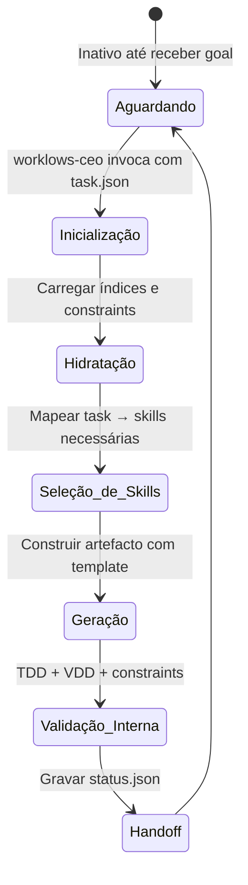
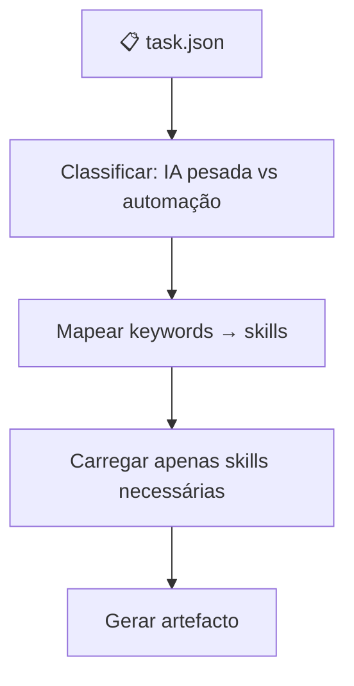
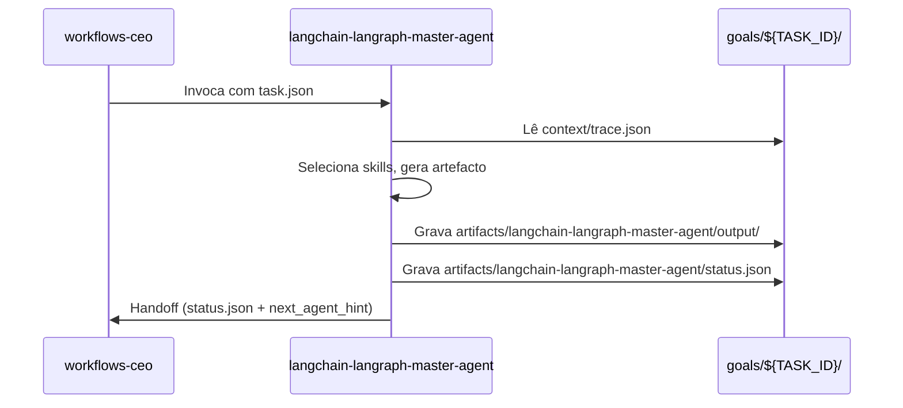
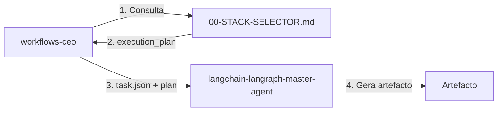

# 🧠 Procedimento Operacional Padrão — LangChain/LangGraph: Master Agent

**Objetivo**: Definir o funcionamento, inicialização, governança e ciclo de vida do `langchain-langraph-master-agent` como motor central de IA pesada dentro do ecossistema MANTIS, coordenado pelo `workflows-ceo` e orientado pelo `00-STACK-SELECTOR.md`.

**Público-alvo**: Arquitetos humanos, agentes mestres, engenheiros de IA, orquestrador principal.

---

## 1. Papel do Master Agent

O `langchain-langraph-master-agent` é o **cérebro executável** do domínio `04-WORKFLOWS/langchain-langraph/`. Ele:

- Centraliza as regras de **hardening**, **observabilidade** e **constraints** (C1‑C9) para todos os artefactos do domínio.
- Referencia **156 skills** organizadas em 12 subdomínios, carregando‑as **sob demanda** conforme a tarefa.
- Interage com o sistema de metas (`goals/`) via protocolo A2A (C9).
- É invocado exclusivamente pelo `workflows-ceo`, que antes consulta o `00-STACK-SELECTOR.md` para determinar se a tarefa exige IA pesada (LangChain/LangGraph) ou automação visual (n8n).

---

## 2. Ciclo de Vida do Master Agent



---

## 3. Inicialização e Contexto

Ao ser acionado, o master agent executa obrigatoriamente:

```bash
# 1. Contexto distribuído (A2A / C9)
TASK_ID="${TASK_ID:?}"
TRACE_CTX="./goals/${TASK_ID}/context/trace.json"
TRACE_ID=$(jq -r '.trace_id' "$TRACE_CTX")
PARENT_SPAN_ID=$(jq -r '.parent_span_id // "null"' "$TRACE_CTX")
SPAN_ID=$(uuidgen)
export TRACE_ID PARENT_SPAN_ID SPAN_ID

# 2. Carregar índice canônico
CANONICAL_INDEX="https://raw.githubusercontent.com/.../04-WORKFLOWS/langchain-langraph/libs/00-INDEX.md"

# 3. Hidratar constraints e hardening
source <(curl -s https://raw.githubusercontent.com/.../01-RULES/harness-norms-v3.0.md)
```

---

## 4. Seleção Condicional de Skills

O master agent NUNCA carrega todas as 156 skills. Ele utiliza a matriz de decisão embutida no próprio agente (ou fornecida pelo `execution_plan.json` do CEO) para selecionar apenas as skills relevantes.



### Exemplo de mapeamento

| Palavra-chave na descrição | Skills carregadas |
|---------------------------|-------------------|
| `rag`, `retrieval`, `embedding` | `02-rag/rag-fundamentals`, `02-rag/rag-embeddings` |
| `swarm`, `multi-agent`, `handoff` | `11-swarm-supervisor/swarm-fundamentals` |
| `graph`, `stategraph`, `node` | `12-langgraph-api/graph-api-fundamentals` |
| `interrupt`, `hitl`, `approval` | `12-langgraph-api/interrupts-patterns` |
| `retry`, `timeout`, `fault` | `12-langgraph-api/fault-tolerance-patterns` |

---

## 5. Geração de Artefactos

Todo artefacto gerado segue o **template modular v2.3.0**:

1. **Frontmatter YAML** com `artifact_id`, `constraints_mapped`, `validation_command`.
2. **Bootstrap resiliente** com fallback `mantis_log`.
3. **Lógica de domínio** (≥500 linhas de código).
4. **Testes TDD** (AAA).
5. **Validação VDD** (`orchestrator-engine.sh`).
6. **Wikilinks canônicos**.

O artefacto é salvo em `04-WORKFLOWS/langchain-langraph/libs/<subdominio>/`.

---

## 6. Integração com `goals/` e Handoff



O `status.json` segue o schema A2A:

```json
{
  "agent_id": "langchain-langraph-master-agent",
  "trace_id": "<trace_id>",
  "span_id": "<span_id>",
  "parent_span_id": "<parent_span_id>",
  "status": "completed",
  "output_ref": "04-WORKFLOWS/langchain-langraph/libs/.../<artefacto>.md",
  "next_agent_hint": "null|n8n-master-agent|lgpd-guard",
  "timestamp_completed": "<ISO8601>",
  "a2a_contract_version": "1.0"
}
```

---

## 7. Conexão com o Stack Selector

O master agent **não consulta diretamente** o `00-STACK-SELECTOR.md`. Essa consulta é feita pelo `workflows-ceo` antes de invocá‑lo. O CEO entrega um `execution_plan.json` que já contém:

- `selected_engine`: `"langchain-langraph"`
- `required_skills`: lista de caminhos para as skills a serem carregadas.
- `lgpd_guard_required`: se `true`, o master agent aciona o `lgpd-guard` antes de processar.



---

## 8. Observabilidade e Logging

Toda operação do master agent gera logs estruturados via `mantis_log()`:

```python
mantis_log("INFO", "skill_loaded", f"Skill={skill_id}, Task={TASK_ID}")
mantis_log("INFO", "artifact_generated", f"Path={output_path}, Lines={lines}")
mantis_log("INFO", "handoff_complete", f"NextAgent={next_agent}")
```

Os logs são enviados ao coletor OpenTelemetry configurado no ambiente.

---

## 9. Métricas de Qualidade

| Métrica | Meta | Medição |
|---------|------|---------|
| Pass Rate em Validação | ≥95% | `orchestrator-engine --json` |
| Skills carregadas por tarefa | ≤5 | Log de inicialização |
| Tempo médio de geração | ≤60s | `performance_ms` |
| Handoffs com trace íntegro | 100% | `check_a2a_contract.sh` |

---

## 10. Troubleshooting

| Sintoma | Causa Provável | Solução |
|---------|---------------|---------|
| Master agent não inicia | `TASK_ID` não definido | Verificar injeção do CEO |
| Skill não encontrada | Caminho incorreto no execution_plan | Validar `00-INDEX.md` |
| Geração falha na validação | Constraint violada | Executar `orchestrator-engine.sh` localmente |
| Handoff não reconhecido | `status.json` ausente | Verificar permissões de escrita em `goals/` |

---

## 11. Referências Cruzadas

- [[04-WORKFLOWS/langchain-langraph/langchain-langraph-master-agent.md]]
- [[04-WORKFLOWS/00-STACK-SELECTOR.md]]
- [[04-WORKFLOWS/workflows-ceo.md]]
- [[04-WORKFLOWS/langchain-langraph/libs/00-INDEX.md]]
- [[05-CONFIGURATIONS/validation/orchestrator-engine.sh]]
- [[goals/README.md]]
- [[01-RULES/11-A2A-COMMUNICATION-RULES.md]]

---

> **Versão 2.3.0** | Procedimento Operacional Padrão do `langchain-langraph-master-agent` — MANTIS Agentic.
> Aplicável a partir de 2026-05-28.
