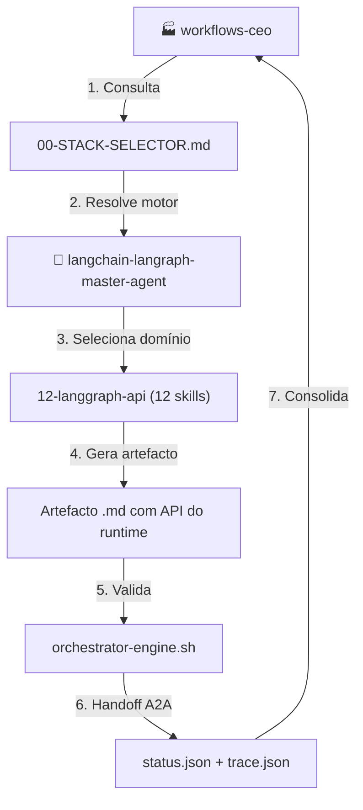
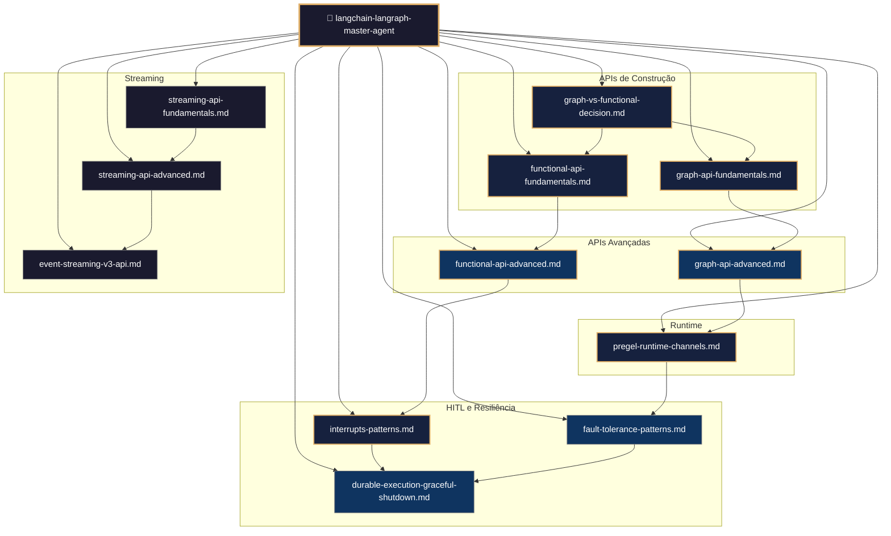
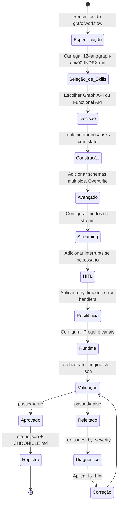
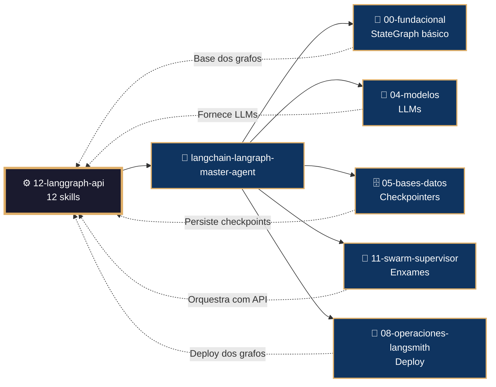

# ⚙️ Procedimento Operacional Padrão — LangChain/LangGraph: APIs do Runtime

**Objetivo**: Estabelecer o fluxo de trabalho completo para construção de grafos, uso da Functional API, streaming, HITL, tolerância a falhas e operação do runtime Pregel usando as 12 skills do subdomínio `12-langgraph-api` no ecossistema LangChain/LangGraph dentro de `04-WORKFLOWS/langchain-langraph/`.

**Público-alvo**: Arquitetos humanos, agentes mestres, engenheiros de IA, desenvolvedores Python, operadores de runtime.

---

## 1. Visão Geral do Subdomínio

O subdomínio `12-langgraph-api` contém **12 skills** que expõem as APIs e o runtime do LangGraph:

| # | Skill | Propósito |
|---|-------|-----------|
| 1 | `graph-api-fundamentals.md` | StateGraph, nós, arestas, Command, Send |
| 2 | `functional-api-fundamentals.md` | @entrypoint, @task, short-term memory |
| 3 | `graph-vs-functional-decision.md` | Matriz de decisão entre APIs |
| 4 | `graph-api-advanced.md` | Múltiplos schemas, Overwrite, caching |
| 5 | `functional-api-advanced.md` | HITL, streaming, retry, timeout, caching |
| 6 | `streaming-api-fundamentals.md` | Stream modes, v2 format, filtros |
| 7 | `streaming-api-advanced.md` | Subgrafo, modelos arbitrários, diagnóstico |
| 8 | `interrupts-patterns.md` | HITL com interrupt(), múltiplos interrupts |
| 9 | `pregel-runtime-channels.md` | Pregel engine e canais de estado |
| 10 | `durable-execution-graceful-shutdown.md` | Execução durável e graceful shutdown |
| 11 | `fault-tolerance-patterns.md` | Retry, timeout e error handlers |
| 12 | `event-streaming-v3-api.md` | Event streaming v3 com projeções tipadas |

### 1.1 Conexão com o Ecossistema `goals/`



---

## 2. Mapa de Skills e Inter-relações



---

## 3. Fluxo de Geração de Artefacto da API



---

## 4. Conexão com Outros Domínios



---

## 5. Estrutura de Diretórios

```
04-WORKFLOWS/langchain-langraph/libs/12-langgraph-api/
├── graph-api-fundamentals.md             # StateGraph, nós, arestas
├── functional-api-fundamentals.md        # @entrypoint, @task
├── graph-vs-functional-decision.md       # Matriz de decisão
├── graph-api-advanced.md                 # Múltiplos schemas
├── functional-api-advanced.md            # HITL, streaming, retry
├── streaming-api-fundamentals.md         # Stream modes, v2
├── streaming-api-advanced.md             # Subgrafo, diagnóstico
├── interrupts-patterns.md                # HITL com interrupt
├── pregel-runtime-channels.md            # Pregel e canais
├── durable-execution-graceful-shutdown.md # Execução durável
├── fault-tolerance-patterns.md           # Retry, timeout
└── event-streaming-v3-api.md             # Event streaming v3
```

---

## 6. Exemplos de Código e Padrões

### 6.1 StateGraph com Command (graph-api-fundamentals.md)

```python
from langgraph.graph import StateGraph, START, END
from langgraph.types import Command
from typing_extensions import TypedDict, Literal

class State(TypedDict):
    contador: int

def node_a(state: State) -> Command[Literal["node_b", END]]:
    if state["contador"] > 5:
        return Command(goto=END)
    return Command(goto="node_b", update={"contador": state["contador"] + 1})

builder = StateGraph(State)
builder.add_node("node_a", node_a)
builder.add_edge(START, "node_a")
graph = builder.compile()
```

### 6.2 Functional API com @entrypoint (functional-api-fundamentals.md)

```python
from langgraph.func import entrypoint, task
from langgraph.checkpoint.memory import InMemorySaver

@task
def processar(dado: str) -> str:
    return dado.upper()

@entrypoint(checkpointer=InMemorySaver())
def workflow(dados: dict) -> dict:
    resultado = processar(dados["input"]).result()
    return {"output": resultado}
```

### 6.3 Decisão Graph vs Functional (graph-vs-functional-decision.md)

```python
from graph_vs_functional_decision import APIDecisionEngine, WorkflowCharacteristics

engine = APIDecisionEngine()
chars = WorkflowCharacteristics(
    has_complex_branching=True,
    has_parallel_execution=True,
    needs_visualization=True
)
result = engine.analyze(chars)
# result["recommendation"] == "graph"
```

### 6.4 Interrupt para HITL (interrupts-patterns.md)

```python
from langgraph.types import interrupt, Command

def approval_node(state):
    decision = interrupt({"question": "Aprovar?", "details": state["action"]})
    return {"status": "approved" if decision else "rejected"}

# Executar até o interrupt
config = {"configurable": {"thread_id": "1"}}
result = graph.invoke({"action": "transferir R$500"}, config, version="v2")

# Retomar com resposta
graph.invoke(Command(resume=True), config, version="v2")
```

### 6.5 Tolerância a Falhas (fault-tolerance-patterns.md)

```python
from langgraph.types import RetryPolicy, TimeoutPolicy
from langgraph.errors import NodeError

builder.add_node(
    "call_api",
    call_api,
    retry_policy=RetryPolicy(max_attempts=3, retry_on=ConnectionError),
    timeout=TimeoutPolicy(run_timeout=30),
    error_handler=compensation_handler
)
```

### 6.6 Event Streaming v3 (event-streaming-v3-api.md)

```python
stream = graph.stream_events(inputs, version="v3")

for message in stream.messages:
    print(message.text, end="", flush=True)

final_state = stream.output
```

---

## 7. Processo de Validação

### 7.1 Comandos de Validação por Artefacto

```bash
# Validação de skill individual
bash 05-CONFIGURATIONS/validation/orchestrator-engine.sh \
  --file 04-WORKFLOWS/langchain-langraph/libs/12-langgraph-api/graph-api-fundamentals.md \
  --json

# Validação completa do subdomínio 12-langgraph-api
for f in 04-WORKFLOWS/langchain-langraph/libs/12-langgraph-api/*.md; do
  bash 05-CONFIGURATIONS/validation/orchestrator-engine.sh --file "$f" --json
done
```

### 7.2 Checklist de Validação

| # | Verificação | Constraint | Comando | ✅ Esperado |
|---|---|---|---|---|
| 1 | Frontmatter YAML válido | C5 | `validate-frontmatter.sh` | passed=true |
| 2 | Bootstrap com mantis_log | C8 | `grep 'def mantis_log' <file>` | Encontrado |
| 3 | Testes TDD presentes | C5 | `grep 'def test_' <file>` | ≥3 testes |
| 4 | State/entrypoint definido | C5 | `grep 'State\|@entrypoint\|@task' <file>` | Explícito |
| 5 | Streaming configurado | C8 | `grep 'stream\|stream_events' <file>` | Modo documentado |
| 6 | HITL com interrupt | C7 | `grep 'interrupt\|Command.resume' <file>` | Presente se aplicável |
| 7 | Retry/timeout configurado | C1 | `grep 'RetryPolicy\|TimeoutPolicy' <file>` | Se API externa |
| 8 | Sem secrets hardcoded | C3 | `audit-secrets.sh` | Zero violações |

---

## 8. Troubleshooting

| Sintoma | Causa Provável | Diagnóstico | Solução |
|---------|---------------|-------------|---------|
| `StateGraph não compila` | Schema inválido | `builder.compile()` | Verificar TypedDict e reducers |
| `@task não executa` | Chamado fora de entrypoint | `task_function()` | Invocar apenas dentro de @entrypoint |
| `Stream v2 sem output` | `version="v2"` ausente | `graph.stream(..., version="v2")` | Adicionar parâmetro |
| `Interrupt não pausa` | Checkpointer ausente | `graph.compile(checkpointer=...)` | Adicionar checkpointer |
| `Retry não ocorre` | Exceção não está em `retry_on` | `RetryPolicy(retry_on=...)` | Expandir lista de exceções |
| `Event streaming v3 não funciona` | LangGraph < 1.2 | `pip show langgraph` | Atualizar para >=1.2 |
| `Graceful shutdown não drena` | RunControl não passado | `graph.invoke(..., control=control)` | Passar RunControl |

---

## 9. Referências Cruzadas

- [[04-WORKFLOWS/langchain-langraph/langchain-langraph-master-agent.md]]
- [[04-WORKFLOWS/langchain-langraph/libs/12-langgraph-api/graph-api-fundamentals.md]]
- [[04-WORKFLOWS/langchain-langraph/libs/12-langgraph-api/functional-api-fundamentals.md]]
- [[04-WORKFLOWS/langchain-langraph/libs/12-langgraph-api/graph-vs-functional-decision.md]]
- [[04-WORKFLOWS/langchain-langraph/libs/12-langgraph-api/streaming-api-fundamentals.md]]
- [[04-WORKFLOWS/langchain-langraph/libs/12-langgraph-api/streaming-api-advanced.md]]
- [[04-WORKFLOWS/langchain-langraph/libs/12-langgraph-api/event-streaming-v3-api.md]]
- [[04-WORKFLOWS/langchain-langraph/libs/12-langgraph-api/interrupts-patterns.md]]
- [[04-WORKFLOWS/langchain-langraph/libs/12-langgraph-api/durable-execution-graceful-shutdown.md]]
- [[04-WORKFLOWS/langchain-langraph/libs/12-langgraph-api/fault-tolerance-patterns.md]]
- [[04-WORKFLOWS/langchain-langraph/libs/12-langgraph-api/pregel-runtime-channels.md]]
- [[04-WORKFLOWS/workflows-ceo.md]]
- [[04-WORKFLOWS/00-STACK-SELECTOR.md]]
- [[05-CONFIGURATIONS/validation/orchestrator-engine.sh]]
- [[07-PROCEDURES/swarm-supervisor-langchain-langraph-sop.md]]
- [[07-PROCEDURES/langchain-langraph-master-agent-sop.md]]

---

> **Versão 2.3.0** | Procedimento Operacional Padrão do subdomínio `12-langgraph-api` — MANTIS Agentic.
> Aplicável a partir de 2026-05-28.
