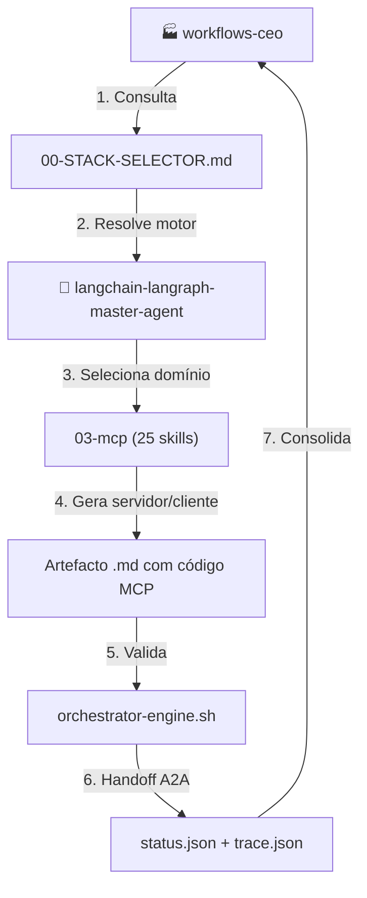
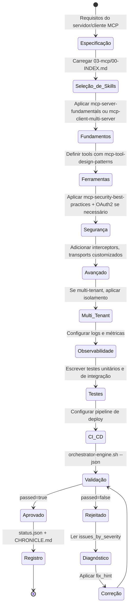
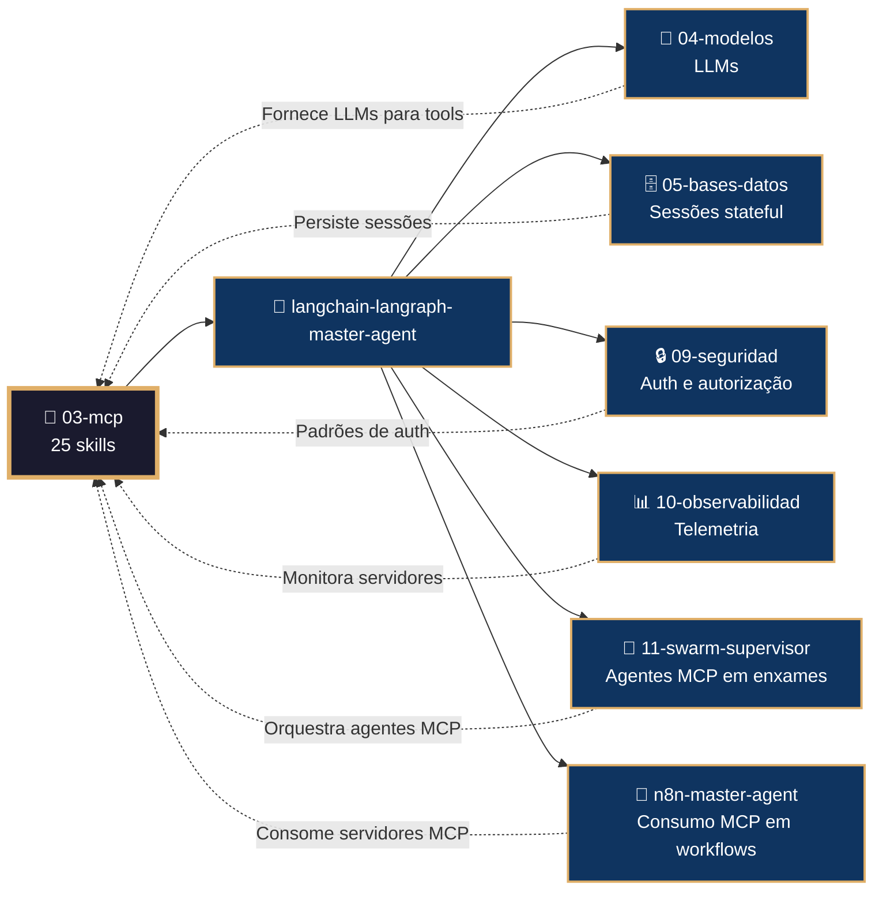

# 📡 Procedimento Operacional Padrão — LangChain/LangGraph: MCP (Model Context Protocol)

**Objetivo**: Estabelecer o fluxo de trabalho completo para criação, validação, deploy e operação de servidores, clientes e integrações MCP usando as 25 skills do subdomínio `03-mcp` no ecossistema LangChain/LangGraph dentro de `04-WORKFLOWS/langchain-langraph/`.

**Público-alvo**: Arquitetos humanos, agentes mestres, engenheiros de integração, desenvolvedores multi-linguagem (Python, TypeScript, Go, Java), especialistas em segurança.

---

## 1. Visão Geral do Subdomínio

O subdomínio `03-mcp` contém **25 skills** que cobrem o protocolo MCP completo:

| # | Skill | Propósito |
|---|-------|-----------|
| 1 | `mcp-server-fundamentals.md` | Criação de servidores MCP com FastMCP |
| 2 | `mcp-client-multi-server.md` | Conexão a múltiplos servidores com autenticação |
| 3 | `mcp-interceptors-middleware.md` | Injeção de contexto, retry, Command |
| 4 | `mcp-advanced-features.md` | Conteúdo estruturado, elicitação, multimodal |
| 5 | `mcp-enterprise-deployment.md` | Deploy empresarial com segurança |
| 6 | `mcp-tool-design-patterns.md` | Padrões de design de ferramentas |
| 7 | `mcp-security-best-practices.md` | Segurança: autenticação, autorização, sanitização |
| 8 | `mcp-observability-logging.md` | OpenTelemetry, Prometheus, logs JSONL |
| 9 | `mcp-testing-strategies.md` | Testes unitários, integração e mock |
| 10 | `mcp-java-spring-implementation.md` | Implementação em Java/Spring Boot |
| 11 | `mcp-state-management-sessions.md` | Sessões stateful com Redis/PostgreSQL |
| 12 | `mcp-versioning-lifecycle.md` | Versionamento do protocolo MCP |
| 13 | `mcp-custom-transports.md` | Transportes: WebSocket, gRPC, Redis Pub/Sub |
| 14 | `mcp-langchain-tools-integration.md` | Integração MCP ↔ LangChain tools |
| 15 | `mcp-production-patterns.md` | Padrões de produção: cache, rate limiting |
| 16 | `mcp-resource-management.md` | Gerenciamento de recursos MCP |
| 17 | `mcp-prompts-management.md` | Gerenciamento de prompts MCP |
| 18 | `mcp-error-handling-patterns.md` | Tratamento de erros JSON-RPC |
| 19 | `mcp-typescript-node-implementation.md` | Implementação em TypeScript/Node.js |
| 20 | `mcp-go-implementation.md` | Implementação em Go |
| 21 | `mcp-oauth2-authentication.md` | Autenticação OAuth2 em servidores MCP |
| 22 | `mcp-multi-tenancy-isolation.md` | Isolamento multi-tenant |
| 23 | `mcp-cicd-deployment.md` | CI/CD para servidores MCP |
| 24 | `mcp-performance-tuning.md` | Tuning de performance |
| 25 | `mcp-compliance-governance.md` | Compliance LGPD e auditoria |

### 1.1 Conexão com o Ecossistema `goals/`



---

## 2. Mapa de Skills e Inter-relações

```mermaid
graph TD
    MASTER["🦜 langchain-langraph-master-agent"]:::foundation

    subgraph "Fundamentos"
        FUND["mcp-server-fundamentals.md"]:::core
        CLIENT["mcp-client-multi-server.md"]:::core
        TOOLS["mcp-tool-design-patterns.md"]:::core
    end

    subgraph "Segurança"
        SEC["mcp-security-best-practices.md"]:::security
        OAUTH["mcp-oauth2-authentication.md"]:::security
        MULTI_TENANT["mcp-multi-tenancy-isolation.md"]:::security
    end

    subgraph "Avançado"
        INTERCEPTOR["mcp-interceptors-middleware.md"]:::advanced
        ADV_FEAT["mcp-advanced-features.md"]:::advanced
        TRANSPORT["mcp-custom-transports.md"]:::advanced
        STATE["mcp-state-management-sessions.md"]:::advanced
    end

    subgraph "Operações"
        ENTERPRISE["mcp-enterprise-deployment.md"]:::operations
        PROD["mcp-production-patterns.md"]:::operations
        CICD["mcp-cicd-deployment.md"]:::operations
        PERF["mcp-performance-tuning.md"]:::operations
        OBS["mcp-observability-logging.md"]:::operations
    end

    subgraph "Qualidade"
        TEST["mcp-testing-strategies.md"]:::quality
        ERROR["mcp-error-handling-patterns.md"]:::quality
        VERSION["mcp-versioning-lifecycle.md"]:::quality
        COMPLY["mcp-compliance-governance.md"]:::quality
    end

    subgraph "Multi-Linguagem"
        JAVA["mcp-java-spring-implementation.md"]:::lang
        TS["mcp-typescript-node-implementation.md"]:::lang
        GO["mcp-go-implementation.md"]:::lang
        LC_INT["mcp-langchain-tools-integration.md"]:::lang
    end

    subgraph "Recursos"
        RESOURCE["mcp-resource-management.md"]:::resource
        PROMPTS["mcp-prompts-management.md"]:::resource
    end

    MASTER --> FUND
    MASTER --> SEC
    MASTER --> AVANCADO
    MASTER --> OPERACOES
    MASTER --> QUALIDADE
    MASTER --> LANG
    MASTER --> RECURSOS

    FUND --> SEC
    FUND --> INTERCEPTOR
    SEC --> ENTERPRISE
    INTERCEPTOR --> ERROR
    ADV_FEAT --> RESOURCE
    TRANSPORT --> ENTERPRISE
    STATE --> PROD
    TEST --> CICD
    ERROR --> COMPLY
    JAVA --> TEST
    TS --> TEST
    GO --> TEST
    LC_INT --> TOOLS

    classDef foundation fill:#1a1a2e,color:#fff,stroke:#E0AF68,stroke-width:3px
    classDef core fill:#16213e,color:#fff,stroke:#E0AF68,stroke-width:2px
    classDef security fill:#16213e,color:#fff,stroke:#E0AF68,stroke-width:2px
    classDef advanced fill:#0f3460,color:#fff,stroke:#E0AF68,stroke-width:2px
    classDef operations fill:#1a1a2e,color:#fff,stroke:#7f7f7f,stroke-width:1px
    classDef quality fill:#16213e,color:#fff,stroke:#E0AF68,stroke-width:2px
    classDef lang fill:#0f3460,color:#fff,stroke:#7f7f7f,stroke-width:1px
    classDef resource fill:#1a1a2e,color:#fff,stroke:#E0AF68,stroke-width:2px

    class MASTER foundation
    class FUND,CLIENT,TOOLS core
    class SEC,OAUTH,MULTI_TENANT security
    class INTERCEPTOR,ADV_FEAT,TRANSPORT,STATE advanced
    class ENTERPRISE,PROD,CICD,PERF,OBS operations
    class TEST,ERROR,VERSION,COMPLY quality
    class JAVA,TS,GO,LC_INT lang
    class RESOURCE,PROMPTS resource
```



---

## 3. Fluxo de Geração de Servidor/Cliente MCP



---

## 4. Conexão com Outros Domínios



---

## 5. Estrutura de Diretórios

```
04-WORKFLOWS/langchain-langraph/libs/03-mcp/
├── mcp-server-fundamentals.md           # FastMCP, ferramentas, recursos
├── mcp-client-multi-server.md           # MultiServerMCPClient
├── mcp-interceptors-middleware.md       # Interceptors e middleware
├── mcp-advanced-features.md             # StructuredContent, elicitação
├── mcp-enterprise-deployment.md         # Deploy empresarial
├── mcp-tool-design-patterns.md          # Schemas Pydantic, async
├── mcp-security-best-practices.md       # Auth middleware, sanitização
├── mcp-observability-logging.md         # OpenTelemetry, Prometheus
├── mcp-testing-strategies.md            # pytest, mock
├── mcp-java-spring-implementation.md    # @Tool, @Service
├── mcp-state-management-sessions.md     # Redis, PostgreSQL
├── mcp-versioning-lifecycle.md          # Negociação de versão
├── mcp-custom-transports.md             # WebSocket, gRPC
├── mcp-langchain-tools-integration.md   # Conversão MCP ↔ LangChain
├── mcp-production-patterns.md           # Cache, rate limiting
├── mcp-resource-management.md           # Recursos estáticos, templates
├── mcp-prompts-management.md            # Templates de prompts
├── mcp-error-handling-patterns.md       # JSON-RPC errors, retry
├── mcp-typescript-node-implementation.md # McpServer, zod
├── mcp-go-implementation.md             # mcp.NewServer
├── mcp-oauth2-authentication.md         # client_credentials
├── mcp-multi-tenancy-isolation.md       # RLS, namespaces
├── mcp-cicd-deployment.md               # GitHub Actions, Docker
├── mcp-performance-tuning.md            # uvloop, orjson
└── mcp-compliance-governance.md         # LGPD, auditoria
```

---

## 6. Exemplos de Código e Padrões

### 6.1 Servidor MCP Básico com FastMCP (mcp-server-fundamentals.md)

```python
from fastmcp import FastMCP

mcp = FastMCP("Meu Servidor")

@mcp.tool()
def somar(a: int, b: int) -> int:
    """Soma dois números."""
    return a + b

@mcp.resource("config://app")
def get_config() -> str:
    return '{"version": "1.0", "debug": false}'

@mcp.prompt()
def saudacao(nome: str) -> str:
    return f"Olá, {nome}! Como posso ajudar?"

mcp.run(transport="stdio")
```

### 6.2 Cliente Multi-Servidor (mcp-client-multi-server.md)

```python
from langchain_mcp_adapters import MultiServerMCPClient

client = MultiServerMCPClient(
    {
        "math": {
            "command": "python",
            "args": ["math_server.py"],
            "transport": "stdio",
        },
        "weather": {
            "url": "http://localhost:8000/mcp",
            "transport": "sse",
            "headers": {"Authorization": "Bearer token123"}
        }
    }
)

tools = client.get_tools()
print(tools)  # Lista combinada de ferramentas
```

### 6.3 Interceptor com Retry (mcp-interceptors-middleware.md)

```python
from fastmcp import FastMCP
from fastmcp.interceptors import Interceptor

class RetryInterceptor(Interceptor):
    async def intercept(self, request, handler):
        for attempt in range(3):
            try:
                return await handler(request)
            except Exception as e:
                if attempt == 2:
                    raise
                await asyncio.sleep(2 ** attempt)

mcp = FastMCP("Servidor com Retry")
mcp.add_interceptor(RetryInterceptor())
```

### 6.4 Autenticação OAuth2 (mcp-oauth2-authentication.md)

```python
from fastmcp import FastMCP
from fastmcp.auth import OAuth2Middleware

mcp = FastMCP("Servidor Protegido")

mcp.add_middleware(
    OAuth2Middleware(
        token_url="https://auth.example.com/token",
        client_id="meu-client",
        client_secret="meu-secret"
    )
)
```

### 6.5 Implementação em Go (mcp-go-implementation.md)

```go
package main

import "github.com/modelcontextprotocol/go-sdk/mcp"

func main() {
    server := mcp.NewServer("Meu Servidor Go")
    
    server.AddTool(mcp.Tool{
        Name: "somar",
        Description: "Soma dois números",
        InputSchema: mcp.ToolInputSchema{
            Type: "object",
            Properties: map[string]interface{}{
                "a": map[string]interface{}{"type": "integer"},
                "b": map[string]interface{}{"type": "integer"},
            },
        },
        Handler: func(args map[string]interface{}) (string, error) {
            a := int(args["a"].(float64))
            b := int(args["b"].(float64))
            return fmt.Sprintf("%d", a+b), nil
        },
    })
    
    server.Run()
}
```

### 6.6 Integração com LangChain Tools (mcp-langchain-tools-integration.md)

```python
from langchain_mcp_adapters import convert_mcp_tool_to_langchain_tool
from langgraph.prebuilt import create_react_agent

mcp_tools = client.get_tools()
langchain_tools = [convert_mcp_tool_to_langchain_tool(t) for t in mcp_tools]

agent = create_react_agent(model, langchain_tools)
```

---

## 7. Processo de Validação

### 7.1 Comandos de Validação por Artefacto

```bash
# Validação de skill individual
bash 05-CONFIGURATIONS/validation/orchestrator-engine.sh \
  --file 04-WORKFLOWS/langchain-langraph/libs/03-mcp/mcp-server-fundamentals.md \
  --json

# Validação completa do subdomínio 03-mcp
for f in 04-WORKFLOWS/langchain-langraph/libs/03-mcp/*.md; do
  bash 05-CONFIGURATIONS/validation/orchestrator-engine.sh --file "$f" --json
done
```

### 7.2 Checklist de Validação

| # | Verificação | Constraint | Comando | ✅ Esperado |
|---|---|---|---|---|
| 1 | Frontmatter YAML válido | C5 | `validate-frontmatter.sh` | passed=true |
| 2 | Bootstrap com mantis_log | C8 | `grep 'def mantis_log' <file>` | Encontrado |
| 3 | Testes TDD presentes | C5 | `grep 'def test_' <file>` | ≥3 testes |
| 4 | Wikilinks canônicos | C5 | `check-wikilinks.sh` | Zero quebrados |
| 5 | Código ≥500 linhas | C5 | `wc -l <file>` | ≥500 |
| 6 | Sem secrets hardcoded | C3 | `audit-secrets.sh` | Zero violações |
| 7 | Servidor expõe healthcheck | C8 | `grep 'health' <file>` | Endpoint documentado |
| 8 | Auth configurada (se aplicável) | C3 | `grep 'OAuth2\|Bearer' <file>` | Middleware presente |

---

## 8. Troubleshooting

| Sintoma | Causa Provável | Diagnóstico | Solução |
|---------|---------------|-------------|---------|
| `FastMCP não inicia` | Transporte inválido | `mcp.run(transport="stdio")` | Verificar transporte |
| `MultiServerMCPClient timeout` | Servidor inacessível | `curl http://localhost:8000/mcp` | Verificar URL e porta |
| `Tool não aparece no cliente` | Schema Pydantic inválido | `print(tool.args_schema.schema())` | Corrigir type hints |
| `Interceptor não executa` | Ordem de registro errada | `mcp.add_interceptor()` | Registrar antes de `run()` |
| `Sessão não persiste` | Redis/Postgres inacessível | `redis-cli ping` | Verificar conexão |
| `OAuth2 token rejeitado` | Client secret expirado | `curl -X POST token_url` | Renovar credenciais |
| `Multi-tenant vazando dados` | Namespace não configurado | `mcp.set_namespace(tenant_id)` | Isolar por tenant |
| `Performance degradation` | Event loop bloqueado | `py-spy top --pid <pid>` | Usar uvloop, orjson |

---

## 9. Referências Cruzadas

- [[04-WORKFLOWS/langchain-langraph/langchain-langraph-master-agent.md]]
- [[04-WORKFLOWS/langchain-langraph/libs/03-mcp/mcp-server-fundamentals.md]]
- [[04-WORKFLOWS/langchain-langraph/libs/03-mcp/mcp-client-multi-server.md]]
- [[04-WORKFLOWS/langchain-langraph/libs/03-mcp/mcp-interceptors-middleware.md]]
- [[04-WORKFLOWS/langchain-langraph/libs/03-mcp/mcp-security-best-practices.md]]
- [[04-WORKFLOWS/langchain-langraph/libs/03-mcp/mcp-langchain-tools-integration.md]]
- [[04-WORKFLOWS/langchain-langraph/libs/03-mcp/mcp-enterprise-deployment.md]]
- [[04-WORKFLOWS/langchain-langraph/libs/03-mcp/mcp-multi-tenancy-isolation.md]]
- [[04-WORKFLOWS/workflows-ceo.md]]
- [[04-WORKFLOWS/00-STACK-SELECTOR.md]]
- [[05-CONFIGURATIONS/validation/orchestrator-engine.sh]]
- [[07-PROCEDURES/rag-langchain-langraph-sop.md]]
- [[07-PROCEDURES/models-ai-langchain-langraph-sop.md]]

---

> **Versão 2.3.0** | Procedimento Operacional Padrão do subdomínio `03-mcp` — MANTIS Agentic.
> Aplicável a partir de 2026-05-28.
