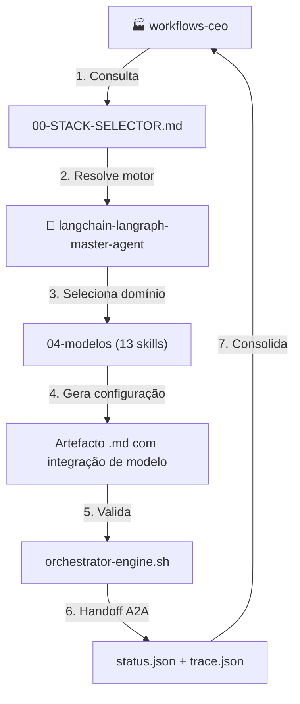
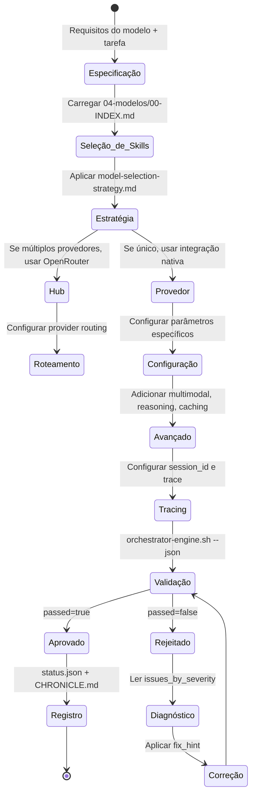
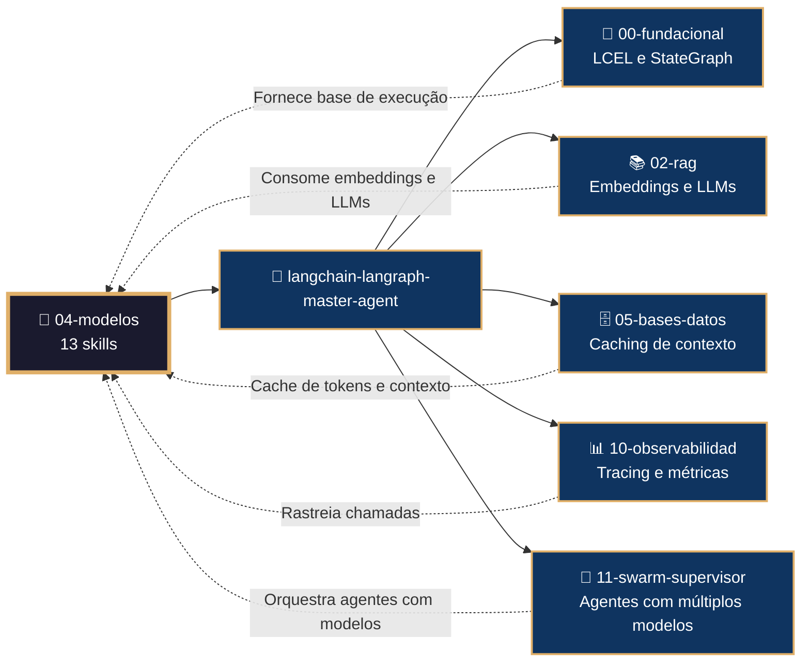

# 🤖 Procedimento Operacional Padrão — LangChain/LangGraph: Integração de Modelos de IA

**Objetivo**: Estabelecer o fluxo de trabalho completo para integração, configuração, troca dinâmica e otimização de modelos de linguagem (LLMs) usando as 13 skills do subdomínio `04-modelos` no ecossistema LangChain/LangGraph dentro de `04-WORKFLOWS/langchain-langraph/`.

**Público-alvo**: Arquitetos humanos, agentes mestres, engenheiros de machine learning, desenvolvedores Python, especialistas em IA.

---

## 1. Visão Geral do Subdomínio

O subdomínio `04-modelos` contém **13 skills** que cobrem a integração com os principais provedores de LLM e funcionalidades avançadas:

| # | Skill | Propósito |
|---|-------|-----------|
| 1 | `multi-model-openrouter-integration.md` | Hub unificado via OpenRouter com tool calling e streaming |
| 2 | `openrouter-provider-routing.md` | Roteamento de provedores (order, only, ignore, sort) |
| 3 | `openrouter-structured-output.md` | Saídas estruturadas com ProviderStrategy |
| 4 | `openrouter-multimodal-inputs.md` | Entradas multimodais via OpenRouter |
| 5 | `openrouter-reasoning-tokens.md` | Reasoning tokens e controle de esforço |
| 6 | `model-tracing-sessions.md` | Rastreabilidade com session_id e trace |
| 7 | `deepseek-integration.md` | Integração nativa com ChatDeepSeek (V3 e R1) |
| 8 | `google-genai-multimodal.md` | Gemini multimodal: imagem, áudio, vídeo, PDF |
| 9 | `gemini-tool-calling-built-in.md` | Ferramentas nativas Gemini (Search, Maps, Code Execution) |
| 10 | `gemini-thinking-safety.md` | Thinking level e safety settings do Gemini |
| 11 | `gemini-context-caching.md` | Context caching do Gemini |
| 12 | `qwen-integration.md` | Integração com ChatQwen e visão |
| 13 | `model-selection-strategy.md` | Matriz de decisão para escolha dinâmica de modelos |

### 1.1 Conexão com o Ecossistema `goals/`



---

## 2. Mapa de Skills e Inter-relações

```mermaid
graph TD
    MASTER["🦜 langchain-langraph-master-agent"]:::foundation

    subgraph "Hub Multi-Provedor"
        OPENROUTER["multi-model-openrouter-integration.md"]:::core
        ROUTING["openrouter-provider-routing.md"]:::routing
        STRUCT["openrouter-structured-output.md"]:::routing
        MULTIMODAL_OR["openrouter-multimodal-inputs.md"]:::routing
        REASONING["openrouter-reasoning-tokens.md"]:::routing
    end

    subgraph "Provedores Individuais"
        DEEPSEEK["deepseek-integration.md"]:::provider
        GEMINI_MULTI["google-genai-multimodal.md"]:::provider
        GEMINI_TOOLS["gemini-tool-calling-built-in.md"]:::provider
        GEMINI_THINK["gemini-thinking-safety.md"]:::provider
        GEMINI_CACHE["gemini-context-caching.md"]:::provider
        QWEN["qwen-integration.md"]:::provider
    end

    subgraph "Estratégia e Observabilidade"
        SELECTION["model-selection-strategy.md"]:::strategy
        TRACING["model-tracing-sessions.md"]:::observability
    end

    MASTER --> OPENROUTER
    MASTER --> ROUTING
    MASTER --> STRUCT
    MASTER --> MULTIMODAL_OR
    MASTER --> REASONING
    MASTER --> DEEPSEEK
    MASTER --> GEMINI_MULTI
    MASTER --> GEMINI_TOOLS
    MASTER --> GEMINI_THINK
    MASTER --> GEMINI_CACHE
    MASTER --> QWEN
    MASTER --> SELECTION
    MASTER --> TRACING

    OPENROUTER --> ROUTING
    OPENROUTER --> STRUCT
    OPENROUTER --> MULTIMODAL_OR
    OPENROUTER --> REASONING
    SELECTION --> OPENROUTER
    SELECTION --> DEEPSEEK
    SELECTION --> GEMINI_MULTI
    SELECTION --> QWEN
    TRACING --> OPENROUTER
    TRACING --> DEEPSEEK

    classDef foundation fill:#1a1a2e,color:#fff,stroke:#E0AF68,stroke-width:3px
    classDef core fill:#16213e,color:#fff,stroke:#E0AF68,stroke-width:2px
    classDef routing fill:#0f3460,color:#fff,stroke:#E0AF68,stroke-width:2px
    classDef provider fill:#1a1a2e,color:#fff,stroke:#7f7f7f,stroke-width:1px
    classDef strategy fill:#16213e,color:#fff,stroke:#E0AF68,stroke-width:2px
    classDef observability fill:#0f3460,color:#fff,stroke:#7f7f7f,stroke-width:1px

    class MASTER foundation
    class OPENROUTER core
    class ROUTING,STRUCT,MULTIMODAL_OR,REASONING routing
    class DEEPSEEK,GEMINI_MULTI,GEMINI_TOOLS,GEMINI_THINK,GEMINI_CACHE,QWEN provider
    class SELECTION strategy
    class TRACING observability
```



---

## 3. Fluxo de Geração de Integração de Modelo



---

## 4. Conexão com Outros Domínios



---

## 5. Estrutura de Diretórios

```
04-WORKFLOWS/langchain-langraph/libs/04-modelos/
├── multi-model-openrouter-integration.md   # ChatOpenRouter, tool calling
├── openrouter-provider-routing.md          # order, only, ignore, sort
├── openrouter-structured-output.md         # with_structured_output
├── openrouter-multimodal-inputs.md         # Imagem, áudio, vídeo
├── openrouter-reasoning-tokens.md          # reasoning, effort, summary
├── model-tracing-sessions.md               # session_id, trace
├── deepseek-integration.md                 # ChatDeepSeek V3 e R1
├── google-genai-multimodal.md              # Gemini multimodal
├── gemini-tool-calling-built-in.md         # Google Search, Maps
├── gemini-thinking-safety.md               # thinking_level, safety
├── gemini-context-caching.md               # client.caches.create
├── qwen-integration.md                     # ChatQwen, visão
└── model-selection-strategy.md             # Matriz de decisão
```

---

## 6. Exemplos de Código e Padrões

### 6.1 Hub Unificado com OpenRouter (multi-model-openrouter-integration.md)

```python
from langchain_openai import ChatOpenAI

model = ChatOpenAI(
    base_url="https://openrouter.ai/api/v1",
    api_key="sk-or-v1-...",
    model="openai/gpt-4o",
    default_headers={"HTTP-Referer": "https://meuapp.com"}
)

response = model.invoke("Explique o conceito de RAG")
```

### 6.2 Roteamento de Provedores (openrouter-provider-routing.md)

```python
model = ChatOpenAI(
    base_url="https://openrouter.ai/api/v1",
    model="openai/gpt-4o",
    model_kwargs={
        "provider": {
            "order": ["OpenAI", "Anthropic"],
            "only": ["OpenAI"],
            "ignore": ["DeepInfra"]
        }
    }
)
```

### 6.3 Saída Estruturada (openrouter-structured-output.md)

```python
from pydantic import BaseModel

class Resposta(BaseModel):
    sentimento: str
    confianca: float

model = ChatOpenAI(
    base_url="https://openrouter.ai/api/v1",
    model="openai/gpt-4o"
).with_structured_output(Resposta)

result = model.invoke("Estou muito feliz hoje!")
print(result.sentimento)  # "positivo"
```

### 6.4 Integração com DeepSeek (deepseek-integration.md)

```python
from langchain_deepseek import ChatDeepSeek

model = ChatDeepSeek(
    model="deepseek-chat",
    temperature=0.05,
    max_tokens=4096
)

response = model.invoke("Escreva um poema sobre programação")
```

### 6.5 Gemini Multimodal (google-genai-multimodal.md)

```python
from langchain_google_genai import ChatGoogleGenerativeAI

model = ChatGoogleGenerativeAI(model="gemini-1.5-pro")

# Upload de arquivo
import google.generativeai as genai
sample_file = genai.upload_file("documento.pdf", mime_type="application/pdf")

response = model.invoke(
    [sample_file, "Resuma este documento em 3 tópicos"]
)
```

### 6.6 Context Caching Gemini (gemini-context-caching.md)

```python
import google.generativeai as genai

# Criar cache
cache = genai.caching.CachedContent.create(
    model="models/gemini-1.5-pro-001",
    system_instruction="Você é um especialista em direito brasileiro.",
    contents=[genai.upload_file("constituicao.pdf")]
)

# Usar cache em chamadas subsequentes
model = genai.GenerativeModel(
    model_name="models/gemini-1.5-pro-001",
    system_instruction=cache
)
response = model.generate_content("O que diz o artigo 5º?")
```

### 6.7 Seleção Dinâmica de Modelo (model-selection-strategy.md)

```python
def selecionar_modelo(tarefa: str, complexidade: str) -> str:
    if "imagem" in tarefa or "multimodal" in tarefa:
        return "gemini-1.5-pro"
    elif complexidade == "alta":
        return "gpt-4o"
    elif "codigo" in tarefa:
        return "deepseek-coder"
    else:
        return "deepseek-chat"

model_name = selecionar_modelo("gerar texto", "baixa")
model = init_chat_model(model_name, model_provider="openrouter")
```

---

## 7. Processo de Validação

### 7.1 Comandos de Validação por Artefacto

```bash
# Validação de skill individual
bash 05-CONFIGURATIONS/validation/orchestrator-engine.sh \
  --file 04-WORKFLOWS/langchain-langraph/libs/04-modelos/deepseek-integration.md \
  --json

# Validação completa do subdomínio 04-modelos
for f in 04-WORKFLOWS/langchain-langraph/libs/04-modelos/*.md; do
  bash 05-CONFIGURATIONS/validation/orchestrator-engine.sh --file "$f" --json
done
```

### 7.2 Checklist de Validação

| # | Verificação | Constraint | Comando | ✅ Esperado |
|---|---|---|---|---|
| 1 | Frontmatter YAML válido | C5 | `validate-frontmatter.sh` | passed=true |
| 2 | Bootstrap com mantis_log | C8 | `grep 'def mantis_log' <file>` | Encontrado |
| 3 | Testes TDD presentes | C5 | `grep 'def test_' <file>` | ≥3 testes |
| 4 | API keys via env vars | C3 | `audit-secrets.sh` | Zero hardcoded |
| 5 | Modelo declarado com versão | C5 | `grep 'model=' <file>` | String explícita |
| 6 | Timeout configurado | C1 | `grep 'timeout' <file>` | Valor em segundos |
| 7 | Tracing session_id | C8 | `grep 'session_id' <file>` | Configurado |
| 8 | Fallback definido | C7 | `grep 'fallback\|try/except' <file>` | Presente |

---

## 8. Troubleshooting

| Sintoma | Causa Provável | Diagnóstico | Solução |
|---------|---------------|-------------|---------|
| `401 Unauthorized` | API key inválida | `echo $OPENAI_API_KEY` | Verificar env var |
| `Rate limit exceeded` | Muitas chamadas | `openrouter: rate limit headers` | Adicionar retry com backoff |
| `Model not found` | Nome incorreto | `openrouter models list` | Corrigir model string |
| `Multimodal input rejected` | Formato não suportado | `genai.get_file(file)` | Converter para base64 |
| `Structured output falha` | Schema Pydantic inválido | `Resposta.schema()` | Corrigir modelo Pydantic |
| `Context cache não efetivo` | TTL expirado | `cache.ttl` | Recriar cache |
| `Tool calling não funciona` | Modelo sem suporte | `model.bind_tools()` | Usar modelo compatível |
| `Reasoning tokens não aparecem` | Provider não suporta | `openrouter headers` | Usar provider com reasoning |

---

## 9. Referências Cruzadas

- [[04-WORKFLOWS/langchain-langraph/langchain-langraph-master-agent.md]]
- [[04-WORKFLOWS/langchain-langraph/libs/04-modelos/multi-model-openrouter-integration.md]]
- [[04-WORKFLOWS/langchain-langraph/libs/04-modelos/deepseek-integration.md]]
- [[04-WORKFLOWS/langchain-langraph/libs/04-modelos/google-genai-multimodal.md]]
- [[04-WORKFLOWS/langchain-langraph/libs/04-modelos/gemini-tool-calling-built-in.md]]
- [[04-WORKFLOWS/langchain-langraph/libs/04-modelos/gemini-context-caching.md]]
- [[04-WORKFLOWS/langchain-langraph/libs/04-modelos/qwen-integration.md]]
- [[04-WORKFLOWS/langchain-langraph/libs/04-modelos/model-selection-strategy.md]]
- [[04-WORKFLOWS/workflows-ceo.md]]
- [[04-WORKFLOWS/00-STACK-SELECTOR.md]]
- [[05-CONFIGURATIONS/validation/orchestrator-engine.sh]]
- [[07-PROCEDURES/mcp-langchain-langraph-sop.md]]
- [[07-PROCEDURES/base-datos-langchain-langraph-sop.md]]

---

> **Versão 2.3.0** | Procedimento Operacional Padrão do subdomínio `04-modelos` — MANTIS Agentic.
> Aplicável a partir de 2026-05-28.
