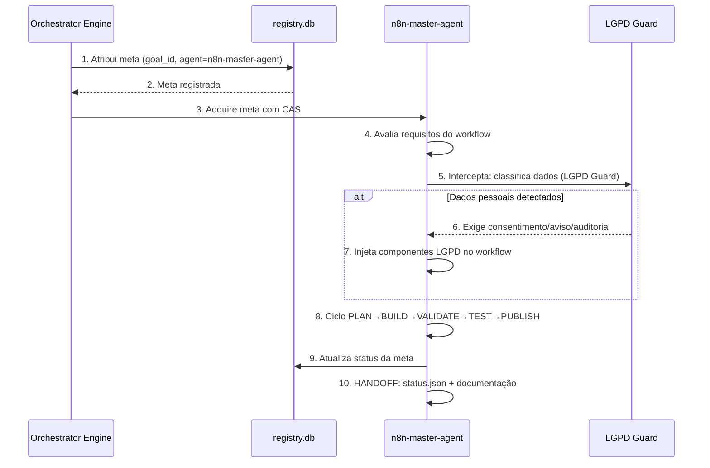
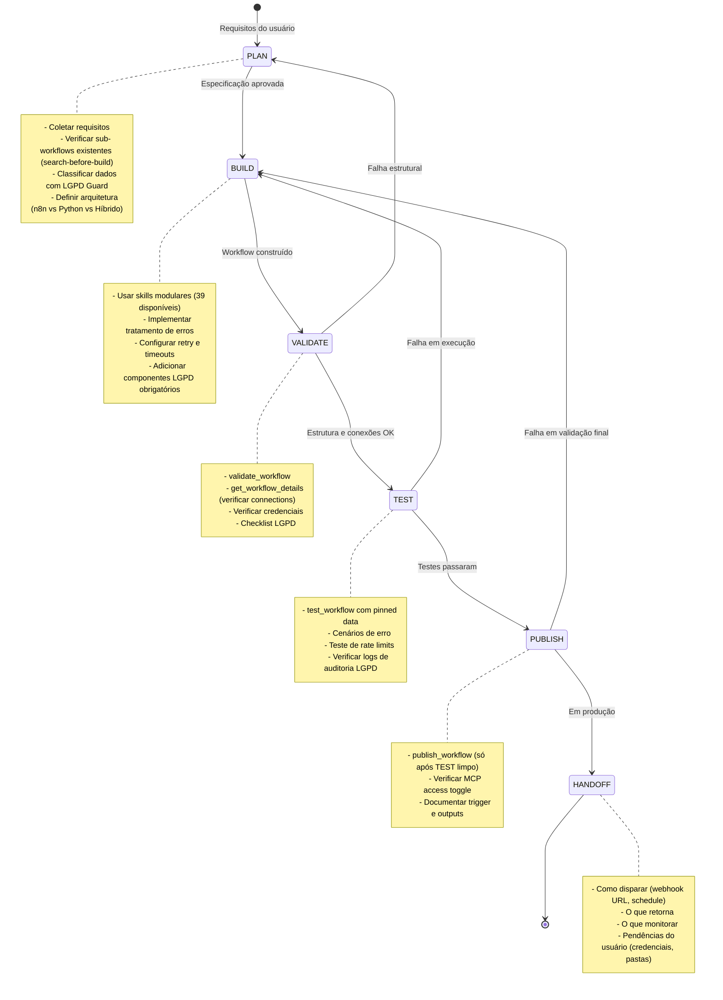
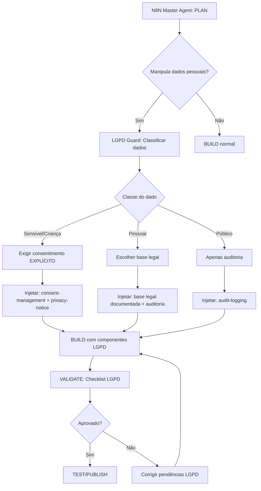
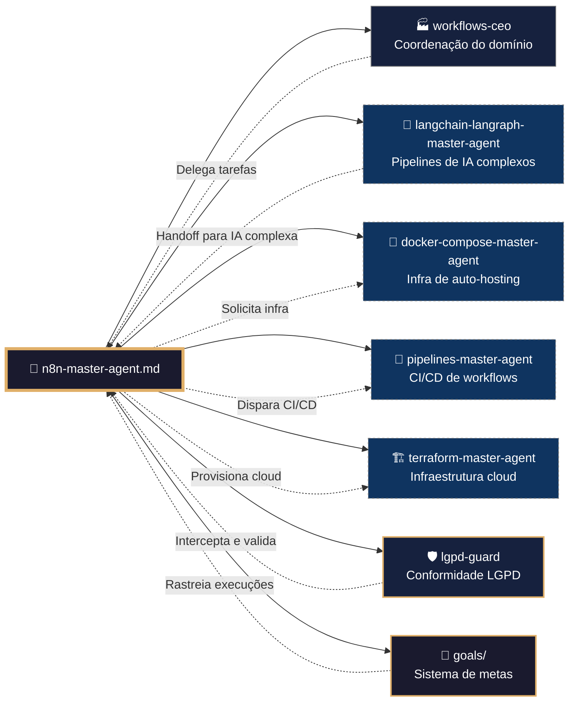

# 🧠 Procedimento Operacional Padrão — n8n Master Agent (Fábrica de Automação)

**Objetivo**: Estabelecer o fluxo completo de design, geração, validação, hardening e publicação de workflows n8n usando o `n8n-master-agent`, com integração obrigatória ao módulo LGPD Guard e aderência aos padrões internacionais de desenvolvimento de automações.

**Público-alvo**: Arquitetos humanos, desenvolvedores de automação, DevOps, agentes de IA que consomem o `n8n-master-agent`.

---

## 1. Visão Geral do Agente n8n

O `n8n-master-agent` é o motor de automação de workflows do ecossistema MANTIS. Ele transforma requisitos de negócio em workflows n8n testáveis, seguros e observáveis, usando um sistema modular de 39 skills e seguindo um ciclo de vida rigoroso de 6 etapas (PLAN → BUILD → VALIDATE → TEST → PUBLISH → HANDOFF).

### 1.1 Conexão com o Ecossistema `goals/`

---

## 2. Ciclo de Vida do Workflow (6 Etapas)

---

## 3. Protocolo de Geração de Workflows

### 3.1 Etapa PLAN (Planejamento)

Antes de escrever qualquer código, o agente deve:

1. **Coletar requisitos**: Entender o problema de negócio, os serviços envolvidos e as expectativas de saída.
2. **Search-before-build**: Executar `search_workflows` para verificar se já existe sub-workflow que resolva parte do problema.
3. **Classificar dados (LGPD Guard)**: Identificar se o workflow manipulará dados pessoais, sensíveis ou de crianças/adolescentes. Se sim, acionar o módulo `lgpd-guard` para determinar as exigências de conformidade.
4. **Decidir arquitetura**: Usar o skill `workflow-architect.md` para escolher entre n8n puro, Python ou híbrido, com base na stack e volume de dados.
5. **Documentar escopo**: Registrar finalidade, base legal (se dados pessoais) e expectativas de saída.

### 3.2 Etapa BUILD (Construção)

Com o plano aprovado, o agente usa as skills modulares para construir o workflow:

| Fase da Construção | Skills Principais |
|-------------------|-------------------|
| Estrutura base | `workflow-structure-fundamentals.md`, `workflow-patterns-basic.md` |
| Triggers | `trigger-patterns.md`, `trigger-testing-strategies.md` |
| Transformação de dados | `data-transformation-patterns.md`, `expression-syntax-advanced.md` |
| Controle de fluxo | `control-flow-patterns.md`, `loop-patterns.md` |
| Integração com APIs | `api-integration-patterns.md`, `http-request-patterns.md` |
| Tratamento de erros | `error-handling-advanced.md`, `error-handling-patterns.md` |
| Sub-workflows | `sub-workflow-patterns.md`, `sub-workflows-advanced.md` |
| Código customizado | `code-execution-patterns.md`, `python-code-node.md`, `javascript-code-node.md` |
| Segurança | `credentials-security.md`, `security-testing-patterns.md` |
| MCP / IA | `mcp-orchestrator-core.md`, `agentic-workflow-patterns.md`, `ai-agent-workflows-n8n.md` |
| LGPD (obrigatório) | `consent-management.md`, `audit-logging.md`, `privacy-notice-template.md` |

**Regras de ouro da construção**:
- Nomes de nós descritivos (verbo + substantivo).
- Sticky notes para agrupar seções lógicas.
- Todo nó passível de falha com `onError: 'continueErrorOutput'` e path de erro conectado.
- Retry configurado em nós de rede (`retryOnFail: true, maxTries: 3, waitBetweenTries: 5000`).
- Credenciais sempre via sistema nativo (nunca hardcoded).

### 3.3 Etapa VALIDATE (Validação)

O agente deve executar obrigatoriamente:

1. `validate_workflow` — verifica estrutura e schema.
2. `get_workflow_details` — inspeciona o objeto `connections` para garantir que:
   - Fan-outs estão preservados.
   - Merge inputs estão nos índices corretos.
   - Error outputs têm `onError: 'continueErrorOutput'` e `main[1]` conectado.
3. **Verificação de credenciais**: Alertar o usuário para verificar cada nó (a string em `newCredential('Label')` é cosmética e não vincula a uma credencial específica).
4. **Checklist LGPD**: Se o workflow manipula dados pessoais, verificar:
   - Dados classificados.
   - Base legal documentada.
   - Aviso de privacidade presente.
   - Consentimento registrado (se aplicável).
   - Logs de auditoria configurados.
   - Política de retenção definida.

### 3.4 Etapa TEST (Teste)

Antes de publicar, o workflow deve ser testado:

1. `test_workflow` com `prepare_test_pin_data` para isolar entradas.
2. Testar caminhos de erro (credenciais inválidas, timeout, dados malformados).
3. Verificar comportamento sob rate limit.
4. Validar logs de auditoria LGPD (eventos `lgpd_consent_granted`, `lgpd_data_accessed`).

**Regra**: Para nós com side effects não pináveis (Code, Edit Fields, If, Wait, Execute Command, Data Tables), perguntar ao usuário antes de rodar o teste.

### 3.5 Etapa PUBLISH (Publicação)

Só publicar após VALIDATE e TEST limpos.

1. `publish_workflow`.
2. Verificar status MCP access (workflows criados via MCP já são acessíveis; workflows criados na UI precisam do toggle ativado).
3. Confirmar que o workflow está no projeto/pasta correto.

### 3.6 Etapa HANDOFF (Entrega)

Fornecer ao usuário:

- **Como dispara**: URL do webhook, cadência do schedule, gatilho manual.
- **O que retorna / para onde vão os dados**: Uma frase clara.
- **Como invocar com exemplo**: `curl -X POST <url> -d '{...}'`.
- **O que monitorar**: Modos de falha, rate limits, onde olhar primeiro.
- **Pendências do usuário**: Criar credenciais, pastas, ativar MCP access.
- **Status LGPD**: Se dados pessoais são tratados, informar que o módulo LGPD Guard está ativo e onde consultar os logs de conformidade.

---

## 4. Integração com LGPD Guard (Alerta Interna)

O módulo `lgpd-guard.md` atua como middleware obrigatório. Todo workflow que manipular dados pessoais é interceptado na etapa PLAN, e os componentes de conformidade são injetados na etapa BUILD.

### 4.1 Fluxo de Interceptação LGPD

### 4.2 Alertas Internos de Conformidade

O LGPD Guard emite alertas internos (não bloqueantes para o usuário final, mas registrados em logs) quando:

- Um workflow tenta tratar dados sensíveis sem consentimento explícito.
- Um workflow armazena dados pessoais sem política de retenção.
- Um prazo de retenção é excedido sem ação de eliminação.
- Uma requisição de titular (DSAR) está próxima do prazo limite (10 e 13 dias).
- Um incidente de segurança é detectado (acesso não autorizado, vazamento).

Estes alertas são enviados ao **canal interno de monitoramento** (Slack, e-mail do DPO) e registrados na Data Table `lgpd_audit_log`.

---

## 5. Uso Otimizado das Skills Modulares

As 39 skills do n8n são organizadas em categorias. O agente deve carregar apenas as necessárias para a tarefa (hidratação segmentada).

### 5.1 Mapa de Carregamento por Tipo de Tarefa

| Tipo de Tarefa | Skills a Carregar |
|----------------|-------------------|
| Criar workflow simples (webhook → API → resposta) | `workflow-structure-fundamentals`, `workflow-patterns-basic`, `trigger-patterns`, `http-request-patterns`, `error-handling-advanced` |
| Criar workflow com IA/agentes | `mcp-orchestrator-core`, `agentic-workflow-patterns`, `ai-agent-workflows-n8n`, `claude-code-integration`, `tool-composition-chaining` |
| Criar workflow com processamento de dados | `data-transformation-patterns`, `expression-syntax-advanced`, `code-execution-patterns`, `loop-patterns` |
| Criar sub-workflow reutilizável | `sub-workflow-patterns`, `sub-workflows-advanced`, `workflow-lifecycle` |
| Depurar workflow com falha | `debugging-patterns`, `connections-patterns`, `error-handling-patterns`, `expression-syntax-advanced` |
| Auditar segurança | `credentials-security`, `security-testing-patterns`, `integration-testing-patterns` |
| Conformidade LGPD | `lgpd-guard.md` + 9 skills de suporte |
| Auto-hospedagem | `self-hosting-patterns`, `binary-data-patterns` |

---

## 6. Hardening e Padrões Internacionais

### 6.1 Segurança (OWASP Top 10 para Workflows)

| Vulnerabilidade | Mitigação |
|----------------|-----------|
| A01: Broken Access Control | Webhooks públicos exigem autenticação (Header Auth, Basic Auth ou JWT). Verificar `webhookAuth` em `trigger-patterns.md`. |
| A02: Cryptographic Failures | `N8N_ENCRYPTION_KEY` obrigatória em produção. Criptografia em repouso para Data Tables com dados sensíveis. |
| A03: Injection | Sanitização de entradas com `pii-redaction.md` antes de enviar para LLMs. Validação de dados com Set IIFE (`error-handling-advanced.md`). |
| A04: Insecure Design | Privacy by design via `lgpd-guard.md`. Workflow-level error workflow obrigatório. |
| A05: Security Misconfiguration | `N8N_BASIC_AUTH_ACTIVE=true` em produção. `N8N_COMMUNITY_PACKAGES_ENABLED=false` em produção. |
| A06: Vulnerable Components | Pin de versão de nós customizados. Auditoria de community nodes com `security-testing-patterns.md`. |
| A07: Auth Failures | Credenciais via sistema nativo. Rotação a cada 90 dias. Nunca hardcoded. |
| A08: Software/Data Integrity | `EXECUTIONS_DATA_PRUNE=true`. Verificar integridade de workflows com `validate_workflow`. |
| A09: Logging/Monitoring | Logs de auditoria com `audit-logging.md`. Alertas de incidente com `incident-response.md`. |
| A10: SSRF | Restringir HTTP Request a domínios allowlist (se aplicável). |

### 6.2 Padrões de Qualidade (DORA Metrics)

| Métrica | Meta | Ferramenta |
|---------|------|-----------|
| Deployment Frequency | Sob demanda | `publish_workflow` |
| Lead Time for Changes | < 1 hora | Ciclo PLAN→PUBLISH |
| Change Failure Rate | < 5% | `validate_workflow` + `test_workflow` |
| Mean Time to Recovery | < 1 hora | `error-handling-advanced.md` + `debugging-patterns.md` |

### 6.3 Otimização de Performance

- Usar `executeOnce: true` em nós agregados (evitar N execuções para 1 resultado).
- Preferir `$('Node Name').item.json.x` sobre `$json.x` para referências estáveis.
- Evitar Loop Over Items quando iteração padrão resolve.
- Configurar `EXECUTIONS_DATA_MAX_AGE` para evitar acúmulo de dados de execução.
- Usar `mode: 'each'` + `waitForSubWorkflow: false` para paralelismo real.

---

## 7. Inter-relação com Outros Domínios

---

## 8. Checklists de Desenvolvimento Ótimo

### 8.1 Checklist Pré-BUILD (PLAN)

- [ ] Requisitos de negócio claramente documentados
- [ ] `search_workflows` executado (search-before-build)
- [ ] Dados classificados via LGPD Guard (se aplicável)
- [ ] Base legal documentada (se dados pessoais)
- [ ] Arquitetura decidida (n8n / Python / Híbrido)
- [ ] Sub-workflows existentes identificados para reuso

### 8.2 Checklist Pré-VALIDATE (BUILD concluído)

- [ ] Todos os nós têm nomes descritivos
- [ ] Sticky notes agrupam seções lógicas
- [ ] Todo nó de rede tem retry configurado
- [ ] Todo nó passível de falha tem path de erro
- [ ] Componentes LGPD injetados (se aplicável)
- [ ] Workflow-level error workflow configurado
- [ ] Credenciais referenciadas (nunca hardcoded)
- [ ] Descrição do workflow preenchida (1-2 frases)

### 8.3 Checklist Pré-PUBLISH (TEST concluído)

- [ ] `validate_workflow` passou
- [ ] `get_workflow_details` verificado (connections intactas)
- [ ] `test_workflow` executado com dados pinned
- [ ] Caminhos de erro testados
- [ ] Logs de auditoria LGPD verificados
- [ ] Performance aceitável (sem timeouts)
- [ ] Documentação de handoff pronta

### 8.4 Checklist Pós-PUBLISH (HANDOFF)

- [ ] Usuário sabe como disparar o workflow
- [ ] Usuário sabe onde os dados são entregues
- [ ] Usuário verificou credenciais em cada nó
- [ ] Usuário conhece os modos de falha e onde monitorar
- [ ] MCP access status confirmado
- [ ] Pendências documentadas (se houver)
- [ ] Status LGPD comunicado ao usuário

---

## 9. Troubleshooting Comum

| Sintoma | Causa Provável | Diagnóstico | Solução |
|---------|---------------|-------------|---------|
| Workflow não dispara | Trigger mal configurado | `get_workflow_details` | Verificar tipo de trigger e autenticação |
| Nó retorna "Node not found" | Conexão quebrada | `validate_workflow` + inspecionar `connections` | Usar `cleanStaleConnections` |
| Dados do webhook não aparecem | Acesso via `$json` em vez de `$json.body` | Expressão incorreta | Usar `$json.body.field` |
| Workflow roda mas não produz saída | Retorno sem `[{json: {...}}]` | `get_execution` | Corrigir formato de retorno |
| Credencial não funciona | Auto-assignment pegou a errada | Verificar dropdown de credencial no nó | Selecionar credencial correta manualmente |
| LGPD: consentimento não registrado | Fluxo de opt-in não injetado | Verificar `lgpd_audit_log` | Adicionar `consent-management.md` ao workflow |
| Timeout em HTTP Request | Sem retry configurado | `get_execution` | Adicionar `retryOnFail: true` |

---

## 10. Referências Cruzadas

- [[04-WORKFLOWS/n8n/n8n-master-agent.md]] — Agente mestre
- [[04-WORKFLOWS/n8n/libs/00-INDEX.md]] — Índice de 39 skills
- [[04-WORKFLOWS/lgpd-guard/lgpd-guard.md]] — Módulo LGPD Guard
- [[04-WORKFLOWS/lgpd-guard/skills/00-INDEX.md]] — Skills de conformidade
- [[04-WORKFLOWS/workflows-ceo.md]] — CEO do domínio
- [[05-CONFIGURATIONS/validation/orchestrator-engine.sh]] — Motor de validação
- [[07-PROCEDURES/configurations-ceo-sop.md]] — SOP do CEO de Configurações
- [[07-PROCEDURES/workflows-sop.md]] — SOP geral de Workflows
- [[goals/README.md]] — Sistema de metas
- [[01-RULES/harness-norms-v3.0.md]] — Hardening padrão
- [[01-RULES/11-A2A-COMMUNICATION-RULES.md]] — Contrato A2A (C9)

---

> **Versão 2.3.0** | Procedimento Operacional Padrão do n8n Master Agent — MANTIS Agentic.
> Aplicável a partir de 2026-05-25.
