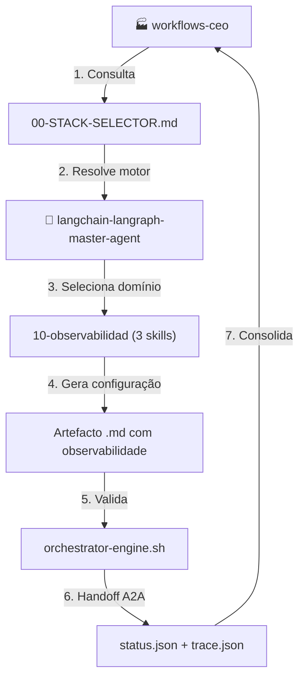
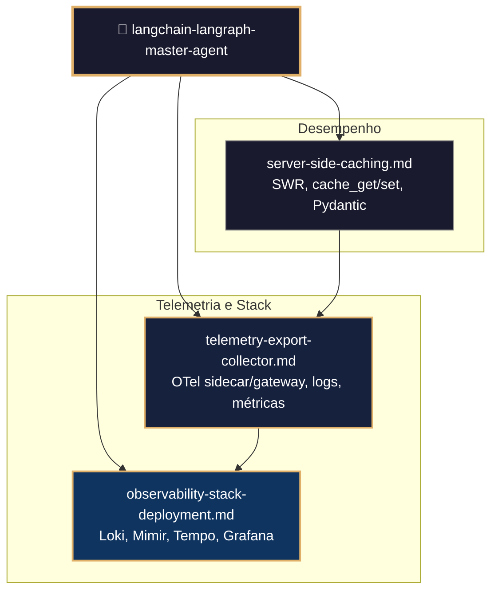
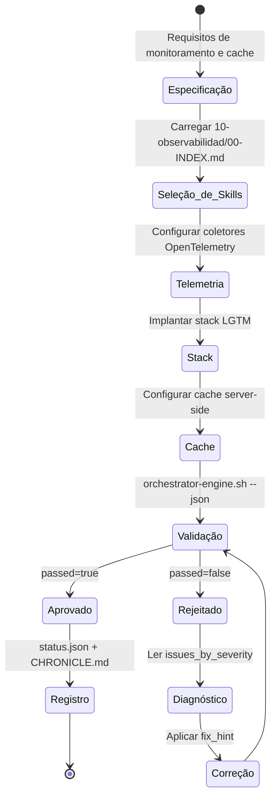
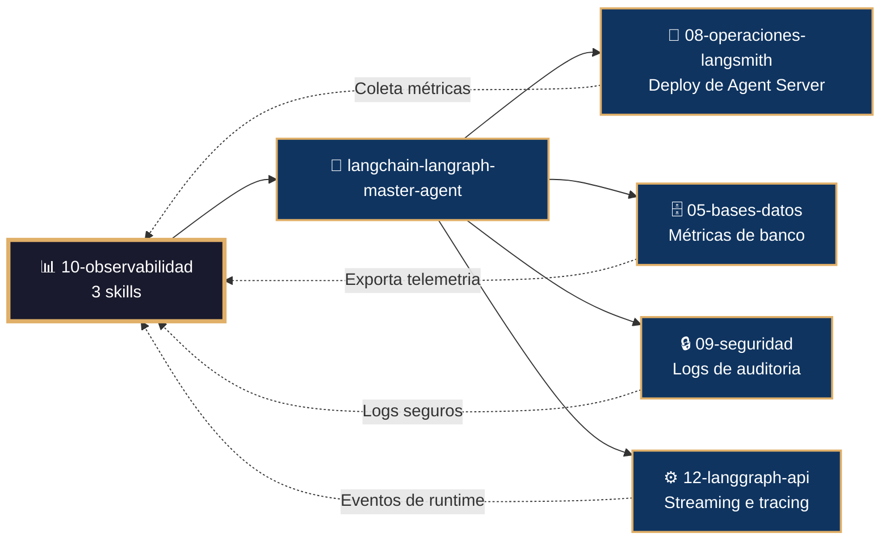

# 📊 Procedimento Operacional Padrão — LangChain/LangGraph: Observabilidade e Telemetria

**Objetivo**: Estabelecer o fluxo de trabalho completo para configuração de coletores de telemetria, stack de monitoramento LGTM (Loki, Mimir, Tempo, Grafana) e caching server-side usando as 3 skills do subdomínio `10-observabilidad` no ecossistema LangChain/LangGraph dentro de `04-WORKFLOWS/langchain-langraph/`.

**Público-alvo**: Arquitetos humanos, agentes mestres, SREs, engenheiros de plataforma, DevOps.

---

## 1. Visão Geral do Subdomínio

O subdomínio `10-observabilidad` contém **3 skills** que cobrem a camada de monitoramento e desempenho:

| # | Skill | Propósito |
|---|-------|-----------|
| 1 | `telemetry-export-collector.md` | Configuração de coletores OpenTelemetry (sidecar e gateway) |
| 2 | `observability-stack-deployment.md` | Deploy do stack LGTM (Loki, Mimir, Tempo, Grafana) via Helm |
| 3 | `server-side-caching.md` | Cache server-side com SWR e key-value para acelerar acessos |

### 1.1 Conexão com o Ecossistema `goals/`



---

## 2. Mapa de Skills e Inter-relações



---

## 3. Fluxo de Geração de Configuração de Observabilidade



---

## 4. Conexão com Outros Domínios



---

## 5. Estrutura de Diretórios

```
04-WORKFLOWS/langchain-langraph/libs/10-observabilidad/
├── telemetry-export-collector.md         # Coletores OpenTelemetry
├── observability-stack-deployment.md     # Stack LGTM
└── server-side-caching.md               # Cache server-side
```

---

## 6. Exemplos de Código e Padrões

### 6.1 Coletor Sidecar para Logs (telemetry-export-collector.md)

```yaml
# otel-sidecar.yaml
mode: sidecar
image: otel/opentelemetry-collector-contrib
config:
  receivers:
    filelog:
      include:
        - /var/log/pods/${POD_NAMESPACE}_${POD_NAME}_${POD_UID}/*/*.log
      start_at: end
  processors:
    batch:
      send_batch_size: 8192
      timeout: 10s
    memory_limiter:
      limit_percentage: 90
  exporters:
    otlphttp/logs:
      endpoint: "https://logs.backend.com/v1/logs"
  service:
    pipelines:
      logs/langsmith:
        receivers: [filelog]
        processors: [batch, memory_limiter]
        exporters: [otlphttp/logs]
```

### 6.2 Coletor Gateway para Métricas e Traces (telemetry-export-collector.md)

```yaml
# otel-gateway.yaml
receivers:
  prometheus:
    config:
      scrape_configs:
        - job_name: langsmith-services
          kubernetes_sd_configs:
            - role: endpoints
              namespaces: [langsmith]
          relabel_configs:
            - source_labels: [__meta_kubernetes_service_name]
              regex: "langsmith-.*"
              action: keep
  otlp:
    protocols:
      grpc:
        endpoint: 0.0.0.0:4317
      http:
        endpoint: 0.0.0.0:4318
exporters:
  otlphttp/metrics:
    endpoint: "https://metrics.backend.com/v1/metrics"
  otlphttp/traces:
    endpoint: "https://traces.backend.com/v1/traces"
service:
  pipelines:
    metrics/langsmith:
      receivers: [prometheus]
      exporters: [otlphttp/metrics]
    traces/langsmith:
      receivers: [otlp]
      exporters: [otlphttp/traces]
```

### 6.3 Deploy do Stack LGTM (observability-stack-deployment.md)

```bash
# Instalar cert-manager e OpenTelemetry operator
helm repo add jetstack https://charts.jetstack.io
helm install cert-manager jetstack/cert-manager -n cert-manager --create-namespace

helm repo add open-telemetry https://open-telemetry.github.io/opentelemetry-helm-charts
helm install opentelemetry-operator open-telemetry/opentelemetry-operator -n langsmith

# Instalar stack LGTM
helm install langsmith-observability langchain/langsmith-observability \
  -n langsmith --create-namespace \
  --values langsmith_obs_config.yaml
```

### 6.4 Cache Server-Side com SWR (server-side-caching.md)

```python
from langgraph_sdk.cache import swr
from datetime import timedelta

# Cache de configuração com SWR
result = await swr(
    "config:global",
    load_config,
    fresh_for=timedelta(minutes=5),
    max_age=timedelta(hours=1)
)

if result.status == "miss":
    mantis_log("INFO", "cache_miss", "config:global")
elif result.status == "stale":
    mantis_log("WARN", "cache_stale_revalidating", "config:global")

config_data = result.value
```

### 6.5 Cache de Credenciais em Auth Handler (server-side-caching.md)

```python
@auth.authenticate
async def authenticate(headers: dict):
    token = headers.get(b"authorization", b"").decode()
    if not token:
        raise Auth.exceptions.HTTPException(status_code=401)

    result = await swr(
        f"auth:token:{token}",
        lambda: validate_and_fetch_user(token),
        fresh_for=timedelta(minutes=5),
        max_age=timedelta(hours=1)
    )
    return result.value
```

---

## 7. Processo de Validação

### 7.1 Comandos de Validação por Artefacto

```bash
# Validação de skill individual
bash 05-CONFIGURATIONS/validation/orchestrator-engine.sh \
  --file 04-WORKFLOWS/langchain-langraph/libs/10-observabilidad/telemetry-export-collector.md \
  --json

# Validação completa do subdomínio 10-observabilidad
for f in 04-WORKFLOWS/langchain-langraph/libs/10-observabilidad/*.md; do
  bash 05-CONFIGURATIONS/validation/orchestrator-engine.sh --file "$f" --json
done
```

### 7.2 Checklist de Validação

| # | Verificação | Constraint | Comando | ✅ Esperado |
|---|---|---|---|---|
| 1 | Frontmatter YAML válido | C5 | `validate-frontmatter.sh` | passed=true |
| 2 | Bootstrap com mantis_log | C8 | `grep 'def mantis_log' <file>` | Encontrado |
| 3 | Testes TDD presentes | C5 | `grep 'def test_' <file>` | ≥3 testes |
| 4 | Coletor OTel configurado | C8 | `grep 'otel\|opentelemetry' <file>` | Pipeline definido |
| 5 | Stack LGTM implantável | C7 | `grep 'helm install' <file>` | Comando documentado |
| 6 | Cache configurado | C1 | `grep 'swr\|cache_get' <file>` | TTL definido |
| 7 | Métricas Prometheus expostas | C8 | `grep 'prometheus\|metrics' <file>` | Endpoints documentados |
| 8 | Sem secrets hardcoded | C3 | `audit-secrets.sh` | Zero violações |

---

## 8. Troubleshooting

| Sintoma | Causa Provável | Diagnóstico | Solução |
|---------|---------------|-------------|---------|
| `Coletor OTel não recebe dados` | Pipeline mal configurado | `kubectl logs otel-collector` | Verificar receivers e exporters |
| `Grafana sem dados` | Prometheus não scrapeando | `curl http://prometheus:9090/targets` | Verificar service discovery |
| `Cache não efetivo` | TTL expirado ou chave incorreta | `cache_get("key")` | Ajustar fresh_for |
| `Loki não ingere logs` | Sidecar não injetado | `kubectl get pods -o yaml` | Verificar annotation de injeção |
| `Tempo sem traces` | Tracing não habilitado no LangSmith | `echo $LANGCHAIN_TRACING_V2` | Setar env var |
| `Stack não instala` | Cert-manager ausente | `kubectl get pods -n cert-manager` | Instalar cert-manager primeiro |

---

## 9. Referências Cruzadas

- [[04-WORKFLOWS/langchain-langraph/langchain-langraph-master-agent.md]]
- [[04-WORKFLOWS/langchain-langraph/libs/10-observabilidad/telemetry-export-collector.md]]
- [[04-WORKFLOWS/langchain-langraph/libs/10-observabilidad/observability-stack-deployment.md]]
- [[04-WORKFLOWS/langchain-langraph/libs/10-observabilidad/server-side-caching.md]]
- [[04-WORKFLOWS/workflows-ceo.md]]
- [[04-WORKFLOWS/00-STACK-SELECTOR.md]]
- [[05-CONFIGURATIONS/validation/orchestrator-engine.sh]]
- [[07-PROCEDURES/security-langchain-langraph-sop.md]]
- [[07-PROCEDURES/swarm-supervisor-langchain-langraph-sop.md]]

---

> **Versão 2.3.0** | Procedimento Operacional Padrão do subdomínio `10-observabilidad` — MANTIS Agentic.
> Aplicável a partir de 2026-05-28.
