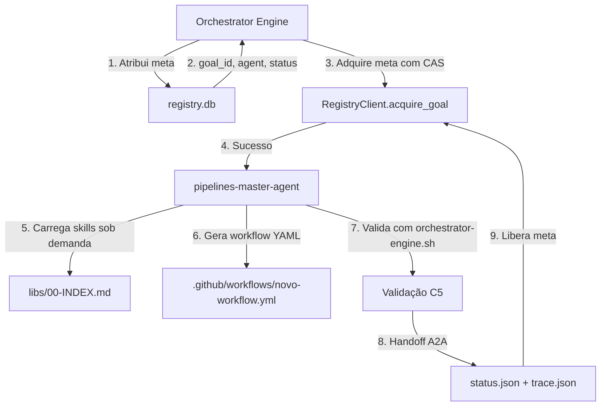
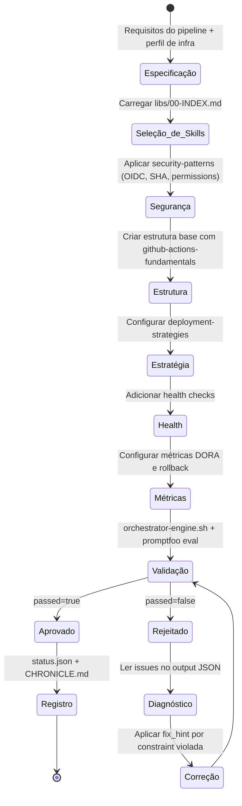
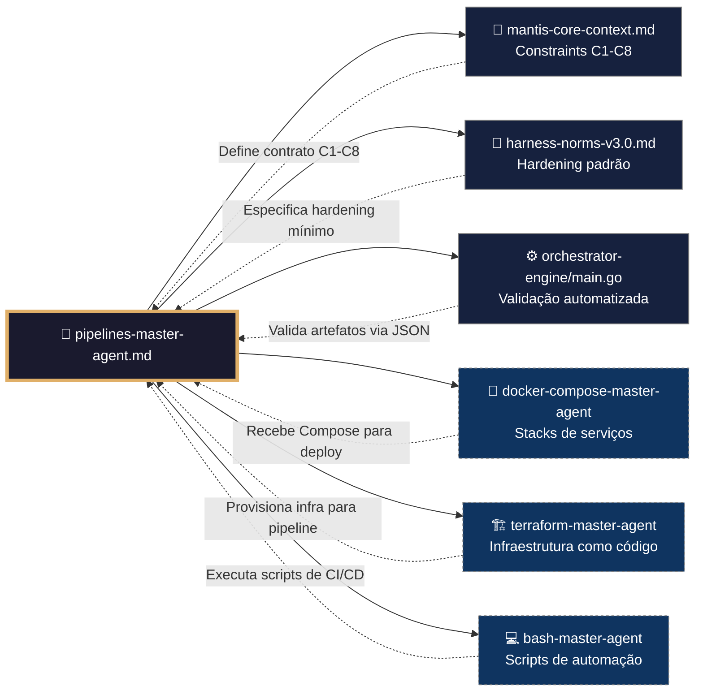
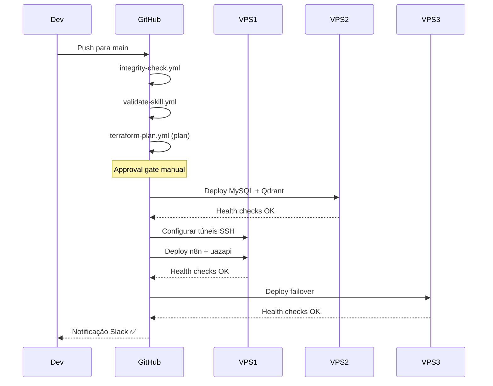

# 🚀 Procedimento Operacional Padrão — Pipelines MANTIS Agentic

**Objetivo**: Estabelecer o fluxo de trabalho completo para criação, execução e manutenção de pipelines CI/CD no domínio `pipelines/`, incluindo integração com `goals/`, exemplos reais de workflows, estratégias de deploy e recuperação de falhas.

**Público-alvo**: Arquitetos humanos, agentes mestres, engenheiros DevOps, operadores de infraestrutura.

---

## 1. Visão Geral do Domínio

O domínio `05-CONFIGURATIONS/pipelines/` é responsável pela automação de CI/CD no ecossistema MANTIS. Ele contém:

- **Agente Mestre** (`pipelines-master-agent.md`): framework executável de geração de workflows.
- **Skills Modulares** (`libs/`): 26 padrões reutilizáveis (GitHub Actions, segurança, deploy, qualidade, troubleshooting).
- **Workflows Reais** (`.github/workflows/`): `integrity-check.yml`, `terraform-plan.yml`, `validate-skill.yml`.
- **Configuração promptfoo** (`promptfoo/`): casos de teste e aserciones para validação de agentes.
- **Provider Router** (`provider-router.yml`): roteamento de requisições para provedores cloud.

### 1.1 Conexão com o Ecossistema `goals/`



---

## 2. Fluxo de Geração de Pipelines



---

## 3. Conexão com Outros Domínios



---

## 4. Inter-relação dos Módulos Internos (`libs/`)

```mermaid
graph TD
    MASTER["🧠 pipelines-master-agent.md"]:::foundation
    GHA["🏗️ github-actions-fundamentals.md"]:::foundation
    DEPLOY["🚀 deployment-strategies.md"]:::operations
    SEC["🔐 security-patterns.md"]:::security
    TF["🏗️ terraform-integration.md"]:::operations
    DC["🐳 docker-compose-integration.md"]:::operations
    PROMPT["🧪 promptfoo-quality.md"]:::operations
    SEMVER["📦 semantic-release.md"]:::operations
    DORA["📊 metrics-dora.md"]:::operations
    MONO["📦 monorepo-patterns.md"]:::operations
    PERF["⚡ performance-optimization.md"]:::operations
    REUSE["🔄 reusable-workflows.md"]:::templates
    BEST["✅ best-practices-anti-patterns.md"]:::references
    ADV["🧠 advanced-patterns.md"]:::operations
    PLATFORM["☁️ platform-deployments.md"]:::operations
    TDD["🧪 tdd-migration-pipeline.md"]:::templates
    OSS["🔐 opensource-pipeline.md"]:::templates
    RFC["📋 rfc-decomposition.md"]:::templates
    REVIEW["📊 pipeline-review.md"]:::references
    DESIGN["🎯 deployment-design.md"]:::operations
    GL["🦊 gitlab-ci-patterns.md"]:::operations
    ETL["📊 data-etl-pipeline.md"]:::templates
    CMAP["🗺️ constraints-mapping.md"]:::references
    TROUBLE["🐞 troubleshooting.md"]:::references
    VAL["✅ validation-commands.md"]:::references

    MASTER --> GHA
    MASTER --> DEPLOY
    MASTER --> SEC
    MASTER --> TF
    MASTER --> DC
    MASTER --> PROMPT
    MASTER --> SEMVER
    MASTER --> DORA
    MASTER --> MONO
    MASTER --> PERF
    MASTER --> REUSE
    MASTER --> BEST
    MASTER --> ADV
    MASTER --> PLATFORM
    MASTER --> TDD
    MASTER --> OSS
    MASTER --> RFC
    MASTER --> REVIEW
    MASTER --> DESIGN
    MASTER --> GL
    MASTER --> ETL
    MASTER --> CMAP
    MASTER --> TROUBLE
    MASTER --> VAL

    GHA --> SEC
    SEC --> DEPLOY
    DEPLOY --> DC
    DC --> DESIGN
    DESIGN --> DORA
    DORA --> REVIEW
    GHA --> REUSE
    REUSE --> BEST
    BEST --> ADV
    VAL --> CMAP
    CMAP --> TROUBLE

    classDef foundation fill:#1a1a2e,color:#fff,stroke:#E0AF68,stroke-width:3px
    classDef security fill:#16213e,color:#fff,stroke:#E0AF68,stroke-width:2px
    classDef operations fill:#0f3460,color:#fff,stroke:#E0AF68,stroke-width:2px
    classDef templates fill:#1a1a2e,color:#fff,stroke:#E0AF68,stroke-width:2px,stroke-dasharray: 5 5
    classDef references fill:#2a2a4e,color:#fff,stroke:#7f7f7f,stroke-width:1px,opacity:0.7
```



---

## 5. Exemplos de Pipelines Reais

### 5.1 Pipeline de Integridade (`integrity-check.yml`)

**Objetivo**: Validar constraints C1-C8 em cada push/PR.

```yaml
name: MANTIS Integrity Check
on:
  push:
    branches: [main, develop]
  pull_request:
    branches: [main]

jobs:
  check-constraints:
    runs-on: ubuntu-latest
    steps:
      - uses: actions/checkout@b4ffde65f46336ab88eb53be808477a3936bae11
      - name: Validar constraints C1-C8
        run: bash 05-CONFIGURATIONS/validation/orchestrator-engine.sh --domain all --strict

  audit-secrets:
    runs-on: ubuntu-latest
    steps:
      - uses: actions/checkout@b4ffde65f46336ab88eb53be808477a3936bae11
      - name: Detectar secretos hardcoded
        run: bash 05-CONFIGURATIONS/validation/audit-secrets.sh --path .

  validate-stack-selector:
    runs-on: ubuntu-latest
    steps:
      - uses: actions/checkout@b4ffde65f46336ab88eb53be808477a3936bae11
      - name: Validar agent_registry
        run: jq '.stack_selector_kernel.agent_registry.agents | keys' 00-STACK-SELECTOR.md | grep -q . && echo "✅ válido" || exit 1
```

---

### 5.2 Pipeline de Terraform (`terraform-plan.yml`)

**Objetivo**: Validar e aplicar infraestrutura como código.

```yaml
name: Terraform Plan & Apply
on:
  pull_request:
    paths: ['05-CONFIGURATIONS/terraform/**']
  workflow_dispatch:
    inputs:
      environment:
        required: true
        type: choice
        options: [staging, production]

jobs:
  validate:
    runs-on: ubuntu-latest
    steps:
      - uses: actions/checkout@b4ffde65f46336ab88eb53be808477a3936bae11
      - uses: hashicorp/setup-terraform@v3
      - run: |
          cd 05-CONFIGURATIONS/terraform
          terraform fmt -check
          terraform init -backend=false
          terraform validate

  plan:
    needs: validate
    runs-on: ubuntu-latest
    steps:
      - uses: actions/checkout@b4ffde65f46336ab88eb53be808477a3936bae11
      - uses: hashicorp/setup-terraform@v3
      - uses: aws-actions/configure-aws-credentials@v4
        with:
          role-to-assume: ${{ secrets.AWS_ROLE_ARN }}
          aws-region: us-east-1
      - run: |
          cd 05-CONFIGURATIONS/terraform
          terraform init
          terraform plan -out=tfplan -var-file=environments/${{ inputs.environment }}.tfvars

  apply:
    needs: plan
    runs-on: ubuntu-latest
    environment:
      name: ${{ inputs.environment }}
    if: github.ref == 'refs/heads/main'
    steps:
      - uses: actions/checkout@b4ffde65f46336ab88eb53be808477a3936bae11
      - uses: hashicorp/setup-terraform@v3
      - uses: aws-actions/configure-aws-credentials@v4
        with:
          role-to-assume: ${{ secrets.AWS_ROLE_ARN }}
      - run: |
          cd 05-CONFIGURATIONS/terraform
          terraform apply -auto-approve tfplan
```

---

### 5.3 Pipeline de Validação de Agentes (`validate-skill.yml`)

```yaml
name: Validate Master Agents
on:
  pull_request:
    paths: ['02-SKILLS/**/*-master-agent.md']

jobs:
  schema-check:
    runs-on: ubuntu-latest
    steps:
      - uses: actions/checkout@b4ffde65f46336ab88eb53be808477a3936bae11
      - run: |
          for file in $(find 02-SKILLS -name '*-master-agent.md'); do
            python3 05-CONFIGURATIONS/validation/schema-validator.py --file "$file" --schema 05-CONFIGURATIONS/validation/schemas/master-agent.schema.json
          done

  frontmatter-lint:
    runs-on: ubuntu-latest
    steps:
      - uses: actions/checkout@b4ffde65f46336ab88eb53be808477a3936bae11
      - run: |
          bash 05-CONFIGURATIONS/validation/validate-frontmatter.sh --domain skills
          bash 05-CONFIGURATIONS/validation/verify-constraints.sh --check-mapping

  cross-refs:
    runs-on: ubuntu-latest
    steps:
      - uses: actions/checkout@b4ffde65f46336ab88eb53be808477a3936bae11
      - run: bash 05-CONFIGURATIONS/validation/check-wikilinks.sh --domain skills
```

---

## 6. Estratégias de Deploy

### 6.1 Matriz de Decisão

| Estratégia | Downtime | Velocidade de Rollback | Custo Infra | Melhor Para |
|------------|----------|----------------------|-------------|-------------|
| **Rolling Update** | Zero | ~minutos | Nulo | Serviços stateless |
| **Blue-Green** | Zero | Instantâneo | 2x temporal | Migrações de DB |
| **Canary** | Zero | Instantâneo | Mínimo | Tráfego alto |
| **Feature Flags** | Zero | Instantâneo | Nulo | A/B testing |

### 6.2 Canary com Argo Rollouts

```yaml
strategy:
  canary:
    steps:
      - setWeight: 10
      - pause: { duration: 5m }
      - setWeight: 25
      - pause: { duration: 5m }
      - setWeight: 100
    analysis:
      templates:
        - templateName: success-rate
```

---

## 7. Processo de Deploy Ordenado



---

## 8. Validação Pós-Deploy

| # | Verificação | Constraint | Comando | ✅ Esperado |
|---|---|---|---|---|
| 1 | Secrets não hardcoded | C3 | `audit-secrets.sh --path .` | Zero findings |
| 2 | Actions com SHA pinning | C1 | `grep -r 'uses:.*@v[0-9]' .github/workflows/ \| grep -v '@[a-f0-9]\{40\}'` | Sem output |
| 3 | Workflows com timeout | C7 | `grep -L 'timeout-minutes' .github/workflows/*.yml` | Sem output |
| 4 | Health check profundo no deploy | C8 | `grep 'health/ready' .github/workflows/deploy-*.yml` | Encontrado |
| 5 | Environment protection em produção | C6 | `gh api /repos/$OWNER/$REPO/environments/production` | protection_rules configurado |
| 6 | promptfoo passa em todos os agentes | C5 | `cd promptfoo && npx promptfoo eval` | Todos success: true |
| 7 | Métricas DORA registradas | C8 | `curl -s $PROM_URL/api/v1/query?query=mantis:lead_time_seconds:avg` | Dados retornados |
| 8 | Rollback automático configurado | C7 | `grep 'rollback' .github/workflows/deploy-*.yml` | Encontrado |

---

## 9. Troubleshooting

| Sintoma | Causa Provável | Diagnóstico | Solução |
|---------|---------------|-------------|---------|
| Pipeline não inicia | Sem revisores no environment | `gh api /repos/$OWNER/$REPO/environments/production` | Configurar required reviewers |
| `terraform apply` timeout | Estado bloqueado | `terraform state list` | `-lock-timeout=10m` |
| promptfoo não detecta regressão | Asserções frouxas | `jq '.tests[].assert[]' test-cases/*.yaml` | Adicionar `type: javascript` |
| Canary não chega a 100% | Métrica sem dados | `curl "$PROM_URL/api/v1/query?query=..."` | Ajustar `inconclusiveLimit` |
| Health check passa mas serviço cai | `/ping` não verifica dependências | `curl /health/ready` | Usar deep health check |
| Pipeline lento (>30 min) | Jobs em série, sem cache | `gh run view <id> --log` | Paralelizar, adicionar cache |

---

## 10. Comandos de Validação

```bash
# Validação rápida (pre-commit)
bash orchestrator-engine.sh --domain pipelines --mode quick

# Validação completa (CI/CD)
bash orchestrator-engine.sh --domain pipelines --strict

# Auditoria de secrets
bash audit-secrets.sh --path 05-CONFIGURATIONS/pipelines/ --include-workflows

# Testes promptfoo
cd 05-CONFIGURATIONS/pipelines/promptfoo && npx promptfoo eval --config config.yaml

# Verificar SHA pinning
grep -r "uses:.*@v[0-9]" .github/workflows/ | grep -v "@[a-f0-9]\{40\}" && echo "⚠️ Ações sem SHA" || echo "✅ Todas com SHA"

# Validar sintaxe de todos os workflows
for wf in .github/workflows/*.yml; do
  python3 -c "import yaml; yaml.safe_load(open('$wf'))" && echo "✅ $wf" || echo "❌ $wf"
done
```

---

## 11. Rollback de Emergência

```bash
# 1. Reverter Kubernetes
kubectl rollout undo deployment/mantis-app --context=production

# 2. Reverter Docker Compose
ssh root@$VPS1_IP "cd /opt/mantis && docker compose -f compose.prod.yml up -d --force-recreate"

# 3. Verificar saúde
curl -f https://app.example.com/health/ready || exit 1

# 4. Notificar
curl -X POST $SLACK_WEBHOOK -H 'Content-type: application/json' \
  --data '{"text":"🔙 Rollback executado"}'
```

---

## 12. Referências Cruzadas

- [[05-CONFIGURATIONS/pipelines/pipelines-master-agent.md]] — Agente mestre
- [[05-CONFIGURATIONS/pipelines/libs/00-INDEX.md]] — Índice de skills
- [[05-CONFIGURATIONS/pipelines/.github/workflows/integrity-check.yml]] — Pipeline de integridade
- [[05-CONFIGURATIONS/pipelines/.github/workflows/terraform-plan.yml]] — Pipeline Terraform
- [[05-CONFIGURATIONS/pipelines/.github/workflows/validate-skill.yml]] — Validação de agentes
- [[05-CONFIGURATIONS/pipelines/promptfoo/config.yaml]] — Config promptfoo
- [[05-CONFIGURATIONS/validation/orchestrator-engine.sh]] — Motor de validação
- [[goals/README.md]] — Sistema de metas
- [[01-RULES/harness-norms-v3.0.md]] — Hardening padrão
- [[01-RULES/11-A2A-COMMUNICATION-RULES.md]] — Contrato A2A (C9)
- [[07-PROCEDURES/docker-compose-sop.md]] — SOP de Docker Compose

---

> **Versão 2.3.0** | Procedimento Operacional Padrão do domínio `pipelines/` — MANTIS Agentic.
> Aplicável a partir de 2026-05-24.
