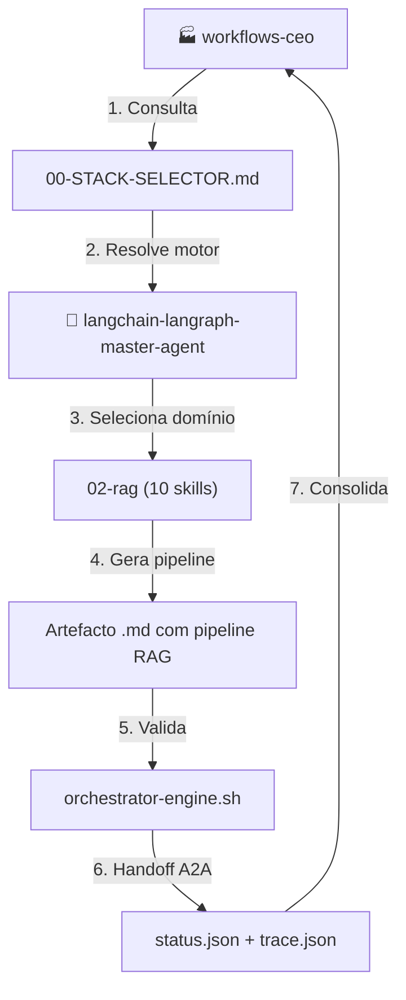
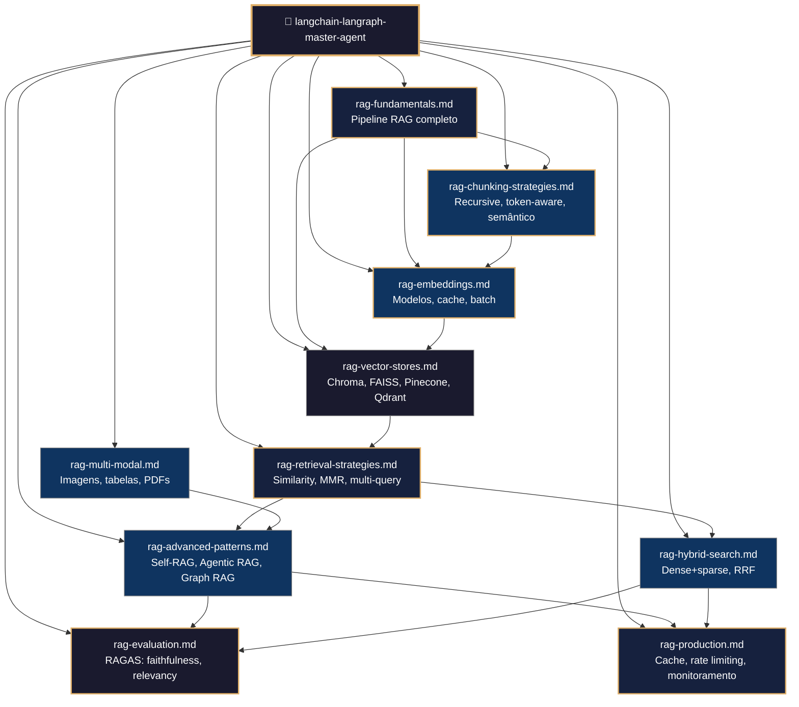
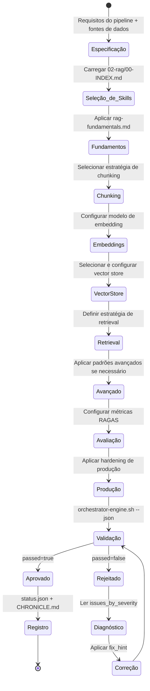
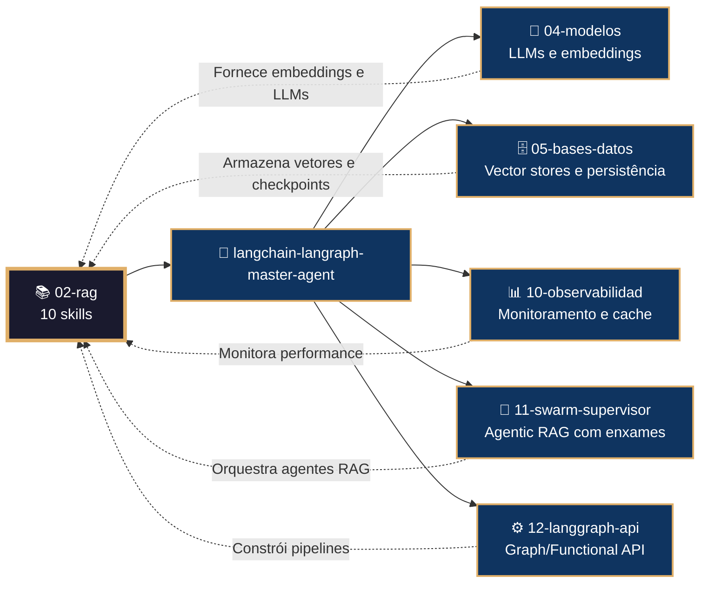

# 📚 Procedimento Operacional Padrão — LangChain/LangGraph: RAG (Retrieval-Augmented Generation)

**Objetivo**: Estabelecer o fluxo de trabalho completo para criação, validação e deploy de pipelines RAG usando as 10 skills do subdomínio `02-rag` no ecossistema LangChain/LangGraph dentro de `04-WORKFLOWS/langchain-langraph/`.

**Público-alvo**: Arquitetos humanos, agentes mestres, engenheiros de IA, cientistas de dados, desenvolvedores Python.

---

## 1. Visão Geral do Subdomínio

O subdomínio `02-rag` contém **10 skills** que cobrem o pipeline completo de Retrieval-Augmented Generation:

| # | Skill | Propósito |
|---|-------|-----------|
| 1 | `rag-fundamentals.md` | Pipeline RAG completo: load, split, embed, store, retrieve, generate |
| 2 | `rag-chunking-strategies.md` | Estratégias de chunking: recursive, token-aware, semântico, code-aware |
| 3 | `rag-embeddings.md` | Modelos de embedding, cache, batch e otimização |
| 4 | `rag-vector-stores.md` | Vector stores: Chroma, FAISS, Pinecone, Qdrant, pgvector |
| 5 | `rag-retrieval-strategies.md` | Estratégias de retrieval: similarity, MMR, multi-query, re-ranking |
| 6 | `rag-advanced-patterns.md` | Self-RAG, Corrective RAG, Agentic RAG, Graph RAG |
| 7 | `rag-evaluation.md` | Avaliação RAGAS: faithfulness, answer relevancy, context precision |
| 8 | `rag-hybrid-search.md` | Busca híbrida dense+sparse com Qdrant e RRF |
| 9 | `rag-multi-modal.md` | RAG multi-modal: imagens, tabelas, PDFs |
| 10 | `rag-production.md` | RAG em produção: cache, rate limiting, monitoramento |

### 1.1 Conexão com o Ecossistema `goals/`



---

## 2. Mapa de Skills e Inter-relações



---

## 3. Fluxo de Geração de Pipeline RAG



---

## 4. Conexão com Outros Domínios



---

## 5. Estrutura de Diretórios

```
04-WORKFLOWS/langchain-langraph/libs/02-rag/
├── rag-fundamentals.md              # Pipeline RAG completo
├── rag-chunking-strategies.md       # Estratégias de chunking
├── rag-embeddings.md                # Modelos de embedding
├── rag-vector-stores.md             # Vector stores
├── rag-retrieval-strategies.md      # Estratégias de retrieval
├── rag-advanced-patterns.md         # Self-RAG, Agentic RAG
├── rag-evaluation.md                # Avaliação RAGAS
├── rag-hybrid-search.md             # Busca híbrida
├── rag-multi-modal.md               # RAG multi-modal
└── rag-production.md                # RAG em produção
```

---

## 6. Exemplos de Código e Padrões

### 6.1 Pipeline RAG Básico (rag-fundamentals.md)

```python
from langchain_community.document_loaders import TextLoader
from langchain_text_splitters import RecursiveCharacterTextSplitter
from langchain_openai import OpenAIEmbeddings
from langchain_chroma import Chroma
from langchain_openai import ChatOpenAI
from langchain_core.prompts import ChatPromptTemplate
from langchain_core.runnables import RunnablePassthrough

# 1. Load
loader = TextLoader("documentos/artigo.txt")
docs = loader.load()

# 2. Split
splitter = RecursiveCharacterTextSplitter(chunk_size=1000, chunk_overlap=200)
chunks = splitter.split_documents(docs)

# 3. Embed + Store
embeddings = OpenAIEmbeddings(model="text-embedding-3-small")
vectorstore = Chroma.from_documents(chunks, embeddings)

# 4. Retrieve + Generate
model = ChatOpenAI(model="gpt-4o")
retriever = vectorstore.as_retriever(search_kwargs={"k": 3})

prompt = ChatPromptTemplate.from_template("""
Responda a pergunta baseado no contexto:
Contexto: {context}
Pergunta: {question}
Resposta:
""")

chain = (
    {"context": retriever, "question": RunnablePassthrough()}
    | prompt
    | model
)

response = chain.invoke("Qual o tema principal do artigo?")
```

### 6.2 Chunking Token-Aware (rag-chunking-strategies.md)

```python
from langchain_text_splitters import TokenTextSplitter

splitter = TokenTextSplitter(
    encoding_name="cl100k_base",  # OpenAI
    chunk_size=500,
    chunk_overlap=50
)

chunks = splitter.split_text(texto_longo)
```

### 6.3 Busca Híbrida com Qdrant (rag-hybrid-search.md)

```python
from langchain_qdrant import QdrantVectorStore, FastEmbedSparse
from qdrant_client import QdrantClient
from qdrant_client.models import Distance, VectorParams

client = QdrantClient("localhost", port=6333)

client.create_collection(
    "documentos",
    vectors_config={
        "dense": VectorParams(size=1536, distance=Distance.COSINE),
    },
    sparse_vectors_config={
        "sparse": VectorParams(size=25000),
    }
)

sparse_embeddings = FastEmbedSparse(model_name="Qdrant/bm25")
vectorstore = QdrantVectorStore(
    client=client,
    collection_name="documentos",
    embedding=OpenAIEmbeddings(),
    sparse_embedding=sparse_embeddings,
    vector_name="dense",
    sparse_vector_name="sparse",
)

# Busca híbrida automática
retriever = vectorstore.as_retriever(search_type="similarity", search_kwargs={"k": 5})
```

### 6.4 Avaliação RAGAS (rag-evaluation.md)

```python
from ragas import evaluate
from ragas.metrics import faithfulness, answer_relevancy, context_precision
from datasets import Dataset

data = {
    "question": ["Qual o tema?"],
    "answer": ["O artigo discute IA generativa."],
    "contexts": [["IA generativa está revolucionando..."]]
}

dataset = Dataset.from_dict(data)
results = evaluate(dataset, metrics=[faithfulness, answer_relevancy, context_precision])
print(results)
```

### 6.5 Agentic RAG com Supervisor (rag-advanced-patterns.md)

```python
from langgraph_supervisor import create_supervisor
from langgraph.prebuilt import create_react_agent

search_agent = create_react_agent(model, tools=[buscar_documentos], name="search_agent")
rag_agent = create_react_agent(model, tools=[gerar_resposta], name="rag_agent")

supervisor = create_supervisor(
    [search_agent, rag_agent],
    model=model,
    prompt="Use search_agent para buscar docs, depois rag_agent para responder."
)
```

---

## 7. Processo de Validação

### 7.1 Comandos de Validação por Artefacto

```bash
# Validação de skill individual
bash 05-CONFIGURATIONS/validation/orchestrator-engine.sh \
  --file 04-WORKFLOWS/langchain-langraph/libs/02-rag/rag-fundamentals.md \
  --json

# Validação completa do subdomínio 02-rag
for f in 04-WORKFLOWS/langchain-langraph/libs/02-rag/*.md; do
  bash 05-CONFIGURATIONS/validation/orchestrator-engine.sh --file "$f" --json
done
```

### 7.2 Checklist de Validação

| # | Verificação | Constraint | Comando | ✅ Esperado |
|---|---|---|---|---|
| 1 | Frontmatter YAML válido | C5 | `validate-frontmatter.sh` | passed=true |
| 2 | Bootstrap com mantis_log | C8 | `grep 'def mantis_log' <file>` | Encontrado |
| 3 | Testes TDD presentes | C5 | `grep 'def test_' <file>` | ≥3 testes |
| 4 | Wikilinks canônicos | C5 | `check-wikilinks.sh` | Zero quebrados |
| 5 | Código ≥500 linhas | C5 | `wc -l <file>` | ≥500 |
| 6 | Sem secrets hardcoded | C3 | `audit-secrets.sh` | Zero violações |
| 7 | Embeddings declarados | V1 | `grep 'embedding' <file>` | Modelo e dims |
| 8 | Métricas RAGAS configuradas | C8 | `grep 'ragas' <file>` | ≥3 métricas |

---

## 8. Troubleshooting

| Sintoma | Causa Provável | Diagnóstico | Solução |
|---------|---------------|-------------|---------|
| `Chroma não encontra documentos` | Coleção não inicializada | `len(vectorstore.get()["ids"])` | `Chroma.from_documents()` |
| `Embedding dimension mismatch` | Modelo errado na busca | `vectorstore._collection.get()` | Verificar dims do embedding |
| `Chunks muito grandes` | `chunk_size` mal configurado | `len(chunk.page_content)` | Reduzir `chunk_size` |
| `Retrieval irrelevante` | Estratégia inadequada | `retriever.get_relevant_documents("test")` | Usar MMR ou multi-query |
| `RAGAS score baixo` | Contexto insuficiente | `evaluate(dataset, metrics)` | Aumentar `k` no retriever |
| `Híbrida não funciona` | Qdrant sem sparse vectors | `client.get_collection("nome")` | Criar coleção com sparse |
| `Multi-modal não processa PDF` | `unstructured` não instalado | `pip show unstructured` | `pip install unstructured` |
| `Cache não efetivo` | TTL muito curto | `redis-cli INFO stats` | Ajustar `ttl` no Redis |

---

## 9. Referências Cruzadas

- [[04-WORKFLOWS/langchain-langraph/langchain-langraph-master-agent.md]]
- [[04-WORKFLOWS/langchain-langraph/libs/02-rag/rag-fundamentals.md]]
- [[04-WORKFLOWS/langchain-langraph/libs/02-rag/rag-chunking-strategies.md]]
- [[04-WORKFLOWS/langchain-langraph/libs/02-rag/rag-embeddings.md]]
- [[04-WORKFLOWS/langchain-langraph/libs/02-rag/rag-vector-stores.md]]
- [[04-WORKFLOWS/langchain-langraph/libs/02-rag/rag-retrieval-strategies.md]]
- [[04-WORKFLOWS/langchain-langraph/libs/02-rag/rag-advanced-patterns.md]]
- [[04-WORKFLOWS/langchain-langraph/libs/02-rag/rag-evaluation.md]]
- [[04-WORKFLOWS/langchain-langraph/libs/02-rag/rag-hybrid-search.md]]
- [[04-WORKFLOWS/langchain-langraph/libs/02-rag/rag-multi-modal.md]]
- [[04-WORKFLOWS/langchain-langraph/libs/02-rag/rag-production.md]]
- [[04-WORKFLOWS/workflows-ceo.md]]
- [[04-WORKFLOWS/00-STACK-SELECTOR.md]]
- [[05-CONFIGURATIONS/validation/orchestrator-engine.sh]]
- [[07-PROCEDURES/general-langchain-sop.md]]
- [[07-PROCEDURES/mcp-langchain-langraph-sop.md]]

---

> **Versão 2.3.0** | Procedimento Operacional Padrão do subdomínio `02-rag` — MANTIS Agentic.
> Aplicável a partir de 2026-05-28.
