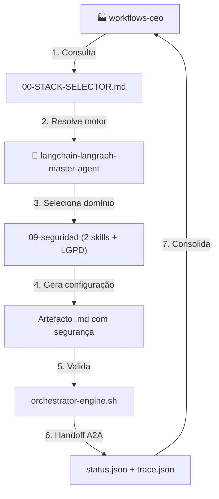
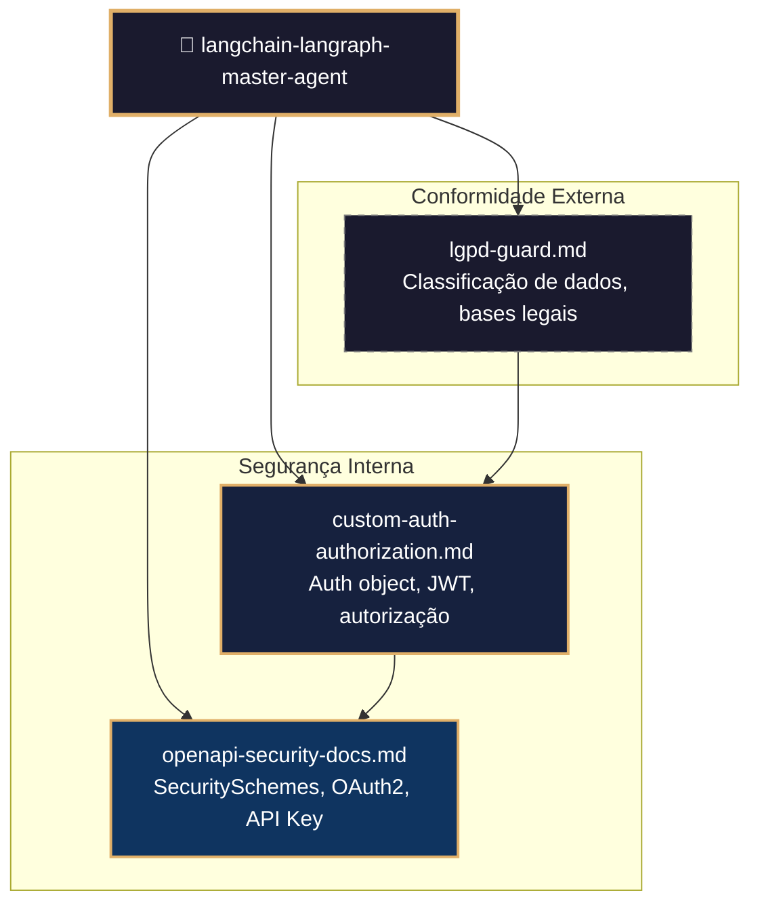
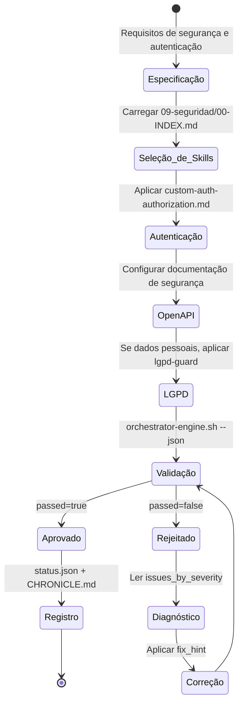
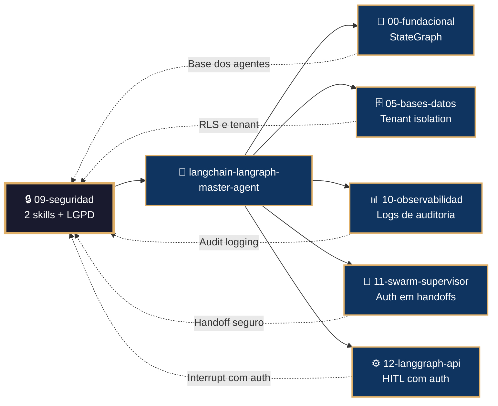

# 🔒 Procedimento Operacional Padrão — LangChain/LangGraph: Segurança, Autenticação e Conformidade

**Objetivo**: Estabelecer o fluxo de trabalho completo para implementação de autenticação customizada, autorização, documentação OpenAPI de segurança e conformidade LGPD usando as 2 skills do subdomínio `09-seguridad` e o módulo externo `lgpd-guard` no ecossistema LangChain/LangGraph dentro de `04-WORKFLOWS/langchain-langraph/`.

**Público-alvo**: Arquitetos humanos, agentes mestres, engenheiros de segurança, oficiais de compliance, desenvolvedores Python.

---

## 1. Visão Geral do Subdomínio

O subdomínio `09-seguridad` contém **2 skills** internas e referencia **1 módulo externo** que juntos formam a camada de segurança:

| # | Skill | Propósito |
|---|-------|-----------|
| 1 | `custom-auth-authorization.md` | Autenticação customizada com objeto `Auth`, validação JWT, autorização por recurso |
| 2 | `openapi-security-docs.md` | Documentação interativa OpenAPI com esquemas de segurança |
| 3 | `lgpd-guard.md` (externo) | Módulo transversal de conformidade à LGPD |

### 1.1 Conexão com o Ecossistema `goals/`



---

## 2. Mapa de Skills e Inter-relações



---

## 3. Fluxo de Geração de Configuração de Segurança



---

## 4. Conexão com Outros Domínios



---

## 5. Estrutura de Diretórios

```
04-WORKFLOWS/langchain-langraph/libs/09-seguridad/
├── custom-auth-authorization.md         # Auth customizada, JWT, autorização
└── openapi-security-docs.md             # OpenAPI security schemes

04-WORKFLOWS/lgpd-guard/
└── lgpd-guard.md                        # Módulo de conformidade LGPD
```

---

## 6. Exemplos de Código e Padrões

### 6.1 Autenticação Customizada com JWT (custom-auth-authorization.md)

```python
from langgraph_sdk import Auth
import jwt, os

auth = Auth()

@auth.authenticate
async def authenticate(headers: dict) -> Auth.types.MinimalUserDict:
    authorization = headers.get(b"authorization", b"").decode()
    if not authorization:
        raise Auth.exceptions.HTTPException(status_code=401, detail="Token ausente")

    scheme, token = authorization.split()
    if scheme.lower() != "bearer":
        raise Auth.exceptions.HTTPException(status_code=401, detail="Esquema inválido")

    try:
        payload = jwt.decode(token, os.getenv("JWT_SECRET"), algorithms=["HS256"])
        return {
            "identity": payload["sub"],
            "email": payload.get("email"),
            "permissions": payload.get("permissions", [])
        }
    except jwt.InvalidTokenError:
        raise Auth.exceptions.HTTPException(status_code=401, detail="Token inválido")

# Autorização por recurso
@auth.on
async def add_owner(ctx: Auth.types.AuthContext, value: dict) -> dict:
    filters = {"owner": ctx.user.identity}
    metadata = value.setdefault("metadata", {})
    metadata.update(filters)
    return filters
```

### 6.2 Documentação OpenAPI de Segurança (openapi-security-docs.md)

```json
{
  "auth": {
    "path": "./auth.py:auth",
    "openapi": {
      "securitySchemes": {
        "BearerAuth": {
          "type": "http",
          "scheme": "bearer",
          "bearerFormat": "JWT"
        }
      },
      "security": [
        {"BearerAuth": []}
      ]
    }
  }
}
```

### 6.3 Integração LGPD Guard (lgpd-guard.md)

```python
from lgpd_guard import DataClassifier, ConsentManager

# Classificar dados antes do processamento
classifier = DataClassifier()
data_type = classifier.classify({"cpf": "123.456.789-00"})
# data_type == "pessoal"

# Registrar consentimento
consent = ConsentManager()
consent.record(
    tenant_id="restaurante-001",
    user_id="user-123",
    purpose="marketing",
    legal_basis="consentimento"
)
```

---

## 7. Processo de Validação

### 7.1 Comandos de Validação por Artefacto

```bash
# Validação de skill individual
bash 05-CONFIGURATIONS/validation/orchestrator-engine.sh \
  --file 04-WORKFLOWS/langchain-langraph/libs/09-seguridad/custom-auth-authorization.md \
  --json

# Validação completa do subdomínio 09-seguridad
for f in 04-WORKFLOWS/langchain-langraph/libs/09-seguridad/*.md; do
  bash 05-CONFIGURATIONS/validation/orchestrator-engine.sh --file "$f" --json
done

# Validação do módulo LGPD (externo)
bash 05-CONFIGURATIONS/validation/orchestrator-engine.sh \
  --file 04-WORKFLOWS/lgpd-guard/lgpd-guard.md --json
```

### 7.2 Checklist de Validação

| # | Verificação | Constraint | Comando | ✅ Esperado |
|---|---|---|---|---|
| 1 | Frontmatter YAML válido | C5 | `validate-frontmatter.sh` | passed=true |
| 2 | Bootstrap com mantis_log | C8 | `grep 'def mantis_log' <file>` | Encontrado |
| 3 | Testes TDD presentes | C5 | `grep 'def test_' <file>` | ≥3 testes |
| 4 | Mecanismo de auth implementado | C3 | `grep '@auth.authenticate' <file>` | Presente |
| 5 | OpenAPI security scheme | C5 | `grep 'securitySchemes' <file>` | Configurado |
| 6 | Sem secrets hardcoded | C3 | `audit-secrets.sh` | Zero violações |
| 7 | Referência ao LGPD guard | C4 | `grep 'lgpd-guard' <file>` | Wikilink presente |
| 8 | Autorização por tenant | C4 | `grep 'owner\|tenant' <file>` | Filtro configurado |

---

## 8. Troubleshooting

| Sintoma | Causa Provável | Diagnóstico | Solução |
|---------|---------------|-------------|---------|
| `401 Unauthorized` | Token ausente ou inválido | `curl -H "Authorization: Bearer ..."` | Verificar geração do JWT |
| `OpenAPI não mostra auth` | `langgraph.json` sem `auth.openapi` | `cat langgraph.json` | Adicionar bloco openapi |
| `LGPD não acionado` | `data_contains_pii` não setado | `task.json` | Definir flag no contexto da goal |
| `Autorização não isola` | `@auth.on` não configurado | `client.threads.search()` | Implementar add_owner |
| `Secrets vazando` | Env vars não setadas | `audit-secrets.sh` | Mover para .env e referenciar |
| `CORS bloqueando` | Origens não configuradas | `curl -I -H "Origin: ..."` | Configurar CORS no Agent Server |

---

## 9. Referências Cruzadas

- [[04-WORKFLOWS/langchain-langraph/langchain-langraph-master-agent.md]]
- [[04-WORKFLOWS/langchain-langraph/libs/09-seguridad/custom-auth-authorization.md]]
- [[04-WORKFLOWS/langchain-langraph/libs/09-seguridad/openapi-security-docs.md]]
- [[04-WORKFLOWS/lgpd-guard/lgpd-guard.md]]
- [[04-WORKFLOWS/workflows-ceo.md]]
- [[04-WORKFLOWS/00-STACK-SELECTOR.md]]
- [[05-CONFIGURATIONS/validation/orchestrator-engine.sh]]
- [[07-PROCEDURES/operations-langsmith-langchain-langraph-sop.md]]
- [[07-PROCEDURES/observability-langchain-langraph-sop.md]]

---

> **Versão 2.3.0** | Procedimento Operacional Padrão do subdomínio `09-seguridad` — MANTIS Agentic.
> Aplicável a partir de 2026-05-28.
