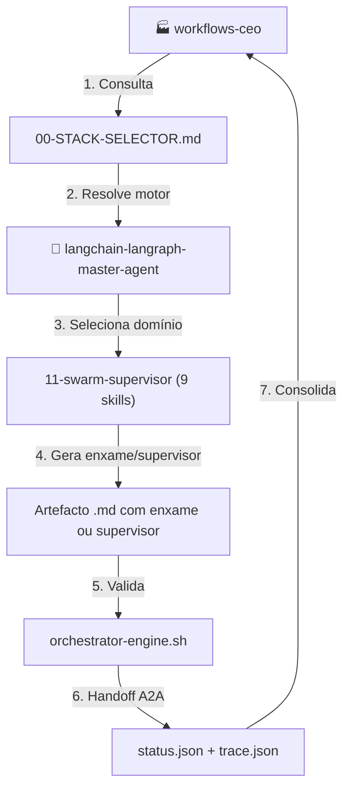
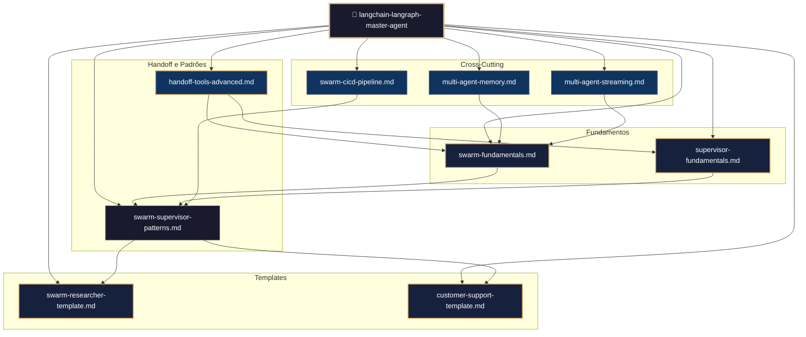
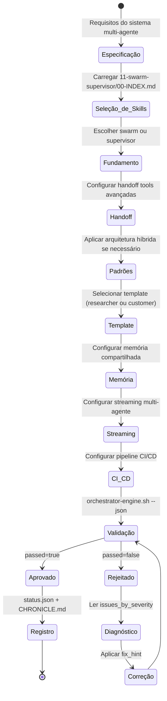
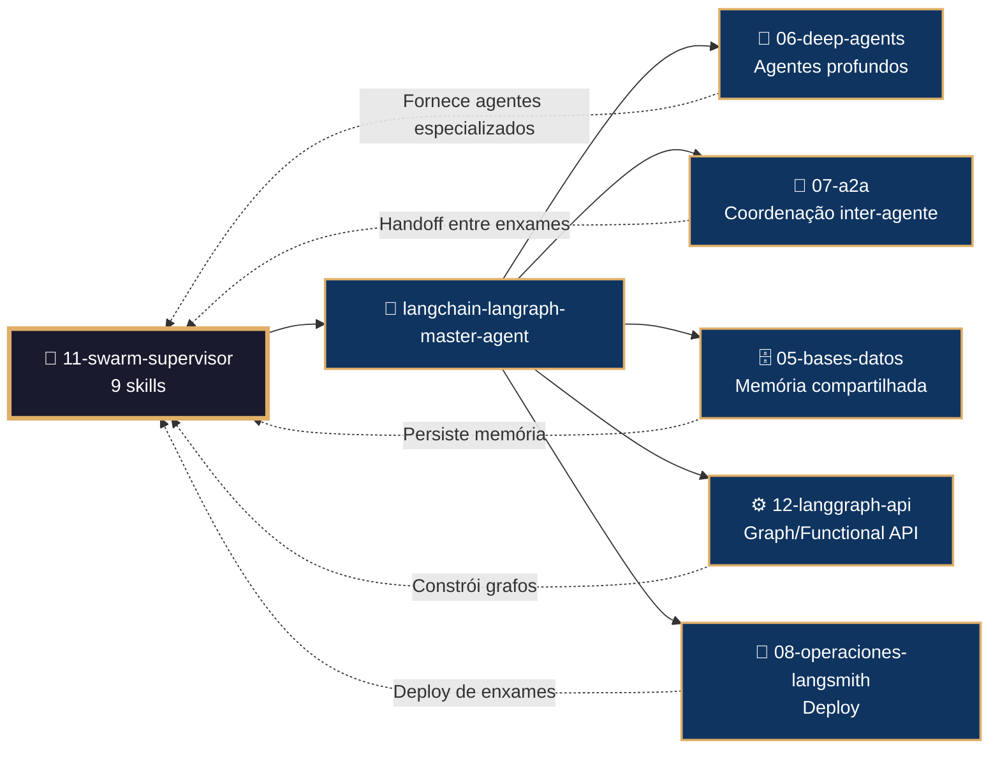

# 🐝 Procedimento Operacional Padrão — LangChain/LangGraph: Swarm & Supervisor

**Objetivo**: Estabelecer o fluxo de trabalho completo para criação, orquestração, handoff e deploy de enxames multi-agente e supervisores hierárquicos usando as 9 skills do subdomínio `11-swarm-supervisor` no ecossistema LangChain/LangGraph dentro de `04-WORKFLOWS/langchain-langraph/`.

**Público-alvo**: Arquitetos humanos, agentes mestres, engenheiros de IA, desenvolvedores de sistemas multi-agente, especialistas em orquestração.

---

## 1. Visão Geral do Subdomínio

O subdomínio `11-swarm-supervisor` contém **9 skills** que implementam padrões de enxame e supervisão:

| # | Skill | Propósito |
|---|-------|-----------|
| 1 | `swarm-fundamentals.md` | Criação de enxames com `create_swarm` e `SwarmState` |
| 2 | `supervisor-fundamentals.md` | Criação de supervisores com `create_supervisor` |
| 3 | `handoff-tools-advanced.md` | Ferramentas de handoff com contexto, tenant, permissões |
| 4 | `swarm-supervisor-patterns.md` | Arquiteturas híbridas: supervisor sobre enxame, enxame de supervisores |
| 5 | `swarm-researcher-template.md` | Template de enxame de pesquisa (planner + researcher) |
| 6 | `customer-support-template.md` | Template de suporte multi-serviço com handoff |
| 7 | `multi-agent-memory.md` | Memória compartilhada em enxames |
| 8 | `multi-agent-streaming.md` | Streaming em tempo real para sistemas multi-agente |
| 9 | `swarm-cicd-pipeline.md` | Pipeline CI/CD para projetos swarm/supervisor |

### 1.1 Conexão com o Ecossistema `goals/`



---

## 2. Mapa de Skills e Inter-relações



---

## 3. Fluxo de Geração de Enxame ou Supervisor



---

## 4. Conexão com Outros Domínios



---

## 5. Estrutura de Diretórios

```
04-WORKFLOWS/langchain-langraph/libs/11-swarm-supervisor/
├── swarm-fundamentals.md                 # create_swarm, SwarmState
├── supervisor-fundamentals.md            # create_supervisor, hierarquia
├── handoff-tools-advanced.md             # Handoff com contexto e tenant
├── swarm-supervisor-patterns.md          # Arquiteturas híbridas
├── swarm-researcher-template.md          # Template planner + researcher
├── customer-support-template.md          # Template multi-serviço
├── multi-agent-memory.md                 # Memória compartilhada
├── multi-agent-streaming.md              # Streaming multi-agente
└── swarm-cicd-pipeline.md                # CI/CD para enxames
```

---

## 6. Exemplos de Código e Padrões

### 6.1 Enxame Básico (swarm-fundamentals.md)

```python
from langgraph_swarm import create_swarm, create_handoff_tool
from langgraph.checkpoint.memory import InMemorySaver

alice = create_agent(model, tools=[add, create_handoff_tool(agent_name="Bob")], name="Alice")
bob = create_agent(model, tools=[create_handoff_tool(agent_name="Alice")], name="Bob")

workflow = create_swarm([alice, bob], default_active_agent="Alice")
app = workflow.compile(checkpointer=InMemorySaver())

config = {"configurable": {"thread_id": "1"}}
result = app.invoke({"messages": [{"role": "user", "content": "Falar com Bob"}]}, config)
```

### 6.2 Supervisor Hierárquico (supervisor-fundamentals.md)

```python
from langgraph_supervisor import create_supervisor

pesquisador = create_agent(model, tools=[buscar_web], name="pesquisador")
escritor = create_agent(model, tools=[], name="escritor")

supervisor = create_supervisor(
    [pesquisador, escritor],
    model=model,
    prompt="Para pesquisa use pesquisador. Para texto use escritor.",
    output_mode="last_message"
)

result = supervisor.invoke({"messages": [{"role": "user", "content": "Pesquise e escreva sobre IA"}]})
```

### 6.3 Handoff com Contexto (handoff-tools-advanced.md)

```python
from handoff_tools_advanced import create_context_handoff_tool

handoff = create_context_handoff_tool(
    agent_name="especialista",
    include_task_description=True,
    include_tenant_context=True,
    extra_fields={"prioridade": "alta"}
)
```

### 6.4 Memória Compartilhada (multi-agent-memory.md)

```python
from langgraph.store.memory import InMemoryStore
from langgraph.checkpoint.memory import InMemorySaver

store = InMemoryStore()
checkpointer = InMemorySaver()

workflow = create_swarm([alice, bob], default_active_agent="Alice")
app = workflow.compile(checkpointer=checkpointer, store=store)

# Alice e Bob podem acessar a mesma store
```

### 6.5 Streaming Multi-Agente (multi-agent-streaming.md)

```python
for chunk in app.stream(
    {"messages": [{"role": "user", "content": "Preciso de ajuda"}]},
    config,
    stream_mode="values",
    subgraphs=True
):
    if "active_agent" in chunk:
        print(f"Agente ativo: {chunk['active_agent']}")
    if "messages" in chunk:
        print(f"Mensagem: {chunk['messages'][-1].content}")
```

### 6.6 Pipeline CI/CD (swarm-cicd-pipeline.md)

```yaml
name: Swarm CI
on:
  push:
    branches: [main]
jobs:
  test:
    runs-on: ubuntu-latest
    steps:
      - uses: actions/checkout@v4
      - name: Run tests
        run: make test
  build:
    needs: test
    runs-on: ubuntu-latest
    steps:
      - name: Build Docker image
        run: langgraph build -t swarm-app:latest
```

---

## 7. Processo de Validação

### 7.1 Comandos de Validação por Artefacto

```bash
# Validação de skill individual
bash 05-CONFIGURATIONS/validation/orchestrator-engine.sh \
  --file 04-WORKFLOWS/langchain-langraph/libs/11-swarm-supervisor/swarm-fundamentals.md \
  --json

# Validação completa do subdomínio 11-swarm-supervisor
for f in 04-WORKFLOWS/langchain-langraph/libs/11-swarm-supervisor/*.md; do
  bash 05-CONFIGURATIONS/validation/orchestrator-engine.sh --file "$f" --json
done
```

### 7.2 Checklist de Validação

| # | Verificação | Constraint | Comando | ✅ Esperado |
|---|---|---|---|---|
| 1 | Frontmatter YAML válido | C5 | `validate-frontmatter.sh` | passed=true |
| 2 | Bootstrap com mantis_log | C8 | `grep 'def mantis_log' <file>` | Encontrado |
| 3 | Testes TDD presentes | C5 | `grep 'def test_' <file>` | ≥3 testes |
| 4 | Enxame compilado com checkpointer | C7 | `grep 'checkpointer\|InMemorySaver' <file>` | Presente |
| 5 | Handoff tools definidas | C5 | `grep 'create_handoff_tool' <file>` | Presente |
| 6 | Memória compartilhada configurada | C6 | `grep 'store\|InMemoryStore' <file>` | Se multi-agente |
| 7 | Streaming multi-agente | C8 | `grep 'subgraphs=True' <file>` | Configurado |
| 8 | Sem secrets hardcoded | C3 | `audit-secrets.sh` | Zero violações |

---

## 8. Troubleshooting

| Sintoma | Causa Provável | Diagnóstico | Solução |
|---------|---------------|-------------|---------|
| `Swarm não faz handoff` | Tool de handoff não registrada | `print(agent.tools)` | Adicionar `create_handoff_tool` |
| `Supervisor não roteia` | Prompt não especifica agentes | `print(result["messages"])` | Refinar prompt do supervisor |
| `Memória não persiste` | Checkpointer não compilado | `workflow.compile(checkpointer=...)` | Adicionar checkpointer |
| `Streaming sem subgrafos` | `subgraphs=True` ausente | `app.stream(..., subgraphs=True)` | Adicionar parâmetro |
| `CI/CD falha no build` | `langgraph build` não configurado | `langgraph --version` | Instalar langgraph-cli |
| `Handoff não propaga tenant` | `include_tenant_context=False` | `create_context_handoff_tool(...)` | Habilitar flag |

---

## 9. Referências Cruzadas

- [[04-WORKFLOWS/langchain-langraph/langchain-langraph-master-agent.md]]
- [[04-WORKFLOWS/langchain-langraph/libs/11-swarm-supervisor/swarm-fundamentals.md]]
- [[04-WORKFLOWS/langchain-langraph/libs/11-swarm-supervisor/supervisor-fundamentals.md]]
- [[04-WORKFLOWS/langchain-langraph/libs/11-swarm-supervisor/handoff-tools-advanced.md]]
- [[04-WORKFLOWS/langchain-langraph/libs/11-swarm-supervisor/swarm-supervisor-patterns.md]]
- [[04-WORKFLOWS/langchain-langraph/libs/11-swarm-supervisor/multi-agent-memory.md]]
- [[04-WORKFLOWS/langchain-langraph/libs/11-swarm-supervisor/multi-agent-streaming.md]]
- [[04-WORKFLOWS/langchain-langraph/libs/11-swarm-supervisor/swarm-cicd-pipeline.md]]
- [[04-WORKFLOWS/workflows-ceo.md]]
- [[04-WORKFLOWS/00-STACK-SELECTOR.md]]
- [[05-CONFIGURATIONS/validation/orchestrator-engine.sh]]
- [[07-PROCEDURES/observability-langchain-langraph-sop.md]]
- [[07-PROCEDURES/langraph-api-langchain-langraph-sop.md]]

---

> **Versão 2.3.0** | Procedimento Operacional Padrão do subdomínio `11-swarm-supervisor` — MANTIS Agentic.
> Aplicável a partir de 2026-05-28.
