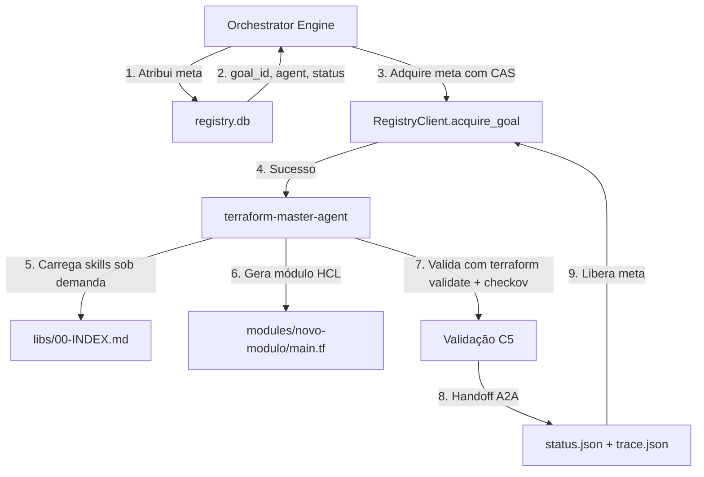
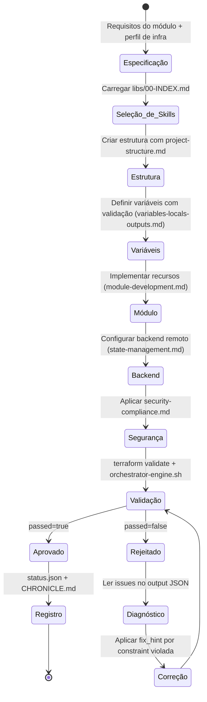
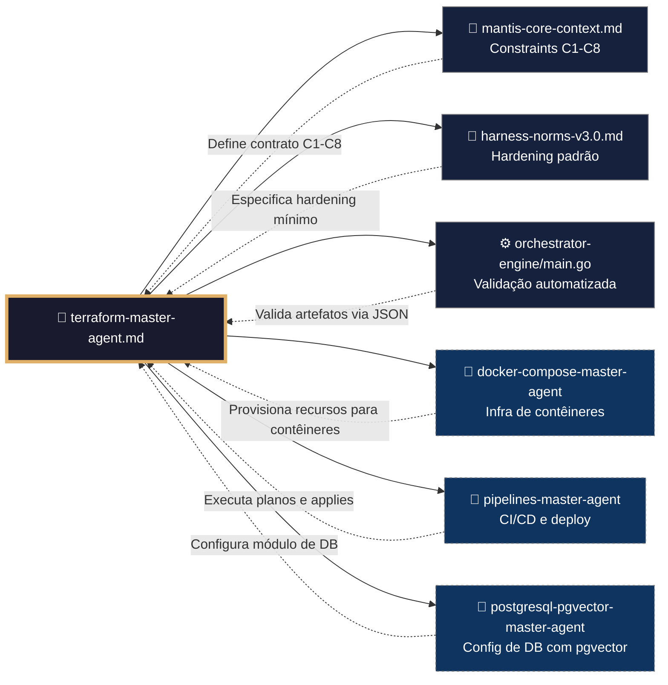
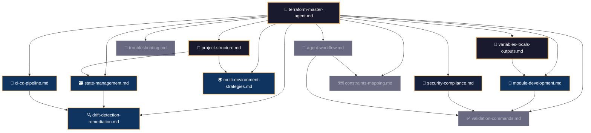
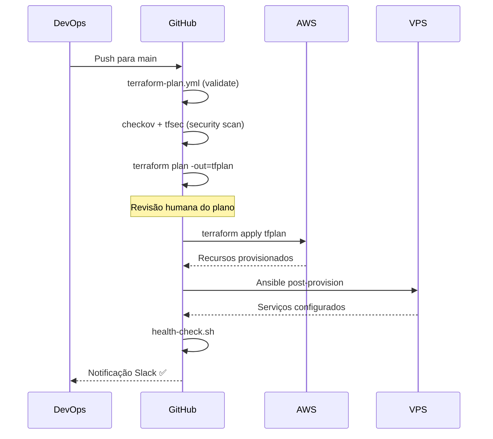

# 🏗️ Procedimento Operacional Padrão — Terraform MANTIS Agentic

**Objetivo**: Estabelecer o fluxo de trabalho completo para criação, validação, planejamento e aplicação de infraestrutura como código no domínio `terraform/`, incluindo integração com `goals/`, exemplos reais de módulos, estratégias de deploy, detecção de drift e recuperação de falhas.

**Público-alvo**: Arquitetos humanos, agentes mestres, engenheiros DevOps, SREs, operadores de infraestrutura.

---

## 1. Visão Geral do Domínio

O domínio `05-CONFIGURATIONS/terraform/` é responsável pela infraestrutura como código (IaC) no ecossistema MANTIS. Ele contém:

- **Agente Mestre** (`terraform-master-agent.md`): framework executável de geração de módulos HCL.
- **Skills Modulares** (`libs/`): 12 padrões reutilizáveis (estrutura de projeto, módulos, estado, segurança, troubleshooting).
- **Módulos Reais** (`modules/`): `vps-base`, `backup-encrypted`, `openrouter-proxy`, `postgres-rls`, `qdrant-cluster`.
- **Ambientes** (`envs/`): configurações de `dev`, `staging` e `prod` com backends isolados.
- **Políticas OPA** (`policies/`): regras Rego para segurança e compliance.

### 1.1 Conexão com o Ecossistema `goals/`



---

## 2. Fluxo de Geração de Módulos Terraform



---

## 3. Conexão com Outros Domínios



---

## 4. Inter-relação dos Módulos Internos (`libs/`)



---

## 5. Estrutura de Projeto e Configuração do Backend

### 5.1 Estrutura de Diretórios

```
05-CONFIGURATIONS/terraform/
├── backend.tf                 # Backend S3 + DynamoDB + KMS
├── versions.tf                # Pines de providers e Terraform
├── providers.tf               # Providers com OIDC
├── variables.tf               # Variáveis globais com validação
├── outputs.tf                 # Saídas principais
├── modules/
│   ├── vps-base/              # Módulo base para VPS
│   ├── backup-encrypted/      # Backup cifrado
│   ├── openrouter-proxy/      # Proxy para OpenRouter
│   ├── postgres-rls/          # PostgreSQL com Row Level Security
│   └── qdrant-cluster/        # Cluster Qdrant para embeddings
├── envs/
│   ├── dev/
│   ├── staging/
│   └── prod/
└── policies/                  # Políticas OPA/Rego
```

### 5.2 Configuração do Backend Remoto

```hcl
# backend.tf
terraform {
  backend "s3" {
    bucket         = "mantis-terraform-state"
    key            = "envs/${terraform.workspace}/terraform.tfstate"
    region         = "us-east-1"
    encrypt        = true
    kms_key_id     = "alias/terraform-state-key"
    dynamodb_table = "terraform-state-lock"
  }
}
```

### 5.3 Providers com OIDC

```hcl
# providers.tf
provider "aws" {
  region = var.aws_region
  assume_role_with_web_identity {
    role_arn           = var.terraform_role_arn
    web_identity_token = var.identity_token
  }
}
```

---

## 6. Exemplos de Módulos Reais

### 6.1 Módulo VPS Base (`modules/vps-base/main.tf`)

**Objetivo**: Provisionar a infraestrutura base de uma VPS com segurança, rede e monitoring.

```hcl
# modules/vps-base/main.tf
resource "aws_instance" "this" {
  ami           = var.ami_id
  instance_type = var.instance_type
  subnet_id     = var.subnet_id
  
  vpc_security_group_ids = [aws_security_group.this.id]
  
  root_block_device {
    volume_type = "gp3"
    volume_size = var.root_volume_size
    encrypted   = true
  }
  
  tags = merge(local.common_tags, {
    Name = "${var.name}-vps"
  })
  
  lifecycle {
    create_before_destroy = true
  }
}

resource "aws_security_group" "this" {
  name        = "${var.name}-sg"
  description = "Security group for ${var.name}"
  vpc_id      = var.vpc_id
  
  ingress {
    from_port   = 22
    to_port     = 22
    protocol    = "tcp"
    cidr_blocks = [var.admin_cidr]  # Apenas IP administrativo
  }
  
  ingress {
    from_port   = 443
    to_port     = 443
    protocol    = "tcp"
    cidr_blocks = ["0.0.0.0/0"]  # HTTPS público
  }
  
  egress {
    from_port   = 0
    to_port     = 0
    protocol    = "-1"
    cidr_blocks = ["0.0.0.0/0"]
  }
  
  tags = local.common_tags
  
  lifecycle {
    create_before_destroy = true
  }
}
```

### 6.2 Módulo PostgreSQL com Row Level Security (`modules/postgres-rls/main.tf`)

```hcl
# modules/postgres-rls/main.tf
resource "aws_db_instance" "this" {
  identifier = var.identifier
  engine     = "postgres"
  engine_version = "15.4"
  instance_class = var.instance_class
  
  allocated_storage     = var.allocated_storage
  max_allocated_storage = var.max_allocated_storage
  storage_encrypted     = true  # C3
  
  db_name  = var.db_name
  username = var.master_username
  password = var.master_password  # sensitive = true
  
  multi_az               = true
  db_subnet_group_name   = aws_db_subnet_group.this.name
  vpc_security_group_ids = [aws_security_group.this.id]
  
  backup_retention_period = var.backup_retention_days
  backup_window          = "03:00-04:00"
  maintenance_window     = "sun:04:00-sun:05:00"
  
  skip_final_snapshot = false
  final_snapshot_identifier = "${var.identifier}-final"
  
  tags = local.common_tags
  
  lifecycle {
    prevent_destroy = false
    ignore_changes  = [password]
  }
}
```

### 6.3 Módulo Qdrant Cluster (`modules/qdrant-cluster/main.tf`)

```hcl
# modules/qdrant-cluster/main.tf
resource "aws_instance" "qdrant" {
  count         = var.node_count
  ami           = var.ami_id
  instance_type = var.instance_type
  subnet_id     = var.subnet_ids[count.index % length(var.subnet_ids)]
  
  vpc_security_group_ids = [aws_security_group.qdrant.id]
  
  user_data = templatefile("${path.module}/templates/qdrant-init.sh.tpl", {
    cluster_name    = var.cluster_name
    node_id         = count.index + 1
    api_key         = var.qdrant_api_key
    raft_port       = 6335
    grpc_port       = 6334
    http_port       = 6333
  })
  
  root_block_device {
    volume_type = "gp3"
    volume_size = var.data_volume_size
    encrypted   = true
  }
  
  tags = merge(local.common_tags, {
    Name = "${var.cluster_name}-node-${count.index + 1}"
    Role = "qdrant"
  })
  
  lifecycle {
    create_before_destroy = true
  }
}

resource "aws_security_group" "qdrant" {
  name        = "${var.cluster_name}-sg"
  description = "Security group for Qdrant cluster ${var.cluster_name}"
  vpc_id      = var.vpc_id
  
  # HTTP API (REST)
  ingress {
    from_port       = 6333
    to_port         = 6333
    protocol        = "tcp"
    security_groups = [var.app_security_group_id]
  }
  
  # gRPC
  ingress {
    from_port       = 6334
    to_port         = 6334
    protocol        = "tcp"
    security_groups = [var.app_security_group_id]
  }
  
  # Raft (interno)
  ingress {
    from_port = 6335
    to_port   = 6335
    protocol  = "tcp"
    self      = true
  }
  
  egress {
    from_port   = 0
    to_port     = 0
    protocol    = "-1"
    cidr_blocks = ["0.0.0.0/0"]
  }
  
  tags = local.common_tags
}
```

---

## 7. Processo de Deploy de Infraestrutura



### 7.1 Comandos de Deploy

```bash
# 1. Inicializar backend
cd 05-CONFIGURATIONS/terraform/envs/prod
terraform init -backend-config="key=envs/prod/terraform.tfstate"

# 2. Validar configuração
terraform validate
terraform fmt -recursive -check

# 3. Escanear segurança
checkov -d . --framework terraform
tfsec . --minimum-severity HIGH

# 4. Planejar
terraform plan -out=tfplan -var-file=terraform.tfvars

# 5. Revisar plano
terraform show tfplan

# 6. Aplicar (com aprovação)
terraform apply tfplan
```

---

## 8. Validação Pós-Deploy

| # | Verificação | Constraint | Comando | ✅ Esperado |
|---|---|---|---|---|
| 1 | `terraform validate` passa | C5 | `terraform validate` | Success |
| 2 | `terraform fmt -check` sem mudanças | C5 | `terraform fmt -recursive -check` | Zero arquivos alterados |
| 3 | Backend remoto configurado | C2 | `grep 'backend "s3"' backend.tf` | Encontrado |
| 4 | Secrets como `sensitive = true` | C3 | `grep 'sensitive\s*=\s*true' variables.tf` | Todos os secrets |
| 5 | Cifrado em repouso habilitado | C3 | `grep 'storage_encrypted\s*=\s*true' modules/*/main.tf` | Encontrado |
| 6 | OIDC configurado | C3 | `grep 'assume_role_with_web_identity' providers.tf` | Encontrado |
| 7 | `checkov` sem CRITICAL | C5 | `checkov -d . --framework terraform` | Zero CRITICAL |
| 8 | `tfsec` sem HIGH | C5 | `tfsec . --minimum-severity HIGH` | Zero HIGH |
| 9 | Health check da aplicação | C8 | `curl -f https://app.example.com/health/ready` | HTTP 200 |

---

## 9. Gestão de Estado

### 9.1 Comandos Essenciais

```bash
# Listar recursos no estado
terraform state list

# Mostrar detalhes de um recurso
terraform state show aws_instance.web

# Backup do estado
terraform state pull > backup-$(date +%Y%m%d%H%M%S).tfstate

# Migração de backend (local → remoto)
terraform init -migrate-state

# Desbloqueio forçado (apenas se confirmado que não há operação em curso)
terraform force-unlock <LOCK_ID>
```

### 9.2 Recuperação de Estado Corrompido

```bash
# 1. Listar versões disponíveis no S3
aws s3api list-object-versions \
  --bucket mantis-terraform-state \
  --prefix envs/prod/terraform.tfstate

# 2. Descarregar versão específica
aws s3api get-object \
  --bucket mantis-terraform-state \
  --key envs/prod/terraform.tfstate \
  --version-id <VERSION_ID> \
  recovered.tfstate

# 3. Validar estado recuperado
terraform show -json recovered.tfstate | jq '.values.root_module.resources | length'

# 4. Push do estado recuperado
terraform state push recovered.tfstate
```

---

## 10. Detecção e Remediação de Drift

### 10.1 Categorias de Drift

| Categoria | Severidade | Exemplos | Ação |
|-----------|-----------|----------|------|
| Security Drift | CRITICAL | Security groups abertos, IAM relaxado | Reverter imediatamente |
| Configuration Drift | HIGH | Instance type alterado, DB params | Avaliar impacto |
| Tag Drift | MEDIUM | Tags removidos ou incorretos | Atualizar HCL |
| Metadata Drift | LOW | ARNs, timestamps | Aceitar automaticamente |

### 10.2 Script de Detecção

```bash
#!/usr/bin/env bash
# scripts/drift-check.sh
set -euo pipefail

ENVIRONMENT="${1:?Usage: drift-check.sh <environment>}"
cd "05-CONFIGURATIONS/terraform/envs/$ENVIRONMENT"

terraform init -backend-config="key=envs/$ENVIRONMENT/terraform.tfstate" -input=false

terraform plan -refresh-only -out=drift.out -no-color

terraform show -json drift.out | \
  jq -r '.resource_changes[] | select(.change.actions != ["no-op"]) | "\(.address): \(.change.actions | join(", "))"'
```

### 10.3 Resolução

```bash
# Aceitar drift (atualizar estado para coincidir com a infra real)
terraform apply -refresh-only -auto-approve

# Rejeitar drift (reverter infra para coincidir com HCL)
terraform apply -auto-approve
```

---

## 11. Troubleshooting

| Sintoma | Causa Provável | Diagnóstico | Solução |
|---------|---------------|-------------|---------|
| `terraform init` falha | Backend inacessível ou credenciais expiradas | `aws s3 ls s3://mantis-terraform-state` | Verificar credenciais OIDC, renovar token |
| `terraform plan` mostra drift inesperado | Mudança manual na console AWS | `terraform plan -refresh-only` | Avaliar e corrigir HCL |
| `terraform apply` timeout | Estado bloqueado por operação pendente | `aws dynamodb scan --table-name terraform-state-lock` | `terraform force-unlock` |
| `Provider produced inconsistent result` | Bug do provider ou versão incompatível | `terraform providers lock` | Atualizar versão do provider |
| `Resource not found` no apply | Recurso deletado manualmente | `terraform refresh` | Reimportar recurso com `terraform import` |
| `Invalid count argument` | `count` ou `for_each` com valor inválido | `terraform console` | Verificar variáveis de entrada |
| `Error acquiring state lock` | Lock não liberado por falha anterior | `aws dynamodb scan --table-name terraform-state-lock` | `terraform force-unlock` |
| `Plan shows destroy/create` | `for_each` com chaves instáveis | `terraform show -json` | Usar chaves estáveis e previsíveis |

---

## 12. Comandos de Validação

```bash
# Validação rápida (pre-commit)
terraform validate
terraform fmt -recursive -check

# Validação de segurança
checkov -d terraform/ --framework terraform --compact
tfsec terraform/ --minimum-severity HIGH

# Validação de políticas OPA
conftest test terraform/ --policy terraform/policies

# Validação MANTIS completa
bash orchestrator-engine.sh --domain terraform --strict

# Verificar secrets hardcoded
grep -r "password\s*=" terraform/ --include="*.tf" --exclude="*.tfvars"

# Verificar pines de providers
grep -r "version\s*=" terraform/versions.tf | grep -v "~>"

# Validar sintaxe de todos os arquivos
for f in $(find terraform/ -name '*.tf' -not -path '*/.terraform/*'); do
  terraform fmt -check "$f" && echo "✅ $f" || echo "❌ $f"
done
```

---

## 13. Rollback de Emergência

### 13.1 Rollback de Infraestrutura

```bash
# 1. Listar versões do estado no S3
aws s3api list-object-versions \
  --bucket mantis-terraform-state \
  --prefix envs/prod/terraform.tfstate \
  --query 'Versions[*].[VersionId,LastModified]' \
  --output table

# 2. Descarregar versão estável anterior
aws s3api get-object \
  --bucket mantis-terraform-state \
  --key envs/prod/terraform.tfstate \
  --version-id <VERSION_ID_ESTAVEL> \
  recovered.tfstate

# 3. Push do estado recuperado
terraform state push recovered.tfstate

# 4. Verificar o plano de rollback
terraform plan -out=rollback.tfplan

# 5. Aplicar rollback
terraform apply rollback.tfplan

# 6. Verificar saúde
curl -f https://app.example.com/health/ready || exit 1

# 7. Notificar
curl -X POST $SLACK_WEBHOOK -H 'Content-type: application/json' \
  --data '{"text":"🔙 Rollback de infraestrutura executado"}'
```

### 13.2 Rollback de Módulo Específico

```bash
# Destruir e recriar um módulo específico
terraform destroy -target=module.qdrant_cluster -auto-approve
terraform apply -target=module.qdrant_cluster -auto-approve
```

---

## 14. Referências Cruzadas

- [[05-CONFIGURATIONS/terraform/terraform-master-agent.md]] — Agente mestre
- [[05-CONFIGURATIONS/terraform/libs/00-INDEX.md]] — Índice de skills
- [[05-CONFIGURATIONS/terraform/modules/vps-base/main.tf]] — Módulo base VPS
- [[05-CONFIGURATIONS/terraform/modules/postgres-rls/main.tf]] — Módulo PostgreSQL com RLS
- [[05-CONFIGURATIONS/terraform/modules/qdrant-cluster/main.tf]] — Módulo Qdrant Cluster
- [[05-CONFIGURATIONS/terraform/backend.tf]] — Configuração do backend
- [[05-CONFIGURATIONS/validation/orchestrator-engine.sh]] — Motor de validação
- [[goals/README.md]] — Sistema de metas
- [[01-RULES/harness-norms-v3.0.md]] — Hardening padrão
- [[01-RULES/11-A2A-COMMUNICATION-RULES.md]] — Contrato A2A (C9)
- [[07-PROCEDURES/docker-compose-sop.md]] — SOP de Docker Compose
- [[07-PROCEDURES/pipelines-sop.md]] — SOP de Pipelines

---

> **Versão 2.3.0** | Procedimento Operacional Padrão do domínio `terraform/` — MANTIS Agentic.
> Aplicável a partir de 2026-05-24.
