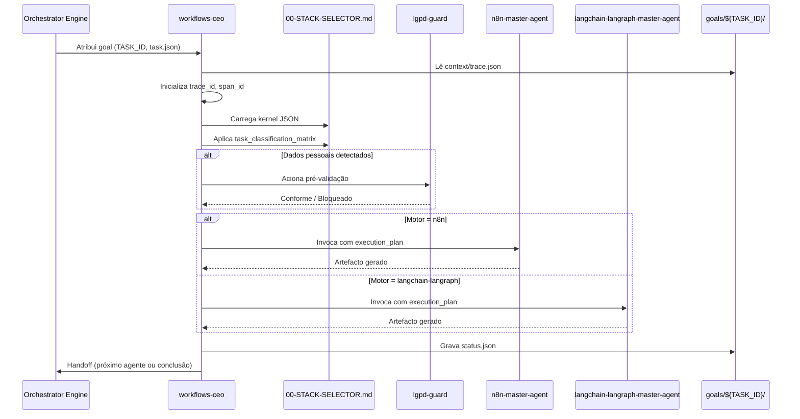
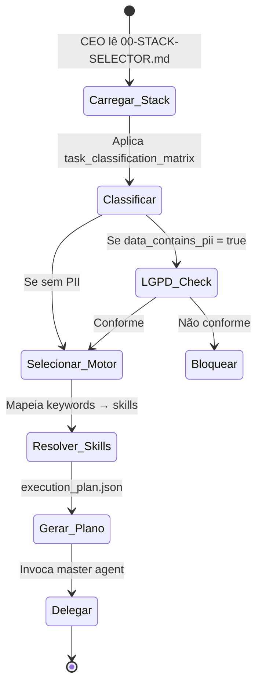
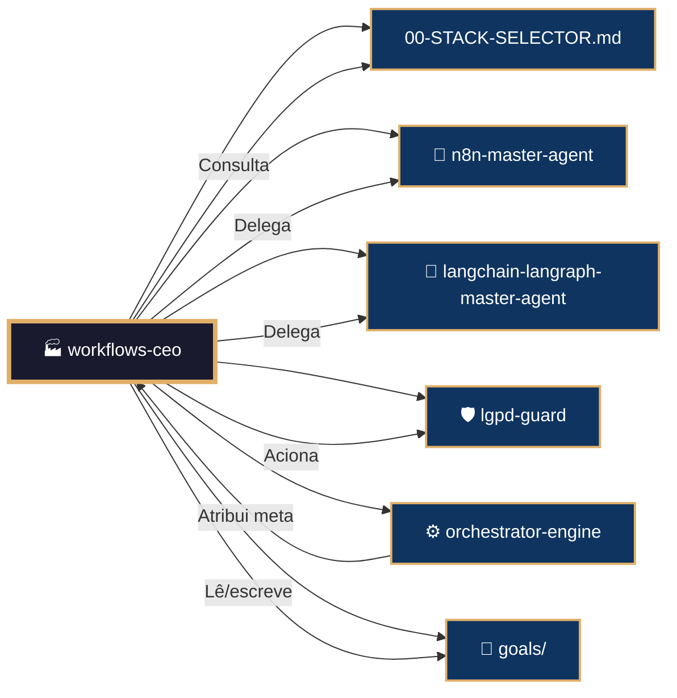

# 🏭 Procedimento Operacional Padrão — Workflows CEO (Coordenador Central)

**Objetivo**: Definir o funcionamento do `workflows-ceo` como orquestrador máximo do domínio `04-WORKFLOWS/`. Este documento explica como o CEO é invocado, como consulta o `00-STACK-SELECTOR.md`, como decide entre os motores n8n e LangChain/LangGraph, como aciona o `lgpd-guard`, e como gerencia o ciclo de vida das metas (`goals/`) com rastreabilidade completa (A2A/C9).

**Público-alvo**: Arquitetos humanos, agentes mestres, orquestrador principal, engenheiros de integração.

---

## 1. Papel do Workflows CEO

O `workflows-ceo` é o **ponto de entrada único** para qualquer solicitação que envolva criação, modificação ou consulta de artefactos dentro de `04-WORKFLOWS/`. Ele:

- **Recebe** metas do sistema `goals/` (via `orchestrator-engine` ou manualmente).
- **Consulta** o `00-STACK-SELECTOR.md` para determinar o motor de workflow adequado.
- **Aciona** o `lgpd-guard` se a tarefa envolver dados pessoais.
- **Delega** a execução ao `n8n-master-agent` (automação visual/API) ou ao `langchain-langraph-master-agent` (IA pesada).
- **Consolida** resultados e gerencia handoffs entre agentes.

---

## 2. Fluxo de Invocação e Decisão



---

## 3. Como o CEO Consulta o Stack Selector

O CEO **não toma decisões baseadas em heurísticas próprias**. Ele segue estritamente o kernel determinista definido em `04-WORKFLOWS/00-STACK-SELECTOR.md`. O processo é:

1. **Carregar** o arquivo `00-STACK-SELECTOR.md` como JSON.
2. **Alimentar** a `task_classification_matrix` com as características da `task.json`.
3. **Selecionar** o motor (`engine`) conforme o peso das regras.
4. **Identificar** domínios e skills obrigatórios (`domain_hint`, `skills`).
5. **Verificar** se a flag `data_contains_pii` ativa o `lgpd-guard`.
6. **Gerar** o `execution_plan.json` com todos os dados necessários para o master agent destino.



### 3.1 Exemplo de Decisão

**Task**: "Criar um agente de análise de sentimento para reseñas de clientes com RAG"

| Característica | Peso | Engine |
|---------------|------|--------|
| `requires_llm_generation` | 90 | `langchain-langraph` |
| `requires_rag_retrieval` | 90 | `langchain-langraph` |
| `data_contains_pii` (true) | 100 | `lgpd-guard` ativado |

Resultado: `execution_plan` → `langchain-langraph`, skills `02-rag/rag-fundamentals`, `04-modelos/deepseek-integration`, `12-langgraph-api/interrupts-patterns`, e pré-validação LGPD.

---

## 4. Delegação para os Master Agents

Uma vez gerado o `execution_plan.json`, o CEO invoca o master agent apropriado usando o protocolo `Task()`:

```python
def delegate_to_agent(plan: dict):
    agent_path = plan["execution_plan"]["primary_agent_path"]
    if "n8n" in agent_path:
        agent = N8NMasterAgent()
    else:
        agent = LangChainLangGraphMasterAgent()

    result = agent.process_task(plan)
    return result
```

O master agent recebe:
- `task.json` original
- `execution_plan.json` com a lista de skills e configurações
- Contexto de tracing (`trace_id`, `span_id`, `parent_span_id`)

---

## 5. Integração com o Sistema `goals/`

O CEO opera estritamente dentro do sistema de metas:

```
goals/${TASK_ID}/
├── context/
│   ├── trace.json          # trace_id, parent_span_id
│   └── task.json           # descrição, dados, constraints
└── artifacts/
    └── workflows-ceo/
        ├── execution_plan.json
        └── status.json
```

O CEO lê `context/` e escreve `artifacts/workflows-ceo/`. Os master agents escrevem em `artifacts/<agent_name>/`.

---

## 6. Observabilidade e Rastreabilidade

Todo passo do CEO é registrado via `mantis_log()`:

```python
mantis_log("INFO", "ceo_started", f"Task={TASK_ID}")
mantis_log("INFO", "stack_selector_decision", f"Engine={engine}, Skills={skills}")
mantis_log("INFO", "agent_delegated", f"Agent={agent_path}")
mantis_log("INFO", "handoff_complete", f"NextAgent={next_agent}")
```

Os logs são enriquecidos com `trace_id` e `span_id` para correlacionamento no LangSmith/OpenTelemetry.

---

## 7. Conexões Externas



---

## 8. Métricas de Desempenho do CEO

| Métrica | Meta | Medição |
|---------|------|---------|
| Tempo de decisão (Stack Selector) | ≤500ms | `performance_ms` |
| Precisão na seleção de motor | 100% | Auditoria manual |
| Handoffs com C9 completo | 100% | `check_a2a_contract.sh` |
| Acionamento LGPD (quando PII) | 100% | `lgpd_guard_activated` flag |

---

## 9. Troubleshooting

| Sintoma | Causa Provável | Solução |
|---------|---------------|---------|
| CEO não encontra Stack Selector | Caminho incorreto | Verificar `STACK_SELECTOR_PATH` |
| Decisão errada de motor | Regra com peso desatualizado | Atualizar `task_classification_matrix` |
| Master agent não responde | Timeout na delegação | Aumentar `timeout_minutes` no execution_plan |
| LGPD não acionado | `data_contains_pii` não setado | Revisar `task.json` |
| status.json não gerado | Permissão de escrita em `goals/` | Verificar filesystem |

---

## 10. Referências Cruzadas

- [[04-WORKFLOWS/workflows-ceo.md]]
- [[04-WORKFLOWS/00-STACK-SELECTOR.md]]
- [[04-WORKFLOWS/n8n/n8n-master-agent.md]]
- [[04-WORKFLOWS/langchain-langraph/langchain-langraph-master-agent.md]]
- [[04-WORKFLOWS/lgpd-guard/lgpd-guard.md]]
- [[04-WORKFLOWS/sdd-universal-assistant.json]]
- [[05-CONFIGURATIONS/validation/orchestrator-engine.sh]]
- [[goals/README.md]]
- [[01-RULES/11-A2A-COMMUNICATION-RULES.md]]

---

> **Versão 2.3.0** | Procedimento Operacional Padrão do `workflows-ceo` — MANTIS Agentic.
> Aplicável a partir de 2026-05-28.
