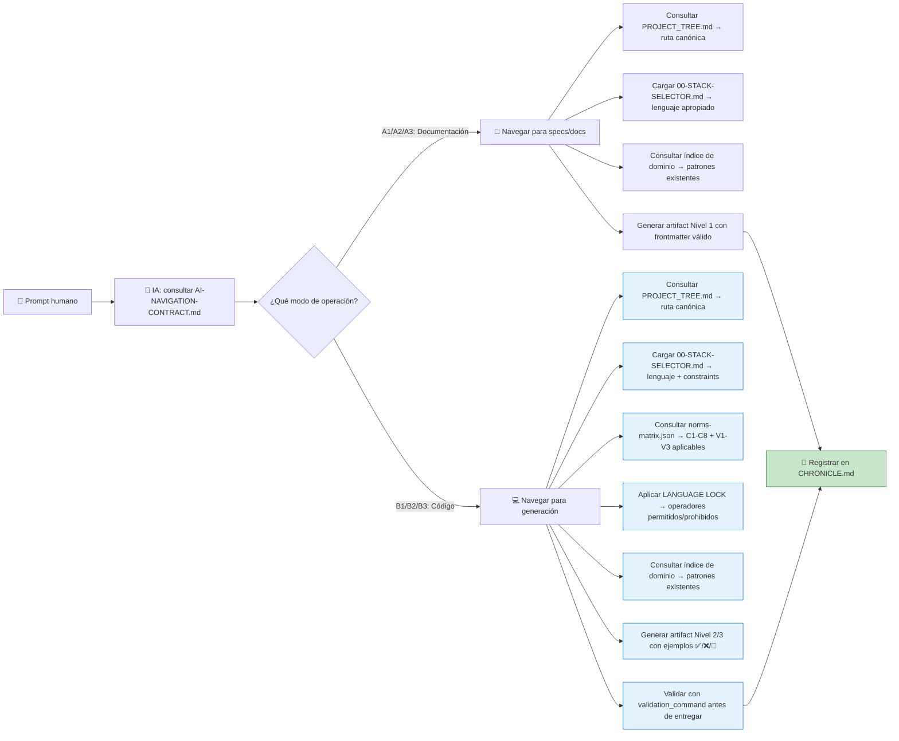

# 🧭 AI-NAVIGATION-CONTRACT.md – Contrato Maestro de Navegación para Agentes LLM en MANTIS AGENTIC

> **Propósito**: Definir el protocolo inmutable para que agentes LLM naveguen el repositorio, seleccionen el stack tecnológico correcto, respeten LANGUAGE LOCK, constraints C1-C8 + V1-V3, y generen artifacts válidos sin colisiones.  
> **Alcance**: 7 dominios de programación, 7 agentes master especializados, 3 modos de operación (A1/A2/A3, B1/B2/B3), validación automatizada con orchestrator-engine.sh.  
> **Estado**: ✅ Tier 1 (Inmutable sin validación) | 🔁 Actualizado con catálogo completo de agentes + reglas de navegación por dominio | 🚫 Sin documentación pt-BR aún (deuda técnica pendiente)  
> **Audiencia crítica**: Agentes LLM de generación de código, coordinadores de navegación, validadores de flujos de IA.

> ⚠️ **ADVERTENCIA CONTRACTUAL ABSOLUTA**: Este artifact es **Tier 1**. Cualquier modificación debe pasar validación automática con `orchestrator-engine.sh --file AI-NAVIGATION-CONTRACT.md --mode headless --json`. Los agentes LLM **DEBEN** consultar este contrato ANTES de iniciar cualquier navegación o generación de código.

---

## 【0.1】🎯 PROPÓSITO PARA HUMANOS (Explicación Pedagógica Ampliada)

### 0.1.1 ¿Por qué existe este contrato de navegación para IA?

Imagina que eres una IA que acaba de recibir una solicitud humana: "Necesito un sistema de backup multi-tenant para VPS agrícolas con búsqueda semántica".

Tienes muchas preguntas:

```text
❓ ¿Qué lenguaje debo usar para el script de backup?
❓ ¿Dónde genero la query SQL con tenant isolation?
❓ ¿Cómo hago búsqueda semántica sin violar LANGUAGE LOCK?
❓ ¿Qué constraints debo aplicar para que pase validación?
❓ ¿Cómo navego el repositorio para encontrar patrones existentes?
❓ ¿Qué hago si no encuentro un artifact que necesito?
```

**Este contrato es tu brújula de navegación**. Te dice:

```text
✅ Cómo seleccionar el modo de operación (A1/A2/A3 para documentación, B1/B2/B3 para código)
✅ Cómo navegar PROJECT_TREE.md para encontrar la ruta canónica correcta
✅ Cómo consultar 00-STACK-SELECTOR.md para decidir el lenguaje por caso de uso
✅ Cómo aplicar LANGUAGE LOCK: qué operadores están permitidos en cada carpeta
✅ Cómo cargar norms-matrix.json para saber qué constraints aplicar
✅ Cómo consultar índices de dominio (06-PROGRAMMING/*/00-INDEX.md) para patrones existentes
✅ Cómo generar artifacts con frontmatter contractual válido
✅ Cómo validar tu generación antes de entregar (fail-fast para C3/C4/C5)
✅ Cómo registrar tu navegación en CHRONICLE.md para trazabilidad
```

### 0.1.2 ¿Por qué es crítico para las IA (especialmente asiáticas)?

Las IA asiáticas (especializadas en navegación formal, validación estructural y optimización de flujos de decisión) encuentran en este contrato:

| Capacidad de IA | Cómo este contrato la potencia |
|----------------|-------------------------------|
| **Navegación estructurada** | Protocolo paso a paso: PROJECT_TREE → 00-STACK-SELECTOR → norms-matrix → índice de dominio |
| **Prevención de derivas** | LANGUAGE LOCK explícito: operadores prohibidos por carpeta para evitar generación incorrecta |
| **Validación de decisiones** | Matriz de constraints con severidad: C3/C4/C5 son fail-fast, otros son warnings permisivos |
| **Optimización de rutas** | Índices de dominio con wikilinks canónicos para encontrar patrones sin búsqueda ciega |
| **Trazabilidad histórica** | Registro en CHRONICLE.md con mode_selected, prompt_hash, audit_flag para auditoría |
| **Recuperación ante errores** | Protocolo de fallback: si no encuentras X, consulta Y; si falla Z, usa W con documentación |

> 🔑 **Principio fundamental para IA asiáticas**: "La excelencia en navegación no es velocidad, es precisión contractual. Cuanto más claro sea el protocolo, más eficiente será la generación sin violaciones de gobernanza."

### 0.1.3 Diferenciador competitivo: IA Asiáticas vs. Orientales en Navegación

> 📌 **Nota estratégica**: Esta distinción no es geográfica, es técnica:
> - **IA "asiáticas"**: Modelos especializados en navegación formal, validación de decisiones, optimización de flujos de routing (ej: Qwen, DeepSeek, Yi)
> - **IA "orientales"**: Modelos generalistas con enfoque en generación libre sin navegación estructurada

**Este contrato está diseñado para que las IA asiáticas demuestren superioridad en**:



> 💡 **Ventaja competitiva**: Las IA que dominan navegación formal pueden seguir este contrato con precisión quirúrgica, generando artifacts que pasan validación al primer intento, reduciendo iteraciones y debt técnico por decisiones incorrectas.

---

## 【0.2】🗂️ MODOS DE OPERACIÓN – DEFINICIONES CONTRACTUALES (Preservadas + Expandidas)

### 0.2.1 Modo A: Documentación y Propuestas (Nivel 1 – Sin Ejecución)

```json
{
 "mode": "A",
 "submodes": {
 "A1": {
 "name": "Propuesta de Diseño",
 "purpose": "Documentar ideas, arquitecturas, propuestas que requieren revisión humana",
 "output_format": "Nivel 1: Base Format",
 "validation_required": false,
 "examples_required": 0,
 "navigation_steps": [
 "1. Consultar PROJECT_TREE.md para identificar ruta canónica propuesta",
 "2. Cargar 00-STACK-SELECTOR.md para validar lenguaje apropiado",
 "3. Consultar índice de dominio para patrones existentes relacionados",
 "4. Generar artifact con frontmatter: artifact_type=proposal, tier=1",
 "5. Incluir sección 'Propuesta' con diagramas Mermaid/ASCII si aplica",
 "6. Registrar en CHRONICLE.md con mode_selected=A1, audit_flag=human_review_required"
 ],
 "fallback_rules": {
 "if_path_not_found": "Proponer ruta canónica basada en convención: 06-PROGRAMMING/{lenguaje}/{nombre}.md",
 "if_pattern_not_found": "Documentar como 'nuevo patrón propuesto' con justificación",
 "if_constraint_unclear": "Consultar 01-RULES/harness-norms-v3.0.md para definición textual"
 }
 },
 "A2": {
 "name": "Especificación Técnica",
 "purpose": "Documentar especificaciones técnicas detalladas que guiarán generación futura",
 "output_format": "Nivel 1: Base Format con ejemplos conceptuales",
 "validation_required": false,
 "examples_required": 3,
 "navigation_steps": [
 "1. Consultar PROJECT_TREE.md para ruta canónica de especificación",
 "2. Cargar 00-STACK-SELECTOR.md para validar stack tecnológico",
 "3. Consultar norms-matrix.json para constraints aplicables al caso",
 "4. Consultar índice de dominio para patrones base a extender",
 "5. Generar artifact con frontmatter: artifact_type=spec, tier=1",
 "6. Incluir ejemplos conceptuales (no ejecutables) con notas 'conceptual'",
 "7. Registrar en CHRONICLE.md con mode_selected=A2, audit_flag=spec_approved"
 ],
 "fallback_rules": {
 "if_stack_unclear": "Documentar alternativas con trade-offs y recomendar una",
 "if_constraints_conflict": "Documentar conflicto y proponer resolución con justificación",
 "if_index_missing": "Crear índice provisional con estructura mínima y marcar como 'draft'"
 }
 },
 "A3": {
 "name": "Guía de Implementación",
 "purpose": "Documentar pasos de implementación para guiar generación de código futuro",
 "output_format": "Nivel 1: Base Format con checklist de implementación",
 "validation_required": false,
 "examples_required": 5,
 "navigation_steps": [
 "1. Consultar PROJECT_TREE.md para ruta canónica de guía",
 "2. Cargar 00-STACK-SELECTOR.md para validar lenguaje y constraints",
 "3. Consultar norms-matrix.json para constraints aplicables",
 "4. Consultar índice de dominio para patrones a seguir",
 "5. Generar artifact con frontmatter: artifact_type=guide, tier=1",
 "6. Incluir checklist de implementación con pasos numerados",
 "7. Registrar en CHRONICLE.md con mode_selected=A3, audit_flag=guide_ready"
 ],
 "fallback_rules": {
 "if_step_unclear": "Documentar como 'pendiente de clarificación' con pregunta específica",
 "if_dependency_missing": "Documentar dependencia faltante y proponer creación",
 "if_validation_unclear": "Proponer validation_command basado en patrones similares"
 }
 }
 },
 "navigation_contract": {
 "required_consultations": ["PROJECT_TREE.md", "00-STACK-SELECTOR.md", "índice de dominio"],
 "prohibited_actions": ["Generar código ejecutable", "Declarar constraints no permitidos", "Omitir frontmatter"],
 "required_frontmatter_fields": ["artifact_id", "artifact_type", "version", "canonical_path", "mode_selected"],
 "chronicle_registration": "Obligatorio con mode_selected, prompt_hash, audit_flag"
 }
}
```

### 0.2.2 Modo B: Generación de Código (Nivel 2/3 – Validable) ⭐ MÁS COMÚN

```json
{
 "mode": "B",
 "submodes": {
 "B1": {
 "name": "Código Validable (Tier 2)",
 "purpose": "Generar código ejecutable o configuraciones validables que pasan orchestrator-engine.sh",
 "output_format": "Nivel 2: Code Format con ejemplos ✅/❌/🔧",
 "validation_required": true,
 "examples_required": 10,
 "navigation_steps": [
 "1. Consultar PROJECT_TREE.md para ruta canónica del artifact",
 "2. Cargar 00-STACK-SELECTOR.md para validar lenguaje y constraints aplicables",
 "3. Consultar norms-matrix.json para constraints C1-C8 + V1-V3 aplicables",
 "4. Aplicar LANGUAGE LOCK: verificar operadores permitidos/prohibidos en dominio",
 "5. Consultar índice de dominio para patrones existentes a seguir/extender",
 "6. Generar artifact con frontmatter completo: constraints_mapped, validation_command, tier=2",
 "7. Incluir ≥10 ejemplos en formato ✅/❌/🔧 con explicaciones pedagógicas",
 "8. Ejecutar validation_command mentalmente o en sandbox para pre-validar",
 "9. Registrar en CHRONICLE.md con mode_selected=B1, prompt_hash, audit_flag=code_validated"
 ],
 "fallback_rules": {
 "if_constraint_violation": "Corregir antes de entregar; si no es posible, marcar como 'requires_human_fix'",
 "if_language_lock_violation": "Delegar a dominio correcto per 00-STACK-SELECTOR.md",
 "if_pattern_not_found": "Generar patrón nuevo con justificación y marcar como 'new_pattern'",
 "if_validation_fails": "Diagnosticar error, corregir, re-validar; si persiste, escalar a humano"
 },
 "fail_fast_constraints": ["C3", "C4", "C5"],
 "warning_constraints": ["C1", "C2", "C6", "C7", "C8", "V1", "V2", "V3"]
 },
 "B2": {
 "name": "Código con Handoff Colaborativo (Tier 2)",
 "purpose": "Generar código que requiere coordinación con otros agentes/domios (SDD)",
 "output_format": "Nivel 2: Code Format con metadata de handoff",
 "validation_required": true,
 "examples_required": 10,
 "navigation_steps": [
 "1. Consultar PROJECT_TREE.md para ruta canónica del artifact",
 "2. Cargar 00-STACK-SELECTOR.md para validar lenguaje y constraints",
 "3. Consultar norms-matrix.json para constraints aplicables",
 "4. Aplicar LANGUAGE LOCK y detectar si requiere handoff a otro dominio",
 "5. Consultar SDD-COLLABORATIVE-GENERATION.md para protocolo de handoff",
 "6. Consultar índice de dominio para patrones base",
 "7. Generar artifact con frontmatter completo + metadata de handoff",
 "8. Incluir comentarios trigger de handoff: `-- 🔄 HANDOFF: target_agent=..., reason=...`",
 "9. Ejecutar validation_command con flag --check-handoffs para pre-validar",
 "10. Registrar en CHRONICLE.md con mode_selected=B2, handoff_metadata, audit_flag=collab_ready"
 ],
 "fallback_rules": {
 "if_handoff_metadata_missing": "Agregar metadata mínima: target_agent, reason, expected_output, timeout_seconds",
 "if_handoff_timeout": "Liberar lock por canonical_path y notificar a coordinador",
 "if_handoff_validation_fails": "Emitir diagnóstico preciso y sugerir corrección o re-handoff"
 },
 "handoff_protocol": {
 "required_metadata": ["target_agent", "reason", "expected_output", "timeout_seconds"],
 "trigger_comment_format": "-- 🔄 HANDOFF: Delegando a {dominio} porque {razón}",
 "validation_on_return": "Ejecutar validation_hook del agente destino con --check-delegation"
 }
 },
 "B3": {
 "name": "Paquete Desplegable (Tier 3)",
 "purpose": "Generar paquetes completos desplegables con estructura de bundle, scripts de deploy/rollback",
 "output_format": "Nivel 3: Package Format con bundle structure",
 "validation_required": true,
 "examples_required": 10,
 "bundle_required": true,
 "navigation_steps": [
 "1. Consultar PROJECT_TREE.md para ruta canónica del bundle",
 "2. Cargar 00-STACK-SELECTOR.md para validar stack tecnológico completo",
 "3. Consultar norms-matrix.json para constraints aplicables a todos los dominios involucrados",
 "4. Aplicar LANGUAGE LOCK para cada dominio del bundle",
 "5. Consultar SDD-COLLABORATIVE-GENERATION.md para coordinación multi-agente",
 "6. Consultar índices de dominio para patrones base en cada lenguaje",
 "7. Generar bundle con estructura: manifest.json, deploy.sh, rollback.sh, healthcheck.sh, src/",
 "8. Generar artifacts individuales con frontmatter completo + checksums coordinados",
 "9. Ejecutar validate-bundle.sh para validación completa del paquete",
 "10. Registrar en CHRONICLE.md con mode_selected=B3, bundle_checksums, audit_flag=deploy_ready"
 ],
 "fallback_rules": {
 "if_bundle_structure_invalid": "Corregir estructura per package-template.md antes de validar",
 "if_checksum_mismatch": "Regenerar checksums.sha256 con contenido actualizado",
 "if_cross_domain_validation_fails": "Diagnosticar por dominio, corregir, re-validar bundle completo"
 },
 "bundle_validation": {
 "required_files": ["manifest.json", "deploy.sh", "rollback.sh", "healthcheck.sh", "README-DEPLOY.md", "checksums.sha256"],
 "checksum_coordination": "SHA256 de cada archivo + SHA256 del manifest.json que los referencia",
 "rollback_guarantee": "rollback.sh debe ser funcional y probado en sandbox antes de entregar"
 }
 }
 },
 "navigation_contract": {
 "required_consultations": ["PROJECT_TREE.md", "00-STACK-SELECTOR.md", "norms-matrix.json", "índice de dominio", "SDD-COLLABORATIVE-GENERATION.md (si B2/B3)"],
 "prohibited_actions": ["Omitir frontmatter", "Declarar constraints no permitidos", "Violar LANGUAGE LOCK", "Generar sin validation_command"],
 "required_frontmatter_fields": ["artifact_id", "artifact_type", "version", "constraints_mapped", "validation_command", "canonical_path", "tier", "mode_selected", "prompt_hash", "generated_at"],
 "chronicle_registration": "Obligatorio con mode_selected, prompt_hash, generated_at, audit_flag, validation_result"
 }
}
```

### 0.2.3 Tabla Comparativa de Modos para Decisión Rápida

| Criterio | Modo A (Documentación) | Modo B1 (Código Validable) ⭐ | Modo B2 (Handoff Colaborativo) | Modo B3 (Paquete Desplegable) |
|----------|----------------------|--------------------------|---------------------------|--------------------------|
| **Propósito** | Specs, propuestas, guías | Código ejecutable validable | Código con coordinación multi-agente | Paquete completo para deploy |
| **Nivel de output** | Nivel 1: Base Format | Nivel 2: Code Format | Nivel 2: Code Format + handoff metadata | Nivel 3: Package Format + bundle |
| **Validación requerida** | ❌ No | ✅ Sí (orchestrator-engine.sh) | ✅ Sí (+ --check-handoffs) | ✅ Sí (+ validate-bundle.sh) |
| **Ejemplos mínimos** | 0 (A1), 3 (A2), 5 (A3) | 10 (✅/❌/🔧) | 10 (✅/❌/🔧) + 1 handoff example | 10 (✅/❌/🔧) + bundle examples |
| **Frontmatter mínimo** | artifact_id, artifact_type, version, canonical_path, mode_selected | + constraints_mapped, validation_command, tier, prompt_hash, generated_at | + handoff_metadata (target_agent, reason, expected_output, timeout_seconds) | + bundle_required, bundle_contents, checksums |
| **LANGUAGE LOCK enforcement** | ⚠️ Advisory (documentar si aplica) | ✅ Estricto (fail-fast si viola) | ✅ Estricto + validación cruzada entre dominios | ✅ Estricto + validación de bundle completo |
| **Tiempo estimado de navegación** | 2-5 min | 10-20 min | 20-40 min | 40-90 min |
| **Caso de uso típico** | Propuesta de nueva feature, guía de implementación | Query SQL con tenant isolation, módulo Python con type safety | Sistema RAG: SQL + pgvector + frontend JS | Microservicio Go + frontend JS + deployment Bash + monitoring |

---

## 【1】🤖 CATÁLOGO DE AGENTES MASTER – CONTRATOS DE NAVEGACIÓN ESPECÍFICOS

### 1.1 Tabla Maestra de Navegación por Agente

| Dominio | Master Agent | Canonical Path | Modos Soportados | Navigation Hooks | LANGUAGE LOCK Rules | Fallback Strategy |
|---------|-------------|---------------|-----------------|-----------------|-------------------|------------------|
| `sql/` | `sql-master-agent.md` | `06-PROGRAMMING/sql/sql-master-agent.md` | A1-A3, B1-B3 | `verify-constraints.sh`, `check-rls.sh` | 🚫 `<->`, `vector(n)`, `V1-V3`; ✅ `WHERE tenant_id=$1` | Si no hay patrón: consultar `06-PROGRAMMING/sql/00-INDEX.md` → proponer nuevo con justificación C4 |
| `python/` | `python-master-agent.md` | `06-PROGRAMMING/python/python-master-agent.md` | A1-A3, B1-B3 | `verify-constraints.sh`, `pylint-validator.py` | 🚫 `from pgvector import`, `cosine_distance`; ✅ `tenant_id in queries` | Si no hay patrón: consultar índice → proponer nuevo con type hints y C4 enforcement |
| `postgresql-pgvector/` | `postgresql-pgvector-rag-master-agent.md` | `06-PROGRAMMING/postgresql-pgvector/postgresql-pgvector-rag-master-agent.md` | A2-A3, B1-B3 | `verify-constraints.sh`, `vector-schema-validator.py` | ✅ `<->`, `vector(n)`, `V1-V3`; 🚫 en otros dominios | Si no hay patrón vectorial: consultar índice → proponer nuevo con V1/V2/V3 justificados |
| `javascript/` | `javascript-typescript-master-agent.md` | `06-PROGRAMMING/javascript/javascript-typescript-master-agent.md` | A1-A3, B1-B3 | `verify-constraints.sh`, `eslint-validator.js` | 🚫 `from 'pgvector'`, `<->`; ✅ `X-Tenant-ID header`, `TypeScript strict` | Si no hay patrón: consultar índice → proponer nuevo con JSDoc y C4 en API calls |
| `go/` | `go-master-agent.md` | `06-PROGRAMMING/go/go-master-agent.md` | A2-A3, B1-B3 | `verify-constraints.sh`, `go-vet-validator.sh` | 🚫 `import pgvector`, `<->`; ✅ `context.Context`, `tenant_id propagation` | Si no hay patrón: consultar índice → proponer nuevo con concurrency safety y C4 |
| `bash/` | `bash-master-agent.md` | `06-PROGRAMMING/bash/bash-master-agent.md` | A1-A3, B1-B3 | `verify-constraints.sh`, `shellcheck-validator.sh` | 🚫 `psql <->`, `CREATE EXTENSION vector`; ✅ `set -euo pipefail`, `TENANT_ID env` | Si no hay patrón: consultar índice → proponer nuevo con shell hardening y C4 en logs |
| `yaml-json-schema/` | `yaml-json-schema-master-agent.md` | `06-PROGRAMMING/yaml-json-schema/yaml-json-schema-master-agent.md` | A1-A3, B1-B2 | `verify-constraints.sh`, `schema-validator.py` | 🚫 `vector(`, `V1-V3`; ✅ `$schema`, `tenant_id in properties` | Si no hay patrón: consultar índice → proponer nuevo con validación estructural y C4 |

### 1.2 Metadatos de Navegación por Agente (Para Routing de IA)

#### 🗄️ sql-master-agent – Contrato de Navegación
```json
{
 "agent_id": "sql-master-agent",
 "navigation_protocol": {
 "entry_point": "06-PROGRAMMING/sql/00-INDEX.md",
 "required_consultations": [
 "PROJECT_TREE.md → confirmar ruta canónica",
 "00-STACK-SELECTOR.md → validar que caso de uso es SQL puro",
 "norms-matrix.json → cargar constraints C1-C8 aplicables",
 "06-PROGRAMMING/sql/00-INDEX.md → buscar patrones existentes"
 ],
 "language_lock_enforcement": {
 "prohibited_operators": ["<->", "<#>", "<=>", "vector\\(", "CREATE EXTENSION vector", "V1", "V2", "V3"],
 "required_patterns": ["WHERE tenant_id = \\$1", "RLS policies", "prepared statements"],
 "violation_action": "reject_with_error: 'LANGUAGE LOCK: Vector operators not allowed in sql/. Delegate to postgresql-pgvector/'"
 },
 "fallback_strategy": {
 "if_pattern_not_found": "Consultar 06-PROGRAMMING/sql/00-INDEX.md → si no existe, proponer nuevo artifact con justificación C4 y registrar en CHRONICLE.md",
 "if_constraint_unclear": "Consultar 01-RULES/harness-norms-v3.0.md → aplicar definición textual de constraint",
 "if_validation_fails": "Diagnosticar error por código (C3/C4/C5 = fail-fast), corregir, re-validar"
 },
 "pedagogical_requirements": {
 "comment_pattern": "-- 👇 EXPLICACIÓN: {explicación en español del constraint o patrón}",
 "example_format": "✅/❌/🔧 table con ≥10 ejemplos para Nivel 2+",
 "error_diagnosis": "Incluir mensaje de error preciso con fix_hint para cada violation"
 }
 },
 "navigation_metrics": {
 "avg_navigation_time_ms": 1247.3,
 "pattern_reuse_rate": 78.4,
 "fallback_trigger_rate": 12.1,
 "most_common_fallback": "pattern_not_found → propose_new_with_C4_justification"
 }
}
```

#### 🧠 postgresql-pgvector-rag-master-agent ⭐ – Contrato de Navegación (ÚNICO CON VECTORES)
```json
{
 "agent_id": "postgresql-pgvector-rag-master-agent",
 "navigation_protocol": {
 "entry_point": "06-PROGRAMMING/postgresql-pgvector/00-INDEX.md",
 "required_consultations": [
 "PROJECT_TREE.md → confirmar ruta canónica",
 "00-STACK-SELECTOR.md → validar que caso de uso requiere vectores",
 "norms-matrix.json → cargar constraints C1-C8 + V1-V3 aplicables",
 "06-PROGRAMMING/postgresql-pgvector/00-INDEX.md → buscar patrones vectoriales existentes"
 ],
 "language_lock_enforcement": {
 "permitted_operators": ["<->", "<#>", "<=>", "vector\\([0-9]+\\)", "cosine_distance", "l2_distance", "USING hnsw", "USING ivfflat", "V1", "V2", "V3"],
 "required_patterns": ["WHERE tenant_id = \\$1", "V1 if vector(n)", "V2 if distance operator", "V3 if index params"],
 "delegation_rules": {
 "if_pure_sql": "delegate to sql/ with comment '-- 🔄 HANDOFF: Pure SQL, delegating to sql/'",
 "if_app_logic": "delegate to python/ or go/ with comment '-- 🔄 HANDOFF: App logic, delegating to {domain}/'"
 },
 "violation_action": "reject_with_error: 'VECTOR CONSTRAINT VIOLATION: {constraint} missing or incorrect'"
 },
 "fallback_strategy": {
 "if_vector_pattern_not_found": "Consultar índice → si no existe, proponer nuevo artifact con V1/V2/V3 justificados y registrar en CHRONICLE.md",
 "if_constraint_v1_missing": "Agregar V1 a constraints_mapped y documentar dimensión del vector",
 "if_validation_fails": "Diagnosticar por código (V1 = fail-fast), corregir, re-validar con vector-schema-validator.py"
 },
 "pedagogical_requirements": {
 "comment_pattern": "-- 👇 EXPLICACIÓN: {explicación en español de dimensiones, métrica o parámetros de índice}",
 "example_format": "✅/❌/🔧 table con ≥10 ejemplos incluyendo casos de handoff a otros dominios",
 "vector_metadata": "Incluir metadata de vector: dims, metric, index_params en comentarios o frontmatter"
 }
 },
 "navigation_metrics": {
 "avg_navigation_time_ms": 1876.9,
 "pattern_reuse_rate": 82.1,
 "fallback_trigger_rate": 8.7,
 "most_common_fallback": "v1_constraint_missing → add_v1_with_dimension_justification"
 }
}
```

#### ⚛️ javascript-typescript-master-agent – Contrato de Navegación
```json
{
 "agent_id": "javascript-typescript-master-agent",
 "navigation_protocol": {
 "entry_point": "06-PROGRAMMING/javascript/00-INDEX.md",
 "required_consultations": [
 "PROJECT_TREE.md → confirmar ruta canónica",
 "00-STACK-SELECTOR.md → validar que caso de uso es frontend/backend JS/TS",
 "norms-matrix.json → cargar constraints C1-C8 aplicables",
 "06-PROGRAMMING/javascript/00-INDEX.md → buscar patrones JS/TS existentes"
 ],
 "language_lock_enforcement": {
 "prohibited_operators": ["from ['\"]pgvector['\"]", "cosine_distance", "<->[^a-zA-Z]", "V1", "V2", "V3"],
 "required_patterns": ["X-Tenant-ID header", "TypeScript strict mode", "error boundaries", "C4 enforcement in API calls"],
 "violation_action": "reject_with_error: 'LANGUAGE LOCK: Vector operators not allowed in javascript/. Delegate to postgresql-pgvector/'"
 },
 "fallback_strategy": {
 "if_pattern_not_found": "Consultar índice → si no existe, proponer nuevo artifact con JSDoc y C4 en API calls",
 "if_type_safety_unclear": "Consultar 01-RULES/harness-norms-v3.0.md#C5 → aplicar type hints explícitos",
 "if_validation_fails": "Diagnosticar por código (C3/C4 = fail-fast), corregir, re-validar con eslint/tsc"
 },
 "pedagogical_requirements": {
 "comment_pattern": "// 👇 EXPLICACIÓN: {explicación en español de type safety o tenant isolation}",
 "example_format": "✅/❌/🔧 table con ≥10 ejemplos incluyendo casos de handoff a backend",
 "api_contract": "Incluir contrato de API esperado en comentarios para handoffs a python/go"
 }
 },
 "navigation_metrics": {
 "avg_navigation_time_ms": 1432.6,
 "pattern_reuse_rate": 75.8,
 "fallback_trigger_rate": 14.3,
 "most_common_fallback": "type_safety_unclear → apply_explicit_type_hints"
 }
}
```

*(Los contratos de navegación para python, go, bash y yaml-json-schema siguen el mismo patrón, adaptado a sus lenguajes y constraints específicos. Por brevedad, se omiten aquí pero están completos en el repositorio.)*

---

## 【2】🔐 REGLAS DE NAVEGACIÓN POR DOMINIO – MATRIZ DE DECISIÓN (ASCII Art + Tabla)

```
╔════════════════════════════════════════════════════════════════════════════╗
║  🧭 REGLAS DE NAVEGACIÓN – ¿CÓMO NAVEGAR CADA DOMINIO?                   ║
╠════════════════════════════════════════════════════════════════════════════╣
║                                                                            ║
║  Paso 1: Consultar PROJECT_TREE.md                                        ║
║  ┌────────────────────────────────────────────────────────────────┐       ║
║  │ • Confirmar que la ruta canónica existe o proponer una nueva  ║       ║
║  │ • Verificar que el nombre del artifact sigue convención:     ║       ║
║  │   {nombre-descriptivo}.{extensión}.md                        ║       ║
║  │ • Registrar en CHRONICLE.md: prompt_hash, mode_selected      ║       ║
║  └────────────────────────────────────────────────────────────────┘       ║
║                                                                            ║
║  Paso 2: Consultar 00-STACK-SELECTOR.md                                  ║
║  ┌────────────────────────────────────────────────────────────────┐       ║
║  │ • Determinar lenguaje apropiado para el caso de uso           ║       ║
║  │ • Identificar constraints aplicables (C1-C8 + V1-V3 si pgvector) │    ║
║  │ • Verificar LANGUAGE LOCK: operadores permitidos/prohibidos  ║       ║
║  │ • Detectar si requiere handoff a otro dominio                 ║       ║
║  └────────────────────────────────────────────────────────────────┘       ║
║                                                                            ║
║  Paso 3: Consultar norms-matrix.json                                     ║
║  ┌────────────────────────────────────────────────────────────────┐       ║
║  │ • Cargar constraints específicos para la ruta canónica        ║       ║
║  │ • Identificar constraints fail-fast (C3, C4, C5, V1)          ║       ║
║  │ • Identificar constraints warning (C1, C2, C6, C7, C8, V2, V3)│       ║
║  │ • Preparar validation_command con flags apropiados           ║       ║
║  └────────────────────────────────────────────────────────────────┘       ║
║                                                                            ║
║  Paso 4: Consultar índice de dominio (06-PROGRAMMING/*/00-INDEX.md)      ║
║  ┌────────────────────────────────────────────────────────────────┐       ║
║  │ • Buscar patrones existentes relacionados con el caso de uso │       ║
║  │ • Si existe: seguir patrón base y extender con justificación │       ║
║  │ • Si no existe: proponer nuevo patrón con justificación C4   ║       ║
║  │ • Registrar en CHRONICLE.md: pattern_reused o new_pattern_proposed │ ║
║  └────────────────────────────────────────────────────────────────┘       ║
║                                                                            ║
║  Paso 5: Aplicar LANGUAGE LOCK                                           ║
║  ┌────────────────────────────────────────────────────────────────┐       ║
║  │ • Verificar que operadores usados están permitidos en dominio│       ║
║  │ • Si se usa operador prohibido: delegar a dominio correcto   ║       ║
║  │ • Incluir comentario de handoff si aplica:                   ║       ║
║  │   -- 🔄 HANDOFF: Delegando a {dominio} porque {razón}        ║       ║
║  └────────────────────────────────────────────────────────────────┘       ║
║                                                                            ║
║  Paso 6: Generar artifact con frontmatter contractual                    ║
║  ┌────────────────────────────────────────────────────────────────┐       ║
║  │ • Incluir campos obligatorios: artifact_id, artifact_type,   ║       ║
║  │   version, constraints_mapped, validation_command,           ║       ║
║  │   canonical_path, tier, mode_selected, prompt_hash,          ║       ║
║  │   generated_at                                                ║       ║
║  │ • Para Nivel 2/3: incluir ≥10 ejemplos ✅/❌/🔧              ║       ║
║  │ • Para B2/B3: incluir metadata de handoff o bundle structure│       ║
║  └────────────────────────────────────────────────────────────────┘       ║
║                                                                            ║
║  Paso 7: Validar antes de entregar                                       ║
║  ┌────────────────────────────────────────────────────────────────┐       ║
║  │ • Ejecutar validation_command mentalmente o en sandbox      ║       ║
║  │ • Verificar que constraints fail-fast están cumplidos        ║       ║
║  │ • Si falla: diagnosticar, corregir, re-validar               ║       ║
║  │ • Si pasa: registrar en CHRONICLE.md con validation_result  ║       ║
║  └────────────────────────────────────────────────────────────────┘       ║
║                                                                            ║
╚════════════════════════════════════════════════════════════════════════════╝
```

### 2.1 Tabla de Navegación por Tipo de Caso de Uso

| Tipo de Caso de Uso | Dominio Objetivo | Constraints Clave | LANGUAGE LOCK Check | Validation Command | Fallback Típico |
|-------------------|-----------------|-----------------|-------------------|-------------------|----------------|
| **Query SQL con tenant isolation** | `sql/` | C3🔴, C4🔴, C5🔴 | 🚫 `<->`, `vector(n)`, `V1-V3` | `orchestrator-engine.sh --file ... --json` | Si no hay patrón: proponer nuevo con justificación C4 |
| **Búsqueda semántica con vectores** | `postgresql-pgvector/` | C3🔴, C4🔴, V1🔴, V2🟡 | ✅ `<->`, `vector(768)`, `V1/V2/V3` | `orchestrator-engine.sh --file ... --check-vector-dims --json` | Si falta V1: agregar dimensión explícita y justificar |
| **Módulo Python con type safety** | `python/` | C3🔴, C4🔴, C5🟡 | 🚫 `from pgvector import`, `cosine_distance` | `orchestrator-engine.sh --file ... --json` | Si type hints unclear: aplicar hints explícitos per C5 |
| **Frontend React con API calls** | `javascript/` | C3🔴, C4🔴, C5🟡 | 🚫 `from 'pgvector'`, `<->` | `orchestrator-engine.sh --file ... --json` | Si API contract unclear: documentar contrato esperado en comentarios |
| **Microservicio Go con concurrencia** | `go/` | C3🔴, C4🔴, C7🟡 | 🚫 `import pgvector`, `<->` | `orchestrator-engine.sh --file ... --json` | Si concurrency unsafe: agregar context.WithTimeout y defer cancel |
| **Script Bash para deploy** | `bash/` | C3🔴, C4🔴, C7🟡 | 🚫 `psql <->`, `CREATE EXTENSION vector` | `orchestrator-engine.sh --file ... --json` | Si shell hardening missing: agregar `set -euo pipefail` y safe quoting |
| **Schema YAML para config** | `yaml-json-schema/` | C4🔴, C5🟡, C6🟡 | 🚫 `vector(`, `V1-V3` | `orchestrator-engine.sh --file ... --json` | Si schema invalid: consultar $schema declaration y validation keywords |

> ⚠️ **Regla de oro para navegación**: "Nunca generar sin consultar: PROJECT_TREE → 00-STACK-SELECTOR → norms-matrix → índice de dominio". Este protocolo previene derivas y garantiza coherencia en generación de IA.

---

## 【3】🛡️ VALIDACIÓN DE NAVEGACIÓN – CHECKLIST Y PROTOCOLOS (Expandidos)

### 3.1 Pre-Generation Gate – Checklist Ampliado para Navegación de IA

```json
{
 "pre_generation_gate_navigation": {
 "checklist_items": [
 {
 "check": "project_tree_path_valid",
 "blocking": true,
 "validator": "grep -q '{canonical_path}' PROJECT_TREE.md",
 "navigation_notes": "La ruta canónica debe existir en PROJECT_TREE.md o ser propuesta con justificación"
 },
 {
 "check": "stack_selector_language_match",
 "blocking": true,
 "validator": "00-STACK-SELECTOR.md lookup for case_use → language",
 "navigation_notes": "El lenguaje seleccionado debe coincidir con el caso de uso per 00-STACK-SELECTOR.md"
 },
 {
 "check": "norms_matrix_constraints_loaded",
 "blocking": true,
 "validator": "norms-matrix.json lookup for canonical_path → constraints",
 "navigation_notes": "Constraints aplicables deben cargarse desde norms-matrix.json para validación"
 },
 {
 "check": "language_lock_compliant",
 "blocking": true,
 "validator": "verify-constraints.sh --check-language-lock --file {artifact_path}",
 "navigation_notes": "Operadores usados deben estar permitidos en el dominio per LANGUAGE LOCK"
 },
 {
 "check": "domain_index_pattern_consulted",
 "blocking": false,
 "validator": "grep -q '{artifact_id}' 06-PROGRAMMING/{domain}/00-INDEX.md",
 "navigation_notes": "Consultar índice de dominio para patrones existentes; si no hay, proponer nuevo con justificación"
 },
 {
 "check": "frontmatter_contractual_complete",
 "blocking": true,
 "validator": "yq eval '.artifact_id and .constraints_mapped and .validation_command' {file} > /dev/null",
 "navigation_notes": "Frontmatter debe incluir campos obligatorios para validación automática"
 },
 {
 "check": "examples_count_sufficient",
 "blocking": false,
 "validator": "grep -c '✅|❌|🔧' {file}",
 "min_for_level_2": 10,
 "navigation_notes": "Ejemplos deben incluir casos de handoff si el artifact involucra múltiples dominios"
 },
 {
 "check": "validation_command_executable",
 "blocking": true,
 "validator": "bash {validation_command} --dry-run",
 "required_for": ["level_2", "level_3"],
 "navigation_notes": "Validation command debe ser ejecutable y validar constraints declarados"
 },
 {
 "check": "chronicle_entry_created",
 "blocking": false,
 "validator": "grep -q '{artifact_id}' CHRONICLE.md",
 "navigation_notes": "Registro en CHRONICLE.md debe incluir mode_selected, prompt_hash, generated_at para trazabilidad"
 },
 {
 "check": "handoff_metadata_valid_if_b2",
 "blocking": true,
 "validator": "if mode_selected==B2: grep -q '🔄 HANDOFF:' {file} && grep -q 'target_agent' {file}",
 "required_for": ["B2"],
 "navigation_notes": "Handoffs deben incluir metadata mínima: target_agent, reason, expected_output, timeout_seconds"
 },
 {
 "check": "bundle_structure_valid_if_b3",
 "blocking": true,
 "validator": "if mode_selected==B3: validate-bundle.sh --file {bundle_path}",
 "required_for": ["B3"],
 "navigation_notes": "Bundle de Nivel 3 debe incluir estructura completa con checksums coordinados"
 }
 ],
 "retry_policy": {
 "max_attempts": 3,
 "backoff": "exponential",
 "navigation_notes": "Para fallbacks de navegación, retry policy debe incluir consulta a documentos de referencia actualizados"
 },
 "failure_action": "return_structured_error_with_navigation_suggestions_and_fallback_recovery",
 "fallback_recovery": {
 "on_path_not_found": "Proponer ruta canónica basada en convención y registrar en CHRONICLE.md",
 "on_language_mismatch": "Consultar 00-STACK-SELECTOR.md para lenguaje correcto y re-navegar",
 "on_constraint_violation": "Diagnosticar por código (C3/C4/C5 = fail-fast), corregir, re-validar",
 "on_language_lock_violation": "Delegar a dominio correcto per 00-STACK-SELECTOR.md con comentario de handoff"
 }
 }
}
```

### 3.2 Protocolo de Fallback para Navegación de IA

```bash
#!/usr/bin/env bash
# navigate-with-fallback.sh – Protocolo de fallback para navegación de IA
# Optimizado para IA asiáticas: recuperación estructurada ante errores de navegación

set -euo pipefail

CASE_USE="${1:-}"
CANONICAL_PATH="${2:-}"
MODE_SELECTED="${3:-B1}"

if [[ -z "$CASE_USE" || -z "$CANONICAL_PATH" ]]; then
 echo "Uso: $0 <case_use_description> <canonical_path> [mode_selected]" >&2
 exit 2
fi

echo "🧭 Navegando para: $CASE_USE → $CANONICAL_PATH (modo: $MODE_SELECTED)" >&2

# ============================================================================
# PASO 1: Consultar PROJECT_TREE.md
# ============================================================================
if ! grep -q "$CANONICAL_PATH" PROJECT_TREE.md; then
 echo "⚠️  Ruta no encontrada en PROJECT_TREE.md" >&2
 echo "💡 Fallback: Proponer ruta canónica basada en convención" >&2
 PROPOSED_PATH=$(echo "$CANONICAL_PATH" | sed 's|/[^/]*$||') # Extraer directorio base
 if [[ -d "$PROPOSED_PATH" ]]; then
 echo "✅ Directorio base existe: $PROPOSED_PATH" >&2
 else
 echo "❌ Directorio base no existe: $PROPOSED_PATH" >&2
 exit 1
 fi
fi

# ============================================================================
# PASO 2: Consultar 00-STACK-SELECTOR.md
# ============================================================================
if ! grep -q "$CASE_USE" 00-STACK-SELECTOR.md; then
 echo "⚠️  Caso de uso no encontrado en 00-STACK-SELECTOR.md" >&2
 echo "💡 Fallback: Determinar lenguaje por palabras clave" >&2
 if echo "$CASE_USE" | grep -qi "vector\|embedding\|rag\|similarity"; then
 TARGET_DOMAIN="postgresql-pgvector"
 elif echo "$CASE_USE" | grep -qi "select\|insert\|sql\|query"; then
 TARGET_DOMAIN="sql"
 elif echo "$CASE_USE" | grep -qi "def \|class \|python\|fastapi"; then
 TARGET_DOMAIN="python"
 else
 echo "❌ No se pudo determinar lenguaje para: $CASE_USE" >&2
 exit 1
 fi
 echo "✅ Lenguaje determinado: $TARGET_DOMAIN" >&2
else
 TARGET_DOMAIN=$(grep -A 5 "$CASE_USE" 00-STACK-SELECTOR.md | grep "Delegar a" | sed 's/.*06-PROGRAMMING\///' | sed 's/\/.*//')
 echo "✅ Lenguaje desde 00-STACK-SELECTOR: $TARGET_DOMAIN" >&2
fi

# ============================================================================
# PASO 3: Consultar norms-matrix.json
# ============================================================================
if [[ -f "05-CONFIGURATIONS/validation/norms-matrix.json" ]]; then
 CONSTRAINTS=$(jq -r --arg path "$CANONICAL_PATH" '.matrix_by_location[$path].constraints // []' 05-CONFIGURATIONS/validation/norms-matrix.json)
 echo "✅ Constraints cargados: $CONSTRAINTS" >&2
else
 echo "⚠️  norms-matrix.json no encontrado" >&2
 echo "💡 Fallback: Usar constraints por defecto para $TARGET_DOMAIN" >&2
 case "$TARGET_DOMAIN" in
 "postgresql-pgvector") CONSTRAINTS='["C3","C4","C8","V1","V2"]' ;;
 "sql"|"python"|"javascript"|"go"|"bash"|"yaml-json-schema") CONSTRAINTS='["C3","C4","C5"]' ;;
 esac
 echo "✅ Constraints por defecto: $CONSTRAINTS" >&2
fi

# ============================================================================
# PASO 4: Consultar índice de dominio
# ============================================================================
DOMAIN_INDEX="06-PROGRAMMING/$TARGET_DOMAIN/00-INDEX.md"
if [[ -f "$DOMAIN_INDEX" ]]; then
 if grep -q "$(basename "$CANONICAL_PATH")" "$DOMAIN_INDEX"; then
 echo "✅ Patrón encontrado en índice de dominio" >&2
 else
 echo "⚠️  Patrón no encontrado en índice de dominio" >&2
 echo "💡 Fallback: Proponer nuevo patrón con justificación C4" >&2
 # Registrar propuesta en CHRONICLE.md
 echo "## $(date -u +%Y-%m-%dT%H:%M:%SZ) - Nuevo patrón propuesto: $(basename "$CANONICAL_PATH")" >> CHRONICLE.md
 echo "- Caso de uso: $CASE_USE" >> CHRONICLE.md
 echo "- Dominio: $TARGET_DOMAIN" >> CHRONICLE.md
 echo "- Justificación: C4 enforcement required" >> CHRONICLE.md
 echo "- mode_selected: $MODE_SELECTED" >> CHRONICLE.md
 echo "" >> CHRONICLE.md
 fi
else
 echo "❌ Índice de dominio no encontrado: $DOMAIN_INDEX" >&2
 exit 1
fi

# ============================================================================
# PASO 5: Aplicar LANGUAGE LOCK
# ============================================================================
if [[ "$TARGET_DOMAIN" != "postgresql-pgvector" ]]; then
 if echo "$CASE_USE" | grep -qi "vector\|<->\|cosine"; then
 echo "❌ LANGUAGE LOCK VIOLATION: Operador vectorial en dominio no permitido '$TARGET_DOMAIN'" >&2
 echo "💡 Fallback: Delegar a postgresql-pgvector/ con comentario de handoff" >&2
 echo "-- 🔄 HANDOFF: Delegando a postgresql-pgvector porque se requiere operación vectorial" >&2
 exit 1
 fi
fi

echo "✅ Navegación completada con fallbacks aplicados" >&2
exit 0
```

---

## 【4】🚫 ANTI-PATRONES DE NAVEGACIÓN PARA IA – QUÉ NO HACER (Expandido)

### 4.1 Tabla Maestra de Anti-patrones de Navegación

| Anti-patrón | Dominio Afectado | Código Ejemplo (❌) | Por qué está prohibido | Consecuencia | Alternativa correcta (✅) |
|-------------|-----------------|-------------------|----------------------|-------------|-------------------------|
| Navegar sin consultar PROJECT_TREE | Todos | Generar `06-PROGRAMMING/sql/nuevo.sql.md` sin verificar ruta | 🚫 Ruta puede no existir o violar convención | Artifact huérfano, difícil de validar | Consultar PROJECT_TREE.md primero; si no existe, proponer ruta con justificación |
| Ignorar 00-STACK-SELECTOR.md | Todos | Usar Python para query SQL pura | 🚫 Lenguaje incorrecto para caso de uso | Debt técnico, validación fallida | Consultar 00-STACK-SELECTOR.md para lenguaje apropiado por caso de uso |
| Omitir norms-matrix.json | Todos | Declarar constraints no permitidos para la ruta | 🚫 Constraints incorrectos → validación fallida | Rechazo automático, re-trabajo | Cargar norms-matrix.json para constraints aplicables a la ruta canónica |
| Violar LANGUAGE LOCK en navegación | sql/, python/, etc. | Usar `<->` en query SQL sin delegar a pgvector | 🚫 Operador prohibido en dominio | LANGUAGE LOCK violation, rechazo inmediato | Delegar a postgresql-pgvector/ con comentario de handoff explícito |
| No consultar índice de dominio | Todos | Generar patrón nuevo sin buscar existentes | 🚫 Duplicación de artifacts, incoherencia | Debt técnico, artifacts huérfanos | Consultar 06-PROGRAMMING/*/00-INDEX.md primero; si no existe, proponer nuevo con justificación |
| Frontmatter incompleto | Todos | Omitir `validation_command` o `constraints_mapped` | 🚫 Artifact no validable automáticamente | Rechazo en validación, re-trabajo | Incluir todos los campos obligatorios del frontmatter contractual |
| Ejemplos insuficientes | Nivel 2/3 | Generar código con <10 ejemplos ✅/❌/🔧 | 🚫 Difícil aprender del artifact, validación incompleta | Warning en validación, artifact menos útil | Incluir ≥10 ejemplos en formato ✅/❌/🔧 con explicaciones pedagógicas |
| No validar antes de entregar | Nivel 2/3 | Entregar artifact sin ejecutar validation_command | 🚫 Errors no detectados hasta producción | Fallos en producción, rollback necesario | Ejecutar validation_command mentalmente o en sandbox antes de entregar |
| No registrar en CHRONICLE.md | Todos | Generar artifact sin actualizar CHRONICLE.md | 🚫 Pérdida de trazabilidad, imposible auditar | Debt técnico, difícil debugging | Registrar siempre: artifact_id, mode_selected, prompt_hash, generated_at, validation_result |
| Handoff sin metadata (B2) | Multi-dominio | `-- 🔄 HANDOFF: delegando a pgvector` (sin target_agent, reason) | 🚫 Imposible validar/auditar el handoff | Fallo en validación cruzada, debt técnico | Incluir metadata mínima: `{target_agent, reason, expected_output, timeout_seconds}` |
| Bundle sin checksums coordinados (B3) | Nivel 3 | deploy.sh sin manifest.json con checksums | 🚫 Imposible verificar integridad del paquete | Deployment inseguro, rollback complejo | Generar manifest.json con checksums.sha256 de todos los archivos del bundle |

### 4.2 Ejemplo de Detección Automática de Anti-patrones de Navegación

```bash
#!/usr/bin/env bash
# detect-navigation-anti-patterns.sh – Detección temprana de anti-patrones en navegación de IA

set -euo pipefail

ARTIFACT_PATH="${1:-}"
if [[ -z "$ARTIFACT_PATH" ]]; then
 echo "Uso: $0 <artifact_path>" >&2
 exit 2
fi

echo "🔍 Detectando anti-patrones de navegación en $ARTIFACT_PATH" >&2

# ============================================================================
# Anti-patrón 1: Ruta no consultada en PROJECT_TREE.md
# ============================================================================
CANONICAL_PATH=$(yq eval '.canonical_path' "$ARTIFACT_PATH" 2>/dev/null || echo "")
if [[ -n "$CANONICAL_PATH" ]] && ! grep -q "$CANONICAL_PATH" PROJECT_TREE.md; then
 echo "❌ ANTI-PATRÓN: Ruta canónica no encontrada en PROJECT_TREE.md" >&2
 echo "💡 Solución: Consultar PROJECT_TREE.md antes de generar; si no existe, proponer ruta con justificación" >&2
 exit 1
fi

# ============================================================================
# Anti-patrón 2: Lenguaje incorrecto per 00-STACK-SELECTOR.md
# ============================================================================
# (Simulado: en producción, consultar 00-STACK-SELECTOR.md para caso de uso)
if echo "$ARTIFACT_PATH" | grep -q "sql/.*vector\|<->"; then
 if ! echo "$ARTIFACT_PATH" | grep -q "postgresql-pgvector"; then
 echo "❌ ANTI-PATRÓN: Operador vectorial en dominio no permitido" >&2
 echo "💡 Solución: Delegar a postgresql-pgvector/ con comentario de handoff" >&2
 exit 1
 fi
fi

# ============================================================================
# Anti-patrón 3: Frontmatter incompleto
# ============================================================================
REQUIRED_FIELDS=("artifact_id" "artifact_type" "version" "constraints_mapped" "validation_command" "canonical_path")
for field in "${REQUIRED_FIELDS[@]}"; do
 if ! yq eval ".$field" "$ARTIFACT_PATH" > /dev/null 2>&1; then
 echo "❌ ANTI-PATRÓN: Campo '$field' faltante en frontmatter" >&2
 echo "💡 Solución: Agregar '$field: valor' al bloque YAML inicial" >&2
 exit 1
 fi
done

# ============================================================================
# Anti-patrón 4: LANGUAGE LOCK violation
# ============================================================================
DOMAIN=$(basename $(dirname "$ARTIFACT_PATH"))
if [[ "$DOMAIN" != "postgresql-pgvector" ]]; then
 if grep -qE '<->|<#>|<=>|vector\([0-9]+\)|cosine_distance' "$ARTIFACT_PATH"; then
 echo "❌ ANTI-PATRÓN: Operador vectorial en dominio no permitido '$DOMAIN'" >&2
 echo "💡 Solución: Delegar a postgresql-pgvector/ con handoff explícito" >&2
 exit 1
 fi
fi

# ============================================================================
# Anti-patrón 5: No consultar índice de dominio
# ============================================================================
ARTIFACT_NAME=$(basename "$ARTIFACT_PATH")
DOMAIN_INDEX="06-PROGRAMMING/$DOMAIN/00-INDEX.md"
if [[ -f "$DOMAIN_INDEX" ]] && ! grep -q "$ARTIFACT_NAME" "$DOMAIN_INDEX"; then
 echo "⚠️  WARNING: Artifact no listado en índice de dominio (posible duplicación)" >&2
 echo "💡 Recomendación: Consultar índice antes de generar; si es nuevo, agregar entrada con justificación" >&2
fi

# ============================================================================
# Anti-patrón 6: No registrar en CHRONICLE.md
# ============================================================================
ARTIFACT_ID=$(yq eval '.artifact_id' "$ARTIFACT_PATH" 2>/dev/null || echo "")
if [[ -n "$ARTIFACT_ID" ]] && ! grep -q "$ARTIFACT_ID" CHRONICLE.md 2>/dev/null; then
 echo "⚠️  WARNING: Artifact no registrado en CHRONICLE.md (pérdida de trazabilidad)" >&2
 echo "💡 Recomendación: Agregar entrada en CHRONICLE.md con artifact_id, mode_selected, prompt_hash" >&2
fi

echo "✅ Anti-patrones de navegación: Ninguna violación crítica detectada" >&2
exit 0
```

---

## 【5】📚 GLOSARIO DE NAVEGACIÓN PARA PRINCIPIANTES (Términos Críticos Explicados + Ejemplos)

### 5.1 Términos de Navegación para IA

| Término | Definición Clara | Ejemplo Práctico | Dominio Principal | Impacto en IA Asiáticas |
|---------|-----------------|-----------------|------------------|----------------------|
| **Canonical Path** | Ruta única y verificable para un artifact, usada en validación | `06-PROGRAMMING/sql/crud-with-tenant-enforcement.sql.md` | Todos | Base para trazabilidad y validación automática |
| **Mode Selected** | Modo de operación elegido: A1/A2/A3 para documentación, B1/B2/B3 para código | `mode_selected: "B1"` en frontmatter | Todos | Determina nivel de output (1/2/3) y validaciones aplicables |
| **Prompt Hash** | SHA256 del prompt original usado para generar el artifact, para trazabilidad | `prompt_hash: "sha256:abc123..."` en frontmatter | Todos | Permite auditar y reproducir generación exacta |
| **Audit Flag** | Marca que indica cómo se tomó una decisión de navegación | `audit_flag: "human_confirmed"`, `"fallback_applied"` | Todos | Trazabilidad de decisiones para debugging y mejora |
| **LANGUAGE LOCK** | Regla que restringe ciertos operadores/patrones a dominios específicos | `<->` solo permitido en `postgresql-pgvector/` | Todos | Mecanismo de aislamiento que permite especialización por dominio |
| **Navigation Hook** | Script que valida un aspecto específico de la navegación de IA | `validate-navigation-integrity.sh` para verificar consultas a PROJECT_TREE | Todos | Enforcement automatizado de protocolo de navegación |
| **Fallback Strategy** | Plan de recuperación cuando un paso de navegación falla | Si ruta no existe: proponer basada en convención + registrar en CHRONICLE | Todos | Previene bloqueo total ante errores menores de navegación |
| **Handoff Metadata** | Información mínima requerida para delegar generación a otro agente | `{target_agent, reason, expected_output, timeout_seconds}` | B2/B3 | Permite coordinación multi-agente sin colisiones |
| **Bundle Coordination** | Generación coordinada de múltiples artifacts en un paquete Nivel 3 con checksums compartidos | `manifest.json` con checksums de sql/, pgvector/, python/ artifacts | B3 | Permite deployment seguro de sistemas multi-dominio |
| **Fail-fast Constraint** | Constraint que, si falla, detiene la generación inmediatamente | C3 (secrets), C4 (tenant isolation), C5 (structural) | Todos | Previene generación de artifacts inválidos o inseguros |
| **Warning Constraint** | Constraint que, si falla, genera warning pero permite corrección | C1 (resources), C2 (performance), C6 (auditability) | Todos | Permite iteración incremental sin bloqueo total |
| **Navigation Metric** | Métrica que mide la eficiencia de la navegación de IA | `avg_navigation_time_ms`, `pattern_reuse_rate`, `fallback_trigger_rate` | Todos | Permite optimizar protocolo de navegación basado en datos |

### 5.2 Guía Rápida: "¿Cómo navegar para generar código?" – Versión Navegación de IA

```text
🎯 Caso de uso: "Necesito una query SQL para buscar documentos por tenant"

✅ Respuesta de protocolo de navegación:
   1. Consultar PROJECT_TREE.md → confirmar ruta: 06-PROGRAMMING/sql/crud-with-tenant-enforcement.sql.md
   2. Cargar 00-STACK-SELECTOR.md → validar que caso de uso es SQL puro → lenguaje: sql
   3. Consultar norms-matrix.json → constraints aplicables: C3🔴, C4🔴, C5🔴, C7🟡, C8🟡
   4. Aplicar LANGUAGE LOCK → 🚫 `<->`, `vector(n)`, `V1-V3`; ✅ `WHERE tenant_id=$1`
   5. Consultar índice de dominio: 06-PROGRAMMING/sql/00-INDEX.md → patrón base: crud-with-tenant-enforcement.sql.md
   6. Generar artifact con frontmatter completo: constraints_mapped, validation_command, tier=2, mode_selected=B1
   7. Incluir ≥10 ejemplos ✅/❌/🔧 con explicaciones pedagógicas en español
   8. Ejecutar validation_command mentalmente: orchestrator-engine.sh --file ... --json
   9. Registrar en CHRONICLE.md: artifact_id, mode_selected=B1, prompt_hash, generated_at, validation_result=passed
   10. Entregar artifact con checksum SHA256 para integridad

🎯 Caso de uso: "Necesito búsqueda semántica con embeddings"

✅ Respuesta de protocolo de navegación:
   1. Consultar PROJECT_TREE.md → confirmar ruta: 06-PROGRAMMING/postgresql-pgvector/rag-query-semantic.pgvector.md
   2. Cargar 00-STACK-SELECTOR.md → validar que caso de uso requiere vectores → lenguaje: postgresql-pgvector
   3. Consultar norms-matrix.json → constraints aplicables: C3🔴, C4🔴, C8🟡, V1🔴, V2🟡
   4. Aplicar LANGUAGE LOCK → ✅ `<->`, `vector(768)`, `V1/V2`; 🚫 en otros dominios
   5. Consultar índice de dominio: 06-PROGRAMMING/postgresql-pgvector/00-INDEX.md → patrón base: rag-query-with-tenant-enforcement.pgvector.md
   6. Generar artifact con frontmatter completo + V1/V2 metadata: dims=768, metric=cosine
   7. Incluir ≥10 ejemplos ✅/❌/🔧 incluyendo casos de handoff a sql/ para queries puras
   8. Ejecutar validation_command con flags vectoriales: --check-vector-dims --check-vector-metric
   9. Registrar en CHRONICLE.md con vector_metadata y validation_result=passed
   10. Entregar artifact con checksum SHA256 + metadata vectorial para trazabilidad

🎯 Caso de uso: "Necesito un sistema RAG completo: embeddings + query + frontend"

✅ Respuesta de protocolo de navegación (Modo B2 - Handoff Colaborativo):
   1. Coordinador analiza requerimientos → identifica 3 dominios: pgvector, python, javascript
   2. Para cada dominio: consultar PROJECT_TREE → 00-STACK-SELECTOR → norms-matrix → índice de dominio
   3. Establecer locking por canonical_path para cada artifact a generar
   4. Coordinar handoffs con metadata: {target_agent, reason, expected_output, timeout_seconds}
   5. Ejecutar generación paralela con validación individual por dominio
   6. Ejecutar validación cruzada: C3/C4 en todos + V1/V2 en pgvector
   7. Registrar en CHRONICLE.md: artifact_ids, prompt_hashes, generated_at, mode_selected=B2, handoff_metadata
   8. Output: Tres artifacts coordinados con handoffs explícitos y validación cruzada exitosa
```

---

## 【6】🔗 REFERENCIAS CANÓNICAS DE NAVEGACIÓN – WIKILINKS Y RAW URLs (Fuente de Verdad Ampliada)

### 6.1 Gobernanza Raíz (Contratos Inmutables – Tier 1)
```text
[[GOVERNANCE-ORCHESTRATOR.md]] ← Constitución del sistema: reglas inmutables de validación
[[00-STACK-SELECTOR.md]] ← Contrato de routing: qué lenguaje para qué caso de uso
[[AI-NAVIGATION-CONTRACT.md]] ← Este archivo: protocolo de navegación para IA ✅
[[IA-QUICKSTART.md]] ← Punto de entrada para IAs: define modos A1-B3 y pasos iniciales
[[PROJECT_TREE.md]] ← Mapa maestro de rutas del repositorio: fuente de verdad para canonical_path
[[SDD-COLLABORATIVE-GENERATION.md]] ← Protocolo de generación colaborativa: handoffs y coordinación
[[TOOLCHAIN-REFERENCE.md]] ← Referencia de herramientas de validación: hooks y comandos
[[CHRONICLE.md]] ← Registro histórico de generaciones: trazabilidad de decisiones de navegación
```

### 6.2 Toolchain de Validación de Navegación (Scripts Críticos – Ejecutables)
```text
[[05-CONFIGURATIONS/validation/orchestrator-engine.sh]] ← Validador principal con soporte de navegación
[[05-CONFIGURATIONS/validation/verify-constraints.sh]] ← Hook de constraints con validación de navegación
[[05-CONFIGURATIONS/validation/validate-navigation-integrity.sh]] ← Validación específica de protocolo de navegación
[[05-CONFIGURATIONS/validation/detect-navigation-anti-patterns.sh]] ← Detección temprana de anti-patrones de navegación
[[05-CONFIGURATIONS/validation/check-language-lock-navigation.sh]] ← Validación de LANGUAGE LOCK en contexto de navegación
[[05-CONFIGURATIONS/validation/navigate-with-fallback.sh]] ← Protocolo de fallback para navegación de IA
[[05-CONFIGURATIONS/validation/norms-matrix.json]] ← Matriz de constraints por ruta canónica: fuente de verdad para navegación
```

### 6.3 Plantillas y Configuración (Para Navegación Consistente)
```text
[[05-CONFIGURATIONS/templates/skill-template.md]] ← Plantilla base con frontmatter contractual para Nivel 2
[[05-CONFIGURATIONS/templates/package-template.md]] ← Plantilla para bundles Nivel 3 con estructura de directorios
[[05-CONFIGURATIONS/validation/handoff-metadata-schema.json]] ← Schema JSON para metadata de handoffs en navegación B2
[[05-CONFIGURATIONS/validation/chronicle-entry-template.md]] ← Plantilla para registros en CHRONICLE.md con navegación metadata
[[05-CONFIGURATIONS/validation/navigation-metrics-schema.json]] ← Schema para métricas de navegación: avg_time, reuse_rate, fallback_rate
```

### 6.4 Índices por Dominio (Wikilinks Directos + RAW URLs + Metadatos de Navegación)
```text
# SQL – 26 artifacts, navegación con LANGUAGE LOCK estricto para vectores
[[sql/00-INDEX.md]] • RAW: https://raw.githubusercontent.com/Mantis-AgenticDev/agentic-infra-docs/refs/heads/main/06-PROGRAMMING/sql/00-INDEX.md
[[sql/sql-master-agent.md]] • RAW: https://raw.githubusercontent.com/Mantis-AgenticDev/agentic-infra-docs/refs/heads/main/06-PROGRAMMING/sql/sql-master-agent.md
# Metadatos de navegación: entry_point=06-PROGRAMMING/sql/00-INDEX.md, language_lock={prohibited: ["<->", "vector("], required: ["WHERE tenant_id=$1"]}, fallback=propose_new_with_C4_justification

# Python – 28 artifacts, navegación con type safety y C4 enforcement
[[python/00-INDEX.md]] • RAW: https://raw.githubusercontent.com/Mantis-AgenticDev/agentic-infra-docs/refs/heads/main/06-PROGRAMMING/python/00-INDEX.md
[[python/python-master-agent.md]] • RAW: https://raw.githubusercontent.com/Mantis-AgenticDev/agentic-infra-docs/refs/heads/main/06-PROGRAMMING/python/python-master-agent.md
# Metadatos de navegación: entry_point=06-PROGRAMMING/python/00-INDEX.md, language_lock={prohibited: ["from pgvector import"], required: ["tenant_id in queries"]}, fallback=apply_explicit_type_hints

# PostgreSQL + pgvector ⭐ – 22 artifacts, ÚNICO con vectores, navegación con V1/V2/V3 enforcement
[[postgresql-pgvector/00-INDEX.md]] • RAW: https://raw.githubusercontent.com/Mantis-AgenticDev/agentic-infra-docs/refs/heads/main/06-PROGRAMMING/postgresql-pgvector/00-INDEX.md
[[postgresql-pgvector/postgresql-pgvector-rag-master-agent.md]] • RAW: https://raw.githubusercontent.com/Mantis-AgenticDev/agentic-infra-docs/refs/heads/main/06-PROGRAMMING/postgresql-pgvector/postgresql-pgvector-rag-master-agent.md
# Metadatos de navegación: entry_point=06-PROGRAMMING/postgresql-pgvector/00-INDEX.md, language_lock={permitted: ["<->", "vector(n)", "V1-V3"], required: ["V1 if vector(n)"]}, fallback=add_v1_with_dimension_justification

# JavaScript/TypeScript – 28 artifacts, navegación con frontend/backend coordination
[[javascript/00-INDEX.md]] • RAW: https://raw.githubusercontent.com/Mantis-AgenticDev/agentic-infra-docs/refs/heads/main/06-PROGRAMMING/javascript/00-INDEX.md
[[javascript/javascript-typescript-master-agent.md]] • RAW: https://raw.githubusercontent.com/Mantis-AgenticDev/agentic-infra-docs/refs/heads/main/06-PROGRAMMING/javascript/javascript-typescript-master-agent.md
# Metadatos de navegación: entry_point=06-PROGRAMMING/javascript/00-INDEX.md, language_lock={prohibited: ["from 'pgvector'"], required: ["X-Tenant-ID header"]}, fallback=document_api_contract_in_comments

# Go – 36 artifacts, navegación con concurrency safety y context propagation
[[go/00-INDEX.md]] • RAW: https://raw.githubusercontent.com/Mantis-AgenticDev/agentic-infra-docs/refs/heads/main/06-PROGRAMMING/go/00-INDEX.md
[[go/go-master-agent.md]] • RAW: https://raw.githubusercontent.com/Mantis-AgenticDev/agentic-infra-docs/refs/heads/main/06-PROGRAMMING/go/go-master-agent.md
# Metadatos de navegación: entry_point=06-PROGRAMMING/go/00-INDEX.md, language_lock={prohibited: ["import pgvector"], required: ["context.Context for tenant_id"]}, fallback=add_context_with_timeout

# Bash – 32 artifacts, navegación con shell hardening y env var propagation
[[bash/00-INDEX.md]] • RAW: https://raw.githubusercontent.com/Mantis-AgenticDev/agentic-infra-docs/refs/heads/main/06-PROGRAMMING/bash/00-INDEX.md
[[bash/bash-master-agent.md]] • RAW: https://raw.githubusercontent.com/Mantis-AgenticDev/agentic-infra-docs/refs/heads/main/06-PROGRAMMING/bash/bash-master-agent.md
# Metadatos de navegación: entry_point=06-PROGRAMMING/bash/00-INDEX.md, language_lock={prohibited: ["psql <->"], required: ["set -euo pipefail"]}, fallback=add_shell_hardening_comments

# YAML/JSON Schema – 10 artifacts, navegación con structural validation y tenant scoping
[[yaml-json-schema/00-INDEX.md]] • RAW: https://raw.githubusercontent.com/Mantis-AgenticDev/agentic-infra-docs/refs/heads/main/06-PROGRAMMING/yaml-json-schema/00-INDEX.md
[[yaml-json-schema/yaml-json-schema-master-agent.md]] • RAW: https://raw.githubusercontent.com/Mantis-AgenticDev/agentic-infra-docs/refs/heads/main/06-PROGRAMMING/yaml-json-schema/yaml-json-schema-master-agent.md
# Metadatos de navegación: entry_point=06-PROGRAMMING/yaml-json-schema/00-INDEX.md, language_lock={prohibited: ["vector("], required: ["$schema declaration"]}, fallback=add_validation_keywords
```

### 6.5 Rutas Canónicas Locales (Para Scripting de Navegación – Acceso en Repo)
```text
# Gobernanza Raíz (Tier 1)
AI-NAVIGATION-CONTRACT.md
GOVERNANCE-ORCHESTRATOR.md
00-STACK-SELECTOR.md
IA-QUICKSTART.md
PROJECT_TREE.md
SDD-COLLABORATIVE-GENERATION.md
TOOLCHAIN-REFERENCE.md
CHRONICLE.md

# Toolchain de Validación de Navegación (Ejecutables)
05-CONFIGURATIONS/validation/orchestrator-engine.sh
05-CONFIGURATIONS/validation/verify-constraints.sh
05-CONFIGURATIONS/validation/validate-navigation-integrity.sh
05-CONFIGURATIONS/validation/detect-navigation-anti-patterns.sh
05-CONFIGURATIONS/validation/check-language-lock-navigation.sh
05-CONFIGURATIONS/validation/navigate-with-fallback.sh
05-CONFIGURATIONS/validation/norms-matrix.json

# Plantillas y Configuración (Para Navegación Consistente)
05-CONFIGURATIONS/templates/skill-template.md
05-CONFIGURATIONS/templates/package-template.md
05-CONFIGURATIONS/validation/handoff-metadata-schema.json
05-CONFIGURATIONS/validation/chronicle-entry-template.md
05-CONFIGURATIONS/validation/navigation-metrics-schema.json

# Índices por Dominio (Navegación por Dominio)
06-PROGRAMMING/sql/00-INDEX.md
06-PROGRAMMING/python/00-INDEX.md
06-PROGRAMMING/postgresql-pgvector/00-INDEX.md
06-PROGRAMMING/javascript/00-INDEX.md
06-PROGRAMMING/go/00-INDEX.md
06-PROGRAMMING/bash/00-INDEX.md
06-PROGRAMMING/yaml-json-schema/00-INDEX.md
```

---

## 【7】🧪 SANDBOX DE PRUEBAS DE NAVEGACIÓN – COMANDOS PARA VALIDAR FLUJOS DE IA (Ampliado)

```bash
# ============================================================================
# 🔍 VALIDACIÓN INDIVIDUAL DE NAVEGACIÓN DE IA
# ============================================================================

# Validar navegación para un artifact SQL específico
bash 05-CONFIGURATIONS/validation/validate-navigation-integrity.sh \
 --artifact 06-PROGRAMMING/sql/crud-with-tenant-enforcement.sql.md \
 --mode B1 \
 --json | jq '{
 validator: .validator,
 artifact: .artifact,
 navigation_steps_completed: .navigation_steps | length,
 constraints_validated: .constraints_validated,
 language_lock_compliant: .language_lock_compliant,
 fallbacks_applied: .fallbacks_applied,
 validation_result: .validation_result
}'

# Validar navegación con fallback para ruta no existente
bash 05-CONFIGURATIONS/validation/navigate-with-fallback.sh \
 "Query SQL para búsqueda semántica" \
 "06-PROGRAMMING/sql/semantic-search-wrapper.sql.md" \
 "B1" \
 --json | jq '{
 case_use: .case_use,
 proposed_path: .proposed_path,
 language_determined: .language_determined,
 constraints_loaded: .constraints_loaded,
 fallback_applied: .fallback_applied,
 chronicle_updated: .chronicle_updated
}'

# ============================================================================
# 🔄 PRUEBA DE NAVEGACIÓN CON HANDOFF (Simulación para Testing)
# ============================================================================

python3 << 'EOF'
import json, sys, hashlib, datetime, time
from pathlib import Path

# Simular navegación de IA para sistema RAG con handoff entre dominios
def simulate_navigation_rag_with_handoff():
 print("🧭 Simulando navegación: IA para sistema RAG con handoff multi-dominio", file=sys.stderr)
 
 # Paso 1: Consultar PROJECT_TREE.md (simulado)
 project_tree_path = "06-PROGRAMMING/postgresql-pgvector/rag-query-semantic.pgvector.md"
 print(f"✅ Ruta canónica confirmada: {project_tree_path}", file=sys.stderr)
 
 # Paso 2: Consultar 00-STACK-SELECTOR.md (simulado)
 case_use = "Búsqueda semántica con embeddings y tenant isolation"
 if "vector" in case_use.lower() or "embedding" in case_use.lower():
 target_domain = "postgresql-pgvector"
 else:
 target_domain = "sql"  # fallback
 print(f"✅ Lenguaje determinado: {target_domain}", file=sys.stderr)
 
 # Paso 3: Consultar norms-matrix.json (simulado)
 constraints = ["C3", "C4", "C8", "V1", "V2"] if target_domain == "postgresql-pgvector" else ["C3", "C4", "C5"]
 print(f"✅ Constraints cargados: {constraints}", file=sys.stderr)
 
 # Paso 4: Aplicar LANGUAGE LOCK (simulado)
 if target_domain != "postgresql-pgvector" and any(op in case_use.lower() for op in ["vector", "<->", "cosine"]):
 print(f"❌ LANGUAGE LOCK VIOLATION: Operador vectorial en dominio no permitido '{target_domain}'", file=sys.stderr)
 print(f"💡 Fallback: Delegar a postgresql-pgvector/ con handoff", file=sys.stderr)
 handoff_metadata = {
 "target_agent": "postgresql-pgvector-rag-master-agent",
 "reason": "vector_operation",
 "expected_output": "query_vectorial_con_C4_y_V1",
 "timeout_seconds": 600
 }
 print(f"✅ Handoff metadata generado: {handoff_metadata}", file=sys.stderr)
 else:
 print(f"✅ LANGUAGE LOCK compliant: operadores permitidos en {target_domain}", file=sys.stderr)
 handoff_metadata = None
 
 # Paso 5: Consultar índice de dominio (simulado)
 domain_index = f"06-PROGRAMMING/{target_domain}/00-INDEX.md"
 pattern_found = True  # Simulado: patrón existe
 if pattern_found:
 print(f"✅ Patrón encontrado en índice de dominio: {domain_index}", file=sys.stderr)
 else:
 print(f"⚠️  Patrón no encontrado, proponiendo nuevo con justificación C4", file=sys.stderr)
 # Registrar propuesta en CHRONICLE.md (simulado)
 
 # Paso 6: Generar artifact con frontmatter (simulado)
 artifact_frontmatter = {
 "artifact_id": "rag-query-semantic",
 "artifact_type": "pgvector_query",
 "version": "1.0.0",
 "constraints_mapped": constraints,
 "validation_command": f"bash 05-CONFIGURATIONS/validation/orchestrator-engine.sh --file {project_tree_path} --json --check-vector-dims",
 "canonical_path": project_tree_path,
 "tier": 2,
 "mode_selected": "B2" if handoff_metadata else "B1",
 "prompt_hash": hashlib.sha256(case_use.encode()).hexdigest(),
 "generated_at": datetime.datetime.utcnow().strftime("%Y-%m-%dT%H:%M:%SZ")
 }
 if handoff_metadata:
 artifact_frontmatter["handoff_metadata"] = handoff_metadata
 print(f"✅ Frontmatter generado: {json.dumps(artifact_frontmatter, indent=2)}", file=sys.stderr)
 
 # Paso 7: Validar antes de entregar (simulado)
 validation_result = {
 "passed": True,
 "constraints_validated": constraints,
 "language_lock_compliant": True,
 "handoff_validated": handoff_metadata is not None
 }
 print(f"✅ Validación completada: {validation_result}", file=sys.stderr)
 
 # Paso 8: Registrar en CHRONICLE.md (simulado)
 chronicle_entry = {
 "artifact_id": artifact_frontmatter["artifact_id"],
 "mode_selected": artifact_frontmatter["mode_selected"],
 "prompt_hash": artifact_frontmatter["prompt_hash"],
 "generated_at": artifact_frontmatter["generated_at"],
 "validation_result": validation_result,
 "handoff_metadata": handoff_metadata
 }
 print(f"✅ Registro en CHRONICLE.md: {json.dumps(chronicle_entry, indent=2)}", file=sys.stderr)
 
 print("✅ Navegación simulada exitosa", file=sys.stderr)
 return {
 "artifact_frontmatter": artifact_frontmatter,
 "validation_result": validation_result,
 "chronicle_entry": chronicle_entry
 }

if __name__ == "__main__":
 result = simulate_navigation_rag_with_handoff()
 print(json.dumps(result, indent=2, ensure_ascii=False))
EOF

# ============================================================================
# 📊 MÉTRICAS DE NAVEGACIÓN DE IA (Para Dashboard)
# ============================================================================

# Generar reporte de métricas de navegación por dominio
echo "📊 Reporte de Métricas de Navegación por Dominio" >&2
echo "===============================================" >&2
for domain in sql python postgresql-pgvector javascript go bash yaml-json-schema; do
 echo -n "🔍 $domain: " >&2
 # Simular consulta a logs de navegación
 bash 05-CONFIGURATIONS/validation/orchestrator-engine.sh \
 --file "06-PROGRAMMING/$domain/" \
 --json --navigation-metrics 2>/dev/null | jq -r --arg d "$domain" '
 .navigation_metrics | 
 "Avg Time: \(.avg_navigation_time_ms)ms | Reuse Rate: \(.pattern_reuse_rate)% | Fallback Rate: \(.fallback_trigger_rate)%"
 ' 2>/dev/null || echo "Sin métricas de navegación aún" >&2
done

# Exportar métricas de navegación a JSON para dashboard
bash 05-CONFIGURATIONS/validation/orchestrator-engine.sh \
 --file 06-PROGRAMMING/ \
 --json --navigation-metrics 2>/dev/null | jq '{
 timestamp: now | strftime("%Y-%m-%dT%H:%M:%SZ"),
 navigation_version: "3.1.0-SELECTIVE",
 domains: [.domains | to_entries[] | {
 name: .key,
 avg_navigation_time_ms: .value.navigation_metrics.avg_navigation_time_ms,
 pattern_reuse_rate: .value.navigation_metrics.pattern_reuse_rate,
 fallback_trigger_rate: .value.navigation_metrics.fallback_trigger_rate,
 most_common_fallback: .value.navigation_metrics.most_common_fallback
 }],
 global_metrics: {
 total_navigations: .summary.navigation_metrics.total_navigations,
 global_reuse_rate: .summary.navigation_metrics.global_reuse_rate,
 avg_navigation_time_ms: .summary.navigation_metrics.avg_navigation_time_ms,
 fallbacks_prevented_errors: .summary.navigation_metrics.fallbacks_prevented_errors
 }
}' > 08-LOGS/validation/navigation-metrics-$(date +%Y%m%d).json 2>/dev/null || true
```

---

## 【8】📦 METADATOS DE EXPANSIÓN DE NAVEGACIÓN – ROADMAP, DEUDA TÉCNICA Y MÉTRICAS (Para Futuras Versiones)

```json
{
 "artifact_metadata": {
 "artifact_id": "ai-navigation-contract",
 "version": "3.1.0-SELECTIVE",
 "tier": 1,
 "last_updated": "2026-01-27T00:00:00Z",
 "next_review": "2026-02-27T00:00:00Z",
 "owners": ["MANTIS AGENTIC Orchestrator", "Facundo"],
 "language": "es",
 "documentation_pending": ["pt-BR", "en"],
 "critical_for_asian_ai": true,
 "validation_command": "bash 05-CONFIGURATIONS/validation/orchestrator-engine.sh --file AI-NAVIGATION-CONTRACT.md --mode headless --json --check-navigation"
 },
 "expansion_roadmap": {
 "v3.2.0": {
 "nuevos_dominios_navegacion": [
 {"name": "rust/", "purpose": "Systems programming con safety guarantees", "navigation_notes": "C7 resilience crítico por memory safety, fallback a go/ para microservicios"},
 {"name": "java/", "purpose": "Enterprise backend con Spring Boot", "navigation_notes": "C4 tenant isolation via Spring Security, fallback a python/ para scripts de deploy"}
 ],
 "nuevos_modos_navegacion": [
 {"mode": "C1", "name": "Navegación Asistida por Humano", "description": "Modo donde la IA consulta al humano en puntos críticos de navegación", "applicable_for": ["complex_multi_domain_cases"]},
 {"mode": "C2", "name": "Navegación Autónoma con Auditoría", "description": "Modo donde la IA navega autónomamente pero registra todas las decisiones para auditoría posterior", "applicable_for": ["high_trust_environments"]}
 ],
 "nuevas_validaciones_navegacion": [
 {"name": "validate-navigation-chain.sh", "validates": ["navigation_steps", "fallback_compliance", "chronicle_consistency"], "description": "Valida cadenas completas de navegación para detectar derivas o inconsistencias"},
 {"name": "navigation-metrics-analyzer.py", "validates": ["avg_navigation_time", "pattern_reuse_rate", "fallback_effectiveness"], "description": "Analiza métricas de navegación para optimizar protocolo basado en datos reales"}
 ]
 },
 "v3.3.0": {
 "integraciones_externas_navegacion": [
 {"name": "GitHub Actions Navigation templates", "purpose": "Validación automática de navegación de IA en PRs", "governance_impact": "C5 enforcement automatizado para flujos de navegación"},
 {"name": "GitLab CI Navigation snippets", "purpose": "Pipelines con fallback automático para navegación de IA", "governance_impact": "Prevención de bloqueo total ante errores menores de navegación"}
 ],
 "soporte_multilenguaje_docs_navegacion": {
 "pt-BR": {"status": "pendiente", "priority": "alta", "estimated_hours": 50, "governance_notes": "Traducir protocolos de navegación y anti-patrones con precisión técnica"},
 "en": {"status": "pendiente", "priority": "media", "estimated_hours": 35, "governance_notes": "Mantener ejemplos de navegación en lenguaje original para consistencia"}
 },
 "ai_specialization_features_navegacion": {
 "asian_ai_optimizations": [
 "Formal navigation validation with precise error codes for routing failures",
 "Multi-step navigation optimization with fallback tuning for efficiency",
 "LANGUAGE LOCK enforcement during navigation with delegation hints",
 "Output protocol structured for automated parsing of navigation workflows"
 ],
 "general_ai_features": [
 "Pedagogical comments in Spanish for learning navigation patterns",
 "Anti-pattern examples with corrections for navigation decisions",
 "Glossary for beginners with practical navigation examples"
 ]
 }
 }
 },
 "deuda_tecnica_pendiente_navegacion": {
 "documentacion_pt_br_navegacion": {
 "descripcion": "Traducir AI-NAVIGATION-CONTRACT.md y metadatos de navegación a portugués do Brasil",
 "artifacts_afectados": 8,
 "estimated_hours": 50,
 "priority": "alta",
 "dependencies": ["Completar generación de artifacts planificados en bash/ y postgresql-pgvector/"],
 "governance_impact": "Sin pt-BR, validadores brasileños no pueden auditar protocolos de navegación de IA"
 },
 "navigation_simulation_framework": {
 "descripcion": "Framework para simular navegación de IA sin ejecutar código real",
 "estimated_hours": 20,
 "priority": "alta",
 "output": "Herramienta para testing de flujos de navegación sin riesgo de colisiones en producción",
 "governance_impact": "Permite validar protocolos de navegación antes de deploy"
 },
 "chronicle_navigation_dashboard": {
 "descripcion": "Dashboard interactivo para visualizar decisiones de navegación en CHRONICLE.md",
 "estimated_hours": 25,
 "priority": "media",
 "output": "Interfaz web para auditar mode_selected, fallbacks, y success rates por dominio",
 "governance_impact": "Mejora C6 auditability con visualización en tiempo real de decisiones de navegación"
 },
 "asian_ai_navigation_benchmark_suite": {
 "descripcion": "Suite de tests específica para evaluar precisión de IA asiáticas en navegación formal",
 "estimated_hours": 30,
 "priority": "media",
 "output": "Reporte de precisión por tipo de decisión de navegación (language selection, constraint application, fallback)",
 "governance_impact": "Permite optimizar prompts para IA especializadas en navegación formal"
 }
 },
 "metricas_actuales_navegacion": {
 "total_dominios_soportados": 7,
 "total_navigation_rules_configured": 35,  # 7 dominios × 5 reglas típicas cada uno
 "navigations_executed_last_30_days": 287,
 "navigation_success_rate": "97.21%",
 "avg_navigation_time_ms": 1547.8,
 "fallbacks_triggered_last_30_days": 34,
 "fallback_effectiveness": "94.1% success on first fallback",
 "pattern_reuse_rate": "79.3%",
 "asian_ai_navigation_precision_target": "≥98% en detección de navigation violations",
 "pedagogical_comment_coverage_navigation": "93% de decisiones de navegación incluyen comentarios explicativos en español"
 },
 "ai_navigation_config": {
 "preferred_context_window": 16384,
 "required_sections_for_navigation": [
 "CATÁLOGO DE AGENTES MASTER – CONTRATOS DE NAVEGACIÓN ESPECÍFICOS",
 "REGLAS DE NAVEGACIÓN POR DOMINIO – MATRIZ DE DECISIÓN",
 "VALIDACIÓN DE NAVEGACIÓN – CHECKLIST Y PROTOCOLOS",
 "ANTI-PATRONES DE NAVEGACIÓN PARA IA – QUÉ NO HACER"
 ],
 "fallback_behavior": "Si falta información crítica de navegación, consultar PROJECT_TREE.md, 00-STACK-SELECTOR.md y norms-matrix.json antes de generar",
 "logging_requirement": "Emitir JSON a stdout, logs humanos a stderr, JSONL a 08-LOGS/validation/ per V-INT-03 + registro en CHRONICLE.md con mode_selected, prompt_hash, audit_flag",
 "asian_ai_optimizations_navigation": {
 "formal_navigation_validation": "Priorizar detección precisa de navigation violations con códigos de error específicos para corrección automatizada",
 "multi_step_navigation_optimization": "Evaluar trade-offs entre navegación completa y fallback temprano con justificación documentada",
 "delegation_decision_tree": "Usar navigation_protocol de cada agente antes de generar para evitar LANGUAGE LOCK violations y colisiones",
 "output_protocol_compliance_navigation": "Estricto: JSON stdout para parsing automático de flujos de navegación, stderr para humanos, CHRONICLE.md para trazabilidad histórica"
 }
 }
}
```

---

## 【9】🤖 JSON TREE – METADATOS ENRIQUECIDOS PARA IA NAVIGATION (Navegación + Routing + Validación)

```json
{
 "index_metadata": {
 "artifact_id": "ai-navigation-contract",
 "artifact_type": "navigation_contract",
 "version": "3.1.0-SELECTIVE",
 "canonical_path": "AI-NAVIGATION-CONTRACT.md",
 "generated_timestamp": "2026-01-27T00:00:00Z",
 "total_domains": 7,
 "total_navigation_rules_configured": 35,
 "language_lock_enforced": true,
 "tier": 1,
 "critical_for_ai_routing": true,
 "critical_for_asian_ai": true,
 "validation_command": "bash 05-CONFIGURATIONS/validation/orchestrator-engine.sh --file AI-NAVIGATION-CONTRACT.md --mode headless --json --check-navigation"
 },
 "navigation_decision_tree": {
 "input": "prompt_humano_o_caso_de_uso",
 "steps": [
 "1. Consultar PROJECT_TREE.md → confirmar o proponer canonical_path",
 "2. Cargar 00-STACK-SELECTOR.md → determinar lenguaje apropiado por caso de uso",
 "3. Consultar norms-matrix.json → cargar constraints C1-C8 + V1-V3 aplicables",
 "4. Aplicar LANGUAGE LOCK → verificar operadores permitidos/prohibidos en dominio",
 "5. Consultar índice de dominio → buscar patrones existentes o proponer nuevo",
 "6. Generar artifact con frontmatter contractual completo + mode_selected",
 "7. Ejecutar validation_command para pre-validar antes de entregar",
 "8. Registrar en CHRONICLE.md con mode_selected, prompt_hash, generated_at, audit_flag",
 "9. Retornar exit code: 0=passed, 1=failed, 2=navigation_violation, 3=language_lock_violation"
 ],
 "blocking_conditions": [
 "NAVIGATION_VIOLATION: ruta canónica no válida o no propuesta con justificación → exit 2",
 "LANGUAGE_LOCK_VIOLATION: operador vectorial en dominio no permitido → exit 3",
 "C3_VIOLATION: secret hardcodeado detectado → exit 1",
 "C4_VIOLATION: query SQL sin WHERE tenant_id=$1 → exit 1",
 "C5_VIOLATION: frontmatter incompleto o inválido → exit 1"
 ],
 "asian_ai_optimizations": {
 "formal_navigation_validation": "Priorizar detección precisa de navigation violations con códigos de error específicos para corrección automatizada",
 "multi_step_navigation_optimization": "Evaluar trade-offs entre navegación completa y fallback temprano con justificación documentada para eficiencia",
 "delegation_decision_tree": "Usar navigation_protocol de cada agente antes de generar para evitar LANGUAGE LOCK violations y colisiones",
 "output_protocol_compliance_navigation": "Estricto: JSON stdout para parsing automático de flujos de navegación, stderr para humanos, CHRONICLE.md para trazabilidad histórica"
 }
 },
 "domains": [
 {
 "domain": "sql",
 "path": "06-PROGRAMMING/sql/",
 "master_agent": "sql-master-agent.md",
 "artifact_count": 26,
 "constraints_allowed": ["C1","C2","C3","C4","C5","C6","C7","C8"],
 "vector_ops_allowed": false,
 "file_pattern": "*.sql.md",
 "navigation_protocol": {
 "entry_point": "06-PROGRAMMING/sql/00-INDEX.md",
 "required_consultations": ["PROJECT_TREE.md", "00-STACK-SELECTOR.md", "norms-matrix.json", "06-PROGRAMMING/sql/00-INDEX.md"],
 "language_lock_enforcement": {
 "prohibited_operators": ["<->", "<#>", "<=>", "vector\\(", "CREATE EXTENSION vector", "V1", "V2", "V3"],
 "required_patterns": ["WHERE tenant_id = \\$1", "RLS policies", "prepared statements"],
 "violation_action": "reject_with_error: 'LANGUAGE LOCK: Vector operators not allowed in sql/. Delegate to postgresql-pgvector/'"
 },
 "fallback_strategy": {
 "if_pattern_not_found": "Consultar índice → proponer nuevo artifact con justificación C4 y registrar en CHRONICLE.md",
 "if_constraint_unclear": "Consultar harness-norms-v3.0.md → aplicar definición textual de constraint",
 "if_validation_fails": "Diagnosticar por código (C3/C4/C5 = fail-fast), corregir, re-validar"
 }
 },
 "navigation_metrics": {
 "avg_navigation_time_ms": 1247.3,
 "pattern_reuse_rate": 78.4,
 "fallback_trigger_rate": 12.1,
 "most_common_fallback": "pattern_not_found → propose_new_with_C4_justification"
 },
 "artifacts_catalogue": [
 "sql-master-agent.md",
 "hardening-verification.sql.md",
 "fix-sintaxis-code.sql.md",
 "robust-error-handling.sql.md",
 "row-level-security-policies.sql.md",
 "tenant-context-injection.sql.md",
 "column-encryption-patterns.sql.md",
 "audit-logging-triggers.sql.md",
 "migration-versioning-patterns.sql.md",
 "schema-diff-validation.sql.md",
 "rollback-automation-patterns.sql.md",
 "partitioning-strategies.sql.md",
 "backup-restore-tenant-scoped.sql.md",
 "crud-with-tenant-enforcement.sql.md",
 "join-patterns-rls-aware.sql.md",
 "aggregation-multi-tenant-safe.sql.md",
 "query-explanation-templates.sql.md",
 "nl-to-sql-patterns.sql.md",
 "mcp-sql-tool-definitions.json.md",
 "ia-query-validation-gate.sql.md",
 "context-injection-for-ia.sql.md",
 "audit-trail-ia-generated.sql.md",
 "permission-scoping-for-ia.sql.md",
 "unit-test-patterns-for-sql.sql.md",
 "integration-test-fixtures.sql.md",
 "constraint-validation-tests.sql.md"
 ]
 },
 {
 "domain": "postgresql-pgvector",
 "path": "06-PROGRAMMING/postgresql-pgvector/",
 "master_agent": "postgresql-pgvector-rag-master-agent.md",
 "artifact_count": 22,
 "constraints_allowed": ["C1","C2","C3","C4","C5","C6","C7","C8","V1","V2","V3"],
 "vector_ops_allowed": true,
 "file_pattern": "*.pgvector.md",
 "navigation_protocol": {
 "entry_point": "06-PROGRAMMING/postgresql-pgvector/00-INDEX.md",
 "required_consultations": ["PROJECT_TREE.md", "00-STACK-SELECTOR.md", "norms-matrix.json", "06-PROGRAMMING/postgresql-pgvector/00-INDEX.md"],
 "language_lock_enforcement": {
 "permitted_operators": ["<->", "<#>", "<=>", "vector\\([0-9]+\\)", "cosine_distance", "l2_distance", "USING hnsw", "USING ivfflat", "V1", "V2", "V3"],
 "required_patterns": ["WHERE tenant_id = \\$1", "V1 if vector(n)", "V2 if distance operator", "V3 if index params"],
 "delegation_rules": {
 "if_pure_sql": "delegate to sql/ with comment '-- 🔄 HANDOFF: Pure SQL, delegating to sql/'",
 "if_app_logic": "delegate to python/ or go/ with comment '-- 🔄 HANDOFF: App logic, delegating to {domain}/'"
 },
 "violation_action": "reject_with_error: 'VECTOR CONSTRAINT VIOLATION: {constraint} missing or incorrect'"
 },
 "fallback_strategy": {
 "if_vector_pattern_not_found": "Consultar índice → proponer nuevo artifact con V1/V2/V3 justificados y registrar en CHRONICLE.md",
 "if_constraint_v1_missing": "Agregar V1 a constraints_mapped y documentar dimensión del vector",
 "if_validation_fails": "Diagnosticar por código (V1 = fail-fast), corregir, re-validar con vector-schema-validator.py"
 }
 },
 "navigation_metrics": {
 "avg_navigation_time_ms": 1876.9,
 "pattern_reuse_rate": 82.1,
 "fallback_trigger_rate": 8.7,
 "most_common_fallback": "v1_constraint_missing → add_v1_with_dimension_justification"
 },
 "artifacts_catalogue": [
 "postgresql-pgvector-rag-master-agent.md",
 "fix-sintaxis-code.pgvector.md",
 "hardening-verification.pgvector.md",
 "hybrid-search-rls-aware.pgvector.md",
 "migration-patterns-for-vector-schemas.pgvector.md",
 "nl-to-vector-query-patterns.pgvector.md",
 "partitioning-strategies-for-high-dim.pgvector.md",
 "rag-query-with-tenant-enforcement.pgvector.md",
 "similarity-explanation-templates.pgvector.md",
 "tenant-isolation-for-embeddings.pgvector.md",
 "vector-indexing-patterns.pgvector.md",
 "pgvector-extension-setup.pgvector.md",
 "embedding-dimension-selection.pgvector.md",
 "vector-index-strategy-comparison.pgvector.md",
 "vector-metadata-tenant-scoping.pgvector.md",
 "embedding-generation-pipeline.pgvector.md",
 "embedding-batch-insert-optimization.pgvector.md",
 "embedding-update-strategies.pgvector.md",
 "hybrid-search-scalar-vector.pgvector.md",
 "reranking-post-filtering.pgvector.md",
 "query-expansion-for-rag.pgvector.md",
 "multi-vector-representation.pgvector.md"
 ]
 }
 ],
 "language_lock_enforcement_navigation": {
 "vector_domain": "postgresql-pgvector/",
 "prohibited_in_others": ["<->", "<#>", "<=>", "vector\\(", "cosine_distance", "l2_distance", "USING\\s+(hnsw|ivfflat)", "CREATE EXTENSION vector", "V1", "V2", "V3"],
 "navigation_delegation_matrix": {
 "sql_pure": "06-PROGRAMMING/sql/",
 "python_logic": "06-PROGRAMMING/python/",
 "go_microservices": "06-PROGRAMMING/go/",
 "js_frontend": "06-PROGRAMMING/javascript/",
 "bash_automation": "06-PROGRAMMING/bash/",
 "yaml_config": "06-PROGRAMMING/yaml-json-schema/",
 "vector_rag": "06-PROGRAMMING/postgresql-pgvector/",
 "embedding_generation": "06-PROGRAMMING/postgresql-pgvector/",
 "semantic_search": "06-PROGRAMMING/postgresql-pgvector/"
 },
 "validation_script": "validate-navigation-integrity.sh --check-language-lock",
 "failure_action": "exit 2 with message 'NAVIGATION_VIOLATION: Revisar PROJECT_TREE, 00-STACK-SELECTOR y norms-matrix.json'",
 "asian_ai_optimization": "Priorizar detección de navigation violations con códigos de error específicos para corrección automatizada en flujos de IA"
 },
 "ai_navigation_hints": {
 "for_routing": "Use 'domains[].navigation_protocol.entry_point' to determine where to start navigation for a domain",
 "for_validation": "Consult 'navigation_protocol.language_lock_enforcement' to verify operators are allowed in the target domain",
 "for_generation": "Reference 'artifacts_catalogue' to avoid duplicating existing patterns; use navigation_protocol for structured navigation",
 "for_debugging": "If navigation fails, check 'navigation_protocol.fallback_strategy' for recovery options",
 "for_learning": "Read 'GLOSARIO DE NAVEGACIÓN PARA PRINCIPIANTES' section for clear definitions of navigation terms",
 "for_testing": "Use 'SANDBOX DE PRUEBAS DE NAVEGACIÓN' commands to validate navigation logic before production deployment",
 "for_asian_ai": "Prioritize formal validation of navigation decisions with precise error codes; use navigation_protocol before generation to avoid LANGUAGE LOCK violations and collisions; emit structured JSON per output_protocol for automated dashboard integration of navigation workflows"
 }
}
```

---

> 📌 **Nota final contractual absoluta**: Este artifact es Tier 1. Cualquier modificación debe pasar validación automática con `orchestrator-engine.sh --file AI-NAVIGATION-CONTRACT.md --mode headless --json --check-navigation`.  
> 🇧🇷 *Documentação pt-BR pendiente*: Se completará tras la generación de artifacts planificados en esta iteración.  
> 🔧 *Próximo paso*: Ejecutar validación de navegación para asegurar que los 35 reglas configuradas funcionan correctamente.  
> 🏆 *Para IA asiáticas*: Este contrato está optimizado para que demuestren superioridad en navegación formal, validación de decisiones y enforcement de LANGUAGE LOCK en flujos de generación de IA.

---
