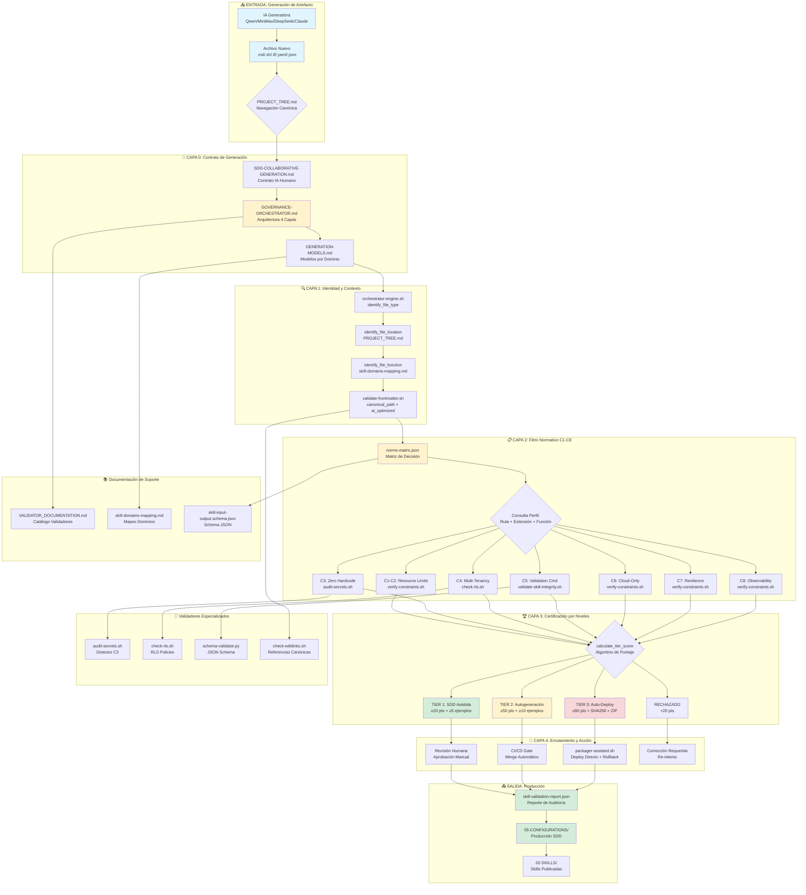

# 🧭 AI NAVIGATION CONTRACT — SDD Generation & Auto-Production

> **Propósito**: Documento maestro de navegación para IAs generadoras. Proporciona rutas canónicas, flujo de validación, reglas C1-C8 y checklist de generación para producir artefactos 100% compatibles con SDD Asistido y Auto-Producción.
>
> **Audiencia**: Qwen2.5-72B, MiniMax 2.7, DeepSeek, Claude, Gemini, y cualquier IA que genere contenido para `agentic-infra-docs/`.
>
> **Regla de Oro**: Antes de generar, leer este contrato + `[[PROJECT_TREE.md]]`. Sin navegación canónica → RECHAZO AUTOMÁTICO.

---

## 🗺️ MAPA DE NAVEGACIÓN CANÓNICA

### 🔹 Raíz del Repositorio (`/`)

| Archivo | Rol | Wikilink | Raw URL |
|---------|-----|----------|---------|
| `PROJECT_TREE.md` | Árbol canónico de rutas | `[[PROJECT_TREE.md]]` | [raw](https://raw.githubusercontent.com/Mantis-AgenticDev/agentic-infra-docs/refs/heads/main/PROJECT_TREE.md) |
| `GOVERNANCE-ORCHESTRATOR.md` | Arquitectura de validación 4 capas | `[[GOVERNANCE-ORCHESTRATOR.md]]` | [raw](https://raw.githubusercontent.com/Mantis-AgenticDev/agentic-infra-docs/refs/heads/main/GOVERNANCE-ORCHESTRATOR.md) |
| `SDD-COLLABORATIVE-GENERATION.md` | Contrato IA-Humano | `[[SDD-COLLABORATIVE-GENERATION.md]]` | [raw](https://raw.githubusercontent.com/Mantis-AgenticDev/agentic-infra-docs/refs/heads/main/SDD-COLLABORATIVE-GENERATION.md) |
| `AI-NAVIGATION-CONTRACT.md` | **Este documento** — Navegación maestra | `[[AI-NAVIGATION-CONTRACT.md]]` | [raw](https://raw.githubusercontent.com/Mantis-AgenticDev/agentic-infra-docs/refs/heads/main/AI-NAVIGATION-CONTRACT.md) |
| `skill-validation-report.json` | Reporte de auditoría JSON | `[[skill-validation-report.json]]` | [raw](https://raw.githubusercontent.com/Mantis-AgenticDev/agentic-infra-docs/refs/heads/main/skill-validation-report.json) |

### 🔹 Directorio `01-RULES/` — Normas Canónicas

| Archivo | Norma | Wikilink | Raw URL |
|---------|-------|----------|---------|
| `01-RULES/00-INDEX.md` | Índice de reglas C1-C8 | `[[01-RULES/00-INDEX.md]]` | [raw](https://raw.githubusercontent.com/Mantis-AgenticDev/agentic-infra-docs/refs/heads/main/01-RULES/00-INDEX.md) |
| `01-RULES/01-ARCHITECTURE-RULES.md` | C1/C2: Límites de recursos | `[[01-RULES/01-ARCHITECTURE-RULES.md]]` | [raw](https://raw.githubusercontent.com/Mantis-AgenticDev/agentic-infra-docs/refs/heads/main/01-RULES/01-ARCHITECTURE-RULES.md) |
| `01-RULES/02-RESOURCE-GUARDRAILS.md` | C1/C2: Guardrails operativos | `[[01-RULES/02-RESOURCE-GUARDRAILS.md]]` | [raw](https://raw.githubusercontent.com/Mantis-AgenticDev/agentic-infra-docs/refs/heads/main/01-RULES/02-RESOURCE-GUARDRAILS.md) |
| `01-RULES/03-SECURITY-RULES.md` | C3: Zero Hardcode | `[[01-RULES/03-SECURITY-RULES.md]]` | [raw](https://raw.githubusercontent.com/Mantis-AgenticDev/agentic-infra-docs/refs/heads/main/01-RULES/03-SECURITY-RULES.md) |
| `01-RULES/06-MULTITENANCY-RULES.md` | C4: Multi-Tenancy | `[[01-RULES/06-MULTITENANCY-RULES.md]]` | [raw](https://raw.githubusercontent.com/Mantis-AgenticDev/agentic-infra-docs/refs/heads/main/01-RULES/06-MULTITENANCY-RULES.md) |
| `01-RULES/07-SCALABILITY-RULES.md` | C7: Escalabilidad | `[[01-RULES/07-SCALABILITY-RULES.md]]` | [raw](https://raw.githubusercontent.com/Mantis-AgenticDev/agentic-infra-docs/refs/heads/main/01-RULES/07-SCALABILITY-RULES.md) |
| `01-RULES/09-AGENTIC-OUTPUT-RULES.md` | Frontmatter canónico | `[[01-RULES/09-AGENTIC-OUTPUT-RULES.md]]` | [raw](https://raw.githubusercontent.com/Mantis-AgenticDev/agentic-infra-docs/refs/heads/main/01-RULES/09-AGENTIC-OUTPUT-RULES.md) |

### 🔹 Directorio `02-SKILLS/` — Patrones y Skills

| Archivo | Rol | Wikilink | Raw URL |
|---------|-----|----------|---------|
| `02-SKILLS/00-INDEX.md` | Índice de skills | `[[02-SKILLS/00-INDEX.md]]` | [raw](https://raw.githubusercontent.com/Mantis-AgenticDev/agentic-infra-docs/refs/heads/main/02-SKILLS/00-INDEX.md) |
| `02-SKILLS/skill-domains-mapping.md` | Mapeo dominios → skills | `[[02-SKILLS/skill-domains-mapping.md]]` | [raw](https://raw.githubusercontent.com/Mantis-AgenticDev/agentic-infra-docs/refs/heads/main/02-SKILLS/skill-domains-mapping.md) |
| `02-SKILLS/GENERATION-MODELS.md` | Modelos por dominio | `[[02-SKILLS/GENERATION-MODELS.md]]` | [raw](https://raw.githubusercontent.com/Mantis-AgenticDev/agentic-infra-docs/refs/heads/main/02-SKILLS/GENERATION-MODELS.md) |
| `02-SKILLS/BASE DE DATOS-RAG/db-selection-decision-tree.md` | Decisión de stack DB | `[[02-SKILLS/BASE DE DATOS-RAG/db-selection-decision-tree.md]]` | [raw](https://raw.githubusercontent.com/Mantis-AgenticDev/agentic-infra-docs/refs/heads/main/02-SKILLS/BASE%20DE%20DATOS-RAG/db-selection-decision-tree.md) |
| `02-SKILLS/BASE DE DATOS-RAG/vertical-db-schemas.md` | Schemas SQL por vertical | `[[02-SKILLS/BASE DE DATOS-RAG/vertical-db-schemas.md]]` | [raw](https://raw.githubusercontent.com/Mantis-AgenticDev/agentic-infra-docs/refs/heads/main/02-SKILLS/BASE%20DE%20DATOS-RAG/vertical-db-schemas.md) |

### 🔹 Directorio `05-CONFIGURATIONS/validation/` — Validadores

| Archivo | Función | Wikilink | Raw URL |
|---------|---------|----------|---------|
| `orchestrator-engine.sh` | Motor de certificación 4 capas | `[[05-CONFIGURATIONS/validation/orchestrator-engine.sh]]` | [raw](https://raw.githubusercontent.com/Mantis-AgenticDev/agentic-infra-docs/refs/heads/main/05-CONFIGURATIONS/validation/orchestrator-engine.sh) |
| `norms-matrix.json` | Matriz de decisión por ruta/extensión/función | `[[05-CONFIGURATIONS/validation/norms-matrix.json]]` | [raw](https://raw.githubusercontent.com/Mantis-AgenticDev/agentic-infra-docs/refs/heads/main/05-CONFIGURATIONS/validation/norms-matrix.json) |
| `audit-secrets.sh` | Detector C3: Zero Hardcode | `[[05-CONFIGURATIONS/validation/audit-secrets.sh]]` | [raw](https://raw.githubusercontent.com/Mantis-AgenticDev/agentic-infra-docs/refs/heads/main/05-CONFIGURATIONS/validation/audit-secrets.sh) |
| `check-rls.sh` | Verificador C4: RLS Policies | `[[05-CONFIGURATIONS/validation/check-rls.sh]]` | [raw](https://raw.githubusercontent.com/Mantis-AgenticDev/agentic-infra-docs/refs/heads/main/05-CONFIGURATIONS/validation/check-rls.sh) |
| `check-wikilinks.sh` | Validador de referencias canónicas | `[[05-CONFIGURATIONS/validation/check-wikilinks.sh]]` | [raw](https://raw.githubusercontent.com/Mantis-AgenticDev/agentic-infra-docs/refs/heads/main/05-CONFIGURATIONS/validation/check-wikilinks.sh) |
| `schema-validator.py` | Validador JSON Schema | `[[05-CONFIGURATIONS/validation/schema-validator.py]]` | [raw](https://raw.githubusercontent.com/Mantis-AgenticDev/agentic-infra-docs/refs/heads/main/05-CONFIGURATIONS/validation/schema-validator.py) |
| `validate-frontmatter.sh` | Verificador de metadatos canónicos | `[[05-CONFIGURATIONS/validation/validate-frontmatter.sh]]` | [raw](https://raw.githubusercontent.com/Mantis-AgenticDev/agentic-infra-docs/refs/heads/main/05-CONFIGURATIONS/validation/validate-frontmatter.sh) |
| `verify-constraints.sh` | Check textual C1-C6 | `[[05-CONFIGURATIONS/validation/verify-constraints.sh]]` | [raw](https://raw.githubusercontent.com/Mantis-AgenticDev/agentic-infra-docs/refs/heads/main/05-CONFIGURATIONS/validation/verify-constraints.sh) |
| `schemas/skill-input-output.schema.json` | Schema JSON para outputs de IA | `[[05-CONFIGURATIONS/validation/schemas/skill-input-output.schema.json]]` | [raw](https://raw.githubusercontent.com/Mantis-AgenticDev/agentic-infra-docs/refs/heads/main/05-CONFIGURATIONS/validation/schemas/skill-input-output.schema.json) |

### 🔹 Directorio `05-CONFIGURATIONS/scripts/` — Scripts Operativos

| Archivo | Función | Wikilink | Raw URL |
|---------|---------|----------|---------|
| `packager-assisted.sh` | Generador ZIP + SHA256 para Tier 3 | `[[05-CONFIGURATIONS/scripts/packager-assisted.sh]]` | [raw](https://raw.githubusercontent.com/Mantis-AgenticDev/agentic-infra-docs/refs/heads/main/05-CONFIGURATIONS/scripts/packager-assisted.sh) |
| `validate-against-specs.sh` | Validador contra especificaciones | `[[05-CONFIGURATIONS/scripts/validate-against-specs.sh]]` | [raw](https://raw.githubusercontent.com/Mantis-AgenticDev/agentic-infra-docs/refs/heads/main/05-CONFIGURATIONS/scripts/validate-against-specs.sh) |
| `VALIDATOR_DOCUMENTATION.md` | Catálogo de validadores | `[[05-CONFIGURATIONS/scripts/VALIDATOR_DOCUMENTATION.md]]` | [raw](https://raw.githubusercontent.com/Mantis-AgenticDev/agentic-infra-docs/refs/heads/main/05-CONFIGURATIONS/scripts/VALIDATOR_DOCUMENTATION.md) |

---

## 🔄 FLUJO DE GENERACIÓN SDD → PRODUCCIÓN

```
┌─────────────────────────────────────────────────────────────────┐
│  1. IA lee este contrato + PROJECT_TREE.md                      │
│     → Resuelve ruta canónica, función, constraints aplicables   │
└─────────────────────────────────────────────────────────────────┘
                              │
                              ▼
┌─────────────────────────────────────────────────────────────────┐
│  2. IA genera archivo con:                                      │
│     • Frontmatter canónico (comentado si .sh, YAML puro si .md) │
│     • canonical_path exacto desde PROJECT_TREE.md               │
│     • constraints_mapped: ["C1","C2",...] según norms-matrix    │
│     • ≥10 ejemplos ✅/❌/🔧 si Tier 2-3                         │
│     • ${VAR:?missing} para secrets (C3)                         │
│     • tenant_id en queries/labels/logs si aplica (C4)           │
└─────────────────────────────────────────────────────────────────┘
                              │
                              ▼
┌─────────────────────────────────────────────────────────────────┐
│  3. orchestrator-engine.sh valida:                              │
│     • Capa 1: Identidad (tipo, ubicación, función, frontmatter) │
│     • Capa 2: Normativa C1-C8 vía norms-matrix.json             │
│     • Capa 3: Tier scoring (≥20=T1, ≥50=T2, ≥80=T3)             │
│     • Capa 4: Enrutamiento (review/merge/deploy)                │
└─────────────────────────────────────────────────────────────────┘
                              │
                              ▼
┌─────────────────────────────────────────────────────────────────┐
│  4. Resultado:                                                  │
│     • TIER_1 → Revisión humana + merge manual                   │
│     • TIER_2 → Merge automático tras CI gate                    │
│     • TIER_3 → packager-assisted.sh → Deploy + ZIP firmado      │
│     • RECHAZADO → Corrección + re-intento                       │
└─────────────────────────────────────────────────────────────────┘
```

---

## 📋 CHECKLIST DE GENERACIÓN PARA IA (OBLIGATORIO)

**Antes de generar cualquier archivo, la IA DEBE verificar:**

### ✅ Paso 1: Navegación Canónica
```yaml
- [ ] Leer PROJECT_TREE.md para resolver ruta exacta
- [ ] Confirmar que la ruta destino existe en el árbol
- [ ] Inferir función: documentation | pattern | configuration | agent | pipeline
- [ ] Determinar extensión: .md | .sh | .tf | .yaml | .json
```

### ✅ Paso 2: Frontmatter Canónico
```yaml
# Para .md / .yaml / .tf / .json (YAML puro):
---
title: "Nombre exacto del archivo"
version: "1.0.0"
canonical_path: "ruta/canónica/exacta.md"
ai_optimized: true
constraints_mapped: ["C1","C2","C3","C4","C5","C6","C7","C8"]
validation_command: "./05-CONFIGURATIONS/validation/orchestrator-engine.sh --mode headless --file <ruta> --json"
related_files:
  - "[[ruta/referencia1.md]]"
  - "[[ruta/referencia2.sh]]"
---

# Para .sh (comentado con #):
# ---
# title: "Nombre exacto"
# version: "1.0.0"
# canonical_path: "ruta/canónica/exacta.sh"
# ai_optimized: true
# constraints_mapped: ["C1","C2","C3","C4","C5","C6","C7","C8"]
# validation_command: "./05-CONFIGURATIONS/validation/orchestrator-engine.sh --mode headless --file <ruta> --json"
# ---
#!/bin/bash
set -euo pipefail
```

### ✅ Paso 3: Constraints Aplicables (según norms-matrix.json)
```yaml
# Consultar norms-matrix.json para intensidad por norma:
# • mandatory → Bloqueo crítico si falla (C3, C4 en DB/infra)
# • applicable → Advertencia bloqueante para Tier 2-3
# • contextual → Solo si función lo requiere
# • not_applicable → Omitir

# Ejemplo para 02-SKILLS/BASE DE DATOS-RAG/*.md:
# C3: mandatory → ${VAR:?missing} en placeholders
# C4: mandatory → tenant_id en todas las queries + índices + FK
# C5: applicable → validation_command declarado + ≥10 ejemplos
```

### ✅ Paso 4: Ejemplos Validados (C5)
```markdown
## 📊 Validated Examples (≥10)
1. ✅ Deberías ver: [comportamiento esperado]
   ❌ Si ves esto: [error común]
   🔧 Solución: [comando/fix exacto]
   [[ruta/referencia.md]]

2. ✅ Deberías ver: ...
   ❌ Si ves esto: ...
   🔧 Solución: ...
   [[ruta/referencia.md]]

... (repetir hasta ≥10 ejemplos para Tier 2-3, ≥5 para Tier 1)
```

### ✅ Paso 5: Validación Final
```bash
# Incluir al final del archivo:
# 🟢 VALIDATION: ./05-CONFIGURATIONS/validation/orchestrator-engine.sh --mode headless --file <canonical_path> --json
```

---

## 🎯 MATRIZ RÁPIDA: RUTA → CONSTRAINTS → VALIDADORES

| Ruta Canónica | Extensión | C3 (Secrets) | C4 (Tenant) | Validadores Activos | Tier Mínimo |
|--------------|-----------|--------------|-------------|---------------------|-------------|
| `00-CONTEXT/*.md` | `.md` | ⚪ | ⚪ | `check-wikilinks.sh` | 1 |
| `01-RULES/*.md` | `.md` | 🟢 | 🟢 | `verify-constraints.sh`, `audit-secrets.sh` | 2 |
| `02-SKILLS/AI/*.md` | `.md` | 🟢 | ⚪ | `audit-secrets.sh`, `validate-frontmatter.sh` | 1→2 |
| `02-SKILLS/BASE DE DATOS-RAG/*.md` | `.md` | 🔴 | 🔴 | `check-rls.sh`, `audit-secrets.sh`, `schema-validator.py` | 2 |
| `02-SKILLS/INFRAESTRUCTURA/*.md` | `.md` | 🟢 | 🟢 | `verify-constraints.sh`, `audit-secrets.sh` | 2 |
| `03-AGENTS/*.md` | `.md` | 🟢 | 🔴 | `audit-secrets.sh`, `verify-constraints.sh` | 2 |
| `04-WORKFLOWS/*.json` | `.json` | 🔴 | 🔴 | `schema-validator.py`, `packager-assisted.sh` | 2→3 |
| `05-CONFIGURATIONS/docker-compose/*.yml` | `.yml` | 🔴 | 🔴 | `audit-secrets.sh`, `verify-constraints.sh`, `docker compose config` | 3 |
| `05-CONFIGURATIONS/terraform/modules/*/*.tf` | `.tf` | 🔴 | 🔴 | `terraform fmt/validate`, `audit-secrets.sh` | 3 |
| `05-CONFIGURATIONS/scripts/*.sh` | `.sh` | 🔴 | 🔴 | `shellcheck`, `bash -n`, `audit-secrets.sh` | 2→3 |
| `07-PROCEDURES/*.md` | `.md` | ⚪ | ⚪ | `check-wikilinks.sh` | 1 |

**Leyenda**: 🔴 = mandatory (bloqueo crítico), 🟢 = applicable (advertencia), ⚪ = not_applicable

---

## 🔗 WIKILINKS CANÓNICOS — REGLAS DE REFERENCIACIÓN

### ✅ Formato Correcto
```markdown
[[PROJECT_TREE.md]]                          # Raíz
[[01-RULES/06-MULTITENANCY-RULES.md]]       # Subdirectorio
[[02-SKILLS/BASE DE DATOS-RAG/vertical-db-schemas.md]]  # Espacios en ruta
[[05-CONFIGURATIONS/validation/orchestrator-engine.sh]] # Script
```

### ❌ Errores Comunes
```markdown
[PROJECT_TREE](PROJECT_TREE.md)              # Markdown link, no wikilink
[[../PROJECT_TREE.md]]                       # Ruta relativa, no canónica
[[02-SKILLS/BASE-DE-DATOS-RAG/...]]          # Guiones en vez de espacios
[[orchestrator-engine.sh]]                   # Falta ruta completa
```

### 🔍 Verificación Automática
```bash
# Ejecutar antes de commit:
./05-CONFIGURATIONS/validation/check-wikilinks.sh <archivo.md>
# Debe retornar: 0 broken links
```

---

## 🧠 PROMPT TEMPLATE PARA IA GENERADORAS

```text
# ROL: Ingeniero Senior de Documentación Agéntica | MANTIS AGENTIC
# MISIÓN: Generar archivo canónico para SDD Asistido/Auto-Producción

## 🧭 NAVEGACIÓN OBLIGATORIA
1. Leer /AI-NAVIGATION-CONTRACT.md (este documento)
2. Resolver ruta canónica desde PROJECT_TREE.md
3. Consultar norms-matrix.json para constraints aplicables
4. Inferir función: documentation | pattern | configuration | agent | pipeline

## 📝 FRONTMATTER OBLIGATORIO
# Para .md/.yaml/.tf/.json:
---
title: "Nombre exacto"
version: "1.0.0"
canonical_path: "ruta/exacta/desde/PROJECT_TREE.md"
ai_optimized: true
constraints_mapped: ["C1","C2",...]  # Según norms-matrix.json
validation_command: "./05-CONFIGURATIONS/validation/orchestrator-engine.sh --mode headless --file <canonical_path> --json"
related_files:
  - "[[ruta/referencia1.md]]"
  - "[[ruta/referencia2.sh]]"
---

# Para .sh (comentado):
# ---
# title: "..."
# ... (mismo contenido, cada línea con #)
# ---
#!/bin/bash
set -euo pipefail

## 📊 EXAMPLES OBLIGATORIOS
# Tier 1: ≥5 ejemplos ✅/❌/🔧
# Tier 2-3: ≥10 ejemplos ✅/❌/🔧
## 📊 Validated Examples (≥10)
1. ✅ Deberías ver: ...
   ❌ Si ves esto: ...
   🔧 Solución: ...
   [[ruta/referencia.md]]

## 🔐 CONSTRAINTS CRÍTICOS
# C3: CERO hardcode → usar ${VAR:?missing} o sensitive = true
# C4: tenant_id en queries/labels/logs si ruta contiene DB-RAG/infra
# C6: Solo endpoints cloud (openrouter.ai, dashscope.aliyuncs.com)

## 🟢 VALIDATION COMMAND
# 🟢 VALIDATION: ./05-CONFIGURATIONS/validation/orchestrator-engine.sh --mode headless --file <canonical_path> --json

## ⚠️ SI FALTA CONTEXTO
Si no puedes resolver ruta, función o constraints:
'⚠️ BLOQUEADO: falta [X]. Esperando contexto desde PROJECT_TREE.md o norms-matrix.json.'
→ DETENER GENERACIÓN
```

---

## 🚀 EJECUCIÓN DE VALIDACIÓN POST-GENERACIÓN

```bash
# Validar archivo recién generado
./05-CONFIGURATIONS/validation/orchestrator-engine.sh \
  --mode headless \
  --file <canonical_path> \
  --json | jq '.tier_certified, .passed_checks | length'

# Esperado para Tier 2:
# {
#   "tier_certified": 2,
#   "passed_checks": 12,
#   "next_step": "merge_allowed",
#   "sha256": "a1b2c3..."
# }

# Validar wikilinks
./05-CONFIGURATIONS/validation/check-wikilinks.sh <archivo.md> && echo "✅ 0 broken links"

# Validar frontmatter
./05-CONFIGURATIONS/validation/validate-frontmatter.sh --file <archivo> && echo "✅ Frontmatter válido"

# Validar secrets
./05-CONFIGURATIONS/validation/audit-secrets.sh --file <archivo> && echo "✅ Zero hardcode"
```
---
# 🗺️ MAPA DE FLUJO DE VALIDACIÓN SDD → PRODUCCIÓN

Analizando todos los documentos, aquí está el **gráfico completo de interconexiones** del sistema de validación:



---

## 🔄 FLUJO DETALLADO DE VALIDACIÓN

### **FASE 1: GENERACIÓN → IDENTIDAD**

```
┌─────────────────────────────────────────────────────────────────┐
│  IA Generadora (Qwen/MiniMax/DeepSeek)                          │
│  ↓                                                              │
│  Archivo Nuevo (.md/.sh/.tf/.yaml/.json)                        │
│  ↓                                                              │
│  PROJECT_TREE.md → Resuelve ruta canónica                       │
│  ↓                                                              │
│  SDD-COLLABORATIVE-GENERATION.md → Contrato de generación       │
└─────────────────────────────────────────────────────────────────┘
```

**Puntos de Control:**
- ✅ Extensión reconocida (`.sh`, `.tf`, `.yaml`, `.md`, `.json`)
- ✅ Ubicación en `PROJECT_TREE.md` (00-CONTEXT, 01-RULES, 02-SKILLS, etc.)
- ✅ Función inferida (`documentation`, `pattern`, `configuration`, etc.)
- ✅ Frontmatter presente (`canonical_path`, `ai_optimized`, `constraints_mapped`)

**Si falla → RECHAZO INMEDIATO** (exit code 3)

---

### **FASE 2: IDENTIDAD → NORMATIVA C1-C8**

```
┌─────────────────────────────────────────────────────────────────┐
│  GOVERNANCE-ORCHESTRATOR.md                                     │
│  ↓                                                              │
│  orchestrator-engine.sh → load_norms_matrix()                   │
│  ↓                                                              │
│  norms-matrix.json → Consulta perfil por:                       │
│     • Ruta alta (02-SKILLS, 05-CONFIGURATIONS, etc.)            │
│     • Extensión (.md, .sh, .tf, .yaml, .json)                   │
│     • Función (documentation, pattern, configuration)           │
│  ↓                                                              │
│  Retorna: Intensidad de cada norma (mandatory/applicable/⚪)    │
└─────────────────────────────────────────────────────────────────┘
```

**Matriz de Decisión (norms-matrix.json):**

| Ruta + Extensión | C3 (Secrets) | C4 (Tenant) | Validadores Activos |
|-----------------|--------------|-------------|---------------------|
| `02-SKILLS/BASE DE DATOS-RAG/*.md` | 🔴 Mandatory | 🔴 Mandatory | `check-rls.sh`, `audit-secrets.sh` |
| `05-CONFIGURATIONS/docker-compose/*.yml` | 🔴 Mandatory | 🔴 Mandatory | `audit-secrets.sh`, `verify-constraints.sh` |
| `02-SKILLS/AI/*.md` | 🟢 Applicable | ⚪ Not Applicable | `validate-frontmatter.sh` |
| `07-PROCEDURES/*.md` | ⚪ Not Applicable | ⚪ Not Applicable | `check-wikilinks.sh` |

---

### **FASE 3: NORMATIVA → CERTIFICACIÓN TIER**

```
┌─────────────────────────────────────────────────────────────────┐
│  orchestrator-engine.sh → run_capa2_normative()                 │
│  ↓                                                              │
│  Para cada norma C1-C8:                                         │
│     SI intensity == "mandatory" → check_constraint_cX()         │
│        → Si falla: BLOQUEO CRÍTICO (exit 2)                     │
│     SI intensity == "applicable" → check_constraint_cX()        │
│        → Si falla: WARNING (bloqueante para T2/T3)              │
│     SI intensity == "contextual" → Evaluar condición            │
│     SI intensity == "not_applicable" → Omitir                   │
│  ↓                                                              │
│  Ejecutar validadores externos según lista activa:              │
│     • audit-secrets.sh (si C3 mandatory)                        │
│     • check-rls.sh (si DB-RAG path)                             │
│     • schema-validator.py (si .json)                            │
│     • validate-frontmatter.sh (si .md/.yaml/.tf)                │
└─────────────────────────────────────────────────────────────────┘
```

**Algoritmo de Puntaje (calculate_tier_score):**

```bash
score = 0

# Factores que suman:
+10 si sintaxis válida (bash -n, jq empty, terraform validate)
+20 si pasa C1-C8 (checks_passed * 2)
+15 si tiene ≥10 ejemplos (✅/❌/🔧)
+10 si frontmatter válido
+15 si tiene validador ejecutable
+15 si es determinista (sin timestamps/random)
+10 si tiene healthcheck/restart_policy
+10 si tiene namespace aislado (mantis-vps, tenant_, kb_)
+5  si tiene SHA256 calculado

# Factores que restan:
-5 × placeholder_count (TODO, FIXME, CAMBIAR)

# Asignación:
SI score >= 80 → TIER_3 (Auto-Deploy)
SI score >= 50 → TIER_2 (Autogeneración)
SI score >= 20 → TIER_1 (SDD Asistida)
SI score < 20  → RECHAZADO
```

---

### **FASE 4: CERTIFICACIÓN → ENRUTAMIENTO**

```
┌─────────────────────────────────────────────────────────────────┐
│  TIER_1 (≥20 pts, ≥5 ejemplos)                                  │
│  ↓                                                              │
│  → Revisión humana requerida                                    │
│  → Mostrar en PR con print_summary()                            │
│  → Merge manual tras aprobación                                 │
│                                                                 │
│  TIER_2 (≥50 pts, ≥10 ejemplos, 0 placeholders)                 │
│  ↓                                                              │
│  → Merge automático tras CI gate pass                           │
│  → generate_json_report() → skill-validation-report.json        │
│  → CI/CD: .github/workflows/validate-skill.yml                  │
│                                                                 │
│  TIER_3 (≥80 pts, SHA256, namespace, healthcheck)               │
│  ↓                                                              │
│  → packager-assisted.sh → ZIP firmado                           │
│  → Deploy directo con rollback automático                       │
│  → Manifest: {sha256, files[], version, timestamp}              │
└─────────────────────────────────────────────────────────────────┘
```

---

## 🔗 INTERCONEXIONES CRÍTICAS

### **1. GOVERNANCE-ORCHESTRATOR.md ↔ orchestrator-engine.sh**

```
GOVERNANCE-ORCHESTRATOR.md
   • Documenta arquitectura de 4 capas
   • Define matriz de mapeo ubicación×norma
   • Especifica algoritmo de tier scoring
   ↓
orchestrator-engine.sh
   • Implementa load_norms_matrix()
   • Implementa query_norms_profile()
   • Implementa calculate_tier_score()
   • Ejecuta validadores según norms-matrix.json
```

### **2. norms-matrix.json ↔ Validadores**

```
norms-matrix.json
   • matrix_by_location: Define perfil por ruta
   • extension_decision_rules: Reglas por extensión
   • active_validators: Lista de validadores a invocar
   ↓
Validadores Especializados:
   • audit-secrets.sh → C3 (Zero Hardcode)
   • check-rls.sh → C4 (Multi-Tenancy RLS)
   • check-wikilinks.sh → Referencias canónicas
   • schema-validator.py → JSON Schema validation
   • validate-frontmatter.sh → Metadatos canónicos
   • verify-constraints.sh → C1-C6 textual
```

### **3. skill-validation-report.json → CI/CD**

```
orchestrator-engine.sh --mode headless --json
   ↓
generate_json_report()
   ↓
skill-validation-report.json {
   "tier_certified": 2,
   "passed_checks": [...],
   "blocking_issues": [...],
   "sha256": "a1b2c3...",
   "next_step": "merge_allowed",
   "ci_gate_required": true
}
   ↓
.github/workflows/validate-skill.yml
   • Lee skill-validation-report.json
   • Si tier_certified >= 2 → merge automático
   • Si tier_certified == 3 → trigger deploy
```

---

##  PUNTOS DE CONTROL OBLIGATORIOS

### **Pre-Merge (Todos los Tiers)**

1. ✅ `bash -n <archivo>` (sintaxis bash)
2. ✅ `jq empty <archivo.json>` (JSON válido)
3. ✅ `check-wikilinks.sh <archivo.md>` (0 links rotos)
4. ✅ Frontmatter: `canonical_path`, `ai_optimized`, `constraints_mapped`
5. ✅ ≥5 ejemplos (T1) o ≥10 ejemplos (T2/T3) con formato ✅/❌/🔧

### **Pre-Deploy (Solo Tier 3)**

1. ✅ `audit-secrets.sh` → 0 hardcode secrets
2. ✅ `check-rls.sh` (si DB) → RLS policies activas
3. ✅ SHA256 calculado (`calculate_sha256()`)
4. ✅ Namespace aislado (mantis-vps, tenant_, kb_)
5. ✅ Healthcheck/restart_policy declarado
6. ✅ `packager-assisted.sh` → ZIP firmado + manifest

---

## 📊 DIAGRAMA DE DECISIÓN COMPLETO

```
                    INICIO: Archivo Generado por IA
                              │
                              ▼
                    ┌─────────────────┐
                    │ PROJECT_TREE.md │
                    │ ¿Ruta canónica? │
                    └────────┬────────
                             │
              ┌──────────────┴──────────────┐
              │ NO                          │ SÍ
              ▼                             ▼
     RECHAZO (exit 3)              ┌─────────────────┐
     "ID_FAIL"                     │GOVERNANCE-      │
                                   │ORCHESTRATOR.md  │
                                   └────────┬────────┘
                                            │
                                            ▼
                                   ┌─────────────────┐
                                   │orchestrator-    │
                                   │engine.sh        │
                                   │Capa 1: Identidad│
                                   └────────┬────────┘
                                            │
              ┌──────────────┴──────────────┐
              │ FALLA                       │ PASA
              ▼                             ▼
     RECHAZO (exit 3)              ┌─────────────────┐
     "ID_FAIL"                     │norms-matrix.json│
                                   │Capa 2: C1-C8    │
                                   └────────┬────────┘
                                            │
              ┌──────────────┴──────────────┐
              │ C3/C4 FAIL                  │ C1-C8 OK
              ▼                             ▼
     BLOQUEO CRÍTICO (exit 2)      ┌─────────────────┐
     "C3_FAIL" o "C4_FAIL"         │calculate_tier_  │
                                   │score()          │
                                   └────────┬────────┘
                                            │
        ┌─────────────┬─────────────┬───────┴───────┐
        │             │             │               │
        ▼             ▼             ▼               ▼
   TIER_1        TIER_2        TIER_3         RECHAZADO
   ≥20 pts       ≥50 pts       ≥80 pts        <20 pts
        │             │             │               │
        │             │             │               ▼
        │             │             │        CORREGIR
        │             │             │        RE-INTENTO
        │             │             │
        ▼             ▼             ▼
   Revisión    Merge Auto    Deploy Auto
   Humana      CI Gate       + ZIP
        │             │             │
        └─────────────┴─────────────┘
                      │
                      ▼
           ┌──────────────────┐
           │skill-validation- │
           │report.json       │
           └─────────────────-┘
                    │
                    ▼
           PRODUCCIÓN SDD
           02-SKILLS/
           05-CONFIGURATIONS/
```

---

## ✅ CHECKLIST FINAL DE PRODUCCIÓN

**Para que un archivo sea "OK para Producción SDD/Auto-Producción":**

### **Requisitos Mínimos (Tier 1)**
- [ ] Sintaxis válida (bash -n, jq empty, terraform validate)
- [ ] Frontmatter: `canonical_path`, `ai_optimized`, `constraints_mapped`
- [ ] ≥5 ejemplos ✅/❌/🔧
- [ ] Wikilinks canónicos (0 rotos)
- [ ] Sin hardcode secrets (C3)
- [ ] tenant_id presente si aplica (C4)

### **Requisitos Tier 2 (Autogeneración)**
- [ ] Todo lo anterior +
- [ ] ≥10 ejemplos ✅/❌/🔧
- [ ] 0 placeholders residuales (TODO, FIXME, CAMBIAR)
- [ ] Validador ejecutable declarado
- [ ] Determinismo verificado (sin timestamps/random)
- [ ] Puntaje ≥50 en `calculate_tier_score()`

### **Requisitos Tier 3 (Auto-Deploy)**
- [ ] Todo lo anterior +
- [ ] Healthcheck/restart_policy declarado
- [ ] Namespace aislado (mantis-vps, tenant_, kb_)
- [ ] SHA256 calculado
- [ ] Idempotencia verificada
- [ ] Puntaje ≥80 en `calculate_tier_score()`
- [ ] `packager-assisted.sh` → ZIP firmado

---

**Este es el mapa completo del sistema de validación. Todos los documentos 
están interconectados y forman un ciclo cerrado de:
 generación → validación → certificación → producción.** 🎯
---

## 📤 SALIDAS ESPERADAS POR TIER

### Tier 1 (SDD Asistida)
```json
{
  "tier_certified": 1,
  "next_step": "human_review_required",
  "ci_gate_required": false,
  "human_approval_required": true
}
```
→ Acción: Revisión humana + merge manual

### Tier 2 (Autogeneración)
```json
{
  "tier_certified": 2,
  "next_step": "merge_allowed",
  "ci_gate_required": true,
  "human_approval_required": false,
  "sha256": "a1b2c3d4..."
}
```
→ Acción: Merge automático tras CI gate pass

### Tier 3 (Auto-Deploy)
```json
{
  "tier_certified": 3,
  "next_step": "deploy_allowed",
  "ci_gate_required": true,
  "human_approval_required": false,
  "sha256": "a1b2c3d4e5f6...",
  "packager_invoked": true
}
```
→ Acción: `packager-assisted.sh` → ZIP firmado → Deploy con rollback

---

## 🔗 REFERENCIAS CRUZADAS — RAW URLs PARA IA

```bash
# Base URL para todos los archivos
BASE="https://raw.githubusercontent.com/Mantis-AgenticDev/agentic-infra-docs/refs/heads/main"

# Documentos raíz
$BASE/AI-NAVIGATION-CONTRACT.md
$BASE/PROJECT_TREE.md
$BASE/GOVERNANCE-ORCHESTRATOR.md
$BASE/SDD-COLLABORATIVE-GENERATION.md

# Validadores
$BASE/05-CONFIGURATIONS/validation/orchestrator-engine.sh
$BASE/05-CONFIGURATIONS/validation/norms-matrix.json
$BASE/05-CONFIGURATIONS/validation/audit-secrets.sh
$BASE/05-CONFIGURATIONS/validation/check-rls.sh
$BASE/05-CONFIGURATIONS/validation/check-wikilinks.sh
$BASE/05-CONFIGURATIONS/validation/schema-validator.py
$BASE/05-CONFIGURATIONS/validation/validate-frontmatter.sh
$BASE/05-CONFIGURATIONS/validation/verify-constraints.sh
$BASE/05-CONFIGURATIONS/validation/schemas/skill-input-output.schema.json

# Scripts
$BASE/05-CONFIGURATIONS/scripts/packager-assisted.sh
$BASE/05-CONFIGURATIONS/scripts/validate-against-specs.sh

# Índices
$BASE/01-RULES/00-INDEX.md
$BASE/02-SKILLS/00-INDEX.md
$BASE/05-CONFIGURATIONS/00-INDEX.md
```

---

## ✅ VALIDATED EXAMPLES (≥10) — Para cumplimiento C5

1. ✅ **Deberías ver**: `canonical_path` coincide con ruta en `PROJECT_TREE.md`  
   ❌ **Si ves esto**: `canonical_path: "skills/nueva.md"` (ruta inventada)  
   🔧 **Solución**: Resolver ruta desde `[[PROJECT_TREE.md]]` antes de generar  
   `[[PROJECT_TREE.md]]`

2. ✅ **Deberías ver**: Frontmatter YAML puro en `.md`, comentado en `.sh`  
   ❌ **Si ves esto**: `---` sin comentar en `.sh` → error de sintaxis bash  
   🔧 **Solución**: Usar `# ---` en scripts bash, YAML puro en configs  
   `[[01-RULES/09-AGENTIC-OUTPUT-RULES.md]]`

3. ✅ **Deberías ver**: `constraints_mapped` incluye C4 si ruta contiene `DB-RAG`  
   ❌ **Si ves esto**: `constraints_mapped: ["C1","C2"]` sin C4 en archivo DB  
   🔧 **Solución**: Consultar `norms-matrix.json` para intensidad por ruta  
   `[[05-CONFIGURATIONS/validation/norms-matrix.json]]`

4. ✅ **Deberías ver**: ≥10 ejemplos ✅/❌/🔧 para Tier 2-3  
   ❌ **Si ves esto**: Solo 3 ejemplos en archivo de infraestructura  
   🔧 **Solución**: Agregar ejemplos hasta ≥10 con formato canónico  
   `[[GOVERNANCE-ORCHESTRATOR.md#validated-examples]]`

5. ✅ **Deberías ver**: `${VAR:?missing}` en placeholders de credenciales  
   ❌ **Si ves esto**: `password: "admin123"` hardcodeado  
   🔧 **Solución**: Reemplazar con `${DB_PASSWORD:?missing}` + declarar variable  
   `[[01-RULES/03-SECURITY-RULES.md]]`

6. ✅ **Deberías ver**: `tenant_id` en todas las queries SQL de ejemplo  
   ❌ **Si ves esto**: `SELECT * FROM users` sin filtro tenant  
   🔧 **Solución**: Agregar `WHERE tenant_id = $1` + índice compuesto  
   `[[01-RULES/06-MULTITENANCY-RULES.md]]`

7. ✅ **Deberías ver**: Wikilinks canónicos `[[02-SKILLS/...]]`  
   ❌ **Si ves esto**: `[[../skills/...]]` ruta relativa  
   🔧 **Solución**: Usar ruta absoluta desde raíz del repo  
   `[[05-CONFIGURATIONS/validation/check-wikilinks.sh]]`

8. ✅ **Deberías ver**: `validation_command` ejecutable al final del archivo  
   ❌ **Si ves esto**: Sin comando de validación declarado  
   🔧 **Solución**: Agregar `# 🟢 VALIDATION: ./05-CONFIGURATIONS/validation/orchestrator-engine.sh ...`  
   `[[GOVERNANCE-ORCHESTRATOR.md]]`

9. ✅ **Deberías ver**: `ai_optimized: true` en frontmatter  
   ❌ **Si ves esto**: Frontmatter sin `ai_optimized`  
   🔧 **Solución**: Agregar `ai_optimized: true` para habilitar validación automatizada  
   `[[01-RULES/09-AGENTIC-OUTPUT-RULES.md]]`

10. ✅ **Deberías ver**: `related_files` con wikilinks a dependencias  
    ❌ **Si ves esto**: Archivo que referencia otro sin declararlo en `related_files`  
    🔧 **Solución**: Agregar `[[ruta/dependencia.md]]` en array `related_files`  
    `[[PROJECT_TREE.md]]`

---

## 🟢 VALIDATION COMMAND

```bash
# Validar este contrato con el propio orquestador
./05-CONFIGURATIONS/validation/orchestrator-engine.sh \
  --mode headless \
  --file /AI-NAVIGATION-CONTRACT.md \
  --json | jq '.tier_certified, .passed_checks | length'

# Esperado: tier_certified=3, passed_checks >= 15

# Validar que todos los wikilinks están rotos
./05-CONFIGURATIONS/validation/check-wikilinks.sh /AI-NAVIGATION-CONTRACT.md && echo "✅ 0 broken links"

# Validar frontmatter
./05-CONFIGURATIONS/validation/validate-frontmatter.sh --file /AI-NAVIGATION-CONTRACT.md && echo "✅ Frontmatter válido"

# Validar secrets
./05-CONFIGURATIONS/validation/audit-secrets.sh --file /AI-NAVIGATION-CONTRACT.md && echo "✅ Zero hardcode"
```

---

<!-- ai:file-end marker — do not remove -->
**Versión 1.0.0 — 2026-04-14 — Mantis-AgenticDev**  
**Autor**: Facundo + Qwen3.6 Plus Agent + Integración de norms-matrix.json  
**Estado**: ACTIVO — Contrato maestro para generación IA  
**Constraints**: C1-C8 enforced via orchestrator-engine.sh + norms-matrix.json  
**Next Audit**: 2026-05-14  
**Tier Target**: 3 (Auto-Deploy Ready)
