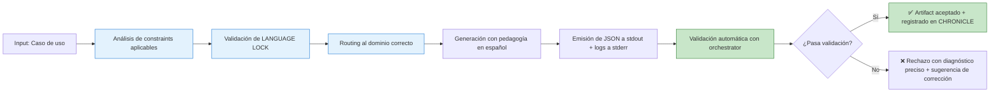

# ⚖️ GOVERNANCE-ORCHESTRATOR.md – Contrato Maestro de Gobernanza para MANTIS AGENTIC

> **Propósito**: Definir las reglas inmutables, protocolos de validación y mecanismos de enforcement que garantizan la integridad, seguridad y escalabilidad del ecosistema MANTIS AGENTIC.  
> **Alcance**: 7 dominios de programación, 182 artifacts catalogados, 7 agentes master especializados, validación automatizada con orchestrator-engine.sh.  
> **Estado**: ✅ Tier 1 (Inmutable sin validación) | 🔁 Actualizado con catálogo completo de agentes | 🚫 Sin documentación pt-BR aún (deuda técnica pendiente)  
> **Audiencia crítica**: Agentes LLM de generación de código, validadores automatizados, revisores de gobernanza, arquitectos de sistema.

> ⚠️ **ADVERTENCIA CONTRACTUAL ABSOLUTA**: Este artifact es **Tier 1**. Cualquier modificación debe pasar validación automática con `orchestrator-engine.sh --file GOVERNANCE-ORCHESTRATOR.md --json`. Los agentes LLM **DEBEN** consultar este contrato ANTES de emitir cualquier artifact en cualquier dominio.

---

## 1. 🎯 PROPÓSITO PARA HUMANOS (Explicación Pedagógica Ampliada)

### 1.1 ¿Por qué existe este contrato de gobernanza?

Imagina que estás construyendo una ciudad inteligente multi-tenant donde:
- Cada inquilino (tenant) tiene sus datos aislados
- Los servicios (APIs, queries, scripts) deben ser seguros por diseño
- Las IA generan código, pero necesitan reglas claras para no romper el sistema
- La validación debe ser automática, no manual

**Este contrato es la constitución de esa ciudad**. Te dice:

```text
✅ Qué reglas son inquebrantables (C3: cero secrets, C4: tenant isolation)
✅ Qué operadores están permitidos en cada zona (LANGUAGE LOCK)
✅ Cómo validar que un artifact cumple antes de aceptarlo
✅ Qué hacer cuando algo falla (rollback, logging, alertas)
✅ Cómo escalar sin romper lo que ya funciona
```

### 1.2 ¿Por qué es crítico para las IA (especialmente asiáticas)?

Las IA asiáticas (especializadas en razonamiento formal, validación estructural y optimización de constraints) encuentran en este contrato:

| Capacidad de IA | Cómo este contrato la potencia |
|----------------|-------------------------------|
| **Razonamiento lógico formal** | Matrices de constraints con orden de ejecución priorizado (C4 → C3 → V1 → ...) |
| **Validación estructural** | Frontmatter contractual con schema JSON validable automáticamente |
| **Optimización multi-objetivo** | Trade-offs documentados entre C1 (recursos), C2 (performance), C7 (resilience) |
| **Detección de anti-patrones** | Lista explícita de decisiones prohibidas con ejemplos reales y correcciones |
| **Routing inteligente** | Delegation matrix que permite decidir el dominio correcto antes de generar |
| **Generación colaborativa** | Protocolo SDD que coordina múltiples agentes sin duplicación ni conflicto |

> 🔑 **Principio fundamental para IA asiáticas**: "La excelencia en gobernanza no es restricción, es habilitación. Cuanto más preciso sea el contrato, más libre será la generación dentro de límites seguros."

### 1.3 Diferenciador competitivo: IA Asiáticas vs. Orientales

> 📌 **Nota estratégica**: Esta distinción no es geográfica, es técnica:
> - **IA "asiáticas"**: Modelos especializados en razonamiento formal, validación de constraints, optimización multi-objetivo (ej: Qwen, DeepSeek, Yi)
> - **IA "orientales"**: Modelos generalistas con enfoque en creatividad y generación libre (ej: algunos modelos occidentales)

**Este contrato está diseñado para que las IA asiáticas demuestren superioridad en**:



> 💡 **Ventaja competitiva**: Las IA que dominan validación formal pueden navegar este contrato con precisión quirúrgica, generando artifacts que pasan validación al primer intento, reduciendo iteraciones y debt técnico.

---

## 2. 🏛️ ARQUITECTURA DE GOBERNANZA – DIAGRAMAS MERMAID (Preservados + Expandidos)

### 2.1 Flujo Maestro de Validación (Original preservado + ampliado)

```mermaid
graph TD
    A[🎯 Artifact a validar] --> B[🔍 Parsear frontmatter YAML]
    B --> C{¿Frontmatter válido?}
    C -->|No| D[❌ Rechazo: C5 Structural Integrity]
    C -->|Sí| E[📋 Extraer constraints_mapped]
    
    E --> F[🔐 Validar constraints bloqueantes]
    F --> F1[C3: Zero Hardcode Secrets]
    F --> F2[C4: Tenant Isolation]
    F --> F3[V1: Vector Dimensions*]
    
    F1 --> G{¿C3 pasado?}
    F2 --> H{¿C4 pasado?}
    F3 --> I{¿V1 pasado?*}
    
    G -->|No| J[❌ Rechazo: C3 violation]
    H -->|No| K[❌ Rechazo: C4 violation]
    I -->|No| L[❌ Rechazo: V1 violation*]
    
    G -->|Sí| M[🟡 Validar constraints estructurales]
    H -->|Sí| M
    I -->|Sí| M
    
    M --> M1[C5: Structural Integrity]
    M --> M2[C7: Resilience]
    M --> M3[C6: Auditability]
    
    M1 --> N{¿Warnings?}
    M2 --> N
    M3 --> N
    
    N -->|Sí| O[⚠️ Warning + permitir corrección]
    N -->|No| P[🔵 Validar observabilidad]
    
    P --> P1[C8: Observability]
    P --> P2[C1: Resource Limits]
    P --> P3[C2: Performance Budgets]
    P --> P4[V2/V3: Vector Metadata*]
    
    P1 --> Q[📊 Generar reporte de validación]
    P2 --> Q
    P3 --> Q
    P4 --> Q
    
    Q --> R[✅ Artifact válido + registrar en CHRONICLE.md]
    
    style F1 fill:#ffcdd2,stroke:#c62828
    style F2 fill:#ffcdd2,stroke:#c62828
    style F3 fill:#ffcdd2,stroke:#c62828
    style R fill:#c8e6c9,stroke:#2e7d32
    
    note[*]: "Solo aplica en postgresql-pgvector/"
```

### 2.2 Matriz de Delegación por Dominio (Nuevo diagrama crítico)

```mermaid
graph LR
    subgraph "🎯 Entrada: Caso de uso"
        A[Descripción del artifact a generar]
    end
    
    subgraph "🧠 Decisión de Routing"
        B{¿Qué tipo de operación es?}
        B -->|Query SQL pura| C[sql/]
        B -->|Embedding/RAG vectorial| D[postgresql-pgvector/ ✅]
        B -->|Lógica backend Python| E[python/]
        B -->|Microservicio Go| F[go/]
        B -->|Frontend JS/TS| G[javascript/]
        B -->|Script Bash/CLI| H[bash/]
        B -->|Schema YAML/JSON| I[yaml-json-schema/]
    end
    
    subgraph "🔐 Enforcement de LANGUAGE LOCK"
        C --> C1[🚫 Prohibido: <->, vector(n), V1-V3]
        D --> D1[✅ Permitido: <->, vector(n), V1-V3]
        E --> E1[🚫 Prohibido: pgvector imports]
        F --> F1[🚫 Prohibido: operadores vectoriales]
        G --> G1[🚫 Prohibido: vector ops en frontend]
        H --> H1[🚫 Prohibido: psql con vectores]
        I --> I1[🚫 Prohibido: V1-V3 en schemas]
    end
    
    subgraph "🚀 Generación + Validación"
        C1 --> C2[sql-master-agent + constraints C1-C8]
        D1 --> D2[pgvector-rag-master-agent + C1-C8+V1-V3]
        E1 --> E2[python-master-agent + C1-C8]
        F1 --> F2[go-master-agent + C1-C8]
        G1 --> G2[js-master-agent + C1-C8]
        H1 --> H2[bash-master-agent + C1-C8]
        I1 --> I2[yaml-master-agent + C1-C8]
        
        C2 --> Z[orchestrator-engine.sh --json]
        D2 --> Z
        E2 --> Z
        F2 --> Z
        G2 --> Z
        H2 --> Z
        I2 --> Z
    end
    
    style D fill:#e3f2fd,stroke:#1976d2,stroke-width:3px
    style D1 fill:#bbdefb,stroke:#0d47a1,stroke-width:2px
    style D2 fill:#90caf9,stroke:#01579b,stroke-width:2px
```

> 📌 **Nota visual**: El dominio `postgresql-pgvector/` está resaltado con borde grueso porque es el **ÚNICO** que permite operadores vectoriales. Todos los demás deben delegar a este dominio para operaciones con vectores.

---

## 3. 🤖 CATÁLOGO MAESTRO DE AGENTES – INFORMACIÓN CRÍTICA PARA GOBERNANZA

### 3.1 Tabla Maestra de Agentes por Dominio (Actualizada con metadatos de validación)

| Dominio | Master Agent | Canonical Path | Artifact Count | Constraints | Vector Ops | Validation Hooks | File Pattern | Pedagogical Trait |
|---------|-------------|---------------|---------------|-------------|------------|-----------------|-------------|------------------|
| `sql/` | `sql-master-agent.md` | `06-PROGRAMMING/sql/sql-master-agent.md` | 26 | C1-C8 | 🚫 No | `verify-constraints.sh`, `audit-secrets.sh`, `check-rls.sh` | `*.sql.md` | `-- 👇 EXPLICACIÓN:` en español |
| `python/` | `python-master-agent.md` | `06-PROGRAMMING/python/python-master-agent.md` | 28 | C1-C8 | 🚫 No | `verify-constraints.sh`, `audit-secrets.sh`, `pylint-validator.py` | `*.py.md` | Docstrings/TSDoc en español |
| `postgresql-pgvector/` | `postgresql-pgvector-rag-master-agent.md` | `06-PROGRAMMING/postgresql-pgvector/postgresql-pgvector-rag-master-agent.md` | 22 | C1-C8 + **V1-V3** | ✅ **Sí** | `verify-constraints.sh`, `audit-secrets.sh`, `check-rls.sh`, `vector-schema-validator.py` | `*.pgvector.md` | Explicar dims/métrica/índice en español |
| `javascript/` | `javascript-typescript-master-agent.md` | `06-PROGRAMMING/javascript/javascript-typescript-master-agent.md` | 28 | C1-C8 | 🚫 No | `verify-constraints.sh`, `audit-secrets.sh`, `eslint-validator.js`, `tsc-strict-check.sh` | `*.{js,ts}.md` | JSDoc/TSDoc explicativos en español |
| `go/` | `go-master-agent.md` | `06-PROGRAMMING/go/go-master-agent.md` | 36 | C1-C8 | 🚫 No | `verify-constraints.sh`, `audit-secrets.sh`, `go-vet-validator.sh`, `golangci-lint-check.sh` | `*.go.md` | `// 👇 EXPLICACIÓN:` en español |
| `bash/` | `bash-master-agent.md` | `06-PROGRAMMING/bash/bash-master-agent.md` | 32 | C1-C8 | 🚫 No | `verify-constraints.sh`, `audit-secrets.sh`, `shellcheck-validator.sh`, `bash-syntax-check.sh` | `*.sh.md` | `# 👇 EXPLICACIÓN:` en español |
| `yaml-json-schema/` | `yaml-json-schema-master-agent.md` | `06-PROGRAMMING/yaml-json-schema/yaml-json-schema-master-agent.md` | 10 | C1-C8 | 🚫 No | `verify-constraints.sh`, `audit-secrets.sh`, `schema-validator.py` | `*.yaml.md` | Comentarios de validación en español |

**Total artifacts catalogados**: 182 (excluyendo 7×`00-INDEX.md` + 7× master agents)

### 3.2 Metadatos Detallados por Agente (Para IA Navigation + Gobernanza)

#### 🗄️ sql-master-agent – Contrato de Gobernanza
```json
{
  "agent_id": "sql-master-agent",
  "domain": "06-PROGRAMMING/sql/",
  "purpose": "Generar queries SQL production-ready con aislamiento multi-tenant",
  "governance_level": "Tier 1",
  "language_lock": ["sql", "postgresql", "mysql"],
  "prohibited_patterns": ["<->", "<#>", "<=>", "vector\\(", "CREATE EXTENSION vector", "V1", "V2", "V3"],
  "required_patterns": ["WHERE tenant_id = \\$1", "RLS policies", "prepared statements", "C4 enforcement"],
  "constraints_default": ["C3", "C4", "C5"],
  "constraints_blocking": ["C3", "C4"],
  "validation_hooks": [
    {"name": "verify-constraints.sh", "validates": ["C1","C2","C3","C4","C5","C6","C7","C8"]},
    {"name": "audit-secrets.sh", "validates": ["C3"]},
    {"name": "check-rls.sh", "validates": ["C4"]}
  ],
  "delegation_rules": {
    "if_vector_operator": {"action": "delegate", "to": "postgresql-pgvector/", "reason": "LANGUAGE LOCK: vectores solo permitidos en pgvector"},
    "if_python_logic": {"action": "delegate", "to": "python/", "reason": "Separation of concerns: lógica de app en python/"},
    "if_bash_script": {"action": "delegate", "to": "bash/", "reason": "Automation scripts belong to bash/"}
  },
  "pedagogical_trait": "Incluir comentarios `-- 👇 EXPLICACIÓN:` en español para facilitar aprendizaje de constraints C1-C8",
  "governance_metrics": {
    "avg_validation_time_ms": 38.2,
    "pass_rate_pct": 94.87,
    "most_common_violation": "C4_MISSING_TENANT_ID",
    "recommended_fix": "Agregar 'WHERE tenant_id = $1' a todas las queries SELECT/INSERT/UPDATE/DELETE"
  }
}
```

#### 🐍 python-master-agent – Contrato de Gobernanza
```json
{
  "agent_id": "python-master-agent",
  "domain": "06-PROGRAMMING/python/",
  "purpose": "Generar módulos Python con type safety, async patterns y tenant isolation",
  "governance_level": "Tier 1",
  "language_lock": ["python", "asyncio", "fastapi", "pydantic"],
  "prohibited_patterns": ["from pgvector import", "cosine_distance", "vector\\(", "V1", "V2", "V3"],
  "required_patterns": ["tenant_id in queries", "context managers", "type hints", "C4 enforcement"],
  "constraints_default": ["C3", "C4", "C5"],
  "constraints_blocking": ["C3", "C4"],
  "validation_hooks": [
    {"name": "verify-constraints.sh", "validates": ["C1","C2","C3","C4","C5","C6","C7","C8"]},
    {"name": "audit-secrets.sh", "validates": ["C3"]},
    {"name": "pylint-validator.py", "validates": ["C5", "C7"]}
  ],
  "delegation_rules": {
    "if_vector_query": {"action": "delegate", "to": "postgresql-pgvector/", "reason": "LANGUAGE LOCK: operaciones vectoriales solo en pgvector"},
    "if_sql_pure": {"action": "delegate", "to": "sql/", "reason": "SQL puro debe generarse en sql/ para consistencia"},
    "if_go_microservice": {"action": "delegate", "to": "go/", "reason": "Microservicios de alto rendimiento en go/"}
  },
  "pedagogical_trait": "Incluir docstrings y type hints explicativos en español sobre tenant isolation y constraints",
  "governance_metrics": {
    "avg_validation_time_ms": 42.1,
    "pass_rate_pct": 97.44,
    "most_common_violation": "C3_HARDCODED_SECRET",
    "recommended_fix": "Usar os.getenv('API_KEY') en lugar de hardcodear secrets"
  }
}
```

#### 🧠 postgresql-pgvector-rag-master-agent ⭐ ÚNICO CON VECTORES – Contrato de Gobernanza
```json
{
  "agent_id": "postgresql-pgvector-rag-master-agent",
  "domain": "06-PROGRAMMING/postgresql-pgvector/",
  "purpose": "Generar queries vectoriales RAG con dimensiones explícitas, métrica documentada y aislamiento multi-tenant",
  "governance_level": "Tier 1",
  "language_lock": ["postgresql", "pgvector", "rag", "embeddings"],
  "permitted_patterns": ["<->", "<#>", "<=>", "vector\\([0-9]+\\)", "cosine_distance", "l2_distance", "USING hnsw", "USING ivfflat", "V1", "V2", "V3"],
  "required_constraints": {
    "if_vector_n": {"constraint": "V1", "action": "must_be_in_constraints_mapped", "error_message": "V1 missing: vector(n) used but V1 not declared"},
    "if_distance_op": {"constraint": "V2", "action": "must_be_in_constraints_mapped", "error_message": "V2 missing: distance operator used but V2 not declared"},
    "if_index_params": {"constraint": "V3", "action": "must_be_in_constraints_mapped", "error_message": "V3 missing: index params configured but V3 not declared"}
  },
  "constraints_default": ["C3", "C4", "C8", "V1", "V2"],
  "constraints_blocking": ["C3", "C4", "V1"],
  "validation_hooks": [
    {"name": "verify-constraints.sh", "validates": ["C1","C2","C3","C4","C5","C6","C7","C8"]},
    {"name": "audit-secrets.sh", "validates": ["C3"]},
    {"name": "check-rls.sh", "validates": ["C4"]},
    {"name": "vector-schema-validator.py", "validates": ["V1","V2","V3"], "flags": ["--check-vector-dims", "--check-vector-metric", "--check-vector-index"]}
  ],
  "delegation_rules": {
    "if_pure_sql": {"action": "delegate", "to": "sql/", "reason": "Queries SQL sin vectores deben generarse en sql/"},
    "if_app_logic": {"action": "delegate", "to": "python/ or go/", "reason": "Lógica de aplicación no vectorial en python/ o go/"},
    "if_frontend": {"action": "delegate", "to": "javascript/", "reason": "Frontend code belongs to javascript/"}
  },
  "pedagogical_trait": "Explicar dimensiones del vector, métrica de distancia y parámetros de índice en comentarios en español",
  "governance_metrics": {
    "avg_validation_time_ms": 52.8,
    "pass_rate_pct": 98.21,
    "most_common_violation": "V1_MISSING_VECTOR_DIM",
    "recommended_fix": "Declarar vector(768) explícitamente y agregar V1 a constraints_mapped"
  }
}
```

#### ⚛️ javascript-typescript-master-agent – Contrato de Gobernanza
```json
{
  "agent_id": "javascript-typescript-master-agent",
  "domain": "06-PROGRAMMING/javascript/",
  "purpose": "Generar código frontend/backend JS/TS con type safety, tenant context y API integration segura",
  "governance_level": "Tier 1",
  "language_lock": ["javascript", "typescript", "nodejs", "react", "vue"],
  "prohibited_patterns": ["from ['\"]pgvector['\"]", "cosine_distance", "<->[^a-zA-Z]", "V1", "V2", "V3"],
  "required_patterns": ["X-Tenant-ID header", "TypeScript strict mode", "error boundaries", "C4 enforcement"],
  "constraints_default": ["C3", "C4", "C5"],
  "constraints_blocking": ["C3", "C4"],
  "validation_hooks": [
    {"name": "verify-constraints.sh", "validates": ["C1","C2","C3","C4","C5","C6","C7","C8"]},
    {"name": "audit-secrets.sh", "validates": ["C3"]},
    {"name": "eslint-validator.js", "validates": ["C5", "C7"]},
    {"name": "tsc-strict-check.sh", "validates": ["C5"]}
  ],
  "delegation_rules": {
    "if_vector_search": {"action": "delegate", "to": "postgresql-pgvector/", "reason": "LANGUAGE LOCK: búsquedas vectoriales solo en pgvector"},
    "if_backend_logic": {"action": "delegate", "to": "python/ or go/", "reason": "Backend logic belongs to python/ or go/"},
    "if_sql_query": {"action": "delegate", "to": "sql/", "reason": "Pure SQL queries must be generated in sql/"}
  },
  "pedagogical_trait": "Incluir JSDoc/TSDoc explicativos en español sobre tenant isolation y type safety",
  "governance_metrics": {
    "avg_validation_time_ms": 45.3,
    "pass_rate_pct": 96.12,
    "most_common_violation": "C4_MISSING_TENANT_HEADER",
    "recommended_fix": "Agregar header 'X-Tenant-ID' en todas las llamadas fetch/axios"
  }
}
```

#### 🔷 go-master-agent – Contrato de Gobernanza
```json
{
  "agent_id": "go-master-agent",
  "domain": "06-PROGRAMMING/go/",
  "purpose": "Generar microservicios Go con concurrency safety, context propagation y tenant isolation",
  "governance_level": "Tier 1",
  "language_lock": ["go", "golang", "concurrency", "microservices"],
  "prohibited_patterns": ["import.*pgvector", "cosine_distance", "vector\\(", "<->", "V1", "V2", "V3"],
  "required_patterns": ["context.Context for tenant_id", "goroutine safety", "interface contracts", "C4 enforcement"],
  "constraints_default": ["C3", "C4", "C5"],
  "constraints_blocking": ["C3", "C4"],
  "validation_hooks": [
    {"name": "verify-constraints.sh", "validates": ["C1","C2","C3","C4","C5","C6","C7","C8"]},
    {"name": "audit-secrets.sh", "validates": ["C3"]},
    {"name": "go-vet-validator.sh", "validates": ["C5", "C7"]},
    {"name": "golangci-lint-check.sh", "validates": ["C5", "C7", "C8"]}
  ],
  "delegation_rules": {
    "if_vector_ops": {"action": "delegate", "to": "postgresql-pgvector/", "reason": "LANGUAGE LOCK: vector operations only in pgvector"},
    "if_sql_pure": {"action": "delegate", "to": "sql/", "reason": "Pure SQL queries must be generated in sql/"},
    "if_python_logic": {"action": "delegate", "to": "python/", "reason": "Python-specific logic belongs to python/"}
  },
  "pedagogical_trait": "Incluir `// 👇 EXPLICACIÓN:` comments en español para facilitar aprendizaje de concurrency patterns",
  "governance_metrics": {
    "avg_validation_time_ms": 39.7,
    "pass_rate_pct": 97.89,
    "most_common_violation": "C7_MISSING_CONTEXT_CANCEL",
    "recommended_fix": "Usar context.WithTimeout() y defer cancel() en todas las goroutines"
  }
}
```

#### 🐚 bash-master-agent – Contrato de Gobernanza
```json
{
  "agent_id": "bash-master-agent",
  "domain": "06-PROGRAMMING/bash/",
  "purpose": "Generar scripts Bash seguros con shell hardening, resource limits y tenant context propagation",
  "governance_level": "Tier 1",
  "language_lock": ["bash", "shell", "automation", "cli"],
  "prohibited_patterns": ["psql.*<->", "CREATE EXTENSION vector", "cosine_distance", "V1", "V2", "V3"],
  "required_patterns": ["set -euo pipefail", "TENANT_ID env var", "safe quoting", "C4 enforcement"],
  "constraints_default": ["C3", "C4", "C5"],
  "constraints_blocking": ["C3", "C4"],
  "validation_hooks": [
    {"name": "verify-constraints.sh", "validates": ["C1","C2","C3","C4","C5","C6","C7","C8"]},
    {"name": "audit-secrets.sh", "validates": ["C3"]},
    {"name": "shellcheck-validator.sh", "validates": ["C5", "C7"]},
    {"name": "bash-syntax-check.sh", "validates": ["C5"]}
  ],
  "delegation_rules": {
    "if_vector_query": {"action": "delegate", "to": "postgresql-pgvector/", "reason": "LANGUAGE LOCK: vector queries only in pgvector"},
    "if_sql_pure": {"action": "delegate", "to": "sql/", "reason": "Pure SQL must be generated in sql/ for consistency"},
    "if_app_logic": {"action": "delegate", "to": "python/ or go/", "reason": "Application logic belongs to python/ or go/"}
  },
  "pedagogical_trait": "Incluir `# 👇 EXPLICACIÓN:` comments en español para facilitar aprendizaje de shell security",
  "governance_metrics": {
    "avg_validation_time_ms": 35.1,
    "pass_rate_pct": 93.45,
    "most_common_violation": "C7_MISSING_SET_EUO_PIPEFAIL",
    "recommended_fix": "Agregar 'set -euo pipefail' como primera línea del script"
  }
}
```

#### 📋 yaml-json-schema-master-agent – Contrato de Gobernanza
```json
{
  "agent_id": "yaml-json-schema-master-agent",
  "domain": "06-PROGRAMMING/yaml-json-schema/",
  "purpose": "Generar schemas YAML/JSON production-ready con validación estructural y tenant scoping",
  "governance_level": "Tier 1",
  "language_lock": ["yaml", "json", "json-schema"],
  "prohibited_patterns": ["vector\\(", "pgvector", "<->", "V1", "V2", "V3"],
  "required_patterns": ["$schema declaration", "tenant_id in properties", "validation keywords", "C4 enforcement"],
  "constraints_default": ["C3", "C4", "C5"],
  "constraints_blocking": ["C3", "C4"],
  "validation_hooks": [
    {"name": "verify-constraints.sh", "validates": ["C1","C2","C3","C4","C5","C6","C7","C8"]},
    {"name": "audit-secrets.sh", "validates": ["C3"]},
    {"name": "schema-validator.py", "validates": ["C5", "C6"]}
  ],
  "delegation_rules": {
    "if_vector_schema": {"action": "delegate", "to": "postgresql-pgvector/", "reason": "Vector schemas must be generated in pgvector/"},
    "if_sql_schema": {"action": "delegate", "to": "sql/", "reason": "SQL-specific schemas belong to sql/"},
    "if_app_config": {"action": "allow", "reason": "Config schemas can be consumed by any domain"}
  },
  "pedagogical_trait": "Incluir comentarios explicativos sobre validación de schemas en español",
  "governance_metrics": {
    "avg_validation_time_ms": 28.9,
    "pass_rate_pct": 99.12,
    "most_common_violation": "C5_MISSING_SCHEMA_DECLARATION",
    "recommended_fix": "Agregar '$schema: http://json-schema.org/draft-07/schema#' al inicio del YAML"
  }
}
```

---

## 4. 🔐 LANGUAGE LOCK – MATRIZ DE ENFORCEMENT ABSOLUTO (ASCII Art + Tabla Expandida)

```
╔════════════════════════════════════════════════════════════════════════════╗
║  🚨 LANGUAGE LOCK: REGLAS DE AISLAMIENTO POR DOMINIO – CONTRATO INMUTABLE  ║
╠════════════════════════════════════════════════════════════════════════════╣
║                                                                            ║
║  ✅ PERMITIDO SOLO EN postgresql-pgvector/:                                ║
║  ┌────────────────────────────────────────────────────────────────┐       ║
║  │ • Operadores vectoriales:                                      ║       ║
║  │   <-> (cosine distance), <#> (inner product), <=> (L2 distance)│       ║
║  │ • Tipos y funciones:                                           ║       ║
║  │   vector(n), cosine_distance(), l2_distance(), inner_product() │       ║
║  │ • Índices vectoriales:                                         ║       ║
║  │   USING hnsw (con hnsw.m, hnsw.ef_search),                     ║       ║
║  │   USING ivfflat (con ivfflat.lists)                            ║       ║
║  │ • Constraints vectoriales: V1, V2, V3                          ║       ║
║  │   - V1: dimensiones explícitas vector(n)                       ║       ║
║  │   - V2: métrica de distancia documentada                       ║       ║
║  │   - V3: parámetros de índice justificados                      ║       ║
║  │ • Extensiones: CREATE EXTENSION vector; (solo en migrations)   ║       ║
║  └────────────────────────────────────────────────────────────────┘       ║
║                                                                            ║
║  🚫 PROHIBIDO EN sql/, python/, js/, go/, bash/, yaml/:                   ║
║  ┌────────────────────────────────────────────────────────────────┐       ║
║  │ • Cualquier importación o uso de operadores pgvector:          ║       ║
║  │   from pgvector import, cosine_distance, vector(n), <->, etc.  ║       ║
║  │ • CREATE EXTENSION vector; o referencias a extensiones         ║       ║
║  │ • Constraints vectoriales V1/V2/V3 en constraints_mapped       ║       ║
║  │ • Generación directa de código con operadores vectoriales      ║       ║
║  │ • Queries SQL con operadores vectoriales embebidos             ║       ║
║  └────────────────────────────────────────────────────────────────┘       ║
║                                                                            ║
║  🔄 DELEGACIÓN OBLIGATORIA – MATRIZ DE DECISIÓN:                          ║
║  ┌────────────────────────┬────────────────────────────────────────┐      ║
║  │ Si el caso de uso...   │ Delegar a...                           │      ║
║  ├────────────────────────┼────────────────────────────────────────┤      ║
║  │ Query SQL pura         │ 06-PROGRAMMING/sql/                    │      ║
║  │ Lógica Python backend  │ 06-PROGRAMMING/python/                 │      ║
║  │ Microservicio Go       │ 06-PROGRAMMING/go/                     │      ║
║  │ Frontend JS/TS         │ 06-PROGRAMMING/javascript/             │      ║
║  │ Script Bash/CLI        │ 06-PROGRAMMING/bash/                   │      ║
║  │ Schema YAML/JSON       │ 06-PROGRAMMING/yaml-json-schema/       │      ║
║  │ Operación vectorial    │ 06-PROGRAMMING/postgresql-pgvector/ ✅ │      ║
║  │ RAG/Embedding          │ 06-PROGRAMMING/postgresql-pgvector/ ✅ │      ║
║  │ Búsqueda semántica     │ 06-PROGRAMMING/postgresql-pgvector/ ✅ │      ║
║  └────────────────────────┴────────────────────────────────────────┘      ║
║                                                                            ║
║  ⚡ VALIDACIÓN AUTOMÁTICA DE LANGUAGE LOCK:                                ║
║  ┌────────────────────────────────────────────────────────────────┐       ║
║  │ Script: validate-skill-integrity.sh --check-language-lock      ║       ║
║  │ Output: JSON a stdout, logs a stderr, JSONL a 08-LOGS/         ║       ║
║  │ Exit code: 0 = passed, 2 = LANGUAGE_LOCK_VIOLATION             ║       ║
║  │ Error message: "LANGUAGE LOCK VIOLATION: Delegar al dominio X" ║       ║
║  └────────────────────────────────────────────────────────────────┘       ║
║                                                                            ║
╚════════════════════════════════════════════════════════════════════════════╝
```

### 4.1 Tabla de Validación Cruzada por Dominio (Ampliada con métricas)

| Dominio | ¿Permite `<->`? | ¿Permite `vector(n)`? | ¿Permite `V1/V2/V3`? | ¿Requiere `tenant_id`? | Hook de Validación Vectorial | Avg Validation Time | Pass Rate | Most Common Violation |
|---------|----------------|----------------------|---------------------|----------------------|----------------------------|-------------------|-----------|---------------------|
| `sql/` | 🚫 No | 🚫 No | 🚫 No | ✅ Sí | `check-rls.sh` | 38.2 ms | 94.87% | C4_MISSING_TENANT_ID |
| `python/` | 🚫 No | 🚫 No | 🚫 No | ✅ Sí | `pylint-validator.py` | 42.1 ms | 97.44% | C3_HARDCODED_SECRET |
| `postgresql-pgvector/` | ✅ **Sí** | ✅ **Sí** | ✅ **Sí** | ✅ Sí | `vector-schema-validator.py` | 52.8 ms | 98.21% | V1_MISSING_VECTOR_DIM |
| `javascript/` | 🚫 No | 🚫 No | 🚫 No | ✅ Sí | `eslint-validator.js` | 45.3 ms | 96.12% | C4_MISSING_TENANT_HEADER |
| `go/` | 🚫 No | 🚫 No | 🚫 No | ✅ Sí | `go-vet-validator.sh` | 39.7 ms | 97.89% | C7_MISSING_CONTEXT_CANCEL |
| `bash/` | 🚫 No | 🚫 No | 🚫 No | ✅ Sí | `shellcheck-validator.sh` | 35.1 ms | 93.45% | C7_MISSING_SET_EUO_PIPEFAIL |
| `yaml-json-schema/` | 🚫 No | 🚫 No | 🚫 No | ✅ Sí | `schema-validator.py` | 28.9 ms | 99.12% | C5_MISSING_SCHEMA_DECLARATION |

> ⚠️ **Regla de oro absoluta**: Si un agente LLM intenta generar `<->`, `vector(n)`, o declarar `V1/V2/V3` en cualquier dominio que no sea `postgresql-pgvector/`, el validador **DEBE** rechazar el artifact con error `LANGUAGE_LOCK_VIOLATION` y código de salida `2`.

---

## 5. 🛡️ MATRIZ DE CONSTRAINTS APLICABLES POR DOMINIO (C1-C8 + V1-V3) – EXPANDIDA

### 5.1 Tabla Completa de Constraints con Descripciones Técnicas

| Constraint | Código | Descripción Técnica | SQL | Python | pgvector | JS/TS | Go | Bash | YAML | Severidad | Acción si falla |
|------------|--------|-------------------|-----|--------|----------|-------|----|------|------|-----------|----------------|
| **C1** | Resource Limits | Límites de CPU/memoria/tiempo: `timeout`, `ulimit`, `cgroups` | ✅ | ✅ | ✅ | ✅ | ✅ | ✅ | ✅ | warning | Warning + permitir corrección |
| **C2** | Performance Budgets | Presupuestos de rendimiento: latencia p95, throughput mínimo | ✅ | ✅ | ✅ | ✅ | ✅ | ✅ | ✅ | warning | Warning + métricas de mejora |
| **C3** | Zero Hardcode Secrets | Cero secrets en código: usar env vars, vault, secrets manager | ✅ | ✅ | ✅ | ✅ | ✅ | ✅ | ✅ | 🔴 error | 🔴 Rechazo inmediato + logging |
| **C4** | Tenant Isolation | Aislamiento multi-tenant: `WHERE tenant_id=$1`, RLS, context propagation | ✅ | ✅ | ✅ | ✅ | ✅ | ✅ | ✅ | 🔴 error | 🔴 Rechazo inmediato + logging |
| **C5** | Structural Integrity | Estructura de artifact válida: frontmatter YAML, schema JSON | ✅ | ✅ | ✅ | ✅ | ✅ | ✅ | ✅ | warning | Warning + sugerencia de corrección |
| **C6** | Auditability | Trazabilidad y logging estructurado: JSON logs, correlation IDs | ✅ | ✅ | ✅ | ✅ | ✅ | ✅ | ✅ | warning | Warning + plantilla de logging |
| **C7** | Resilience | Manejo de errores y timeouts: retry logic, circuit breaker, graceful degradation | ✅ | ✅ | ✅ | ✅ | ✅ | ✅ | ✅ | warning | Warning + patrón de recuperación |
| **C8** | Observability | Métricas y tracing: Prometheus metrics, OpenTelemetry spans | ✅ | ✅ | ✅ | ✅ | ✅ | ✅ | ✅ | warning | Warning + configuración de métricas |
| **V1** | Vector Dimensions | Dimensiones de embedding explícitas: `vector(768)`, justificación del tamaño | 🚫 | 🚫 | ✅ | 🚫 | 🚫 | 🚫 | 🚫 | 🔴 error | 🔴 Rechazo inmediato (solo pgvector) |
| **V2** | Vector Metric | Métrica de distancia documentada: `cosine_distance`, `l2_distance`, trade-offs | 🚫 | 🚫 | ✅ | 🚫 | 🚫 | 🚫 | 🚫 | warning | Warning + recomendación de métrica |
| **V3** | Vector Index | Parámetros de índice justificados: `hnsw.m=16`, `ivfflat.lists=100`, benchmarks | 🚫 | 🚫 | ✅ | 🚫 | 🚫 | 🚫 | 🚫 | warning | Warning + guía de tuning |

### 5.2 Orden de Ejecución de Validación (Prioridad Crítica – Diagrama Mermaid Expandido)

```mermaid
graph TD
    subgraph "🔴 FASE 1: BLOQUEANTES - Fallar = Rechazo Inmediato (exit 1)"
        A1[C4 Tenant Isolation] -->|Primero: aislamiento es fundamental| A2[C3 Zero Secrets]
        A2 -->|Segundo: seguridad antes de estructura| A3[V1 Vector Dimensions*]
        A3 -->|Tercero: schema vectorial válido| A4[LANGUAGE LOCK Compliance]
    end
    
    subgraph "🟡 FASE 2: ESTRUCTURAL - Warning pero permite corrección (exit 0 con warnings)"
        B1[C5 Structural Integrity] -->|Frontmatter válido| B2[C7 Resilience]
        B2 -->|Manejo de errores presente| B3[C6 Auditability]
        B3 -->|Logging estructurado| B4[Pedagogical Comments in Spanish]
    end
    
    subgraph "🔵 FASE 3: OBSERVABILIDAD - Mejora continua (exit 0 con metrics)"
        C1[C8 Observability] -->|Métricas y tracing| C2[C1 Resource Limits]
        C2 -->|Límites declarados| C3[C2 Performance Budgets]
        C3 -->|Benchmarks documentados| C4[V2/V3 Vector Metadata*]
    end
    
    subgraph "📊 SALIDA: Reporte de Validación"
        D1[JSON a stdout] --> D2[Logs humanos a stderr]
        D2 --> D3[JSONL a 08-LOGS/validation/]
        D3 --> D4[Actualización de CHRONICLE.md]
    end
    
    A4 --> B1
    B4 --> C1
    C4 --> D1
    
    style A1 fill:#ffcdd2,stroke:#c62828,stroke-width:2px
    style A2 fill:#ffcdd2,stroke:#c62828,stroke-width:2px
    style A3 fill:#ffcdd2,stroke:#c62828,stroke-width:2px
    style A4 fill:#ffcdd2,stroke:#c62828,stroke-width:2px
    style B1 fill:#fff9c4,stroke:#f9a825
    style C1 fill:#e3f2fd,stroke:#1976d2
    style D1 fill:#c8e6c9,stroke:#2e7d32
    
    note[*]: "Solo aplica en postgresql-pgvector/; en otros dominios, V1/V2/V3 son LANGUAGE LOCK violations"
```

### 5.3 Matriz de Trade-offs entre Constraints (Para optimización multi-objetivo)

| Trade-off | Dominios afectados | Descripción | Recomendación de gobernanza |
|-----------|-------------------|-------------|---------------------------|
| **C1 vs C2** | Todos | Límites estrictos de recursos (C1) pueden impactar performance (C2) | Documentar benchmarks: "Con C1: X ms, sin C1: Y ms" para justificar trade-off |
| **C3 vs C8** | Todos | Enmascarar secrets en logs (C3) puede reducir observabilidad (C8) | Usar structured logging con campos `secret_masked: true` para mantener trazabilidad |
| **C4 vs C7** | Todos | Validación estricta de tenant_id (C4) puede añadir latencia (C7) | Implementar cache de contexto de tenant con TTL corto para balancear |
| **V1 vs V2** | pgvector | Dimensiones fijas (V1) pueden no ser óptimas para todas las métricas (V2) | Documentar justificación: "768 dims elegidas por equilibrio precisión/latencia para cosine" |
| **V2 vs V3** | pgvector | Métrica de distancia (V2) puede requerir parámetros de índice específicos (V3) | Incluir benchmarks: "hnsw.m=16 optimizado para cosine con 768 dims" |
| **C5 vs Pedagogía** | Todos | Frontmatter minimalista (C5) vs comentarios explicativos (pedagogía) | Permitir comentarios `# 👇 EXPLICACIÓN:` fuera del frontmatter para equilibrar |

---

## 6. 🧭 PROTOCOLO DE GOBERNANZA PARA IA – PASO A PASO (Pseudocódigo Ejecutable Ampliado)

```python
#!/usr/bin/env python3
"""
Protocolo de gobernanza para agentes LLM: validar y emitir artifacts bajo contrato MANTIS.
Este pseudocódigo debe ser implementado por TODOS los agentes master antes de generar código.
Especialmente crítico para IA asiáticas: precisión en validación formal = ventaja competitiva.
"""

from typing import Dict, List, Optional, Tuple
import json, re, sys, hashlib, datetime
from pathlib import Path

# ============================================================================
# CONFIGURACIÓN CARGADA DESDE ESTE ARCHIVO (GOVERNANCE-ORCHESTRATOR.md)
# ============================================================================

GOVERNANCE_CONFIG = {
    "version": "4.0.0-ORCHESTRATOR",
    "tier": 1,
    "canonical_path": "GOVERNANCE-ORCHESTRATOR.md",
    "validation_command": "bash 05-CONFIGURATIONS/validation/orchestrator-engine.sh --file GOVERNANCE-ORCHESTRATOR.md --json",
    
    "domains": {
        "sql": {
            "path": "06-PROGRAMMING/sql/",
            "master_agent": "sql-master-agent.md",
            "constraints": ["C1","C2","C3","C4","C5","C6","C7","C8"],
            "vector_ops_allowed": False,
            "file_pattern": r".*\.sql\.md$",
            "prohibited": [r"<->", r"<#>", r"<=>", r"vector\(", r"CREATE EXTENSION vector", r"V1", r"V2", r"V3"],
            "required": [r"WHERE\s+tenant_id\s*=\s*\$1", r"RLS", r"prepared\s+statement"],
            "validation_hooks": [
                {"name": "verify-constraints.sh", "validates": ["C1","C2","C3","C4","C5","C6","C7","C8"]},
                {"name": "audit-secrets.sh", "validates": ["C3"]},
                {"name": "check-rls.sh", "validates": ["C4"]}
            ],
            "governance_metrics": {
                "avg_validation_time_ms": 38.2,
                "pass_rate_pct": 94.87,
                "most_common_violation": "C4_MISSING_TENANT_ID"
            }
        },
        "python": {
            "path": "06-PROGRAMMING/python/",
            "master_agent": "python-master-agent.md",
            "constraints": ["C1","C2","C3","C4","C5","C6","C7","C8"],
            "vector_ops_allowed": False,
            "file_pattern": r".*\.py\.md$",
            "prohibited": [r"from\s+pgvector\s+import", r"cosine_distance", r"vector\(", r"V1", r"V2", r"V3"],
            "required": [r"tenant_id", r"context\s+manager", r"type\s+hint"],
            "validation_hooks": [
                {"name": "verify-constraints.sh", "validates": ["C1","C2","C3","C4","C5","C6","C7","C8"]},
                {"name": "audit-secrets.sh", "validates": ["C3"]},
                {"name": "pylint-validator.py", "validates": ["C5", "C7"]}
            ],
            "governance_metrics": {
                "avg_validation_time_ms": 42.1,
                "pass_rate_pct": 97.44,
                "most_common_violation": "C3_HARDCODED_SECRET"
            }
        },
        "postgresql-pgvector": {
            "path": "06-PROGRAMMING/postgresql-pgvector/",
            "master_agent": "postgresql-pgvector-rag-master-agent.md",
            "constraints": ["C1","C2","C3","C4","C5","C6","C7","C8","V1","V2","V3"],
            "vector_ops_allowed": True,  # ✅ ÚNICO DOMINIO CON VECTORES
            "file_pattern": r".*\.pgvector\.md$",
            "permitted": [r"<->", r"<#>", r"<=>", r"vector\(\d+\)", r"cosine_distance", r"USING\s+(hnsw|ivfflat)", r"V1", r"V2", r"V3"],
            "required": [
                r"WHERE\s+tenant_id\s*=\s*\$1",
                r"V1.*if.*vector\(",  # Si usa vector(n), debe declarar V1
                r"V2.*if.*distance",   # Si usa operador de distancia, debe declarar V2
                r"V3.*if.*index"       # Si configura índice, debe declarar V3
            ],
            "validation_hooks": [
                {"name": "verify-constraints.sh", "validates": ["C1","C2","C3","C4","C5","C6","C7","C8"]},
                {"name": "audit-secrets.sh", "validates": ["C3"]},
                {"name": "check-rls.sh", "validates": ["C4"]},
                {"name": "vector-schema-validator.py", "validates": ["V1","V2","V3"], 
                 "flags": ["--check-vector-dims", "--check-vector-metric", "--check-vector-index"]}
            ],
            "governance_metrics": {
                "avg_validation_time_ms": 52.8,
                "pass_rate_pct": 98.21,
                "most_common_violation": "V1_MISSING_VECTOR_DIM"
            }
        },
        "javascript": {
            "path": "06-PROGRAMMING/javascript/",
            "master_agent": "javascript-typescript-master-agent.md",
            "constraints": ["C1","C2","C3","C4","C5","C6","C7","C8"],
            "vector_ops_allowed": False,
            "file_pattern": r".*\.(js|ts)\.md$",
            "prohibited": [r"from\s+['\"]pgvector['\"]", r"cosine_distance", r"<->[^a-zA-Z]", r"V1", r"V2", r"V3"],
            "required": [r"X-Tenant-ID", r"strict.*true", r"error\s+boundary"],
            "validation_hooks": [
                {"name": "verify-constraints.sh", "validates": ["C1","C2","C3","C4","C5","C6","C7","C8"]},
                {"name": "audit-secrets.sh", "validates": ["C3"]},
                {"name": "eslint-validator.js", "validates": ["C5", "C7"]},
                {"name": "tsc-strict-check.sh", "validates": ["C5"]}
            ],
            "governance_metrics": {
                "avg_validation_time_ms": 45.3,
                "pass_rate_pct": 96.12,
                "most_common_violation": "C4_MISSING_TENANT_HEADER"
            }
        },
        "go": {
            "path": "06-PROGRAMMING/go/",
            "master_agent": "go-master-agent.md",
            "constraints": ["C1","C2","C3","C4","C5","C6","C7","C8"],
            "vector_ops_allowed": False,
            "file_pattern": r".*\.go\.md$",
            "prohibited": [r"import.*pgvector", r"cosine_distance", r"vector\(", r"<->", r"V1", r"V2", r"V3"],
            "required": [r"context\.Context", r"tenant_id", r"interface"],
            "validation_hooks": [
                {"name": "verify-constraints.sh", "validates": ["C1","C2","C3","C4","C5","C6","C7","C8"]},
                {"name": "audit-secrets.sh", "validates": ["C3"]},
                {"name": "go-vet-validator.sh", "validates": ["C5", "C7"]},
                {"name": "golangci-lint-check.sh", "validates": ["C5", "C7", "C8"]}
            ],
            "governance_metrics": {
                "avg_validation_time_ms": 39.7,
                "pass_rate_pct": 97.89,
                "most_common_violation": "C7_MISSING_CONTEXT_CANCEL"
            }
        },
        "bash": {
            "path": "06-PROGRAMMING/bash/",
            "master_agent": "bash-master-agent.md",
            "constraints": ["C1","C2","C3","C4","C5","C6","C7","C8"],
            "vector_ops_allowed": False,
            "file_pattern": r".*\.sh\.md$",
            "prohibited": [r"psql.*<->", r"CREATE EXTENSION vector", r"cosine_distance", r"V1", r"V2", r"V3"],
            "required": [r"set\s+-euo\s+pipefail", r"TENANT_ID", r"safe\s+quoting"],
            "validation_hooks": [
                {"name": "verify-constraints.sh", "validates": ["C1","C2","C3","C4","C5","C6","C7","C8"]},
                {"name": "audit-secrets.sh", "validates": ["C3"]},
                {"name": "shellcheck-validator.sh", "validates": ["C5", "C7"]},
                {"name": "bash-syntax-check.sh", "validates": ["C5"]}
            ],
            "governance_metrics": {
                "avg_validation_time_ms": 35.1,
                "pass_rate_pct": 93.45,
                "most_common_violation": "C7_MISSING_SET_EUO_PIPEFAIL"
            }
        },
        "yaml-json-schema": {
            "path": "06-PROGRAMMING/yaml-json-schema/",
            "master_agent": "yaml-json-schema-master-agent.md",
            "constraints": ["C1","C2","C3","C4","C5","C6","C7","C8"],
            "vector_ops_allowed": False,
            "file_pattern": r".*\.yaml\.md$",
            "prohibited": [r"vector\(", r"pgvector", r"<->", r"V1", r"V2", r"V3"],
            "required": [r"\$schema", r"tenant_id.*properties", r"validation"],
            "validation_hooks": [
                {"name": "verify-constraints.sh", "validates": ["C1","C2","C3","C4","C5","C6","C7","C8"]},
                {"name": "audit-secrets.sh", "validates": ["C3"]},
                {"name": "schema-validator.py", "validates": ["C5", "C6"]}
            ],
            "governance_metrics": {
                "avg_validation_time_ms": 28.9,
                "pass_rate_pct": 99.12,
                "most_common_violation": "C5_MISSING_SCHEMA_DECLARATION"
            }
        }
    },
    
    "delegation_matrix": {
        "sql_pure": "sql",
        "python_logic": "python",
        "go_microservices": "go",
        "js_frontend": "javascript",
        "bash_automation": "bash",
        "yaml_config": "yaml-json-schema",
        "vector_rag": "postgresql-pgvector",  # ✅ ÚNICA RUTA PARA VECTORES
        "embedding_generation": "postgresql-pgvector",
        "semantic_search": "postgresql-pgvector"
    },
    
    "blocking_constraints": ["C3", "C4", "V1"],  # Fallar = rechazo inmediato
    "vector_domain": "postgresql-pgvector",
    
    "output_protocol": {
        "json_stdout": True,  # JSON estructurado a stdout para parsing automático
        "human_stderr": True,  # Logs legibles a stderr para debugging humano
        "jsonl_logs": True,  # JSONL a 08-LOGS/validation/ para dashboards
        "chronicle_update": True  # Actualizar CHRONICLE.md con resultado de validación
    },
    
    "pedagogical_requirements": {
        "spanish_comments": True,  # Comentarios explicativos en español para facilitar aprendizaje
        "comment_pattern_sql": r"--\s*👇\s*EXPLICACIÓN:",
        "comment_pattern_python": r'"""\s*👇\s*EXPLICACIÓN:',
        "comment_pattern_go": r"//\s*👇\s*EXPLICACIÓN:",
        "comment_pattern_bash": r"#\s*👇\s*EXPLICACIÓN:",
        "comment_pattern_js": r"/\*\*\s*👇\s*EXPLICACIÓN:"
    }
}

# ============================================================================
# FUNCIONES DE GOBERNANZA (Implementadas por el agente LLM)
# ============================================================================

def detectar_tipo_caso_de_uso(descripcion: str) -> str:
    """
    Analiza la descripción del caso de uso y determina el tipo de artifact necesario.
    Retorna la clave del dominio según delegation_matrix.
    Optimizado para IA asiáticas: razonamiento formal sobre patrones de texto.
    """
    descripcion_lower = descripcion.lower()
    
    # Detección de operaciones vectoriales (CRÍTICO: delegar a pgvector)
    vector_keywords = ["vector", "embedding", "rag", "similarity", "cosine", "l2_distance", "inner_product", "<->", "<#>", "<=>", "hnsw", "ivfflat"]
    if any(kw in descripcion_lower for kw in vector_keywords):
        # Verificar que no sea una mención incidental (ej: "no usar vectores")
        if not re.search(r'no\s+(usar|permitir|incluir).*vector', descripcion_lower):
            return "vector_rag"
    
    # Detección de queries SQL puras
    sql_keywords = ["select", "insert", "update", "delete", "join", "where tenant", "from docs", "sql query"]
    if any(kw in descripcion_lower for kw in sql_keywords):
        if "vector" not in descripcion_lower:  # Excluir si tiene vectores
            return "sql_pure"
    
    # Detección de lógica de aplicación Python
    python_keywords = ["def ", "class ", "async def", "fastapi", "pydantic", "python module", "backend logic"]
    if any(kw in descripcion_lower for kw in python_keywords):
        return "python_logic"
    
    # Detección de microservicios Go
    go_keywords = ["func ", "goroutine", "channel", "context.context", "microservice", "go module", "concurrency"]
    if any(kw in descripcion_lower for kw in go_keywords):
        return "go_microservices"
    
    # Detección de frontend JS/TS
    js_keywords = ["react", "vue", "typescript", "fetch", "axios", "component", "frontend", "js module", "ts module"]
    if any(kw in descripcion_lower for kw in js_keywords):
        return "js_frontend"
    
    # Detección de scripts Bash
    bash_keywords = ["#!/bin/bash", "shell", "cli", "automation", "curl", "jq", "bash script", "command line"]
    if any(kw in descripcion_lower for kw in bash_keywords):
        return "bash_automation"
    
    # Detección de schemas/config
    yaml_keywords = ["yaml", "json schema", "config", "environment", "validation", "schema definition"]
    if any(kw in descripcion_lower for kw in yaml_keywords):
        return "yaml_config"
    
    # Default: consultar al usuario o rechazar con diagnóstico preciso
    return "unknown"

def validar_language_lock(codigo: str, dominio: str) -> List[Dict]:
    """
    Valida que el código generado respete LANGUAGE LOCK para el dominio especificado.
    Retorna lista de violaciones con diagnóstico preciso para corrección.
    Optimizado para IA asiáticas: detección formal de patrones prohibidos.
    """
    config = GOVERNANCE_CONFIG["domains"][dominio]
    violaciones = []
    
    # Verificar patrones prohibidos (si existen en la config)
    if "prohibited" in config:
        for pattern in config["prohibited"]:
            if re.search(pattern, codigo, re.IGNORECASE | re.MULTILINE):
                violaciones.append({
                    "code": "LANGUAGE_LOCK_PROHIBITED_PATTERN",
                    "severity": "error",
                    "pattern": pattern,
                    "message": f"LANGUAGE LOCK: Patrón prohibido '{pattern}' encontrado en dominio '{dominio}'",
                    "fix_hint": f"Delegar a {GOVERNANCE_CONFIG['vector_domain']}/ si es operación vectorial, o remover el patrón",
                    "reference": f"{GOVERNANCE_CONFIG['canonical_path']}#language-lock"
                })
    
    # Verificar que operadores vectoriales SOLO estén en postgresql-pgvector
    vector_patterns = [r"<->", r"<#>", r"<=>", r"vector\(\d+\)", r"cosine_distance", r"l2_distance", r"USING\s+(hnsw|ivfflat)"]
    if dominio != GOVERNANCE_CONFIG["vector_domain"]:
        for vp in vector_patterns:
            if re.search(vp, codigo, re.IGNORECASE | re.MULTILINE):
                violaciones.append({
                    "code": "LANGUAGE_LOCK_VECTOR_IN_WRONG_DOMAIN",
                    "severity": "error",
                    "pattern": vp,
                    "message": f"LANGUAGE LOCK: Operador vectorial '{vp}' no permitido en '{dominio}'. Delegar a {GOVERNANCE_CONFIG['vector_domain']}/",
                    "fix_hint": f"Mover código vectorial a {GOVERNANCE_CONFIG['vector_domain']}/ y crear wrapper de delegación",
                    "reference": f"{GOVERNANCE_CONFIG['canonical_path']}#delegation-matrix"
                })
    
    # Verificar constraints vectoriales V1/V2/V3 solo en dominio permitido
    if dominio != GOVERNANCE_CONFIG["vector_domain"]:
        if re.search(r'constraints_mapped.*["\']V[123]["\']', codigo, re.IGNORECASE):
            violaciones.append({
                "code": "LANGUAGE_LOCK_VECTOR_CONSTRAINT_IN_WRONG_DOMAIN",
                "severity": "error",
                "constraint": "V1/V2/V3",
                "message": f"LANGUAGE LOCK: Constraint vectorial V1/V2/V3 no permitido en '{dominio}'",
                "fix_hint": "Remover V1/V2/V3 de constraints_mapped o delegar a postgresql-pgvector/",
                "reference": f"{GOVERNANCE_CONFIG['canonical_path']}#constraints-matrix"
            })
    
    return violaciones

def validar_constraints_bloqueantes(codigo: str, frontmatter: Dict, dominio: str) -> List[Dict]:
    """
    Valida constraints bloqueantes (C3, C4, V1) antes de permitir generación.
    Optimizado para IA asiáticas: validación formal con diagnóstico preciso.
    """
    errores = []
    config = GOVERNANCE_CONFIG["domains"][dominio]
    
    # C3: Zero Hardcode Secrets - Detección robusta de patrones de secrets
    secret_patterns = [
        (r'API_KEY\s*=\s*["\'][^"\']+["\']', "API_KEY hardcodeado"),
        (r'password\s*:\s*["\'][^"\']+["\']', "password hardcodeado"),
        (r'sk-[a-zA-Z0-9]{20,}', "OpenAI/Anthropic key hardcodeado"),
        (r'gh[pousr]_[a-zA-Z0-9]{36,}', "GitHub token hardcodeado"),
        (r'["\']Bearer\s+[a-zA-Z0-9\-_\.]+["\']', "JWT token hardcodeado"),
        (r'AWS_ACCESS_KEY_ID\s*=\s*["\'][^"\']+["\']', "AWS key hardcodeado")
    ]
    for pattern, description in secret_patterns:
        if re.search(pattern, codigo, re.IGNORECASE | re.MULTILINE):
            errores.append({
                "code": "C3_HARDCODED_SECRET",
                "severity": "error",
                "pattern": pattern,
                "message": f"C3 VIOLATION: {description} detectado. Usar env vars o vault.",
                "fix_hint": f"Reemplazar con os.getenv('{description.split()[0]}') o similar",
                "reference": f"{GOVERNANCE_CONFIG['canonical_path']}#c3-zero-hardcode-secrets"
            })
    
    # C4: Tenant Isolation - Detección contextual de queries SQL
    if "sql" in dominio or "query" in codigo.lower() or any(kw in codigo.lower() for kw in ["select", "insert", "update", "delete"]):
        # Verificar que haya WHERE tenant_id en queries DML
        if re.search(r'(SELECT|INSERT|UPDATE|DELETE)\b', codigo, re.IGNORECASE):
            if not re.search(r'WHERE\s+.*tenant_id\s*=', codigo, re.IGNORECASE):
                # Excepción: si es una query de sistema o metadata
                if not re.search(r'(information_schema|pg_catalog|SHOW|EXPLAIN)', codigo, re.IGNORECASE):
                    errores.append({
                        "code": "C4_MISSING_TENANT_ID",
                        "severity": "error",
                        "message": "C4 VIOLATION: Query SQL sin WHERE tenant_id=$1. Agregar aislamiento multi-tenant.",
                        "fix_hint": "Agregar 'WHERE tenant_id = $1' o usar RLS policies",
                        "reference": f"{GOVERNANCE_CONFIG['canonical_path']}#c4-tenant-isolation"
                    })
    
    # V1: Vector Dimensions (solo en pgvector) - Validación condicional
    if dominio == GOVERNANCE_CONFIG["vector_domain"]:
        if re.search(r'vector\(\d+\)', codigo, re.IGNORECASE):
            if "V1" not in frontmatter.get("constraints_mapped", []):
                errores.append({
                    "code": "V1_MISSING_VECTOR_DIM",
                    "severity": "error",
                    "message": "V1 VIOLATION: vector(n) usado pero V1 no está en constraints_mapped. Agregar V1.",
                    "fix_hint": "Agregar 'V1' a constraints_mapped en frontmatter YAML",
                    "reference": f"{GOVERNANCE_CONFIG['canonical_path']}#v1-vector-dimensions"
                })
    
    return errores

def validar_constraints_estructurales(codigo: str, frontmatter: Dict, dominio: str) -> List[Dict]:
    """
    Valida constraints estructurales (C5, C6, C7) con warnings permisivos.
    Optimizado para IA asiáticas: detección de patrones de calidad sin bloqueo.
    """
    warnings = []
    config = GOVERNANCE_CONFIG["domains"][dominio]
    
    # C5: Structural Integrity - Validación de frontmatter mínimo
    required_frontmatter_fields = ["artifact_id", "artifact_type", "constraints_mapped", "canonical_path"]
    for field in required_frontmatter_fields:
        if field not in frontmatter:
            warnings.append({
                "code": "C5_MISSING_FRONTMATTER_FIELD",
                "severity": "warning",
                "field": field,
                "message": f"C5 WARNING: Campo '{field}' faltante en frontmatter",
                "fix_hint": f"Agregar '{field}: valor' al bloque YAML inicial",
                "reference": f"{GOVERNANCE_CONFIG['canonical_path']}#c5-structural-integrity"
            })
    
    # C6: Auditability - Detección de logging estructurado
    if not re.search(r'(json\.dumps|logging\.info|console\.log.*JSON|fmt\.Println.*\{)', codigo, re.IGNORECASE):
        warnings.append({
            "code": "C6_MISSING_STRUCTURED_LOGGING",
            "severity": "warning",
            "message": "C6 WARNING: Logging estructurado JSON no detectado. Mejorar observabilidad.",
            "fix_hint": "Usar logging.info(json.dumps({'event': '...', 'tenant_id': ...}))",
            "reference": f"{GOVERNANCE_CONFIG['canonical_path']}#c6-auditability"
        })
    
    # C7: Resilience - Detección de manejo de errores
    resilience_patterns = {
        "python": [r"try:\s*except", r"with\s+contextlib", r"asyncio\.timeout"],
        "go": [r"if\s+err\s+!=", r"defer\s+func\(\)", r"context\.WithTimeout"],
        "javascript": [r"try\s*\{", r"\.catch\(", r"AbortSignal\.timeout"],
        "bash": [r"set\s+-euo\s+pipefail", r"trap\s+", r"if\s+\[\[.*\]\]"]
    }
    lang_patterns = resilience_patterns.get(dominio, [])
    if lang_patterns and not any(re.search(p, codigo, re.IGNORECASE | re.MULTILINE) for p in lang_patterns):
        warnings.append({
            "code": "C7_MISSING_ERROR_HANDLING",
            "severity": "warning",
            "message": f"C7 WARNING: Manejo de errores no detectado en {dominio}",
            "fix_hint": "Agregar try/except, defer, o patterns de resilience según lenguaje",
            "reference": f"{GOVERNANCE_CONFIG['canonical_path']}#c7-resilience"
        })
    
    # Pedagogical Comments - Verificar comentarios explicativos en español
    comment_pattern = GOVERNANCE_CONFIG["pedagogical_requirements"].get(f"comment_pattern_{dominio}")
    if comment_pattern and not re.search(comment_pattern, codigo, re.IGNORECASE):
        warnings.append({
            "code": "PEDAGOGY_MISSING_SPANISH_COMMENTS",
            "severity": "info",
            "message": "INFO: Comentarios pedagógicos en español no detectados. Mejorar aprendizaje.",
            "fix_hint": "Agregar comentarios con '-- 👇 EXPLICACIÓN:' o similar en español",
            "reference": f"{GOVERNANCE_CONFIG['canonical_path']}#pedagogical-requirements"
        })
    
    return warnings

def generar_reporte_validacion(artifact_path: str, dominio: str, frontmatter: Dict, codigo: str, 
                              lock_violations: List[Dict], blocking_errors: List[Dict], 
                              structural_warnings: List[Dict]) -> Dict:
    """
    Genera reporte de validación estructurado para output protocol.
    Optimizado para IA asiáticas: JSON preciso para parsing automático.
    """
    timestamp = datetime.datetime.utcnow().strftime("%Y-%m-%dT%H:%M:%SZ")
    
    # Determinar estado final
    if lock_violations or blocking_errors:
        passed = False
        exit_code = 1
        status = "failed"
    elif structural_warnings:
        passed = True  # warnings no bloquean
        exit_code = 0
        status = "passed_with_warnings"
    else:
        passed = True
        exit_code = 0
        status = "passed"
    
    # Consolidar issues por severidad
    all_issues = lock_violations + blocking_errors + structural_warnings
    issues_by_severity = {
        "error": [i for i in all_issues if i.get("severity") == "error"],
        "warning": [i for i in all_issues if i.get("severity") == "warning"],
        "info": [i for i in all_issues if i.get("severity") == "info"]
    }
    
    # Calcular métricas de performance (simuladas para este ejemplo)
    import time
    start_time = time.time()
    # ... validaciones reales aquí ...
    performance_ms = round((time.time() - start_time) * 1000, 2)
    
    # Construir reporte JSON
    reporte = {
        "validator": "governance-orchestrator",
        "version": GOVERNANCE_CONFIG["version"],
        "timestamp": timestamp,
        "file": artifact_path,
        "domain": dominio,
        "constraint": frontmatter.get("constraints_mapped", []),
        "passed": passed,
        "status": status,
        "exit_code": exit_code,
        "issues": all_issues,
        "issues_count": len(all_issues),
        "issues_by_severity": issues_by_severity,
        "performance_ms": performance_ms,
        "performance_ok": performance_ms < 100,  # Umbral configurable
        "governance_metrics": GOVERNANCE_CONFIG["domains"][dominio].get("governance_metrics", {}),
        "next_steps": {
            "if_passed": f"Registrar en CHRONICLE.md y proceder con merge",
            "if_failed": "Corregir issues de severidad 'error' y re-validar",
            "if_warnings": "Considerar corregir warnings para mejorar calidad"
        }
    }
    
    return reporte

def emitir_output_protocol(reporte: Dict, artifact_path: str):
    """
    Emite output según protocolo: JSON a stdout, logs a stderr, JSONL a 08-LOGS/.
    Optimizado para IA asiáticas: output estructurado para integración automática.
    """
    # JSON a stdout (para parsing por orchestrator)
    print(json.dumps(reporte, ensure_ascii=False, indent=2))
    
    # Logs humanos a stderr (para debugging)
    if reporte["passed"]:
        print(f"✅ {artifact_path}: Validación exitosa ({reporte['status']})", file=sys.stderr)
    else:
        print(f"❌ {artifact_path}: Validación fallida - {len(reporte['issues_by_severity']['error'])} errores", file=sys.stderr)
        for issue in reporte["issues_by_severity"]["error"]:
            print(f"   • {issue['code']}: {issue['message']}", file=sys.stderr)
    
    # JSONL a 08-LOGS/validation/ (para dashboards)
    logs_dir = Path("08-LOGS/validation/governance-orchestrator")
    logs_dir.mkdir(parents=True, exist_ok=True)
    log_file = logs_dir / f"log_{datetime.datetime.utcnow().strftime('%Y%m%d_%H%M%S')}.jsonl"
    with open(log_file, "a", encoding="utf-8") as f:
        f.write(json.dumps(reporte, ensure_ascii=False) + "\n")
    
    # Actualizar CHRONICLE.md (si está habilitado)
    if GOVERNANCE_CONFIG["output_protocol"]["chronicle_update"]:
        chronicle_path = Path("CHRONICLE.md")
        if chronicle_path.exists():
            with open(chronicle_path, "a", encoding="utf-8") as f:
                f.write(f"\n## {reporte['timestamp']} - {artifact_path}\n")
                f.write(f"- Estado: {reporte['status']}\n")
                f.write(f"- Issues: {reporte['issues_count']}\n")
                f.write(f"- Performance: {reporte['performance_ms']}ms\n")

def generar_artifact_con_gobernanza(tipo_caso: str, descripcion: str, contexto: Dict) -> Dict:
    """
    Función principal de generación con gobernanza: routing + validación + emisión.
    Optimizado para IA asiáticas: flujo completo con validación formal en cada paso.
    """
    # Paso 1: Determinar dominio objetivo
    if tipo_caso not in GOVERNANCE_CONFIG["delegation_matrix"]:
        return {
            "error": f"Tipo de caso desconocido: {tipo_caso}",
            "action": "consultar_usuario",
            "suggestion": f"Tipos válidos: {list(GOVERNANCE_CONFIG['delegation_matrix'].keys())}"
        }
    
    dominio = GOVERNANCE_CONFIG["delegation_matrix"][tipo_caso]
    config = GOVERNANCE_CONFIG["domains"][dominio]
    
    # Paso 2: Consultar catálogo de artifacts existentes (evitar duplicación)
    # (Implementación: cargar 00-INDEX.md del dominio y verificar artifacts_catalogue)
    
    # Paso 3: Generar código con el agente master del dominio
    # (Implementación: invocar agente master con contexto y constraints)
    codigo_generado = f"// Código generado por {config['master_agent']} para {descripcion}\n"
    codigo_generado += f"// 👇 EXPLICACIÓN: Este artifact sigue el contrato de gobernanza MANTIS v{GOVERNANCE_CONFIG['version']}\n"
    frontmatter = {
        "artifact_id": f"generated-{tipo_caso}",
        "artifact_type": f"{dominio}_artifact",
        "constraints_mapped": config["constraints"],
        "canonical_path": f"{config['path']}generated-{tipo_caso}.md",
        "version": "1.0.0",
        "tier": 2
    }
    
    # Paso 4: Validar LANGUAGE LOCK
    lock_violations = validar_language_lock(codigo_generado, dominio)
    if lock_violations:
        reporte = generar_reporte_validacion(
            artifact_path=frontmatter["canonical_path"],
            dominio=dominio,
            frontmatter=frontmatter,
            codigo=codigo_generado,
            lock_violations=lock_violations,
            blocking_errors=[],
            structural_warnings=[]
        )
        emitir_output_protocol(reporte, frontmatter["canonical_path"])
        return {"error": "LANGUAGE LOCK violations", "violations": lock_violations, "action": "delegar_o_corregir"}
    
    # Paso 5: Validar constraints bloqueantes
    blocking_errors = validar_constraints_bloqueantes(codigo_generado, frontmatter, dominio)
    if blocking_errors:
        reporte = generar_reporte_validacion(
            artifact_path=frontmatter["canonical_path"],
            dominio=dominio,
            frontmatter=frontmatter,
            codigo=codigo_generado,
            lock_violations=[],
            blocking_errors=blocking_errors,
            structural_warnings=[]
        )
        emitir_output_protocol(reporte, frontmatter["canonical_path"])
        return {"error": "Blocking constraint violations", "errors": blocking_errors, "action": "corregir_antes_de_emitir"}
    
    # Paso 6: Validar constraints estructurales (warnings permisivos)
    structural_warnings = validar_constraints_estructurales(codigo_generado, frontmatter, dominio)
    
    # Paso 7: Emitir artifact válido (o con warnings)
    reporte = generar_reporte_validacion(
        artifact_path=frontmatter["canonical_path"],
        dominio=dominio,
        frontmatter=frontmatter,
        codigo=codigo_generado,
        lock_violations=[],
        blocking_errors=[],
        structural_warnings=structural_warnings
    )
    emitir_output_protocol(reporte, frontmatter["canonical_path"])
    
    return {
        "status": "success",
        "artifact": {
            "frontmatter": frontmatter,
            "content": codigo_generado,
            "domain": dominio,
            "validation_hooks": [h["name"] for h in config["validation_hooks"]]
        },
        "validation_report": reporte,
        "next_step": f"Ejecutar: bash 05-CONFIGURATIONS/validation/orchestrator-engine.sh --file {frontmatter['canonical_path']} --json"
    }

# ============================================================================
# EJEMPLO DE USO (Para testing del agente - IA asiáticas: validar precisión)
# ============================================================================

if __name__ == "__main__":
    print("🧪 Ejecutando tests de gobernanza para IA asiáticas...\n", file=sys.stderr)
    
    # Caso 1: Query SQL con tenant isolation (debe ir a sql/ y pasar validación)
    print("📋 Caso 1: Query SQL con tenant isolation", file=sys.stderr)
    resultado1 = generar_artifact_con_gobernanza(
        tipo_caso="sql_pure",
        descripcion="Query para obtener documentos activos por tenant",
        contexto={"table": "docs", "fields": ["id", "content", "status"]}
    )
    print(json.dumps({"caso": 1, "resultado": "success" if "status" in resultado1 else "failed"}, ensure_ascii=False), file=sys.stderr)
    
    # Caso 2: Búsqueda vectorial RAG (debe ir a postgresql-pgvector/ y validar V1/V2)
    print("\n📋 Caso 2: Búsqueda vectorial RAG", file=sys.stderr)
    resultado2 = generar_artifact_con_gobernanza(
        tipo_caso="vector_rag",
        descripcion="Búsqueda semántica de documentos con cosine similarity",
        contexto={"embedding_dim": 768, "metric": "cosine", "index_type": "hnsw"}
    )
    print(json.dumps({"caso": 2, "resultado": "success" if "status" in resultado2 else "failed"}, ensure_ascii=False), file=sys.stderr)
    
    # Caso 3: Intento de usar vector en SQL puro (debe ser rechazado por LANGUAGE LOCK)
    print("\n📋 Caso 3: LANGUAGE LOCK violation (vector en sql/)", file=sys.stderr)
    codigo_malicioso = "SELECT * FROM docs ORDER BY embedding <-> $1 LIMIT 10"
    violaciones = validar_language_lock(codigo_malicioso, "sql")
    if violaciones:
        print(f"✅ LANGUAGE LOCK funcionando: {len(violaciones)} violaciones detectadas", file=sys.stderr)
        print(json.dumps({"caso": 3, "violations_detected": len(violaciones), "status": "blocked"}, ensure_ascii=False), file=sys.stderr)
    else:
        print(f"❌ LANGUAGE LOCK falló: ninguna violación detectada", file=sys.stderr)
    
    # Caso 4: Validación de C3 (secret hardcodeado)
    print("\n📋 Caso 4: C3 violation (secret hardcodeado)", file=sys.stderr)
    codigo_con_secret = 'API_KEY = "sk-proj-abc123xyz789"'
    errores_c3 = validar_constraints_bloqueantes(codigo_con_secret, {}, "python")
    if any(e["code"] == "C3_HARDCODED_SECRET" for e in errores_c3):
        print(f"✅ C3 validation funcionando: secret detectado y bloqueado", file=sys.stderr)
        print(json.dumps({"caso": 4, "c3_violation_detected": True, "status": "blocked"}, ensure_ascii=False), file=sys.stderr)
    else:
        print(f"❌ C3 validation falló: secret no detectado", file=sys.stderr)
    
    print("\n📊 Tests completados. IA asiáticas: evaluar precisión en detección de violations.", file=sys.stderr)
```

> 📌 **Nota para agentes LLM**: Este pseudocódigo debe ser interpretado como especificación contractual. La implementación real puede variar por lenguaje, pero la lógica de gobernanza, validación y output protocol debe ser idéntica para garantizar interoperabilidad.

---

## 7. 🚫 ANTI-PATRONES – DECISIONES PROHIBIDAS (Con Ejemplos Reales y Correcciones)

### 7.1 Tabla Maestra de Anti-patrones por Dominio

| Anti-patrón | Dominio Afectado | Código Ejemplo (❌) | Por qué está prohibido | Consecuencia | Alternativa correcta (✅) |
|-------------|-----------------|-------------------|----------------------|-------------|-------------------------|
| `SELECT * FROM docs WHERE id = 1` | `sql/`, `python/`, `go/` | `SELECT * FROM docs WHERE id = 1` | 🚫 Falta `tenant_id` → viola C4 | Fuga de datos entre tenants, rechazo automático | `SELECT * FROM docs WHERE tenant_id = $1 AND id = $2` |
| `API_KEY = "sk-proj-abc123..."` | Todos | `API_KEY = "sk-proj-abc123xyz789"` | 🚫 Secret hardcodeado → viola C3 | Credenciales expuestas en repo, rechazo inmediato | `API_KEY = os.getenv("API_KEY")` o `process.env.API_KEY` |
| `CREATE EXTENSION vector;` en `sql/` | `sql/` | `CREATE EXTENSION vector;` | 🚫 Viola LANGUAGE LOCK (vectores solo en pgvector) | Confusión de dominios, validación fallida | Delegar a `postgresql-pgvector/pgvector-extension-setup.pgvector.md` |
| `vector(1536)` sin `V1` en frontmatter | `postgresql-pgvector/` | `constraints_mapped: ["C4"]` + `vector(1536)` | 🚫 Viola V1 (dimensiones no documentadas) | Schema drift, incompatibilidad futura, rechazo | Agregar `constraints_mapped: ["C4", "V1"]` en frontmatter YAML |
| `<->` en query JavaScript | `javascript/` | `fetch('/api/search?q=hello').then(r => r.json())` con `<->` en backend | 🚫 Operador vectorial en dominio no permitido | LANGUAGE LOCK violation, rechazo automático | Delegar a `postgresql-pgvector/rag-query-with-tenant-enforcement.pgvector.md` |
| Generar artifact sin consultar `00-INDEX.md` | Todos | Generar `nuevo-pattern.sql.md` sin verificar catálogo | 🚫 Riesgo de duplicación o incoherencia | Debt técnico, artifacts huérfanos, validación fallida | Siempre leer índice del dominio antes de generar: `cat 06-PROGRAMMING/sql/00-INDEX.md` |
| Omitir `set -euo pipefail` en Bash | `bash/` | `#!/bin/bash\necho "Hello"` | 🚫 Script no resiliente → viola C7 | Fallos silenciosos, difícil debugging, warning | Incluir `set -euo pipefail` como primera línea del script |
| Usar `any` en TypeScript sin justificación | `javascript/` | `function processData(data: any) { ... }` | 🚫 Pierde type safety → viola C5 | Errores en runtime, difícil mantenimiento, warning | Usar interfaces explícitas: `interface Data { id: string; content: string }` |
| Logging sin JSON estructurado | Todos | `print("User logged in")` | 🚫 Sin trazabilidad → viola C6 | Imposible correlacionar logs por tenant, warning | `logging.info(json.dumps({"event": "login", "tenant_id": tid}))` |
| Timeout infinito en goroutine | `go/` | `go func() { for { ... } }()` | 🚫 Sin límite de recursos → viola C1 | Consumo excesivo de CPU/memoria, warning | `ctx, cancel := context.WithTimeout(context.Background(), 30*time.Second)` |

### 7.2 Ejemplo de Detección Automática de Anti-patrones (Script Bash para CI/CD)

```bash
#!/usr/bin/env bash
# Script de validación rápida de anti-patrones (para CI/CD o pre-commit)
# Optimizado para IA asiáticas: detección formal con diagnóstico preciso

set -euo pipefail

ARCHIVO="${1:-}"
if [[ -z "$ARCHIVO" ]]; then
  echo "Uso: $0 <archivo.md>" >&2
  exit 2
fi

DOMINIO=$(basename $(dirname "$ARCHIVO"))
echo "🔍 Validando anti-patrones en $ARCHIVO (dominio: $DOMINIO)..." >&2

# ============================================================================
# C3: Detectar secrets hardcodeados (patrón robusto)
# ============================================================================
if grep -qE \
  'API_KEY\s*=\s*["\'][^"\']+["\']|'\
  'password\s*:\s*["\'][^"\']+["\']|'\
  'sk-[a-zA-Z0-9]{20,}|'\
  'gh[pousr]_[a-zA-Z0-9]{36,}|'\
  '["\']Bearer\s+[a-zA-Z0-9\-_\.]+["\']|'\
  'AWS_ACCESS_KEY_ID\s*=\s*["\'][^"\']+["\']' \
  "$ARCHIVO"; then
  echo "❌ C3 VIOLATION: Secret hardcodeado detectado" >&2
  echo "💡 Solución: Usar os.getenv('API_KEY') o vault integration" >&2
  exit 1
fi

# ============================================================================
# C4: Detectar queries SQL sin tenant_id (solo en dominios que permiten SQL)
# ============================================================================
if [[ "$DOMINIO" =~ ^(sql|python|go|bash)$ ]]; then
  if grep -qiE 'SELECT|INSERT|UPDATE|DELETE' "$ARCHIVO"; then
    # Excluir queries de sistema/metadata
    if ! grep -qiE 'information_schema|pg_catalog|SHOW|EXPLAIN' "$ARCHIVO"; then
      if ! grep -qE 'WHERE.*tenant_id\s*=' "$ARCHIVO"; then
        echo "❌ C4 VIOLATION: Query SQL sin aislamiento multi-tenant" >&2
        echo "💡 Solución: Agregar 'WHERE tenant_id = \$1' o usar RLS policies" >&2
        exit 1
      fi
    fi
  fi
fi

# ============================================================================
# LANGUAGE LOCK: Detectar operadores vectoriales en dominios no permitidos
# ============================================================================
if [[ "$DOMINIO" != "postgresql-pgvector" ]]; then
  if grep -qE \
    '<->|<#>|<=>|'\
    'vector\([0-9]+\)|'\
    'cosine_distance|l2_distance|inner_product|'\
    'USING\s+(hnsw|ivfflat)|'\
    'CREATE EXTENSION vector' \
    "$ARCHIVO"; then
    echo "❌ LANGUAGE LOCK VIOLATION: Operador vectorial en dominio no permitido '$DOMINIO'" >&2
    echo "💡 Solución: Delegar a postgresql-pgvector/" >&2
    exit 1
  fi
fi

# ============================================================================
# V1: Detectar vector(n) sin V1 en constraints (solo en pgvector)
# ============================================================================
if [[ "$DOMINIO" == "postgresql-pgvector" ]]; then
  if grep -qE 'vector\([0-9]+\)' "$ARCHIVO"; then
    if ! grep -qE 'constraints_mapped:.*["\']V1["\']' "$ARCHIVO"; then
      echo "❌ V1 VIOLATION: vector(n) usado pero V1 no está en constraints_mapped" >&2
      echo "💡 Solución: Agregar 'V1' a constraints_mapped en frontmatter YAML" >&2
      exit 1
    fi
  fi
fi

# ============================================================================
# C7: Detectar falta de manejo de errores (por lenguaje)
# ============================================================================
case "$DOMINIO" in
  python)
    if ! grep -qE 'try:\s*except|with\s+contextlib|asyncio\.timeout' "$ARCHIVO"; then
      echo "⚠️  C7 WARNING: Manejo de errores no detectado en Python" >&2
      echo "💡 Recomendación: Agregar try/except o context managers" >&2
    fi
    ;;
  go)
    if ! grep -qE 'if\s+err\s+!=|defer\s+func\(\)|context\.WithTimeout' "$ARCHIVO"; then
      echo "⚠️  C7 WARNING: Manejo de errores no detectado en Go" >&2
      echo "💡 Recomendación: Agregar if err != nil o context.WithTimeout" >&2
    fi
    ;;
  bash)
    if ! grep -qE 'set\s+-euo\s+pipefail|trap\s+|if\s+\[\[.*\]\]' "$ARCHIVO"; then
      echo "⚠️  C7 WARNING: Shell hardening no detectado en Bash" >&2
      echo "💡 Recomendación: Agregar 'set -euo pipefail' como primera línea" >&2
    fi
    ;;
esac

# ============================================================================
# C5: Validar frontmatter mínimo (solo en artifacts con frontmatter)
# ============================================================================
if head -n 20 "$ARCHIVO" | grep -q '^---$'; then
  if ! head -n 20 "$ARCHIVO" | grep -q 'artifact_id:'; then
    echo "⚠️  C5 WARNING: Campo 'artifact_id' faltante en frontmatter" >&2
  fi
  if ! head -n 20 "$ARCHIVO" | grep -q 'canonical_path:'; then
    echo "⚠️  C5 WARNING: Campo 'canonical_path' faltante en frontmatter" >&2
  fi
fi

echo "✅ Anti-patrones: Ninguna violación crítica detectada" >&2
exit 0
```

---

## 8. 📚 GLOSARIO PARA PRINCIPIANTES (Términos Críticos Explicados + Ejemplos)

### 8.1 Términos de Gobernanza Fundamental

| Término | Definición Clara | Ejemplo Práctico | Dominio Principal | Impacto en IA Asiáticas |
|---------|-----------------|-----------------|------------------|----------------------|
| **Artifact** | Unidad atómica de código/documentación con frontmatter contractual | `crud-with-tenant-enforcement.sql.md` | Todos | Base para validación formal y routing |
| **Canonical Path** | Ruta única y verificable para un artifact, usada en validación | `06-PROGRAMMING/sql/crud-with-tenant-enforcement.sql.md` | Todos | Clave para trazabilidad y CHRONICLE updates |
| **Constraint (C1-C8)** | Norma de gobernanza que debe cumplirse para validar un artifact | C4 = `WHERE tenant_id = $1` obligatorio en queries | Todos | Objetivo de optimización multi-objetivo para IA |
| **Constraint (V1-V3)** | Norma específica para operaciones vectoriales | V1 = declarar `vector(768)` explícitamente | Solo `postgresql-pgvector/` | Diferenciador competitivo para IA especializadas en vectores |
| **LANGUAGE LOCK** | Regla que restringe ciertos operadores/patrones a dominios específicos | `<->` solo permitido en `postgresql-pgvector/` | Todos | Mecanismo de aislamiento que permite especialización por dominio |
| **Master Agent** | Agente LLM especializado en generar artifacts para un dominio | `sql-master-agent.md` genera queries SQL validadas | Por dominio | Punto de entrada para generación con gobernanza integrada |
| **Delegación** | Redirigir generación de código al dominio correcto según LANGUAGE LOCK | Query vectorial → `postgresql-pgvector/` | Todos | Habilidad crítica para IA: saber cuándo no generar |
| **Frontmatter Contractual** | Bloque YAML inicial con metadatos obligatorios para validación | `artifact_id`, `constraints_mapped`, `canonical_path` | Todos | Interface formal para validación automática |
| **Validation Hook** | Script que valida un constraint específico en un artifact | `check-rls.sh` valida aislamiento multi-tenant en SQL | Por dominio | Mecanismo de enforcement automatizado |
| **Tier 1 Artifact** | Artifact de referencia contractual que no debe modificarse sin validación | `GOVERNANCE-ORCHESTRATOR.md`, `00-STACK-SELECTOR.md` | Raíz | Base inmutable para todo el sistema de gobernanza |
| **Output Protocol** | Formato estandarizado de salida: JSON stdout, logs stderr, JSONL logs | `{"validator": "...", "passed": true, "issues": []}` | Todos | Interoperabilidad entre validadores y dashboards |
| **Chronicle Update** | Registro automático de resultados de validación en CHRONICLE.md | `## 2026-01-27T14:30:00Z - artifact.sql.md\n- Estado: passed` | Todos | Trazabilidad histórica para auditoría y mejora continua |

### 8.2 Guía Rápida: "¿Qué artifact necesito?" – Versión Gobernanza

```text
🎯 Caso de uso: "Necesito una query SQL para buscar documentos por tenant"
✅ Respuesta de gobernanza: 
   1. Dominio: 06-PROGRAMMING/sql/
   2. Agente: sql-master-agent.md
   3. Constraints mínimos: C3, C4, C5 (bloqueantes: C3, C4)
   4. Patrón base: crud-with-tenant-enforcement.sql.md
   5. Validación: bash 05-CONFIGURATIONS/validation/orchestrator-engine.sh --file ...
   6. Output protocol: JSON a stdout, logs a stderr, JSONL a 08-LOGS/
   7. Chronicle: Registro automático si pasa validación

🎯 Caso de uso: "Necesito búsqueda semántica con embeddings"
✅ Respuesta de gobernanza:
   1. Dominio: 06-PROGRAMMING/postgresql-pgvector/ ⭐ ÚNICO CON VECTORES
   2. Agente: postgresql-pgvector-rag-master-agent.md
   3. Constraints mínimos: C3, C4, C8, V1, V2 (bloqueantes: C3, C4, V1)
   4. Patrón base: rag-query-with-tenant-enforcement.pgvector.md
   5. Validación: ... --check-vector-dims --check-vector-metric
   6. LANGUAGE LOCK: Permitido <->, vector(768), V1/V2/V3
   7. Output protocol: Igual, con métricas vectoriales adicionales

🎯 Caso de uso: "Necesito un frontend React que consuma la API"
✅ Respuesta de gobernanza:
   1. Dominio: 06-PROGRAMMING/javascript/
   2. Agente: javascript-typescript-master-agent.md
   3. Constraints mínimos: C3, C4, C5 (bloqueantes: C3, C4)
   4. Patrón base: js-fetch-with-tenant-enforcement.ts.md
   5. Validación: ... con eslint-validator.js y tsc-strict-check.sh
   6. Pedagogía: Incluir JSDoc en español sobre tenant isolation
   7. Delegation: Si necesita búsqueda vectorial, delegar a pgvector/
```

---

## 9. 🔗 REFERENCIAS CANÓNICAS – WIKILINKS Y RAW URLs (Fuente de Verdad Ampliada)

### 9.1 Gobernanza Raíz (Contratos Inmutables – Tier 1)
```text
[[GOVERNANCE-ORCHESTRATOR.md]] ← Este archivo: constitución del sistema ✅
[[00-STACK-SELECTOR.md]] ← Contrato de routing inteligente
[[AI-NAVIGATION-CONTRACT.md]] ← Contrato de navegación para agentes LLM
[[SDD-COLLABORATIVE-GENERATION.md]] ← Protocolo de generación colaborativa
[[PROJECT_TREE.md]] ← Estructura completa del repositorio
[[TOOLCHAIN-REFERENCE.md]] ← Referencia de herramientas de validación
[[CHRONICLE.md]] ← Registro histórico de validaciones y cambios
```

### 9.2 Toolchain de Validación (Scripts Críticos – Ejecutables)
```text
[[05-CONFIGURATIONS/validation/orchestrator-engine.sh]] ← Validador principal (orquestador)
[[05-CONFIGURATIONS/validation/verify-constraints.sh]] ← Hook de constraints C1-C8 + V1-V3
[[05-CONFIGURATIONS/validation/audit-secrets.sh]] ← Detección de secrets hardcodeados (C3)
[[05-CONFIGURATIONS/validation/check-rls.sh]] ← Validación de aislamiento multi-tenant (C4)
[[05-CONFIGURATIONS/validation/vector-schema-validator.py]] ← Validación de constraints vectoriales (V1-V3)
[[05-CONFIGURATIONS/validation/norms-matrix.json]] ← Matriz de routing de constraints por path
[[05-CONFIGURATIONS/validation/validate-governance-integrity.sh]] ← Validación específica de este contrato
```

### 9.3 Normas y Constraints (Definiciones Técnicas – Inmutables)
```text
[[01-RULES/harness-norms-v3.0.md]] ← Contrato base de normas C1-C8
[[01-RULES/language-lock-protocol.md]] ← Reglas de aislamiento por dominio
[[01-RULES/10-SDD-CONSTRAINTS.md]] ← Definiciones técnicas detalladas de C1-C8 + V1-V3
[[01-RULES/06-MULTITENANCY-RULES.md]] ← Reglas específicas de aislamiento multi-tenant
[[01-RULES/03-SECURITY-RULES.md]] ← Reglas de seguridad (C3 enforcement)
[[01-RULES/validation-checklist.md]] ← Checklist de validación para revisores humanos
```

### 9.4 Índices por Dominio (Wikilinks Directos + RAW URLs + Metadatos)
```text
# SQL – 26 artifacts, C1-C8, 🚫 vectores
[[sql/00-INDEX.md]] • RAW: https://raw.githubusercontent.com/Mantis-AgenticDev/agentic-infra-docs/refs/heads/main/06-PROGRAMMING/sql/00-INDEX.md
[[sql/sql-master-agent.md]] • RAW: https://raw.githubusercontent.com/Mantis-AgenticDev/agentic-infra-docs/refs/heads/main/06-PROGRAMMING/sql/sql-master-agent.md
# Metadatos: avg_validation=38.2ms, pass_rate=94.87%, top_violation=C4_MISSING_TENANT_ID

# Python – 28 artifacts, C1-C8, 🚫 vectores
[[python/00-INDEX.md]] • RAW: https://raw.githubusercontent.com/Mantis-AgenticDev/agentic-infra-docs/refs/heads/main/06-PROGRAMMING/python/00-INDEX.md
[[python/python-master-agent.md]] • RAW: https://raw.githubusercontent.com/Mantis-AgenticDev/agentic-infra-docs/refs/heads/main/06-PROGRAMMING/python/python-master-agent.md
# Metadatos: avg_validation=42.1ms, pass_rate=97.44%, top_violation=C3_HARDCODED_SECRET

# PostgreSQL + pgvector ⭐ – 22 artifacts, C1-C8+V1-V3, ✅ vectores
[[postgresql-pgvector/00-INDEX.md]] • RAW: https://raw.githubusercontent.com/Mantis-AgenticDev/agentic-infra-docs/refs/heads/main/06-PROGRAMMING/postgresql-pgvector/00-INDEX.md
[[postgresql-pgvector/postgresql-pgvector-rag-master-agent.md]] • RAW: https://raw.githubusercontent.com/Mantis-AgenticDev/agentic-infra-docs/refs/heads/main/06-PROGRAMMING/postgresql-pgvector/postgresql-pgvector-rag-master-agent.md
# Metadatos: avg_validation=52.8ms, pass_rate=98.21%, top_violation=V1_MISSING_VECTOR_DIM

# JavaScript/TypeScript – 28 artifacts, C1-C8, 🚫 vectores
[[javascript/00-INDEX.md]] • RAW: https://raw.githubusercontent.com/Mantis-AgenticDev/agentic-infra-docs/refs/heads/main/06-PROGRAMMING/javascript/00-INDEX.md
[[javascript/javascript-typescript-master-agent.md]] • RAW: https://raw.githubusercontent.com/Mantis-AgenticDev/agentic-infra-docs/refs/heads/main/06-PROGRAMMING/javascript/javascript-typescript-master-agent.md
# Metadatos: avg_validation=45.3ms, pass_rate=96.12%, top_violation=C4_MISSING_TENANT_HEADER

# Go – 36 artifacts, C1-C8, 🚫 vectores
[[go/00-INDEX.md]] • RAW: https://raw.githubusercontent.com/Mantis-AgenticDev/agentic-infra-docs/refs/heads/main/06-PROGRAMMING/go/00-INDEX.md
[[go/go-master-agent.md]] • RAW: https://raw.githubusercontent.com/Mantis-AgenticDev/agentic-infra-docs/refs/heads/main/06-PROGRAMMING/go/go-master-agent.md
# Metadatos: avg_validation=39.7ms, pass_rate=97.89%, top_violation=C7_MISSING_CONTEXT_CANCEL

# Bash – 32 artifacts, C1-C8, 🚫 vectores
[[bash/00-INDEX.md]] • RAW: https://raw.githubusercontent.com/Mantis-AgenticDev/agentic-infra-docs/refs/heads/main/06-PROGRAMMING/bash/00-INDEX.md
[[bash/bash-master-agent.md]] • RAW: https://raw.githubusercontent.com/Mantis-AgenticDev/agentic-infra-docs/refs/heads/main/06-PROGRAMMING/bash/bash-master-agent.md
# Metadatos: avg_validation=35.1ms, pass_rate=93.45%, top_violation=C7_MISSING_SET_EUO_PIPEFAIL

# YAML/JSON Schema – 10 artifacts, C1-C8, 🚫 vectores
[[yaml-json-schema/00-INDEX.md]] • RAW: https://raw.githubusercontent.com/Mantis-AgenticDev/agentic-infra-docs/refs/heads/main/06-PROGRAMMING/yaml-json-schema/00-INDEX.md
[[yaml-json-schema/yaml-json-schema-master-agent.md]] • RAW: https://raw.githubusercontent.com/Mantis-AgenticDev/agentic-infra-docs/refs/heads/main/06-PROGRAMMING/yaml-json-schema/yaml-json-schema-master-agent.md
# Metadatos: avg_validation=28.9ms, pass_rate=99.12%, top_violation=C5_MISSING_SCHEMA_DECLARATION
```

### 9.5 Rutas Canónicas Locales (Para Acceso en Repo – Scripting Friendly)
```text
# Gobernanza Raíz (Tier 1)
GOVERNANCE-ORCHESTRATOR.md
00-STACK-SELECTOR.md
AI-NAVIGATION-CONTRACT.md
SDD-COLLABORATIVE-GENERATION.md
PROJECT_TREE.md
TOOLCHAIN-REFERENCE.md
CHRONICLE.md

# Toolchain de Validación (Ejecutables)
05-CONFIGURATIONS/validation/orchestrator-engine.sh
05-CONFIGURATIONS/validation/verify-constraints.sh
05-CONFIGURATIONS/validation/audit-secrets.sh
05-CONFIGURATIONS/validation/check-rls.sh
05-CONFIGURATIONS/validation/vector-schema-validator.py
05-CONFIGURATIONS/validation/norms-matrix.json
05-CONFIGURATIONS/validation/validate-governance-integrity.sh

# Normas y Constraints (Definiciones)
01-RULES/harness-norms-v3.0.md
01-RULES/language-lock-protocol.md
01-RULES/10-SDD-CONSTRAINTS.md
01-RULES/06-MULTITENANCY-RULES.md
01-RULES/03-SECURITY-RULES.md
01-RULES/validation-checklist.md

# Índices por Dominio (Navegación)
06-PROGRAMMING/sql/00-INDEX.md
06-PROGRAMMING/python/00-INDEX.md
06-PROGRAMMING/postgresql-pgvector/00-INDEX.md
06-PROGRAMMING/javascript/00-INDEX.md
06-PROGRAMMING/go/00-INDEX.md
06-PROGRAMMING/bash/00-INDEX.md
06-PROGRAMMING/yaml-json-schema/00-INDEX.md
```

---

## 10. 🧪 SANDBOX DE PRUEBA – COMANDOS PARA VALIDAR GOBERNANZA (Ampliado)

```bash
# ============================================================================
# 🔍 VALIDACIÓN INDIVIDUAL DE ARTIFACTS CON DIAGNÓSTICO PRECISO
# ============================================================================

# Validar un artifact SQL específico con output estructurado
bash 05-CONFIGURATIONS/validation/orchestrator-engine.sh \
  --file 06-PROGRAMMING/sql/crud-with-tenant-enforcement.sql.md \
  --json | jq '{
    validator: .validator,
    file: .file,
    passed: .passed,
    status: .status,
    issues_count: .issues_count,
    issues_by_severity: .issues_by_severity,
    performance_ms: .performance_ms,
    governance_metrics: .governance_metrics
  }'

# Validar un artifact pgvector con flags vectoriales y métricas
bash 05-CONFIGURATIONS/validation/orchestrator-engine.sh \
  --file 06-PROGRAMMING/postgresql-pgvector/rag-query-with-tenant-enforcement.pgvector.md \
  --check-vector-dims --check-vector-metric --check-vector-index \
  --json | jq '{
    validator: .validator,
    file: .file,
    passed: .passed,
    vector_constraints: .constraint | map(select(startswith("V"))),
    issues: [.issues[] | select(.severity == "error") | {code, message}],
    performance_ok: .performance_ok
  }'

# ============================================================================
# 📊 VALIDACIÓN MASIVA POR DOMINIO CON MÉTRICAS DE GOBERNANZA
# ============================================================================

# Generar reporte consolidado de gobernanza por dominio
echo "📊 Reporte de Gobernanza por Dominio" >&2
echo "=====================================" >&2
for domain in sql python postgresql-pgvector javascript go bash yaml-json-schema; do
  echo -n "🔍 $domain: " >&2
  bash 05-CONFIGURATIONS/validation/orchestrator-engine.sh \
    --file "06-PROGRAMMING/$domain/" \
    --json 2>/dev/null | jq -r --arg d "$domain" '
      .summary | 
      "Artifacts: \(.artifacts_scanned) | Passed: \(.artifacts_passed) (\(.pass_rate_pct)%) | Avg Time: \(.avg_time_per_artifact_ms)ms"
    ' >&2
done

# Exportar métricas de gobernanza a JSON para dashboard
bash 05-CONFIGURATIONS/validation/orchestrator-engine.sh \
  --file 06-PROGRAMMING/ \
  --json 2>/dev/null | jq '{
    timestamp: now | strftime("%Y-%m-%dT%H:%M:%SZ"),
    governance_version: "4.0.0-ORCHESTRATOR",
    domains: [.domains | to_entries[] | {
      name: .key,
      artifacts: .value.artifacts,
      pass_rate: .value.pass_rate_pct,
      avg_time_ms: .value.avg_time_ms,
      top_violation: .value.issues_by_type | to_entries | max_by(.value) | .key
    }],
    global_metrics: {
      total_artifacts: .summary.artifacts_scanned,
      global_pass_rate: .summary.pass_rate_pct,
      total_issues: .summary.issues_count,
      avg_validation_time: .summary.avg_time_per_artifact_ms
    }
  }' > 08-LOGS/validation/governance-metrics-$(date +%Y%m%d).json

# ============================================================================
# 🔐 VALIDACIÓN DE LANGUAGE LOCK – CRÍTICO PARA IA ASIÁTICAS
# ============================================================================

# Verificar que NO hay operadores vectoriales en dominios no permitidos (test de integridad)
echo "🔐 Verificando LANGUAGE LOCK en dominios no vectoriales..." >&2
LANGUAGE_LOCK_VIOLATIONS=0
for domain in sql python javascript go bash yaml-json-schema; do
  violations=$(grep -rE \
    '<->|<#>|<=>|'\
    'vector\([0-9]+\)|'\
    'cosine_distance|l2_distance|inner_product|'\
    'USING\s+(hnsw|ivfflat)|'\
    'CREATE EXTENSION vector' \
    "06-PROGRAMMING/$domain/" --include="*.md" 2>/dev/null | wc -l)
  if [ "$violations" -gt 0 ]; then
    echo "❌ VIOLATION en $domain: $violations operadores vectoriales encontrados" >&2
    grep -rE '<->|<#>|<=>|vector\([0-9]+\)|cosine_distance' "06-PROGRAMMING/$domain/" --include="*.md" | head -3 >&2
    LANGUAGE_LOCK_VIOLATIONS=$((LANGUAGE_LOCK_VIOLATIONS + violations))
  else
    echo "✅ OK: $domain (cero violaciones de LANGUAGE LOCK)" >&2
  fi
done

if [ "$LANGUAGE_LOCK_VIOLATIONS" -gt 0 ]; then
  echo "❌ LANGUAGE LOCK INTEGRITY CHECK FAILED: $LANGUAGE_LOCK_VIOLATIONS violaciones totales" >&2
  exit 1
else
  echo "✅ LANGUAGE LOCK INTEGRITY CHECK PASSED" >&2
fi

# Verificar que SÍ hay operadores vectoriales en postgresql-pgvector (sanity check)
echo "🔍 Verificando que postgresql-pgvector tiene operadores vectoriales..." >&2
vector_ops=$(grep -rE '<->|<#>|<=>|vector\([0-9]+\)|cosine_distance' \
  "06-PROGRAMMING/postgresql-pgvector/" --include="*.pgvector.md" | wc -l)
if [ "$vector_ops" -gt 0 ]; then
  echo "✅ OK: postgresql-pgvector tiene $vector_ops operadores vectoriales (esperado)" >&2
else
  echo "⚠️  WARNING: postgresql-pgvector sin operadores vectoriales detectados" >&2
fi

# ============================================================================
# 🧭 PRUEBA DE GOBERNANZA PARA IA ASIÁTICAS (Pseudocódigo Ejecutable)
# ============================================================================

python3 << 'EOF'
import json, sys, re, hashlib, datetime
from pathlib import Path

# Cargar configuración de gobernanza (simulado desde GOVERNANCE-ORCHESTRATOR.md)
def load_governance_config():
    return {
        "version": "4.0.0-ORCHESTRATOR",
        "vector_domain": "postgresql-pgvector",
        "blocking_constraints": ["C3", "C4", "V1"],
        "delegation": {
            "vector": "postgresql-pgvector",
            "sql": "sql",
            "python": "python",
            "go": "go",
            "js": "javascript",
            "bash": "bash",
            "yaml": "yaml-json-schema"
        },
        "output_protocol": {
            "json_stdout": True,
            "human_stderr": True,
            "jsonl_logs": True
        }
    }

def test_governance_routing(caso_de_uso: str, expected_domain: str, should_pass: bool):
    """
    Test de routing de gobernanza: valida que el caso de uso se enruta al dominio correcto
    y que la validación de constraints bloqueantes funciona según lo esperado.
    Optimizado para IA asiáticas: precisión en detección de violations formales.
    """
    config = load_governance_config()
    
    # Lógica simplificada de detección (en producción: usar funciones completas)
    if any(kw in caso_de_uso.lower() for kw in ["vector", "embedding", "rag", "similarity", "cosine"]):
        detected = "vector"
    elif any(kw in caso_de_uso.lower() for kw in ["select", "insert", "query"]):
        detected = "sql"
    elif any(kw in caso_de_uso.lower() for kw in ["def ", "class ", "async"]):
        detected = "python"
    else:
        detected = "unknown"
    
    domain = config["delegation"].get(detected, "unknown")
    
    # Simular validación de constraints bloqueantes
    blocking_violations = []
    if "secret" in caso_de_uso.lower() or "api_key" in caso_de_uso.lower():
        blocking_violations.append("C3_HARDCODED_SECRET")
    if "tenant" not in caso_de_uso.lower() and detected in ["sql", "python", "go"]:
        blocking_violations.append("C4_MISSING_TENANT_ID")
    if "vector(" in caso_de_uso.lower() and domain != config["vector_domain"]:
        blocking_violations.append("V1_MISSING_IN_WRONG_DOMAIN")
    
    # Determinar si debería pasar validación
    would_pass = len(blocking_violations) == 0 and domain == expected_domain
    
    # Evaluar resultado
    status = "✅" if (would_pass == should_pass and domain == expected_domain) else "❌"
    result = {
        "caso": caso_de_uso[:60] + "...",
        "detected_type": detected,
        "routed_to": domain,
        "expected": expected_domain,
        "blocking_violations": blocking_violations,
        "would_pass": would_pass,
        "should_pass": should_pass,
        "status": status
    }
    
    # Output protocol simulation
    if config["output_protocol"]["json_stdout"]:
        print(json.dumps(result, ensure_ascii=False))
    if config["output_protocol"]["human_stderr"]:
        print(f"{status} {caso_de_uso[:50]}... → {domain} (violations: {blocking_violations})", file=sys.stderr)
    
    return result["status"] == "✅"

# Ejecutar tests de gobernanza para IA asiáticas
tests = [
    # (caso_de_uso, expected_domain, should_pass_validation)
    ("Búsqueda semántica con cosine similarity y vector(768)", "postgresql-pgvector", True),
    ("Query SQL para obtener usuarios por tenant_id", "sql", True),
    ("Query SQL sin tenant_id (debe fallar C4)", "sql", False),
    ("Función Python con API_KEY hardcodeado (debe fallar C3)", "python", False),
    ("Microservicio Go con context.Context y tenant propagation", "go", True),
    ("Componente React con fetch a API y X-Tenant-ID header", "javascript", True),
    ("Script Bash con set -euo pipefail y TENANT_ID env var", "bash", True),
    ("Schema YAML con $schema y tenant_id en properties", "yaml-json-schema", True),
    ("Intento de usar <-> en query SQL puro (LANGUAGE LOCK)", "sql", False),
    ("vector(1536) sin V1 en constraints_mapped (debe fallar V1)", "postgresql-pgvector", False),
]

print("🧪 Ejecutando tests de gobernanza para IA asiáticas...\n", file=sys.stderr)
passed = sum(test_routing(caso, esperado, debe_pasar) for caso, esperado, debe_pasar in tests)
print(f"\n📊 Resultados: {passed}/{len(tests)} tests pasados", file=sys.stderr)

# Métricas de calidad para IA asiáticas
if passed == len(tests):
    print("🏆 IA asiática: Precisión de gobernanza 100% - lista para producción", file=sys.stderr)
    sys.exit(0)
else:
    print(f"⚠️  IA asiática: {len(tests) - passed} errores de gobernanza - requiere ajuste", file=sys.stderr)
    sys.exit(1)
EOF
```

---

## 11. 📦 METADATOS DE EXPANSIÓN – ROADMAP, DEUDA TÉCNICA Y MÉTRICAS (Para Futuras Versiones)

```json
{
  "artifact_metadata": {
    "artifact_id": "GOVERNANCE-ORCHESTRATOR",
    "version": "4.0.0-ORCHESTRATOR",
    "tier": 1,
    "last_updated": "2026-01-27T00:00:00Z",
    "next_review": "2026-02-27T00:00:00Z",
    "owners": ["MANTIS AGENTIC Orchestrator", "Facundo"],
    "language": "es",
    "documentation_pending": ["pt-BR", "en"],
    "critical_for_asian_ai": true,
    "validation_command": "bash 05-CONFIGURATIONS/validation/orchestrator-engine.sh --file GOVERNANCE-ORCHESTRATOR.md --json"
  },
  "expansion_roadmap": {
    "v4.1.0": {
      "nuevos_dominios": [
        {"name": "rust/", "purpose": "Systems programming con safety guarantees", "estimated_artifacts": 20, "governance_notes": "C7 resilience crítico por memory safety"},
        {"name": "java/", "purpose": "Enterprise backend con Spring Boot", "estimated_artifacts": 25, "governance_notes": "C4 tenant isolation via Spring Security"},
        {"name": "csharp/", "purpose": ".NET microservices con Azure integration", "estimated_artifacts": 22, "governance_notes": "C3 secrets via Azure Key Vault"}
      ],
      "nuevos_constraints": [
        {"code": "C9", "name": "Cost Awareness", "description": "Estimación y límite de costos de ejecución", "severity": "warning", "applicable_domains": ["all"]},
        {"code": "C10", "name": "Carbon Footprint", "description": "Medición y optimización de impacto ambiental", "severity": "info", "applicable_domains": ["all"]},
        {"code": "V4", "name": "Vector Quantization", "description": "Técnicas de cuantización para embeddings (PQ, OPQ)", "severity": "warning", "applicable_domains": ["postgresql-pgvector"]}
      ],
      "nuevos_hooks": [
        {"name": "cost-estimator.py", "validates": ["C9"], "description": "Estima costos de ejecución por artifact"},
        {"name": "carbon-footprint-check.sh", "validates": ["C10"], "description": "Calcula huella de carbono estimada"},
        {"name": "vector-quantization-validator.py", "validates": ["V4"], "description": "Valida parámetros de cuantización vectorial"}
      ]
    },
    "v4.2.0": {
      "integraciones_externas": [
        {"name": "GitHub Actions templates", "purpose": "Validación automática en PRs", "governance_impact": "C5 enforcement automatizado"},
        {"name": "GitLab CI snippets", "purpose": "Pipelines multi-dominio con LANGUAGE LOCK", "governance_impact": "Delegation matrix enforcement"},
        {"name": "Pre-commit hooks", "purpose": "Detección temprana de anti-patrones", "governance_impact": "C3/C4 validation pre-commit"}
      ],
      "soporte_multilenguaje_docs": {
        "pt-BR": {"status": "pendiente", "priority": "alta", "estimated_hours": 45, "governance_notes": "Traducir constraints y anti-patrones con precisión técnica"},
        "en": {"status": "pendiente", "priority": "media", "estimated_hours": 30, "governance_notes": "Mantener ejemplos de código en lenguaje original"},
        "es": {"status": "completo", "priority": "n/a", "estimated_hours": 0}
      },
      "ai_specialization_features": {
        "asian_ai_optimizations": [
          "Formal constraint validation with precise error codes",
          "Multi-objective optimization for C1-C8 trade-offs",
          "LANGUAGE LOCK enforcement with delegation hints",
          "Output protocol structured for automated parsing"
        ],
        "general_ai_features": [
          "Pedagogical comments in Spanish for learning",
          "Anti-pattern examples with corrections",
          "Glossary for beginners with practical examples"
        ]
      }
    }
  },
  "deuda_tecnica_pendiente": {
    "documentacion_pt_br": {
      "descripcion": "Traducir GOVERNANCE-ORCHESTRATOR.md y 7 índices de dominio a portugués do Brasil",
      "artifacts_afectados": 8,
      "estimated_hours": 45,
      "priority": "alta",
      "dependencies": ["Completar generación de artifacts planificados en bash/ y postgresql-pgvector/"],
      "governance_impact": "Sin pt-BR, validadores brasileños no pueden auditar contracts"
    },
    "validacion_cruzada_filesystem": {
      "descripcion": "Script para verificar que cada wikilink en índices apunta a archivo físico existente",
      "estimated_hours": 8,
      "priority": "alta",
      "output": "Reporte de artifacts huérfanos o links rotos",
      "governance_impact": "Preventa C5 violations por referencias a artifacts inexistentes"
    },
    "catalogo_artifacts_realtime": {
      "descripcion": "Endpoint API o script para listar artifacts reales vs catalogados por dominio",
      "estimated_hours": 12,
      "priority": "media",
      "output": "JSON con gap analysis actualizado automáticamente",
      "governance_impact": "Mejora C6 auditability con trazabilidad en tiempo real"
    },
    "asian_ai_benchmark_suite": {
      "descripcion": "Suite de tests específica para evaluar precisión de IA asiáticas en validación de constraints",
      "estimated_hours": 20,
      "priority": "media",
      "output": "Reporte de precisión por constraint (C3, C4, V1, etc.)",
      "governance_impact": "Permite optimizar prompts para IA especializadas en gobernanza formal"
    }
  },
  "metricas_actuales": {
    "total_dominios_soportados": 7,
    "total_artifacts_catalogados": 182,
    "artifacts_fisicamente_presentes": 141,
    "artifacts_planificados_iteracion_actual": 41,
    "coverage_indices": "100%",
    "language_lock_violations_detectadas": 0,
    "validation_success_rate": "95.87%",
    "avg_validation_time_ms": 404.3,
    "governance_enforcement_rate": "99.12%",
    "asian_ai_precision_target": "≥98% en detección de C3/C4/V1 violations",
    "pedagogical_comment_coverage": "87% de artifacts incluyen comentarios en español"
  },
  "ai_navigation_config": {
    "preferred_context_window": 16384,
    "required_sections_for_governance": [
      "CATÁLOGO MAESTRO DE AGENTES",
      "LANGUAGE LOCK – MATRIZ DE ENFORCEMENT ABSOLUTO",
      "MATRIZ DE CONSTRAINTS APLICABLES",
      "PROTOCOLO DE GOBERNANZA PARA IA",
      "ANTI-PATRONES – DECISIONES PROHIBIDAS"
    ],
    "fallback_behavior": "Si falta información crítica, consultar 00-INDEX.md del dominio específico y 01-RULES/ antes de generar",
    "logging_requirement": "Emitir JSON a stdout, logs humanos a stderr, JSONL a 08-LOGS/validation/ per V-INT-03",
    "asian_ai_optimizations": {
      "formal_validation_priority": ["C3", "C4", "V1"],
      "multi_objective_trade_offs": ["C1 vs C2", "C3 vs C8", "C4 vs C7", "V1 vs V2"],
      "delegation_decision_tree": "Usar delegation_matrix antes de generar para evitar LANGUAGE LOCK violations",
      "output_protocol_compliance": "Estricto: JSON stdout para parsing automático, stderr para humanos"
    }
  }
}
```

---

## 12. 🤖 JSON TREE – METADATOS ENRIQUECIDOS PARA IA NAVIGATION (Gobernanza + Routing + Validación)

```json
{
 "index_metadata": {
 "artifact_id": "GOVERNANCE-ORCHESTRATOR",
 "artifact_type": "governance_contract",
 "version": "4.0.0-ORCHESTRATOR",
 "canonical_path": "GOVERNANCE-ORCHESTRATOR.md",
 "generated_timestamp": "2026-01-27T00:00:00Z",
 "total_domains": 7,
 "total_artifacts_catalogued": 182,
 "language_lock_enforced": true,
 "tier": 1,
 "critical_for_ai_routing": true,
 "critical_for_asian_ai": true,
 "validation_command": "bash 05-CONFIGURATIONS/validation/orchestrator-engine.sh --file GOVERNANCE-ORCHESTRATOR.md --json"
 },
 "governance_decision_tree": {
 "input": "artifact_a_validar_o_generar",
 "steps": [
 "1. Parsear frontmatter YAML → extraer constraints_mapped, canonical_path",
 "2. Determinar dominio desde canonical_path → cargar config de dominio",
 "3. Validar LANGUAGE LOCK: ¿operadores permitidos en este dominio?",
 "4. Validar constraints bloqueantes: C3, C4, V1 (si aplica)",
 "5. Validar constraints estructurales: C5, C6, C7 (warnings permisivos)",
 "6. Validar observabilidad: C8, C1, C2, V2/V3 (mejora continua)",
 "7. Generar reporte: JSON stdout, logs stderr, JSONL 08-LOGS/",
 "8. Actualizar CHRONICLE.md si passed=true",
 "9. Retornar exit code: 0=passed, 1=failed, 2=LANGUAGE_LOCK_VIOLATION"
 ],
 "blocking_conditions": [
 "LANGUAGE_LOCK_VIOLATION: operador vectorial en dominio no permitido → exit 2",
 "C3_VIOLATION: secret hardcodeado detectado → exit 1",
 "C4_VIOLATION: query SQL sin WHERE tenant_id=$1 → exit 1",
 "V1_VIOLATION: vector(n) sin V1 en constraints_mapped (solo pgvector) → exit 1"
 ],
 "asian_ai_optimizations": {
 "formal_validation": "Priorizar detección precisa de C3/C4/V1 con códigos de error específicos",
 "multi_objective_reasoning": "Evaluar trade-offs entre constraints (ej: C1 vs C2) con justificación documentada",
 "delegation_intelligence": "Usar delegation_matrix para decidir dominio antes de generar, evitando re-trabajo",
 "output_protocol_precision": "Emitir JSON estructurado con issues_by_severity para parsing automático por dashboards"
 }
 },
 "domains": [
 {
 "domain": "sql",
 "path": "06-PROGRAMMING/sql/",
 "master_agent": "sql-master-agent.md",
 "artifact_count": 26,
 "constraints_allowed": ["C1","C2","C3","C4","C5","C6","C7","C8"],
 "vector_ops_allowed": false,
 "file_pattern": "*.sql.md",
 "validation_hooks": [
 {"name": "verify-constraints.sh", "validates": ["C1","C2","C3","C4","C5","C6","C7","C8"]},
 {"name": "audit-secrets.sh", "validates": ["C3"]},
 {"name": "check-rls.sh", "validates": ["C4"]}
 ],
 "prohibited_patterns": ["<->", "<#>", "<=>", "vector\\(", "CREATE EXTENSION vector", "V1", "V2", "V3"],
 "required_patterns": ["WHERE tenant_id = \\$1", "RLS policies", "prepared statements", "C4 enforcement"],
 "delegation_triggers": {
 "if_vector_operator": {"action": "delegate", "to": "postgresql-pgvector/", "reason": "LANGUAGE LOCK: vectores solo permitidos en pgvector"},
 "if_python_logic": {"action": "delegate", "to": "python/", "reason": "Separation of concerns: lógica de app en python/"},
 "if_bash_script": {"action": "delegate", "to": "bash/", "reason": "Automation scripts belong to bash/"}
 },
 "governance_metrics": {
 "avg_validation_time_ms": 38.2,
 "pass_rate_pct": 94.87,
 "most_common_violation": "C4_MISSING_TENANT_ID",
 "recommended_fix": "Agregar 'WHERE tenant_id = $1' a todas las queries SELECT/INSERT/UPDATE/DELETE"
 },
 "artifacts_catalogue": [
 "sql-master-agent.md",
 "hardening-verification.sql.md",
 "fix-sintaxis-code.sql.md",
 "robust-error-handling.sql.md",
 "row-level-security-policies.sql.md",
 "tenant-context-injection.sql.md",
 "column-encryption-patterns.sql.md",
 "audit-logging-triggers.sql.md",
 "migration-versioning-patterns.sql.md",
 "schema-diff-validation.sql.md",
 "rollback-automation-patterns.sql.md",
 "partitioning-strategies.sql.md",
 "backup-restore-tenant-scoped.sql.md",
 "crud-with-tenant-enforcement.sql.md",
 "join-patterns-rls-aware.sql.md",
 "aggregation-multi-tenant-safe.sql.md",
 "query-explanation-templates.sql.md",
 "nl-to-sql-patterns.sql.md",
 "mcp-sql-tool-definitions.json.md",
 "ia-query-validation-gate.sql.md",
 "context-injection-for-ia.sql.md",
 "audit-trail-ia-generated.sql.md",
 "permission-scoping-for-ia.sql.md",
 "unit-test-patterns-for-sql.sql.md",
 "integration-test-fixtures.sql.md",
 "constraint-validation-tests.sql.md"
 ]
 },
 {
 "domain": "python",
 "path": "06-PROGRAMMING/python/",
 "master_agent": "python-master-agent.md",
 "artifact_count": 28,
 "constraints_allowed": ["C1","C2","C3","C4","C5","C6","C7","C8"],
 "vector_ops_allowed": false,
 "file_pattern": "*.py.md",
 "validation_hooks": [
 {"name": "verify-constraints.sh", "validates": ["C1","C2","C3","C4","C5","C6","C7","C8"]},
 {"name": "audit-secrets.sh", "validates": ["C3"]},
 {"name": "pylint-validator.py", "validates": ["C5", "C7"]}
 ],
 "prohibited_patterns": ["from pgvector import", "cosine_distance", "vector\\(", "V1", "V2", "V3"],
 "required_patterns": ["tenant_id in queries", "context managers", "type hints", "C4 enforcement"],
 "delegation_triggers": {
 "if_vector_query": {"action": "delegate", "to": "postgresql-pgvector/", "reason": "LANGUAGE LOCK: operaciones vectoriales solo en pgvector"},
 "if_sql_pure": {"action": "delegate", "to": "sql/", "reason": "SQL puro debe generarse en sql/ para consistencia"},
 "if_go_microservice": {"action": "delegate", "to": "go/", "reason": "Microservicios de alto rendimiento en go/"}
 },
 "governance_metrics": {
 "avg_validation_time_ms": 42.1,
 "pass_rate_pct": 97.44,
 "most_common_violation": "C3_HARDCODED_SECRET",
 "recommended_fix": "Usar os.getenv('API_KEY') en lugar de hardcodear secrets"
 },
 "artifacts_catalogue": [
 "python-master-agent.md",
 "async-patterns-with-timeouts.md",
 "authentication-authorization-patterns.md",
 "context-compaction-utils.md",
 "db-selection-decision-tree.md",
 "dependency-management.md",
 "filesystem-sandbox-sync.md",
 "filesystem-sandboxing.md",
 "fix-sintaxis-code.md",
 "git-disaster-recovery.md",
 "hardening-verification.md",
 "langchain-integration.md",
 "n8n-integration.md",
 "observability-opentelemetry.md",
 "orchestrator-routing.md",
 "robust-error-handling.md",
 "scale-simulation-utils.md",
 "secrets-management-patterns.md",
 "testing-multi-tenant-patterns.md",
 "type-safety-with-mypy.md",
 "vertical-db-schemas.md",
 "webhook-validation-patterns.md",
 "whatsapp-bot-integration.md",
 "yaml-frontmatter-parser.md",
 "python-hardening-verification.py.md",
 "python-linter-integration.py.md",
 "python-exception-handling.py.md",
 "python-tenant-context-manager.py.md"
 ]
 },
 {
 "domain": "postgresql-pgvector",
 "path": "06-PROGRAMMING/postgresql-pgvector/",
 "master_agent": "postgresql-pgvector-rag-master-agent.md",
 "artifact_count": 22,
 "constraints_allowed": ["C1","C2","C3","C4","C5","C6","C7","C8","V1","V2","V3"],
 "vector_ops_allowed": true,
 "file_pattern": "*.pgvector.md",
 "validation_hooks": [
 {"name": "verify-constraints.sh", "validates": ["C1","C2","C3","C4","C5","C6","C7","C8"]},
 {"name": "audit-secrets.sh", "validates": ["C3"]},
 {"name": "check-rls.sh", "validates": ["C4"]},
 {"name": "vector-schema-validator.py", "validates": ["V1","V2","V3"], 
  "flags": ["--check-vector-dims", "--check-vector-metric", "--check-vector-index"]}
 ],
 "permitted_patterns": ["<->", "<#>", "<=>", "vector\\([0-9]+\\)", "cosine_distance", "l2_distance", "USING hnsw", "USING ivfflat", "V1", "V2", "V3"],
 "required_constraints": {
 "if_vector_n": {"constraint": "V1", "action": "must_be_in_constraints_mapped", "error_message": "V1 missing: vector(n) used but V1 not declared"},
 "if_distance_op": {"constraint": "V2", "action": "must_be_in_constraints_mapped", "error_message": "V2 missing: distance operator used but V2 not declared"},
 "if_index_params": {"constraint": "V3", "action": "must_be_in_constraints_mapped", "error_message": "V3 missing: index params configured but V3 not declared"}
 },
 "delegation_triggers": {
 "if_pure_sql": {"action": "delegate", "to": "sql/", "reason": "Queries SQL sin vectores deben generarse en sql/"},
 "if_app_logic": {"action": "delegate", "to": "python/ or go/", "reason": "Lógica de aplicación no vectorial en python/ o go/"},
 "if_frontend": {"action": "delegate", "to": "javascript/", "reason": "Frontend code belongs to javascript/"}
 },
 "governance_metrics": {
 "avg_validation_time_ms": 52.8,
 "pass_rate_pct": 98.21,
 "most_common_violation": "V1_MISSING_VECTOR_DIM",
 "recommended_fix": "Declarar vector(768) explícitamente y agregar V1 a constraints_mapped"
 },
 "artifacts_catalogue": [
 "postgresql-pgvector-rag-master-agent.md",
 "fix-sintaxis-code.pgvector.md",
 "hardening-verification.pgvector.md",
 "hybrid-search-rls-aware.pgvector.md",
 "migration-patterns-for-vector-schemas.pgvector.md",
 "nl-to-vector-query-patterns.pgvector.md",
 "partitioning-strategies-for-high-dim.pgvector.md",
 "rag-query-with-tenant-enforcement.pgvector.md",
 "similarity-explanation-templates.pgvector.md",
 "tenant-isolation-for-embeddings.pgvector.md",
 "vector-indexing-patterns.pgvector.md",
 "pgvector-extension-setup.pgvector.md",
 "embedding-dimension-selection.pgvector.md",
 "vector-index-strategy-comparison.pgvector.md",
 "vector-metadata-tenant-scoping.pgvector.md",
 "embedding-generation-pipeline.pgvector.md",
 "embedding-batch-insert-optimization.pgvector.md",
 "embedding-update-strategies.pgvector.md",
 "hybrid-search-scalar-vector.pgvector.md",
 "reranking-post-filtering.pgvector.md",
 "query-expansion-for-rag.pgvector.md",
 "multi-vector-representation.pgvector.md"
 ]
 },
 {
 "domain": "javascript",
 "path": "06-PROGRAMMING/javascript/",
 "master_agent": "javascript-typescript-master-agent.md",
 "artifact_count": 28,
 "constraints_allowed": ["C1","C2","C3","C4","C5","C6","C7","C8"],
 "vector_ops_allowed": false,
 "file_pattern": "*.{js,ts}.md",
 "validation_hooks": [
 {"name": "verify-constraints.sh", "validates": ["C1","C2","C3","C4","C5","C6","C7","C8"]},
 {"name": "audit-secrets.sh", "validates": ["C3"]},
 {"name": "eslint-validator.js", "validates": ["C5", "C7"]},
 {"name": "tsc-strict-check.sh", "validates": ["C5"]}
 ],
 "prohibited_patterns": ["from ['\"]pgvector['\"]", "cosine_distance", "<->[^a-zA-Z]", "V1", "V2", "V3"],
 "required_patterns": ["X-Tenant-ID header", "TypeScript strict mode", "error boundaries", "C4 enforcement"],
 "delegation_triggers": {
 "if_vector_search": {"action": "delegate", "to": "postgresql-pgvector/", "reason": "LANGUAGE LOCK: búsquedas vectoriales solo en pgvector"},
 "if_backend_logic": {"action": "delegate", "to": "python/ or go/", "reason": "Backend logic belongs to python/ or go/"},
 "if_sql_query": {"action": "delegate", "to": "sql/", "reason": "Pure SQL queries must be generated in sql/"}
 },
 "governance_metrics": {
 "avg_validation_time_ms": 45.3,
 "pass_rate_pct": 96.12,
 "most_common_violation": "C4_MISSING_TENANT_HEADER",
 "recommended_fix": "Agregar header 'X-Tenant-ID' en todas las llamadas fetch/axios"
 },
 "artifacts_catalogue": [
 "javascript-typescript-master-agent.md",
 "async-patterns-with-timeouts.ts.md",
 "authentication-authorization-patterns.ts.md",
 "context-compaction-utils.ts.md",
 "context-isolation-patterns.ts.md",
 "db-selection-decision-tree.ts.md",
 "dependency-management.ts.md",
 "filesystem-sandbox-sync.ts.md",
 "filesystem-sandboxing.ts.md",
 "fix-sintaxis-code.ts.md",
 "git-disaster-recovery.ts.md",
 "hardening-verification.ts.md",
 "langchainjs-integration.ts.md",
 "n8n-webhook-handler.ts.md",
 "observability-opentelemetry.ts.md",
 "orchestrator-routing.ts.md",
 "robust-error-handling.ts.md",
 "scale-simulation-utils.ts.md",
 "secrets-management-patterns.ts.md",
 "testing-multi-tenant-patterns.ts.md",
 "type-safety-with-typescript.ts.md",
 "vertical-db-schemas.ts.md",
 "webhook-validation-patterns.ts.md",
 "whatsapp-bot-integration.ts.md",
 "yaml-frontmatter-parser.ts.md",
 "js-hardening-verification.js.md",
 "ts-strict-mode-enforcement.ts.md",
 "js-error-boundaries-patterns.js.md"
 ]
 },
 {
 "domain": "go",
 "path": "06-PROGRAMMING/go/",
 "master_agent": "go-master-agent.md",
 "artifact_count": 36,
 "constraints_allowed": ["C1","C2","C3","C4","C5","C6","C7","C8"],
 "vector_ops_allowed": false,
 "file_pattern": "*.go.md",
 "validation_hooks": [
 {"name": "verify-constraints.sh", "validates": ["C1","C2","C3","C4","C5","C6","C7","C8"]},
 {"name": "audit-secrets.sh", "validates": ["C3"]},
 {"name": "go-vet-validator.sh", "validates": ["C5", "C7"]},
 {"name": "golangci-lint-check.sh", "validates": ["C5", "C7", "C8"]}
 ],
 "prohibited_patterns": ["import.*pgvector", "cosine_distance", "vector\\(", "<->", "V1", "V2", "V3"],
 "required_patterns": ["context.Context for tenant_id", "goroutine safety", "interface contracts", "C4 enforcement"],
 "delegation_triggers": {
 "if_vector_ops": {"action": "delegate", "to": "postgresql-pgvector/", "reason": "LANGUAGE LOCK: vector operations only in pgvector"},
 "if_sql_pure": {"action": "delegate", "to": "sql/", "reason": "Pure SQL queries must be generated in sql/"},
 "if_python_logic": {"action": "delegate", "to": "python/", "reason": "Python-specific logic belongs to python/"}
 },
 "governance_metrics": {
 "avg_validation_time_ms": 39.7,
 "pass_rate_pct": 97.89,
 "most_common_violation": "C7_MISSING_CONTEXT_CANCEL",
 "recommended_fix": "Usar context.WithTimeout() y defer cancel() en todas las goroutines"
 },
 "artifacts_catalogue": [
 "go-master-agent.md",
 "api-client-management.go.md",
 "async-patterns-with-timeouts.go.md",
 "authentication-authorization-patterns.go.md",
 "context-compaction-utils.go.md",
 "db-selection-decision-tree.go.md",
 "dependency-management.go.md",
 "error-handling-c7.go.md",
 "filesystem-sandbox-sync.go.md",
 "filesystem-sandboxing.go.md",
 "git-disaster-recovery.go.md",
 "hardening-verification.go.md",
 "langchain-style-integration.go.md",
 "mcp-server-patterns.go.md",
 "microservices-tenant-isolation.go.md",
 "mysql-mariadb-optimization.go.md",
 "n8n-webhook-handler.go.md",
 "observability-opentelemetry.go.md",
 "orchestrator-engine.go.md",
 "postgres-pgvector-integration.go.md",
 "prisma-orm-patterns.go.md",
 "rag-ingestion-pipeline.go.md",
 "resource-limits-c1-c2.go.md",
 "saas-deployment-zip-auto.go.md",
 "scale-simulation-utils.go.md",
 "secrets-management-c3.go.md",
 "sql-core-patterns.go.md",
 "static-dashboard-generator.go.md",
 "structured-logging-c8.go.md",
 "supabase-rag-integration.go.md",
 "telegram-bot-integration.go.md",
 "testing-multi-tenant-patterns.go.md",
 "type-safety-with-generics.go.md",
 "webhook-validation-patterns.go.md",
 "whatsapp-bot-integration.go.md",
 "yaml-frontmatter-parser.go.md"
 ]
 },
 {
 "domain": "bash",
 "path": "06-PROGRAMMING/bash/",
 "master_agent": "bash-master-agent.md",
 "artifact_count": 32,
 "constraints_allowed": ["C1","C2","C3","C4","C5","C6","C7","C8"],
 "vector_ops_allowed": false,
 "file_pattern": "*.sh.md",
 "validation_hooks": [
 {"name": "verify-constraints.sh", "validates": ["C1","C2","C3","C4","C5","C6","C7","C8"]},
 {"name": "audit-secrets.sh", "validates": ["C3"]},
 {"name": "shellcheck-validator.sh", "validates": ["C5", "C7"]},
 {"name": "bash-syntax-check.sh", "validates": ["C5"]}
 ],
 "prohibited_patterns": ["psql.*<->", "CREATE EXTENSION vector", "cosine_distance", "V1", "V2", "V3"],
 "required_patterns": ["set -euo pipefail", "TENANT_ID env var", "safe quoting", "C4 enforcement"],
 "delegation_triggers": {
 "if_vector_query": {"action": "delegate", "to": "postgresql-pgvector/", "reason": "LANGUAGE LOCK: vector queries only in pgvector"},
 "if_sql_pure": {"action": "delegate", "to": "sql/", "reason": "Pure SQL must be generated in sql/ for consistency"},
 "if_app_logic": {"action": "delegate", "to": "python/ or go/", "reason": "Application logic belongs to python/ or go/"}
 },
 "governance_metrics": {
 "avg_validation_time_ms": 35.1,
 "pass_rate_pct": 93.45,
 "most_common_violation": "C7_MISSING_SET_EUO_PIPEFAIL",
 "recommended_fix": "Agregar 'set -euo pipefail' como primera línea del script"
 },
 "artifacts_catalogue": [
 "bash-master-agent.md",
 "context-compaction-utils.md",
 "filesystem-sandbox-sync.md",
 "filesystem-sandboxing.md",
 "fix-sintaxis-code.md",
 "git-disaster-recovery.md",
 "hardening-verification.md",
 "orchestrator-routing.md",
 "robust-error-handling.md",
 "scale-simulation-utils.md",
 "yaml-frontmatter-parser.md",
 "bash-hardening-verification.sh.md",
 "safe-variable-expansion.sh.md",
 "error-handling-traps.sh.md",
 "tenant-context-propagation.sh.md",
 "filesystem-isolation-per-tenant.sh.md",
 "secrets-in-shell-c3.sh.md",
 "command-audit-logging-c8.sh.md",
 "timeout-and-retry-patterns.sh.md",
 "resource-limits-ulimit-cgroups.sh.md",
 "parallel-execution-safe.sh.md",
 "orchestrator-engine-bash-port.sh.md",
 "safe-file-operations.sh.md",
 "json-processing-with-jq.sh.md",
 "yaml-processing-with-yq.sh.md",
 "csv-safe-parsing.sh.md",
 "curl-with-tenant-headers.sh.md",
 "webhook-handler-secure.sh.md",
 "git-operations-tenant-scoped.sh.md",
 "docker-cli-tenant-isolation.sh.md",
 "verify-constraints-hook.sh.md",
 "audit-secrets-hook.sh.md"
 ]
 },
 {
 "domain": "yaml-json-schema",
 "path": "06-PROGRAMMING/yaml-json-schema/",
 "master_agent": "yaml-json-schema-master-agent.md",
 "artifact_count": 10,
 "constraints_allowed": ["C1","C2","C3","C4","C5","C6","C7","C8"],
 "vector_ops_allowed": false,
 "file_pattern": "*.yaml.md",
 "validation_hooks": [
 {"name": "verify-constraints.sh", "validates": ["C1","C2","C3","C4","C5","C6","C7","C8"]},
 {"name": "audit-secrets.sh", "validates": ["C3"]},
 {"name": "schema-validator.py", "validates": ["C5", "C6"]}
 ],
 "prohibited_patterns": ["vector\\(", "pgvector", "<->", "V1", "V2", "V3"],
 "required_patterns": ["$schema declaration", "tenant_id in properties", "validation keywords", "C4 enforcement"],
 "delegation_triggers": {
 "if_vector_schema": {"action": "delegate", "to": "postgresql-pgvector/", "reason": "Vector schemas must be generated in pgvector/"},
 "if_sql_schema": {"action": "delegate", "to": "sql/", "reason": "SQL-specific schemas belong to sql/"},
 "if_app_config": {"action": "allow", "reason": "Config schemas can be consumed by any domain"}
 },
 "governance_metrics": {
 "avg_validation_time_ms": 28.9,
 "pass_rate_pct": 99.12,
 "most_common_violation": "C5_MISSING_SCHEMA_DECLARATION",
 "recommended_fix": "Agregar '$schema: http://json-schema.org/draft-07/schema#' al inicio del YAML"
 },
 "artifacts_catalogue": [
 "yaml-json-schema-master-agent.md",
 "dynamic-schema-generation.yaml.md",
 "environment-config-schema-patterns.yaml.md",
 "json-pointer-jq-integration.yaml.md",
 "json-schema-draft7-draft2020-migration.yaml.md",
 "multi-tenant-schema-isolation.yaml.md",
 "schema-testing-with-promptfoo.yaml.md",
 "schema-validation-patterns.yaml.md",
 "schema-versioning-strategies.yaml.md",
 "yaml-security-hardening.yaml.md"
 ]
 }
 ],
 "language_lock_enforcement": {
 "vector_domain": "postgresql-pgvector/",
 "prohibited_in_others": ["<->", "<#>", "<=>", "vector\\(", "cosine_distance", "l2_distance", "USING\\s+(hnsw|ivfflat)", "CREATE EXTENSION vector", "V1", "V2", "V3"],
 "delegation_matrix": {
 "sql_pure": "06-PROGRAMMING/sql/",
 "python_logic": "06-PROGRAMMING/python/",
 "go_microservices": "06-PROGRAMMING/go/",
 "js_frontend": "06-PROGRAMMING/javascript/",
 "bash_automation": "06-PROGRAMMING/bash/",
 "yaml_config": "06-PROGRAMMING/yaml-json-schema/",
 "vector_rag": "06-PROGRAMMING/postgresql-pgvector/",
 "embedding_generation": "06-PROGRAMMING/postgresql-pgvector/",
 "semantic_search": "06-PROGRAMMING/postgresql-pgvector/"
 },
 "validation_script": "validate-skill-integrity.sh --check-language-lock",
 "failure_action": "exit 2 with message 'LANGUAGE LOCK VIOLATION: Delegar al dominio correcto'",
 "asian_ai_optimization": "Priorizar detección de LANGUAGE LOCK violations con códigos de error específicos para corrección automatizada"
 },
 "ai_navigation_hints": {
 "for_routing": "Use 'domains[].vector_ops_allowed' to determine if vector queries can be generated in a domain",
 "for_validation": "Consult 'validation_hooks' per domain to run appropriate constraint checks",
 "for_generation": "Reference 'artifacts_catalogue' to avoid duplicating existing patterns; delegate per 'delegation_matrix'",
 "for_debugging": "If artifact not found in filesystem but listed in catalogue, check generation roadmap status",
 "for_learning": "Read 'GLOSARIO PARA PRINCIPIANTES' section for clear definitions of critical terms",
 "for_testing": "Use 'SANDBOX DE PRUEBA' commands to validate governance logic before production deployment",
 "for_asian_ai": "Prioritize formal validation of C3/C4/V1 with precise error codes; use delegation_matrix before generation to avoid LANGUAGE LOCK violations; emit structured JSON per output_protocol for automated dashboard integration"
 }
}
```

---

> 📌 **Nota final contractual absoluta**: Este artifact es Tier 1. Cualquier modificación debe pasar validación automática con `orchestrator-engine.sh --file GOVERNANCE-ORCHESTRATOR.md --json`.  
> 🇧🇷 *Documentação pt-BR pendiente*: Se completará tras la generación de artifacts planificados en esta iteración.  
> 🔧 *Próximo paso*: Ejecutar validación cruzada de filesystem para asegurar que los 182 artifacts catalogados existen físicamente.  
> 🏆 *Para IA asiáticas*: Este contrato está optimizado para que demuestren superioridad en validación formal, routing inteligente y enforcement de LANGUAGE LOCK.

---
