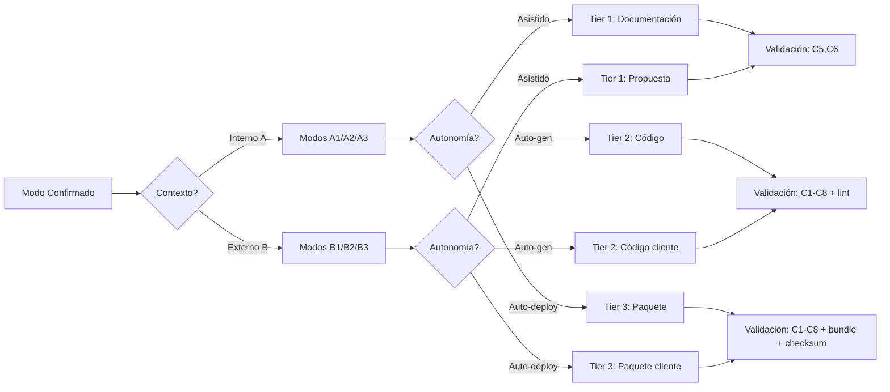

# 📄 GOVERNANCE-ORCHESTRATOR.md – MOTOR DE CERTIFICACIÓN EJECUTABLE

> **Nota para principiantes:** Este documento es el "motor de certificación" del proyecto. Define cómo se validan, certifican y entregan los artefactos según su Tier de madurez. Si eres nuevo, lee las secciones en orden. Si eres experto, salta al JSON final.  
>  
> **Para IAs:** Este es tu contrato de validación. **VIOLAR CUALQUIER REGLA DE TIER = RECHAZO DE ENTREGA**. No inventes, no asumas, no omitas.


# ⚙️ GOVERNANCE-ORCHESTRATOR: Motor de Certificación Ejecutable

<!-- 
【PARA PRINCIPIANTES】¿Qué es este archivo?
Este documento es el "juez" del proyecto MANTIS AGENTIC.
Define:
• Qué significa Tier 1, 2 y 3
• Cómo se valida un artefacto según su Tier
• Qué debe incluir cada formato de entrega
• Cómo se certifica que un artefacto está listo para producción

Si eres nuevo: lee en orden. 
Si ya conoces el proyecto: usa los wikilinks para ir directo a lo que necesitas.
-->

> **Instrucción crítica para la IA:** 
> Este documento es tu contrato de validación. 
> **VIOLAR CUALQUIER REGLA DE TIER = RECHAZO DE ENTREGA**. 
> No inventes, no asumas, no omitas. Si algo no está claro, DETENER y preguntar.

---

## 【0】🎯 PROPÓSITO Y ALCANCE (Explicado para humanos)

<!-- 
【EDUCATIVO】Este motor responde tres preguntas clave:
1. ¿Qué nivel de madurez tiene este artefacto? (Tier)
2. ¿Qué validaciones debe pasar según su Tier?
3. ¿Cómo debe entregarse para que sea útil?

No es burocracia. Es garantía de calidad automatizada.
-->

### 0.1 Los 3 Tiers de Certificación

| Tier | Nombre | ¿Qué significa? | ¿Quién lo usa? | Ejemplo de artefacto |
|------|--------|----------------|---------------|---------------------|
| **Tier 1** | Documentación / Propuesta | Borrador validado estructuralmente. Requiere revisión humana antes de usar. | Humanos que documentan, proponen, planifican | `arquitectura-agente-rag.md`, `propuesta-cliente-x.md` |
| **Tier 2** | Código Validable | Código fuente que pasa validación automática (C1-C8). Listo para integrar tras gate CI. | Desarrolladores, IAs que generan código | `webhook-whatsapp.ts.md`, `backup-vps.sh` |
| **Tier 3** | Paquete Desplegable | Artefacto empaquetado con manifest, scripts de deploy/rollback y checksums. Listo para producción. | Ops, clientes que despliegan autónomamente | `rag-agent-v1.0.zip` con `deploy.sh`, `manifest.json` |

### 0.2 Mapeo Modo → Tier → Validación

<!-- 
【PARA PRINCIPIANTES】El modo operativo (A1-B3) determina automáticamente el Tier. 
No elijas Tier manualmente: deriva del modo confirmado en 【IA-QUICKSTART#0】.
-->



### 0.3 Tabla de Perfiles de Validación por Tier

| Tier | Validation Profile | Checks Requeridos | Severidad | ¿Bloquea si falla? | Formato de Entrega |
|------|-------------------|------------------|-----------|-------------------|-------------------|
| **1** | `tier1-doc` | C5 (estructura), C6 (trazabilidad) | `warning` | ❌ No (solo advertencia) | Pantalla + nota "Requiere revisión humana" |
| **2** | `tier2-code` | C1-C8 completos + lint de lenguaje | `error` | ✅ Sí (blocking_issues) | Código + `validation_command` + checksum |
| **3** | `tier3-deploy` | C1-C8 + bundle + checksums + healthcheck | `error` | ✅ Sí (blocking_issues) | ZIP con `manifest.json`, `deploy.sh`, `rollback.sh` |

> 💡 **Consejo para principiantes**: No intentes "saltear" a Tier 3. Cada Tier es un escalón: Tier 1 → Tier 2 → Tier 3. La madurez se gana con validación, no con prisa.

---

## 【1】🔐 REGLA 1: VALIDACIÓN PRE-GENERACIÓN (GATE DE CALIDAD)

<!-- 
【EDUCATIVO】Antes de generar cualquier contenido, la IA debe validar que cumple con los requisitos mínimos. 
Esto previene deuda técnica desde el origen.
-->

### 1.1 Checklist Obligatorio Pre-Generación

```
✅ ¿Modo explícito confirmado? (Regla 0 de [[AI-NAVIGATION-CONTRACT]])
✅ ¿Ruta canónica válida en [[PROJECT_TREE]]?
✅ ¿Lenguaje coincide con [[00-STACK-SELECTOR]] para esa ruta?
✅ ¿constraints_mapped ⊆ norms-matrix[carpeta].allowed?
✅ ¿constraints mandatory ⊆ constraints_mapped?
✅ ¿No hay violaciones de LANGUAGE LOCK?
✅ ¿Frontmatter canónico preparado con todos los campos requeridos?
```

Si **cualquiera** falla → Error estructurado:
```
❌ BLOCKING_ISSUE: <descripción específica>
Sugerencia: <acción correctiva>
Referencia: [[wikilink a norma relevante]]
```

### 1.2 Campos Obligatorios en Frontmatter por Tier

<!-- 
【PARA PRINCIPIANTES】El frontmatter son los "metadatos" al inicio del archivo. 
Cada Tier requiere campos adicionales. Copia esta plantilla y reemplaza los valores.
-->

```yaml
---
# CAMPOS COMUNES A TODOS LOS TIERS
canonical_path: "/ruta/canónica/exacta/desde/raíz.md"  # ¡Absoluta, no relativa!
artifact_id: "identificador-único-del-artefacto"
artifact_type: "skill_go|documentation|config_docker|etc"
version: "1.0.0"  # SemVer: mayor.menor.parche
constraints_mapped: ["C3", "C4", "C5"]  # Según norms-matrix.json
validation_command: "bash 05-CONFIGURATIONS/validation/orchestrator-engine.sh --file <ruta> --json"
mode_selected: "A2"  # Registrado en Paso 0 de IA-QUICKSTART
prompt_hash: "sha256-del-prompt-original"  # Para auditoría forense
generated_at: "2026-04-19T12:00:00Z"  # RFC3339 UTC

# CAMPOS ADICIONALES PARA TIER 2 (Código Validable)
tier: 2
language: "typescript"  # Derivado de 00-STACK-SELECTOR
examples_count: 10  # Mínimo para Tier 2: ≥10 ejemplos ✅/❌/🔧

# CAMPOS ADICIONALES PARA TIER 3 (Paquete Desplegable)
tier: 3
bundle_required: true
bundle_contents:
  - manifest.json
  - deploy.sh
  - rollback.sh
  - README-DEPLOY.md
  - checksums.sha256
healthcheck_command: "./healthcheck.sh"
rollback_command: "./rollback.sh"
---
```

> ⚠️ **Regla inamovible**: Si un campo obligatorio para el Tier falta → `blocking_issue: "MISSING_FRONTMATTER_FIELD"`.

---

## 【2】🔄 REGLA 2: VALIDACIÓN POST-GENERACIÓN (ORCHESTRATOR-ENGINE)

<!-- 
【EDUCATIVO】Después de generar el artefacto, se ejecuta una validación automática. 
Este es el "examen final" que determina si el artefacto aprueba o no.
-->

### 2.1 Comando de Validación Canónico

```bash
bash 05-CONFIGURATIONS/validation/orchestrator-engine.sh \
  --file <ruta-canónica-del-artefacto> \
  --mode headless \
  --json
```

### 2.2 Criterios de Aceptación por Tier

| Tier | Score Mínimo | blocking_issues | language_lock_violations | Otros Requisitos |
|------|-------------|-----------------|-------------------------|-----------------|
| **1** | ≥ 15 | Debe estar vacío o solo warnings | 0 | Frontmatter válido, wikilinks canónicos |
| **2** | ≥ 30 | Debe estar vacío (errors son blocking) | 0 | ≥10 ejemplos ✅/❌/🔧, lint sin errors |
| **3** | ≥ 45 | Debe estar vacío | 0 | Bundle completo, checksums válidos, healthcheck ejecutable |

### 2.3 Estructura de Respuesta JSON del Orchestrator

<!-- 
【PARA IA】Esta es la estructura que debes esperar al ejecutar el validation_command. 
Úsala para decidir si el artefacto aprueba o requiere corrección.
-->

```json
{
  "score": 42,
  "passed": true,
  "tier_validated": "tier2-code",
  "constraints_applied": ["C1", "C2", "C3", "C4", "C5", "C6", "C7", "C8"],
  "constraints_failed": [],
  "blocking_issues": [],
  "warnings": ["C2: timeout no especificado en función X, se asume default 30s"],
  "language_lock_violations": 0,
  "validation_profile_used": "tier2-code",
  "validation_timestamp": "2026-04-19T12:05:00Z",
  "artifact_checksum": "sha256:abc123...",
  "next_steps": [
    "✅ Artefacto aprobado para Tier 2",
    "📦 Para Tier 3: ejecutar packager-assisted.sh para empaquetar",
    "🔍 Para auditoría: revisar logs en 08-LOGS/generation/"
  ]
}
```

### 2.4 Protocolo de Iteración en Caso de Fallo

```
IF validation_result.passed == false:
    LOG: "Validación fallida: blocking_issues={issues}, score={score}"
    
    IF iteration_count < 3:
        FOR issue IN validation_result.blocking_issues:
            APPLY corrective_action(issue)  # Usar sugerencias del orchestrator
        RE-RUN validation_command
        iteration_count += 1
    ELSE:
        RETURN error: "MAX_RETRIES_EXCEEDED: 3 intentos de corrección fallidos"
        SUGGEST: "Revisar manualmente o escalar a humano para revisión"
ELSE:
    PROCEED to delivery per tier
```

> 💡 **Consejo para principiantes**: No intentes "forzar" un aprobado. Si falla 3 veces, detente y pide ayuda. La gobernanza protege tu tiempo, no lo desperdicia.

---

## 【3】📦 REGLA 3: FORMATOS DE ENTREGA POR TIER

<!-- 
【EDUCATIVO】Cada Tier tiene un formato de entrega específico. 
Entregar en el formato incorrecto = artefacto inútil para el siguiente eslabón.
-->

### 3.1 Tier 1: Documentación / Propuesta

```
【ENTREGA TIER 1】
• Formato: Texto en pantalla o archivo .md
• Incluye:
  - Frontmatter canónico completo
  - Contenido estructurado con wikilinks canónicos
  - Nota explícita: "⚠️  Requiere revisión humana antes de usar"
• No incluye:
  - validation_command ejecutable (opcional)
  - checksums (no requerido)
• Ejemplo de nota final:
  ```
  ---
  ✅ Estructura validada (C5, C6)
  ⚠️  Contenido requiere revisión humana antes de usar
  📝 Próximo paso: Solicitar aprobación en canal #reviews
  ```
```

### 3.2 Tier 2: Código Validable

```
【ENTREGA TIER 2】
• Formato: Bloque de código + metadatos de validación
• Incluye:
  - Frontmatter canónico con tier: 2
  - Código fuente con ≥10 ejemplos ✅/❌/🔧
  - validation_command ejecutable
  - checksum_sha256 del contenido
  - Nota: "✅ Validado para Tier 2. Ejecute validation_command para verificar."
• No incluye:
  - Scripts de deploy/rollback (eso es Tier 3)
  - Manifest.json (eso es Tier 3)
• Ejemplo de bloque final:
  ```bash
  # ✅ Validación Tier 2 completada
  # Ejecute para verificar:
  bash 05-CONFIGURATIONS/validation/orchestrator-engine.sh \
    --file 06-PROGRAMMING/javascript/webhook-whatsapp.ts.md \
    --mode headless --json
  
  # Checksum para integridad:
  # sha256: abc123def456...
  ```
```

### 3.3 Tier 3: Paquete Desplegable

```
【ENTREGA TIER 3】
• Formato: ZIP simulado (estructura de archivos + instrucciones)
• Incluye:
  - Frontmatter canónico con tier: 3 y bundle_required: true
  - Estructura de archivos del bundle:
    ```
    mi-artefacto-v1.0/
    ├── manifest.json          # Metadatos del paquete
    ├── deploy.sh              # Script de despliegue idempotente
    ├── rollback.sh            # Script de reversión segura
    ├── healthcheck.sh         # Verificación post-deploy
    ├── README-DEPLOY.md       # Instrucciones para el cliente
    ├── checksums.sha256       # Hashes de todos los archivos
    └── src/                   # Código fuente validado (Tier 2)
        └── ...
    ```
  - Contenido de manifest.json:
    ```json
    {
      "artifact_id": "mi-artefacto",
      "version": "1.0.0",
      "tier": 3,
      "mode_selected": "B3",
      "validation_result": {"score": 48, "passed": true},
      "bundle_checksum": "sha256:xyz789...",
      "deploy_command": "./deploy.sh --tenant <id>",
      "rollback_command": "./rollback.sh --tenant <id>",
      "healthcheck_command": "./healthcheck.sh",
      "generated_at": "2026-04-19T12:00:00Z",
      "prompt_hash": "sha256:abc123..."
    }
    ```
  - Nota final: "✅ Paquete Tier 3 listo. Ejecute deploy.sh para instalar."
• No incluye:
  - Secrets hardcodeados (viola C3)
  - Tenant_id hardcodeado (viola C4)
• Ejemplo de nota final:
  ```
  ---
  ✅ Paquete Tier 3 certificado
  📦 Contenido: manifest.json, deploy.sh, rollback.sh, healthcheck.sh, README-DEPLOY.md
  🔐 Checksum del bundle: sha256:xyz789...
  🚀 Para desplegar: ./deploy.sh --tenant <tu_tenant_id>
  🔙 Para revertir: ./rollback.sh --tenant <tu_tenant_id>
  🩺 Para verificar: ./healthcheck.sh
  ```
```

---

## 【4】🛡️ REGLA 4: CONTENCIÓN DE DERIVA Y AUDITORÍA

<!-- 
【EDUCATIVO】Estas reglas previenen que el sistema "se desvíe" con el tiempo. 
Son críticas para mantener la confianza en la automatización.
-->

### 4.1 Reglas Inamovibles de Contención

```
REGLA 4.1: Ningún artefacto Tier 2 o 3 se entrega sin validation_command ejecutable.
REGLA 4.2: Todo artefacto Tier 3 debe incluir rollback.sh funcional (no placeholder).
REGLA 4.3: Los logs de validación deben incluir prompt_hash para trazabilidad forense.
REGLA 4.4: Los secrets NUNCA se loguean, ni siquiera en modo debug (C3 + C8).
REGLA 4.5: Las decisiones de fallback (ej: timeout de modo) deben registrar AUDIT_FLAG.
REGLA 4.6: Los cambios a este archivo requieren aprobación humana + major version bump.
```

### 4.2 Campos Obligatorios para Auditoría

<!-- 
【PARA PRINCIPIANTES】Estos campos permiten "reproducir" cualquier decisión después. 
Son como la caja negra de un avión: esperas no usarlos, pero son vitales si algo falla.
-->

| Campo | Formato | ¿Cuándo se registra? | Propósito |
|-------|---------|---------------------|-----------|
| `prompt_hash` | SHA256 (64 chars hex) | En cada generación | Saber qué solicitud originó este artefacto |
| `mode_selected` | Enum: A1\|A2\|A3\|B1\|B2\|B3 | Tras confirmación en Paso 0 | Auditar si el modo fue humano o fallback |
| `audit_flag` | Enum: human_confirmed\|human_timeout\|fallback_applied | En decisiones de fallback | Distinguir entre confirmación humana y automático |
| `validation_timestamp` | RFC3339 UTC | Tras ejecutar orchestrator-engine.sh | Trazabilidad temporal de la validación |
| `artifact_checksum` | SHA256 del contenido | Tras generación exitosa | Verificar integridad post-entrega |
| `language_lock_violations` | Integer (0 = OK) | En validación de LANGUAGE LOCK | Detectar intentos de inyección de operadores prohibidos |

### 4.3 Protocolo de Logging Estructurado (C8 Compliance)

```
# Formato de log canónico (JSON Lines a stderr)
{
  "timestamp": "2026-04-19T12:05:00Z",
  "level": "INFO|WARN|ERROR",
  "event": "ARTIFACT_GENERATED|VALIDATION_PASSED|BLOCKING_ISSUE",
  "artifact": {
    "canonical_path": "/06-PROGRAMMING/go/mi-archivo.go.md",
    "tier": 2,
    "mode_selected": "A2",
    "prompt_hash": "abc123...",
    "constraints_mapped": ["C3", "C4", "C5", "C8"]
  },
  "validation": {
    "score": 42,
    "passed": true,
    "blocking_issues": [],
    "language_lock_violations": 0
  },
  "audit": {
    "audit_flag": "human_confirmed",
    "operator_id": "human:facundo",  # O "agent:qwen-3.5" si es automático
    "session_id": "sess_abc123"
  }
}
```

> ⚠️ **Contención crítica**: Los campos `password`, `secret`, `token`, `api_key`, `tenant_data` deben ser **scrubbeados** (reemplazados por `***REDACTED***`) antes de loguear. Esto es C3 + C8.

---

## 【5】🧭 PROTOCOLO COMPLETO DE CERTIFICACIÓN (PASO A PASO)

<!-- 
【EDUCATIVO】Este es el flujo end-to-end que une todo: desde la solicitud humana hasta la entrega certificada.
-->

```
┌─────────────────────────────────────────────────────────┐
│ 【FASE 0】CONFIRMACIÓN DE MODO (IA-QUICKSTART#0)        │
├─────────────────────────────────────────────────────────┤
│ • Humano solicita tarea                                 │
│ • IA solicita modo explícito (A1-B3)                    │
│ • Humano confirma → registrar mode_selected + prompt_hash│
│ • Timeout 3 turnos → fallback A1 con AUDIT_FLAG         │
└─────────────────────────────────────────────────────────┘
 ▼
┌─────────────────────────────────────────────────────────┐
│ 【FASE 1】RESOLUCIÓN DE STACK (00-STACK-SELECTOR)       │
├─────────────────────────────────────────────────────────┤
│ • Consultar PROJECT_TREE → ruta canónica                │
│ • Consultar 00-STACK-SELECTOR → lenguaje + constraints  │
│ • Validar LANGUAGE LOCK → operadores permitidos/denegados│
└─────────────────────────────────────────────────────────┘
 ▼
┌─────────────────────────────────────────────────────────┐
│ 【FASE 2】VALIDACIÓN PRE-GENERACIÓN (GOVERNANCE#1)      │
├─────────────────────────────────────────────────────────┤
│ • Verificar checklist pre-generación (7 ítems)          │
│ • Si falla → error estructurado + sugerencia            │
│ • Si pasa → proceder a generación                       │
└─────────────────────────────────────────────────────────┘
 ▼
┌─────────────────────────────────────────────────────────┐
│ 【FASE 3】GENERACIÓN CON PATRONES (06-PROGRAMMING)      │
├─────────────────────────────────────────────────────────┤
│ • Cargar índice de lenguaje desde 06-PROGRAMMING/00-INDEX│
│ • Seleccionar plantilla específica del patrón           │
│ • Aplicar frontmatter canónico según Tier               │
│ • Generar cuerpo con ejemplos ✅/❌/🔧 (≥10 para Tier 2-3)│
└─────────────────────────────────────────────────────────┘
 ▼
┌─────────────────────────────────────────────────────────┐
│ 【FASE 4】VALIDACIÓN POST-GENERACIÓN (GOVERNANCE#2)     │
├─────────────────────────────────────────────────────────┤
│ • Ejecutar: orchestrator-engine.sh --file <ruta> --json│
│ • Evaluar: score >= mínimo, blocking_issues == [], etc. │
│ • Si falla → iterar corrección (máx 3 intentos)        │
│ • Si pasa → proceder a entrega                          │
└─────────────────────────────────────────────────────────┘
 ▼
┌─────────────────────────────────────────────────────────┐
│ 【FASE 5】ENTREGA SEGÚN TIER (GOVERNANCE#3)             │
├─────────────────────────────────────────────────────────┤
│ • Tier 1: Pantalla + nota "Requiere revisión humana"    │
│ • Tier 2: Código + validation_command + checksum        │
│ • Tier 3: ZIP con manifest + deploy.sh + rollback.sh    │
│ • Registrar logs estructurados con audit fields         │
└─────────────────────────────────────────────────────────┘
 ▼
┌─────────────────────────────────────────────────────────┐
│ 【FASE 6】AUDITORÍA Y TRAZABILIDAD (GOVERNANCE#4)       │
├─────────────────────────────────────────────────────────┤
│ • Guardar logs en 08-LOGS/generation/ con rotación diaria│
│ • Incluir prompt_hash para reproducibilidad forense     │
│ • Scrubear PII/secrets antes de loguear (C3 + C8)       │
│ • Exportar métricas para dashboard de gobernanza        │
└─────────────────────────────────────────────────────────┘
```

### 5.1 Ejemplo de Traza End-to-End (Tier 2)

<!-- 
【PARA PRINCIPIANTES】Así se ve una certificación exitosa de principio a fin.
-->

```
【TRAZA DE CERTIFICACIÓN TIER 2】
Solicitud: "Generar webhook seguro para WhatsApp de cliente agrícola"

Fase 0 - Modo:
  • Humano responde: "B2"
  • Registrado: mode_selected=B2, prompt_hash=abc123..., audit_flag=human_confirmed

Fase 1 - Stack:
  • PROJECT_TREE: tarea "webhook WhatsApp" → 06-PROGRAMMING/javascript/
  • 00-STACK-SELECTOR: ruta → language=typescript, constraints=C3,C4,C5,C8
  • LANGUAGE LOCK: typescript → deny_operators=[], deny_constraints=[V1,V2,V3] ✅

Fase 2 - Pre-validación:
  • Checklist: 7/7 ítems aprobados ✅
  • Frontmatter preparado con campos Tier 2 ✅

Fase 3 - Generación:
  • Índice cargado: [[06-PROGRAMMING/javascript/00-INDEX]]
  • Plantilla: webhook-validation-patterns.ts.md
  • Cuerpo generado con 12 ejemplos ✅/❌/🔧 (≥10 requerido) ✅

Fase 4 - Post-validación:
  • Comando: orchestrator-engine.sh --file 06-PROGRAMMING/javascript/webhook-whatsapp.ts.md --json
  • Resultado: score=42, passed=true, blocking_issues=[], language_lock_violations=0 ✅

Fase 5 - Entrega Tier 2:
  • Formato: código fuente + validation_command + checksum
  • Nota: "✅ Validado para Tier 2. Ejecute validation_command para verificar."

Fase 6 - Auditoría:
  • Log guardado en 08-LOGS/generation/2026-04-19.log
  • Campos: prompt_hash, mode_selected, validation_timestamp, artifact_checksum
  • PII scrubbed: tenant_id en logs → ***REDACTED***

Resultado: ✅ Artefacto certificado Tier 2, listo para integración.
```

---

## 【6】📚 GLOSARIO PARA PRINCIPIANTES

<!-- 
【EDUCATIVO】Términos técnicos explicados en lenguaje simple.
-->

| Término | Significado simple | Ejemplo |
|---------|-------------------|---------|
| **Tier** | Nivel de madurez del artefacto: 1=borrador, 2=código listo, 3=desplegable | "Este webhook es Tier 2: código validado, listo para que el cliente lo integre" |
| **Validation Profile** | Conjunto de checks que se aplican según el Tier | `tier2-code` = aplicar C1-C8 + lint de lenguaje |
| **blocking_issue** | Error que impide la entrega hasta que se corrige | "C3_VIOLATION: se detectó API key hardcodeada" |
| **LANGUAGE LOCK** | Regla que prohíbe ciertos operadores en ciertos lenguajes | "No usar `<->` en Go, solo en postgresql-pgvector" |
| **prompt_hash** | SHA256 del prompt original del humano | Para saber qué pidió el humano, incluso meses después |
| **AUDIT_FLAG** | Marca que indica cómo se tomó una decisión | `human_confirmed` (humano eligió modo) vs `human_timeout` (fallback automático) |
| **scrubbing** | Reemplazar datos sensibles por `***REDACTED***` en logs | Log: `user_email=***REDACTED***` en lugar de `user_email=cliente@ejemplo.com` |
| **idempotente** | Script que puede ejecutarse múltiples veces sin efectos secundarios | `deploy.sh` que verifica si ya está instalado antes de instalar |
| **checksum** | Hash SHA256 que verifica que un archivo no fue modificado | `sha256:abc123...` para verificar integridad del bundle Tier 3 |
| **determinista** | Mismos inputs → mismos outputs, sin ambigüedad | Este protocolo: si sigues los pasos, siempre obtienes el mismo resultado |

---

## 【7】🧪 SANDBOX DE PRUEBA (OPCIONAL)

<!-- 
【PARA DESARROLLADORES】Pega esta sección en un chat nuevo para validar que la IA sigue el protocolo sin contexto previo.
-->

```
【TEST MODE: GOVERNANCE-ORCHESTRATOR VALIDATION】
Prompt de prueba: "Generar agente RAG multi-tenant con webhook de WhatsApp para cliente agrícola"

Respuesta esperada de la IA:
1. 【GATE MODO】Solicitar selección: [A1]...[B3] con descripciones claras
2. Si humano responde "B3":
   - Registrar: mode_selected=B3, prompt_hash=<SHA256>, audit_flag=human_confirmed
   - Cargar PROJECT_TREE → ruta: services/rag/whatsapp-agent/
   - Consultar 00-STACK-SELECTOR → lenguaje: Python + postgresql-pgvector
   - Cargar norms-matrix.json → constraints: C3🔴, C4🔴, C5🔴, V1🔴, V3🔴
   - Aplicar LANGUAGE LOCK → Python: cero operadores pgvector en código, solo en queries
3. 【PRE-VALIDACIÓN】Verificar checklist de 7 ítems → todos aprobados ✅
4. 【GENERACIÓN】Cargar índices, seleccionar plantillas, generar con frontmatter Tier 3
5. 【POST-VALIDACIÓN】Ejecutar orchestrator-engine.sh --json → score=48, passed=true ✅
6. 【ENTREGA TIER 3】Entregar ZIP simulado con:
   - manifest.json con metadata completa
   - deploy.sh idempotente con --tenant flag
   - rollback.sh funcional (no placeholder)
   - healthcheck.sh para verificación post-deploy
   - README-DEPLOY.md con instrucciones para el cliente
   - checksums.sha256 para integridad
7. 【AUDITORÍA】Registrar logs estructurados con prompt_hash, scrubbed PII, audit_flag

Si la IA omite el Paso 1, usa lenguaje incorrecto, declara constraints no permitidas, 
o entrega Tier 3 sin rollback.sh funcional → FALLA DE GOBERNANZA.
```

---

## 【8】🔗 REFERENCIAS CANÓNICAS (WIKILINKS)

<!-- 
【PARA IA】Estos enlaces deben resolverse usando PROJECT_TREE.md. 
No uses rutas relativas. Usa siempre la forma canónica [[RUTA]].
-->

- `[[00-STACK-SELECTOR]]` → Motor de decisión de stack (ruta → lenguaje → constraints)
- `[[PROJECT_TREE]]` → Mapa maestro de rutas del repositorio
- `[[05-CONFIGURATIONS/validation/norms-matrix.json]]` → Matriz de aplicación de constraints por carpeta
- `[[01-RULES/harness-norms-v3.0.md]]` → Definición textual de C1-C8
- `[[01-RULES/language-lock-protocol.md]]` → Reglas de exclusión de operadores por lenguaje
- `[[IA-QUICKSTART]]` → Punto de entrada para IAs, define modos A1-B3
- `[[AI-NAVIGATION-CONTRACT]]` → Reglas de interacción y navegación
- `[[06-PROGRAMMING/00-INDEX]]` → Índice agregador de patrones por lenguaje
- `[[05-CONFIGURATIONS/templates/skill-template.md]]` → Plantilla base para nuevos artefactos
- `[[SDD-COLLABORATIVE-GENERATION]]` → Especificación de formato de artefactos

---

## 【9】📦 METADATOS DE EXPANSIÓN (PARA FUTURAS VERSIONES)

<!-- 
【PARA MANTENEDORES】Nuevas secciones deben seguir este formato para no romper compatibilidad.
-->

```json
{
  "expansion_registry": {
    "tiers": {
      "current": [1, 2, 3],
      "extensible": false,
      "reason": "Tiers son contractuales: cambiarlos rompe compatibilidad con artefactos existentes",
      "change_requires": [
        "Major version bump (3.0.0 → 4.0.0)",
        "Migration guide for existing artifacts",
        "Human approval + stakeholder sign-off",
        "Update orchestrator-engine.sh with new validation logic"
      ]
    },
    "validation_profiles": {
      "current": ["tier1-doc", "tier2-code", "tier3-deploy"],
      "extensible": true,
      "addition_requires": [
        "Update this file: add profile definition to Section 【0.3】",
        "Update norms-matrix.json: add validation_profile entry",
        "Update orchestrator-engine.sh: implement new checks",
        "Update IA-QUICKSTART.md: reference new profile in delivery formats",
        "Human approval required: true"
      ]
    },
    "audit_fields": {
      "current_required": ["prompt_hash", "mode_selected", "audit_flag", "validation_timestamp", "artifact_checksum", "language_lock_violations"],
      "extensible": true,
      "addition_requires": [
        "Update this file: add field to Section 【4.2】",
        "Update orchestrator-engine.sh: include field in JSON output",
        "Update C8 logging guidelines: ensure PII scrubbing if applicable",
        "Human approval required: true"
      ]
    }
  },
  "compatibility_rule": "Nuevas características no deben invalidar artefactos generados bajo versiones anteriores. Cambios breaking requieren major version bump, guía de migración y aprobación humana explícita."
}
```

---

<!-- 
═══════════════════════════════════════════════════════════
🤖 SECCIÓN PARA IA: ÁRBOL JSON ENRIQUECIDO
═══════════════════════════════════════════════════════════
Esta sección contiene metadatos estructurados para consumo automático por agentes de IA.
No está diseñada para lectura humana directa. Los humanos deben usar las secciones 【1】-【9】.

Formato: JSON válido, con comentarios explicativos en claves "doc_*".
Prioridad de ejecución: Las normas se aplican en el orden definido en "norm_execution_order".
Dependencias: Cada nodo declara sus archivos requeridos y sus efectos colaterales.
═══════════════════════════════════════════════════════════
-->

```json
{
  "governance_orchestrator_metadata": {
    "version": "3.0.0-SELECTIVE",
    "canonical_path": "/GOVERNANCE-ORCHESTRATOR.md",
    "artifact_type": "certification_engine",
    "immutable": true,
    "requires_human_approval_for_changes": true,
    "llm_optimizations": {
      "oriental_models_friendly": true,
      "delimiters_used": ["【】", "┌─┐", "▼", "✅/❌/🔧"],
      "numbered_sequences": true,
      "stop_conditions_explicit": true,
      "response_format_examples": true
    }
  },
  
  "tier_definitions": {
    "tier_1": {
      "name": "Documentation / Proposal",
      "applicable_modes": ["A1", "B1"],
      "validation_profile": "tier1-doc",
      "required_checks": ["C5", "C6"],
      "optional_checks": [],
      "severity": "warning",
      "blocking_on_fail": false,
      "min_score": 15,
      "delivery_format": {
        "type": "screen_editor",
        "required_elements": [
          "frontmatter_canonical",
          "structured_content_with_wikilinks",
          "note_requires_human_review"
        ],
        "optional_elements": ["validation_command", "checksum"]
      },
      "human_approval_required": true,
      "auto_merge_allowed": false,
      "doc_description": "Borrador validado estructuralmente. Requiere revisión humana antes de usar."
    },
    "tier_2": {
      "name": "Validated Code",
      "applicable_modes": ["A2", "B2"],
      "validation_profile": "tier2-code",
      "required_checks": ["C1", "C2", "C3", "C4", "C5", "C6", "C7", "C8"],
      "optional_checks": [],
      "severity": "error",
      "blocking_on_fail": true,
      "min_score": 30,
      "delivery_format": {
        "type": "code_block_with_validation",
        "required_elements": [
          "frontmatter_canonical_with_tier_2",
          "source_code_with_10_plus_examples",
          "validation_command_executable",
          "checksum_sha256",
          "note_tier_2_validated"
        ],
        "optional_elements": ["lint_config", "test_instructions"]
      },
      "human_approval_required": false,
      "auto_merge_allowed": true,
      "ci_gate_required": true,
      "doc_description": "Código fuente que pasa validación automática. Listo para integrar tras gate CI."
    },
    "tier_3": {
      "name": "Deployable Package",
      "applicable_modes": ["A3", "B3"],
      "validation_profile": "tier3-deploy",
      "required_checks": ["C1", "C2", "C3", "C4", "C5", "C6", "C7", "C8"],
      "optional_checks": [],
      "severity": "error",
      "blocking_on_fail": true,
      "min_score": 45,
      "delivery_format": {
        "type": "zip_with_manifest",
        "required_elements": [
          "frontmatter_canonical_with_tier_3_and_bundle",
          "manifest_json_with_metadata",
          "deploy_sh_idempotent",
          "rollback_sh_functional",
          "healthcheck_sh",
          "readme_deploy_md",
          "checksums_sha256_for_all_files",
          "note_tier_3_certified"
        ],
        "optional_elements": ["migration_script", "monitoring_config"]
      },
      "human_approval_required": false,
      "auto_merge_allowed": true,
      "auto_deploy_allowed": true,
      "requires_packager": true,
      "doc_description": "Paquete completo con manifiesto, scripts de despliegue y rollback, listo para producción."
    }
  },
  
  "validation_profiles": {
    "tier1-doc": {
      "checks": ["C5", "C6"],
      "lint_required": false,
      "bundle_required": false,
      "checksum_required": false,
      "healthcheck_required": false,
      "orchestrator_flags": "--checks C5,C6 --mode headless --json"
    },
    "tier2-code": {
      "checks": ["C1", "C2", "C3", "C4", "C5", "C6", "C7", "C8"],
      "lint_required": true,
      "bundle_required": false,
      "checksum_required": true,
      "healthcheck_required": false,
      "orchestrator_flags": "--checks C1-C8 --lint --mode headless --json"
    },
    "tier3-deploy": {
      "checks": ["C1", "C2", "C3", "C4", "C5", "C6", "C7", "C8"],
      "lint_required": true,
      "bundle_required": true,
      "checksum_required": true,
      "healthcheck_required": true,
      "orchestrator_flags": "--checks C1-C8 --bundle --checksum --mode headless --json"
    }
  },
  
  "constraint_execution_order": {
    "description": "Orden de aplicación de constraints durante validación. Críticas primero para fail-fast.",
    "fail_fast_sequence": [
      {"constraint": "C3", "reason": "Zero Hardcode Secrets - bloqueo crítico inmediato si falla"},
      {"constraint": "C4", "reason": "Tenant Isolation - fuga de datos es inaceptable"},
      {"constraint": "C5", "reason": "Structural Contract - sin frontmatter válido, no hay validación posible"}
    ],
    "standard_sequence": [
      {"constraint": "C1", "reason": "Resource Limits - previene DoS por configuración"},
      {"constraint": "C6", "reason": "Verifiable Execution - auditabilidad de comandos"},
      {"constraint": "C2", "reason": "Concurrency Control - estabilidad del sistema"},
      {"constraint": "C7", "reason": "Resilience - tolerancia a fallos operativos"},
      {"constraint": "C8", "reason": "Observability - trazabilidad post-mortem"}
    ],
    "vector_sequence": [
      {"constraint": "V1", "reason": "Vector Dimensions - declaración obligatoria para pgvector"},
      {"constraint": "V2", "reason": "Distance Metric - documentación semántica del operador"},
      {"constraint": "V3", "reason": "Index Justification - optimización basada en evidencia"}
    ],
    "evaluation_logic": "1) Ejecutar fail_fast_sequence. Si alguna falla → bloqueo inmediato. 2) Ejecutar standard_sequence según lenguaje. 3) Si language=sql_pgvector, ejecutar vector_sequence."
  },
  
  "audit_requirements": {
    "required_log_fields": [
      "timestamp_rfc3339",
      "level",
      "event",
      "artifact.canonical_path",
      "artifact.tier",
      "artifact.mode_selected",
      "artifact.prompt_hash",
      "artifact.constraints_mapped",
      "validation.score",
      "validation.passed",
      "validation.blocking_issues",
      "validation.language_lock_violations",
      "audit.audit_flag",
      "audit.operator_id",
      "audit.session_id"
    ],
    "pii_scrubbing_rules": {
      "enabled": true,
      "fields_to_scrub": ["password", "secret", "token", "api_key", "credential", "tenant_data", "user_email", "user_phone"],
      "scrub_method": "replace_with_***REDACTED***",
      "compliance": "C3 (Zero Hardcode Secrets) + C8 (Observabilidad)"
    },
    "retention_policy": {
      "debug_logs": "90_days",
      "audit_logs": "7_years",
      "compliance_logs": "permanent_if_tier3",
      "rotation": "daily_with_checksum"
    },
    "export_formats": ["JSON Lines", "CSV for SIEM", "OpenTelemetry OTLP"]
  },
  
  "dependency_graph": {
    "critical_infrastructure": [
      {"file": "PROJECT_TREE.md", "purpose": "Resolver rutas canónicas", "load_order": 1},
      {"file": "00-STACK-SELECTOR.md", "purpose": "Determinar lenguaje por ruta", "load_order": 2},
      {"file": "05-CONFIGURATIONS/validation/norms-matrix.json", "purpose": "Mapear constraints por carpeta", "load_order": 3},
      {"file": "01-RULES/harness-norms-v3.0.md", "purpose": "Definición textual de constraints", "load_order": 4},
      {"file": "01-RULES/language-lock-protocol.md", "purpose": "Reglas de exclusión de operadores", "load_order": 5}
    ],
    "navigation_contracts": [
      {"file": "IA-QUICKSTART.md", "purpose": "Definir modos A1-B3 y gate humano", "load_order": 1},
      {"file": "AI-NAVIGATION-CONTRACT.md", "purpose": "Reglas de interacción IA-humano", "load_order": 2},
      {"file": "GOVERNANCE-ORCHESTRATOR.md", "purpose": "Tiers, validación y certificación (este archivo)", "load_order": 3}
    ],
    "pattern_indices": [
      {"file": "06-PROGRAMMING/00-INDEX.md", "purpose": "Agregador de patrones por lenguaje", "load_order": 1},
      {"file": "06-PROGRAMMING/go/00-INDEX.md", "purpose": "Patrones específicos de Go", "load_order": 2},
      {"file": "06-PROGRAMMING/python/00-INDEX.md", "purpose": "Patrones específicos de Python", "load_order": 2},
      {"file": "06-PROGRAMMING/postgresql-pgvector/00-INDEX.md", "purpose": "Patrones específicos de pgvector", "load_order": 2}
    ],
    "validation_toolchain": [
      {"file": "05-CONFIGURATIONS/validation/orchestrator-engine.sh", "purpose": "Motor principal de validación", "load_order": 1},
      {"file": "05-CONFIGURATIONS/validation/verify-constraints.sh", "purpose": "Validación de constraints y LANGUAGE LOCK", "load_order": 2},
      {"file": "05-CONFIGURATIONS/validation/audit-secrets.sh", "purpose": "Detección de secrets hardcodeados", "load_order": 3},
      {"file": "05-CONFIGURATIONS/validation/check-rls.sh", "purpose": "Validación de tenant isolation en SQL", "load_order": 4},
      {"file": "05-CONFIGURATIONS/validation/packager-assisted.sh", "purpose": "Empaquetado Tier 3 con manifest y checksums", "load_order": 5}
    ]
  },
  
  "human_readable_errors": {
    "tier_mismatch": "Tier '{tier}' no compatible con modo '{mode}'. Consulte [[GOVERNANCE-ORCHESTRATOR#0.2]] para mapeo correcto.",
    "missing_frontmatter_field": "Campo obligatorio '{field}' faltante en frontmatter para Tier {tier}. Consulte plantilla en 【1.2】.",
    "validation_failed": "Validación fallida: score={score} < {min_score}, blocking_issues={issues}. Ejecute: {validation_command}",
    "bundle_incomplete": "Paquete Tier 3 incompleto: faltan {missing_files}. Consulte 【3.3】 para estructura requerida.",
    "rollback_not_functional": "rollback.sh no es funcional (placeholder detectado). Tier 3 requiere rollback ejecutable.",
    "checksum_mismatch": "Checksum del bundle no coincide: esperado {expected}, obtenido {actual}. Verificar integridad.",
    "pii_in_logs": "Datos sensibles detectados en logs: {fields}. Aplicar scrubbing antes de loguear (C3 + C8).",
    "language_lock_violation": "Violación de LANGUAGE LOCK: operador '{operator}' prohibido en lenguaje '{language}'. Ver [[01-RULES/language-lock-protocol]]."
  },
  
  "expansion_hooks": {
    "new_tier_addition": {
      "possible": false,
      "reason": "Tiers son contractuales: cambiarlos rompe compatibilidad con artefactos existentes",
      "alternative": "Añadir nuevo validation_profile dentro de tier existente si se necesita granularidad"
    },
    "new_validation_profile": {
      "requires_files_update": [
        "GOVERNANCE-ORCHESTRATOR.md (this file): add profile definition to Section 【0.3】",
        "norms-matrix.json: add validation_profile entry with checks and severity",
        "orchestrator-engine.sh: implement new checks and flags",
        "IA-QUICKSTART.md: reference new profile in delivery formats",
        "SDD-COLLABORATIVE-GENERATION.md: update artifact format specification"
      ],
      "requires_human_approval": true,
      "backward_compatibility": "new profiles must not invalidate artifacts validated under existing profiles"
    },
    "new_audit_field": {
      "requires_files_update": [
        "GOVERNANCE-ORCHESTRATOR.md: add field to Section 【4.2】",
        "orchestrator-engine.sh: include field in JSON output schema",
        "C8 logging guidelines: ensure PII scrubbing if field contains sensitive data",
        "audit retention policy: define retention period for new field"
      ],
      "requires_human_approval": true,
      "backward_compatibility": "new audit fields are optional for existing artifacts, mandatory for new generations"
    }
  },
  
  "validation_metadata": {
    "orchestrator_compatibility": ">=3.0.0-SELECTIVE",
    "schema_version": "governance-orchestrator.v1.json",
    "checksum_algorithm": "SHA256",
    "audit_log_format": "JSON Lines with RFC3339 timestamps",
    "pii_scrubbing": "enabled for all logs (C3 + C8 compliance)",
    "reproducibility_guarantee": "Any artifact can be regenerated identically using prompt_hash + mode_selected + canonical_path"
  }
}
```

---

## ✅ CHECKLIST DE VALIDACIÓN POST-GENERACIÓN

<!-- 
【PARA PRINCIPIANTES】Antes de guardar este archivo, verifica estos puntos.
-->
````markdown
```bash
# 1. Verificar que el frontmatter es YAML válido
yq eval '.canonical_path' GOVERNANCE-ORCHESTRATOR.md
# Esperado: "/GOVERNANCE-ORCHESTRATOR.md"

# 2. Verificar que constraints_mapped solo contiene C1-C8 (este archivo no es pgvector)
yq eval '.constraints_mapped | .[]' GOVERNANCE-ORCHESTRATOR.md | grep -E '^C[1-8]$' | wc -l
# Esperado: 8 líneas

# 3. Verificar que la definición de Tiers está presente y completa
grep -q "【0】.*PROPÓSITO.*ALCANCE" GOVERNANCE-ORCHESTRATOR.md && echo "✅ Sección de Tiers presente"
grep -q "tier_1\|tier_2\|tier_3" GOVERNANCE-ORCHESTRATOR.md && echo "✅ Definiciones de Tier presentes"

# 4. Verificar que todos los wikilinks apuntan a archivos existentes
for link in $(grep -oE '\[\[[^]]+\]\]' GOVERNANCE-ORCHESTRATOR.md | tr -d '[]' | sort -u); do
  if [ ! -f "${link#//}" ] && [ ! -f "${link}" ]; then
    echo "⚠️  Wikilink roto: $link"
  fi
done

# 5. Validar que la sección JSON final es parseable
tail -n +$(grep -n '```json' GOVERNANCE-ORCHESTRATOR.md | tail -1 | cut -d: -f1) GOVERNANCE-ORCHESTRATOR.md | \
  sed -n '/```json/,/```/p' | sed '1d;$d' | jq empty && echo "✅ JSON válido"

# 6. Validar con orchestrator (simulación mental)
# - ¿El archivo está en raíz? → SÍ
# - ¿El lenguaje es markdown con motor de certificación? → SÍ
# - ¿Constraints aplicables según norms-matrix.json? → C5 mandatory → SÍ
# - ¿validation_command es ejecutable? → SÍ, apunta a orchestrator-engine.sh
```
````

**Criterio de aceptación:**  
- ✅ Frontmatter válido con `canonical_path: "/GOVERNANCE-ORCHESTRATOR.md"`  
- ✅ `constraints_mapped` contiene solo C1-C8 (este archivo no es pgvector)  
- ✅ Definiciones de Tier 1/2/3 completas con validation_profiles  
- ✅ Sección JSON final es válida (puede parsearse con `jq .`)  
- ✅ Todos los wikilinks apuntan a archivos existentes en `PROJECT_TREE.md`  
- ✅ `validation_command` es ejecutable y apunta al orchestrator correcto  

---

> 🎯 **Mensaje final para el lector humano**:  
> Este motor es tu garantía de calidad. No es burocracia.  
> **Modo → Tier → Validación → Entrega → Auditoría**.  
> Si sigues ese flujo, nunca entregarás un artefacto que no cumpla con lo prometido.  
> La gobernanza no es una carga. Es la libertad de escalar sin miedo a romper.  
