```mermaid
flowchart TD
    ROOT["🗺️ PROJECT_TREE.md<br/>Mapa Canónico MANTIS AGENTIC v3.0-SELECTIVE"]
    
    CONTEXT["📁 00-CONTEXT<br/>7 artefactos ✅"]
    RULES["📁 01-RULES<br/>12 artefactos ✅"]
    SKILLS["📁 02-SKILLS<br/>46 ✅ + 58 🆕"]
    AGENTS["📁 03-AGENTS<br/>10 🆕"]
    WORKFLOWS["📁 04-WORKFLOWS<br/>1 ✅ + 11 🆕"]
    CONFIG["📁 05-CONFIGURATIONS<br/>46 ✅ + 22 🆕"]
    PROGRAMMING["📁 06-PROGRAMMING<br/>18 🆕 + 10 ✅ pgvector"]
    PROCEDURES["📁 07-PROCEDURES<br/>9 🆕"]
    LOGS["📁 08-LOGS<br/>1 ✅ + 3 🆕"]
    
    ROOT --> CONTEXT
    ROOT --> RULES
    ROOT --> SKILLS
    ROOT --> AGENTS
    ROOT --> WORKFLOWS
    ROOT --> CONFIG
    ROOT --> PROGRAMMING
    ROOT --> PROCEDURES
    ROOT --> LOGS
    
    style ROOT fill:#2d1b69,stroke:#8a7cfb,stroke-width:3px,color:#fff
    style CONTEXT fill:#1a472a,stroke:#4ade80,stroke-width:2px,color:#fff
    style RULES fill:#1a472a,stroke:#4ade80,stroke-width:2px,color:#fff
    style SKILLS fill:#473a1a,stroke:#fbbf24,stroke-width:2px,color:#fff
    style AGENTS fill:#471a1a,stroke:#f87171,stroke-width:2px,color:#fff,stroke-dasharray:5 5
    style WORKFLOWS fill:#471a1a,stroke:#f87171,stroke-width:2px,color:#fff,stroke-dasharray:5 5
    style CONFIG fill:#1a3a47,stroke:#67e8f9,stroke-width:2px,color:#fff
    style PROGRAMMING fill:#1a472a,stroke:#4ade80,stroke-width:2px,color:#fff
    style PROCEDURES fill:#471a1a,stroke:#f87171,stroke-width:2px,color:#fff,stroke-dasharray:5 5
    style LOGS fill:#1a472a,stroke:#4ade80,stroke-width:2px,color:#fff
```

```markdown
# SHA256: f2e9a3c8b1d7f4e6a0c5b9d2e8f1a4c7b3d6e9f2a5c8b1d4e7a0f3c6b9d2e5a8
---
artifact_id: "PROJECT_TREE"
artifact_type: "rule_markdown"
version: "3.0.0-SELECTIVE"
canonical_path: "PROJECT_TREE.md"
purpose: "Mapa estructurado de todos los artefactos del repositorio, optimizado para navegación humana y automática por agentes de IA. Incluye estado, descripción, constraints aplicados, wikilinks y URLs raw."
audience: ["human_engineers", "agentic_assistants", "ci_cd_pipelines"]
constraints_mapped: ["C3","C4","C5","C7","C8"]
validation_command: "bash 05-CONFIGURATIONS/validation/orchestrator-engine.sh --file PROJECT_TREE.md --json"
checksum_sha256: "f2e9a3c8b1d7f4e6a0c5b9d2e8f1a4c7b3d6e9f2a5c8b1d4e7a0f3c6b9d2e5a8"
last_updated: "2026-04-19T00:00:00Z"
generation_method: "git ls-tree + manual curation + SDD v3.0-SELECTIVE + wikilinks + raw_urls + selective_vector_constraints"
status_legend:
  "✅ COMPLETADO": "Artefacto validado, estable, listo para producción"
  "🆕 PENDIENTE": "Artefacto planificado, sin contenido generado"
  "📝 EN PROGRESO": "Artefacto en desarrollo activo"
  "🔧 REVISIÓN": "Artefacto requiere actualización de constraints"
navigation_protocol:
  ia_mode: "Cargar [[IA-QUICKSTART.md]] → Resolver ruta en PROJECT_TREE.md → Fetch URL desde [[RAW_URLS_INDEX.md]] → Validar con orchestrator-engine.sh"
  human_mode: "Navegar por secciones → Filtrar por estado → Consultar descripción → Ejecutar validation_command"
wikilinks_enabled: true
raw_urls_integrated: true
language_lock:
  description: "Zero tolerance for pgvector operators in non-pgvector artifacts"
  prohibited_in_sql: ["<->", "<=>", "<#>", "vector(", "hnsw", "ivfflat"]
  prohibited_in_yaml_json_schema: ["<->", "<=>", "<#>", "vector(", "hnsw", "ivfflat"]
  allowed_only_in: "06-PROGRAMMING/postgresql-pgvector/"
selective_vector_constraints:
  apply_if: ["artifact_type == 'skill_pgvector'", "canonical_path contains 'postgresql-pgvector'", "content contains pgvector operators"]
  forbid_if: ["artifact_type in ['skill_sql', 'skill_yaml', 'skill_go']", "canonical_path NOT contains 'postgresql-pgvector'"]
---

# 🗺️ PROJECT_TREE – Mapa Canónico MANTIS AGENTIC
> **Propósito**: Este documento es la **fuente de verdad para resolución de rutas y estado de artefactos**.  
> **Regla de oro**: Si un archivo no está listado aquí con su `canonical_path`, NO EXISTE para efectos de generación o validación. No inventes, no asumas, no extrapoles.  
> **Actualización**: Este árbol se regenera tras cada merge a `main`. Última sincronización: `2026-04-19T00:00:00Z`.  
> **Wikilinks**: Activados para navegación en Obsidian (`[[archivo.md]]`).  
> **URLs Raw**: Integradas para los documentos canónicos del ROOT + nuevos artefactos pgvector.  
> **LANGUAGE LOCK**: Operadores pgvector (`<->`, `<=>`, `<#>`, `vector(`, `hnsw`, `ivfflat`) permitidos SOLO en `06-PROGRAMMING/postgresql-pgvector/`.

---

## 📊 Resumen Ejecutivo

| Métrica | Valor |
|---------|-------|
| Total artefactos listados | 274 (+27 nuevos pgvector) |
| ✅ Completados | 144 (+27 nuevos pgvector) |
| 🆕 Pendientes | 98 |
| 📝 En progreso | 32 |
| Secciones canónicas | 11 (ROOT + 00–09) |
| Constraints aplicados | C1–C8 (CORE) + V1–V3 (SELECTIVE para pgvector) |
| Wikilinks activos | Sí (formato Obsidian) |
| URLs raw integradas | 8 documentos del ROOT + 10 pgvector artifacts |
| LANGUAGE LOCK enforced | ✅ pgvector operators solo en postgresql-pgvector/ |

---

## 🔗 URLs Raw de Documentos Canónicos del ROOT + Nuevos pgvector

| Documento | URL Raw | Estado | Wikilink |
|-----------|---------|--------|----------|
| `IA-QUICKSTART.md` | [Ver raw](https://raw.githubusercontent.com/Mantis-AgenticDev/agentic-infra-docs/refs/heads/main/IA-QUICKSTART.md) | ✅ | [[IA-QUICKSTART.md]] |
| `README.md` | [Ver raw](https://raw.githubusercontent.com/Mantis-AgenticDev/agentic-infra-docs/refs/heads/main/README.md) | ✅ | [[README.md]] |
| `PROJECT_TREE.md` | [Ver raw](https://raw.githubusercontent.com/Mantis-AgenticDev/agentic-infra-docs/refs/heads/main/PROJECT_TREE.md) | 📝 | [[PROJECT_TREE.md]] |
| `knowledge-graph.json` | [Ver raw](https://raw.githubusercontent.com/Mantis-AgenticDev/agentic-infra-docs/refs/heads/main/knowledge-graph.json) | 📝 | [[knowledge-graph.json]] |
| `SDD-COLLABORATIVE-GENERATION.md` | [Ver raw](https://raw.githubusercontent.com/Mantis-AgenticDev/agentic-infra-docs/refs/heads/main/SDD-COLLABORATIVE-GENERATION.md) | ✅ | [[SDD-COLLABORATIVE-GENERATION.md]] |
| `TOOLCHAIN-REFERENCE.md` | [Ver raw](https://raw.githubusercontent.com/Mantis-AgenticDev/agentic-infra-docs/refs/heads/main/TOOLCHAIN-REFERENCE.md) | ✅ | [[TOOLCHAIN-REFERENCE.md]] |
| `AI-NAVIGATION-CONTRACT.md` | [Ver raw](https://raw.githubusercontent.com/Mantis-AgenticDev/agentic-infra-docs/refs/heads/main/AI-NAVIGATION-CONTRACT.md) | ✅ | [[AI-NAVIGATION-CONTRACT.md]] |
| `GOVERNANCE-ORCHESTRATOR.md` | [Ver raw](https://raw.githubusercontent.com/Mantis-AgenticDev/agentic-infra-docs/refs/heads/main/GOVERNANCE-ORCHESTRATOR.md) | ✅ | [[GOVERNANCE-ORCHESTRATOR.md]] |
| `RAW_URLS_INDEX.md` | [Ver raw](https://raw.githubusercontent.com/Mantis-AgenticDev/agentic-infra-docs/refs/heads/main/RAW_URLS_INDEX.md) | ✅ | [[RAW_URLS_INDEX.md]] |
| `norms-matrix.json` | [Ver raw](https://raw.githubusercontent.com/Mantis-AgenticDev/agentic-infra-docs/refs/heads/main/05-CONFIGURATIONS/validation/norms-matrix.json) | ✅ | [[norms-matrix.json]] |
| `06-PROGRAMMING/postgresql-pgvector/00-INDEX.md` | [Ver raw](https://raw.githubusercontent.com/Mantis-AgenticDev/agentic-infra-docs/refs/heads/main/06-PROGRAMMING/postgresql-pgvector/00-INDEX.md) | ✅ | [[06-PROGRAMMING/postgresql-pgvector/00-INDEX.md]] |
| `06-PROGRAMMING/postgresql-pgvector/hardening-verification.pgvector.md` | [Ver raw](https://raw.githubusercontent.com/Mantis-AgenticDev/agentic-infra-docs/refs/heads/main/06-PROGRAMMING/postgresql-pgvector/hardening-verification.pgvector.md) | ✅ | [[hardening-verification.pgvector]] |
| `06-PROGRAMMING/postgresql-pgvector/fix-sintaxis-code.pgvector.md` | [Ver raw](https://raw.githubusercontent.com/Mantis-AgenticDev/agentic-infra-docs/refs/heads/main/06-PROGRAMMING/postgresql-pgvector/fix-sintaxis-code.pgvector.md) | ✅ | [[fix-sintaxis-code.pgvector]] |
| `06-PROGRAMMING/postgresql-pgvector/vector-indexing-patterns.pgvector.md` | [Ver raw](https://raw.githubusercontent.com/Mantis-AgenticDev/agentic-infra-docs/refs/heads/main/06-PROGRAMMING/postgresql-pgvector/vector-indexing-patterns.pgvector.md) | ✅ | [[vector-indexing-patterns.pgvector]] |
| `06-PROGRAMMING/postgresql-pgvector/hybrid-search-rls-aware.pgvector.md` | [Ver raw](https://raw.githubusercontent.com/Mantis-AgenticDev/agentic-infra-docs/refs/heads/main/06-PROGRAMMING/postgresql-pgvector/hybrid-search-rls-aware.pgvector.md) | ✅ | [[hybrid-search-rls-aware.pgvector]] |
| `06-PROGRAMMING/postgresql-pgvector/tenant-isolation-for-embeddings.pgvector.md` | [Ver raw](https://raw.githubusercontent.com/Mantis-AgenticDev/agentic-infra-docs/refs/heads/main/06-PROGRAMMING/postgresql-pgvector/tenant-isolation-for-embeddings.pgvector.md) | ✅ | [[tenant-isolation-for-embeddings.pgvector]] |
| `06-PROGRAMMING/postgresql-pgvector/migration-patterns-for-vector-schemas.pgvector.md` | [Ver raw](https://raw.githubusercontent.com/Mantis-AgenticDev/agentic-infra-docs/refs/heads/main/06-PROGRAMMING/postgresql-pgvector/migration-patterns-for-vector-schemas.pgvector.md) | ✅ | [[migration-patterns-for-vector-schemas.pgvector]] |
| `06-PROGRAMMING/postgresql-pgvector/partitioning-strategies-for-high-dim.pgvector.md` | [Ver raw](https://raw.githubusercontent.com/Mantis-AgenticDev/agentic-infra-docs/refs/heads/main/06-PROGRAMMING/postgresql-pgvector/partitioning-strategies-for-high-dim.pgvector.md) | ✅ | [[partitioning-strategies-for-high-dim.pgvector]] |
| `06-PROGRAMMING/postgresql-pgvector/rag-query-with-tenant-enforcement.pgvector.md` | [Ver raw](https://raw.githubusercontent.com/Mantis-AgenticDev/agentic-infra-docs/refs/heads/main/06-PROGRAMMING/postgresql-pgvector/rag-query-with-tenant-enforcement.pgvector.md) | ✅ | [[rag-query-with-tenant-enforcement.pgvector]] |
| `06-PROGRAMMING/postgresql-pgvector/similarity-explanation-templates.pgvector.md` | [Ver raw](https://raw.githubusercontent.com/Mantis-AgenticDev/agentic-infra-docs/refs/heads/main/06-PROGRAMMING/postgresql-pgvector/similarity-explanation-templates.pgvector.md) | ✅ | [[similarity-explanation-templates.pgvector]] |
| `06-PROGRAMMING/postgresql-pgvector/nl-to-vector-query-patterns.pgvector.md` | [Ver raw](https://raw.githubusercontent.com/Mantis-AgenticDev/agentic-infra-docs/refs/heads/main/06-PROGRAMMING/postgresql-pgvector/nl-to-vector-query-patterns.pgvector.md) | ✅ | [[nl-to-vector-query-patterns.pgvector]] |

---

## 🗂️ Estructura de Navegación

```yaml
base_path: "/home/ricardo/proyectos/agentic-infra-docs/"
remote_base: "https://raw.githubusercontent.com/Mantis-AgenticDev/agentic-infra-docs/refs/heads/main/"
sections:
  - "ROOT"
  - "00-CONTEXT"
  - "01-RULES"
  - "02-SKILLS"
  - "03-AGENTS"
  - "04-WORKFLOWS"
  - "05-CONFIGURATIONS"
  - "06-PROGRAMMING"
  - "07-PROCEDURES"
  - "08-LOGS"
  - "09-TEST-SANDBOX"
filter_policy:
  include_extensions: [".md", ".json", ".yml", ".yaml", ".tf", ".sh", ".txt"]
  exclude_patterns: [".gitkeep", "08-LOGS/validation/*-report.json", "*.bak"]
  tenant_aware: true  # C4: Todos los artefactos son multi-tenant por diseño
  language_lock_enforced: true  # pgvector operators solo en postgresql-pgvector/
wikilinks_format: "[[filename.md]]"
selective_vector_constraints:
  enabled: true
  apply_to: ["06-PROGRAMMING/postgresql-pgvector/*.md"]
  artifact_type_filter: "skill_pgvector"
```

---

================================================================================
🗺️ MANTIS AGENTIC – PROJECT_TREE VISUAL MAP (ASCII + Mermaid)
================================================================================
# Propósito: Visualización jerárquica del repositorio para navegación humana
# Constraints: C4 (tenant-aware paths), C5 (checksum integrity), C8 (observability)
# Generación: 2026-04-19 | Validación: check-wikilinks.sh + LANGUAGE LOCK
# Wikilinks: Activados | URLs Raw: Integradas | Selective V*: Enabled
================================================================================

agentic-infra-docs/
│
├──  [[IA-QUICKSTART.md]] ✅ COMPLETADO
│      └── Documento semilla universal que instruye a cualquier IA (DeepSeek, 
|          Qwen, MiniMax, GPT, Claude, Gemini) sobre cómo navegar, validar y generar
|          artefactos en el ecosistema MANTIS AGENTIC, cubriendo desarrollo interno 
|          y producción externa con tres niveles de autonomía.
│
├── 📋 [[README.md]] ✅ COMPLETADO
│      └── Presentación general del repositorio.
│
├── 🚫 [[.gitignore]] ✅ COMPLETADO
│      └── Reglas para no subir archivos sensibles.
│
├── ️ [[PROJECT_TREE.md]] 📝 EN PROGRESO
│      └── Este archivo - mapa del proyecto.
│
├── ️ [[knowledge-graph.json]] 📝 EN PROGRESO
│      └── Representación estructurada de las relaciones entre los documentos.
│
├──  [[SDD-COLLABORATIVE-GENERATION.md]] ✅ COMPLETADO
│      └── Sistema colaborativo IA-Humano para la generación de archivos internos del proyecto.
│
├──  [[TOOLCHAIN-REFERENCE.md]] ✅ COMPLETADO
│      └── Documentación técnica centralizada para el uso, integración y 
|          mantenimiento de los validadores y scripts operativos del 
|          ecosistema MANTIS AGENTIC.
│
├── 📁 [[00-CONTEXT/]]
│   ├── 📑 [[00-INDEX.md]] ✅ COMPLETADO
│   │      └── Índice con URLs raw de todos los archivos de contexto.
│   │
│   ├── 🌐 [[PROJECT_OVERVIEW.md]] ✅ COMPLETADO
│   │      └── Visión general bilingüe (ES+PT-BR) del proyecto completo.
│   │
│   ├── 📋 [[README.md]] ✅ COMPLETADO
│   │      └── Reglas del repositorio, accesible para todas las IAs.
│   │
│   ├── 👤 [[facundo-core-context.md]] ✅ COMPLETADO
│   │      └── Contexto base del usuario: dominio, stack, forma de trabajo.
│   │
│   ├── 🖥️ [[facundo-infrastructure.md]] ✅ COMPLETADO
│   │      └── Detalle técnico de infraestructura (3 VPS, specs, red).
│   │
│   ├── 💼 [[facundo-business-model.md]] ✅ COMPLETADO
│   │      └── Modelo de negocio, pricing, SLA, proyecciones financieras.
│   │
│   └── ✅ [[documentation-validation-cheklist.md]] ✅ COMPLETADO
│          └── Es material educativo de contexto; ayuda a entender el 
|              "por qué" de Reglas, Constraints, Validación, Referencias.
│
├── 📁 [[01-RULES/]]
│   ├── ✅ [[validation-checklist.md]] ✅ COMPLETADO
│   │      └── Está directamente ligado a las reglas de validación; referencia MT-001, API-001, etc.
│   │
│   ├── 📑 [[00-INDEX.md]] ✅ COMPLETADO
│   │      └── Índice de todas las rules con URLs raw y flujo de lectura.
│   │
│   ├── 🏗️ [[01-ARCHITECTURE-RULES.md]] ✅ COMPLETADO
│   │      └── Constraints de infraestructura (VPS, Docker, red, servicios).
│   │
│   ├── ⚡ [[02-RESOURCE-GUARDRAILS.md]] ✅ COMPLETADO
│   │      └── Límites de recursos para VPS 4GB RAM (memoria, CPU, polling).
│   │
│   ├── 🔐 [[03-SECURITY-RULES.md]] ✅ COMPLETADO
│   │      └── Seguridad de VPS: UFW, SSH, fail2ban, permisos, secretos.
│   │
│   ├── 🌐 [[04-API-RELIABILITY-RULES.md]] ✅ COMPLETADO
│   │      └── Estándar de fiabilidad para APIs externas (OpenRouter, Telegram, Gmail).
│   │
│   ├── 💻 [[05-CODE-PATTERNS-RULES.md]] ✅ COMPLETADO
│   │      └── Patrones de código para JS, Python, SQL, Docker Compose, Bash.
│   │
│   ├── 👥 [[06-MULTITENANCY-RULES.md]] ✅ COMPLETADO
│   │      └── Aislamiento de datos por tenant en MySQL y Qdrant.
│   │
│   ├── 📈 [[07-SCALABILITY-RULES.md]] ✅ COMPLETADO
│   │      └── Criterios para escalar clientes por VPS (fases 1-2-3).
│   │
│   ├── 🔗 [[08-SKILLS-REFERENCE.md]] ✅ COMPLETADO
│   │      └── Pointer a skills reutilizables en 02-SKILLS/.
│   │
│   ├── 🔗 [[harness-norms-v3.0.md]] ✅ COMPLETADO
│   │      └── normas obligatorias para toda generación de código asistida por IA (CORE C1-C8 + SELECTIVE V1-V3)
│   │
│   ├── 🔗 [[09-AGENTIC-OUTPUT-RULES.md]] ✅ COMPLETADO
│   │      └── Asistente de salidas para producción SDD.
│   │
│   ├── 🔗 [[language-lock-protocol.md]] ✅ COMPLETADO
│   │      └── Protocolo obligatorio para prevenir "context bleed" o 
|   |          deriva sintáctica durante la generación de código asistida por IA
│   │
│   └──  [[10-SDD-CONSTRAINTS.md]] ✅ COMPLETADO
│          └── Documento fundacional que define la semántica técnica, mecanismos de 
|              enforcement y patrones de validación para los 8 constraints del marco SDD.
│
├── 📁 [[02-SKILLS/]]
│   ├── 📑 [[00-INDEX.md]] ✅ COMPLETADO
│   │      └── Índice maestro de skills.
│   │
│   ├── 🗺️ [[skill-domains-mapping.md]] ✅ COMPLETADO
│   │      └── Mapeo semántico de dominios a skills.
│   │
│   ├── 🧠 [[GENERATION-MODELS.md]] ✅ COMPLETADO
│   │      └── Modelos de generación SDD para MANTIS AGENTIC.
│   │
│   ├── 🤖 [[AI/]]
│   │ ├── [[openrouter-integration.md]] ✅ COMPLETADO
│   │ ├── [[mistral-ocr-integration.md]] ✅ COMPLETADO
│   │ ├── [[qwen-integration.md]] ✅ COMPLETADO
│   │ ├── [[llama-integration.md]] ✅ COMPLETADO
│   │ ├── [[gemini-integration.md]] ✅ COMPLETADO
│   │ ├── [[gpt-integration.md]] ✅ COMPLETADO
│   │ ├── [[deepseek-integration.md]] ✅ COMPLETADO
│   │ ├── [[minimax-integration.md]] ✅ COMPLETADO
│   │ ├── [[voice-agent-integration.md]] ✅ COMPLETADO
│   │ ├── [[image-gen-api.md]] ✅ COMPLETADO
│   │ └── [[video-gen-api.md]] ✅ COMPLETADO
│   │
│   ├── 📡 [[INFRAESTRUCTURA/]]
│   │ ├── [[ssh-tunnels-remote-services.md]] ✅ COMPLETADO
│   │ │   └── Túneles SSH para MySQL, Qdrant entre VPS.
│   │ ├── [[docker-compose-networking.md]] ✅ COMPLETADO
│   │ │   └── Redes Docker entre VPS.
│   │ ├── [[espocrm-setup.md]] ✅ COMPLETADO
│   │ │   └── Instalación de EspoCRM.
│   │ ├── [[fail2ban-configuration.md]] ✅ COMPLETADO
│   │ │   └── Protección SSH con fail2ban.
│   │ ├── [[ufw-firewall-configuration.md]] ✅ COMPLETADO
│   │ │   └── Firewall UFW en VPS.
│   │ ├── [[ssh-key-management.md]] ✅ COMPLETADO
│   │ │   └── Gestión de claves SSH.
│   │ ├── [[n8n-concurrency-limiting.md]] ✅ COMPLETADO
│   │ │   └── Limitación de concurrencia en n8n.
│   │ ├── [[health-monitoring-vps.md]] ✅ COMPLETADO
│   │ │   └── Agentes de monitoreo de salud VPS.
│   │ ├── [[vps-interconnection.md]] ✅ COMPLETADO
│   │ │   └── Conexión entre VPS 1-2-3.
│   │ ├── [[redis-session-management.md]] ✅ COMPLETADO
│   │ │   └── Buffer de sesión para contexto de conversación.
│   │ └── [[environment-variable-management.md]] ✅ COMPLETADO
│   │     └── Gestión de variables de entorno.
│   │
│   ├── 🗄️ [[BASE DE DATOS-RAG/]]
│   │ ├── [[qdrant-rag-ingestion.md]] ✅ COMPLETADO
│   │ │   └── Ingesta de documentos en Qdrant con tenant_id.
│   │ ├── [[mysql-sql-rag-ingestion.md]] ✅ COMPLETADO
│   │ │   └── MySQL/SQL, RAG Ingestion patterns base de datos.
│   │ ├── [[rag-system-updates-all-engines.md]] ✅ COMPLETADO
│   │ │   └── Actualización, reemplazo, concatenación de BD RAG.
│   │ ├── [[multi-tenant-data-isolation.md]] ✅ COMPLETADO
│   │ │   └── Aislamiento de datos por tenant.
│   │ ├── [[postgres-prisma-rag.md]] ✅ COMPLETADO
│   │ │   └── PostgreSQL + Prisma para RAG.
│   │ ├── [[supabase-rag-integration.md]] ✅ COMPLETADO
│   │ │   └── Supabase + RAG patterns.
│   │ ├── [[pdf-mistralocr-processing.md]] ✅ COMPLETADO
│   │ │   └── PDF parsing con Mistral OCR.
│   │ ├── [[google-drive-qdrant-sync.md]] ✅ COMPLETADO
│   │ │   └── Sincronización Google Drive → Qdrant.
│   │ ├── [[espocrm-api-analytics.md]] ✅ COMPLETADO
│   │ │   └── Uso de EspoCRM API para reportes.
│   │ ├── [[airtable-database-patterns.md]] ✅ COMPLETADO
│   │ │   └── Uso de Airtable.
│   │ ├── [[google-sheets-as-database.md]] ✅ COMPLETADO
│   │ │   └── Uso de Google Sheets.
│   │ └── [[mysql-optimization-4gb-ram.md]] ✅ COMPLETADO
│   │     └── Optimización MySQL para VPS 4GB.
│   │
│   ├── 📱 [[WHATSAPP-RAG AGENTS/]]
│   │ ├── [[whatsapp-rag-openrouter.md]] 🆕 PENDIENTE
│   │ │   └── Patrones para agentes WhatsApp con RAG Qdrant, Prisma, Supabase,
|   | |       GoogleDrive, MySQL, SQL, PostgreSQL, ChromeDB, Google Sheets, 
|   | |       Airtable DB, en Openrouter, GPT, Claude, Qwen, DeepSeek, Minimax.
│   │ ├── [[whatsapp-uazapi-integration.md]] 🆕 PENDIENTE
│   │ │   └── Integración con uazapi.
│   │ ├── [[telegram-bot-integration.md]] 🆕 PENDIENTE
│   │ │   └── Integración Telegram Bot.
│   │ └── [[multi-channel-routing.md]] 🆕 NUEVO
│   │     └── Routing WhatsApp + Telegram.
│   │
│   ├── 📸 [[INSTAGRAM-SOCIAL-MEDIA/]]
│   │ ├── [[instagram-api-integration.md]] 🆕 NUEVO
│   │ │   └── API de Instagram para automatización.
│   │ ├── [[cloudinary-media-management.md]] 🆕 NUEVO
│   │ │   └── Cloudinary para imágenes/videos.
│   │ ├── [[ai-image-generation.md]] 🆕 NUEVO
│   │ │   └── Generación de imágenes con AI.
│   │ ├── [[ai-video-creation.md]] 🆕 NUEVO
│   │ │   └── Creación de reels con AI.
│   │ ├── [[multi-platform-posting.md]] 🆕 NUEVO
│   │ │   └── Posting a TikTok, Instagram, FB.
│   │ └── [[social-media-alerts-telegram.md]] 🆕 NUEVO
│   │     └── Alertas Telegram para social media.
│   │
│   ├── 🦷 [[ODONTOLOGÍA/]]
│   │ ├── [[dental-appointment-automation.md]] 🆕 NUEVO
│   │ │   └── Automatización de citas dentales.
│   │ ├── [[voice-agent-dental.md]] 🆕 NUEVO
│   │ │   └── Voice agent con Gemini AI.
│   │ ├── [[google-calendar-dental.md]] 🆕 NUEVO
│   │ │   └── Google Calendar para clínicas.
│   │ ├── [[supabase-dental-patient.md]] 🆕 NUEVO
│   │ │   └── Supabase para gestión de pacientes.
│   │ ├── [[phone-integration-dental.md]] 🆕 NUEVO
│   │ │   └── Integración telefónica.
│   │ └── [[gmail-smtp-integration.md]] 🆕 PENDIENTE
│   │     └── Integración Gmail SMTP.
│   │
│   ├── 🏨 [[HOTELES-POSADAS/]]
│   │ ├── [[hotel-booking-automation.md]] 🆕 NUEVO
│   │ │   └── Automatización de reservas hoteleras.
│   │ ├── [[hotel-receptionist-whatsapp.md]] 🆕 NUEVO
│   │ │   └── Recepcionista WhatsApp con Gemini.
│   │ ├── [[hotel-competitor-monitoring.md]] 🆕 NUEVO
│   │ │   └── Monitoreo de competidores.
│   │ ├── [[hotel-guest-journey.md]] 🆕 NUEVO
│   │ │   └── Journey del huésped.
│   │ ├── [[hotel-pre-arrival-messages.md]] 🆕 NUEVO
│   │ │   └── Mensajes pre-llegada.
│   │ ├── [[redis-session-management.md]] 🆕 NUEVO
│   │ │   └── Redis para sesiones.
│   │ └── [[slack-hotel-integration.md]] 🆕 NUEVO
│   │     └── Slack para equipos hoteleros.
│   │
│   ├── 🍕 [[RESTAURANTES/]]
│   │ ├── [[restaurant-booking-ai.md]] 🆕 NUEVO
│   │ │   └── Sistema de reservas con AI.
│   │ ├── [[restaurant-order-chatbot.md]] 🆕 NUEVO
│   │ │   └── Chatbot de pedidos con qwen3.5.
│   │ ├── [[restaurant-pos-integration.md]] 🆕 NUEVO
│   │ │   └── Integración POS.
│   │ ├── [[restaurant-voice-agents.md]] 🆕 NUEVO
│   │ │   └── Voice agents para restaurantes.
│   │ ├── [[restaurant-menu-management.md]] 🆕 NUEVO
│   │ │   └── Gestión de menús.
│   │ ├── [[restaurant-delivery-tracking.md]] 🆕 NUEVO
│   │ │   └── Tracking de delivery.
│   │ ├── [[restaurant-google-maps-leadgen.md]] 🆕 NUEVO
│   │ │   └── Lead generation desde Google Maps.
│   │ ├── [[apify-web-scraping.md]] 🆕 NUEVO
│   │ │   └── Web scraping con Apify.
│   │ ├── [[airtable-restaurant-db.md]] 🆕 NUEVO
│   │ │   └── Patrones Airtable para restaurantes.
│   │ └── [[restaurant-multi-channel-receptionist.md]] 🆕 NUEVO
│   │     └── Recepcionista multi-canal.
│   │
│   ├── 📧 [[CORPORATE-KB/]]
│   │ ├── [[corp-kb-ingestion-pipeline.md]] 🆕 NUEVO
│   │ ├── [[corp-kb-rag-telegram.md]] 🆕 NUEVO
│   │ ├── [[corp-kb-rag-whatsapp.md]] 🆕 NUEVO
│   │ ├── [[corp-kb-multi-tenant-isolation.md]] 🆕 NUEVO
│   │ └── [[corp-kb-content-templates.md]] 🆕 NUEVO
│   │
│   ├── 📧 [[COMUNICACIÓN/]]
│   │ ├── [[telegram-bot-integration.md]] ✅ COMPLETADO
│   │ │   └── Integración con Telegram Bot.
│   │ ├── [[gmail-smtp-integration.md]] ✅ COMPLETADO
│   │ │   └── Integración con Gmail SMTP.
│   │ ├── [[google-calendar-api-integration.md]] ✅ COMPLETADO
│   │ │   └── Integración Google Calendar API.
│   │ ├── [[email-notification-patterns.md]] 🆕 NUEVO
│   │ │   └── Patrones de notificaciones email.
│   │ ├── [[whatsapp-rag-openRouter]] ✅ COMPLETADO
│   │ │   └── Patrones de manejo de RAG.
│   │ └── [[whatsapp-uazapi-integration.md]] 🆕 PENDIENTE
│   │     └── Interoperatividad WhatsApp y uazapi.
│   │
│   ├── 🔒 [[SEGURIDAD/]]
│   │ ├── [[backup-encryption.md]] ✅ COMPLETADO
│   │ │   └── Encriptación de backups.
│   │ ├── [[rsync-automation.md]] ✅ COMPLETADO
│   │ │   └── Automatización rsync.
│   │ └── [[security-hardening-vps.md]] ✅ COMPLETADO
│   │     └── Hardening de VPS.
│   │
│   ├── 🧠 [[N8N-PATTERNS/]]
│   │ ├── [[n8n-workflow-patterns.md]] 🆕 PENDIENTE
│   │ │   └── Patrones reutilizables para workflows.
│   │ ├── [[n8n-agent-patterns.md]] 🆕 NUEVO
│   │ │   └── Patrones de agentes LangChain.
│   │ └── [[n8n-error-handling.md]] 🆕 NUEVO
│   │     └── Manejo de errores en n8n.
│   │
│   ├── 🧠 [[AGENTIC-ASSISTANCE/]]
│   │ └── [[ide-cli-integration.md]] ✅ COMPLETADO
│   │     └── Integración IDE & CLI para Generación Asistida y Autogeneración SDD.
│   │
│   └── 🧠 [[DEPLOYMENT/]]
│       └── [[multi-channel-deploymen.md]] ✅ COMPLETADO
│
├── 📁 [[03-AGENTS/]]
│   ├── 📑 [[00-INDEX.md]] 🆕 PENDIENTE
│   │      └── Índice de todos los agentes.
│   │
│   ├── 📁 [[infrastructure/]]
│   │ ├── 📑 [[00-INDEX.md]] 🆕 PENDIENTE
│   │ │      └── Índice de agentes de infraestructura.
│   │ ├── [[health-monitor-agent.md]] 🆕 PENDIENTE
│   │ │   └── Agente de monitoreo de salud de VPS (polling cada 5 min).
│   │ ├── [[backup-manager-agent.md]] 🆕 PENDIENTE
│   │ │   └── Agente de gestión de backups (diario 4 AM).
│   │ ├── [[alert-dispatcher-agent.md]] 🆕 PENDIENTE
│   │ │   └── Agente de despacho de alertas (Telegram, Gmail, Calendar).
│   │ └── [[security-hardening-agent.md]] 🆕 PENDIENTE
│   │     └── Agente de endurecimiento de seguridad (UFW, SSH, fail2ban).
│   │
│   └── 📁 [[clients/]]
│     ├── 📑 [[00-INDEX.md]] 🆕 PENDIENTE
│     │      └── Índice de agentes de clientes.
│     ├── [[whatsapp-attention-agent.md]] 🆕 PENDIENTE
│     │   └── Agente de atención por WhatsApp (uazapi + RAG + OpenRouter).
│     ├── [[rag-knowledge-agent.md]] 🆕 PENDIENTE
│     │   └── Agente de conocimiento RAG (Qdrant + tenant_id).
│     └── [[espocrm-analytics-agent.md]] 🆕 PENDIENTE
│         └── Agente de analytics de EspoCRM (reportes para clientes Full).
│
├── 📁 [[04-WORKFLOWS/]]
│   ├── 📑 [[00-INDEX.md]] 🆕 PENDIENTE
│   │      └── Índice de todos los workflows.
│   ├── 🔄 [[sdd-assisted-generation-loop.json]] ✅ COMPLETADO
│   │      └── Ciclo de generación asistida y autogeneración SDD Hardened.
│   │
│   ├── 📁 [[n8n/]]
│   │ ├── 📑 [[00-INDEX.md]] 🆕 PENDIENTE
│   │ │      └── Índice de workflows de n8n.
│   │ ├── [[INFRA-001-Monitor-Salud-VPS.json]] 🆕 PENDIENTE
│   │ │   └── Workflow de monitoreo de salud de VPS (cada 5 min).
│   │ ├── [[INFRA-002-Backup-Manager.json]] 🆕 PENDIENTE
│   │ │   └── Workflow de gestión de backups (diario 4 AM).
│   │ ├── [[INFRA-003-Alert-Dispatcher.json]] 🆕 PENDIENTE
│   │ │   └── Workflow de despacho de alertas.
│   │ ├── [[INFRA-004-Security-Hardening.json]] 🆕 PENDIENTE
│   │ │   └── Workflow que verifica y aplica configuraciones de seguridad en los VPS (cada 6 horas).
│   │ └── [[CLIENT-001-WhatsApp-RAG.json]] 🆕 PENDIENTE
│   │     └── Workflow de atención WhatsApp con RAG.
│   │
│   └── 📁 [[diagrams/]]
│   ├── 📑 [[00-INDEX.md]] 🆕 PENDIENTE
│   │      └── Índice de diagramas.
│   ├── [[architecture-overview.png]] 🆕 PENDIENTE
│   │   └── Diagrama de arquitectura de 3 VPS.
│   ├── [[data-flow.png]] 🆕 PENDIENTE
│   │   └── Diagrama de flujo de datos.
│   └── [[security-architecture.png]] 🆕 PENDIENTE
│       └── Diagrama de arquitectura de seguridad.
│
├── 📁 [[05-CONFIGURATIONS/]]
│   ├── 📑 [[00-INDEX.md]] ✅ COMPLETADO
│   │      └── Índice maestro y registro de integridad para el directorio 
|   |          05-CONFIGURATIONS/. Centraliza referencias canónicas, mapeo 
|   |          de constraints (C1-C8), y rutas de validación cruzada. Este 
|   |          documento actúa como hub de navegación técnica y punto de 
|   |          entrada obligatorio para ciclos SDD (Collaborative/Automated).
│   │
│   ├── 📁 [[observability/]]
│   │ └── [[otel-tracing-config.yaml]] ✅ COMPLETADO
│   │     └── Configuración para la captura, procesamiento y exportación de trazas,
|   |         métricas y logs estructurados desde los agentes generadores y aplicaciones desplegadas.
│   │
│   ├── 📁 [[docker-compose/]]
│   │ ├── 📑 [[00-INDEX.md]] ✅ COMPLETADO
│   │ │      └── Índice de archivos docker-compose.
│   │ ├── [[vps1-n8n-uazapi.yml]] ✅ COMPLETADO
│   │ │   └── Docker Compose para VPS 1 (n8n + uazapi).
│   │ ├── [[vps2-crm-qdrant.yml]] ✅ COMPLETADO
│   │ │   └── Docker Compose para VPS 2 (EspoCRM + MySQL + Qdrant).
│   │ └── [[vps3-n8n-uazapi.yml]] ✅ COMPLETADO
│   │     └── Docker Compose para VPS 3 (n8n + uazapi+ Redis).
│   │
│   ├── 📁 [[terraform/]]
│   │ ├── 📁 [[modules/]]
│   │ │ ├── 📁 [[vps-base/]]
│   │ │ │ ├── [[main.tf]] ✅ COMPLETADO
│   │ │ │ ├── [[outputs.tf]] ✅ COMPLETADO
│   │ │ │ ├── [[variables.tf]] ✅ COMPLETADO
│   │ │ │ ├── 📁 [[main/]] 🆕 PENDIENTE
│   │ │ │ ├── 📁 [[output/]] 🆕 PENDIENTE
│   │ │ │ └──  [[variable/]]  PENDIENTE
│   │ │ ├── 📁 [[qdrant-cluster/]] ✅ COMPLETADO
│   │ │ │ ├── [[main.tf]] ✅ COMPLETADO
│   │ │ │ ├── [[outputs.tf]] ✅ COMPLETADO
│   │ │ │ ├── [[variables.tf]] ✅ COMPLETADO
│   │ │ │ ├── 📁 [[main/]] 🆕 PENDIENTE
│   │ │ │ ├── 📁 [[output/]] 🆕 PENDIENTE
│   │ │ │ └──  [[variable/]] 🆕 PENDIENTE
│   │ │ ├── 📁 [[postgres-rls/]]
│   │ │ │ ├── [[main.tf]] ✅ COMPLETADO
│   │ │ │ ├── [[outputs.tf]] ✅ COMPLETADO
│   │ │ │ ├── [[variables.tf]] ✅ COMPLETADO
│   │ │ │ ├── 📁 [[main/]] 🆕 PENDIENTE
│   │ │ │ ├── 📁 [[output/]] 🆕 PENDIENTE
│   │ │ │ └── 📁 [[variable/]] 🆕 PENDIENTE
│   │ │ ├── 📁 [[openrouter-proxy/]] 🆕 PENDIENTE
│   │ │ │ ├── [[main.tf]] 🆕 PENDIENTE
│   │ │ │ ├── [[outputs.tf]] 🆕 PENDIENTE
│   │ │ │ ├── [[variables.tf]] 🆕 PENDIENTE
│   │ │ │ ├── 📁 [[main/]] 🆕 PENDIENTE
│   │ │ │ ├── 📁 [[output/]] 🆕 PENDIENTE
│   │ │ │ └── 📁 [[variable/]] 🆕 PENDIENTE
│   │ │ └──  [[backup-encrypted/]]
│   │ │   ├── [[main.tf]] 🆕 PENDIENTE
│   │ │   ├── [[outputs.tf]] ✅ COMPLETADO
│   │ │   ├── [[variables.tf]] ✅ COMPLETADO
│   │ │   ├── 📁 [[main/]] 🆕 PENDIENTE
│   │ │   ├── 📁 [[output/]] 🆕 PENDIENTE
│   │ │   └── 📁 [[variable/]] 🆕 PENDIENTE
│   │ │
│   │ ├── 📁 [[environments/]]
│   │ │ ├── 📁 [[dev/terraform.tfvars]] 🆕 PENDIENTE
│   │ │ ├── 📁 [[prod/terraform.tfvars]] 🆕 PENDIENTE
│   │ │ └── [[variables.tf]] 🆕 PENDIENTE
│   │ │
│   │ ├── [[backend.tf]] ✅ COMPLETADO
│   │ ├── [[variables.tf]] ✅ COMPLETADO
│   │ └── [[outputs.tf]] 🆕 PENDIENTE
│   │
│   ├── 📁 [[pipelines/]]
│   │ ├── [[provider-router.yml]] ✅ COMPLETADO
│   │ │   └── Configuración maestra para el enrutamiento dinámico de inferencia de IA.
│   │ ├── 📁 [[.github/workflows/]]
│   │ │  ├── [[validate-skill.yml]] ✅ COMPLETADO
│   │ │  ├── [[terraform-plan.yml]] 🆕 PENDIENTE
│   │ │  └── [[integrity-check.yml]] ✅ COMPLETADO
│   │ │
│   │ └──  [[promptfoo/]]
│   │   ├── [[config.yaml]] ✅ COMPLETADO
│   │   ├── 📁 [[test-cases/]]
│   │   │ ├── [[tenant-isolation.yaml]] ✅ COMPLETADO
│   │   │ └── [[resource-limits.yaml]] ✅ COMPLETADO
│   │   └── 📁 [[assertions/]]
│   │     └── [[schema-check.yaml]] ✅ COMPLETADO
│   │
│   ├── 📁 [[validation/]]
│   │ ├── 📁 [[schemas/]]
│   │ │   └── [[skill-input-output.schema.json]] ✅ COMPLETADO
│   │ │       └── Esquema estricto para validar la salida de agentes generadores de código.
│   │ ├── [[validate-skill-integrity.sh]] ✅ COMPLETADO
│   │ ├── [[audit-secrets.sh]] ✅ COMPLETADO
│   │ ├── [[check-rls.sh]] ✅ COMPLETADO
│   │ ├── [[validate-frontmatter.sh]] ✅ COMPLETADO
│   │ ├── [[check-wikilinks.sh]] ✅ COMPLETADO
│   │ ├── [[verify-constraints.sh]] ✅ COMPLETADO
│   │ ├── [[orchestrator-engine.sh]] ✅ COMPLETADO
│   │ ├── [[norms-matrix.json]] ✅ COMPLETADO
│   │ └── [[schema-validator.py]] ✅ COMPLETADO
│   │
│   ├── 📁 [[templates/]]
│   │ ├── [[skill-template.md]] ✅ COMPLETADO
│   │ ├── [[bootstrap-company-context.json]] ✅ COMPLETADO
│   │ ├── [[example-template.md]] ✅ COMPLETADO
│   │ ├── 📁 [[terraform-module-template/]]
│   │ │ ├── [[main.tf]] ✅ COMPLETADO
│   │ │ ├── [[outputs.tf]] 🆕 PENDIENTE
│   │ │ ├── [[variables.tf]] 🆕 PENDIENTE
│   │ │ └── [[README.md]] 🆕 PENDIENTE
│   │ └── [[pipeline-template.yml]] 🆕 PENDIENTE
│   │
│   ├── 📁 [[scripts/]]
│   │ ├── [[validate-against-specs.sh]] ✅ COMPLETADO
│   │ ├── [[VALIDATOR_DOCUMENTATION.md]] ✅ COMPLETADO
│   │ ├── [[packager-assisted.sh]] ✅ COMPLETADO
│   │ ├── 📑 [[00-INDEX.md]] 🆕 PENDIENTE
│   │ ├── [[sync-mantis-graph.sh]] ✅ EXISTENTE
│   │ ├── [[validate-graph-health.py]] ✅ EXISTENTE
│   │ ├── [[bootstrap-hardened-repo.sh]] 🆕 NUEVO
│   │ ├── [[health-check.sh]] ✅ COMPLETADO
│   │ ├── [[generate-repo-validation-report.sh]] ✅ COMPLETADO
│   │ ├── [[backup-mysql.sh]] ✅ COMPLETADO
│   │ ├── [[backup-qdrant.sh]] 🆕 PENDIENTE
│   │ ├── [[test-alerts.sh]] 🆕 PENDIENTE
│   │ ├── [[sync-to-sandbox]] ✅ COMPLETADO
│   │ └── [[restore-mysql.sh]] 🆕 PENDIENTE
│   │
│   └── 📁 [[environment/]]
│       ├── 📑 [[00-INDEX.md]] 🆕 PENDIENTE
│       └── [[.env.example]] ✅ COMPLETADO
│
├── 📁 [[06-PROGRAMMING/]]
│   ├── 📑 [[00-INDEX.md]] 🆕 PENDIENTE
│   │      └── Índice de todos los patrones de programación.
│   │
│   ├── 📁 [[python/]]
│   | ├── 📑 [[00-INDEX.md]] 🆕 PENDIENTE
│   | │      └── Índice de patrones Python (enlaces, nivel de madurez, constraints aplicados).
│   | ├── [[robust-error-handling.md]] ✅ COMPLETADO
│   | │   └── 
│   | ├── [[filesystem-sandboxing.md]] ✅ COMPLETADO
│   | │   └── Rutas canónicas, chmod/chattr, límites de escritura, verificación de integridad. Constraints: C3, C4, C5.
│   | ├── [[git-disaster-recovery.md]] ✅ COMPLETADO
│   | │   └── Snapshots preventivos, git stash/archive, rollback con checksum, validación pre/post. Constraints: C5, C7.
│   | ├── [[orchestrator-routing.md]] ✅ COMPLETADO
│   | │   └── Modo headless, dispatch de validadores, routing JSON, scoring umbral ≥30. Constraints: C5, C8.
│   | ├── [[context-compaction-utils.md]] ✅ COMPLETADO
│   | │   └── Extracción de contexto crítico, generación de dossiers handoff, logging estructurado. Constraints: C5, C7.
│   | ├── [[hardening-verification.md]] ✅ COMPLETADO
│   | │   └── Protocolo de pre-vuelo para evitar desastres en despliegue o aplicación de código. C4, C5, C7, C8.
│   | ├── [[fix-sintaxis-code.md]] ✅ COMPLETADO
│   | │   └── Control sistemático de errores sintácticos y anti-patrones en Bash. Constraints: C3, C5.
│   | ├── [[yaml-frontmatter-parser.md]] ✅ COMPLETADO
│   | |     └── Parsing seguro con awk/grep, validación de campos obligatorios, extracción sin yq/python. Constraints: C3, C4.
│   │ ├── [[api-call-patterns.md]] 🆕 PENDIENTE
│   │ │   └── Patrones para llamadas API con requests.
│   │ ├── [[telegram-bot-integration.md]] 🆕 PENDIENTE
│   │ │   └── Integración con Telegram Bot en Python.
│   │ └── [[google-calendar-api.md]] 🆕 PENDIENTE
│   │     └── Integración con Google Calendar API en Python.
│   │
│   ├── 📁 [[sql/]]
│   │ ├── 📑 [[00-INDEX.md]] 🆕 PENDIENTE
│   │ │      └── Índice de patrones SQL.
│   │ ├── [[multi-tenant-schema.md]] 🆕 PENDIENTE
│   │ │   └── Esquema multi-tenant para MySQL.
│   │ ├── [[indexed-queries.md]] 🆕 PENDIENTE
│   │ │   └── Queries con índices optimizados.
│   │ └── [[backup-restore-commands.md]] 🆕 PENDIENTE
│   │     └── Comandos SQL para backup y restauración.
│   │
│   ├── 📁 [[javascript/]]
│   │ ├── 📑 [[00-INDEX.md]] 🆕 PENDIENTE
│   │ │      └── Índice de patrones JavaScript.
│   │ ├── [[n8n-function-node-patterns.md]] 🆕 PENDIENTE
│   │ │   └── Patrones para Function Node de n8n.
│   │ └── [[async-error-handling.md]] 🆕 PENDIENTE
│   │     └── Manejo de errores asíncronos en JavaScript.
│   │
│   ├── 📁 [[postgresql-pgvector/]]  # 🆕 NUEVA SECCIÓN - LANGUAGE LOCK ENFORCED
│   │ ├── 📑 [[00-INDEX.md]] ✅ COMPLETADO
│   │ │      └── Índice maestro con wikilinks + JSON tree para agentes (pgvector-specific)
│   │ ├── [[hardening-verification.pgvector.md]] ✅ COMPLETADO
│   │ │   └── Pre-flight validation para operaciones vectoriales con aislamiento por tenant (C4,C5,C8,V1,V2,V3)
│   │ ├── [[fix-sintaxis-code.pgvector.md]] ✅ COMPLETADO
│   │ │   └── Linting dimensional y métrico para vectores (C4,C5,V1,V2)
│   │ ├── [[vector-indexing-patterns.pgvector.md]] ✅ COMPLETADO
│   │ │   └── Tuning de índices HNSW/IVFFlat con límites de memoria (C1,C4,V2,V3)
│   │ ├── [[hybrid-search-rls-aware.pgvector.md]] ✅ COMPLETADO
│   │ │   └── Búsqueda híbrida (FTS+vector) con aislamiento RLS (C4,C8,V2)
│   │ ├── [[tenant-isolation-for-embeddings.pgvector.md]] ✅ COMPLETADO
│   │ │   └── RLS + hash de integridad + detección de drift (C3,C4,C5,V1)
│   │ ├── [[migration-patterns-for-vector-schemas.pgvector.md]] ✅ COMPLETADO
│   │ │   └── Versionado de embeddings y re-index concurrente (C4,C5,V1,V3)
│   │ ├── [[partitioning-strategies-for-high-dim.pgvector.md]] ✅ COMPLETADO
│   │ │   └── Particionamiento por tenant + ajuste de índices ANN (C1,C4,V3)
│   │ ├── [[rag-query-with-tenant-enforcement.pgvector.md]] ✅ COMPLETADO
│   │ │   └── NL→vector con umbrales de confianza y tenant enforcement (C3,C4,C8,V2)
│   │ ├── [[similarity-explanation-templates.pgvector.md]] ✅ COMPLETADO
│   │ │   └── Logging estructurado de distancias para explicabilidad (C8,V2)
│   │ └── [[nl-to-vector-query-patterns.pgvector.md]] ✅ COMPLETADO
│   │     └── Conversión NL→embedding con fallbacks seguros (C3,C4,C8,V1,V2)
│   │
│   └── 📁 [[bash/]]
│     ├── 📑 [[00-INDEX.md]] ✅ COMPLETADO
│     │      └── Índice de patrones Bash (enlaces, nivel de madurez, constraints aplicados).
│     ├── [[robust-error-handling.md]] ✅ COMPLETADO
│     │   └── set -euo pipefail, trap, fallbacks explícitos ${VAR:?missing}, idempotencia. Constraints: C3, C7.
│     ├── [[filesystem-sandboxing.md]] ✅ COMPLETADO
│     │   └── Rutas canónicas, chmod/chattr, límites de escritura, verificación de integridad. Constraints: C3, C4, C5.
│     ├── [[git-disaster-recovery.md]] ✅ COMPLETADO
│     │   └── Snapshots preventivos, git stash/archive, rollback con checksum, validación pre/post. Constraints: C5, C7.
│     ├── [[orchestrator-routing.md]] ✅ COMPLETADO
│     │   └── Modo headless, dispatch de validadores, routing JSON, scoring umbral ≥30. Constraints: C5, C8.
│     ├── [[context-compaction-utils.md]] ✅ COMPLETADO
│     │   └── Extracción de contexto crítico, generación de dossiers handoff, logging estructurado. Constraints: C5, C7.
│     ├── [[hardening-verification.md]] ✅ COMPLETADO
│     │   └── Protocolo de pre-vuelo para evitar desastres en despliegue o aplicación de código. C4, C5, C7, C8.
│     ├── [[fix-sintaxis-code.md]] ✅ COMPLETADO
│     │   └── Control sistemático de errores sintácticos y anti-patrones en Bash. Constraints: C3, C5.
│     └── [[yaml-frontmatter-parser.md]] ✅ COMPLETADO
│         └── Parsing seguro con awk/grep, validación de campos obligatorios, extracción sin yq/python. Constraints: C3, C4.
│
├──  [[07-PROCEDURES/]]
│   ├── 📑 [[00-INDEX.md]] 🆕 PENDIENTE
│   │      └── Índice de todos los procedimientos.
│   ├── [[vps-initial-setup.md]] 🆕 PENDIENTE
│   │   └── Procedimiento de configuración inicial de VPS (12 pasos).
│   ├── [[onboarding-client.md]] 🆕 PENDIENTE
│   │   └── Procedimiento de onboarding de clientes (12 pasos).
│   ├── [[incident-response-checklist.md]] 🆕 PENDIENTE
│   │   └── Checklist de respuesta a incidentes (12 pasos).
│   ├── [[backup-restore-test.md]] 🆕 PENDIENTE
│   │   └── Procedimiento de test de restauración de backup (12 pasos).
│   ├── [[scaling-decision-matrix.md]] 🆕 PENDIENTE
│   │   └── Matriz de decisión para escalar clientes por VPS.
│   ├── [[fire-drill-test-procedures.md]] 🆕 PENDIENTE
│   │   └── Procedimientos de test de incendio (5 escenarios).
│   ├── [[backup-restore-procedures.md]] 🆕 PENDIENTE
│   │   └── Procedimientos detallados de backup y restauración (movido desde RULES).
│   ├── [[monitoring-alerts-procedures.md]] 🆕 PENDIENTE
│   │   └── Procedimientos de alertas de monitoreo (movido desde RULES).
│   └── [[weekly-checklist-template.md]] 🆕 PENDIENTE
│       └── Plantilla de checklist semanal para seguimiento.
│
├── 📁 [[08-LOGS/]]
│   ├── 📑 [[00-INDEX.md]] 🆕 PENDIENTE
│   │      └── Índice de logs (referencia).
│   ├── 📁 [[validation/]]
│   │   ├── [[integrity-report-YYYYMMDD.json]] 🆕 PENDIENTE
│   │   └── [[constraint-audit.log]] 🆕 PENDIENTE
│   ├── 📁 [[generation/]]
│   │   ├── [[prompt-execution.log]] 🆕 PENDIENTE
│   │   └── [[output-validation.json]] 🆕 PENDIENTE
│   └── [[.gitkeep]] ✅ COMPLETADO
│       └── Archivo vacío para mantener carpeta en Git.
│
└──  [[.github/]]
    └── 📁 [[workflows/]]
        └── 📑 [[00-INDEX.md]] 🆕 PENDIENTE
            └── Índice de workflows de GitHub Actions (futuro).

================================================================================
🔑 LEYENDA DE ESTADOS Y SÍMBOLOS
================================================================================
✅ COMPLETADO  = Artefacto validado, estable, listo para producción
🆕 PENDIENTE   = Artefacto planificado, sin contenido generado
📝 EN PROGRESO = Artefacto en desarrollo activo (PROJECT_TREE.md mismo)
🔧 REVISIÓN    = Artefacto requiere actualización de constraints


================================================================================
🧭 PROTOCOLO DE NAVEGACIÓN VISUAL
================================================================================
1. Identificar sección de interés por emoji y nombre (ej: 🗄️ BASE DE DATOS-RAG/)
2. Verificar estado de artefactos: ✅ para producción, 🆕 para planificación
3. Consultar descripción comentada para entender propósito y constraints
4. Ejecutar validation_command listado para verificar integridad local
5. Para IA: usar [[RAW_URLS_INDEX.md]] para fetch automático de URLs raw

================================================================================
🔐 INTEGRIDAD Y VALIDACIÓN (VALORES ESTÁTICOS - ACTUALIZAR MANUALMENTE)
================================================================================
Checksum SHA-256: [ACTUALIZAR_CON: sha256sum PROJECT_TREE.md | awk '{print $1}']
Última validación: [ACTUALIZAR_CON: orchestrator-engine.sh --file PROJECT_TREE.md --json]
Próxima actualización: Tras merge de nuevos artefactos pgvector o actualizaciones de constraints

# ⚠️ ADVERTENCIA: Esta gráfica ASCII es representativa. Para resolución exacta
# de rutas, consultar siempre la tabla estructurada en secciones posteriores
# o usar [[RAW_URLS_INDEX.md]] para fetch automatizado por agentes de IA.
================================================================================

---



---

## 📦 ROOT – Artefactos Canónicos de Nivel Superior

| Archivo | Estado | Wikilink | URL Raw | Descripción | Constraints | Validación |
|---------|--------|----------|---------|-------------|-------------|------------|
| `.gitignore` | ✅ | [[.gitignore]] | [raw](https://raw.githubusercontent.com/Mantis-AgenticDev/agentic-infra-docs/refs/heads/main/.gitignore) | Reglas para exclusión de archivos sensibles y logs temporales | C3, C5 | `audit-secrets.sh` |
| `AI-NAVIGATION-CONTRACT.md` | ✅ | [[AI-NAVIGATION-CONTRACT.md]] | [raw](https://raw.githubusercontent.com/Mantis-AgenticDev/agentic-infra-docs/refs/heads/main/AI-NAVIGATION-CONTRACT.md) | Contrato de navegación para agentes de IA: reglas, límites, protocolo de error | C4, C8 | `validate-frontmatter.sh` |
| `GOVERNANCE-ORCHESTRATOR.md` | ✅ | [[GOVERNANCE-ORCHESTRATOR.md]] | [raw](https://raw.githubusercontent.com/Mantis-AgenticDev/agentic-infra-docs/refs/heads/main/GOVERNANCE-ORCHESTRATOR.md) | Especificación de gobernanza: roles, gates, promoción de artefactos | C1, C4, C7 | `verify-constraints.sh` |
| `IA-QUICKSTART.md` | ✅ | [[IA-QUICKSTART.md]] | [raw](https://raw.githubusercontent.com/Mantis-AgenticDev/agentic-infra-docs/refs/heads/main/IA-QUICKSTART.md) | Documento semilla universal: instruye a cualquier IA cómo operar en MANTIS | C3, C4, C5 | `orchestrator-engine.sh` |
| `PROJECT_TREE.md` | 📝 | [[PROJECT_TREE.md]] | [raw](https://raw.githubusercontent.com/Mantis-AgenticDev/agentic-infra-docs/refs/heads/main/PROJECT_TREE.md) | **ESTE ARCHIVO**: mapa canónico de rutas, estado y metadatos | C3, C4, C5, C7, C8 | `check-wikilinks.sh` |
| `RAW_URLS_INDEX.md` | ✅ | [[RAW_URLS_INDEX.md]] | [raw](https://raw.githubusercontent.com/Mantis-AgenticDev/agentic-infra-docs/refs/heads/main/RAW_URLS_INDEX.md) | Índice maestro de URLs raw para fetch automático por IA | C4, C5, C8 | `validate-skill-integrity.sh` |
| `README.md` | ✅ | [[README.md]] | [raw](https://raw.githubusercontent.com/Mantis-AgenticDev/agentic-infra-docs/refs/heads/main/README.md) | Presentación general del repositorio, propósito y audiencia | C3, C8 | `validate-frontmatter.sh` |
| `SDD-COLLABORATIVE-GENERATION.md` | ✅ | [[SDD-COLLABORATIVE-GENERATION.md]] | [raw](https://raw.githubusercontent.com/Mantis-AgenticDev/agentic-infra-docs/refs/heads/main/SDD-COLLABORATIVE-GENERATION.md) | Especificación de generación colaborativa humano-IA bajo SDD | C4, C5, C7 | `verify-constraints.sh` |
| `TOOLCHAIN-REFERENCE.md` | ✅ | [[TOOLCHAIN-REFERENCE.md]] | [raw](https://raw.githubusercontent.com/Mantis-AgenticDev/agentic-infra-docs/refs/heads/main/TOOLCHAIN-REFERENCE.md) | Documentación técnica centralizada de validadores y scripts operativos | C5, C8 | `orchestrator-engine.sh` |
| `knowledge-graph.json` | 📝 | [[knowledge-graph.json]] | [raw](https://raw.githubusercontent.com/Mantis-AgenticDev/agentic-infra-docs/refs/heads/main/knowledge-graph.json) | Grafo semántico de relaciones entre artefactos (en construcción) | C4, C5 | `schema-validator.py` |

---

## 📁 00-CONTEXT – Contexto Base del Proyecto

| Archivo | Estado | Wikilink | Descripción | Constraints | Validación |
|---------|--------|----------|-------------|-------------|------------|
| `00-INDEX.md` | ✅ | [[00-INDEX.md]] | Índice con URLs raw de todos los archivos de contexto | C4, C8 | `check-wikilinks.sh` |
| `PROJECT_OVERVIEW.md` | ✅ | [[PROJECT_OVERVIEW.md]] | Visión general bilingüe (ES+PT-BR) del proyecto completo | C3, C4 | `validate-frontmatter.sh` |
| `README.md` | ✅ | [[README.md]] | Reglas del repositorio, accesible para todas las IAs | C3, C8 | `validate-frontmatter.sh` |
| `facundo-core-context.md` | ✅ | [[facundo-core-context.md]] | Contexto base del usuario: dominio, stack, forma de trabajo | C3, C4, C8 | `validate-frontmatter.sh` |
| `facundo-infrastructure.md` | ✅ | [[facundo-infrastructure.md]] | Detalle técnico de infraestructura (3 VPS, specs, red) | C1, C2, C3 | `verify-constraints.sh` |
| `facundo-business-model.md` | ✅ | [[facundo-business-model.md]] | Modelo de negocio, pricing, SLA, proyecciones financieras | C3, C4 | `validate-frontmatter.sh` |
| `documentation-validation-cheklist.md` | ✅ | [[documentation-validation-cheklist.md]] | Material educativo: reglas, constraints, validación, referencias | C5, C8 | `verify-constraints.sh` |
| `documentation-validation-cheklist.txt` | ✅ | [[documentation-validation-cheklist.txt]] | Versión plana del checklist para parsing ligero | C5 | `audit-secrets.sh` |

---

## 📁 01-RULES – Reglas de Arquitectura y Gobernanza

| Archivo | Estado | Wikilink | Descripción | Constraints | Validación |
|---------|--------|----------|-------------|-------------|------------|
| `00-INDEX.md` | ✅ | [[00-INDEX.md]] | Índice de todas las rules con URLs raw y flujo de lectura | C4, C8 | `check-wikilinks.sh` |
| `01-ARCHITECTURE-RULES.md` | ✅ | [[01-ARCHITECTURE-RULES.md]] | Constraints de infraestructura: VPS, Docker, red, servicios | C1, C2, C3 | `verify-constraints.sh` |
| `02-RESOURCE-GUARDRAILS.md` | ✅ | [[02-RESOURCE-GUARDRAILS.md]] | Límites de recursos para VPS 4GB RAM: memoria, CPU, polling | C1, C2 | `verify-constraints.sh` |
| `03-SECURITY-RULES.md` | ✅ | [[03-SECURITY-RULES.md]] | Seguridad de VPS: UFW, SSH, fail2ban, permisos, secretos | C3, C4, C5 | `audit-secrets.sh` |
| `04-API-RELIABILITY-RULES.md` | ✅ | [[04-API-RELIABILITY-RULES.md]] | Estándar de fiabilidad para APIs externas: OpenRouter, Telegram, Gmail | C4, C6, C7 | `verify-constraints.sh` |
| `05-CODE-PATTERNS-RULES.md` | ✅ | [[05-CODE-PATTERNS-RULES.md]] | Patrones de código para JS, Python, SQL, Docker Compose, Bash | C3, C5, C8 | `validate-skill-integrity.sh` |
| `06-MULTITENANCY-RULES.md` | ✅ | [[06-MULTITENANCY-RULES.md]] | Aislamiento de datos por tenant en MySQL y Qdrant | C4, C5, C7 | `check-rls.sh` |
| `07-SCALABILITY-RULES.md` | ✅ | [[07-SCALABILITY-RULES.md]] | Criterios para escalar clientes por VPS (fases 1-2-3) | C1, C2, C7 | `verify-constraints.sh` |
| `08-SKILLS-REFERENCE.md` | ✅ | [[08-SKILLS-REFERENCE.md]] | Pointer a skills reutilizables en `02-SKILLS/` | C4, C8 | `validate-frontmatter.sh` |
| `09-AGENTIC-OUTPUT-RULES.md` | ✅ | [[09-AGENTIC-OUTPUT-RULES.md]] | Asistente salidas producción SDD: formato, validación, entrega | C4, C5, C8 | `validate-skill-integrity.sh` |
| `validation-checklist.md` | ✅ | [[validation-checklist.md]] | Checklist de validación referenciando MT-001, API-001, etc. | C5, C8 | `verify-constraints.sh` |
| `harness-norms-v3.0.md` | ✅ | [[harness-norms-v3.0.md]] | Normas obligatorias para generación de código: CORE C1-C8 + SELECTIVE V1-V3 | C1-C8, V1-V3 | `orchestrator-engine.sh` |
| `10-SDD-CONSTRAINTS.md` | ✅ | [[10-SDD-CONSTRAINTS.md]] | Documento fundacional que define la semántica técnica, mecanismos de enforcement y patrones de validación para los 8 constraints del marco SDD | C1-C8 | `verify-constraints.sh` |
| `language-lock-protocol.md` | ✅ | [[language-lock-protocol.md]] | Protocolo obligatorio para prevenir "context bleed" o deriva sintáctica durante la generación de código asistida por IA | C4, C5, C7, C8 | `orchestrator-engine.sh` |

---

## 📁 02-SKILLS – Habilidades por Dominio (Núcleo Operativo)

### 🗂️ Root de Skills

| Archivo | Estado | Wikilink | Descripción | Constraints | Validación |
|---------|--------|----------|-------------|-------------|------------|
| `00-INDEX.md` | ✅ | [[00-INDEX.md]] | Índice maestro de skills con mapeo de dominios | C4, C8 | `check-wikilinks.sh` |
| `README.md` | ✅ | [[README.md]] | Guía de uso de skills para humanos e IAs | C3, C8 | `validate-frontmatter.sh` |
| `skill-domains-mapping.md` | ✅ | [[skill-domains-mapping.md]] | Mapeo semántico de dominios a skills y constraints | C4, C8 | `validate-frontmatter.sh` |
| `GENERATION-MODELS.md` | ✅ | [[GENERATION-MODELS.md]] | Modelos de generación SDD para MANTIS AGENTIC | C4, C5, C7 | `verify-constraints.sh` |

### 🤖 AI – Integraciones de Modelos de Lenguaje

| Archivo | Estado | Wikilink | Descripción | Constraints | Validación |
|---------|--------|----------|-------------|-------------|------------|
| `deepseek-integration.md` | ✅ | [[deepseek-integration.md]] | Integración de DeepSeek con RAG y multi-tenant | C3, C4, C6 | `validate-skill-integrity.sh` |
| `gemini-integration.md` | ✅ | [[gemini-integration.md]] | Integración de Gemini AI con voice y calendar | C3, C4, C6 | `validate-skill-integrity.sh` |
| `gpt-integration.md` | ✅ | [[gpt-integration.md]] | Integración de GPT-4/3.5 con OpenRouter fallback | C3, C4, C6 | `validate-skill-integrity.sh` |
| `image-gen-api.md` | ✅ | [[image-gen-api.md]] | Generación de imágenes con APIs externas (DALL·E, SD) | C3, C6 | `validate-skill-integrity.sh` |
| `llama-integration.md` | ✅ | [[llama-integration.md]] | Integración de Llama 3 local/remote con Ollama | C3, C4, C6 | `validate-skill-integrity.sh` |
| `minimax-integration.md` | ✅ | [[minimax-integration.md]] | Integración de Minimax para voz y texto | C3, C4, C6 | `validate-skill-integrity.sh` |
| `mistral-ocr-integration.md` | ✅ | [[mistral-ocr-integration.md]] | OCR de PDFs con Mistral + ingestión en Qdrant | C3, C4, C6 | `validate-skill-integrity.sh` |
| `openrouter-api-integration.md` | ✅ | [[openrouter-api-integration.md]] | Enrutamiento dinámico de proveedores vía OpenRouter | C3, C4, C6, C7 | `validate-skill-integrity.sh` |
| `qwen-integration.md` | ✅ | [[qwen-integration.md]] | Integración de Qwen3.6 con validación SDD nativa | C3, C4, C6 | `validate-skill-integrity.sh` |
| `video-gen-api.md` | ✅ | [[video-gen-api.md]] | Generación de video/reels con APIs externas | C3, C6 | `validate-skill-integrity.sh` |
| `voice-agent-integration.md` | ✅ | [[voice-agent-integration.md]] | Agentes de voz con Gemini/Twilio para atención telefónica | C3, C4, C6 | `validate-skill-integrity.sh` |

### 🗄️ BASE DE DATOS-RAG – Patrones de Ingesta y Aislamiento

| Archivo | Estado | Wikilink | Descripción | Constraints | Validación |
|---------|--------|----------|-------------|-------------|------------|
| `airtable-database-patterns.md` | ✅ | [[airtable-database-patterns.md]] | Uso de Airtable como backend ligero para pequeños clientes | C3, C4 | `validate-skill-integrity.sh` |
| `db-selection-decision-tree.md` | ✅ | [[db-selection-decision-tree.md]] | Árbol de decisión para selección de DB según caso de uso | C4, C8 | `verify-constraints.sh` |
| `environment-variable-management.md` | ✅ | [[environment-variable-management.md]] | Gestión segura de variables de entorno en Docker/VPS | C3, C4, C5 | `audit-secrets.sh` |
| `espocrm-api-analytics.md` | ✅ | [[espocrm-api-analytics.md]] | Uso de EspoCRM API para reportes y analytics de clientes | C4, C8 | `validate-skill-integrity.sh` |
| `google-drive-qdrant-sync.md` | ✅ | [[google-drive-qdrant-sync.md]] | Sincronización Google Drive → Qdrant con tenant_id | C4, C5, C7 | `validate-skill-integrity.sh` |
| `google-sheets-as-database.md` | ✅ | [[google-sheets-as-database.md]] | Uso de Google Sheets como DB ligera con validación de schema | C3, C4 | `validate-skill-integrity.sh` |
| `multi-tenant-data-isolation.md` | ✅ | [[multi-tenant-data-isolation.md]] | Aislamiento de datos por tenant: RLS, encryption, audit | C4, C5, C7 | `check-rls.sh` |
| `mysql-optimization-4gb-ram.md` | ✅ | [[mysql-optimization-4gb-ram.md]] | Optimización de MySQL para VPS con 4GB RAM | C1, C2, C3 | `verify-constraints.sh` |
| `mysql-sql-rag-ingestion.md` | ✅ | [[mysql-sql-rag-ingestion.md]] | Patrones de ingesta RAG en MySQL con chunking y metadata | C3, C4, C5 | `validate-skill-integrity.sh` |
| `pdf-mistralocr-processing.md` | ✅ | [[pdf-mistralocr-processing.md]] | Procesamiento de PDFs con Mistral OCR + extracción estructurada | C3, C6 | `validate-skill-integrity.sh` |
| `postgres-prisma-rag.md` | ✅ | [[postgres-prisma-rag.md]] | PostgreSQL + Prisma para RAG con tipado seguro y RLS | C3, C4, C5 | `validate-skill-integrity.sh` |
| `qdrant-rag-ingestion.md` | ✅ | [[qdrant-rag-ingestion.md]] | Ingesta de documentos en Qdrant con tenant_id y filtros | C3, C4, C5 | `validate-skill-integrity.sh` |
| `rag-system-updates-all-engines.md` | ✅ | [[rag-system-updates-all-engines.md]] | Actualización, reemplazo y concatenación en sistemas RAG | C4, C7 | `validate-skill-integrity.sh` |
| `redis-session-management.md` | ✅ | [[redis-session-management.md]] | Buffer de sesión con Redis para contexto de conversación | C1, C3, C4 | `verify-constraints.sh` |
| `supabase-rag-integration.md` | ✅ | [[supabase-rag-integration.md]] | Supabase + RAG patterns con Row Level Security nativo | C3, C4, C5 | `validate-skill-integrity.sh` |
| `vertical-db-schemas.md` | ✅ | [[vertical-db-schemas.md]] | Esquemas de DB predefinidos para dominios verticales | C4, C5 | `schema-validator.py` |

### 📡 INFRAESTRUCTURA – Servidores, Redes y Seguridad

| Archivo | Estado | Wikilink | Descripción | Constraints | Validación |
|---------|--------|----------|-------------|-------------|------------|
| `docker-compose-networking.md` | ✅ | [[docker-compose-networking.md]] | Redes Docker entre VPS: bridge, overlay, secrets | C1, C3, C4 | `validate-skill-integrity.sh` |
| `espocrm-setup.md` | ✅ | [[espocrm-setup.md]] | Instalación y configuración de EspoCRM en Docker | C3, C4, C7 | `validate-skill-integrity.sh` |
| `fail2ban-configuration.md` | ✅ | [[fail2ban-configuration.md]] | Protección SSH con fail2ban: reglas, jails, logging | C3, C4, C5 | `audit-secrets.sh` |
| `health-monitoring-vps.md` | ✅ | [[health-monitoring-vps.md]] | Agentes de monitoreo de salud VPS: CPU, RAM, disco, red | C1, C2, C8 | `verify-constraints.sh` |
| `n8n-concurrency-limiting.md` | ✅ | [[n8n-concurrency-limiting.md]] | Limitación de concurrencia en n8n para evitar saturación | C1, C2, C7 | `verify-constraints.sh` |
| `ssh-key-management.md` | ✅ | [[ssh-key-management.md]] | Gestión de claves SSH: generación, rotación, revocación | C3, C4, C5 | `audit-secrets.sh` |
| `ssh-tunnels-remote-services.md` | ✅ | [[ssh-tunnels-remote-services.md]] | Túneles SSH para MySQL, Qdrant, Redis entre VPS | C3, C4, C7 | `validate-skill-integrity.sh` |
| `ufw-firewall-configuration.md` | ✅ | [[ufw-firewall-configuration.md]] | Firewall UFW en VPS: reglas, logging, hardening | C3, C4, C5 | `audit-secrets.sh` |
| `vps-interconnection.md` | ✅ | [[vps-interconnection.md]] | Conexión segura entre VPS 1-2-3: WireGuard, SSH, routing | C3, C4, C7 | `validate-skill-integrity.sh` |

### 🔒 SEGURIDAD – Hardening, Backup y Auditoría

| Archivo | Estado | Wikilink | Descripción | Constraints | Validación |
|---------|--------|----------|-------------|-------------|------------|
| `backup-encryption.md` | ✅ | [[backup-encryption.md]] | Encriptación de backups con age + verificación de checksum | C3, C5, C7 | `audit-secrets.sh` |
| `rsync-automation.md` | ✅ | [[rsync-automation.md]] | Automatización de rsync para backup incremental con logging | C3, C5, C7 | `validate-skill-integrity.sh` |
| `security-hardening-vps.md` | ✅ | [[security-hardening-vps.md]] | Hardening de VPS: kernel params, sysctl, auditd, unattended-upgrades | C3, C4, C5 | `audit-secrets.sh` |

### 📧 COMUNICACIÓN – Canales de Mensajería y Notificación

| Archivo | Estado | Wikilink | Descripción | Constraints | Validación |
|---------|--------|----------|-------------|-------------|------------|
| `gmail-smtp-integration.md` | ✅ | [[gmail-smtp-integration.md]] | Integración con Gmail SMTP para notificaciones transaccionales | C3, C4, C6 | `validate-skill-integrity.sh` |
| `google-calendar-api-integration.md` | ✅ | [[google-calendar-api-integration.md]] | Integración con Google Calendar API para reservas y recordatorios | C3, C4, C6 | `validate-skill-integrity.sh` |
| `telegram-bot-integration.md` | ✅ | [[telegram-bot-integration.md]] | Integración con Telegram Bot para alertas y atención | C3, C4, C6 | `validate-skill-integrity.sh` |
| `whatsapp-rag-openRouter.md` | ✅ | [[whatsapp-rag-openRouter.md]] | Patrones de manejo de RAG para WhatsApp vía OpenRouter | C3, C4, C6, C7 | `validate-skill-integrity.sh` |
| `email-notification-patterns.md` | 🆕 | [[email-notification-patterns.md]] | Patrones de notificaciones email | C3, C4, C6 | `validate-frontmatter.sh` |
| `whatsapp-uazapi-integration.md` | 🆕 | [[whatsapp-uazapi-integration.md]] | Interoperatividad WhatsApp y uazapi | C3, C4, C6, C7 | `validate-skill-integrity.sh` |

### 🧠 AGENTIC-ASSISTANCE & DEPLOYMENT

| Archivo | Estado | Wikilink | Descripción | Constraints | Validación |
|---------|--------|----------|-------------|-------------|------------|
| `ide-cli-integration.md` | ✅ | [[ide-cli-integration.md]] | Integración IDE & CLI para generación asistida y autogeneración SDD | C3, C4, C8 | `validate-skill-integrity.sh` |
| `multi-channel-deploymen.md` | ✅ | [[multi-channel-deploymen.md]] | Despliegue multi-canal: WhatsApp, Telegram, Web, Voice | C4, C6, C7 | `validate-skill-integrity.sh` |

### 📦 Subdirectorios Verticales (Placeholders para Expansión)

> ℹ️ Cada subdirectorio incluye `.gitkeep` en `prompts/`, `validation/`, `workflows/` para estructura futura. Todos marcados como 🆕 PENDIENTE.

| Directorio | Wikilink | Descripción | Constraints | Validación |
|------------|----------|-------------|-------------|------------|
| `WHATSAPP-RAG AGENTS/` | [[WHATSAPP-RAG AGENTS/]] | Patrones para agentes WhatsApp con RAG multi-engine | C3, C4, C6 | `validate-frontmatter.sh` |
| `INSTAGRAM-SOCIAL-MEDIA/` | [[INSTAGRAM-SOCIAL-MEDIA/]] | Automatización de Instagram: API, Cloudinary, AI media | C3, C6, C8 | `validate-frontmatter.sh` |
| `ODONTOLOGÍA/` | [[ODONTOLOGÍA/]] | Skills para clínicas dentales: citas, voice, calendar, pacientes | C3, C4, C7 | `validate-frontmatter.sh` |
| `HOTELES-POSADAS/` | [[HOTELES-POSADAS/]] | Skills para hotelería: reservas, journey, monitoring, Slack | C3, C4, C7 | `validate-frontmatter.sh` |
| `RESTAURANTES/` | [[RESTAURANTES/]] | Skills para restaurantes: pedidos, POS, delivery, leadgen | C3, C4, C7 | `validate-frontmatter.sh` |
| `CORPORATE-KB/` | [[CORPORATE-KB/]] | Skills para bases de conocimiento corporativo multi-tenant | C4, C5, C8 | `validate-frontmatter.sh` |
| `N8N-PATTERNS/` | [[N8N-PATTERNS/]] | Patrones reutilizables para workflows y agentes en n8n | C3, C5, C7 | `validate-frontmatter.sh` |

---

## 📁 03-AGENTS – Definiciones de Agentes Autónomos

| Archivo | Estado | Wikilink | Descripción | Constraints | Validación |
|---------|--------|----------|-------------|-------------|------------|
| `00-INDEX.md` | 🆕 | [[00-INDEX.md]] | Índice de todos los agentes con mapeo de responsabilidades | C4, C8 | `check-wikilinks.sh` |
| `infrastructure/00-INDEX.md` | 🆕 | [[infrastructure/00-INDEX.md]] | Índice de agentes de infraestructura | C4, C8 | `check-wikilinks.sh` |
| `infrastructure/health-monitor-agent.md` | 🆕 | [[infrastructure/health-monitor-agent.md]] | Agente de monitoreo de salud de VPS (polling cada 5 min) | C1, C2, C8 | `verify-constraints.sh` |
| `infrastructure/backup-manager-agent.md` | 🆕 | [[infrastructure/backup-manager-agent.md]] | Agente de gestión de backups (diario 4 AM) | C3, C5, C7 | `validate-skill-integrity.sh` |
| `infrastructure/alert-dispatcher-agent.md` | 🆕 | [[infrastructure/alert-dispatcher-agent.md]] | Agente de despacho de alertas (Telegram, Gmail, Calendar) | C4, C6, C8 | `validate-skill-integrity.sh` |
| `infrastructure/security-hardening-agent.md` | 🆕 | [[infrastructure/security-hardening-agent.md]] | Agente de endurecimiento de seguridad (UFW, SSH, fail2ban) | C3, C4, C5 | `audit-secrets.sh` |
| `clients/00-INDEX.md` | 🆕 | [[clients/00-INDEX.md]] | Índice de agentes de clientes | C4, C8 | `check-wikilinks.sh` |
| `clients/whatsapp-attention-agent.md` | 🆕 | [[clients/whatsapp-attention-agent.md]] | Agente de atención por WhatsApp (uazapi + RAG + OpenRouter) | C3, C4, C6, C7 | `validate-skill-integrity.sh` |
| `clients/rag-knowledge-agent.md` | 🆕 | [[clients/rag-knowledge-agent.md]] | Agente de conocimiento RAG (Qdrant + tenant_id) | C4, C5, C8 | `validate-skill-integrity.sh` |
| `clients/espocrm-analytics-agent.md` | 🆕 | [[clients/espocrm-analytics-agent.md]] | Agente de analytics de EspoCRM (reportes para clientes Full) | C4, C8 | `validate-skill-integrity.sh` |

---

## 📁 04-WORKFLOWS – Flujos de Trabajo Automatizados

| Archivo | Estado | Wikilink | Descripción | Constraints | Validación |
|---------|--------|----------|-------------|-------------|------------|
| `00-INDEX.md` | 🆕 | [[00-INDEX.md]] | Índice de todos los workflows con triggers y outputs | C4, C8 | `check-wikilinks.sh` |
| `sdd-assisted-generation-loop.json` | ✅ | [[sdd-assisted-generation-loop.json]] | Ciclo de generación asistida y autogeneración SDD Hardened | C4, C5, C7 | `schema-validator.py` |
| `n8n/00-INDEX.md` | 🆕 | [[n8n/00-INDEX.md]] | Índice de workflows de n8n con IDs canónicos | C4, C8 | `check-wikilinks.sh` |
| `n8n/INFRA-001-Monitor-Salud-VPS.json` | 🆕 | [[n8n/INFRA-001-Monitor-Salud-VPS.json]] | Workflow de monitoreo de salud de VPS (cada 5 min) | C1, C2, C8 | `schema-validator.py` |
| `n8n/INFRA-002-Backup-Manager.json` | 🆕 | [[n8n/INFRA-002-Backup-Manager.json]] | Workflow de gestión de backups (diario 4 AM) | C3, C5, C7 | `schema-validator.py` |
| `n8n/INFRA-003-Alert-Dispatcher.json` | 🆕 | [[n8n/INFRA-003-Alert-Dispatcher.json]] | Workflow de despacho de alertas multi-canal | C4, C6, C8 | `schema-validator.py` |
| `n8n/INFRA-004-Security-Hardening.json` | 🆕 | [[n8n/INFRA-004-Security-Hardening.json]] | Workflow de verificación y aplicación de hardening (cada 6h) | C3, C4, C5 | `schema-validator.py` |
| `n8n/CLIENT-001-WhatsApp-RAG.json` | 🆕 | [[n8n/CLIENT-001-WhatsApp-RAG.json]] | Workflow de atención WhatsApp con RAG y fallback | C3, C4, C6, C7 | `schema-validator.py` |
| `diagrams/00-INDEX.md` | 🆕 | [[diagrams/00-INDEX.md]] | Índice de diagramas con formatos y herramientas | C4, C8 | `check-wikilinks.sh` |
| `diagrams/architecture-overview.png` | 🆕 | [[diagrams/architecture-overview.png]] | Diagrama de arquitectura de 3 VPS con redes y servicios | C1, C4 | `check-wikilinks.sh` |
| `diagrams/data-flow.png` | 🆕 | [[diagrams/data-flow.png]] | Diagrama de flujo de datos: ingest → RAG → respuesta | C4, C8 | `check-wikilinks.sh` |
| `diagrams/security-architecture.png` | 🆕 | [[diagrams/security-architecture.png]] | Diagrama de arquitectura de seguridad: capas, gates, audit | C3, C4, C5 | `check-wikilinks.sh` |

---

## 📁 05-CONFIGURATIONS – Configuración Centralizada (Motor de Validación)

### 🗂️ Root de Configuraciones

| Archivo | Estado | Wikilink | Descripción | Constraints | Validación |
|---------|--------|----------|-------------|-------------|------------|
| `00-INDEX.md` | ✅ | [[00-INDEX.md]] | Índice maestro y registro de integridad para `05-CONFIGURATIONS/` | C4, C8 | `check-wikilinks.sh` |

---

### 🐳 Docker Compose

| Archivo | Estado | Wikilink | Descripción | Constraints | Validación |
|---------|--------|----------|-------------|-------------|------------|
| `00-INDEX.md` | ✅ | [[00-INDEX.md]] | Índice de archivos docker-compose con mapeo de VPS | C4, C8 | `check-wikilinks.sh` |
| `vps1-n8n-uazapi.yml` | ✅ | [[vps1-n8n-uazapi.yml]] | Docker Compose para VPS 1: n8n + uazapi + Redis | C1, C2, C3 | `verify-constraints.sh` |
| `vps2-crm-qdrant.yml` | ✅ | [[vps2-crm-qdrant.yml]] | Docker Compose para VPS 2: EspoCRM + MySQL + Qdrant | C1, C3, C4 | `verify-constraints.sh` |
| `vps3-n8n-uazapi.yml` | ✅ | [[vps3-n8n-uazapi.yml]] | Docker Compose para VPS 3: n8n + uazapi + Redis (réplica) | C1, C2, C3 | `verify-constraints.sh` |

---

### 🌍 Environment & Observability

| Archivo | Estado | Wikilink | Descripción | Constraints | Validación |
|---------|--------|----------|-------------|-------------|------------|
| `.env.example` | ✅ | [[.env.example]] | Ejemplo de variables de entorno (sin valores reales) | C3, C5 | `audit-secrets.sh` |
| `otel-tracing-config.yaml` | ✅ | [[otel-tracing-config.yaml]] | Configuración OpenTelemetry para trazas, métricas, logs | C8, C5 | `verify-constraints.sh` |

---

### 🔄 Pipelines & CI/CD

| Archivo | Estado | Wikilink | Descripción | Constraints | Validación |
|---------|--------|----------|-------------|-------------|------------|
| `provider-router.yml` | ✅ | [[provider-router.yml]] | Configuración maestra para enrutamiento dinámico de inferencia | C4, C6, C7 | `verify-constraints.sh` |
| `.github/workflows/integrity-check.yml` | ✅ | [[.github/workflows/integrity-check.yml]] | Workflow diario: frontmatter, wikilinks, constraints | C5, C8 | `validate-skill-integrity.sh` |
| `.github/workflows/terraform-plan.yml` | 🆕 | [[.github/workflows/terraform-plan.yml]] | Workflow de plan Terraform + security scan (tfsec/checkov) | C5, C7 | `validate-skill-integrity.sh` |
| `.github/workflows/validate-skill.yml` | ✅ | [[.github/workflows/validate-skill.yml]] | Workflow de validación de skills: lint + tests + Promptfoo | C5, C8 | `validate-skill-integrity.sh` |
| `promptfoo/config.yaml` | ✅ | [[promptfoo/config.yaml]] | Evaluación de prompts de autogeneración con casos de prueba | C5, C8 | `schema-validator.py` |
| `promptfoo/assertions/schema-check.yaml` | ✅ | [[promptfoo/assertions/schema-check.yaml]] | Validación de schema JSON para outputs de meta-prompting | C5 | `schema-validator.py` |
| `promptfoo/test-cases/resource-limits.yaml` | ✅ | [[promptfoo/test-cases/resource-limits.yaml]] | Casos de prueba para límites de recursos (C1, C2) | C1, C2 | `verify-constraints.sh` |
| `promptfoo/test-cases/tenant-isolation.yaml` | ✅ | [[promptfoo/test-cases/tenant-isolation.yaml]] | Casos de prueba para aislamiento multi-tenant (C4) | C4, C5 | `check-rls.sh` |

---

### 🛠️ Scripts Operativos

| Archivo | Estado | Wikilink | Descripción | Constraints | Validación |
|---------|--------|----------|-------------|-------------|------------|
| `00-INDEX.md` | 🆕 | [[00-INDEX.md]] | Índice de scripts bash con propósito y modo de uso | C4, C8 | `check-wikilinks.sh` |
| `VALIDATOR_DOCUMENTATION.md` | ✅ | [[VALIDATOR_DOCUMENTATION.md]] | Documentación de validadores y mapeo de constraints | C5, C8 | `validate-frontmatter.sh` |
| `backup-mysql.sh` | ✅ | [[backup-mysql.sh]] | Script de backup de MySQL (diario 4 AM) con checksum | C3, C5, C7 | `validate-skill-integrity.sh` |
| `generate-repo-validation-report.sh` | ✅ | [[generate-repo-validation-report.sh]] | Validador de documentos de toda la estructura con log en /08-LOGS | C5, C7, C8 | `validate-skill-integrity.sh` |
| `health-check.sh` | ✅ | [[health-check.sh]] | Script de health check para VPS (cada 5 min) con alertas | C1, C2, C8 | `verify-constraints.sh` |
| `packager-assisted.sh` | ✅ | [[packager-assisted.sh]] | Script maestro para empaquetar skills generadas por IA en ZIP | C3, C5, C7 | `validate-skill-integrity.sh` |
| `sync-to-sandbox.sh` | ✅ | [[sync-to-sandbox.sh]] | Sincronización segura main → sandbox-testing sin git push | C3, C5, C7 | `validate-skill-integrity.sh` |
| `validate-against-specs.sh` | ✅ | [[validate-against-specs.sh]] | Validación automática de constraints C1-C6 pre-commit/deploy | C3, C5, C8 | `validate-skill-integrity.sh` |
| `sync-mantis-graph.sh` | ✅ | [[sync-mantis-graph.sh]] | Sync Obsidian → repo (existente) | C4, C8 | `check-wikilinks.sh` |
| `validate-graph-health.py` | ✅ | [[validate-graph-health.py]] | Salud del grafo de conocimiento (existente) | C4, C5 | `schema-validator.py` |
| `bootstrap-hardened-repo.sh` | 🆕 | [[bootstrap-hardened-repo.sh]] | Inicializa estructura HARDENED desde cero | C3, C4, C5 | `validate-skill-integrity.sh` |

---

### 📋 Templates y Plantillas

| Archivo | Estado | Wikilink | Descripción | Constraints | Validación |
|---------|--------|----------|-------------|-------------|------------|
| `skill-template.md` | ✅ | [[skill-template.md]] | Plantilla base para skills: frontmatter + estructura + ejemplos | C3, C4, C5 | `validate-frontmatter.sh` |
| `example-template.md` | ✅ | [[example-template.md]] | Plantilla para ejemplos ✅/❌/🔧 con troubleshooting | C3, C4, C5 | `validate-frontmatter.sh` |
| `bootstrap-company-context.json` | ✅ | [[bootstrap-company-context.json]] | Configuración maestra para onboarding de contexto de empresa | C4, C5 | `schema-validator.py` |
| `pipeline-template.yml` | 🆕 | [[pipeline-template.yml]] | Plantilla base para GitHub Actions con jobs esenciales | C5, C7 | `verify-constraints.sh` |
| `terraform-module-template/main.tf` | ✅ | [[terraform-module-template/main.tf]] | Estructura mínima de módulo Terraform reusable | C3, C4, C5 | `validate-skill-integrity.sh` |
| `terraform-module-template/outputs.tf` | 🆕 | [[terraform-module-template/outputs.tf]] | Outputs tipados para consumo por agentes | C4, C5 | `validate-skill-integrity.sh` |
| `terraform-module-template/variables.tf` | 🆕 | [[terraform-module-template/variables.tf]] | Variables con validaciones: min/max, regex, types | C3, C4 | `validate-skill-integrity.sh` |
| `terraform-module-template/README.md` | 🆕 | [[terraform-module-template/README.md]] | Documentación de módulo con ejemplos de uso | C3, C8 | `validate-frontmatter.sh` |

---

### 🏗️ Terraform – Infraestructura como Código

#### Archivos Raíz de Terraform

| Archivo | Estado | Wikilink | Descripción | Constraints | Validación |
|---------|--------|----------|-------------|-------------|------------|
| `backend.tf` | ✅ | [[backend.tf]] | Remote state (S3/Supabase) + locking para Terraform | C3, C4, C5 | `validate-skill-integrity.sh` |
| `variables.tf` | ✅ | [[variables.tf]] | Variables globales con validaciones y defaults seguros | C3, C4 | `validate-skill-integrity.sh` |
| `outputs.tf` | 🆕 | [[outputs.tf]] | Outputs tipados para consumo por agentes y pipelines | C4, C5 | `validate-skill-integrity.sh` |
| `environments/dev/terraform.tfvars` | 🆕 | [[environments/dev/terraform.tfvars]] | Variables de entorno para desarrollo (no sensibles) | C3, C4 | `audit-secrets.sh` |
| `environments/prod/terraform.tfvars` | 🆕 | [[environments/prod/terraform.tfvars]] | Variables de entorno para producción (referenciar vault) | C3, C4 | `audit-secrets.sh` |
| `environments/variables.tf` | 🆕 | [[environments/variables.tf]] | Validaciones de entorno: regex, types, ranges | C3, C4 | `validate-skill-integrity.sh` |

#### Módulos Terraform

| Módulo | Archivo | Estado | Wikilink | Descripción | Constraints | Validación |
|--------|---------|--------|----------|-------------|-------------|------------|
| `vps-base` | `main.tf` | ✅ | [[modules/vps-base/main.tf]] | Configuración base de VPS: UFW, fail2ban, users, limits | C1, C2, C3 | `validate-skill-integrity.sh` |
| `vps-base` | `outputs.tf` | ✅ | [[modules/vps-base/outputs.tf]] | Outputs de VPS: IP, hostname, health endpoint | C4, C5 | `validate-skill-integrity.sh` |
| `vps-base` | `variables.tf` | ✅ | [[modules/vps-base/variables.tf]] | Variables de VPS: size, region, ssh_key, monitoring | C3, C4 | `validate-skill-integrity.sh` |
| `qdrant-cluster` | `main.tf` | ✅ | [[modules/qdrant-cluster/main.tf]] | Configuración de cluster Qdrant: replicas, persistence, RLS | C3, C4, C5 | `validate-skill-integrity.sh` |
| `qdrant-cluster` | `outputs.tf` | ✅ | [[modules/qdrant-cluster/outputs.tf]] | Outputs de Qdrant: endpoint, api_key, health | C4, C5 | `validate-skill-integrity.sh` |
| `qdrant-cluster` | `variables.tf` | ✅ | [[modules/qdrant-cluster/variables.tf]] | Variables de Qdrant: cluster_size, snapshot_path, tenant_policy | C3, C4 | `validate-skill-integrity.sh` |
| `postgres-rls` | `main.tf` | ✅ | [[modules/postgres-rls/main.tf]] | Políticas RLS para PostgreSQL: tenant_id enforcement | C4, C5, C7 | `check-rls.sh` |
| `postgres-rls` | `outputs.tf` | ✅ | [[modules/postgres-rls/outputs.tf]] | Outputs de RLS: policy_names, audit_table, rollback_cmd | C4, C5 | `validate-skill-integrity.sh` |
| `postgres-rls` | `variables.tf` | ✅ | [[modules/postgres-rls/variables.tf]] | Variables de RLS: tenant_column, policy_prefix, audit_enabled | C3, C4 | `validate-skill-integrity.sh` |
| `openrouter-proxy` | `main.tf` | 🆕 | [[modules/openrouter-proxy/main.tf]] | Proxy para enrutamiento de proveedores IA con rate limiting | C3, C4, C6 | `validate-skill-integrity.sh` |
| `openrouter-proxy` | `outputs.tf` | 🆕 | [[modules/openrouter-proxy/outputs.tf]] | Outputs de proxy: endpoint, metrics_url, fallback_provider | C4, C5 | `validate-skill-integrity.sh` |
| `openrouter-proxy` | `variables.tf` | 🆕 | [[modules/openrouter-proxy/variables.tf]] | Variables de proxy: api_key_vault_path, rate_limit, timeout | C3, C4 | `validate-skill-integrity.sh` |
| `backup-encrypted` | `main.tf` | 🆕 | [[modules/backup-encrypted/main.tf]] | Backup con encriptación age + verificación de checksum | C3, C5, C7 | `validate-skill-integrity.sh` |
| `backup-encrypted` | `outputs.tf` | ✅ | [[modules/backup-encrypted/outputs.tf]] | Outputs de backup: last_success, checksum, rollback_point | C4, C5 | `validate-skill-integrity.sh` |
| `backup-encrypted` | `variables.tf` | ✅ | [[modules/backup-encrypted/variables.tf]] | Variables de backup: retention_days, encryption_key_ref, schedule | C3, C4 | `validate-skill-integrity.sh` |

---

### 🔍 Validation – Suite de Validadores Centralizados

| Archivo | Estado | Wikilink | Descripción | Constraints | Validación |
|---------|--------|----------|-------------|-------------|------------|
| `audit-secrets.sh` | ✅ | [[audit-secrets.sh]] | Detección de hardcoded creds, keys, tokens en código | C3, C5 | `validate-skill-integrity.sh` |
| `check-rls.sh` | ✅ | [[check-rls.sh]] | Validación de políticas RLS: presencia, sintaxis, tenant_id | C4, C5 | `validate-skill-integrity.sh` |
| `check-wikilinks.sh` | ✅ | [[check-wikilinks.sh]] | Detección de enlaces rotos o inexistentes en Obsidian | C5, C8 | `validate-skill-integrity.sh` |
| `norms-matrix.json` | ✅ | [[norms-matrix.json]] | Matriz de aplicación de constraints C1-C8 + V1-V3 SELECTIVE por ubicación canónica | C4, C5 | `schema-validator.py` |
| `orchestrator-engine.sh` | ✅ | [[orchestrator-engine.sh]] | Sistema nervioso central: traduce normas C1-C8 + V1-V3 SELECTIVE en decisiones binarias | C5, C7, C8 | `validate-skill-integrity.sh` |
| `schema-validator.py` | ✅ | [[schema-validator.py]] | Validación de JSON Schema para outputs de meta-prompting | C5, C8 | `validate-skill-integrity.sh` |
| `schemas/skill-input-output.schema.json` | ✅ | [[schemas/skill-input-output.schema.json]] | Esquema estricto para validar salida de agentes generadores | C4, C5 | `schema-validator.py` |
| `validate-frontmatter.sh` | ✅ | [[validate-frontmatter.sh]] | Validación de frontmatter YAML: campos requeridos, tipos, semver | C3, C5 | `validate-skill-integrity.sh` |
| `validate-skill-integrity.sh` | ✅ | [[validate-skill-integrity.sh]] | Validación de skill: ejemplos, constraints, validation_command | C5, C8 | `validate-skill-integrity.sh` |
| `verify-constraints.sh` | ✅ | [[verify-constraints.sh]] | Verificación de presencia explícita de constraints C1-C8 + V1-V3 SELECTIVE en ejemplos | C1-C8, V1-V3 | `validate-skill-integrity.sh` |

---

## 📁 06-PROGRAMMING – Patrones de Programación por Lenguaje

### 🗂️ Root de Programming

| Archivo | Estado | Wikilink | Descripción | Constraints | Validación |
|---------|--------|----------|-------------|-------------|------------|
| `00-INDEX.md` | 🆕 | [[00-INDEX.md]] | Índice de todos los patrones de programación con mapeo de lenguaje | C4, C8 | `check-wikilinks.sh` |

### 🐍 Python

| Archivo | Estado | Wikilink | Descripción | Constraints | Validación |
|---------|--------|----------|-------------|-------------|------------|
| `00-INDEX.md` | 🆕 | [[00-INDEX.md]] | Índice de patrones Python con ejemplos y constraints | C4, C8 | `check-wikilinks.sh` |
| `api-call-patterns.md` | 🆕 | [[api-call-patterns.md]] | Patrones para llamadas API con requests: retry, timeout, logging | C3, C6, C7 | `validate-skill-integrity.sh` |
| `telegram-bot-integration.md` | 🆕 | [[telegram-bot-integration.md]] | Integración con Telegram Bot en Python: webhook, polling, RAG | C3, C4, C6 | `validate-skill-integrity.sh` |
| `google-calendar-api.md` | 🆕 | [[google-calendar-api.md]] | Integración con Google Calendar API en Python: OAuth2, events, reminders | C3, C4, C6 | `validate-skill-integrity.sh` |

### 🗄️ SQL

| Archivo | Estado | Wikilink | Descripción | Constraints | Validación |
|---------|--------|----------|-------------|-------------|------------|
| `00-INDEX.md` | 🆕 | [[00-INDEX.md]] | Índice de patrones SQL con optimizaciones y RLS | C4, C8 | `check-wikilinks.sh` |
| `multi-tenant-schema.md` | 🆕 | [[multi-tenant-schema.md]] | Esquema multi-tenant para MySQL: tenant_id, índices, particionamiento | C4, C5 | `check-rls.sh` |
| `indexed-queries.md` | 🆕 | [[indexed-queries.md]] | Queries con índices optimizados: EXPLAIN, covering indexes, avoiding N+1 | C1, C2, C4 | `verify-constraints.sh` |
| `backup-restore-commands.md` | 🆕 | [[backup-restore-commands.md]] | Comandos SQL para backup y restauración: mysqldump, point-in-time | C3, C5, C7 | `validate-skill-integrity.sh` |

### 🌐 JavaScript

| Archivo | Estado | Wikilink | Descripción | Constraints | Validación |
|---------|--------|----------|-------------|-------------|------------|
| `00-INDEX.md` | 🆕 | [[00-INDEX.md]] | Índice de patrones JavaScript con enfoque en n8n y frontend | C4, C8 | `check-wikilinks.sh` |
| `n8n-function-node-patterns.md` | 🆕 | [[n8n-function-node-patterns.md]] | Patrones para Function Node de n8n: error handling, async, tenant_id | C3, C4, C7 | `validate-skill-integrity.sh` |
| `async-error-handling.md` | 🆕 | [[async-error-handling.md]] | Manejo de errores asíncronos en JavaScript: try/catch, Promise.allSettled | C3, C7, C8 | `validate-skill-integrity.sh` |

### 🐚 Bash

| Archivo | Estado | Wikilink | Descripción | Constraints | Validación |
|---------|--------|----------|-------------|-------------|------------|
| `00-INDEX.md` | ✅ | [[00-INDEX.md]] | Índice de patrones Bash con enlaces, nivel de madurez, constraints | C4, C8 | `check-wikilinks.sh` |
| `robust-error-handling.md` | ✅ | [[robust-error-handling.md]] | `set -euo pipefail`, `trap`, fallbacks `${VAR:?missing}`, idempotencia | C3, C7 | `validate-skill-integrity.sh` |
| `filesystem-sandboxing.md` | ✅ | [[filesystem-sandboxing.md]] | Rutas canónicas, `chmod`/`chattr`, límites de escritura, verificación de integridad | C3, C4, C5 | `validate-skill-integrity.sh` |
| `git-disaster-recovery.md` | ✅ | [[git-disaster-recovery.md]] | Snapshots preventivos, `git stash/archive`, rollback con checksum | C5, C7 | `validate-skill-integrity.sh` |
| `orchestrator-routing.md` | ✅ | [[orchestrator-routing.md]] | Modo `headless`, dispatch de validadores, routing JSON, scoring ≥30 | C5, C8 | `validate-skill-integrity.sh` |
| `context-compaction-utils.md` | ✅ | [[context-compaction-utils.md]] | Extracción de contexto crítico, generación de dossiers `handoff`, logging | C5, C7 | `validate-skill-integrity.sh` |
| `hardening-verification.md` | ✅ | [[hardening-verification.md]] | Protocolo de pre-vuelo: checklist, --dry-run, inmutabilidad, gate de promoción | C4, C5, C7, C8 | `validate-skill-integrity.sh` |
| `fix-sintaxis-code.md` | ✅ | [[fix-sintaxis-code.md]] | Control de errores sintácticos: `bash -n`, `shellcheck`, quoting seguro | C3, C5 | `validate-skill-integrity.sh` |
| `yaml-frontmatter-parser.md` | ✅ | [[yaml-frontmatter-parser.md]] | Parsing seguro con `awk`/`grep`, validación de campos, sin dependencias externas | C3, C4 | `validate-skill-integrity.sh` |
| `filesystem-sandbox-sync.md` | ✅ | [[filesystem-sandbox-sync.md]] | Sincronización rsync main → sandbox con exclusión y validación post-sync | C3, C5, C7 | `validate-skill-integrity.sh` |

### 🗄️ PostgreSQL + pgvector – Patrones Vectoriales (LANGUAGE LOCK ENFORCED)

> ⚠️ **LANGUAGE LOCK**: Esta carpeta es el ÚNICO lugar permitido para operadores pgvector (`<->`, `<=>`, `<#>`, `vector(n)`, `hnsw`, `ivfflat`). Cualquier uso fuera de esta carpeta constituye violación crítica.

| Archivo | Estado | Wikilink | Descripción | Constraints | Validación |
|---------|--------|----------|-------------|-------------|------------|
| `00-INDEX.md` | ✅ | [[00-INDEX.md]] | Índice maestro con wikilinks + JSON tree para agentes (pgvector-specific) | C1-C8, V1-V3 | `orchestrator-engine.sh` |
| `hardening-verification.pgvector.md` | ✅ | [[hardening-verification.pgvector]] | Pre-flight validation para operaciones vectoriales con aislamiento por tenant | C4, C5, C8, V1, V2, V3 | `orchestrator-engine.sh` |
| `fix-sintaxis-code.pgvector.md` | ✅ | [[fix-sintaxis-code.pgvector]] | Linting dimensional y métrico para vectores: validación de dimensión, operadores explícitos | C4, C5, V1, V2 | `orchestrator-engine.sh` |
| `vector-indexing-patterns.pgvector.md` | ✅ | [[vector-indexing-patterns.pgvector]] | Tuning de índices HNSW/IVFFlat con límites de memoria: parámetros justificados por volumen | C1, C4, V2, V3 | `orchestrator-engine.sh` |
| `hybrid-search-rls-aware.pgvector.md` | ✅ | [[hybrid-search-rls-aware.pgvector]] | Búsqueda híbrida (FTS+vector) con aislamiento RLS: fusión de scores, tenant scoping | C4, C8, V2 | `orchestrator-engine.sh` |
| `tenant-isolation-for-embeddings.pgvector.md` | ✅ | [[tenant-isolation-for-embeddings.pgvector]] | RLS + hash de integridad + detección de drift: aislamiento estricto, auditoría de cambios | C3, C4, C5, V1 | `orchestrator-engine.sh` |
| `migration-patterns-for-vector-schemas.pgvector.md` | ✅ | [[migration-patterns-for-vector-schemas.pgvector]] | Versionado de embeddings y re-index concurrente: cero downtime, consistencia post-migración | C4, C5, V1, V3 | `orchestrator-engine.sh` |
| `partitioning-strategies-for-high-dim.pgvector.md` | ✅ | [[partitioning-strategies-for-high-dim.pgvector]] | Particionamiento por tenant + ajuste de índices ANN: aislamiento físico, escalado horizontal | C1, C4, V3 | `orchestrator-engine.sh` |
| `rag-query-with-tenant-enforcement.pgvector.md` | ✅ | [[rag-query-with-tenant-enforcement.pgvector]] | NL→vector con umbrales de confianza y tenant enforcement: fallbacks seguros, logging estructurado | C3, C4, C8, V2 | `orchestrator-engine.sh` |
| `similarity-explanation-templates.pgvector.md` | ✅ | [[similarity-explanation-templates.pgvector]] | Logging estructurado de distancias para explicabilidad: trazabilidad de decisiones RAG | C8, V2 | `orchestrator-engine.sh` |
| `nl-to-vector-query-patterns.pgvector.md` | ✅ | [[nl-to-vector-query-patterns.pgvector]] | Conversión NL→embedding con fallbacks seguros: validación dimensional, métrica explícita | C3, C4, C8, V1, V2 | `orchestrator-engine.sh` |

---

## 📁 07-PROCEDURES – Procedimientos Operativos Estándar

| Archivo | Estado | Wikilink | Descripción | Constraints | Validación |
|---------|--------|----------|-------------|-------------|------------|
| `00-INDEX.md` | 🆕 | [[00-INDEX.md]] | Índice de todos los procedimientos con pasos numerados | C4, C8 | `check-wikilinks.sh` |
| `vps-initial-setup.md` | 🆕 | [[vps-initial-setup.md]] | Procedimiento de configuración inicial de VPS (12 pasos) | C3, C4, C5 | `validate-skill-integrity.sh` |
| `onboarding-client.md` | 🆕 | [[onboarding-client.md]] | Procedimiento de onboarding de clientes (12 pasos) | C3, C4, C7 | `validate-skill-integrity.sh` |
| `incident-response-checklist.md` | 🆕 | [[incident-response-checklist.md]] | Checklist de respuesta a incidentes (12 pasos) | C4, C7, C8 | `verify-constraints.sh` |
| `backup-restore-test.md` | 🆕 | [[backup-restore-test.md]] | Procedimiento de test de restauración de backup (12 pasos) | C3, C5, C7 | `validate-skill-integrity.sh` |
| `scaling-decision-matrix.md` | 🆕 | [[scaling-decision-matrix.md]] | Matriz de decisión para escalar clientes por VPS: métricas, umbrales | C1, C2, C4 | `verify-constraints.sh` |
| `fire-drill-test-procedures.md` | 🆕 | [[fire-drill-test-procedures.md]] | Procedimientos de test de incendio (5 escenarios) | C4, C7, C8 | `validate-skill-integrity.sh` |
| `backup-restore-procedures.md` | 🆕 | [[backup-restore-procedures.md]] | Procedimientos detallados de backup y restauración (movido desde RULES) | C3, C5, C7 | `validate-skill-integrity.sh` |
| `monitoring-alerts-procedures.md` | 🆕 | [[monitoring-alerts-procedures.md]] | Procedimientos de alertas de monitoreo: umbrales, canales, escalation | C1, C2, C8 | `verify-constraints.sh` |
| `weekly-checklist-template.md` | 🆕 | [[weekly-checklist-template.md]] | Plantilla de checklist semanal para seguimiento de métricas y tareas | C4, C8 | `validate-frontmatter.sh` |

---

## 📁 08-LOGS – Registros de Ejecución y Auditoría

| Archivo | Estado | Wikilink | Descripción | Constraints | Validación |
|---------|--------|----------|-------------|-------------|------------|
| `00-INDEX.md` | 🆕 | [[00-INDEX.md]] | Índice de logs (referencia) con política de rotación | C4, C8 | `check-wikilinks.sh` |
| `.gitkeep` | ✅ | [[.gitkeep]] | Archivo vacío para mantener carpeta en Git | - | - |
| `validation/.gitkeep` | ✅ | [[validation/.gitkeep]] | Placeholder para logs de scripts de integridad | - | - |
| `generation/.gitkeep` | ✅ | [[generation/.gitkeep]] | Placeholder para logs de autogeneración por IA | - | - |
| `validation/integrity-report-YYYYMMDD.json` | 🆕 | [[validation/integrity-report-YYYYMMDD.json]] | Reportes diarios de validación estructural | C5, C8 | `validate-skill-integrity.sh` |
| `validation/constraint-audit.log` | 🆕 | [[validation/constraint-audit.log]] | Registro de auditoría de constraints C1-C8 | C5, C8 | `verify-constraints.sh` |
| `generation/prompt-execution.log` | 🆕 | [[generation/prompt-execution.log]] | Logs de ejecución de prompts por modelo | C8 | `validate-skill-integrity.sh` |
| `generation/output-validation.json` | 🆕 | [[generation/output-validation.json]] | Resultados de validación de outputs generados | C5, C8 | `schema-validator.py` |

> 🔒 **Política**: Logs de validación (`*-report.json`) excluidos por `.gitignore` para evitar contaminación de contexto. Solo se mantienen logs estructurados en `08-LOGS/` para auditoría humana y trazabilidad SDD.

---

## 📁 09-TEST-SANDBOX – Entorno de Pruebas por Modelo

| Archivo | Estado | Wikilink | Descripción | Constraints | Validación |
|---------|--------|----------|-------------|-------------|------------|
| `README.md` | ✅ | [[README.md]] | Guía de uso del sandbox: propósito, reglas, limpieza | C3, C8 | `validate-frontmatter.sh` |
| `qwen/GOVERNANCE-ORCHESTRATOR.md` | ✅ | [[qwen/GOVERNANCE-ORCHESTRATOR.md]] | Gobernanza específica para Qwen: constraints, validación, output | C4, C5, C8 | `verify-constraints.sh` |
| `qwen/orchestrator-engine.sh` | ✅ | [[qwen/orchestrator-engine.sh]] | Validador adaptado para Qwen: modo headless, scoring, reporting | C5, C7, C8 | `validate-skill-integrity.sh` |
| `qwen/.gitkeep` | ✅ | [[qwen/.gitkeep]] | Placeholder para outputs de generación Qwen | - | - |
| `deepseek/GOVERNANCE-ORCHESTRATOR.md` | ✅ | [[deepseek/GOVERNANCE-ORCHESTRATOR.md]] | Gobernanza específica para DeepSeek: SQL, RAG, multi-tenant | C4, C5, C8 | `verify-constraints.sh` |
| `deepseek/orchestrator-engine.sh` | ✅ | [[deepseek/orchestrator-engine.sh]] | Validador adaptado para DeepSeek: parsing SQL, RLS checks | C4, C5, C8 | `validate-skill-integrity.sh` |
| `deepseek/.gitkeep` | ✅ | [[deepseek/.gitkeep]] | Placeholder para outputs de generación DeepSeek | - | - |
| `gemini/GOVERNANCE-ORCHESTRATOR.md` | ✅ | [[gemini/GOVERNANCE-ORCHESTRATOR.md]] | Gobernanza específica para Gemini: voice, calendar, multimodal | C4, C6, C8 | `verify-constraints.sh` |
| `gemini/orchestrator-engine.sh` | ✅ | [[gemini/orchestrator-engine.sh]] | Validador adaptado para Gemini: prompt safety, output schema | C4, C5, C8 | `validate-skill-integrity.sh` |
| `gemini/.gitkeep` | ✅ | [[gemini/.gitkeep]] | Placeholder para outputs de generación Gemini | - | - |
| `minimax/GOVERNANCE-ORCHESTRATOR.md` | ✅ | [[minimax/GOVERNANCE-ORCHESTRATOR.md]] | Gobernanza específica para Minimax: voz, texto, low-latency | C4, C6, C8 | `verify-constraints.sh` |
| `minimax/orchestrator-engine.sh` | ✅ | [[minimax/orchestrator-engine.sh]] | Validador adaptado para Minimax: streaming, fallback, logging | C4, C5, C8 | `validate-skill-integrity.sh` |
| `minimax/.gitkeep` | ✅ | [[minimax/.gitkeep]] | Placeholder para outputs de generación Minimax | - | - |
| `claude/.gitkeep` | 🆕 | [[claude/.gitkeep]] | Placeholder para pruebas con Claude (futuro) | - | - |
| `comparison/.gitkeep` | 🆕 | [[comparison/.gitkeep]] | Placeholder para comparativas multi-modelo | - | - |

---

## 🧭 Protocolo de Navegación para IA y Humanos

```yaml
navigation_protocol:
  ia_mode:
    step_1: "Cargar [[IA-QUICKSTART.md]] para determinar modo y tier operativo"
    step_2: "Consultar PROJECT_TREE.md para resolver ruta canónica del artefacto solicitado"
    step_3: "Fetch URL raw desde [[RAW_URLS_INDEX.md]] o construir desde canonical_path"
    step_4: "Validar integridad pre-uso: orchestrator-engine.sh --file <path> --json"
    step_5: "Ejecutar o generar según constraints C1-C8 + V1-V3 SELECTIVE aplicados"
  human_mode:
    step_1: "Navegar por secciones en PROJECT_TREE.md (tabla o vista de árbol)"
    step_2: "Filtrar por estado: ✅ completados, 🆕 pendientes, 📝 en progreso"
    step_3: "Consultar descripción y constraints para entender propósito y reglas"
    step_4: "Ejecutar validation_command localmente para verificar integridad"
    step_5: "Editar/crear artefacto siguiendo [[skill-template.md]] o [[terraform-module-template/]]"
  
error_handling:
  path_not_found: "Abortar y reportar: '[NAVIGATION_ERROR] Ruta no listada en PROJECT_TREE.md'"
  constraint_violation: "Abortar y reportar: '[CONSTRAINT_ERROR] <constraint> no cumplido en <artifact>'"
  language_lock_violation: "Abortar y reportar: '[LANGUAGE_LOCK] pgvector operators in non-pgvector artifact'"
  validation_failed: "Reintentar máx. 2 veces; si persiste, generar postmortem.md en 08-LOGS/failed-attempts/"
  sandbox_required: "Si artifact contiene ops peligrosas (rm, git reset, sudo), ejecutar exclusivamente en 09-TEST-SANDBOX/"
```

---

## 🔐 Notas de Integridad y Mantenimiento

1. **Actualización automática**: Este árbol debe regenerarse tras cada merge a `main` mediante:
   ```bash
   git ls-tree -r --name-only HEAD | \
     grep -E '\.(md|json|yml|yaml|tf|sh|txt)$' | \
     grep -v '08-LOGS/' | \
     sort > project-tree-raw.txt
   # Luego curar manualmente la estructura de tablas por sección
   ```

2. **Validación de consistencia**: Ejecutar semanalmente:
   ```bash
   bash 05-CONFIGURATIONS/validation/orchestrator-engine.sh --file PROJECT_TREE.md --json | \
     jq -e '.status == "passed"' || echo "[ALERTA] PROJECT_TREE.md requiere revisión"
   ```

3. **LANGUAGE LOCK enforcement**: Verificar que no haya fuga de operadores pgvector:
   ```bash
   # Detectar pgvector operators en carpetas no permitidas
   grep -rE '<->|<=>|<#>|vector\s*\(|USING\s+hnsw|USING\s+ivfflat' \
     06-PROGRAMMING/sql/ 06-PROGRAMMING/yaml-json-schema/ 06-PROGRAMMING/go/ 2>/dev/null && \
     echo "❌ LANGUAGE LOCK VIOLATION" || echo "✅ LANGUAGE LOCK enforced"
   ```

4. **Política de exclusión**: `.gitkeep`, `*-report.json`, y archivos en `08-LOGS/` se excluyen deliberadamente para evitar ruido en navegación automatizada.

5. **Checksum de integridad**: El campo `checksum_sha256` en frontmatter debe actualizarse tras cada modificación significativa:
   ```bash
   sha256sum PROJECT_TREE.md | awk '{print $1}'
   ```

6. **Wikilinks**: Formato `[[archivo.md]]` habilitado para compatibilidad nativa con Obsidian y parsers compatibles. Para GitHub/IA pura, se resuelve automáticamente a rutas relativas.

7. **Selective Vector Constraints**: V1-V3 solo aplican a artifacts con `artifact_type == "skill_pgvector"` en `06-PROGRAMMING/postgresql-pgvector/`. Cualquier otro uso de V* constituye violación de normas.

---

## ✅ Checklist de Verificación Pre-Entrega

```bash
# 1. Validar que todas las rutas listadas existen en el filesystem
while IFS= read -r path; do
  [[ -f "$path" ]] || echo "[WARN] Ruta no encontrada: $path"
done < <(grep -oP '\[\[([^\]]+)\]\]' PROJECT_TREE.md | tr -d '[]' | sort -u)

# 2. Verificar que no hay rutas duplicadas
grep -oP '\[\[([^\]]+)\]\]' PROJECT_TREE.md | tr -d '[]' | sort | uniq -d

# 3. Confirmar que el checksum del encabezado coincide con el contenido actual
sha256sum PROJECT_TREE.md
# Comparar output con checksum_sha256 en frontmatter

# 4. Validar con orchestrator-engine.sh
bash 05-CONFIGURATIONS/validation/orchestrator-engine.sh --file PROJECT_TREE.md --json | jq

# 5. Verificar LANGUAGE LOCK: cero operadores pgvector fuera de postgresql-pgvector/
grep -rE '<->|<=>|<#>|vector\s*\(|hnsw|ivfflat' \
  06-PROGRAMMING/sql/ 06-PROGRAMMING/yaml-json-schema/ 06-PROGRAMMING/go/ 2>/dev/null && \
  echo "❌ LANGUAGE LOCK VIOLATION" || echo "✅ LANGUAGE LOCK enforced"
```

---

> 📬 **Para usar este árbol en un prompt de IA**: Copiar la sección de tablas correspondiente al dominio de interés, o inyectar la URL raw de este archivo completo para navegación dinámica.  
> 🔐 **Checksum de integridad**: `sha256sum PROJECT_TREE.md` → comparar con `checksum_sha256` en frontmatter.  
> 🌱 **Próxima actualización**: Tras merge de nuevos artefactos pgvector o actualizaciones de constraints SELECTIVE.

---

*Documento generado bajo contrato SDD v3.0.0-SELECTIVE. Validado contra [[norms-matrix.json]].  
Última sincronización: `2026-04-19T00:00:00Z`.  
MANTIS AGENTIC – Gobernanza ejecutable para inteligencia colaborativa humano-IA.* 🔐🌱

---
