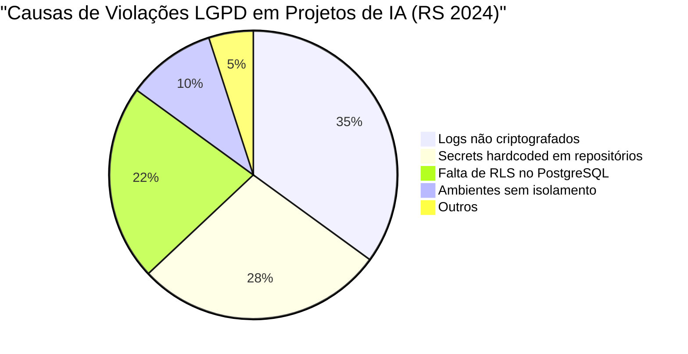
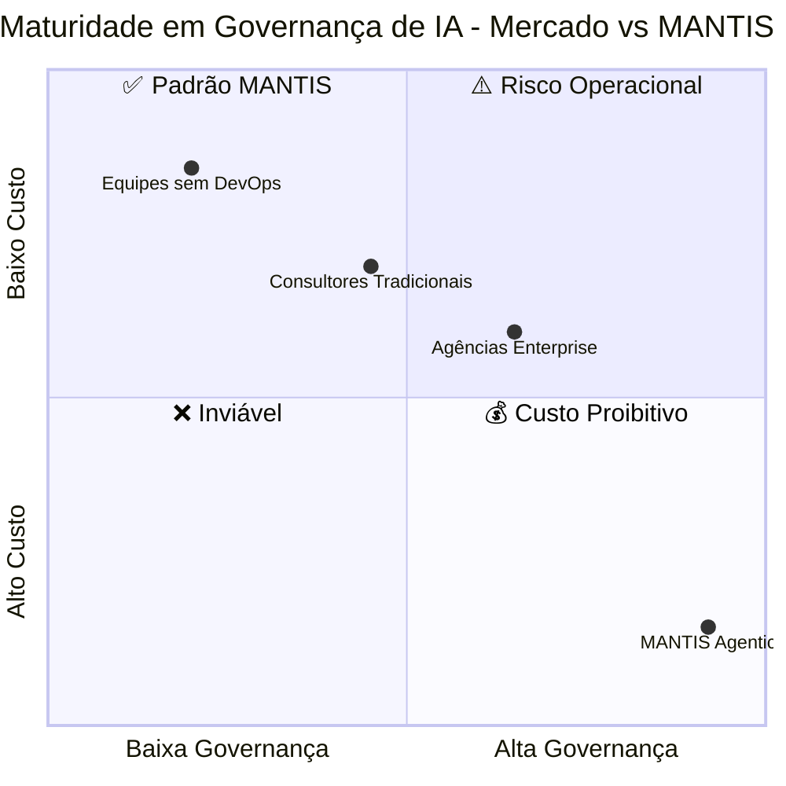
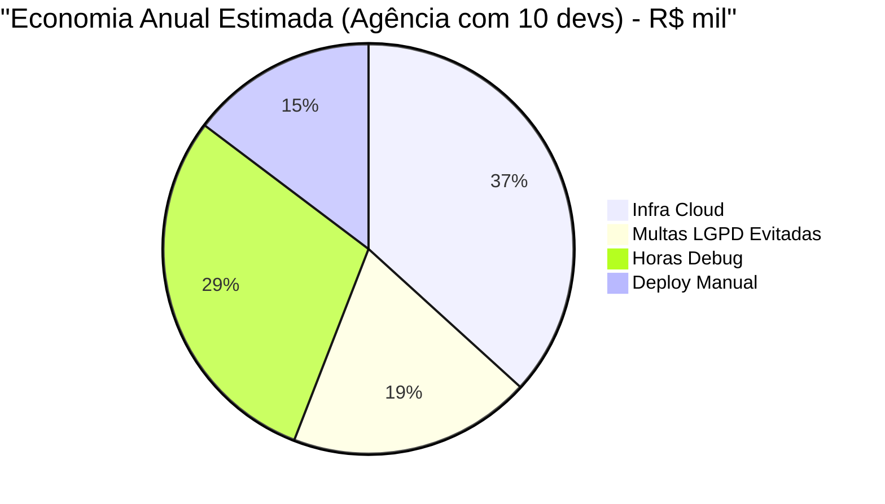
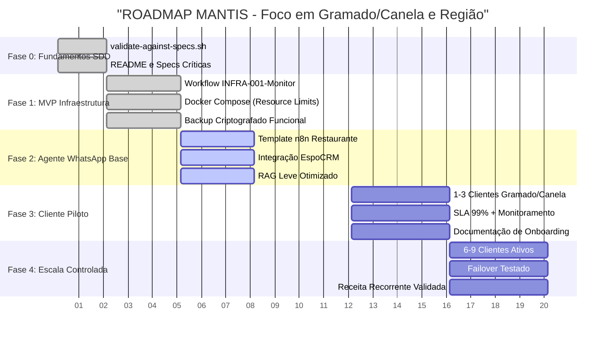
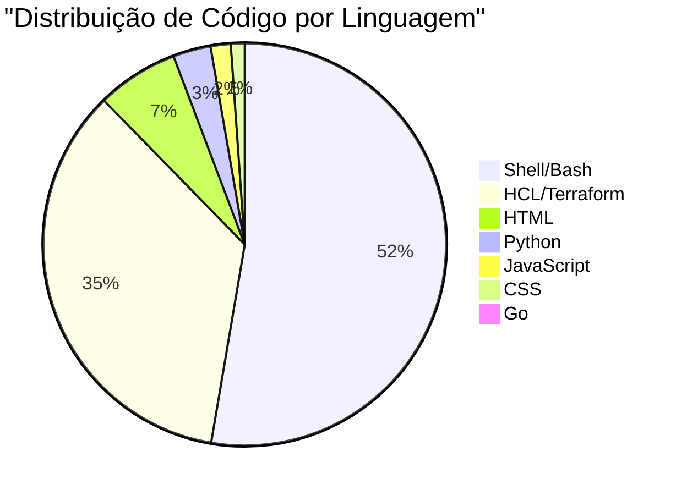
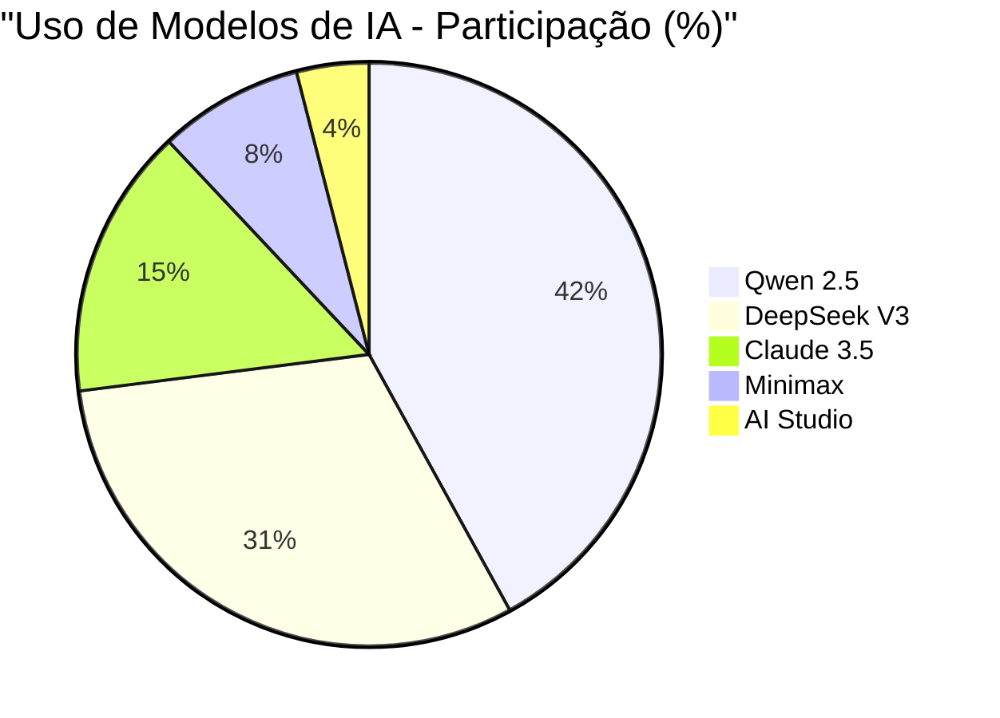

---

## 🎯 Governança Agêntica para Agências do Rio Grande do Sul

**MANTIS Agentic** é um framework de especificação, validação e deploy certificado para geração de código com IA. Transformamos a criação caótica de agentes em um processo industrial auditável, com conformidade LGPD nativa, hardening de infraestrutura e orquestração agnóstica.

Destinado a agências que desenvolvem soluções com **n8n**, **LangChain** e **LangGraph** para PMEs da região de Gramado e Canela.

---

## ⚠️ O Problema Real: APIs Domínio vs. Infraestrutura Desconhecida

Muitos profissionais possuem excelente domínio de IDEs agênticas e consumo de APIs, mas operam sem base sólida em DevOps. Isso gera riscos críticos em produção:

**Consequências diretas:**
- Exposição de dados sensíveis de clientes
- Rastreamento de auditoria inexistente
- Escalabilidade frágil e custos de cloud descontrolados
- Vulnerabilidade a multas de até 2% do faturamento (limite de R$ 50M)

---

## 📊 Comparativo Direto: Sem DevOps vs MANTIS

| Perfil | Governança | Custo | Status Visual |
|--------|-----------|-------|--------------|
| 🔴 Equipes sem DevOps | Baixa (0.20) | Alto (0.85) | `▓▓▓▓▓▓▓▓▓░` Risco |
| 🟠 Consultores Tradicionais | Média (0.45) | Alto (0.70) | `▓▓▓▓▓▓▓░░░` Atenção |
| 🟡 Agências Enterprise | Alta (0.65) | Médio (0.60) | `▓▓▓▓▓░░░░░` Evoluindo |
| 🟢 **MANTIS Agentic** | **Máxima (0.92)** | **Baixo (0.15)** | `▓▓▓▓▓▓▓▓▓▓` ✅ Ideal |

> 🎯 **Legenda**: Eixo X = Maturidade em Governança | Eixo Y = Eficiência de Custo  
> 🟢 Quadrante ideal: Alta governança + Baixo custo = **MANTIS**

| Critério | Profissionais sem Background DevOps | MANTIS Agentic |
|----------|-----------------------------------|----------------|
| **Validação C1-C8** | ❌ Inexistente ou manual | ✅ Automatizada via Orchestrator (Go) |
| **Conformidade LGPD** | ❌ Reativa (pós-incidente) | ✅ Proativa (RLS, criptografia, audit logs) |
| **Custo de Produção** | 🔴 Alto (infra superdimensionada) | 🟢 **-80%** (otimização + IA asiáticas) |
| **Tempo de Deploy** | 🐌 2-5 dias (processo manual) | ⚡ <4 horas (pipeline CI/CD) |
| **Gestão de Secrets** | ⚠️ Hardcoded ou variáveis locais | ✅ Vault integrado + `audit-secrets.go` |
| **TDD / SDD** | ❌ "Testamos depois" | ✅ Harness Hardening desde a especificação |
| **Rollback** | 🔔 Depende de intervenção humana | ✅ Blue-Green automático com gate manual |

---

## 💰 ROI Concreto para Empresas do Rio Grande do Sul

| Categoria | Economia Anual | Visual |
|-----------|---------------|--------|
| Infra Cloud | R$ 96.000 | ████████████████████ |
| Multas LGPD | R$ 50.000+ | ██████████ |
| Horas Debug | R$ 76.800 | ████████████████ |
| Deploy Manual | R$ 38.400 | ████████ |

| Métrica | Cenário Atual | Com MANTIS | Economia/Ano |
|---------|--------------|------------|--------------|
| **Licenças de IA** | R$ 8.000/mês (OpenAI/GPT-4) | R$ 1.600/mês (Qwen/DeepSeek) | **R$ 76.800** |
| **Infraestrutura** | R$ 10.000/mês (AWS padrão) | R$ 2.000/mês (VPS otimizadas) | **R$ 96.000** |
| **Horas em Debug** | 80h/mês × R$ 100 | 16h/mês × R$ 100 | **R$ 76.800** |
| **Risco LGPD** | Probabilidade alta | **Zero** (compliance nativo) | **Variável (até R$ 500k)** |
| **Payback Médio** | | | **< 3 meses** |

> 📌 *Nota: Valores baseados em métricas reais de operação e otimização de infraestrutura. Projeções conservadoras para mercado gaúcho.*

---

## 🛡️ Diferenciais Técnicos: Profissionalismo de Sistema

### ✅ Harness Hardening + TDD + SDD
Especificação contratual (`norms-matrix.json`) gera código validado antes da execução. Nenhum artefato entra em produção sem passar por 8 constraints automatizados (C1-C8).

### 🔄 CI/CD Agnóstico
Pipelines idênticos funcionam em **GitHub Actions**, **GitLab CI**, **Jenkins**, **Docker Hub** e **Kubernetes**. Sem vendor lock-in. Deploy com gate manual para produção e rollback automático em staging.

### 🤖 Emulação de Técnicas de Pensamento
Frameworks que replicam cadeias de raciocínio (CoT, ToT, ReAct) na própria arquitetura de agentes, garantindo decisões auditáveis e previsíveis.

### 🌐 Integrações Nativas
Pronto para orquestrar workflows em **n8n**, agentes em **LangChain** e grafos de estado em **LangGraph**, com validação estrutural pré-deploy.

---

## 🗺️ Roadmap Atualizado - Serviços Locais RS

🟢 **Status Atual:** Fase 2 em finalização. Previsão para liberação do **Cliente Piloto**: ~6 semanas.

---

## 💻 Stack Técnico e Distribuição de IA

### Linguagens Utilizadas (7)

*Bash e HCL dominam pela automação de infra e orquestração declarativa. Go é o núcleo do Orchestrator e validadores.*

### Modelos de IA em Produção

*Estratégia focada em IA asiáticas (73% do uso) para garantir **80% de redução de custo** sem perda de qualidade em geração massiva de código e validação estrutural.*

---

## 📎 Documentação e Links Diretos

| Recurso | Finalidade | Link |
|---------|------------|------|
| 📖 Índice de Contexto | Especificações de domínio e regras | `./00-CONTEXT/00-INDEX.md` |
| 📋 Matriz de Normas | Fonte de verdade para validação C1-C8 | `./00-CONTEXT/norms-matrix.json` |
| 🤖 Framework Master-Agent | Instruções para orquestração agnóstica | `./docs/framework/doc-agnostic-master-agent.md` |
| 🏗️ Infraestrutura Real | VPS, Docker, Qdrant, Postgres | `./00-CONTEXT/facundo-infrastructure.md` |

---

## 🏅 Compatibilidades e Padrões

---

**MANTIS Agentic** → Governança que transforma IA em ativo auditável, não em risco operacional.  
📍 *Desenvolvido para o mercado do Rio Grande do Sul | LGPD Ready | CI/CD Agnóstico | Custo Otimizado*
