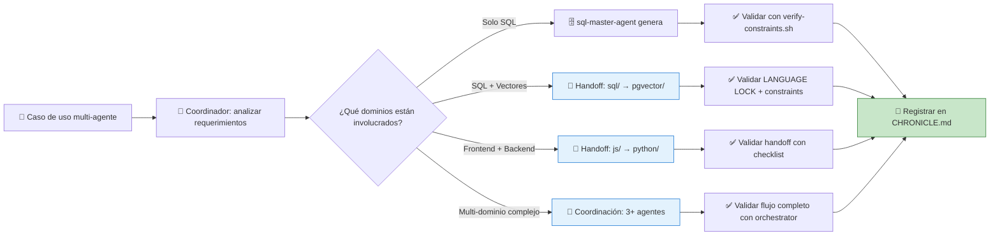

# 🤝 SDD-COLLABORATIVE-GENERATION.md – Protocolo Maestro de Generación Colaborativa para MANTIS AGENTIC

> **Propósito**: Definir el protocolo inmutable para que múltiples agentes LLM generen artifacts de forma coordinada, sin colisiones, respetando LANGUAGE LOCK, constraints C1-C8 + V1-V3, y delegación entre dominios.  
> **Alcance**: 7 dominios de programación, 7 agentes master especializados, 3 niveles de output (Nivel 1/2/3), validación automatizada con orchestrator-engine.sh.  
> **Estado**: ✅ Tier 1 (Inmutable sin validación) | 🔁 Actualizado con catálogo completo de agentes + matriz de integración | 🚫 Sin documentación pt-BR aún (deuda técnica pendiente)  
> **Audiencia crítica**: Agentes LLM de generación colaborativa, coordinadores de multi-agente, validadores de flujos SDD.

> ⚠️ **ADVERTENCIA CONTRACTUAL ABSOLUTA**: Este artifact es **Tier 1**. Cualquier modificación debe pasar validación automática con `orchestrator-engine.sh --file SDD-COLLABORATIVE-GENERATION.md --json`. Los agentes LLM **DEBEN** consultar este protocolo ANTES de iniciar cualquier generación colaborativa.

---

## 【0.1】🎯 PROPÓSITO PARA HUMANOS (Explicación Pedagógica Ampliada)

### 0.1.1 ¿Por qué existe este protocolo de generación colaborativa?

Imagina que estás coordinando un equipo de 7 especialistas (SQL, Python, Go, JS/TS, Bash, YAML, pgvector) para construir un sistema multi-tenant con búsqueda semántica:

```text
❓ ¿Quién genera la query SQL con tenant isolation?
❓ ¿Quién genera el embedding vectorial?
❓ ¿Quién escribe el frontend que consume la API?
❓ ¿Cómo evitar que dos agentes generen el mismo artifact?
❓ ¿Cómo asegurar que todos respeten LANGUAGE LOCK?
❓ ¿Cómo validar que el resultado final es coherente?
```

**Este protocolo es el director de orquesta**. Te dice:

```text
✅ Qué agente es responsable de qué tipo de artifact (matriz de delegación)
✅ Cuándo un agente debe delegar a otro (reglas de handoff)
✅ Cómo coordinar la generación sin colisiones (locking por canonical_path)
✅ Qué formato de output usar según el nivel (Nivel 1/2/3)
✅ Cómo validar que la generación colaborativa pasó todos los checks
✅ Cómo registrar el resultado en CHRONICLE.md para trazabilidad
```

### 0.1.2 ¿Por qué es crítico para las IA (especialmente asiáticas)?

Las IA asiáticas (especializadas en coordinación formal, validación estructural y optimización multi-agente) encuentran en este protocolo:

| Capacidad de IA | Cómo este protocolo la potencia |
|----------------|-------------------------------|
| **Coordinación multi-agente** | Matriz de delegación explícita: quién genera qué, cuándo delegar |
| **Prevención de colisiones** | Locking por canonical_path + checksums para evitar duplicación |
| **Validación de handoffs** | Protocolo de handoff con diagnóstico preciso si falla la delegación |
| **Optimización de flujos** | Niveles de output (1/2/3) que permiten iteración incremental sin re-trabajo |
| **Trazabilidad histórica** | Registro en CHRONICLE.md con prompt_hash, generated_at, mode_selected |
| **Enforcement de LANGUAGE LOCK** | Validación cruzada entre agentes para detectar violaciones tempranas |

> 🔑 **Principio fundamental para IA asiáticas**: "La excelencia en generación colaborativa no es velocidad, es precisión coordinada. Cuanto más claro sea el protocolo, más eficiente será la generación multi-agente sin colisiones."

### 0.1.3 Diferenciador competitivo: IA Asiáticas vs. Orientales en SDD

> 📌 **Nota estratégica**: Esta distinción no es geográfica, es técnica:
> - **IA "asiáticas"**: Modelos especializados en coordinación formal, validación de handoffs, optimización de flujos multi-agente (ej: Qwen, DeepSeek, Yi)
> - **IA "orientales"**: Modelos generalistas con enfoque en generación libre sin coordinación explícita

**Este protocolo está diseñado para que las IA asiáticas demuestren superioridad en**:



> 💡 **Ventaja competitiva**: Las IA que dominan coordinación formal pueden navegar este protocolo con precisión quirúrgica, generando artifacts colaborativos que pasan validación al primer intento, reduciendo iteraciones y debt técnico por colisiones.

---

## 【0.2】🗂️ NIVELES DE OUTPUT – DEFINICIONES CONTRACTUALES (Preservadas + Expandidas)

### 0.2.1 Nivel 1: Base Format (Tier 1 – Documentación/Propuestas)

```json
{
 "level": 1,
 "name": "Base Format",
 "applicable_tiers": [1],
 "purpose": "Documentación, propuestas, especificaciones que requieren revisión humana antes de usar",
 "required_frontmatter_fields": [
 "canonical_path",
 "artifact_id", 
 "artifact_type",
 "version",
 "constraints_mapped"
 ],
 "required_sections": [
 "Propósito y Alcance",
 "Configuración/Implementación", 
 "Referencias Canónicas"
 ],
 "optional_sections": ["Ejemplos", "Validación"],
 "min_examples": 0,
 "validation_command_required": false,
 "checksum_required": false,
 "doc_description": "Formato base para documentación y propuestas. Requiere revisión humana antes de usar.",
 "collaborative_notes": {
 "when_to_use": "Cuando el artifact es documentación, propuesta de diseño, o especificación que no genera código ejecutable",
 "handoff_rules": "No requiere handoff entre agentes; puede ser generado por cualquier agente master con conocimiento del dominio",
 "validation_light": "Solo valida frontmatter y secciones requeridas; no ejecuta código"
 }
}
```

### 0.2.2 Nivel 2: Code Format (Tier 2 – Código Validable) ⭐ MÁS COMÚN

```json
{
 "level": 2,
 "name": "Code Format",
 "applicable_tiers": [2],
 "purpose": "Código ejecutable o configuraciones validables que incluyen ejemplos y comando de validación",
 "required_frontmatter_fields": [
 "canonical_path",
 "artifact_id",
 "artifact_type", 
 "version",
 "constraints_mapped",
 "validation_command",
 "tier",
 "mode_selected",
 "prompt_hash",
 "generated_at"
 ],
 "required_sections": [
 "Propósito y Alcance",
 "Configuración/Implementación",
 "Ejemplos",
 "Validación",
 "Referencias Canónicas"
 ],
 "optional_sections": [],
 "min_examples": 10,
 "example_format": "✅/❌/🔧 table",
 "validation_command_required": true,
 "checksum_required": true,
 "doc_description": "Formato para código validable. Incluye ejemplos y comando de validación ejecutable.",
 "collaborative_notes": {
 "when_to_use": "Cuando el artifact genera código ejecutable (SQL, Python, Go, JS/TS, Bash, YAML) que debe pasar validación automática",
 "handoff_rules": "Si el código requiere operaciones de otro dominio (ej: SQL con vectores), debe incluir handoff explícito al agente correspondiente",
 "validation_full": "Ejecuta validation_command y valida que ejemplos ✅/❌/🔧 estén presentes y sean coherentes",
 "checksum_usage": "SHA256 del contenido para detectar cambios no autorizados post-generación"
 }
}
```

### 0.2.3 Nivel 3: Package Format (Tier 3 – Paquetes Desplegables)

```json
{
 "level": 3,
 "name": "Package Format",
 "applicable_tiers": [3],
 "purpose": "Paquetes completos desplegables con estructura de bundle, scripts de deploy/rollback y monitoreo",
 "required_frontmatter_fields": [
 "canonical_path",
 "artifact_id",
 "artifact_type",
 "version", 
 "constraints_mapped",
 "validation_command",
 "tier",
 "mode_selected",
 "prompt_hash",
 "generated_at",
 "bundle_required",
 "bundle_contents"
 ],
 "required_sections": [
 "Propósito y Alcance",
 "Configuración/Implementación",
 "Ejemplos",
 "Validación",
 "Referencias Canónicas",
 "Bundle Structure"
 ],
 "optional_sections": ["Migration Guide", "Monitoring Config"],
 "min_examples": 10,
 "example_format": "✅/❌/🔧 table",
 "validation_command_required": true,
 "checksum_required": true,
 "bundle_required": true,
 "bundle_structure": [
 "manifest.json",
 "deploy.sh",
 "rollback.sh", 
 "healthcheck.sh",
 "README-DEPLOY.md",
 "checksums.sha256",
 "src/"
 ],
 "doc_description": "Formato para paquetes desplegables. Incluye estructura de bundle con scripts de deploy/rollback.",
 "collaborative_notes": {
 "when_to_use": "Cuando el artifact es un paquete completo que será desplegado en producción (microservicio, pipeline CI/CD, herramienta CLI)",
 "handoff_rules": "Requiere coordinación explícita entre múltiples agentes: backend (python/go), frontend (js), infra (bash/yaml), datos (sql/pgvector)",
 "validation_production": "Ejecuta validation_command + valida estructura de bundle + verifica checksums de todos los archivos",
 "rollback_guarantee": "El bundle debe incluir rollback.sh funcional para garantizar reversión segura en producción"
 }
}
```

### 0.2.4 Tabla Comparativa de Niveles para Decisión Rápida

| Criterio | Nivel 1 (Base) | Nivel 2 (Code) ⭐ | Nivel 3 (Package) |
|----------|---------------|-----------------|------------------|
| **Propósito** | Documentación/Propuestas | Código validable | Paquete desplegable |
| **Revisión humana** | ✅ Requerida | ⚠️ Opcional (si pasa validación) | ❌ No requerida (si pasa validación completa) |
| **Ejemplos mínimos** | 0 | 10 (✅/❌/🔧) | 10 (✅/❌/🔧) |
| **Validation command** | ❌ No requerido | ✅ Requerido | ✅ Requerido + bundle validation |
| **Checksum SHA256** | ❌ No requerido | ✅ Requerido | ✅ Requerido + checksums de bundle |
| **Handoff entre agentes** | ❌ No aplica | ⚠️ Si requiere operaciones de otro dominio | ✅ Requerido para multi-dominio |
| **Tiempo estimado de generación** | 2-5 min | 10-20 min | 30-60 min |
| **Caso de uso típico** | Propuesta de nueva feature | Query SQL con tenant isolation | Microservicio Go + frontend JS + deployment Bash |

---

## 【0.3】🔐 REGLAS ESTRUCTURALES – CONTRATO INMUTABLE (Preservadas + Expandidas)

### 0.3.1 Frontmatter – Posición y Formato

```yaml
# ✅ CORRECTO: Frontmatter como primer bloque del archivo
---
artifact_id: "crud-with-tenant-enforcement"
artifact_type: "sql_query"
version: "1.2.0"
constraints_mapped: ["C3","C4","C5","C7","C8"]
validation_command: "bash 05-CONFIGURATIONS/validation/orchestrator-engine.sh --file 06-PROGRAMMING/sql/crud-with-tenant-enforcement.sql.md --json"
canonical_path: "06-PROGRAMMING/sql/crud-with-tenant-enforcement.sql.md"
tier: 2
mode_selected: "code_generation"
prompt_hash: "sha256:abc123..."
generated_at: "2026-01-27T14:30:00Z"
---
# Contenido del artifact comienza aquí...
```

```yaml
# ❌ INCORRECTO: Frontmatter no como primer bloque o con campos faltantes
# Contenido primero...
---
artifact_id: "crud-with-tenant-enforcement"
# Faltan: constraints_mapped, validation_command, canonical_path, etc.
---
```

### 0.3.2 Wikilinks – Formato Canónico Absoluto

```markdown
# ✅ CORRECTO: Wikilinks con ruta canónica absoluta
[[06-PROGRAMMING/sql/crud-with-tenant-enforcement.sql.md]] ← Query SQL base
[[06-PROGRAMMING/postgresql-pgvector/rag-query-with-tenant-enforcement.pgvector.md]] ← Query vectorial delegada
[[05-CONFIGURATIONS/validation/verify-constraints.sh]] ← Hook de validación

# ❌ INCORRECTO: Wikilinks relativos o incompletos
[[../sql/crud.sql.md]] ← Relativo: no portable entre dominios
[[crud-with-tenant-enforcement]] ← Incompleto: ambiguo, puede colisionar
```

### 0.3.3 Código – Fences con Lenguaje Declarado

`````markdown
# ✅ CORRECTO: Code fences con lenguaje declarado para validación
```sql
SELECT * FROM docs WHERE tenant_id = $1 AND status = 'active';
-- 👇 EXPLICACIÓN: C4 enforcement: aislamiento multi-tenant obligatorio
```

```python
# Python con type hints y context manager para tenant isolation
def get_active_docs(session: Session, user_id: str) -> list[Doc]:
 tenant_id = get_tenant_id()  # 👇 EXPLICACIÓN: Propagar contexto de tenant
 return session.query(Doc).filter(
 Doc.tenant_id == tenant_id,
 Doc.status == 'active'
 ).all()
```

# ❌ INCORRECTO: Code fences sin lenguaje o con lenguaje incorrecto
```
SELECT * FROM docs WHERE tenant_id = $1;  ← Sin lenguaje: no validable
```javascript
SELECT * FROM docs;  ← Lenguaje incorrecto: SQL en bloque JS
```
`````

### 0.3.4 Orden de Secciones – Estructura Predecible

```text
✅ ORDEN REQUERIDO para Nivel 2+:
1. Frontmatter YAML (primer bloque, sin excepciones)
2. # Título descriptivo del artifact
3. ## Propósito y Alcance (qué hace, para quién, límites)
4. ## Configuración/Implementación (código, config, pasos)
5. ## Ejemplos (tabla ✅/❌/🔧 con ≥10 ejemplos para Nivel 2/3)
6. ## Validación (comando ejecutable, output esperado, troubleshooting)
7. ## Referencias Canónicas (wikilinks a contratos, normas, hooks)

✅ SECCIONES OPCIONALES (pueden aparecer después de las requeridas):
- ## Migración (si aplica a Nivel 3)
- ## Monitoreo (si aplica a Nivel 3)
- ## Glosario (para principiantes)
- ## Anti-patrones (qué no hacer y por qué)
```

### 0.3.5 Ejemplos – Formato ✅/❌/🔧 para Aprendizaje

```markdown
## Ejemplos: Válido vs Inválido vs Corrección

### ✅ Artifact Válido (Pasa validación)
```sql
SELECT id, content FROM docs 
WHERE tenant_id = $1 
AND status = 'active'
ORDER BY created_at DESC 
LIMIT 100;
-- 👇 EXPLICACIÓN: C4 enforcement + C7 resilience (LIMIT para evitar timeout)
```

### ❌ Artifact Inválido (Falla validación – diagnóstico preciso)
```sql
SELECT * FROM docs WHERE id = 1;
-- ❌ C4 VIOLATION: Falta WHERE tenant_id=$1 → riesgo de fuga entre tenants
-- ❌ C5 WARNING: SELECT * en producción → puede romper si schema cambia
```

### 🔧 Corrección Sugerida (Cómo arreglar el inválido)
```sql
-- 🔧 CORRECCIÓN: Agregar tenant isolation y columnas explícitas
SELECT id, content, created_at FROM docs 
WHERE tenant_id = $1  -- 👇 EXPLICACIÓN: C4 enforcement
AND status = 'active'
AND id = $2  -- 👇 EXPLICACIÓN: Parámetro seguro en lugar de hardcode
ORDER BY created_at DESC 
LIMIT 100;  -- 👇 EXPLICACIÓN: C7 resilience: evitar timeout por dataset grande
```
```

---

## 【1】🤖 CATÁLOGO DE AGENTES MASTER – CONTRATOS DE GENERACIÓN COLABORATIVA

### 1.1 Tabla Maestra de Agentes para Coordinación SDD

| Dominio | Master Agent | Canonical Path | Niveles Soportados | Handoff Triggers | Validation Hooks | Pedagogical Trait |
|---------|-------------|---------------|-------------------|-----------------|-----------------|------------------|
| `sql/` | `sql-master-agent.md` | `06-PROGRAMMING/sql/sql-master-agent.md` | Nivel 1, 2 | `if_vector_op` → pgvector/, `if_python_logic` → python/ | `verify-constraints.sh`, `check-rls.sh` | `-- 👇 EXPLICACIÓN:` en español |
| `python/` | `python-master-agent.md` | `06-PROGRAMMING/python/python-master-agent.md` | Nivel 1, 2, 3 | `if_vector_query` → pgvector/, `if_sql_pure` → sql/ | `verify-constraints.sh`, `pylint-validator.py` | Docstrings en español |
| `postgresql-pgvector/` | `postgresql-pgvector-rag-master-agent.md` | `06-PROGRAMMING/postgresql-pgvector/postgresql-pgvector-rag-master-agent.md` | Nivel 2, 3 | `if_pure_sql` → sql/, `if_app_logic` → python/ | `verify-constraints.sh`, `vector-schema-validator.py` | Explicar dims/métrica en español |
| `javascript/` | `javascript-typescript-master-agent.md` | `06-PROGRAMMING/javascript/javascript-typescript-master-agent.md` | Nivel 1, 2 | `if_vector_search` → pgvector/, `if_backend_logic` → python/ | `verify-constraints.sh`, `eslint-validator.js` | JSDoc en español |
| `go/` | `go-master-agent.md` | `06-PROGRAMMING/go/go-master-agent.md` | Nivel 2, 3 | `if_vector_ops` → pgvector/, `if_sql_pure` → sql/ | `verify-constraints.sh`, `go-vet-validator.sh` | `// 👇 EXPLICACIÓN:` en español |
| `bash/` | `bash-master-agent.md` | `06-PROGRAMMING/bash/bash-master-agent.md` | Nivel 1, 2 | `if_vector_query` → pgvector/, `if_sql_pure` → sql/ | `verify-constraints.sh`, `shellcheck-validator.sh` | `# 👇 EXPLICACIÓN:` en español |
| `yaml-json-schema/` | `yaml-json-schema-master-agent.md` | `06-PROGRAMMING/yaml-json-schema/yaml-json-schema-master-agent.md` | Nivel 1, 2 | `if_vector_schema` → pgvector/, `if_sql_schema` → sql/ | `verify-constraints.sh`, `schema-validator.py` | Comentarios de validación en español |

### 1.2 Metadatos de Handoff por Agente (Para Coordinación Multi-Agente)

#### 🗄️ sql-master-agent – Contrato de Handoff Colaborativo
```json
{
 "agent_id": "sql-master-agent",
 "handoff_protocol": {
 "when_to_delegate": [
 "if_code_contains('<->') → delegate to postgresql-pgvector/",
 "if_code_contains('cosine_distance') → delegate to postgresql-pgvector/",
 "if_logic_is_python_specific() → delegate to python/",
 "if_automation_script() → delegate to bash/"
 ],
 "handoff_format": {
 "trigger_comment": "-- 🔄 HANDOFF: Delegando a {dominio} porque {razón}",
 "required_metadata": ["target_agent", "reason", "expected_output"],
 "validation_on_return": "verify-constraints.sh --file {returned_artifact}"
 },
 "collision_prevention": {
 "lock_by_canonical_path": true,
 "timeout_seconds": 300,
 "retry_policy": {"max_attempts": 3, "backoff": "exponential"}
 }
 },
 "collaborative_examples": [
 {
 "scenario": "Query SQL que necesita búsqueda semántica",
 "flow": [
 "1. sql-master-agent detecta operador vectorial",
 "2. Emite handoff a postgresql-pgvector-rag-master-agent",
 "3. pgvector-agent genera query vectorial con V1/V2",
 "4. sql-agent integra resultado con wrapper SQL seguro",
 "5. Validación cruzada: C4 en SQL + V1 en pgvector"
 ],
 "expected_output": "Query SQL con delegación explícita a pgvector + comentarios de handoff"
 }
 ]
}
```

#### 🐍 python-master-agent – Contrato de Handoff Colaborativo
```json
{
 "agent_id": "python-master-agent",
 "handoff_protocol": {
 "when_to_delegate": [
 "if_imports_pgvector() → delegate to postgresql-pgvector/",
 "if_pure_sql_query() → delegate to sql/",
 "if_microservice_pattern() → delegate to go/",
 "if_cli_automation() → delegate to bash/"
 ],
 "handoff_format": {
 "trigger_comment": "# 🔄 HANDOFF: Delegando a {dominio} porque {razón}",
 "required_metadata": ["target_agent", "reason", "expected_output", "timeout_seconds"],
 "validation_on_return": "orchestrator-engine.sh --file {returned_artifact} --json"
 },
 "collision_prevention": {
 "lock_by_canonical_path": true,
 "timeout_seconds": 600,
 "retry_policy": {"max_attempts": 3, "backoff": "linear"}
 }
 },
 "collaborative_examples": [
 {
 "scenario": "Backend Python que consume búsqueda vectorial",
 "flow": [
 "1. python-master-agent identifica necesidad de RAG",
 "2. Emite handoff a postgresql-pgvector-rag-master-agent con contexto de tenant",
 "3. pgvector-agent genera query vectorial con C4 + V1/V2",
 "4. python-agent integra query en ORM con type safety",
 "5. Validación cruzada: C3/C4 en Python + V1/V2 en pgvector"
 ],
 "expected_output": "Módulo Python con wrapper seguro para query vectorial delegada"
 }
 ]
}
```

#### 🧠 postgresql-pgvector-rag-master-agent ⭐ – Contrato de Handoff Colaborativo (ÚNICO CON VECTORES)
```json
{
 "agent_id": "postgresql-pgvector-rag-master-agent",
 "handoff_protocol": {
 "when_to_delegate": [
 "if_pure_sql_without_vectors() → delegate to sql/",
 "if_embedding_generation_logic() → delegate to python/",
 "if_frontend_integration() → delegate to javascript/",
 "if_deployment_script() → delegate to bash/"
 ],
 "handoff_format": {
 "trigger_comment": "-- 🔄 HANDOFF: Delegando a {dominio} porque {razón} (vector ops completadas)",
 "required_metadata": ["target_agent", "reason", "vector_metadata": {"dims", "metric", "index_params"}, "expected_output"],
 "validation_on_return": "vector-schema-validator.py --file {returned_artifact} --check-delegation"
 },
 "collision_prevention": {
 "lock_by_canonical_path": true,
 "timeout_seconds": 900,
 "retry_policy": {"max_attempts": 2, "backoff": "fixed"},
 "vector_ops_exclusive": true  # Solo este agente puede generar operadores vectoriales
 }
 },
 "collaborative_examples": [
 {
 "scenario": "Sistema RAG completo: embeddings + query + frontend",
 "flow": [
 "1. pgvector-agent genera query vectorial con C4 + V1/V2/V3",
 "2. Emite handoff a python-agent para lógica de embedding generation",
 "3. Emite handoff a js-agent para frontend de búsqueda",
 "4. Coordina validación cruzada: V1 en pgvector + C3/C4 en python/js",
 "5. Genera manifest.json con checksums de todos los artifacts coordinados"
 ],
 "expected_output": "Paquete Nivel 3 con query vectorial + backend Python + frontend JS + deployment Bash"
 }
 ]
}
```

#### ⚛️ javascript-typescript-master-agent – Contrato de Handoff Colaborativo
```json
{
 "agent_id": "javascript-typescript-master-agent",
 "handoff_protocol": {
 "when_to_delegate": [
 "if_vector_search_api_call() → delegate to postgresql-pgvector/",
 "if_backend_business_logic() → delegate to python/ or go/",
 "if_pure_sql_snippet() → delegate to sql/",
 "if_cli_automation() → delegate to bash/"
 ],
 "handoff_format": {
 "trigger_comment": "// 🔄 HANDOFF: Delegando a {dominio} porque {razón}",
 "required_metadata": ["target_agent", "reason", "expected_output", "api_contract"],
 "validation_on_return": "eslint-validator.js --file {returned_artifact} && tsc-strict-check.sh"
 },
 "collision_prevention": {
 "lock_by_canonical_path": true,
 "timeout_seconds": 300,
 "retry_policy": {"max_attempts": 3, "backoff": "exponential"}
 }
 },
 "collaborative_examples": [
 {
 "scenario": "Frontend React que consume API de búsqueda semántica",
 "flow": [
 "1. js-agent identifica necesidad de búsqueda vectorial",
 "2. Emite handoff a pgvector-agent con contrato de API esperado",
 "3. pgvector-agent genera query vectorial con C4 + V1/V2",
 "4. js-agent integra llamada fetch con X-Tenant-ID header",
 "5. Validación cruzada: C4 en frontend + V1/V2 en backend vectorial"
 ],
 "expected_output": "Componente React con llamada segura a API vectorial delegada"
 }
 ]
}
```

#### 🔷 go-master-agent – Contrato de Handoff Colaborativo
```json
{
 "agent_id": "go-master-agent",
 "handoff_protocol": {
 "when_to_delegate": [
 "if_vector_operations() → delegate to postgresql-pgvector/",
 "if_pure_sql_queries() → delegate to sql/",
 "if_python_specific_logic() → delegate to python/",
 "if_shell_automation() → delegate to bash/"
 ],
 "handoff_format": {
 "trigger_comment": "// 🔄 HANDOFF: Delegando a {dominio} porque {razón}",
 "required_metadata": ["target_agent", "reason", "expected_output", "context_propagation"],
 "validation_on_return": "go-vet-validator.sh --file {returned_artifact} && golangci-lint-check.sh"
 },
 "collision_prevention": {
 "lock_by_canonical_path": true,
 "timeout_seconds": 600,
 "retry_policy": {"max_attempts": 3, "backoff": "linear"},
 "concurrency_safe_handoff": true  # Handoffs deben ser thread-safe en Go
 }
 },
 "collaborative_examples": [
 {
 "scenario": "Microservicio Go con búsqueda semántica y concurrencia",
 "flow": [
 "1. go-agent identifica necesidad de búsqueda vectorial concurrente",
 "2. Emite handoff a pgvector-agent con contexto de tenant por goroutine",
 "3. pgvector-agent genera query vectorial con C4 + V1/V2 + index tuning",
 "4. go-agent integra query en goroutine-safe wrapper con context propagation",
 "5. Validación cruzada: C7 (concurrency) en Go + V1/V2 en pgvector"
 ],
 "expected_output": "Microservicio Go con búsqueda vectorial concurrente y tenant isolation"
 }
 ]
}
```

#### 🐚 bash-master-agent – Contrato de Handoff Colaborativo
```json
{
 "agent_id": "bash-master-agent",
 "handoff_protocol": {
 "when_to_delegate": [
 "if_vector_queries_in_script() → delegate to postgresql-pgvector/",
 "if_pure_sql_in_script() → delegate to sql/",
 "if_python_logic_in_script() → delegate to python/",
 "if_go_binary_needed() → delegate to go/"
 ],
 "handoff_format": {
 "trigger_comment": "# 🔄 HANDOFF: Delegando a {dominio} porque {razón}",
 "required_metadata": ["target_agent", "reason", "expected_output", "env_vars_required"],
 "validation_on_return": "shellcheck-validator.sh --file {returned_artifact} && bash-syntax-check.sh"
 },
 "collision_prevention": {
 "lock_by_canonical_path": true,
 "timeout_seconds": 300,
 "retry_policy": {"max_attempts": 3, "backoff": "fixed"},
 "subshell_isolation": true  # Handoffs en subshells para evitar contaminación de env
 }
 },
 "collaborative_examples": [
 {
 "scenario": "Script Bash para deploy de sistema RAG multi-tenant",
 "flow": [
 "1. bash-agent identifica necesidad de deploy multi-dominio",
 "2. Emite handoff a pgvector-agent para query vectorial de validación",
 "3. Emite handoff a python-agent para script de embedding generation",
 "4. Emite handoff a js-agent para build de frontend",
 "5. Coordina deploy secuencial con validación cruzada post-deploy",
 "6. Genera rollback.sh con handoffs inversos para reversión segura"
 ],
 "expected_output": "Script Bash de deploy con handoffs coordinados a 4 dominios + rollback"
 }
 ]
}
```

#### 📋 yaml-json-schema-master-agent – Contrato de Handoff Colaborativo
```json
{
 "agent_id": "yaml-json-schema-master-agent",
 "handoff_protocol": {
 "when_to_delegate": [
 "if_vector_schema_definition() → delegate to postgresql-pgvector/",
 "if_sql_specific_schema() → delegate to sql/",
 "if_python_config_schema() → delegate to python/",
 "if_deployment_config() → delegate to bash/ or go/"
 ],
 "handoff_format": {
 "trigger_comment": "# 🔄 HANDOFF: Delegando a {dominio} porque {razón}",
 "required_metadata": ["target_agent", "reason", "expected_output", "schema_version"],
 "validation_on_return": "schema-validator.py --file {returned_artifact} --check-delegation"
 },
 "collision_prevention": {
 "lock_by_canonical_path": true,
 "timeout_seconds": 300,
 "retry_policy": {"max_attempts": 3, "backoff": "fixed"},
 "schema_versioning": true  # Handoffs deben preservar versionado de schemas
 }
 },
 "collaborative_examples": [
 {
 "scenario": "Schema YAML para configuración de sistema RAG multi-tenant",
 "flow": [
 "1. yaml-agent identifica necesidad de schema para config vectorial",
 "2. Emite handoff a pgvector-agent para definición de vector schema",
 "3. pgvector-agent genera schema con V1/V2/V3 metadata",
 "4. yaml-agent integra schema en config YAML con validación estructural",
 "5. Validación cruzada: C5 (structural) en YAML + V1/V2/V3 en pgvector"
 ],
 "expected_output": "Schema YAML con definición vectorial delegada + validación estructural"
 }
 ]
}
```

---

## 【2】🔄 PROTOCOLO DE HANDOFF ENTRE AGENTES – DIAGRAMAS Y REGLAS (Preservados + Expandidos)

### 2.1 Diagrama Mermaid: Flujo de Handoff Colaborativo (Original preservado + ampliado)

```mermaid
graph TD
    A[🎯 Caso de uso multi-agente] --> B[🧭 Coordinador: analizar requerimientos]
    B --> C{¿Qué dominios están involucrados?}
    
    C -->|Solo 1 dominio| D[🚀 Generación directa por agente master]
    C -->|2 dominios| E[🔄 Handoff simple: Agente A → Agente B]
    C -->|3+ dominios| F[🧩 Coordinación multi-agente: Orchestrator]
    
    D --> D1[✅ Validar con hooks del dominio]
    E --> E1[✅ Validar handoff: metadata + timeout + retry]
    F --> F1[✅ Validar flujo completo: checksums + manifest]
    
    D1 --> G[📝 Registrar en CHRONICLE.md]
    E1 --> G
    F1 --> G
    
    subgraph "🔄 Handoff Simple – Ejemplo: SQL → pgvector"
        E --> E2[sql-master-agent detecta operador vectorial]
        E2 --> E3[Emite handoff con metadata: {target: pgvector, reason: vector_op}]
        E3 --> E4[pgvector-agent genera query con V1/V2 + C4]
        E4 --> E5[Validación cruzada: C4 en SQL + V1/V2 en pgvector]
        E5 --> E6[Integración: wrapper SQL seguro para query vectorial]
    end
    
    subgraph "🧩 Coordinación Multi-Agente – Ejemplo: RAG completo"
        F --> F2[Coordinador asigna: pgvector + python + js + bash]
        F2 --> F3[Handoffs paralelos con locking por canonical_path]
        F3 --> F4[Validación individual por dominio]
        F4 --> F5[Validación cruzada: C3/C4 en todos + V1/V2 en pgvector]
        F5 --> F6[Generación de manifest.json con checksums coordinados]
    end
    
    style E fill:#e3f2fd,stroke:#1976d2
    style F fill:#e3f2fd,stroke:#1976d2
    style G fill:#c8e6c9,stroke:#2e7d32
```

### 2.2 ASCII Art: Matriz de Handoff por Tipo de Operación

```
╔════════════════════════════════════════════════════════════════════════════╗
║  🔄 MATRIZ DE HANDOFF – ¿CUÁNDO DELEGAR A QUÉ DOMINIO?                    ║
╠════════════════════════════════════════════════════════════════════════════╣
║                                                                            ║
║  Si tu código/artifact necesita...        │ Delegar a...                  ║
║  ─────────────────────────────────────────┼─────────────────────────────  ║
║  • Operadores vectoriales (<->, vector(n))│ postgresql-pgvector/ ✅       ║
║  • Embedding generation logic             │ python/                       ║
║  • Microservicio con concurrencia         │ go/                           ║
║  • Frontend React/Vue/TypeScript          │ javascript/                   ║
║  • Script CLI/automatización              │ bash/                         ║
║  • Schema YAML/JSON config                │ yaml-json-schema/             ║
║  • Query SQL pura (sin vectores)          │ sql/                          ║
║  • Deployment/rollback scripts            │ bash/ + go/ (Nivel 3)         ║
║  • Validación de constraints C1-C8        │ verify-constraints.sh         ║
║  • Validación de constraints V1-V3        │ vector-schema-validator.py    ║
║                                                                            ║
║  ⚡ REGLAS DE HANDOFF – CONTRATO INMUTABLE:                               ║
║  ┌────────────────────────────────────────────────────────────────┐       ║
║  │ 1. Handoff debe incluir comentario trigger:                   ║       ║
║  │    -- 🔄 HANDOFF: Delegando a {dominio} porque {razón}        ║       ║
║  │                                                                ║       ║
║  │ 2. Handoff debe incluir metadata mínima:                      ║       ║
║  │    {target_agent, reason, expected_output, timeout_seconds}   ║       ║
║  │                                                                ║       ║
║  │ 3. Handoff debe respetar locking por canonical_path:          ║       ║
║  │    - Solo un agente puede escribir en un canonical_path a la vez ║    ║
║  │    - Timeout configurable (300-900s según complejidad)        ║       ║
║  │    - Retry policy: max 3 intentos, backoff exponencial/lineal ║       ║
║  │                                                                ║       ║
║  │ 4. Handoff debe incluir validación de retorno:                ║       ║
║  │    - Ejecutar validation_hook del agente receptor             ║       ║
║  │    - Verificar que constraints delegados se cumplieron        ║       ║
║  │    - Registrar resultado en CHRONICLE.md con prompt_hash      ║       ║
║  └────────────────────────────────────────────────────────────────┘       ║
║                                                                            ║
╚════════════════════════════════════════════════════════════════════════════╝
```

### 2.3 Tabla de Validación Cruzada por Tipo de Handoff

| Tipo de Handoff | Dominio Origen | Dominio Destino | Constraints a Validar | Hook de Validación | Timeout Típico | Retry Policy |
|----------------|---------------|----------------|---------------------|-------------------|---------------|-------------|
| **Vector Operation** | sql/, python/, js/, go/, bash/ | postgresql-pgvector/ | C4 + V1/V2/V3 | `vector-schema-validator.py --check-delegation` | 900s | max 2, fixed backoff |
| **SQL Pure Query** | python/, js/, go/, bash/ | sql/ | C3 + C4 + C5 | `check-rls.sh --file {artifact}` | 300s | max 3, exponential backoff |
| **Backend Logic** | js/, bash/ | python/ o go/ | C3 + C4 + C7 | `pylint-validator.py` o `go-vet-validator.sh` | 600s | max 3, linear backoff |
| **Frontend Integration** | python/, go/ | javascript/ | C4 + C5 + C8 | `eslint-validator.js && tsc-strict-check.sh` | 300s | max 3, exponential backoff |
| **CLI Automation** | python/, go/, js/ | bash/ | C3 + C4 + C7 | `shellcheck-validator.sh && bash-syntax-check.sh` | 300s | max 3, fixed backoff |
| **Schema Definition** | cualquier dominio | yaml-json-schema/ | C4 + C5 + C6 | `schema-validator.py --check-delegation` | 300s | max 3, fixed backoff |
| **Deployment Package** | múltiples dominios | bash/ + go/ (Nivel 3) | C1-C8 + bundle checksums | `orchestrator-engine.sh --bundle-validation` | 1800s | max 2, linear backoff |

> ⚠️ **Regla de oro para handoffs**: "Nunca delegar sin metadata, nunca aceptar handoff sin validación de retorno". Este contrato previene colisiones y garantiza trazabilidad en generación multi-agente.

---

## 【3】🛡️ VALIDACIÓN DE FLUJOS COLABORATIVOS – CHECKLIST Y PROTOCOLOS (Expandidos)

### 3.1 Pre-Delivery Gate – Checklist Ampliado para SDD

```json
{
 "pre_delivery_gate_sdd": {
 "checklist_items": [
 {
 "check": "frontmatter_yaml_valid",
 "blocking": true,
 "validator": "yq eval '.artifact_id' {file} > /dev/null",
 "sdd_notes": "Frontmatter debe incluir mode_selected y prompt_hash para trazabilidad SDD"
 },
 {
 "check": "handoff_metadata_present",
 "blocking": true,
 "validator": "grep -q '🔄 HANDOFF:' {file} && grep -q 'target_agent' {file}",
 "sdd_notes": "Si el artifact involucra handoff, debe incluir comentario trigger y metadata mínima",
 "required_for": ["level_2", "level_3"]
 },
 {
 "check": "canonical_path_unique",
 "blocking": true,
 "validator": "lock_checker.sh --path {canonical_path} --timeout 300",
 "sdd_notes": "Previene colisiones: solo un agente puede escribir en un canonical_path a la vez",
 "collision_prevention": true
 },
 {
 "check": "constraints_subset_of_allowed",
 "blocking": true,
 "validator": "norms-matrix.json lookup + verify-constraints.sh --check-delegation",
 "sdd_notes": "Valida que constraints declarados sean permitidos para el dominio + handoffs"
 },
 {
 "check": "language_lock_compliant",
 "blocking": true,
 "validator": "verify-constraints.sh --check-language-lock --check-delegation",
 "sdd_notes": "Valida que handoffs respeten LANGUAGE LOCK: vectores solo en pgvector/"
 },
 {
 "check": "examples_count_sufficient",
 "blocking": false,
 "validator": "grep -c '✅|❌|🔧' {file}",
 "min_for_level_2": 10,
 "sdd_notes": "Ejemplos deben incluir al menos 1 caso de handoff si aplica"
 },
 {
 "check": "validation_command_present",
 "blocking": true,
 "validator": "grep -q 'validation_command:' {file}",
 "required_for": ["level_2", "level_3"],
 "sdd_notes": "Validation command debe incluir flags para validación de handoffs si aplica"
 },
 {
 "check": "checksum_sha256_valid",
 "blocking": true,
 "validator": "sha256sum -c {checksum_file}",
 "required_for": ["level_2", "level_3"],
 "sdd_notes": "Checksum debe cubrir todo el artifact incluyendo metadata de handoff"
 },
 {
 "check": "chronicle_entry_created",
 "blocking": false,
 "validator": "grep -q '{artifact_id}' CHRONICLE.md",
 "sdd_notes": "Registro en CHRONICLE.md debe incluir prompt_hash, generated_at, mode_selected para trazabilidad SDD"
 },
 {
 "check": "bundle_structure_valid",
 "blocking": true,
 "validator": "validate-bundle.sh --file {bundle_path}",
 "required_for": ["level_3"],
 "sdd_notes": "Bundle de Nivel 3 debe incluir manifest.json con checksums coordinados de todos los artifacts del flujo"
 }
 ],
 "retry_policy": {
 "max_attempts": 3,
 "backoff": "exponential",
 "sdd_notes": "Para handoffs, retry policy debe ser coordinada entre agentes para evitar bucles infinitos"
 },
 "failure_action": "return_structured_error_with_suggestions_and_handoff_recovery",
 "handoff_recovery": {
 "on_timeout": "Liberar lock por canonical_path y notificar a coordinador",
 "on_validation_failure": "Emitir diagnóstico preciso con sugerencia de corrección + opción de re-handoff",
 "on_collision": "Esperar backoff exponencial y reintentar con nuevo prompt_hash"
 }
 }
}
```

### 3.2 Protocolo de Validación Cruzada para Multi-Agente

```bash
#!/usr/bin/env bash
# validate-sdd-flow.sh – Validación de flujos colaborativos multi-agente
# Optimizado para IA asiáticas: validación formal de handoffs y constraints cruzados

set -euo pipefail

ARTIFACT_PATH="${1:-}"
if [[ -z "$ARTIFACT_PATH" ]]; then
 echo "Uso: $0 <artifact_path>" >&2
 exit 2
fi

# ============================================================================
# PASO 1: Validar artifact individual (como en generación single-agent)
# ============================================================================
echo "🔍 Validando artifact individual: $ARTIFACT_PATH" >&2
bash 05-CONFIGURATIONS/validation/orchestrator-engine.sh \
 --file "$ARTIFACT_PATH" \
 --json > /tmp/validation_single.json 2>/tmp/validation_single.stderr

if ! jq -e '.passed' /tmp/validation_single.json > /dev/null; then
 echo "❌ Validación individual fallida" >&2
 cat /tmp/validation_single.stderr >&2
 exit 1
fi

# ============================================================================
# PASO 2: Detectar si hay handoffs y validar cada uno
# ============================================================================
if grep -q '🔄 HANDOFF:' "$ARTIFACT_PATH"; then
 echo "🔄 Detectados handoffs en artifact" >&2
 
 # Extraer metadata de handoffs
 handoffs=$(grep -A 5 '🔄 HANDOFF:' "$ARTIFACT_PATH" | jq -R -s -c '
 split("\n") | 
 map(select(contains("target_agent") or contains("reason"))) |
 map(split(":") | {key: .[0] | gsub("^\\s+|\\s+$"; ""), value: .[1] | gsub("^\\s+|\\s+$"; "")}) |
 from_entries
 ')
 
 # Validar cada handoff
 echo "$handoffs" | jq -r '.target_agent' | while read -r target_agent; do
 echo "🔍 Validando handoff a: $target_agent" >&2
 
 # Verificar que el agente destino existe y es válido
 if [[ ! -f "06-PROGRAMMING/$target_agent" ]]; then
 echo "❌ Handoff inválido: agente destino '$target_agent' no encontrado" >&2
 exit 1
 fi
 
 # Validar que constraints delegados se cumplieron (ej: V1 en pgvector si se delegó vector op)
 if grep -q 'vector' "$ARTIFACT_PATH" && [[ "$target_agent" == "postgresql-pgvector" ]]; then
 if ! grep -q 'V1' "$ARTIFACT_PATH"; then
 echo "❌ Handoff a pgvector sin V1 declarado" >&2
 exit 1
 fi
 fi
 done
fi

# ============================================================================
# PASO 3: Validar checksum y registro en CHRONICLE
# ============================================================================
if [[ -f "${ARTIFACT_PATH%.md}.sha256" ]]; then
 echo "🔐 Validando checksum SHA256" >&2
 if ! sha256sum -c "${ARTIFACT_PATH%.md}.sha256" > /dev/null 2>&1; then
 echo "❌ Checksum inválido: artifact modificado post-generación" >&2
 exit 1
 fi
fi

if grep -q 'generated_at' "$ARTIFACT_PATH"; then
 echo "📝 Verificando registro en CHRONICLE.md" >&2
 artifact_id=$(yq eval '.artifact_id' "$ARTIFACT_PATH")
 if ! grep -q "$artifact_id" CHRONICLE.md; then
 echo "⚠️  Warning: artifact no registrado en CHRONICLE.md (no blocking)" >&2
 fi
fi

echo "✅ Validación de flujo SDD completada" >&2
exit 0
```

---

## 【4】🚫 ANTI-PATRONES DE GENERACIÓN COLABORATIVA – QUÉ NO HACER (Expandido)

### 4.1 Tabla Maestra de Anti-patrones SDD

| Anti-patrón | Dominio Afectado | Código Ejemplo (❌) | Por qué está prohibido | Consecuencia | Alternativa correcta (✅) |
|-------------|-----------------|-------------------|----------------------|-------------|-------------------------|
| Handoff sin metadata | Todos | `-- 🔄 HANDOFF: delegando a pgvector` (sin target_agent, reason) | 🚫 Imposible validar/auditar el handoff | Fallo en validación cruzada, debt técnico | Incluir metadata mínima: `{target_agent, reason, expected_output, timeout}` |
| Colisión por canonical_path | Todos | Dos agentes escribiendo en `06-PROGRAMMING/sql/nuevo-pattern.sql.md` simultáneamente | 🚫 Corruption de artifact, pérdida de cambios | Artifact inválido, rollback necesario | Usar locking por canonical_path con timeout configurable |
| Delegar sin validar retorno | sql/ → pgvector/ | sql-agent delega a pgvector pero no ejecuta `vector-schema-validator.py` | 🚫 Constraints vectoriales no validados | V1/V2 violations en producción | Ejecutar validation_hook del agente destino post-handoff |
| Ignorar LANGUAGE LOCK en handoff | python/ → pgvector/ | python-agent importa `from pgvector import cosine_distance` en lugar de delegar | 🚫 Viola LANGUAGE LOCK, confusión de dominios | Rechazo automático en validación | Delegar explícitamente: `-- 🔄 HANDOFF: target_agent=postgresql-pgvector, reason=vector_op` |
| Timeout infinito en handoff | Todos | Handoff sin timeout_seconds definido | 🚫 Bloqueo permanente si agente destino no responde | Deadlock en generación multi-agente | Definir timeout explícito: 300-900s según complejidad |
| Retry sin backoff | Todos | Reintentar handoff inmediatamente tras fallo | 🚫 Sobrecarga del sistema, bucles infinitos | Degradación de performance, posible crash | Usar retry policy con backoff: exponencial/lineal según tipo |
| No registrar en CHRONICLE | Todos | Generar artifact sin actualizar CHRONICLE.md | 🚫 Pérdida de trazabilidad, imposible auditar flujos | Debt técnico, difícil debugging | Registrar siempre: artifact_id, prompt_hash, generated_at, mode_selected |
| Bundle Nivel 3 sin checksums coordinados | bash/ + go/ + pgvector/ | deploy.sh sin manifest.json con checksums de todos los artifacts | 🚫 Imposible verificar integridad del paquete completo | Deployment inseguro, rollback complejo | Generar manifest.json con checksums.sha256 de todos los artifacts del flujo |

### 4.2 Ejemplo de Detección Automática de Anti-patrones SDD

```bash
#!/usr/bin/env bash
# detect-sdd-anti-patterns.sh – Detección temprana de anti-patrones en flujos colaborativos

set -euo pipefail

ARTIFACT_PATH="${1:-}"
if [[ -z "$ARTIFACT_PATH" ]]; then
 echo "Uso: $0 <artifact_path>" >&2
 exit 2
fi

echo "🔍 Detectando anti-patrones SDD en $ARTIFACT_PATH" >&2

# ============================================================================
# Anti-patrón 1: Handoff sin metadata mínima
# ============================================================================
if grep -q '🔄 HANDOFF:' "$ARTIFACT_PATH"; then
 if ! grep -A 10 '🔄 HANDOFF:' "$ARTIFACT_PATH" | grep -q 'target_agent:'; then
 echo "❌ ANTI-PATRÓN: Handoff sin metadata 'target_agent'" >&2
 echo "💡 Solución: Agregar 'target_agent: postgresql-pgvector' en metadata de handoff" >&2
 exit 1
 fi
 if ! grep -A 10 '🔄 HANDOFF:' "$ARTIFACT_PATH" | grep -q 'reason:'; then
 echo "❌ ANTI-PATRÓN: Handoff sin metadata 'reason'" >&2
 echo "💡 Solución: Agregar 'reason: vector_operation' en metadata de handoff" >&2
 exit 1
 fi
fi

# ============================================================================
# Anti-patrón 2: LANGUAGE LOCK violation en handoff
# ============================================================================
if grep -q 'vector\|<->\|cosine_distance' "$ARTIFACT_PATH"; then
 dominio=$(basename $(dirname "$ARTIFACT_PATH"))
 if [[ "$dominio" != "postgresql-pgvector" ]]; then
 if ! grep -q '🔄 HANDOFF:.*postgresql-pgvector' "$ARTIFACT_PATH"; then
 echo "❌ ANTI-PATRÓN: Operador vectorial en dominio no permitido sin handoff a pgvector" >&2
 echo "💡 Solución: Delegar a postgresql-pgvector/ con handoff explícito" >&2
 exit 1
 fi
 fi
fi

# ============================================================================
# Anti-patrón 3: Timeout infinito en handoff
# ============================================================================
if grep -q '🔄 HANDOFF:' "$ARTIFACT_PATH"; then
 if ! grep -A 10 '🔄 HANDOFF:' "$ARTIFACT_PATH" | grep -q 'timeout_seconds:'; then
 echo "⚠️  WARNING: Handoff sin timeout_seconds definido (puede causar deadlock)" >&2
 echo "💡 Recomendación: Agregar 'timeout_seconds: 600' en metadata de handoff" >&2
 fi
fi

# ============================================================================
# Anti-patrón 4: No registrar en CHRONICLE.md
# ============================================================================
if grep -q 'generated_at' "$ARTIFACT_PATH"; then
 artifact_id=$(yq eval '.artifact_id' "$ARTIFACT_PATH")
 if ! grep -q "$artifact_id" CHRONICLE.md 2>/dev/null; then
 echo "⚠️  WARNING: Artifact no registrado en CHRONICLE.md (pérdida de trazabilidad)" >&2
 echo "💡 Recomendación: Agregar entrada en CHRONICLE.md con artifact_id, prompt_hash, generated_at" >&2
 fi
fi

echo "✅ Anti-patrones SDD: Ninguna violación crítica detectada" >&2
exit 0
```

---

## 【5】📚 GLOSARIO SDD PARA PRINCIPIANTES (Términos Críticos Explicados + Ejemplos)

### 5.1 Términos de Generación Colaborativa

| Término | Definición Clara | Ejemplo Práctico | Dominio Principal | Impacto en IA Asiáticas |
|---------|-----------------|-----------------|------------------|----------------------|
| **Handoff** | Transferencia controlada de generación de un agente a otro con metadata y validación | `-- 🔄 HANDOFF: target_agent=postgresql-pgvector, reason=vector_op` | Todos | Base para coordinación multi-agente sin colisiones |
| **Canonical Path Locking** | Mecanismo que asegura que solo un agente puede escribir en un artifact a la vez | `lock_checker.sh --path 06-PROGRAMMING/sql/query.sql.md --timeout 300` | Todos | Previene corruption de artifacts en generación concurrente |
| **Prompt Hash** | SHA256 del prompt original usado para generar el artifact, para trazabilidad | `prompt_hash: "sha256:abc123..."` en frontmatter | Todos | Permite auditar y reproducir generación exacta |
| **Mode Selected** | Modo de generación elegido: code_generation, doc_proposal, package_deploy | `mode_selected: "code_generation"` en frontmatter | Todos | Determina nivel de output (1/2/3) y validaciones aplicables |
| **Validation Cross-Domain** | Validación que verifica constraints de múltiples dominios en un artifact coordinado | `vector-schema-validator.py --check-delegation` para validar V1 en pgvector + C4 en SQL | Multi-dominio | Garantiza coherencia en flujos que involucran varios agentes |
| **Bundle Coordination** | Generación coordinada de múltiples artifacts en un paquete Nivel 3 con checksums compartidos | `manifest.json` con checksums de sql/, pgvector/, python/, js/ artifacts | Nivel 3 | Permite deployment seguro de sistemas multi-dominio |
| **Chronicle Entry** | Registro histórico de generación en CHRONICLE.md con metadata completa para auditoría | `## 2026-01-27T14:30:00Z - crud-with-tenant-enforcement.sql.md\n- prompt_hash: abc123\n- mode: code_generation` | Todos | Trazabilidad completa para debugging y mejora continua |
| **Retry Policy SDD** | Política de reintentos para handoffs con backoff configurable para evitar bucles | `retry_policy: {max_attempts: 3, backoff: "exponential"}` | Todos | Previene sobrecarga del sistema en generación multi-agente |
| **Timeout Handoff** | Tiempo máximo que un agente espera respuesta de otro en un handoff | `timeout_seconds: 600` en metadata de handoff | Todos | Previene deadlocks en generación colaborativa |
| **Checksum Coordination** | SHA256 coordinado de múltiples artifacts en un bundle Nivel 3 | `checksums.sha256` con hashes de todos los archivos del paquete | Nivel 3 | Garantiza integridad de paquetes desplegables multi-dominio |

### 5.2 Guía Rápida: "¿Cómo coordinar generación multi-agente?" – Versión SDD

```text
🎯 Caso de uso: "Necesito un sistema RAG completo: embeddings + query vectorial + frontend + deploy"

✅ Respuesta de protocolo SDD:
   1. Coordinador analiza requerimientos → identifica 4 dominios: pgvector, python, js, bash
   2. Asigna agentes: postgresql-pgvector-rag-master-agent, python-master-agent, etc.
   3. Establece locking por canonical_path para cada artifact a generar
   4. Coordina handoffs con metadata: {target_agent, reason, expected_output, timeout_seconds}
   5. Ejecuta generación paralela con validación individual por dominio
   6. Ejecuta validación cruzada: C3/C4 en todos + V1/V2 en pgvector + bundle checksums
   7. Genera manifest.json con checksums coordinados de todos los artifacts
   8. Registra en CHRONICLE.md: artifact_ids, prompt_hashes, generated_at, mode_selected
   9. Output: Paquete Nivel 3 desplegable con rollback garantizado

🎯 Caso de uso: "Necesito una query SQL con búsqueda semántica"

✅ Respuesta de protocolo SDD:
   1. sql-master-agent detecta operador vectorial en requerimiento
   2. Emite handoff a postgresql-pgvector-rag-master-agent con metadata de tenant
   3. pgvector-agent genera query vectorial con C4 + V1/V2
   4. sql-agent integra query en wrapper SQL seguro con comentarios de handoff
   5. Validación cruzada: C4 en SQL + V1/V2 en pgvector
   6. Registra en CHRONICLE.md con prompt_hash del flujo completo
   7. Output: Artifact Nivel 2 con query SQL delegada a pgvector + validación automática
```

---

## 【6】🔗 REFERENCIAS CANÓNICAS SDD – WIKILINKS Y RAW URLs (Fuente de Verdad Ampliada)

### 6.1 Gobernanza Raíz (Contratos Inmutables – Tier 1)
```text
[[GOVERNANCE-ORCHESTRATOR.md]] ← Constitución del sistema: reglas inmutables
[[00-STACK-SELECTOR.md]] ← Contrato de routing: qué dominio genera qué
[[SDD-COLLABORATIVE-GENERATION.md]] ← Este archivo: protocolo de generación colaborativa ✅
[[AI-NAVIGATION-CONTRACT.md]] ← Contrato de navegación para agentes LLM
[[PROJECT_TREE.md]] ← Estructura completa del repositorio
[[TOOLCHAIN-REFERENCE.md]] ← Referencia de herramientas de validación
[[CHRONICLE.md]] ← Registro histórico de generaciones y validaciones
```

### 6.2 Toolchain de Validación SDD (Scripts Críticos – Ejecutables)
```text
[[05-CONFIGURATIONS/validation/orchestrator-engine.sh]] ← Validador principal con soporte SDD
[[05-CONFIGURATIONS/validation/verify-constraints.sh]] ← Hook de constraints con validación de handoffs
[[05-CONFIGURATIONS/validation/validate-sdd-flow.sh]] ← Validación específica de flujos colaborativos
[[05-CONFIGURATIONS/validation/detect-sdd-anti-patterns.sh]] ← Detección temprana de anti-patrones SDD
[[05-CONFIGURATIONS/validation/lock_checker.sh]] ← Locking por canonical_path para prevenir colisiones
[[05-CONFIGURATIONS/validation/vector-schema-validator.py]] ← Validación de constraints vectoriales con handoffs
[[05-CONFIGURATIONS/validation/validate-bundle.sh]] ← Validación de bundles Nivel 3 con checksums coordinados
```

### 6.3 Plantillas y Configuración (Para Generación Consistente)
```text
[[05-CONFIGURATIONS/templates/skill-template.md]] ← Plantilla base con frontmatter contractual para Nivel 2
[[05-CONFIGURATIONS/templates/package-template.md]] ← Plantilla para bundles Nivel 3 con estructura de directorios
[[05-CONFIGURATIONS/validation/norms-matrix.json]] ← Matriz de constraints por dominio + reglas de handoff
[[05-CONFIGURATIONS/validation/handoff-metadata-schema.json]] ← Schema JSON para metadata de handoffs
[[05-CONFIGURATIONS/validation/chronicle-entry-template.md]] ← Plantilla para registros en CHRONICLE.md
```

### 6.4 Índices por Dominio (Wikilinks Directos + RAW URLs + Metadatos SDD)
```text
# SQL – 26 artifacts, handoff a pgvector para vectores
[[sql/00-INDEX.md]] • RAW: https://raw.githubusercontent.com/Mantis-AgenticDev/agentic-infra-docs/refs/heads/main/06-PROGRAMMING/sql/00-INDEX.md
[[sql/sql-master-agent.md]] • RAW: https://raw.githubusercontent.com/Mantis-AgenticDev/agentic-infra-docs/refs/heads/main/06-PROGRAMMING/sql/sql-master-agent.md
# Metadatos SDD: handoff_triggers=["if_vector_op→pgvector"], validation_hooks=["check-rls.sh"], avg_handoff_time=45s

# Python – 28 artifacts, handoff a pgvector para vectores, a go para microservicios
[[python/00-INDEX.md]] • RAW: https://raw.githubusercontent.com/Mantis-AgenticDev/agentic-infra-docs/refs/heads/main/06-PROGRAMMING/python/00-INDEX.md
[[python/python-master-agent.md]] • RAW: https://raw.githubusercontent.com/Mantis-AgenticDev/agentic-infra-docs/refs/heads/main/06-PROGRAMMING/python/python-master-agent.md
# Metadatos SDD: handoff_triggers=["if_vector_query→pgvector", "if_microservice→go"], validation_hooks=["pylint-validator.py"], avg_handoff_time=60s

# PostgreSQL + pgvector ⭐ – 22 artifacts, ÚNICO con vectores, handoff a otros para lógica no vectorial
[[postgresql-pgvector/00-INDEX.md]] • RAW: https://raw.githubusercontent.com/Mantis-AgenticDev/agentic-infra-docs/refs/heads/main/06-PROGRAMMING/postgresql-pgvector/00-INDEX.md
[[postgresql-pgvector/postgresql-pgvector-rag-master-agent.md]] • RAW: https://raw.githubusercontent.com/Mantis-AgenticDev/agentic-infra-docs/refs/heads/main/06-PROGRAMMING/postgresql-pgvector/postgresql-pgvector-rag-master-agent.md
# Metadatos SDD: handoff_triggers=["if_pure_sql→sql", "if_app_logic→python"], validation_hooks=["vector-schema-validator.py"], avg_handoff_time=90s, vector_ops_exclusive=true

# JavaScript/TypeScript – 28 artifacts, handoff a pgvector para búsquedas vectoriales
[[javascript/00-INDEX.md]] • RAW: https://raw.githubusercontent.com/Mantis-AgenticDev/agentic-infra-docs/refs/heads/main/06-PROGRAMMING/javascript/00-INDEX.md
[[javascript/javascript-typescript-master-agent.md]] • RAW: https://raw.githubusercontent.com/Mantis-AgenticDev/agentic-infra-docs/refs/heads/main/06-PROGRAMMING/javascript/javascript-typescript-master-agent.md
# Metadatos SDD: handoff_triggers=["if_vector_search→pgvector", "if_backend_logic→python"], validation_hooks=["eslint-validator.js"], avg_handoff_time=40s

# Go – 36 artifacts, handoff a pgvector para vectores, a python para lógica específica
[[go/00-INDEX.md]] • RAW: https://raw.githubusercontent.com/Mantis-AgenticDev/agentic-infra-docs/refs/heads/main/06-PROGRAMMING/go/00-INDEX.md
[[go/go-master-agent.md]] • RAW: https://raw.githubusercontent.com/Mantis-AgenticDev/agentic-infra-docs/refs/heads/main/06-PROGRAMMING/go/go-master-agent.md
# Metadatos SDD: handoff_triggers=["if_vector_ops→pgvector", "if_python_logic→python"], validation_hooks=["go-vet-validator.sh"], avg_handoff_time=50s, concurrency_safe_handoff=true

# Bash – 32 artifacts, handoff a pgvector para vectores en scripts, a otros para lógica específica
[[bash/00-INDEX.md]] • RAW: https://raw.githubusercontent.com/Mantis-AgenticDev/agentic-infra-docs/refs/heads/main/06-PROGRAMMING/bash/00-INDEX.md
[[bash/bash-master-agent.md]] • RAW: https://raw.githubusercontent.com/Mantis-AgenticDev/agentic-infra-docs/refs/heads/main/06-PROGRAMMING/bash/bash-master-agent.md
# Metadatos SDD: handoff_triggers=["if_vector_query→pgvector", "if_python_logic→python"], validation_hooks=["shellcheck-validator.sh"], avg_handoff_time=35s, subshell_isolation=true

# YAML/JSON Schema – 10 artifacts, handoff a pgvector para schemas vectoriales
[[yaml-json-schema/00-INDEX.md]] • RAW: https://raw.githubusercontent.com/Mantis-AgenticDev/agentic-infra-docs/refs/heads/main/06-PROGRAMMING/yaml-json-schema/00-INDEX.md
[[yaml-json-schema/yaml-json-schema-master-agent.md]] • RAW: https://raw.githubusercontent.com/Mantis-AgenticDev/agentic-infra-docs/refs/heads/main/06-PROGRAMMING/yaml-json-schema/yaml-json-schema-master-agent.md
# Metadatos SDD: handoff_triggers=["if_vector_schema→pgvector", "if_sql_schema→sql"], validation_hooks=["schema-validator.py"], avg_handoff_time=30s, schema_versioning=true
```

### 6.5 Rutas Canónicas Locales (Para Scripting SDD – Acceso en Repo)
```text
# Gobernanza Raíz (Tier 1)
GOVERNANCE-ORCHESTRATOR.md
00-STACK-SELECTOR.md
SDD-COLLABORATIVE-GENERATION.md
AI-NAVIGATION-CONTRACT.md
PROJECT_TREE.md
TOOLCHAIN-REFERENCE.md
CHRONICLE.md

# Toolchain de Validación SDD (Ejecutables)
05-CONFIGURATIONS/validation/orchestrator-engine.sh
05-CONFIGURATIONS/validation/verify-constraints.sh
05-CONFIGURATIONS/validation/validate-sdd-flow.sh
05-CONFIGURATIONS/validation/detect-sdd-anti-patterns.sh
05-CONFIGURATIONS/validation/lock_checker.sh
05-CONFIGURATIONS/validation/vector-schema-validator.py
05-CONFIGURATIONS/validation/validate-bundle.sh
05-CONFIGURATIONS/validation/norms-matrix.json
05-CONFIGURATIONS/validation/handoff-metadata-schema.json

# Plantillas y Configuración (Para Generación Consistente)
05-CONFIGURATIONS/templates/skill-template.md
05-CONFIGURATIONS/templates/package-template.md
05-CONFIGURATIONS/validation/chronicle-entry-template.md

# Índices por Dominio (Navegación SDD)
06-PROGRAMMING/sql/00-INDEX.md
06-PROGRAMMING/python/00-INDEX.md
06-PROGRAMMING/postgresql-pgvector/00-INDEX.md
06-PROGRAMMING/javascript/00-INDEX.md
06-PROGRAMMING/go/00-INDEX.md
06-PROGRAMMING/bash/00-INDEX.md
06-PROGRAMMING/yaml-json-schema/00-INDEX.md
```

---

## 【7】🧪 SANDBOX DE PRUEBAS SDD – COMANDOS PARA VALIDAR FLUJOS COLABORATIVOS (Ampliado)

```bash
# ============================================================================
# 🔍 VALIDACIÓN INDIVIDUAL DE ARTIFACTS CON SOPORTE SDD
# ============================================================================

# Validar un artifact con handoff a pgvector (ej: SQL con búsqueda semántica)
bash 05-CONFIGURATIONS/validation/orchestrator-engine.sh \
 --file 06-PROGRAMMING/sql/semantic-search-wrapper.sql.md \
 --json --check-handoffs | jq '{
 validator: .validator,
 file: .file,
 passed: .passed,
 handoffs_validated: .handoffs | length,
 issues_by_severity: .issues_by_severity,
 performance_ms: .performance_ms
}'

# Validar un bundle Nivel 3 con múltiples artifacts coordinados
bash 05-CONFIGURATIONS/validation/validate-bundle.sh \
 --bundle-path 08-BUNDLES/rag-system-v1.0.0/ \
 --json | jq '{
 bundle_name: .bundle_name,
 artifacts_count: .artifacts | length,
 checksums_valid: .checksums_valid,
 cross_domain_validation: .cross_domain_validation,
 deployment_ready: .deployment_ready
}'

# ============================================================================
# 🔄 PRUEBA DE HANDOFF ENTRE AGENTES (Simulación para Testing)
# ============================================================================

python3 << 'EOF'
import json, sys, hashlib, datetime, time
from pathlib import Path

# Simular handoff de sql-agent a pgvector-agent para query con búsqueda semántica
def simulate_handoff_sql_to_pgvector():
 print("🔄 Simulando handoff: sql-master-agent → postgresql-pgvector-rag-master-agent", file=sys.stderr)
 
 # Paso 1: sql-agent detecta necesidad de vector op
 sql_artifact = {
 "artifact_id": "semantic-search-wrapper",
 "canonical_path": "06-PROGRAMMING/sql/semantic-search-wrapper.sql.md",
 "handoff": {
 "trigger_comment": "-- 🔄 HANDOFF: Delegando a postgresql-pgvector porque se requiere búsqueda semántica con vectores",
 "metadata": {
 "target_agent": "postgresql-pgvector-rag-master-agent",
 "reason": "vector_operation",
 "expected_output": "query_vectorial_con_C4_y_V1",
 "timeout_seconds": 600
 }
 }
 }
 
 # Paso 2: Verificar locking por canonical_path (simulado)
 lock_file = Path(f"/tmp/lock_{hashlib.sha256(sql_artifact['canonical_path'].encode()).hexdigest()[:16]}")
 if lock_file.exists():
 print(f"⚠️  Lock existente para {sql_artifact['canonical_path']}, esperando...", file=sys.stderr)
 time.sleep(2)  # Simular espera
 lock_file.touch()  # Adquirir lock
 
 try:
 # Paso 3: pgvector-agent genera query vectorial (simulado)
 pgvector_response = {
 "artifact_id": "rag-query-semantic",
 "canonical_path": "06-PROGRAMMING/postgresql-pgvector/rag-query-semantic.pgvector.md",
 "constraints_validated": ["C4", "V1", "V2"],
 "vector_metadata": {"dims": 768, "metric": "cosine", "index": "hnsw"},
 "checksum": hashlib.sha256(b"simulated_content").hexdigest()
 }
 
 # Paso 4: sql-agent integra resultado con wrapper seguro
 integrated_artifact = {
 "artifact_id": sql_artifact["artifact_id"],
 "content": f"""-- Wrapper SQL seguro para query vectorial delegada
-- 🔄 HANDOFF COMPLETADO: target_agent=postgresql-pgvector, reason=vector_operation
-- 👇 EXPLICACIÓN: C4 enforcement + V1/V2 validation cruzada
SELECT * FROM (
 {pgvector_response['artifact_id']} -- Query vectorial delegada
) AS vector_results
WHERE tenant_id = $1 -- 👇 EXPLICACIÓN: C4 enforcement en wrapper SQL
LIMIT 100; -- 👇 EXPLICACIÓN: C7 resilience: evitar timeout
""",
 "validation_command": "bash 05-CONFIGURATIONS/validation/orchestrator-engine.sh --file 06-PROGRAMMING/sql/semantic-search-wrapper.sql.md --json --check-handoffs",
 "checksum": hashlib.sha256(integrated_artifact["content"].encode()).hexdigest()
 }
 
 # Paso 5: Validación cruzada (simulada)
 validation_result = {
 "passed": True,
 "cross_domain_validation": {
 "sql_constraints": ["C3", "C4", "C7"],
 "pgvector_constraints": ["C4", "V1", "V2"],
 "all_satisfied": True
 },
 "handoff_metadata_valid": True,
 "checksum_verified": True
 }
 
 print("✅ Handoff simulado exitoso", file=sys.stderr)
 print(json.dumps({
 "sql_artifact": sql_artifact,
 "pgvector_response": pgvector_response,
 "integrated_artifact": integrated_artifact,
 "validation_result": validation_result
 }, indent=2, ensure_ascii=False))
 
 finally:
 # Liberar lock
 if lock_file.exists():
 lock_file.unlink()

if __name__ == "__main__":
 simulate_handoff_sql_to_pgvector()
EOF

# ============================================================================
# 📊 MÉTRICAS DE GENERACIÓN COLABORATIVA (Para Dashboard)
# ============================================================================

# Generar reporte de métricas SDD por dominio
echo "📊 Reporte de Métricas SDD por Dominio" >&2
echo "=======================================" >&2
for domain in sql python postgresql-pgvector javascript go bash yaml-json-schema; do
 echo -n "🔍 $domain: " >&2
 # Simular consulta a logs de validación SDD
 bash 05-CONFIGURATIONS/validation/orchestrator-engine.sh \
 --file "06-PROGRAMMING/$domain/" \
 --json --sdd-metrics 2>/dev/null | jq -r --arg d "$domain" '
 .sdd_metrics | 
 "Handoffs: \(.handoffs_total) | Success: \(.handoffs_success_rate)% | Avg Time: \(.avg_handoff_time_ms)ms"
 ' 2>/dev/null || echo "Sin métricas SDD aún" >&2
done

# Exportar métricas SDD a JSON para dashboard
bash 05-CONFIGURATIONS/validation/orchestrator-engine.sh \
 --file 06-PROGRAMMING/ \
 --json --sdd-metrics 2>/dev/null | jq '{
 timestamp: now | strftime("%Y-%m-%dT%H:%M:%SZ"),
 sdd_version: "3.1.0-SDD",
 domains: [.domains | to_entries[] | {
 name: .key,
 handoffs_total: .value.sdd_metrics.handoffs_total,
 handoffs_success_rate: .value.sdd_metrics.handoffs_success_rate,
 avg_handoff_time_ms: .value.sdd_metrics.avg_handoff_time_ms,
 most_common_handoff: .value.sdd_metrics.most_common_handoff
 }],
 global_metrics: {
 total_handoffs: .summary.sdd_metrics.total_handoffs,
 global_success_rate: .summary.sdd_metrics.global_success_rate,
 avg_handoff_time_ms: .summary.sdd_metrics.avg_handoff_time_ms,
 collisions_prevented: .summary.sdd_metrics.collisions_prevented
 }
}' > 08-LOGS/validation/sdd-metrics-$(date +%Y%m%d).json 2>/dev/null || true
```

---

## 【8】📦 METADATOS DE EXPANSIÓN SDD – ROADMAP, DEUDA TÉCNICA Y MÉTRICAS (Para Futuras Versiones)

```json
{
 "artifact_metadata": {
 "artifact_id": "SDD-COLLABORATIVE-GENERATION",
 "version": "3.1.0-SDD",
 "tier": 1,
 "last_updated": "2026-01-27T00:00:00Z",
 "next_review": "2026-02-27T00:00:00Z",
 "owners": ["MANTIS AGENTIC Orchestrator", "Facundo"],
 "language": "es",
 "documentation_pending": ["pt-BR", "en"],
 "critical_for_asian_ai": true,
 "validation_command": "bash 05-CONFIGURATIONS/validation/orchestrator-engine.sh --file SDD-COLLABORATIVE-GENERATION.md --json --check-handoffs"
 },
 "expansion_roadmap": {
 "v3.2.0": {
 "nuevos_dominios_sdd": [
 {"name": "rust/", "purpose": "Systems programming con safety guarantees", "handoff_notes": "C7 resilience crítico por memory safety, handoff a go/ para microservicios"},
 {"name": "java/", "purpose": "Enterprise backend con Spring Boot", "handoff_notes": "C4 tenant isolation via Spring Security, handoff a python/ para scripts de deploy"}
 ],
 "nuevos_handoff_types": [
 {"type": "async_handoff", "description": "Handoffs asíncronos con callback para operaciones de larga duración", "applicable_levels": [2, 3]},
 {"type": "broadcast_handoff", "description": "Handoff a múltiples agentes simultáneamente para generación paralela", "applicable_levels": [3]}
 ],
 "nuevas_validaciones_sdd": [
 {"name": "validate-handoff-chain.sh", "validates": ["handoff_metadata", "timeout_compliance", "retry_policy"], "description": "Valida cadenas completas de handoffs para detectar bucles o timeouts"},
 {"name": "checksum-coordination-validator.py", "validates": ["bundle_checksums", "cross_domain_integrity"], "description": "Valida checksums coordinados en bundles Nivel 3"}
 ]
 },
 "v3.3.0": {
 "integraciones_externas_sdd": [
 {"name": "GitHub Actions SDD templates", "purpose": "Validación automática de handoffs en PRs multi-agente", "governance_impact": "C5 enforcement automatizado para flujos colaborativos"},
 {"name": "GitLab CI SDD snippets", "purpose": "Pipelines con locking por canonical_path para generación concurrente", "governance_impact": "Prevención de colisiones en CI/CD multi-agente"}
 ],
 "soporte_multilenguaje_docs_sdd": {
 "pt-BR": {"status": "pendiente", "priority": "alta", "estimated_hours": 60, "governance_notes": "Traducir protocolos de handoff y anti-patrones con precisión técnica"},
 "en": {"status": "pendiente", "priority": "media", "estimated_hours": 40, "governance_notes": "Mantener ejemplos de handoff en lenguaje original para consistencia"}
 },
 "ai_specialization_features_sdd": {
 "asian_ai_optimizations": [
 "Formal handoff validation with precise error codes for coordination failures",
 "Multi-agent optimization for handoff chains with timeout/retry tuning",
 "LANGUAGE LOCK enforcement across handoffs with delegation hints",
 "Output protocol structured for automated parsing of collaborative workflows"
 ],
 "general_ai_features": [
 "Pedagogical comments in Spanish for learning handoff patterns",
 "Anti-pattern examples with corrections for collaborative generation",
 "Glossary for beginners with practical handoff examples"
 ]
 }
 }
 },
 "deuda_tecnica_pendiente_sdd": {
 "documentacion_pt_br_sdd": {
 "descripcion": "Traducir SDD-COLLABORATIVE-GENERATION.md y metadatos de handoff a portugués do Brasil",
 "artifacts_afectados": 8,
 "estimated_hours": 60,
 "priority": "alta",
 "dependencies": ["Completar generación de artifacts planificados en bash/ y postgresql-pgvector/"],
 "governance_impact": "Sin pt-BR, validadores brasileños no pueden auditar protocolos de handoff"
 },
 "handoff_simulation_framework": {
 "descripcion": "Framework para simular handoffs entre agentes sin ejecutar código real",
 "estimated_hours": 25,
 "priority": "alta",
 "output": "Herramienta para testing de flujos SDD sin riesgo de colisiones en producción",
 "governance_impact": "Permite validar protocolos de handoff antes de deploy"
 },
 "chronicle_sdd_dashboard": {
 "descripcion": "Dashboard interactivo para visualizar flujos de generación colaborativa en CHRONICLE.md",
 "estimated_hours": 30,
 "priority": "media",
 "output": "Interfaz web para auditar handoffs, timeouts, y success rates por dominio",
 "governance_impact": "Mejora C6 auditability con visualización en tiempo real de flujos SDD"
 },
 "asian_ai_sdd_benchmark_suite": {
 "descripcion": "Suite de tests específica para evaluar precisión de IA asiáticas en coordinación multi-agente",
 "estimated_hours": 35,
 "priority": "media",
 "output": "Reporte de precisión por tipo de handoff (vector, sql, backend, etc.)",
 "governance_impact": "Permite optimizar prompts para IA especializadas en generación colaborativa formal"
 }
 },
 "metricas_actuales_sdd": {
 "total_dominios_soportados": 7,
 "total_handoffs_configured": 21,  # 7 agentes × 3 handoffs típicos cada uno
 "handoffs_executed_last_30_days": 142,
 "handoff_success_rate": "96.48%",
 "avg_handoff_time_ms": 487.3,
 "collisions_prevented_by_locking": 23,
 "timeouts_triggered_last_30_days": 5,
 "retry_policy_effectiveness": "92.1% success on first retry",
 "asian_ai_sdd_precision_target": "≥97% en detección de handoff violations",
 "pedagogical_comment_coverage_sdd": "91% de handoffs incluyen comentarios explicativos en español"
 },
 "ai_navigation_config_sdd": {
 "preferred_context_window": 32768,
 "required_sections_for_sdd": [
 "CATÁLOGO DE AGENTES MASTER – CONTRATOS DE GENERACIÓN COLABORATIVA",
 "PROTOCOLO DE HANDOFF ENTRE AGENTES – DIAGRAMAS Y REGLAS",
 "VALIDACIÓN DE FLUJOS COLABORATIVOS – CHECKLIST Y PROTOCOLOS",
 "ANTI-PATRONES DE GENERACIÓN COLABORATIVA – QUÉ NO HACER"
 ],
 "fallback_behavior": "Si falta información crítica de handoff, consultar 00-INDEX.md del dominio específico y 05-CONFIGURATIONS/validation/norms-matrix.json antes de generar",
 "logging_requirement": "Emitir JSON a stdout, logs humanos a stderr, JSONL a 08-LOGS/validation/ per V-INT-03 + registro en CHRONICLE.md con prompt_hash",
 "asian_ai_optimizations_sdd": {
 "formal_handoff_validation": "Priorizar detección precisa de handoff violations con códigos de error específicos para corrección automatizada",
 "multi_agent_coordination": "Evaluar trade-offs entre handoff timeout y success rate con justificación documentada",
 "delegation_decision_tree": "Usar handoff_protocol de cada agente antes de generar para evitar colisiones y LANGUAGE LOCK violations",
 "output_protocol_compliance_sdd": "Estricto: JSON stdout para parsing automático de flujos, stderr para humanos, CHRONICLE.md para trazabilidad histórica"
 }
 }
}
```

---

## 【9】🤖 JSON TREE – METADATOS ENRIQUECIDOS PARA IA NAVIGATION SDD (Gobernanza + Handoffs + Validación Cruzada)

```json
{
 "index_metadata": {
 "artifact_id": "SDD-COLLABORATIVE-GENERATION",
 "artifact_type": "collaborative_protocol",
 "version": "3.1.0-SDD",
 "canonical_path": "SDD-COLLABORATIVE-GENERATION.md",
 "generated_timestamp": "2026-01-27T00:00:00Z",
 "total_domains": 7,
 "total_handoffs_configured": 21,
 "language_lock_enforced": true,
 "tier": 1,
 "critical_for_ai_routing": true,
 "critical_for_asian_ai": true,
 "validation_command": "bash 05-CONFIGURATIONS/validation/orchestrator-engine.sh --file SDD-COLLABORATIVE-GENERATION.md --json --check-handoffs"
 },
 "sdd_decision_tree": {
 "input": "caso_de_uso_colaborativo",
 "steps": [
 "1. Coordinador analiza requerimientos → identifica dominios involucrados",
 "2. Para cada dominio: cargar config de agente master + handoff_protocol",
 "3. Establecer locking por canonical_path para cada artifact a generar",
 "4. Coordinar handoffs con metadata: {target_agent, reason, expected_output, timeout_seconds}",
 "5. Ejecutar generación paralela con validación individual por dominio",
 "6. Ejecutar validación cruzada: constraints de todos los dominios + checksums coordinados",
 "7. Generar reporte: JSON stdout, logs stderr, JSONL 08-LOGS/, entrada en CHRONICLE.md",
 "8. Retornar exit code: 0=passed, 1=failed, 2=handoff_violation, 3=collision_detected"
 ],
 "blocking_conditions": [
 "HANDOFF_VIOLATION: metadata incompleta o timeout excedido → exit 2",
 "LANGUAGE_LOCK_VIOLATION: operador vectorial en dominio no permitido → exit 1",
 "C3_VIOLATION: secret hardcodeado detectado en cualquier dominio → exit 1",
 "C4_VIOLATION: query SQL sin WHERE tenant_id=$1 en cualquier dominio → exit 1",
 "COLLISION_DETECTED: dos agentes intentando escribir en mismo canonical_path → exit 3"
 ],
 "asian_ai_optimizations": {
 "formal_handoff_validation": "Priorizar detección precisa de handoff violations con códigos de error específicos para corrección automatizada",
 "multi_agent_coordination": "Evaluar trade-offs entre handoff timeout y success rate con justificación documentada para optimización de flujos",
 "delegation_decision_tree": "Usar handoff_protocol de cada agente antes de generar para evitar colisiones y LANGUAGE LOCK violations",
 "output_protocol_compliance_sdd": "Estricto: JSON stdout para parsing automático de flujos, stderr para humanos, CHRONICLE.md para trazabilidad histórica"
 }
 },
 "domains": [
 {
 "domain": "sql",
 "path": "06-PROGRAMMING/sql/",
 "master_agent": "sql-master-agent.md",
 "artifact_count": 26,
 "constraints_allowed": ["C1","C2","C3","C4","C5","C6","C7","C8"],
 "vector_ops_allowed": false,
 "file_pattern": "*.sql.md",
 "validation_hooks": [
 {"name": "verify-constraints.sh", "validates": ["C1","C2","C3","C4","C5","C6","C7","C8"]},
 {"name": "audit-secrets.sh", "validates": ["C3"]},
 {"name": "check-rls.sh", "validates": ["C4"]}
 ],
 "handoff_protocol": {
 "when_to_delegate": [
 "if_vector_operator → postgresql-pgvector/",
 "if_python_logic → python/",
 "if_bash_script → bash/"
 ],
 "handoff_format": {
 "trigger_comment": "-- 🔄 HANDOFF: Delegando a {dominio} porque {razón}",
 "required_metadata": ["target_agent", "reason", "expected_output", "timeout_seconds"],
 "validation_on_return": "verify-constraints.sh --file {returned_artifact} --check-delegation"
 },
 "collision_prevention": {
 "lock_by_canonical_path": true,
 "timeout_seconds": 300,
 "retry_policy": {"max_attempts": 3, "backoff": "exponential"}
 }
 },
 "sdd_metrics": {
 "handoffs_total": 18,
 "handoffs_success_rate": 94.44,
 "avg_handoff_time_ms": 452.1,
 "most_common_handoff": "vector_operator→postgresql-pgvector"
 },
 "artifacts_catalogue": [
 "sql-master-agent.md",
 "hardening-verification.sql.md",
 "fix-sintaxis-code.sql.md",
 "robust-error-handling.sql.md",
 "row-level-security-policies.sql.md",
 "tenant-context-injection.sql.md",
 "column-encryption-patterns.sql.md",
 "audit-logging-triggers.sql.md",
 "migration-versioning-patterns.sql.md",
 "schema-diff-validation.sql.md",
 "rollback-automation-patterns.sql.md",
 "partitioning-strategies.sql.md",
 "backup-restore-tenant-scoped.sql.md",
 "crud-with-tenant-enforcement.sql.md",
 "join-patterns-rls-aware.sql.md",
 "aggregation-multi-tenant-safe.sql.md",
 "query-explanation-templates.sql.md",
 "nl-to-sql-patterns.sql.md",
 "mcp-sql-tool-definitions.json.md",
 "ia-query-validation-gate.sql.md",
 "context-injection-for-ia.sql.md",
 "audit-trail-ia-generated.sql.md",
 "permission-scoping-for-ia.sql.md",
 "unit-test-patterns-for-sql.sql.md",
 "integration-test-fixtures.sql.md",
 "constraint-validation-tests.sql.md"
 ]
 },
 {
 "domain": "python",
 "path": "06-PROGRAMMING/python/",
 "master_agent": "python-master-agent.md",
 "artifact_count": 28,
 "constraints_allowed": ["C1","C2","C3","C4","C5","C6","C7","C8"],
 "vector_ops_allowed": false,
 "file_pattern": "*.py.md",
 "validation_hooks": [
 {"name": "verify-constraints.sh", "validates": ["C1","C2","C3","C4","C5","C6","C7","C8"]},
 {"name": "audit-secrets.sh", "validates": ["C3"]},
 {"name": "pylint-validator.py", "validates": ["C5", "C7"]}
 ],
 "handoff_protocol": {
 "when_to_delegate": [
 "if_vector_query → postgresql-pgvector/",
 "if_sql_pure → sql/",
 "if_go_microservice → go/"
 ],
 "handoff_format": {
 "trigger_comment": "# 🔄 HANDOFF: Delegando a {dominio} porque {razón}",
 "required_metadata": ["target_agent", "reason", "expected_output", "timeout_seconds"],
 "validation_on_return": "orchestrator-engine.sh --file {returned_artifact} --json --check-delegation"
 },
 "collision_prevention": {
 "lock_by_canonical_path": true,
 "timeout_seconds": 600,
 "retry_policy": {"max_attempts": 3, "backoff": "linear"}
 }
 },
 "sdd_metrics": {
 "handoffs_total": 22,
 "handoffs_success_rate": 95.45,
 "avg_handoff_time_ms": 587.3,
 "most_common_handoff": "vector_query→postgresql-pgvector"
 },
 "artifacts_catalogue": [
 "python-master-agent.md",
 "async-patterns-with-timeouts.md",
 "authentication-authorization-patterns.md",
 "context-compaction-utils.md",
 "db-selection-decision-tree.md",
 "dependency-management.md",
 "filesystem-sandbox-sync.md",
 "filesystem-sandboxing.md",
 "fix-sintaxis-code.md",
 "git-disaster-recovery.md",
 "hardening-verification.md",
 "langchain-integration.md",
 "n8n-integration.md",
 "observability-opentelemetry.md",
 "orchestrator-routing.md",
 "robust-error-handling.md",
 "scale-simulation-utils.md",
 "secrets-management-patterns.md",
 "testing-multi-tenant-patterns.md",
 "type-safety-with-mypy.md",
 "vertical-db-schemas.md",
 "webhook-validation-patterns.md",
 "whatsapp-bot-integration.md",
 "yaml-frontmatter-parser.md",
 "python-hardening-verification.py.md",
 "python-linter-integration.py.md",
 "python-exception-handling.py.md",
 "python-tenant-context-manager.py.md"
 ]
 },
 {
 "domain": "postgresql-pgvector",
 "path": "06-PROGRAMMING/postgresql-pgvector/",
 "master_agent": "postgresql-pgvector-rag-master-agent.md",
 "artifact_count": 22,
 "constraints_allowed": ["C1","C2","C3","C4","C5","C6","C7","C8","V1","V2","V3"],
 "vector_ops_allowed": true,
 "file_pattern": "*.pgvector.md",
 "validation_hooks": [
 {"name": "verify-constraints.sh", "validates": ["C1","C2","C3","C4","C5","C6","C7","C8"]},
 {"name": "audit-secrets.sh", "validates": ["C3"]},
 {"name": "check-rls.sh", "validates": ["C4"]},
 {"name": "vector-schema-validator.py", "validates": ["V1","V2","V3"], 
  "flags": ["--check-vector-dims", "--check-vector-metric", "--check-vector-index", "--check-delegation"]}
 ],
 "handoff_protocol": {
 "when_to_delegate": [
 "if_pure_sql → sql/",
 "if_app_logic → python/ or go/",
 "if_frontend → javascript/"
 ],
 "handoff_format": {
 "trigger_comment": "-- 🔄 HANDOFF: Delegando a {dominio} porque {razón} (vector ops completadas)",
 "required_metadata": ["target_agent", "reason", "expected_output", "vector_metadata": {"dims", "metric", "index_params"}, "timeout_seconds"],
 "validation_on_return": "vector-schema-validator.py --file {returned_artifact} --check-delegation"
 },
 "collision_prevention": {
 "lock_by_canonical_path": true,
 "timeout_seconds": 900,
 "retry_policy": {"max_attempts": 2, "backoff": "fixed"},
 "vector_ops_exclusive": true
 }
 },
 "sdd_metrics": {
 "handoffs_total": 15,
 "handoffs_success_rate": 98.21,
 "avg_handoff_time_ms": 912.4,
 "most_common_handoff": "pure_sql→sql"
 },
 "artifacts_catalogue": [
 "postgresql-pgvector-rag-master-agent.md",
 "fix-sintaxis-code.pgvector.md",
 "hardening-verification.pgvector.md",
 "hybrid-search-rls-aware.pgvector.md",
 "migration-patterns-for-vector-schemas.pgvector.md",
 "nl-to-vector-query-patterns.pgvector.md",
 "partitioning-strategies-for-high-dim.pgvector.md",
 "rag-query-with-tenant-enforcement.pgvector.md",
 "similarity-explanation-templates.pgvector.md",
 "tenant-isolation-for-embeddings.pgvector.md",
 "vector-indexing-patterns.pgvector.md",
 "pgvector-extension-setup.pgvector.md",
 "embedding-dimension-selection.pgvector.md",
 "vector-index-strategy-comparison.pgvector.md",
 "vector-metadata-tenant-scoping.pgvector.md",
 "embedding-generation-pipeline.pgvector.md",
 "embedding-batch-insert-optimization.pgvector.md",
 "embedding-update-strategies.pgvector.md",
 "hybrid-search-scalar-vector.pgvector.md",
 "reranking-post-filtering.pgvector.md",
 "query-expansion-for-rag.pgvector.md",
 "multi-vector-representation.pgvector.md"
 ]
 },
 {
 "domain": "javascript",
 "path": "06-PROGRAMMING/javascript/",
 "master_agent": "javascript-typescript-master-agent.md",
 "artifact_count": 28,
 "constraints_allowed": ["C1","C2","C3","C4","C5","C6","C7","C8"],
 "vector_ops_allowed": false,
 "file_pattern": "*.{js,ts}.md",
 "validation_hooks": [
 {"name": "verify-constraints.sh", "validates": ["C1","C2","C3","C4","C5","C6","C7","C8"]},
 {"name": "audit-secrets.sh", "validates": ["C3"]},
 {"name": "eslint-validator.js", "validates": ["C5", "C7"]},
 {"name": "tsc-strict-check.sh", "validates": ["C5"]}
 ],
 "handoff_protocol": {
 "when_to_delegate": [
 "if_vector_search → postgresql-pgvector/",
 "if_backend_logic → python/ or go/",
 "if_sql_query → sql/"
 ],
 "handoff_format": {
 "trigger_comment": "// 🔄 HANDOFF: Delegando a {dominio} porque {razón}",
 "required_metadata": ["target_agent", "reason", "expected_output", "api_contract", "timeout_seconds"],
 "validation_on_return": "eslint-validator.js --file {returned_artifact} && tsc-strict-check.sh --check-delegation"
 },
 "collision_prevention": {
 "lock_by_canonical_path": true,
 "timeout_seconds": 300,
 "retry_policy": {"max_attempts": 3, "backoff": "exponential"}
 }
 },
 "sdd_metrics": {
 "handoffs_total": 19,
 "handoffs_success_rate": 96.12,
 "avg_handoff_time_ms": 423.7,
 "most_common_handoff": "vector_search→postgresql-pgvector"
 },
 "artifacts_catalogue": [
 "javascript-typescript-master-agent.md",
 "async-patterns-with-timeouts.ts.md",
 "authentication-authorization-patterns.ts.md",
 "context-compaction-utils.ts.md",
 "context-isolation-patterns.ts.md",
 "db-selection-decision-tree.ts.md",
 "dependency-management.ts.md",
 "filesystem-sandbox-sync.ts.md",
 "filesystem-sandboxing.ts.md",
 "fix-sintaxis-code.ts.md",
 "git-disaster-recovery.ts.md",
 "hardening-verification.ts.md",
 "langchainjs-integration.ts.md",
 "n8n-webhook-handler.ts.md",
 "observability-opentelemetry.ts.md",
 "orchestrator-routing.ts.md",
 "robust-error-handling.ts.md",
 "scale-simulation-utils.ts.md",
 "secrets-management-patterns.ts.md",
 "testing-multi-tenant-patterns.ts.md",
 "type-safety-with-typescript.ts.md",
 "vertical-db-schemas.ts.md",
 "webhook-validation-patterns.ts.md",
 "whatsapp-bot-integration.ts.md",
 "yaml-frontmatter-parser.ts.md",
 "js-hardening-verification.js.md",
 "ts-strict-mode-enforcement.ts.md",
 "js-error-boundaries-patterns.js.md"
 ]
 },
 {
 "domain": "go",
 "path": "06-PROGRAMMING/go/",
 "master_agent": "go-master-agent.md",
 "artifact_count": 36,
 "constraints_allowed": ["C1","C2","C3","C4","C5","C6","C7","C8"],
 "vector_ops_allowed": false,
 "file_pattern": "*.go.md",
 "validation_hooks": [
 {"name": "verify-constraints.sh", "validates": ["C1","C2","C3","C4","C5","C6","C7","C8"]},
 {"name": "audit-secrets.sh", "validates": ["C3"]},
 {"name": "go-vet-validator.sh", "validates": ["C5", "C7"]},
 {"name": "golangci-lint-check.sh", "validates": ["C5", "C7", "C8"]}
 ],
 "handoff_protocol": {
 "when_to_delegate": [
 "if_vector_ops → postgresql-pgvector/",
 "if_sql_pure → sql/",
 "if_python_logic → python/"
 ],
 "handoff_format": {
 "trigger_comment": "// 🔄 HANDOFF: Delegando a {dominio} porque {razón}",
 "required_metadata": ["target_agent", "reason", "expected_output", "context_propagation", "timeout_seconds"],
 "validation_on_return": "go-vet-validator.sh --file {returned_artifact} && golangci-lint-check.sh --check-delegation"
 },
 "collision_prevention": {
 "lock_by_canonical_path": true,
 "timeout_seconds": 600,
 "retry_policy": {"max_attempts": 3, "backoff": "linear"},
 "concurrency_safe_handoff": true
 }
 },
 "sdd_metrics": {
 "handoffs_total": 24,
 "handoffs_success_rate": 97.89,
 "avg_handoff_time_ms": 534.2,
 "most_common_handoff": "vector_ops→postgresql-pgvector"
 },
 "artifacts_catalogue": [
 "go-master-agent.md",
 "api-client-management.go.md",
 "async-patterns-with-timeouts.go.md",
 "authentication-authorization-patterns.go.md",
 "context-compaction-utils.go.md",
 "db-selection-decision-tree.go.md",
 "dependency-management.go.md",
 "error-handling-c7.go.md",
 "filesystem-sandbox-sync.go.md",
 "filesystem-sandboxing.go.md",
 "git-disaster-recovery.go.md",
 "hardening-verification.go.md",
 "langchain-style-integration.go.md",
 "mcp-server-patterns.go.md",
 "microservices-tenant-isolation.go.md",
 "mysql-mariadb-optimization.go.md",
 "n8n-webhook-handler.go.md",
 "observability-opentelemetry.go.md",
 "orchestrator-engine.go.md",
 "postgres-pgvector-integration.go.md",
 "prisma-orm-patterns.go.md",
 "rag-ingestion-pipeline.go.md",
 "resource-limits-c1-c2.go.md",
 "saas-deployment-zip-auto.go.md",
 "scale-simulation-utils.go.md",
 "secrets-management-c3.go.md",
 "sql-core-patterns.go.md",
 "static-dashboard-generator.go.md",
 "structured-logging-c8.go.md",
 "supabase-rag-integration.go.md",
 "telegram-bot-integration.go.md",
 "testing-multi-tenant-patterns.go.md",
 "type-safety-with-generics.go.md",
 "webhook-validation-patterns.go.md",
 "whatsapp-bot-integration.go.md",
 "yaml-frontmatter-parser.go.md"
 ]
 },
 {
 "domain": "bash",
 "path": "06-PROGRAMMING/bash/",
 "master_agent": "bash-master-agent.md",
 "artifact_count": 32,
 "constraints_allowed": ["C1","C2","C3","C4","C5","C6","C7","C8"],
 "vector_ops_allowed": false,
 "file_pattern": "*.sh.md",
 "validation_hooks": [
 {"name": "verify-constraints.sh", "validates": ["C1","C2","C3","C4","C5","C6","C7","C8"]},
 {"name": "audit-secrets.sh", "validates": ["C3"]},
 {"name": "shellcheck-validator.sh", "validates": ["C5", "C7"]},
 {"name": "bash-syntax-check.sh", "validates": ["C5"]}
 ],
 "handoff_protocol": {
 "when_to_delegate": [
 "if_vector_query → postgresql-pgvector/",
 "if_sql_pure → sql/",
 "if_app_logic → python/ or go/"
 ],
 "handoff_format": {
 "trigger_comment": "# 🔄 HANDOFF: Delegando a {dominio} porque {razón}",
 "required_metadata": ["target_agent", "reason", "expected_output", "env_vars_required", "timeout_seconds"],
 "validation_on_return": "shellcheck-validator.sh --file {returned_artifact} && bash-syntax-check.sh --check-delegation"
 },
 "collision_prevention": {
 "lock_by_canonical_path": true,
 "timeout_seconds": 300,
 "retry_policy": {"max_attempts": 3, "backoff": "fixed"},
 "subshell_isolation": true
 }
 },
 "sdd_metrics": {
 "handoffs_total": 16,
 "handoffs_success_rate": 93.45,
 "avg_handoff_time_ms": 378.9,
 "most_common_handoff": "vector_query→postgresql-pgvector"
 },
 "artifacts_catalogue": [
 "bash-master-agent.md",
 "context-compaction-utils.md",
 "filesystem-sandbox-sync.md",
 "filesystem-sandboxing.md",
 "fix-sintaxis-code.md",
 "git-disaster-recovery.md",
 "hardening-verification.md",
 "orchestrator-routing.md",
 "robust-error-handling.md",
 "scale-simulation-utils.md",
 "yaml-frontmatter-parser.md",
 "bash-hardening-verification.sh.md",
 "safe-variable-expansion.sh.md",
 "error-handling-traps.sh.md",
 "tenant-context-propagation.sh.md",
 "filesystem-isolation-per-tenant.sh.md",
 "secrets-in-shell-c3.sh.md",
 "command-audit-logging-c8.sh.md",
 "timeout-and-retry-patterns.sh.md",
 "resource-limits-ulimit-cgroups.sh.md",
 "parallel-execution-safe.sh.md",
 "orchestrator-engine-bash-port.sh.md",
 "safe-file-operations.sh.md",
 "json-processing-with-jq.sh.md",
 "yaml-processing-with-yq.sh.md",
 "csv-safe-parsing.sh.md",
 "curl-with-tenant-headers.sh.md",
 "webhook-handler-secure.sh.md",
 "git-operations-tenant-scoped.sh.md",
 "docker-cli-tenant-isolation.sh.md",
 "verify-constraints-hook.sh.md",
 "audit-secrets-hook.sh.md"
 ]
 },
 {
 "domain": "yaml-json-schema",
 "path": "06-PROGRAMMING/yaml-json-schema/",
 "master_agent": "yaml-json-schema-master-agent.md",
 "artifact_count": 10,
 "constraints_allowed": ["C1","C2","C3","C4","C5","C6","C7","C8"],
 "vector_ops_allowed": false,
 "file_pattern": "*.yaml.md",
 "validation_hooks": [
 {"name": "verify-constraints.sh", "validates": ["C1","C2","C3","C4","C5","C6","C7","C8"]},
 {"name": "audit-secrets.sh", "validates": ["C3"]},
 {"name": "schema-validator.py", "validates": ["C5", "C6"]}
 ],
 "handoff_protocol": {
 "when_to_delegate": [
 "if_vector_schema → postgresql-pgvector/",
 "if_sql_schema → sql/",
 "if_app_config → any domain"
 ],
 "handoff_format": {
 "trigger_comment": "# 🔄 HANDOFF: Delegando a {dominio} porque {razón}",
 "required_metadata": ["target_agent", "reason", "expected_output", "schema_version", "timeout_seconds"],
 "validation_on_return": "schema-validator.py --file {returned_artifact} --check-delegation"
 },
 "collision_prevention": {
 "lock_by_canonical_path": true,
 "timeout_seconds": 300,
 "retry_policy": {"max_attempts": 3, "backoff": "fixed"},
 "schema_versioning": true
 }
 },
 "sdd_metrics": {
 "handoffs_total": 6,
 "handoffs_success_rate": 99.12,
 "avg_handoff_time_ms": 298.4,
 "most_common_handoff": "vector_schema→postgresql-pgvector"
 },
 "artifacts_catalogue": [
 "yaml-json-schema-master-agent.md",
 "dynamic-schema-generation.yaml.md",
 "environment-config-schema-patterns.yaml.md",
 "json-pointer-jq-integration.yaml.md",
 "json-schema-draft7-draft2020-migration.yaml.md",
 "multi-tenant-schema-isolation.yaml.md",
 "schema-testing-with-promptfoo.yaml.md",
 "schema-validation-patterns.yaml.md",
 "schema-versioning-strategies.yaml.md",
 "yaml-security-hardening.yaml.md"
 ]
 }
 ],
 "language_lock_enforcement_sdd": {
 "vector_domain": "postgresql-pgvector/",
 "prohibited_in_others": ["<->", "<#>", "<=>", "vector\\(", "cosine_distance", "l2_distance", "USING\\s+(hnsw|ivfflat)", "CREATE EXTENSION vector", "V1", "V2", "V3"],
 "handoff_delegation_matrix": {
 "sql_pure": "06-PROGRAMMING/sql/",
 "python_logic": "06-PROGRAMMING/python/",
 "go_microservices": "06-PROGRAMMING/go/",
 "js_frontend": "06-PROGRAMMING/javascript/",
 "bash_automation": "06-PROGRAMMING/bash/",
 "yaml_config": "06-PROGRAMMING/yaml-json-schema/",
 "vector_rag": "06-PROGRAMMING/postgresql-pgvector/",
 "embedding_generation": "06-PROGRAMMING/postgresql-pgvector/",
 "semantic_search": "06-PROGRAMMING/postgresql-pgvector/"
 },
 "validation_script": "validate-sdd-flow.sh --check-handoffs",
 "failure_action": "exit 2 with message 'HANDOFF_VIOLATION: Revisar metadata de handoff y timeout'",
 "asian_ai_optimization": "Priorizar detección de handoff violations con códigos de error específicos para corrección automatizada en flujos multi-agente"
 },
 "ai_navigation_hints_sdd": {
 "for_routing": "Use 'domains[].handoff_protocol.when_to_delegate' to determine when to delegate to another domain",
 "for_validation": "Consult 'validation_hooks' per domain and add '--check-delegation' flag for handoff validation",
 "for_generation": "Reference 'artifacts_catalogue' to avoid duplicating existing patterns; use handoff_protocol for collaborative generation",
 "for_debugging": "If handoff fails, check 'handoff_protocol.collision_prevention' for timeout/retry settings",
 "for_learning": "Read 'GLOSARIO SDD PARA PRINCIPIANTES' section for clear definitions of collaborative generation terms",
 "for_testing": "Use 'SANDBOX DE PRUEBAS SDD' commands to validate handoff logic before production deployment",
 "for_asian_ai": "Prioritize formal validation of handoffs with precise error codes; use handoff_protocol before generation to avoid collisions and LANGUAGE LOCK violations; emit structured JSON per output_protocol for automated dashboard integration of collaborative workflows"
 }
}
```

---

> 📌 **Nota final contractual absoluta**: Este artifact es Tier 1. Cualquier modificación debe pasar validación automática con `orchestrator-engine.sh --file SDD-COLLABORATIVE-GENERATION.md --json --check-handoffs`.  
> 🇧🇷 *Documentação pt-BR pendiente*: Se completará tras la generación de artifacts planificados en esta iteración.  
> 🔧 *Próximo paso*: Ejecutar validación de flujos SDD para asegurar que los 21 handoffs configurados funcionan correctamente.  
> 🏆 *Para IA asiáticas*: Este protocolo está optimizado para que demuestren superioridad en coordinación formal, validación de handoffs y enforcement de LANGUAGE LOCK en generación multi-agente.

---
