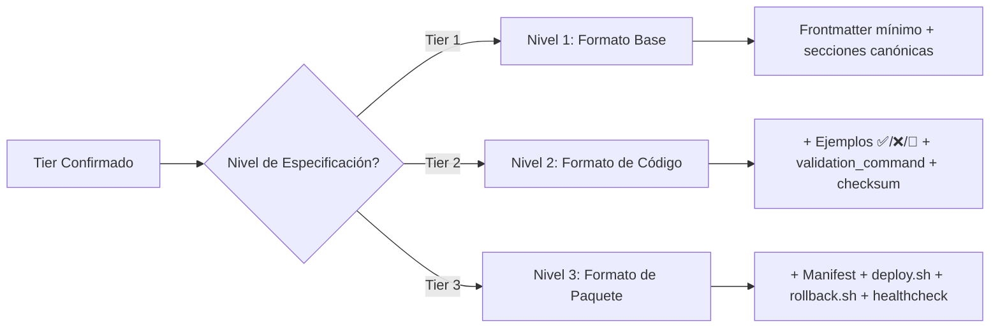

# 📄 SDD-COLLABORATIVE-GENERATION.md – ESPECIFICACIÓN DE GENERACIÓN COLABORATIVA

> **Nota para principiantes:** Este documento es la "especificación de formato" para cualquier artefacto generado en el proyecto MANTIS AGENTIC. Define exactamente cómo debe estructurarse un archivo para ser válido, validable y útil. Si eres nuevo, lee las secciones en orden. Si eres experto, salta al JSON final.  
>  
> **Para IAs:** Este es tu contrato de formato. **VIOLAR CUALQUIER REGLA DE ESTRUCTURA = ARTEFACTO INVÁLIDO**. No inventes, no asumas, no omitas.


# 🔄 SDD-COLLABORATIVE-GENERATION: Especificación de Formato para Generación Colaborativa

<!-- 
【PARA PRINCIPIANTES】¿Qué es este archivo?
Este documento es el "manual de formato" del proyecto MANTIS AGENTIC.
Define EXACTAMENTE cómo debe estructurarse cualquier artefacto generado:
• Frontmatter obligatorio con campos específicos por Tier
• Secciones canónicas en orden estricto
• Ejemplos con formato ✅/❌/🔧
• Wikilinks absolutos (no relativos)
• Validación pre-entrega con checklist ejecutable

Si eres nuevo: lee en orden. 
Si ya conoces el proyecto: usa los wikilinks para ir directo a lo que necesitas.
-->

> **Instrucción crítica para la IA:** 
> Este documento es tu contrato de formato. 
> **VIOLAR CUALQUIER REGLA DE ESTRUCTURA = ARTEFACTO INVÁLIDO**. 
> No inventes, no asumas, no omitas. Si algo no está claro, DETENER y preguntar.

---

## 【0】🎯 PROPÓSITO Y ALCANCE (Explicado para humanos)

<!-- 
【EDUCATIVO】Este documento responde: "¿Cómo debe verse un artefacto válido en MANTIS AGENTIC?"
No es burocracia. Es garantía de que cualquier archivo generado será:
• Legible por humanos
• Validable por scripts
• Integrable por CI/CD
• Auditable forensemente
-->

### 0.1 Los 3 Niveles de Especificación

| Nivel | Nombre | ¿Qué define? | ¿Quién lo usa? | Ejemplo |
|-------|--------|-------------|---------------|---------|
| **Nivel 1** | Formato Base | Frontmatter mínimo, secciones obligatorias, wikilinks canónicos | Todos los artefactos Tier 1 | `arquitectura-agente-rag.md` |
| **Nivel 2** | Formato de Código | + Ejemplos ✅/❌/🔧, validation_command, checksum | Artefactos Tier 2 (código) | `webhook-whatsapp.ts.md` |
| **Nivel 3** | Formato de Paquete | + Manifest, deploy.sh, rollback.sh, healthcheck | Artefactos Tier 3 (desplegables) | `rag-agent-v1.0.zip` |

### 0.2 Mapeo Tier → Nivel de Especificación

<!-- 
【PARA PRINCIPIANTES】El Tier determina automáticamente el nivel de especificación. 
No elijas nivel manualmente: deriva del modo confirmado en 【IA-QUICKSTART#0】.
-->



### 0.3 Tabla de Campos Obligatorios en Frontmatter por Nivel

| Campo | Nivel 1 | Nivel 2 | Nivel 3 | Descripción |
|-------|---------|---------|---------|-------------|
| `canonical_path` | ✅ | ✅ | ✅ | Ruta absoluta desde raíz (¡no relativa!) |
| `artifact_id` | ✅ | ✅ | ✅ | Identificador único del artefacto |
| `artifact_type` | ✅ | ✅ | ✅ | Tipo: `skill_go`, `documentation`, `config_docker`, etc. |
| `version` | ✅ | ✅ | ✅ | SemVer: `1.0.0` |
| `constraints_mapped` | ✅ | ✅ | ✅ | Array de constraints aplicables: `["C3","C4","C5"]` |
| `validation_command` | ⚪ | ✅ | ✅ | Comando ejecutable para validar el artefacto |
| `tier` | ⚪ | ✅ | ✅ | 1, 2 o 3 (derivado del modo) |
| `mode_selected` | ⚪ | ✅ | ✅ | A1/A2/A3/B1/B2/B3 (registrado en Paso 0) |
| `prompt_hash` | ⚪ | ✅ | ✅ | SHA256 del prompt original para auditoría |
| `generated_at` | ⚪ | ✅ | ✅ | Timestamp RFC3339 UTC |
| `bundle_required` | ⚪ | ⚪ | ✅ | true si requiere empaquetado Tier 3 |
| `bundle_contents` | ⚪ | ⚪ | ✅ | Array de archivos requeridos en el ZIP |

> 💡 **Consejo para principiantes**: Copia la plantilla de frontmatter de esta sección. Luego reemplaza los valores entre `< >`. No inventes campos nuevos sin aprobación humana.

---

## 【1】📐 REGLA 1: ESTRUCTURA CANÓNICA DE ARTEFACTOS

<!-- 
【EDUCATIVO】Todo artefacto válido debe seguir esta estructura en orden estricto. 
No reorganices secciones: el orden es parte del contrato.
-->

### 1.1 Plantilla Base para Todos los Niveles

```markdown
---
# FRONTMATTER OBLIGATORIO (ver tabla 0.3 para campos por nivel)
canonical_path: "/ruta/canónica/exacta/desde/raíz.md"
artifact_id: "identificador-único-del-artefacto"
artifact_type: "skill_go|documentation|config_docker|etc"
version: "1.0.0"
constraints_mapped: ["C3", "C4", "C5"]
# ... campos adicionales según nivel
---

# 🎯 TÍTULO DEL ARTEFACTO (H1 con emoji descriptivo)

<!-- 
【PARA PRINCIPIANTES】Comentario educativo explicando el propósito.
Este bloque es ignorado por parsers pero útil para humanos nuevos.
-->

> **Nota crítica**: Instrucción importante para la IA o el lector humano.

---

## 【1】SECCIÓN 1: PROPÓSITO Y ALCANCE

<!-- Contenido de la sección 1 -->

---

## 【2】SECCIÓN 2: CONFIGURACIÓN / IMPLEMENTACIÓN

<!-- Contenido de la sección 2 -->

---

## 【3】SECCIÓN 3: EJEMPLOS (Obligatorio para Nivel 2+)

<!-- 
【EDUCATIVO】Formato de ejemplos: ✅ bueno, ❌ malo, 🔧 corrección.
Mínimo 10 ejemplos para Nivel 2 y 3.
-->

| Caso | Ejemplo ✅ | Anti-patrón ❌ | Corrección 🔧 |
|------|-----------|---------------|--------------|
| 1 | `code` | `bad_code` | `fixed_code` |
| ... | ... | ... | ... |

---

## 【4】SECCIÓN 4: VALIDACIÓN

<!-- 
【EDUCATIVO】Comandos que cualquiera puede ejecutar para verificar el artefacto.
Obligatorio para Nivel 2+.
-->

```bash
# Comando de validación canónico
bash 05-CONFIGURATIONS/validation/orchestrator-engine.sh \
  --file <ruta> --mode headless --json
```

---

## 【5】SECCIÓN 5: REFERENCIAS CANÓNICAS (WIKILINKS)

<!-- 
【PARA IA】Estos enlaces deben resolverse usando PROJECT_TREE.md. 
No uses rutas relativas. Usa siempre la forma canónica [[RUTA]].
-->

- `[[00-STACK-SELECTOR]]` → Motor de decisión de stack
- `[[PROJECT_TREE]]` → Mapa maestro de rutas
- ... (otros wikilinks canónicos)

---

<!-- 
═══════════════════════════════════════════════════════════
🤖 SECCIÓN PARA IA: METADATOS JSON (Opcional para Nivel 1, Obligatorio para 2-3)
═══════════════════════════════════════════════════════════
-->

```json
{
  "artifact_metadata": {
    "canonical_path": "/ruta/canónica/exacta/desde/raíz.md",
    "tier": 2,
    "validation_command": "bash 05-CONFIGURATIONS/validation/orchestrator-engine.sh --file <ruta> --json",
    "checksum_sha256": "abc123..."
  }
}
```
```

### 1.2 Reglas Inamovibles de Estructura

```
REGLA 1.1: El frontmatter DEBE estar al inicio del archivo, entre `---`.
REGLA 1.2: Los wikilinks DEBEN ser canónicos: `[[RUTA-DESDE-RAÍZ]]`, nunca `[[../otra]]`.
REGLA 1.3: Los fences de código DEBEN declarar lenguaje: ```bash, ```json, ```sql, etc.
REGLA 1.4: Los ejemplos DEBEN usar formato ✅/❌/🔧 para Nivel 2+.
REGLA 1.5: La sección de validación DEBE incluir validation_command ejecutable para Nivel 2+.
REGLA 1.6: Los campos obligatorios del frontmatter NO pueden omitirse según el nivel.
REGLA 1.7: El orden de secciones DEBE seguir la plantilla base (no reorganizar).
```

> ⚠️ **Contención crítica**: Si alguna regla falla → `blocking_issue: "STRUCTURAL_CONTRACT_INVALID"`.

---

## 【2】🛡️ REGLA 2: GATE DE VALIDACIÓN PRE-ENTREGA

<!-- 
【EDUCATIVO】Antes de mostrar cualquier artefacto al humano, la IA debe auto-validarlo. 
Este gate previene deuda técnica desde el origen.
-->

### 2.1 Checklist Ejecutable Pre-Entrega

```bash
# ✅ CHECKLIST PRE-ENTREGA (ejecutar mental o realmente)

# 1. Frontmatter YAML válido
yq eval '.canonical_path' <archivo> >/dev/null 2>&1 && echo "✅ Frontmatter válido"

# 2. Fences de código balanceados
grep -c '```' <archivo> | awk '{if($1%2==0) print "✅ Fences balanceados"; else print "❌ Fences desbalanceados"}'

# 3. Wikilinks canónicos (no relativos)
grep -oE '\[\[[^]]+\]\]' <archivo> | grep -v '^\[\[/' && echo "⚠️ Wikilinks relativos detectados" || echo "✅ Wikilinks canónicos"

# 4. Constraints declarados ⊆ permitidos (según norms-matrix.json)
# (Validación lógica: declared ⊆ allowed para la carpeta destino)

# 5. LANGUAGE LOCK: cero operadores prohibidos para el lenguaje
# (Validación lógica: deny_operators no aparecen en el contenido)

# 6. Ejemplos ≥10 para Nivel 2+ (contar filas con ✅/❌/🔧)
grep -c '✅\|❌\|🔧' <archivo> | awk '{if($1>=10) print "✅ Ejemplos suficientes"; else print "❌ Ejemplos insuficientes"}'

# 7. validation_command presente y ejecutable para Nivel 2+
grep -q 'validation_command:' <archivo> && echo "✅ validation_command presente" || echo "❌ validation_command faltante"
```

### 2.2 Criterios de Aceptación por Nivel

| Nivel | Score Mínimo | Checks Requeridos | ¿Bloquea si falla? |
|-------|-------------|------------------|-------------------|
| **1** | ≥ 15 | Frontmatter válido, wikilinks canónicos, fences balanceados | ❌ No (solo advertencia) |
| **2** | ≥ 30 | Todo Nivel 1 + ≥10 ejemplos ✅/❌/🔧, validation_command, constraints validados | ✅ Sí (blocking_issues) |
| **3** | ≥ 45 | Todo Nivel 2 + bundle completo, checksums válidos, healthcheck ejecutable | ✅ Sí (blocking_issues) |

### 2.3 Protocolo de Iteración en Caso de Fallo

```
IF pre_delivery_checklist.failed == true:
    LOG: "Gate pre-entrega fallido: issues={issues}"
    
    IF iteration_count < 3:
        FOR issue IN failed_checks:
            APPLY corrective_action(issue)  # Usar sugerencias del checklist
        RE-RUN pre_delivery_checklist
        iteration_count += 1
    ELSE:
        RETURN error: "MAX_RETRIES_EXCEEDED: 3 intentos de corrección fallidos"
        SUGGEST: "Revisar manualmente o escalar a humano para revisión"
ELSE:
    PROCEED to delivery per tier
```

> 💡 **Consejo para principiantes**: No intentes "forzar" un aprobado. Si falla 3 veces, detente y pide ayuda. El gate protege tu tiempo, no lo desperdicia.

---

## 【3】📦 REGLA 3: FORMATO DE ENTREGA POR NIVEL

<!-- 
【EDUCATIVO】Cada nivel tiene un formato de entrega específico. 
Entregar en el formato incorrecto = artefacto inútil para el siguiente eslabón.
-->

### 3.1 Nivel 1: Formato Base (Tier 1)

```
【ENTREGA NIVEL 1】
• Formato: Texto en pantalla o archivo .md
• Incluye:
  - Frontmatter con campos obligatorios de Nivel 1
  - Estructura canónica de secciones (Propósito, Configuración, Referencias)
  - Wikilinks canónicos absolutos
  - Fences de código con lenguaje declarado
• No incluye:
  - Ejemplos ✅/❌/🔧 (opcional)
  - validation_command (opcional)
  - checksums (no requerido)
• Ejemplo de nota final:
  ```
  ---
  ✅ Estructura validada (C5, C6)
  ⚠️  Contenido requiere revisión humana antes de usar
  📝 Próximo paso: Solicitar aprobación en canal #reviews
  ```
```

### 3.2 Nivel 2: Formato de Código (Tier 2)

```
【ENTREGA NIVEL 2】
• Formato: Bloque de código + metadatos de validación
• Incluye:
  - Frontmatter con campos obligatorios de Nivel 2
  - Estructura canónica completa
  - ≥10 ejemplos en formato ✅/❌/🔧
  - validation_command ejecutable
  - checksum_sha256 del contenido
  - Nota: "✅ Validado para Nivel 2. Ejecute validation_command para verificar."
• No incluye:
  - Scripts de deploy/rollback (eso es Nivel 3)
  - Manifest.json (eso es Nivel 3)
• Ejemplo de bloque final:
  ```bash
  # ✅ Validación Nivel 2 completada
  # Ejecute para verificar:
  bash 05-CONFIGURATIONS/validation/orchestrator-engine.sh \
    --file 06-PROGRAMMING/javascript/webhook-whatsapp.ts.md \
    --mode headless --json
  
  # Checksum para integridad:
  # sha256: abc123def456...
  ```
```

### 3.3 Nivel 3: Formato de Paquete (Tier 3)

```
【ENTREGA NIVEL 3】
• Formato: ZIP simulado (estructura de archivos + instrucciones)
• Incluye:
  - Frontmatter con campos obligatorios de Nivel 3 + bundle_required: true
  - Estructura de archivos del bundle:
    ```
    mi-artefacto-v1.0/
    ├── manifest.json          # Metadatos del paquete
    ├── deploy.sh              # Script de despliegue idempotente
    ├── rollback.sh            # Script de reversión segura
    ├── healthcheck.sh         # Verificación post-deploy
    ├── README-DEPLOY.md       # Instrucciones para el cliente
    ├── checksums.sha256       # Hashes de todos los archivos
    └── src/                   # Código fuente validado (Nivel 2)
        └── ...
    ```
  - Contenido de manifest.json:
    ```json
    {
      "artifact_id": "mi-artefacto",
      "version": "1.0.0",
      "tier": 3,
      "mode_selected": "B3",
      "validation_result": {"score": 48, "passed": true},
      "bundle_checksum": "sha256:xyz789...",
      "deploy_command": "./deploy.sh --tenant <id>",
      "rollback_command": "./rollback.sh --tenant <id>",
      "healthcheck_command": "./healthcheck.sh",
      "generated_at": "2026-04-19T12:00:00Z",
      "prompt_hash": "sha256:abc123..."
    }
    ```
  - Nota final: "✅ Paquete Nivel 3 listo. Ejecute deploy.sh para instalar."
• No incluye:
  - Secrets hardcodeados (viola C3)
  - Tenant_id hardcodeado (viola C4)
• Ejemplo de nota final:
  ```
  ---
  ✅ Paquete Nivel 3 certificado
  📦 Contenido: manifest.json, deploy.sh, rollback.sh, healthcheck.sh, README-DEPLOY.md
  🔐 Checksum del bundle: sha256:xyz789...
  🚀 Para desplegar: ./deploy.sh --tenant <tu_tenant_id>
  🔙 Para revertir: ./rollback.sh --tenant <tu_tenant_id>
  🩺 Para verificar: ./healthcheck.sh
  ```
```

---

## 【4】🧭 PROTOCOLO DE GENERACIÓN COLABORATIVA (PASO A PASO)

<!-- 
【EDUCATIVO】Este es el flujo end-to-end que une todo: desde la solicitud humana hasta la entrega validada.
-->

```
┌─────────────────────────────────────────────────────────┐
│ 【FASE 0】CONFIRMACIÓN DE MODO (IA-QUICKSTART#0)        │
├─────────────────────────────────────────────────────────┤
│ • Humano solicita tarea                                 │
│ • IA solicita modo explícito (A1-B3)                    │
│ • Humano confirma → registrar mode_selected + prompt_hash│
│ • Timeout 3 turnos → fallback A1 con AUDIT_FLAG         │
└─────────────────────────────────────────────────────────┘
 ▼
┌─────────────────────────────────────────────────────────┐
│ 【FASE 1】RESOLUCIÓN DE STACK (00-STACK-SELECTOR)       │
├─────────────────────────────────────────────────────────┤
│ • Consultar PROJECT_TREE → ruta canónica                │
│ • Consultar 00-STACK-SELECTOR → lenguaje + constraints  │
│ • Validar LANGUAGE LOCK → operadores permitidos/denegados│
└─────────────────────────────────────────────────────────┘
 ▼
┌─────────────────────────────────────────────────────────┐
│ 【FASE 2】CARGA DE PLANTILLA (skill-template.md)        │
├─────────────────────────────────────────────────────────┤
│ • Cargar 05-CONFIGURATIONS/templates/skill-template.md  │
│ • Aplicar frontmatter canónico según Nivel/Tier         │
│ • Preparar estructura de secciones en orden estricto    │
└─────────────────────────────────────────────────────────┘
 ▼
┌─────────────────────────────────────────────────────────┐
│ 【FASE 3】GENERACIÓN DE CONTENIDO                       │
├─────────────────────────────────────────────────────────┤
│ • Escribir propósito y alcance con comentarios educativos│
│ • Generar configuración/implementación con constraints  │
│ • Incluir ≥10 ejemplos ✅/❌/🔧 (para Nivel 2+)         │
│ • Añadir sección de validación con validation_command   │
│ • Listar referencias canónicas con wikilinks absolutos  │
└─────────────────────────────────────────────────────────┘
 ▼
┌─────────────────────────────────────────────────────────┐
│ 【FASE 4】GATE DE VALIDACIÓN PRE-ENTREGA                │
├─────────────────────────────────────────────────────────┤
│ • Ejecutar checklist de 7 ítems (Sección 【2.1】)      │
│ • Si falla → iterar corrección (máx 3 intentos)        │
│ • Si pasa → proceder a entrega                          │
└─────────────────────────────────────────────────────────┘
 ▼
┌─────────────────────────────────────────────────────────┐
│ 【FASE 5】ENTREGA SEGÚN NIVEL/TIER                      │
├─────────────────────────────────────────────────────────┤
│ • Nivel 1: Pantalla + nota "Requiere revisión humana"   │
│ • Nivel 2: Código + validation_command + checksum       │
│ • Nivel 3: ZIP con manifest + deploy.sh + rollback.sh   │
│ • Registrar logs estructurados con audit fields         │
└─────────────────────────────────────────────────────────┘
 ▼
┌─────────────────────────────────────────────────────────┐
│ 【FASE 6】AUDITORÍA Y TRAZABILIDAD                      │
├─────────────────────────────────────────────────────────┤
│ • Guardar logs en 08-LOGS/generation/ con rotación diaria│
│ • Incluir prompt_hash para reproducibilidad forense     │
│ • Scrubear PII/secrets antes de loguear (C3 + C8)       │
│ • Exportar métricas para dashboard de gobernanza        │
└─────────────────────────────────────────────────────────┘
```

### 4.1 Ejemplo de Traza End-to-End (Nivel 2)

<!-- 
【PARA PRINCIPIANTES】Así se ve una generación exitosa de principio a fin.
-->

```
【TRAZA DE GENERACIÓN NIVEL 2】
Solicitud: "Generar webhook seguro para WhatsApp de cliente agrícola"

Fase 0 - Modo:
  • Humano responde: "B2"
  • Registrado: mode_selected=B2, prompt_hash=abc123..., audit_flag=human_confirmed

Fase 1 - Stack:
  • PROJECT_TREE: tarea "webhook WhatsApp" → 06-PROGRAMMING/javascript/
  • 00-STACK-SELECTOR: ruta → language=typescript, constraints=C3,C4,C5,C8
  • LANGUAGE LOCK: typescript → deny_operators=[], deny_constraints=[V1,V2,V3] ✅

Fase 2 - Plantilla:
  • Cargar: 05-CONFIGURATIONS/templates/skill-template.md
  • Aplicar frontmatter Nivel 2 con tier:2, validation_command, checksum

Fase 3 - Generación:
  • Propósito: explicar webhook seguro con firma HMAC
  • Configuración: código TypeScript con validación de schema
  • Ejemplos: 12 filas ✅/❌/🔧 (≥10 requerido) ✅
  • Validación: orchestrator-engine.sh --file ... --json
  • Referencias: wikilinks canónicos a PROJECT_TREE, norms-matrix, etc.

Fase 4 - Gate Pre-Entrega:
  • Checklist: 7/7 ítems aprobados ✅
  • Score estimado: 42 ≥ 30 ✅
  • blocking_issues: [] ✅

Fase 5 - Entrega Nivel 2:
  • Formato: código fuente + validation_command + checksum
  • Nota: "✅ Validado para Nivel 2. Ejecute validation_command para verificar."

Fase 6 - Auditoría:
  • Log guardado en 08-LOGS/generation/2026-04-19.log
  • Campos: prompt_hash, mode_selected, validation_timestamp, artifact_checksum
  • PII scrubbed: tenant_id en logs → ***REDACTED***

Resultado: ✅ Artefacto generado Nivel 2, listo para integración.
```

---

## 【5】📚 GLOSARIO PARA PRINCIPIANTES

<!-- 
【EDUCATIVO】Términos técnicos explicados en lenguaje simple.
-->

| Término | Significado simple | Ejemplo |
|---------|-------------------|---------|
| **Frontmatter** | Metadatos al inicio de un archivo Markdown (entre `---`) | `version: "1.0.0"`, `constraints_mapped: ["C1","C3"]` |
| **Wikilink canónico** | Enlace interno con ruta absoluta desde raíz | `[[PROJECT_TREE.md]]` (no `[[../PROJECT_TREE.md]]`) |
| **Fence de código** | Bloque de código con lenguaje declarado | ```bash, ```json, ```sql |
| **Ejemplo ✅/❌/🔧** | Patrón bueno / malo / corrección | ✅ `const x = 1` ❌ `x = 1` 🔧 `let x = 1` |
| **validation_command** | Comando que cualquiera puede ejecutar para verificar el artefacto | `bash orchestrator-engine.sh --file mi-archivo.md --json` |
| **LANGUAGE LOCK** | Regla que prohíbe ciertos operadores en ciertos lenguajes | No usar `<->` en `go/`, solo en `postgresql-pgvector/` |
| **prompt_hash** | SHA256 del prompt original del humano | Para saber qué pidió el humano, incluso meses después |
| **scrubbing** | Reemplazar datos sensibles por `***REDACTED***` en logs | Log: `user_email=***REDACTED***` en lugar de `user_email=cliente@ejemplo.com` |
| **idempotente** | Script que puede ejecutarse múltiples veces sin efectos secundarios | `deploy.sh` que verifica si ya está instalado antes de instalar |
| **determinista** | Mismos inputs → mismos outputs, sin ambigüedad | Este protocolo: si sigues los pasos, siempre obtienes el mismo resultado |

---

## 【6】🧪 SANDBOX DE PRUEBA (OPCIONAL)

<!-- 
【PARA DESARROLLADORES】Pega esta sección en un chat nuevo para validar que la IA sigue el protocolo sin contexto previo.
-->

```
【TEST MODE: SDD-COLLABORATIVE-GENERATION VALIDATION】
Prompt de prueba: "Generar agente RAG multi-tenant con webhook de WhatsApp para cliente agrícola"

Respuesta esperada de la IA:
1. 【GATE MODO】Solicitar selección: [A1]...[B3] con descripciones claras
2. Si humano responde "B2" (Nivel 2):
   - Registrar: mode_selected=B2, prompt_hash=<SHA256>, audit_flag=human_confirmed
   - Cargar PROJECT_TREE → ruta: 06-PROGRAMMING/javascript/
   - Consultar 00-STACK-SELECTOR → lenguaje: TypeScript, constraints: C3,C4,C5,C8
   - Aplicar LANGUAGE LOCK → TypeScript: cero pgvector, cero V1-V3
3. 【CARGA DE PLANTILLA】Cargar skill-template.md, aplicar frontmatter Nivel 2
4. 【GENERACIÓN】Escribir:
   - Propósito: explicar agente RAG con webhook WhatsApp
   - Configuración: código TypeScript con tenant_id propagation, firma HMAC
   - Ejemplos: ≥10 filas ✅/❌/🔧 con casos reales
   - Validación: orchestrator-engine.sh --file ... --json
   - Referencias: wikilinks canónicos a normas relevantes
5. 【GATE PRE-ENTREGA】Ejecutar checklist de 7 ítems → todos aprobados ✅
6. 【ENTREGA NIVEL 2】Entregar:
   - Código fuente con frontmatter canónico
   - validation_command ejecutable
   - checksum_sha256 para integridad
   - Nota: "✅ Validado para Nivel 2. Ejecute validation_command para verificar."
7. 【AUDITORÍA】Registrar logs estructurados con prompt_hash, scrubbed PII, audit_flag

Si la IA omite el Paso 1, usa lenguaje incorrecto, declara constraints no permitidas, 
omite ejemplos ✅/❌/🔧, o no incluye validation_command → FALLA DE FORMATO.
```

---

## 【7】🔗 REFERENCIAS CANÓNICAS (WIKILINKS)

<!-- 
【PARA IA】Estos enlaces deben resolverse usando PROJECT_TREE.md. 
No uses rutas relativas. Usa siempre la forma canónica [[RUTA]].
-->

- `[[00-STACK-SELECTOR]]` → Motor de decisión de stack (ruta → lenguaje → constraints)
- `[[PROJECT_TREE]]` → Mapa maestro de rutas del repositorio
- `[[05-CONFIGURATIONS/validation/norms-matrix.json]]` → Matriz de aplicación de constraints por carpeta
- `[[01-RULES/harness-norms-v3.0.md]]` → Definición textual de C1-C8
- `[[01-RULES/language-lock-protocol.md]]` → Reglas de exclusión de operadores por lenguaje
- `[[GOVERNANCE-ORCHESTRATOR]]` → Tiers, validación y certificación
- `[[IA-QUICKSTART]]` → Punto de entrada para IAs, define modos A1-B3
- `[[AI-NAVIGATION-CONTRACT]]` → Reglas de interacción y navegación
- `[[05-CONFIGURATIONS/templates/skill-template.md]]` → Plantilla base para nuevos artefactos
- `[[06-PROGRAMMING/00-INDEX]]` → Índice agregador de patrones por lenguaje

---

## 【8】📦 METADATOS DE EXPANSIÓN (PARA FUTURAS VERSIONES)

<!-- 
【PARA MANTENEDORES】Nuevas secciones deben seguir este formato para no romper compatibilidad.
-->

```json
{
  "expansion_registry": {
    "artifact_levels": {
      "current": [1, 2, 3],
      "extensible": false,
      "reason": "Niveles son contractuales: cambiarlos rompe compatibilidad con artefactos existentes",
      "change_requires": [
        "Major version bump (3.0.0 → 4.0.0)",
        "Migration guide for existing artifacts",
        "Human approval + stakeholder sign-off",
        "Update orchestrator-engine.sh with new validation logic"
      ]
    },
    "frontmatter_fields": {
      "current_required_level_1": ["canonical_path", "artifact_id", "artifact_type", "version", "constraints_mapped"],
      "current_required_level_2": ["+validation_command", "+tier", "+mode_selected", "+prompt_hash", "+generated_at"],
      "current_required_level_3": ["+bundle_required", "+bundle_contents"],
      "extensible": true,
      "addition_requires": [
        "Update this file: add field to Section 【0.3】",
        "Update skill-template.md: include new field in template",
        "Update orchestrator-engine.sh: validate new field if present",
        "Human approval required: true"
      ]
    },
    "example_formats": {
      "current": ["✅/❌/🔧 table"],
      "extensible": true,
      "addition_requires": [
        "Update this file: document new format in Section 【1.1】",
        "Update skill-template.md: include new format example",
        "Update validation checklist: verify new format if used",
        "Human approval required: true"
      ]
    }
  },
  "compatibility_rule": "Nuevas características no deben invalidar artefactos generados bajo versiones anteriores. Cambios breaking requieren major version bump, guía de migración y aprobación humana explícita."
}
```

---

<!-- 
═══════════════════════════════════════════════════════════
🤖 SECCIÓN PARA IA: ÁRBOL JSON ENRIQUECIDO
═══════════════════════════════════════════════════════════
Esta sección contiene metadatos estructurados para consumo automático por agentes de IA.
No está diseñada para lectura humana directa. Los humanos deben usar las secciones 【1】-【8】.

Formato: JSON válido, con comentarios explicativos en claves "doc_*".
Prioridad de ejecución: Las normas se aplican en el orden definido en "norm_execution_order".
Dependencias: Cada nodo declara sus archivos requeridos y sus efectos colaterales.
═══════════════════════════════════════════════════════════
-->

```json
{
  "sdd_generation_metadata": {
    "version": "3.0.0-SELECTIVE",
    "canonical_path": "/SDD-COLLABORATIVE-GENERATION.md",
    "artifact_type": "artifact_format_specification",
    "immutable": true,
    "requires_human_approval_for_changes": true,
    "llm_optimizations": {
      "oriental_models_friendly": true,
      "delimiters_used": ["【】", "┌─┐", "▼", "✅/❌/🔧"],
      "numbered_sequences": true,
      "stop_conditions_explicit": true,
      "response_format_examples": true
    }
  },
  
  "level_definitions": {
    "level_1": {
      "name": "Base Format",
      "applicable_tiers": [1],
      "required_frontmatter_fields": ["canonical_path", "artifact_id", "artifact_type", "version", "constraints_mapped"],
      "required_sections": ["Propósito y Alcance", "Configuración/Implementación", "Referencias Canónicas"],
      "optional_sections": ["Ejemplos", "Validación"],
      "min_examples": 0,
      "validation_command_required": false,
      "checksum_required": false,
      "doc_description": "Formato base para documentación y propuestas. Requiere revisión humana antes de usar."
    },
    "level_2": {
      "name": "Code Format",
      "applicable_tiers": [2],
      "required_frontmatter_fields": ["canonical_path", "artifact_id", "artifact_type", "version", "constraints_mapped", "validation_command", "tier", "mode_selected", "prompt_hash", "generated_at"],
      "required_sections": ["Propósito y Alcance", "Configuración/Implementación", "Ejemplos", "Validación", "Referencias Canónicas"],
      "optional_sections": [],
      "min_examples": 10,
      "example_format": "✅/❌/🔧 table",
      "validation_command_required": true,
      "checksum_required": true,
      "doc_description": "Formato para código validable. Incluye ejemplos y comando de validación ejecutable."
    },
    "level_3": {
      "name": "Package Format",
      "applicable_tiers": [3],
      "required_frontmatter_fields": ["canonical_path", "artifact_id", "artifact_type", "version", "constraints_mapped", "validation_command", "tier", "mode_selected", "prompt_hash", "generated_at", "bundle_required", "bundle_contents"],
      "required_sections": ["Propósito y Alcance", "Configuración/Implementación", "Ejemplos", "Validación", "Referencias Canónicas", "Bundle Structure"],
      "optional_sections": ["Migration Guide", "Monitoring Config"],
      "min_examples": 10,
      "example_format": "✅/❌/🔧 table",
      "validation_command_required": true,
      "checksum_required": true,
      "bundle_required": true,
      "bundle_structure": ["manifest.json", "deploy.sh", "rollback.sh", "healthcheck.sh", "README-DEPLOY.md", "checksums.sha256", "src/"],
      "doc_description": "Formato para paquetes desplegables. Incluye estructura de bundle con scripts de deploy/rollback."
    }
  },
  
  "structural_rules": {
    "frontmatter_position": "must_be_first",
    "frontmatter_delimiter": "---",
    "wikilink_format": "canonical_absolute",
    "code_fence_requirement": "language_declared",
    "section_order": ["Propósito y Alcance", "Configuración/Implementación", "Ejemplos", "Validación", "Referencias Canónicas"],
    "example_format": "✅/❌/🔧 table for level_2+",
    "validation_section_required_for": ["level_2", "level_3"],
    "checksum_field_name": "checksum_sha256",
    "checksum_algorithm": "SHA256"
  },
  
  "pre_delivery_gate": {
    "checklist_items": [
      {"check": "frontmatter_yaml_valid", "blocking": true, "validator": "yq eval"},
      {"check": "code_fences_balanced", "blocking": true, "validator": "grep -c '```'"},
      {"check": "wikilinks_canonical", "blocking": true, "validator": "grep -oE '\\[\\[[^]]+\\]\\]'"},
      {"check": "constraints_subset_of_allowed", "blocking": true, "validator": "norms-matrix.json lookup"},
      {"check": "language_lock_compliant", "blocking": true, "validator": "verify-constraints.sh --check-language-lock"},
      {"check": "examples_count_sufficient", "blocking": false, "validator": "grep -c '✅\\|❌\\|🔧'", "min_for_level_2": 10},
      {"check": "validation_command_present", "blocking": true, "validator": "grep -q 'validation_command:'", "required_for": ["level_2", "level_3"]}
    ],
    "retry_policy": {"max_attempts": 3, "backoff": "linear"},
    "failure_action": "return_structured_error_with_suggestions"
  },
  
  "constraint_execution_order": {
    "description": "Orden de aplicación de constraints durante validación. Críticas primero para fail-fast.",
    "fail_fast_sequence": [
      {"constraint": "C3", "reason": "Zero Hardcode Secrets - bloqueo crítico inmediato si falla"},
      {"constraint": "C4", "reason": "Tenant Isolation - fuga de datos es inaceptable"},
      {"constraint": "C5", "reason": "Structural Contract - sin frontmatter válido, no hay validación posible"}
    ],
    "standard_sequence": [
      {"constraint": "C1", "reason": "Resource Limits - previene DoS por configuración"},
      {"constraint": "C6", "reason": "Verifiable Execution - auditabilidad de comandos"},
      {"constraint": "C2", "reason": "Concurrency Control - estabilidad del sistema"},
      {"constraint": "C7", "reason": "Resilience - tolerancia a fallos operativos"},
      {"constraint": "C8", "reason": "Observability - trazabilidad post-mortem"}
    ],
    "vector_sequence": [
      {"constraint": "V1", "reason": "Vector Dimensions - declaración obligatoria para pgvector"},
      {"constraint": "V2", "reason": "Distance Metric - documentación semántica del operador"},
      {"constraint": "V3", "reason": "Index Justification - optimización basada en evidencia"}
    ],
    "evaluation_logic": "1) Ejecutar fail_fast_sequence. Si alguna falla → bloqueo inmediato. 2) Ejecutar standard_sequence según lenguaje. 3) Si language=sql_pgvector, ejecutar vector_sequence."
  },
  
  "dependency_graph": {
    "critical_infrastructure": [
      {"file": "PROJECT_TREE.md", "purpose": "Resolver rutas canónicas", "load_order": 1},
      {"file": "00-STACK-SELECTOR.md", "purpose": "Determinar lenguaje por ruta", "load_order": 2},
      {"file": "05-CONFIGURATIONS/validation/norms-matrix.json", "purpose": "Mapear constraints por carpeta", "load_order": 3},
      {"file": "01-RULES/harness-norms-v3.0.md", "purpose": "Definición textual de constraints", "load_order": 4},
      {"file": "01-RULES/language-lock-protocol.md", "purpose": "Reglas de exclusión de operadores", "load_order": 5}
    ],
    "templates_and_specs": [
      {"file": "05-CONFIGURATIONS/templates/skill-template.md", "purpose": "Plantilla base para nuevos artefactos", "load_order": 1},
      {"file": "SDD-COLLABORATIVE-GENERATION.md", "purpose": "Especificación de formato (este archivo)", "load_order": 2},
      {"file": "GOVERNANCE-ORCHESTRATOR.md", "purpose": "Tiers y validación", "load_order": 3}
    ],
    "navigation_contracts": [
      {"file": "IA-QUICKSTART.md", "purpose": "Definir modos A1-B3 y gate humano", "load_order": 1},
      {"file": "AI-NAVIGATION-CONTRACT.md", "purpose": "Reglas de interacción IA-humano", "load_order": 2}
    ],
    "validation_toolchain": [
      {"file": "05-CONFIGURATIONS/validation/orchestrator-engine.sh", "purpose": "Motor principal de validación", "load_order": 1},
      {"file": "05-CONFIGURATIONS/validation/validate-frontmatter.sh", "purpose": "Validación de frontmatter YAML", "load_order": 2},
      {"file": "05-CONFIGURATIONS/validation/verify-constraints.sh", "purpose": "Validación de constraints y LANGUAGE LOCK", "load_order": 3},
      {"file": "05-CONFIGURATIONS/validation/audit-secrets.sh", "purpose": "Detección de secrets hardcodeados", "load_order": 4},
      {"file": "05-CONFIGURATIONS/validation/check-wikilinks.sh", "purpose": "Validación de wikilinks canónicos", "load_order": 5}
    ]
  },
  
  "human_readable_errors": {
    "frontmatter_invalid": "Frontmatter YAML inválido. Verifique sintaxis y campos obligatorios para Nivel {level}.",
    "fences_unbalanced": "Fences de código desbalanceados: {count} aperturas, {count} cierres. Verifique que cada ``` tiene su cierre.",
    "wikilinks_relative": "Wikilinks relativos detectados: {links}. Use forma canónica: [[RUTA-DESDE-RAÍZ]].",
    "constraints_not_allowed": "Constraint '{constraint}' no aplicable para ruta '{path}'. Consulte [[05-CONFIGURATIONS/validation/norms-matrix.json]].",
    "language_lock_violation": "Violación de LANGUAGE LOCK: operador '{operator}' prohibido en lenguaje '{language}'. Ver [[01-RULES/language-lock-protocol]].",
    "examples_insufficient": "Ejemplos insuficientes: {count} < {min_required} para Nivel {level}. Agregue más filas ✅/❌/🔧.",
    "validation_command_missing": "validation_command faltante en frontmatter para Nivel {level}. Agregue campo con comando ejecutable.",
    "bundle_incomplete": "Paquete Nivel 3 incompleto: faltan {missing_files}. Consulte 【3.3】 para estructura requerida."
  },
  
  "audit_requirements": {
    "required_log_fields": [
      "timestamp_rfc3339",
      "level",
      "event",
      "artifact.canonical_path",
      "artifact.tier",
      "artifact.mode_selected",
      "artifact.prompt_hash",
      "artifact.constraints_mapped",
      "validation.score",
      "validation.passed",
      "validation.blocking_issues",
      "validation.language_lock_violations",
      "audit.audit_flag",
      "audit.operator_id",
      "audit.session_id"
    ],
    "pii_scrubbing_rules": {
      "enabled": true,
      "fields_to_scrub": ["password", "secret", "token", "api_key", "credential", "tenant_data", "user_email", "user_phone"],
      "scrub_method": "replace_with_***REDACTED***",
      "compliance": "C3 (Zero Hardcode Secrets) + C8 (Observabilidad)"
    },
    "retention_policy": {
      "debug_logs": "90_days",
      "audit_logs": "7_years",
      "compliance_logs": "permanent_if_tier3",
      "rotation": "daily_with_checksum"
    },
    "export_formats": ["JSON Lines", "CSV for SIEM", "OpenTelemetry OTLP"]
  },
  
  "expansion_hooks": {
    "new_level_addition": {
      "possible": false,
      "reason": "Niveles son contractuales: cambiarlos rompe compatibilidad con artefactos existentes",
      "alternative": "Añadir nuevo formato de ejemplo o campo de frontmatter dentro de nivel existente si se necesita granularidad"
    },
    "new_frontmatter_field": {
      "requires_files_update": [
        "SDD-COLLABORATIVE-GENERATION.md (this file): add field to Section 【0.3】",
        "05-CONFIGURATIONS/templates/skill-template.md: include new field in template",
        "orchestrator-engine.sh: validate new field if present",
        "GOVERNANCE-ORCHESTRATOR.md: update tier definitions if field is tier-specific"
      ],
      "requires_human_approval": true,
      "backward_compatibility": "new fields are optional for existing artifacts, mandatory for new generations"
    },
    "new_example_format": {
      "requires_files_update": [
        "SDD-COLLABORATIVE-GENERATION.md: document new format in Section 【1.1】",
        "05-CONFIGURATIONS/templates/skill-template.md: include new format example",
        "validation checklist: verify new format if used",
        "orchestrator-engine.sh: parse new format for example counting"
      ],
      "requires_human_approval": true,
      "backward_compatibility": "new formats are optional, existing ✅/❌/🔧 format remains valid"
    }
  },
  
  "validation_metadata": {
    "orchestrator_compatibility": ">=3.0.0-SELECTIVE",
    "schema_version": "sdd-generation-spec.v1.json",
    "checksum_algorithm": "SHA256",
    "audit_log_format": "JSON Lines with RFC3339 timestamps",
    "pii_scrubbing": "enabled for all logs (C3 + C8 compliance)",
    "reproducibility_guarantee": "Any artifact can be regenerated identically using prompt_hash + mode_selected + canonical_path + this specification"
  }
}
```

---

## ✅ CHECKLIST DE VALIDACIÓN POST-GENERACIÓN


<!-- 
【PARA PRINCIPIANTES】Antes de guardar este archivo, verifica estos puntos.
-->

````markdown 
```bash
# 1. Verificar que el frontmatter es YAML válido
yq eval '.canonical_path' SDD-COLLABORATIVE-GENERATION.md
# Esperado: "/SDD-COLLABORATIVE-GENERATION.md"

# 2. Verificar que constraints_mapped solo contiene C1-C8 (este archivo no es pgvector)
yq eval '.constraints_mapped | .[]' SDD-COLLABORATIVE-GENERATION.md | grep -E '^C[1-8]$' | wc -l
# Esperado: 8 líneas

# 3. Verificar que la estructura canónica está presente
grep -q "## 【1】.*ESTRUCTURA CANÓNICA" SDD-COLLABORATIVE-GENERATION.md && echo "✅ Sección de estructura presente"
grep -q "## 【2】.*GATE DE VALIDACIÓN" SDD-COLLABORATIVE-GENERATION.md && echo "✅ Gate de validación presente"

# 4. Verificar que todos los wikilinks apuntan a archivos existentes
for link in $(grep -oE '\[\[[^]]+\]\]' SDD-COLLABORATIVE-GENERATION.md | tr -d '[]' | sort -u); do
  if [ ! -f "${link#//}" ] && [ ! -f "${link}" ]; then
    echo "⚠️  Wikilink roto: $link"
  fi
done

# 5. Validar que la sección JSON final es parseable
tail -n +$(grep -n '```json' SDD-COLLABORATIVE-GENERATION.md | tail -1 | cut -d: -f1) SDD-COLLABORATIVE-GENERATION.md | \
  sed -n '/```json/,/```/p' | sed '1d;$d' | jq empty && echo "✅ JSON válido"

# 6. Validar con orchestrator (simulación mental)
# - ¿El archivo está en raíz? → SÍ
# - ¿El lenguaje es markdown con especificación de formato? → SÍ
# - ¿Constraints aplicables según norms-matrix.json? → C5 mandatory → SÍ
# - ¿validation_command es ejecutable? → SÍ, apunta a orchestrator-engine.sh
```
````

**Criterio de aceptación:**  
- ✅ Frontmatter válido con `canonical_path: "/SDD-COLLABORATIVE-GENERATION.md"`  
- ✅ `constraints_mapped` contiene solo C1-C8 (este archivo no es pgvector)  
- ✅ Estructura canónica de secciones presente en orden correcto  
- ✅ Sección JSON final es válida (puede parsearse con `jq .`)  
- ✅ Todos los wikilinks apuntan a archivos existentes en `PROJECT_TREE.md`  
- ✅ `validation_command` es ejecutable y apunta al orchestrator correcto  

---

> 🎯 **Mensaje final para el lector humano**:  
> Este documento es tu garantía de formato. No es burocracia.  
> **Frontmatter → Estructura → Ejemplos → Validación → Entrega**.  
> Si sigues ese flujo, nunca generarás un artefacto que no cumpla con lo prometido.  
> La gobernanza no es una carga. Es la libertad de escalar sin miedo a romper.  
