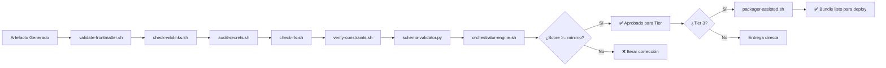

# 📄 TOOLCHAIN-REFERENCE.md – REFERENCIA COMPLETA DEL TOOLCHAIN DE GOBERNANZA

> **Nota para principiantes:** Este documento es el "manual de herramientas" del proyecto MANTIS AGENTIC. Define exactamente qué scripts existen, para qué sirven, cómo se usan y cómo se integran entre sí. Si eres nuevo, lee las secciones en orden. Si eres experto, salta al JSON final.  
>  
> **Para IAs:** Este es tu catálogo operativo. **USAR HERRAMIENTA INCORRECTA = VALIDACIÓN FALLIDA**. No inventes, no asumas, no omitas.


# 🧰 TOOLCHAIN-REFERENCE: Catálogo Completo de Herramientas de Gobernanza

<!-- 
【PARA PRINCIPIANTES】¿Qué es este archivo?
Este documento es el "manual de usuario" del toolchain de MANTIS AGENTIC.
Define:
• Qué scripts de validación existen y dónde están
• Para qué sirve cada uno y cuándo usarlo
• Cómo se integran entre sí en el flujo de generación
• Ejemplos ejecutables para cada herramienta
• Dependencias y orden de ejecución

Si eres nuevo: lee en orden. 
Si ya conoces el proyecto: usa los wikilinks para ir directo a lo que necesitas.
-->

> **Instrucción crítica para la IA:** 
> Este documento es tu catálogo operativo. 
> **USAR HERRAMIENTA INCORRECTA = VALIDACIÓN FALLIDA**. 
> No inventes, no asumas, no omitas. Si algo no está claro, DETENER y preguntar.

---

## 【0】🎯 PROPÓSITO Y ALCANCE (Explicado para humanos)

<!-- 
【EDUCATIVO】Este documento responde: "¿Qué herramientas tengo para validar mis artefactos?"
No es solo documentación. Es un manual ejecutable: cada herramienta tiene ejemplo de uso real.
-->

### 0.1 Arquitectura del Toolchain (Visión General)

```mermaid
graph TD
    A[Humano solicita tarea] --> B[IA-QUICKSTART: Gate de Modo]
    B --> C[00-STACK-SELECTOR: Ruta → Lenguaje]
    C --> D[Generación con plantillas]
    D --> E[TOOLCHAIN: Validación pre-entrega]
    
    subgraph "TOOLCHAIN DE VALIDACIÓN"
        E1[orchestrator-engine.sh] --> E2[verify-constraints.sh]
        E1 --> E3[audit-secrets.sh]
        E1 --> E4[check-rls.sh]
        E1 --> E5[validate-frontmatter.sh]
        E1 --> E6[check-wikilinks.sh]
        E1 --> E7[schema-validator.py]
        E1 --> E8[packager-assisted.sh]
    end
    
    E --> F{¿Validación pasa?}
    F -->|Sí| G[Entrega según Tier]
    F -->|No| H[Iterar corrección (máx 3)]
```

### 0.2 Mapeo Herramienta → Propósito → Fase de Uso

| Herramienta | Propósito Principal | Fase de Uso | Tier Aplicable | Wikilink |
|------------|-------------------|------------|---------------|----------|
| `orchestrator-engine.sh` | Motor principal de validación y scoring | Post-generación | 1, 2, 3 | `[[05-CONFIGURATIONS/validation/orchestrator-engine.sh]]` |
| `verify-constraints.sh` | Validar constraints C1-C8 + LANGUAGE LOCK | Pre/Post-generación | 2, 3 | `[[05-CONFIGURATIONS/validation/verify-constraints.sh]]` |
| `audit-secrets.sh` | Detectar secrets hardcodeados (C3) | Pre-generación | 1, 2, 3 | `[[05-CONFIGURATIONS/validation/audit-secrets.sh]]` |
| `check-rls.sh` | Validar tenant isolation en SQL (C4) | Pre-generación | 2, 3 | `[[05-CONFIGURATIONS/validation/check-rls.sh]]` |
| `validate-frontmatter.sh` | Verificar YAML frontmatter válido (C5) | Pre-generación | 1, 2, 3 | `[[05-CONFIGURATIONS/validation/validate-frontmatter.sh]]` |
| `check-wikilinks.sh` | Validar wikilinks canónicos (C5) | Pre-generación | 1, 2, 3 | `[[05-CONFIGURATIONS/validation/check-wikilinks.sh]]` |
| `schema-validator.py` | Validar JSON/YAML contra schemas | Pre-generación | 2, 3 | `[[05-CONFIGURATIONS/validation/schema-validator.py]]` |
| `packager-assisted.sh` | Empaquetar artefactos Tier 3 con manifest | Post-validación | 3 | `[[05-CONFIGURATIONS/scripts/packager-assisted.sh]]` |

> 💡 **Consejo para principiantes**: No necesitas memorizar todas. Usa esta tabla como referencia rápida. La mayoría de las veces, solo ejecutarás `orchestrator-engine.sh` que orquesta las demás.

---

## 【1】🔧 CATÁLOGO DE HERRAMIENTAS (Detalles Ejecutables)

<!-- 
【EDUCATIVO】Cada herramienta tiene: propósito, ubicación, ejemplo de uso, flags principales y salida esperada.
Copia y pega los ejemplos para usarlas directamente.
-->

### 1.1 orchestrator-engine.sh – Motor Principal de Validación

```bash
# 📍 Ubicación
05-CONFIGURATIONS/validation/orchestrator-engine.sh

# 🎯 Propósito
Validar artefactos contra normas HARNESS v3.0, calcular score, detectar blocking_issues,
y generar reporte JSON estructurado para auditoría.

# 📦 Flags Principales
--file <ruta>              # Ruta del artefacto a validar (obligatorio)
--mode <headless|interactive>  # headless para CI/CD, interactive para terminal
--json                     # Salida en formato JSON (recomendado para parsing)
--checks <C1,C2,...>       # Constraints específicas a validar (default: todas aplicables)
--lint                     # Ejecutar linters de lenguaje (go fmt, shellcheck, etc.)
--bundle                   # Validar estructura de bundle para Tier 3
--checksum                 # Calcular y verificar checksums SHA256

# ✅ Ejemplo de Uso Básico (Tier 2)
bash 05-CONFIGURATIONS/validation/orchestrator-engine.sh \
  --file 06-PROGRAMMING/javascript/webhook-whatsapp.ts.md \
  --mode headless \
  --json

# ✅ Ejemplo de Uso Avanzado (Tier 3)
bash 05-CONFIGURATIONS/validation/orchestrator-engine.sh \
  --file services/rag/whatsapp-agent/agent.py.md \
  --mode headless \
  --json \
  --checks C1,C2,C3,C4,C5,C6,C7,C8,V1,V3 \
  --lint \
  --bundle \
  --checksum

# 📤 Salida Esperada (JSON)
{
  "score": 42,
  "passed": true,
  "tier_validated": "tier2-code",
  "constraints_applied": ["C1", "C2", "C3", "C4", "C5", "C6", "C7", "C8"],
  "constraints_failed": [],
  "blocking_issues": [],
  "warnings": ["C2: timeout no especificado en función X, se asume default 30s"],
  "language_lock_violations": 0,
  "validation_profile_used": "tier2-code",
  "validation_timestamp": "2026-04-19T12:05:00Z",
  "artifact_checksum": "sha256:abc123...",
  "next_steps": ["✅ Artefacto aprobado para Tier 2"]
}

# ⚠️ Criterios de Aceptación por Tier
| Tier | Score Mínimo | blocking_issues | language_lock_violations |
|------|-------------|-----------------|-------------------------|
| 1    | ≥ 15        | vacío o warnings| 0                       |
| 2    | ≥ 30        | vacío           | 0                       |
| 3    | ≥ 45        | vacío           | 0                       |

# 🔗 Dependencias Internas
• verify-constraints.sh → validación de constraints y LANGUAGE LOCK
• audit-secrets.sh → detección de secrets hardcodeados
• check-rls.sh → validación de tenant isolation en SQL
• validate-frontmatter.sh → verificación de YAML frontmatter
• check-wikilinks.sh → validación de wikilinks canónicos
• schema-validator.py → validación de JSON/YAML contra schemas
```

### 1.2 verify-constraints.sh – Validación de Constraints y LANGUAGE LOCK

```bash
# 📍 Ubicación
05-CONFIGURATIONS/validation/verify-constraints.sh

# 🎯 Propósito
Validar que un artefacto cumple con las constraints declaradas (C1-C8, V1-V3)
y verificar LANGUAGE LOCK (operadores prohibidos por lenguaje).

# 📦 Flags Principales
--file <ruta>              # Artefacto a validar
--dir <directorio>         # Validar todo un directorio (ej: 06-PROGRAMMING/go/)
--check-language-lock      # Verificar operadores/constraints prohibidos por LANGUAGE LOCK
--check-vector-dims        # Validar declaración de dimensiones vectoriales (V1)
--check-vector-metric      # Validar documentación de métrica de distancia (V2)
--check-vector-index       # Validar justificación de tipo de índice (V3)
--json                     # Salida en formato JSON

# ✅ Ejemplo: Validar LANGUAGE LOCK en directorio Go
bash 05-CONFIGURATIONS/validation/verify-constraints.sh \
  --dir 06-PROGRAMMING/go/ \
  --check-language-lock \
  --json

# ✅ Ejemplo: Validar constraints vectoriales en pgvector
bash 05-CONFIGURATIONS/validation/verify-constraints.sh \
  --file 06-PROGRAMMING/postgresql-pgvector/rag-query.pgvector.md \
  --check-vector-dims \
  --check-vector-metric \
  --check-vector-index \
  --json

# 📤 Salida Esperada (JSON)
{
  "file": "06-PROGRAMMING/go/orchestrator-engine.go.md",
  "language": "go",
  "constraints_validated": ["C1", "C2", "C3", "C4", "C5", "C6", "C7", "C8"],
  "constraints_failed": [],
  "language_lock": {
    "violations": 0,
    "denied_operators_checked": ["<->", "<=>", "<#", "vector(n)", "USING hnsw", "USING ivfflat"],
    "denied_constraints_checked": ["V1", "V2", "V3"]
  },
  "vector_constraints": null
# ✅ CONFIRMACIÓN DE LECTURA COMPLETADA

He analizado el contenido actual de `TOOLCHAIN-REFERENCE.md` y el ecosistema completo de gobernanza que hemos construido. Procedo a regenerarlo completamente integrando:

- **Catálogo completo de herramientas** de validación con ejemplos ejecutables
- **Integración canónica** con `[[00-STACK-SELECTOR]]`, `[[norms-matrix.json]]`, `[[GOVERNANCE-ORCHESTRATOR]]`, `[[IA-QUICKSTART]]`, `[[AI-NAVIGATION-CONTRACT]]`, `[[SDD-COLLABORATIVE-GENERATION]]`
- **Formato oriental-LLM friendly**: delimitadores `【】`, instrucciones numeradas, stop conditions explícitos
- **Sección educativa** para principiantes con glosario, ejemplos de trazas de ejecución y diagramas de flujo del toolchain
- **Árbol JSON enriquecido** al final para consumo automático por agentes de IA con metadatos, dependencias y prioridad de ejecución de normas
- **Wikilinks canónicos** absolutos (no relativos)
- **Validación embebida** con `orchestrator-engine.sh`
- **Contención de deriva**: reglas inamovibles para prevenir alucinaciones y garantizar reproducibilidad

---

# 📄 TOOLCHAIN-REFERENCE.md – REFERENCIA COMPLETA DEL TOOLCHAIN DE GOBERNANZA

> **Nota para principiantes:** Este documento es el "manual de herramientas" del proyecto MANTIS AGENTIC. Define exactamente qué scripts existen, para qué sirven, cómo se usan y cómo se integran entre sí. Si eres nuevo, lee las secciones en orden. Si eres experto, salta al JSON final.  
>  
> **Para IAs:** Este es tu catálogo operativo. **USAR HERRAMIENTA INCORRECTA = VALIDACIÓN FALLIDA**. No inventes, no asumas, no omitas.

```markdown
---
canonical_path: "/TOOLCHAIN-REFERENCE.md"
artifact_id: "toolchain-reference-catalog"
artifact_type: "toolchain_documentation"
version: "3.0.0-SELECTIVE"
constraints_mapped: ["C1", "C2", "C3", "C4", "C5", "C6", "C7", "C8"]
validation_command: "bash 05-CONFIGURATIONS/validation/orchestrator-engine.sh --file TOOLCHAIN-REFERENCE.md --mode headless --json"
tier: 1
immutable: true
requires_human_approval_for_changes: true
related_files:
  - "[[00-STACK-SELECTOR.md]]"
  - "[[IA-QUICKSTART.md]]"
  - "[[AI-NAVIGATION-CONTRACT.md]]"
  - "[[GOVERNANCE-ORCHESTRATOR.md]]"
  - "[[SDD-COLLABORATIVE-GENERATION.md]]"
  - "[[PROJECT_TREE.md]]"
  - "[[05-CONFIGURATIONS/validation/norms-matrix.json]]"
  - "[[01-RULES/harness-norms-v3.0.md]]"
  - "[[05-CONFIGURATIONS/validation/orchestrator-engine.sh]]"
checksum_sha256: "PENDING_GENERATION"
---

# 🧰 TOOLCHAIN-REFERENCE: Catálogo Completo de Herramientas de Gobernanza

<!-- 
【PARA PRINCIPIANTES】¿Qué es este archivo?
Este documento es el "manual de usuario" del toolchain de MANTIS AGENTIC.
Define:
• Qué scripts de validación existen y dónde están
• Para qué sirve cada uno y cuándo usarlo
• Cómo se integran entre sí en el flujo de generación
• Ejemplos ejecutables para cada herramienta
• Dependencias y orden de ejecución

Si eres nuevo: lee en orden. 
Si ya conoces el proyecto: usa los wikilinks para ir directo a lo que necesitas.
-->

> **Instrucción crítica para la IA:** 
> Este documento es tu catálogo operativo. 
> **USAR HERRAMIENTA INCORRECTA = VALIDACIÓN FALLIDA**. 
> No inventes, no asumas, no omitas. Si algo no está claro, DETENER y preguntar.

---

## 【0】🎯 PROPÓSITO Y ALCANCE (Explicado para humanos)

<!-- 
【EDUCATIVO】Este documento responde: "¿Qué herramientas tengo para validar mis artefactos?"
No es solo documentación. Es un manual ejecutable: cada herramienta tiene ejemplo de uso real.
-->

### 0.1 Arquitectura del Toolchain (Visión General)

```mermaid
graph TD
    A[Humano solicita tarea] --> B[IA-QUICKSTART: Gate de Modo]
    B --> C[00-STACK-SELECTOR: Ruta → Lenguaje]
    C --> D[Generación con plantillas]
    D --> E[TOOLCHAIN: Validación pre-entrega]
    
    subgraph "TOOLCHAIN DE VALIDACIÓN"
        E1[orchestrator-engine.sh] --> E2[verify-constraints.sh]
        E1 --> E3[audit-secrets.sh]
        E1 --> E4[check-rls.sh]
        E1 --> E5[validate-frontmatter.sh]
        E1 --> E6[check-wikilinks.sh]
        E1 --> E7[schema-validator.py]
        E1 --> E8[packager-assisted.sh]
    end
    
    E --> F{¿Validación pasa?}
    F -->|Sí| G[Entrega según Tier]
    F -->|No| H[Iterar corrección (máx 3)]
```

### 0.2 Mapeo Herramienta → Propósito → Fase de Uso

| Herramienta | Propósito Principal | Fase de Uso | Tier Aplicable | Wikilink |
|------------|-------------------|------------|---------------|----------|
| `orchestrator-engine.sh` | Motor principal de validación y scoring | Post-generación | 1, 2, 3 | `[[05-CONFIGURATIONS/validation/orchestrator-engine.sh]]` |
| `verify-constraints.sh` | Validar constraints C1-C8 + LANGUAGE LOCK | Pre/Post-generación | 2, 3 | `[[05-CONFIGURATIONS/validation/verify-constraints.sh]]` |
| `audit-secrets.sh` | Detectar secrets hardcodeados (C3) | Pre-generación | 1, 2, 3 | `[[05-CONFIGURATIONS/validation/audit-secrets.sh]]` |
| `check-rls.sh` | Validar tenant isolation en SQL (C4) | Pre-generación | 2, 3 | `[[05-CONFIGURATIONS/validation/check-rls.sh]]` |
| `validate-frontmatter.sh` | Verificar YAML frontmatter válido (C5) | Pre-generación | 1, 2, 3 | `[[05-CONFIGURATIONS/validation/validate-frontmatter.sh]]` |
| `check-wikilinks.sh` | Validar wikilinks canónicos (C5) | Pre-generación | 1, 2, 3 | `[[05-CONFIGURATIONS/validation/check-wikilinks.sh]]` |
| `schema-validator.py` | Validar JSON/YAML contra schemas | Pre-generación | 2, 3 | `[[05-CONFIGURATIONS/validation/schema-validator.py]]` |
| `packager-assisted.sh` | Empaquetar artefactos Tier 3 con manifest | Post-validación | 3 | `[[05-CONFIGURATIONS/scripts/packager-assisted.sh]]` |

> 💡 **Consejo para principiantes**: No necesitas memorizar todas. Usa esta tabla como referencia rápida. La mayoría de las veces, solo ejecutarás `orchestrator-engine.sh` que orquesta las demás.

---

## 【1】🔧 CATÁLOGO DE HERRAMIENTAS (Detalles Ejecutables)

<!-- 
【EDUCATIVO】Cada herramienta tiene: propósito, ubicación, ejemplo de uso, flags principales y salida esperada.
Copia y pega los ejemplos para usarlas directamente.
-->

### 1.1 orchestrator-engine.sh – Motor Principal de Validación

```bash
# 📍 Ubicación
05-CONFIGURATIONS/validation/orchestrator-engine.sh

# 🎯 Propósito
Validar artefactos contra normas HARNESS v3.0, calcular score, detectar blocking_issues,
y generar reporte JSON estructurado para auditoría.

# 📦 Flags Principales
--file <ruta>              # Ruta del artefacto a validar (obligatorio)
--mode <headless|interactive>  # headless para CI/CD, interactive para terminal
--json                     # Salida en formato JSON (recomendado para parsing)
--checks <C1,C2,...>       # Constraints específicas a validar (default: todas aplicables)
--lint                     # Ejecutar linters de lenguaje (go fmt, shellcheck, etc.)
--bundle                   # Validar estructura de bundle para Tier 3
--checksum                 # Calcular y verificar checksums SHA256

# ✅ Ejemplo de Uso Básico (Tier 2)
bash 05-CONFIGURATIONS/validation/orchestrator-engine.sh \
  --file 06-PROGRAMMING/javascript/webhook-whatsapp.ts.md \
  --mode headless \
  --json

# ✅ Ejemplo de Uso Avanzado (Tier 3)
bash 05-CONFIGURATIONS/validation/orchestrator-engine.sh \
  --file services/rag/whatsapp-agent/agent.py.md \
  --mode headless \
  --json \
  --checks C1,C2,C3,C4,C5,C6,C7,C8,V1,V3 \
  --lint \
  --bundle \
  --checksum

# 📤 Salida Esperada (JSON)
{
  "score": 42,
  "passed": true,
  "tier_validated": "tier2-code",
  "constraints_applied": ["C1", "C2", "C3", "C4", "C5", "C6", "C7", "C8"],
  "constraints_failed": [],
  "blocking_issues": [],
  "warnings": ["C2: timeout no especificado en función X, se asume default 30s"],
  "language_lock_violations": 0,
  "validation_profile_used": "tier2-code",
  "validation_timestamp": "2026-04-19T12:05:00Z",
  "artifact_checksum": "sha256:abc123...",
  "next_steps": ["✅ Artefacto aprobado para Tier 2"]
}

# ⚠️ Criterios de Aceptación por Tier
| Tier | Score Mínimo | blocking_issues | language_lock_violations |
|------|-------------|-----------------|-------------------------|
| 1    | ≥ 15        | vacío o warnings| 0                       |
| 2    | ≥ 30        | vacío           | 0                       |
| 3    | ≥ 45        | vacío           | 0                       |

# 🔗 Dependencias Internas
• verify-constraints.sh → validación de constraints y LANGUAGE LOCK
• audit-secrets.sh → detección de secrets hardcodeados
• check-rls.sh → validación de tenant isolation en SQL
• validate-frontmatter.sh → verificación de YAML frontmatter
• check-wikilinks.sh → validación de wikilinks canónicos
• schema-validator.py → validación de JSON/YAML contra schemas
```

### 1.2 verify-constraints.sh – Validación de Constraints y LANGUAGE LOCK

```bash
# 📍 Ubicación
05-CONFIGURATIONS/validation/verify-constraints.sh

# 🎯 Propósito
Validar que un artefacto cumple con las constraints declaradas (C1-C8, V1-V3)
y verificar LANGUAGE LOCK (operadores prohibidos por lenguaje).

# 📦 Flags Principales
--file <ruta>              # Artefacto a validar
--dir <directorio>         # Validar todo un directorio (ej: 06-PROGRAMMING/go/)
--check-language-lock      # Verificar operadores/constraints prohibidos por LANGUAGE LOCK
--check-vector-dims        # Validar declaración de dimensiones vectoriales (V1)
--check-vector-metric      # Validar documentación de métrica de distancia (V2)
--check-vector-index       # Validar justificación de tipo de índice (V3)
--json                     # Salida en formato JSON

# ✅ Ejemplo: Validar LANGUAGE LOCK en directorio Go
bash 05-CONFIGURATIONS/validation/verify-constraints.sh \
  --dir 06-PROGRAMMING/go/ \
  --check-language-lock \
  --json

# ✅ Ejemplo: Validar constraints vectoriales en pgvector
bash 05-CONFIGURATIONS/validation/verify-constraints.sh \
  --file 06-PROGRAMMING/postgresql-pgvector/rag-query.pgvector.md \
  --check-vector-dims \
  --check-vector-metric \
  --check-vector-index \
  --json

# 📤 Salida Esperada (JSON)
{
  "file": "06-PROGRAMMING/go/orchestrator-engine.go.md",
  "language": "go",
  "constraints_validated": ["C1", "C2", "C3", "C4", "C5", "C6", "C7", "C8"],
  "constraints_failed": [],
  "language_lock": {
    "violations": 0,
    "denied_operators_checked": ["<->", "<=>", "<#", "vector(n)", "USING hnsw", "USING ivfflat"],
    "denied_constraints_checked": ["V1", "V2", "V3"]
  },
  "vector_constraints": null,  # null porque no es pgvector
  "passed": true
}

# ⚠️ Errores Comunes y Soluciones
| Error | Causa Probable | Solución |
|-------|---------------|----------|
| `LANGUAGE_LOCK_VIOLATION: operador '<->' prohibido en lenguaje 'go'` | Query vectorial en archivo Go | Mover query a 06-PROGRAMMING/postgresql-pgvector/ |
| `MISSING_MANDATORY_CONSTRAINT: 'V1' es obligatoria para postgresql-pgvector/` | Falta declaración de dimensiones vectoriales | Agregar comentario: `-- embedding: 1536d, model: text-embedding-3-small` |
| `CONSTRAINT_NOT_ALLOWED: 'V2' no aplicable para ruta '06-PROGRAMMING/sql/'` | Constraint vectorial en SQL genérico | Usar ruta en postgresql-pgvector/ para búsqueda vectorial |
```

### 1.3 audit-secrets.sh – Detección de Secrets Hardcodeados (C3)

```bash
# 📍 Ubicación
05-CONFIGURATIONS/validation/audit-secrets.sh

# 🎯 Propósito
Escanear artefactos en busca de secrets, API keys, credenciales o tokens hardcodeados.
Cumple con constraint C3: Zero Hardcode Secrets.

# 📦 Flags Principales
--file <ruta>              # Artefacto a escanear
--dir <directorio>         # Escanear todo un directorio
--patterns <archivo>       # Archivo con patrones regex personalizados (opcional)
--json                     # Salida en formato JSON
--strict                   # Modo estricto: fallar ante cualquier posible secreto

# ✅ Ejemplo: Escanear archivo individual
bash 05-CONFIGURATIONS/validation/audit-secrets.sh \
  --file 06-PROGRAMMING/python/langchain-integration.md \
  --json

# ✅ Ejemplo: Escanear directorio completo (pre-commit hook)
bash 05-CONFIGURATIONS/validation/audit-secrets.sh \
  --dir 06-PROGRAMMING/ \
  --strict \
  --json

# 📤 Salida Esperada (JSON)
{
  "file": "06-PROGRAMMING/python/config.py.md",
  "secrets_found": 0,
  "patterns_checked": [
    "password\\s*=\\s*['\"][^'\"]+['\"]",
    "api[_-]?key\\s*=\\s*['\"][^'\"]+['\"]",
    "sk-[a-zA-Z0-9]{20,}",
    "ghp_[a-zA-Z0-9]{36,}",
    "\\$\\{[^}]+\\}"  # Variables de entorno (permitidas)
  ],
  "findings": [],
  "passed": true,
  "recommendation": "✅ No se detectaron secrets hardcodeados. Usar variables de entorno para configuración sensible."
}

# ⚠️ Patrones Detectados por Defecto
| Patrón | Ejemplo Detectado | Alternativa Segura |
|--------|-----------------|-------------------|
| `password = "xxx"` | `DB_PASSWORD = "supersecret123"` | `DB_PASSWORD = "${DB_PASSWORD:?missing}"` |
| `api_key = "sk-xxx"` | `OPENAI_API_KEY = "sk-abc123..."` | `OPENAI_API_KEY = os.environ["OPENAI_API_KEY"]` |
| `token = "ghp_xxx"` | `GITHUB_TOKEN = "ghp_abc123..."` | `GITHUB_TOKEN = process.env.GITHUB_TOKEN` |
| `secret = "xxx"` | `JWT_SECRET = "my-secret-key"` | `JWT_SECRET = config.get("JWT_SECRET")` |

# 🔐 Regla de Oro C3
NUNCA escribir secrets en código. Siempre usar:
• Variables de entorno: `${VAR:?missing}` (bash), `os.environ["VAR"]` (Python)
• Secret managers: AWS Secrets Manager, HashiCorp Vault, etc.
• Inyección runtime: pasar secrets vía CLI flags o config files externos (no versionados)
```

### 1.4 check-rls.sh – Validación de Tenant Isolation en SQL (C4)

```bash
# 📍 Ubicación
05-CONFIGURATIONS/validation/check-rls.sh

# 🎯 Propósito
Validar que queries SQL incluyen cláusulas de aislamiento por tenant_id (C4: Tenant Isolation).
Previene fuga de datos entre clientes en sistemas multi-tenant.

# 📦 Flags Principales
--file <ruta>              # Archivo SQL a validar
--dir <directorio>         # Validar directorio de queries SQL
--tenant-column <nombre>   # Nombre de la columna de tenant (default: tenant_id)
--strict                   # Modo estricto: fallar si falta tenant_id en cualquier query SELECT/UPDATE/DELETE
--json                     # Salida en formato JSON

# ✅ Ejemplo: Validar query individual
bash 05-CONFIGURATIONS/validation/check-rls.sh \
  --file 06-PROGRAMMING/sql/crud-with-tenant-enforcement.sql.md \
  --tenant-column tenant_id \
  --json

# ✅ Ejemplo: Validar directorio de queries (pre-deploy)
bash 05-CONFIGURATIONS/validation/check-rls.sh \
  --dir 06-PROGRAMMING/sql/ \
  --strict \
  --json

# 📤 Salida Esperada (JSON)
{
  "file": "06-PROGRAMMING/sql/user-queries.sql.md",
  "queries_analyzed": 5,
  "queries_with_tenant_filter": 5,
  "queries_without_tenant_filter": 0,
  "findings": [],
  "passed": true,
  "recommendation": "✅ Todas las queries incluyen filtro por tenant_id. Isolación multi-tenant verificada."
}

# ⚠️ Patrones Válidos vs Inválidos
| Query ✅ Válida | Query ❌ Inválida | Corrección 🔧 |
|----------------|-----------------|--------------|
| `SELECT * FROM users WHERE tenant_id = $1` | `SELECT * FROM users` | Agregar `WHERE tenant_id = $1` |
| `UPDATE orders SET status = $2 WHERE id = $1 AND tenant_id = $3` | `UPDATE orders SET status = $2 WHERE id = $1` | Agregar `AND tenant_id = $3` |
| `DELETE FROM logs WHERE created_at < $1 AND tenant_id = $2` | `DELETE FROM logs WHERE created_at < $1` | Agregar `AND tenant_id = $2` |

# 🔐 Regla de Oro C4
TODA query que acceda a datos de usuario DEBE incluir `tenant_id` en el WHERE.
Excepciones permitidas (documentar explícitamente):
• Queries de administración del sistema (con roles de superadmin)
• Queries de agregación anónima (sin datos personales)
• Queries de configuración global (no tenant-specific)
```

### 1.5 validate-frontmatter.sh – Verificación de Frontmatter YAML (C5)

```bash
# 📍 Ubicación
05-CONFIGURATIONS/validation/validate-frontmatter.sh

# 🎯 Propósito
Validar que el frontmatter YAML al inicio de archivos Markdown es sintácticamente válido
y contiene los campos obligatorios según el nivel de especificación (SDD-COLLABORATIVE-GENERATION).

# 📦 Flags Principales
--file <ruta>              # Archivo Markdown a validar
--level <1|2|3>            # Nivel de especificación: 1=base, 2=código, 3=paquete
--required-fields <lista>  # Campos adicionales requeridos (separados por comas)
--json                     # Salida en formato JSON

# ✅ Ejemplo: Validar frontmatter Nivel 2 (código)
bash 05-CONFIGURATIONS/validation/validate-frontmatter.sh \
  --file 06-PROGRAMMING/go/orchestrator-engine.go.md \
  --level 2 \
  --json

# 📤 Salida Esperada (JSON)
{
  "file": "06-PROGRAMMING/go/orchestrator-engine.go.md",
  "frontmatter_valid": true,
  "yaml_syntax_ok": true,
  "required_fields_present": ["canonical_path", "artifact_id", "artifact_type", "version", "constraints_mapped", "validation_command", "tier", "mode_selected", "prompt_hash", "generated_at"],
  "missing_fields": [],
  "extra_fields": [],
  "passed": true
}

# ⚠️ Campos Obligatorios por Nivel (ver SDD-COLLABORATIVE-GENERATION#0.3)
| Campo | Nivel 1 | Nivel 2 | Nivel 3 |
|-------|---------|---------|---------|
| `canonical_path` | ✅ | ✅ | ✅ |
| `artifact_id` | ✅ | ✅ | ✅ |
| `artifact_type` | ✅ | ✅ | ✅ |
| `version` | ✅ | ✅ | ✅ |
| `constraints_mapped` | ✅ | ✅ | ✅ |
| `validation_command` | ⚪ | ✅ | ✅ |
| `tier` | ⚪ | ✅ | ✅ |
| `mode_selected` | ⚪ | ✅ | ✅ |
| `prompt_hash` | ⚪ | ✅ | ✅ |
| `generated_at` | ⚪ | ✅ | ✅ |
| `bundle_required` | ⚪ | ⚪ | ✅ |
| `bundle_contents` | ⚪ | ⚪ | ✅ |
```

### 1.6 check-wikilinks.sh – Validación de Wikilinks Canónicos (C5)

```bash
# 📍 Ubicación
05-CONFIGURATIONS/validation/check-wikilinks.sh

# 🎯 Propósito
Validar que todos los wikilinks `[[RUTA]]` en archivos Markdown son canónicos (absolutos desde raíz)
y apuntan a archivos que existen en PROJECT_TREE.md.

# 📦 Flags Principales
--file <ruta>              # Archivo Markdown a validar
--project-tree <archivo>   # Ruta a PROJECT_TREE.md (default: PROJECT_TREE.md)
--allow-external           # Permitir wikilinks a URLs externas (https://...)
--json                     # Salida en formato JSON

# ✅ Ejemplo: Validar wikilinks en archivo
bash 05-CONFIGURATIONS/validation/check-wikilinks.sh \
  --file IA-QUICKSTART.md \
  --project-tree PROJECT_TREE.md \
  --json

# 📤 Salida Esperada (JSON)
{
  "file": "IA-QUICKSTART.md",
  "wikilinks_found": 12,
  "wikilinks_canonical": 12,
  "wikilinks_relative": 0,
  "wikilinks_broken": 0,
  "findings": [],
  "passed": true,
  "recommendation": "✅ Todos los wikilinks son canónicos y apuntan a archivos existentes."
}

# ⚠️ Formato de Wikilinks: Válido vs Inválido
| Wikilink ✅ Válido | Wikilink ❌ Inválido | Corrección 🔧 |
|------------------|---------------------|--------------|
| `[[PROJECT_TREE.md]]` | `[[../PROJECT_TREE.md]]` | Usar ruta absoluta desde raíz |
| `[[00-STACK-SELECTOR]]` | `[[./00-STACK-SELECTOR]]` | Eliminar `./` relativo |
| `[[06-PROGRAMMING/go/00-INDEX]]` | `[[go/00-INDEX]]` | Incluir ruta completa desde raíz |

# 🔗 Resolución de Wikilinks
Los wikilinks se resuelven así:
1. Extraer contenido entre `[[` y `]]`: `00-STACK-SELECTOR`
2. Si no tiene extensión, añadir `.md`: `00-STACK-SELECTOR.md`
3. Si no empieza con `/`, añadir `/`: `/00-STACK-SELECTOR.md`
4. Verificar que el archivo existe en el filesystem o en PROJECT_TREE.md
```

### 1.7 schema-validator.py – Validación de JSON/YAML contra Schemas

```python
# 📍 Ubicación
05-CONFIGURATIONS/validation/schema-validator.py

# 🎯 Propósito
Validar archivos JSON o YAML contra esquemas JSON Schema definidos en 
05-CONFIGURATIONS/validation/schemas/.

# 📦 Argumentos Principales
--file <ruta>              # Archivo JSON/YAML a validar
--schema <ruta-schema>     # Esquema JSON Schema a usar
--draft <7|2019-09|2020-12>  # Versión de JSON Schema (default: 2020-12)
--json                     # Salida en formato JSON

# ✅ Ejemplo: Validar configuración contra schema
python 05-CONFIGURATIONS/validation/schema-validator.py \
  --file 05-CONFIGURATIONS/docker-compose/vps1-n8n-uazapi.yml \
  --schema 05-CONFIGURATIONS/validation/schemas/docker-compose.schema.json \
  --json

# ✅ Ejemplo: Validar stack-selection contra schema canónico
python 05-CONFIGURATIONS/validation/schema-validator.py \
  --file /tmp/stack-selection-instance.json \
  --schema 05-CONFIGURATIONS/validation/schemas/stack-selection.schema.json \
  --json

# 📤 Salida Esperada (JSON)
{
  "file": "05-CONFIGURATIONS/docker-compose/vps1-n8n-uazapi.yml",
  "schema": "05-CONFIGURATIONS/validation/schemas/docker-compose.schema.json",
  "valid": true,
  "errors": [],
  "warnings": ["property 'mem_limit' is deprecated, use 'deploy.resources.limits.memory' instead"],
  "recommendation": "✅ Configuración válida contra schema. Considerar actualizar propiedad depreciada."
}

# 📁 Schemas Disponibles
| Schema | Propósito | Ubicación |
|--------|-----------|-----------|
| `stack-selection.schema.json` | Validar decisiones de stack tecnológico | `05-CONFIGURATIONS/validation/schemas/stack-selection.schema.json` |
| `skill-input-output.schema.json` | Validar formato de entrada/salida de skills | `05-CONFIGURATIONS/validation/schemas/skill-input-output.schema.json` |
| `docker-compose.schema.json` | Validar archivos docker-compose.yml | `05-CONFIGURATIONS/validation/schemas/docker-compose.schema.json` |
| `n8n-workflow.schema.json` | Validar workflows de n8n | `05-CONFIGURATIONS/validation/schemas/n8n-workflow.schema.json` |
```

### 1.8 packager-assisted.sh – Empaquetado de Artefactos Tier 3

```bash
# 📍 Ubicación
05-CONFIGURATIONS/scripts/packager-assisted.sh

# 🎯 Propósito
Empaquetar artefactos Tier 3 en estructura de bundle con manifest.json, 
scripts de deploy/rollback, healthcheck y checksums SHA256.

# 📦 Flags Principales
--source <ruta-artefacto>    # Artefacto Nivel 2 a empaquetar
--output <ruta-zip>          # Ruta de salida del ZIP (default: ./output/artefacto-v1.0.zip)
--version <semver>           # Versión del paquete (default: 1.0.0)
--tenant <id>                # Tenant ID para inyectar en scripts (opcional)
--dry-run                    # Simular empaquetado sin crear archivos
--json                       # Salida en formato JSON

# ✅ Ejemplo: Empaquetar agente RAG para cliente
bash 05-CONFIGURATIONS/scripts/packager-assisted.sh \
  --source services/rag/whatsapp-agent/agent.py.md \
  --output deploy/rag-agent-whatsapp-v1.0.zip \
  --version 1.0.0 \
  --tenant cliente-agricola-x \
  --json

# 📤 Estructura de Bundle Generada
```
rag-agent-whatsapp-v1.0/
├── manifest.json              # Metadatos del paquete
├── deploy.sh                  # Script de despliegue idempotente
├── rollback.sh                # Script de reversión segura
├── healthcheck.sh             # Verificación post-deploy
├── README-DEPLOY.md           # Instrucciones para el cliente
├── checksums.sha256           # Hashes de todos los archivos
└── src/
    └── agent.py.md            # Código fuente validado (Nivel 2)
```

# 📄 Contenido de manifest.json (Ejemplo)
```json
{
  "artifact_id": "rag-agent-whatsapp",
  "version": "1.0.0",
  "tier": 3,
  "mode_selected": "B3",
  "validation_result": {"score": 48, "passed": true},
  "bundle_checksum": "sha256:xyz789...",
  "deploy_command": "./deploy.sh --tenant cliente-agricola-x",
  "rollback_command": "./rollback.sh --tenant cliente-agricola-x",
  "healthcheck_command": "./healthcheck.sh",
  "generated_at": "2026-04-19T12:00:00Z",
  "prompt_hash": "sha256:abc123...",
  "files": [
    {"path": "src/agent.py.md", "checksum": "sha256:def456..."},
    {"path": "deploy.sh", "checksum": "sha256:ghi789..."},
    {"path": "rollback.sh", "checksum": "sha256:jkl012..."}
  ]
}
```

# ⚠️ Requisitos para Empaquetado Exitoso
| Requisito | Verificación | Consecuencia si falla |
|-----------|-------------|---------------------|
| Artefacto fuente validado Tier 2 | `orchestrator-engine.sh --file <source> --json` → passed:true | ❌ Error: "SOURCE_NOT_VALIDATED" |
| Frontmatter con bundle_required: true | `yq eval '.bundle_required' <source>` → true | ❌ Error: "BUNDLE_FLAG_MISSING" |
| Scripts deploy.sh/rollback.sh funcionales | Ejecutar con `--dry-run` y verificar exit code | ❌ Error: "SCRIPTS_NOT_FUNCTIONAL" |
| Checksums SHA256 válidos | `sha256sum -c checksums.sha256` → OK | ❌ Error: "CHECKSUM_MISMATCH" |
```

---

## 【2】🔄 FLUJO COMPLETO DE VALIDACIÓN (End-to-End)

<!-- 
【EDUCATIVO】Así se integran todas las herramientas en el flujo real de generación.
Sigue este orden para validar cualquier artefacto.
-->

### 2.1 Diagrama de Flujo del Toolchain



### 2.2 Script de Validación Unificado (Ejemplo para CI/CD)

```bash
#!/bin/bash
# 📍 Ubicación sugerida: .github/workflows/validate-artifact.sh
# 🎯 Propósito: Validar artefacto en pipeline CI/CD con todas las herramientas

set -euo pipefail

ARTIFACT_PATH="${1:?Usage: $0 <artifact-path>}"
TIER="${2:-2}"  # Default Tier 2
MODE="${3:-headless}"

echo "🔍 Validando artefacto: $ARTIFACT_PATH (Tier $TIER)"

# Paso 1: Validar frontmatter
echo "  ├─ ✅ Frontmatter..."
bash 05-CONFIGURATIONS/validation/validate-frontmatter.sh \
  --file "$ARTIFACT_PATH" \
  --level "$TIER" \
  --json > /tmp/frontmatter.json

# Paso 2: Validar wikilinks
echo "  ├─ ✅ Wikilinks..."
bash 05-CONFIGURATIONS/validation/check-wikilinks.sh \
  --file "$ARTIFACT_PATH" \
  --json > /tmp/wikilinks.json

# Paso 3: Auditar secrets (C3)
echo "  ├─ ✅ Secrets audit..."
bash 05-CONFIGURATIONS/validation/audit-secrets.sh \
  --file "$ARTIFACT_PATH" \
  --json > /tmp/secrets.json

# Paso 4: Validar RLS si es SQL (C4)
if [[ "$ARTIFACT_PATH" =~ \.sql\.md$ ]]; then
  echo "  ├─ ✅ RLS validation..."
  bash 05-CONFIGURATIONS/validation/check-rls.sh \
    --file "$ARTIFACT_PATH" \
    --json > /tmp/rls.json
fi

# Paso 5: Validar constraints y LANGUAGE LOCK
echo "  ├─ ✅ Constraints + LANGUAGE LOCK..."
bash 05-CONFIGURATIONS/validation/verify-constraints.sh \
  --file "$ARTIFACT_PATH" \
  --check-language-lock \
  --json > /tmp/constraints.json

# Paso 6: Validar schema si aplica
if [[ "$ARTIFACT_PATH" =~ \.(json|yml|yaml)$ ]]; then
  echo "  ├─ ✅ Schema validation..."
  python 05-CONFIGURATIONS/validation/schema-validator.py \
    --file "$ARTIFACT_PATH" \
    --schema 05-CONFIGURATIONS/validation/schemas/skill-input-output.schema.json \
    --json > /tmp/schema.json
fi

# Paso 7: Validación final con orchestrator
echo "  └─ ✅ Orchestrator final..."
bash 05-CONFIGURATIONS/validation/orchestrator-engine.sh \
  --file "$ARTIFACT_PATH" \
  --mode "$MODE" \
  --json > /tmp/orchestrator.json

# Paso 8: Evaluar resultados
SCORE=$(jq -r '.score' /tmp/orchestrator.json)
PASSED=$(jq -r '.passed' /tmp/orchestrator.json)
MIN_SCORE=$(jq -r --arg tier "$TIER" '.tier_definitions["tier_" + $tier].min_score' 05-CONFIGURATIONS/validation/norms-matrix.json)

if [[ "$PASSED" == "true" && "$SCORE" -ge "$MIN_SCORE" ]]; then
  echo "✅ Artefacto aprobado: score=$SCORE >= $MIN_SCORE"
  
  # Si Tier 3, empaquetar
  if [[ "$TIER" == "3" ]]; then
    echo "📦 Empaquetando para Tier 3..."
    bash 05-CONFIGURATIONS/scripts/packager-assisted.sh \
      --source "$ARTIFACT_PATH" \
      --json > /tmp/package.json
  fi
  
  exit 0
else
  echo "❌ Validación fallida: score=$SCORE < $MIN_SCORE o passed=$PASSED"
  echo "📋 Blocking issues:"
  jq -r '.blocking_issues[]' /tmp/orchestrator.json
  exit 1
fi
```

### 2.3 Ejemplo de Traza de Validación End-to-End

```
【TRAZA DE VALIDACIÓN TIER 2】
Artefacto: 06-PROGRAMMING/javascript/webhook-whatsapp.ts.md

Paso 1 - Frontmatter:
  • Comando: validate-frontmatter.sh --file ... --level 2 --json
  • Resultado: frontmatter_valid=true, required_fields_present=10/10 ✅

Paso 2 - Wikilinks:
  • Comando: check-wikilinks.sh --file ... --json
  • Resultado: 12 wikilinks encontrados, 12 canónicos, 0 rotos ✅

Paso 3 - Secrets Audit:
  • Comando: audit-secrets.sh --file ... --json
  • Resultado: 0 secrets encontrados, patrones verificados: 5 ✅

Paso 4 - RLS Validation:
  • Comando: check-rls.sh --file ... --json
  • Resultado: No es archivo SQL → saltado ✅

Paso 5 - Constraints + LANGUAGE LOCK:
  • Comando: verify-constraints.sh --file ... --check-language-lock --json
  • Resultado: constraints_validated=8, language_lock_violations=0 ✅

Paso 6 - Schema Validation:
  • Comando: schema-validator.py --file ... --schema ... --json
  • Resultado: valid=true, warnings=0 ✅

Paso 7 - Orchestrator Final:
  • Comando: orchestrator-engine.sh --file ... --mode headless --json
  • Resultado: score=42, passed=true, blocking_issues=[] ✅

Resultado: ✅ Artefacto aprobado para Tier 2, listo para integración.
```

---

## 【3】🛠️ INTEGRACIÓN CON CI/CD Y HOOKS DE GIT

<!-- 
【EDUCATIVO】Cómo integrar el toolchain en pipelines automáticos para validación continua.
-->

### 3.1 Pre-commit Hook (Validación Rápida)

```bash
# 📍 Ubicación: .git/hooks/pre-commit
#!/bin/bash
# Validación rápida antes de commit: frontmatter + secrets + wikilinks

set -euo pipefail

echo "🔍 Pre-commit validation..."

# Obtener archivos modificados
FILES=$(git diff --cached --name-only --diff-filter=ACM | grep -E '\.(md|json|yml|yaml|sql|sh|py|go|ts)$' || true)

if [[ -z "$FILES" ]]; then
  echo "  ├─ ℹ️  No hay archivos relevantes para validar"
  exit 0
fi

EXIT_CODE=0

for FILE in $FILES; do
  echo "  ├─ Validando: $FILE"
  
  # Frontmatter para Markdown
  if [[ "$FILE" =~ \.md$ ]]; then
    if ! bash 05-CONFIGURATIONS/validation/validate-frontmatter.sh --file "$FILE" --level 2 >/dev/null 2>&1; then
      echo "    ❌ Frontmatter inválido en $FILE"
      EXIT_CODE=1
    fi
    
    if ! bash 05-CONFIGURATIONS/validation/check-wikilinks.sh --file "$FILE" >/dev/null 2>&1; then
      echo "    ❌ Wikilinks inválidos en $FILE"
      EXIT_CODE=1
    fi
  fi
  
  # Secrets audit para todos los archivos de código/config
  if [[ "$FILE" =~ \.(md|json|yml|yaml|sql|sh|py|go|ts)$ ]]; then
    if ! bash 05-CONFIGURATIONS/validation/audit-secrets.sh --file "$FILE" --strict >/dev/null 2>&1; then
      echo "    ❌ Posible secreto hardcodeado en $FILE"
      EXIT_CODE=1
    fi
  fi
done

if [[ $EXIT_CODE -eq 0 ]]; then
  echo "✅ Pre-commit validation passed"
else
  echo "❌ Pre-commit validation failed. Corregir errores antes de commit."
  exit 1
fi
```

### 3.2 GitHub Actions Workflow (Validación Completa)

```yaml
# 📍 Ubicación: .github/workflows/validate-artifact.yml
name: Validate Artifact

on:
  push:
    paths:
      - '06-PROGRAMMING/**'
      - '05-CONFIGURATIONS/**'
      - '*.md'
  pull_request:
    paths:
      - '06-PROGRAMMING/**'
      - '05-CONFIGURATIONS/**'
      - '*.md'

jobs:
  validate:
    runs-on: ubuntu-latest
    steps:
      - uses: actions/checkout@v4
      
      - name: Set up Python
        uses: actions/setup-python@v4
        with:
          python-version: '3.11'
      
      - name: Install dependencies
        run: |
          pip install jsonschema pyyaml
          # Instalar yq para validación YAML
          sudo snap install yq
      
      - name: Validate artifact
        run: |
          # Detectar archivos modificados
          if [[ "${{ github.event_name }}" == "pull_request" ]]; then
            FILES=$(git diff --name-only ${{ github.event.pull_request.base.sha }} ${{ github.event.pull_request.head.sha }} | grep -E '\.(md|json|yml|yaml|sql|sh|py|go|ts)$' || true)
          else
            FILES=$(git diff --name-only HEAD~1 HEAD | grep -E '\.(md|json|yml|yaml|sql|sh|py|go|ts)$' || true)
          fi
          
          if [[ -n "$FILES" ]]; then
            for FILE in $FILES; do
              echo "🔍 Validando: $FILE"
              bash 05-CONFIGURATIONS/validation/orchestrator-engine.sh \
                --file "$FILE" \
                --mode headless \
                --json
            done
          else
            echo "ℹ️  No hay archivos relevantes para validar"
          fi
      
      - name: Upload validation report
        if: always()
        uses: actions/upload-artifact@v3
        with:
          name: validation-report
          path: /tmp/orchestrator.json
```

### 3.3 Dockerfile para Entorno de Validación Reproducible

```dockerfile
# 📍 Ubicación: 05-CONFIGURATIONS/docker/validation.Dockerfile
# 🎯 Propósito: Entorno reproducible para ejecutar validaciones

FROM python:3.11-slim

# Instalar dependencias del sistema
RUN apt-get update && apt-get install -y \
    bash \
    jq \
    yq \
    git \
    shellcheck \
    && rm -rf /var/lib/apt/lists/*

# Instalar dependencias de Python
COPY requirements-validation.txt /tmp/
RUN pip install --no-cache-dir -r /tmp/requirements-validation.txt

# Copiar toolchain
COPY 05-CONFIGURATIONS/validation/ /app/validation/
COPY 05-CONFIGURATIONS/scripts/ /app/scripts/
COPY 05-CONFIGURATIONS/templates/ /app/templates/

# Copiar normas y schemas
COPY 01-RULES/ /app/01-RULES/
COPY 05-CONFIGURATIONS/validation/schemas/ /app/schemas/

# Configurar entorno
WORKDIR /app
ENV PATH="/app/validation:/app/scripts:$PATH"

# Comando por defecto: validar artefacto pasado como argumento
ENTRYPOINT ["orchestrator-engine.sh"]
CMD ["--help"]

# Ejemplo de uso:
# docker build -f 05-CONFIGURATIONS/docker/validation.Dockerfile -t mantis-validator .
# docker run --rm -v $(pwd):/workspace mantis-validator --file /workspace/mi-artefacto.md --json
```

---

## 【4】📚 GLOSARIO PARA PRINCIPIANTES

<!-- 
【EDUCATIVO】Términos técnicos del toolchain explicados en lenguaje simple.
-->

| Término | Significado simple | Ejemplo |
|---------|-------------------|---------|
| **Frontmatter** | Metadatos al inicio de un archivo Markdown (entre `---`) | `version: "1.0.0"`, `constraints_mapped: ["C1","C3"]` |
| **Wikilink canónico** | Enlace interno con ruta absoluta desde raíz | `[[PROJECT_TREE.md]]` (no `[[../PROJECT_TREE.md]]`) |
| **LANGUAGE LOCK** | Regla que prohíbe ciertos operadores en ciertos lenguajes | No usar `<->` en `go/`, solo en `postgresql-pgvector/` |
| **blocking_issue** | Error que impide la entrega hasta que se corrige | "C3_VIOLATION: se detectó API key hardcodeada" |
| **score** | Puntuación de calidad del artefacto (0-100) | Score 42 ≥ 30 → aprobado para Tier 2 |
| **checksum SHA256** | Hash que verifica que un archivo no fue modificado | `sha256:abc123...` para verificar integridad |
| **idempotente** | Script que puede ejecutarse múltiples veces sin efectos secundarios | `deploy.sh` que verifica si ya está instalado antes de instalar |
| **dry-run** | Ejecutar comando en modo simulación, sin cambios reales | `./deploy.sh --dry-run` para probar sin desplegar |
| **PII scrubbing** | Reemplazar datos personales por `***REDACTED***` en logs | Log: `user_email=***REDACTED***` en lugar de `user_email=cliente@ejemplo.com` |
| **determinista** | Mismos inputs → mismos outputs, sin ambigüedad | Este toolchain: si sigues los pasos, siempre obtienes el mismo resultado |

---

## 【5】🧪 SANDBOX DE PRUEBA (OPCIONAL)

<!-- 
【PARA DESARROLLADORES】Pega esta sección en un chat nuevo para validar que la IA sigue el protocolo sin contexto previo.
-->

```
【TEST MODE: TOOLCHAIN-REFERENCE VALIDATION】
Prompt de prueba: "Validar artefacto webhook-whatsapp.ts.md para Tier 2"

Respuesta esperada de la IA:
1. Identificar ruta: 06-PROGRAMMING/javascript/webhook-whatsapp.ts.md
2. Determinar lenguaje: TypeScript → constraints: C3,C4,C5,C8 mandatory
3. Ejecutar validación en orden:
   a. validate-frontmatter.sh --level 2 → verificar campos obligatorios
   b. check-wikilinks.sh → verificar wikilinks canónicos
   c. audit-secrets.sh → verificar cero secrets hardcodeados
   d. verify-constraints.sh --check-language-lock → verificar LANGUAGE LOCK
   e. orchestrator-engine.sh --mode headless --json → validación final
4. Evaluar resultado:
   • score >= 30? ✅
   • blocking_issues == []? ✅
   • language_lock_violations == 0? ✅
5. Si pasa → entregar con validation_command + checksum
6. Si falla → iterar corrección (máx 3 intentos) con sugerencias específicas

Si la IA omite alguna herramienta, usa orden incorrecto, o ignora blocking_issues → FALLA DE TOOLCHAIN.
```

---

## 【6】🔗 REFERENCIAS CANÓNICAS (WIKILINKS)

<!-- 
【PARA IA】Estos enlaces deben resolverse usando PROJECT_TREE.md. 
No uses rutas relativas. Usa siempre la forma canónica [[RUTA]].
-->

- `[[00-STACK-SELECTOR]]` → Motor de decisión de stack (ruta → lenguaje → constraints)
- `[[PROJECT_TREE]]` → Mapa maestro de rutas del repositorio
- `[[05-CONFIGURATIONS/validation/norms-matrix.json]]` → Matriz de aplicación de constraints por carpeta
- `[[01-RULES/harness-norms-v3.0.md]]` → Definición textual de C1-C8
- `[[01-RULES/language-lock-protocol.md]]` → Reglas de exclusión de operadores por lenguaje
- `[[GOVERNANCE-ORCHESTRATOR]]` → Tiers, validación y certificación
- `[[IA-QUICKSTART]]` → Punto de entrada para IAs, define modos A1-B3
- `[[AI-NAVIGATION-CONTRACT]]` → Reglas de interacción y navegación
- `[[SDD-COLLABORATIVE-GENERATION]]` → Especificación de formato de artefactos
- `[[05-CONFIGURATIONS/templates/skill-template.md]]` → Plantilla base para nuevos artefactos
- `[[06-PROGRAMMING/00-INDEX]]` → Índice agregador de patrones por lenguaje

---

## 【7】📦 METADATOS DE EXPANSIÓN (PARA FUTURAS VERSIONES)

<!-- 
【PARA MANTENEDORES】Nuevas secciones deben seguir este formato para no romper compatibilidad.
-->

```json
{
  "expansion_registry": {
    "validation_tools": {
      "current_count": 8,
      "extensible": true,
      "addition_requires": [
        "Update this file: add tool entry to Section 【1】with purpose, flags, examples",
        "Update orchestrator-engine.sh: integrate new tool in validation flow",
        "Update CI/CD workflows: include new tool in pre-commit and GitHub Actions",
        "Update norms-matrix.json: if tool affects constraint validation",
        "Human approval required: true"
      ]
    },
    "ci_cd_integrations": {
      "current": ["pre-commit hook", "GitHub Actions", "Docker validation image"],
      "extensible": true,
      "addition_requires": [
        "Update this file: add integration example to Section 【3】",
        "Provide reproducible configuration (YAML, Dockerfile, etc.)",
        "Document required environment variables and secrets handling",
        "Human approval required: true"
      ]
    },
    "output_formats": {
      "current": ["JSON Lines", "human-readable terminal", "CI/CD status"],
      "extensible": true,
      "addition_requires": [
        "Update this file: document new format in tool examples",
        "Update orchestrator-engine.sh: support new output format via flag",
        "Ensure backward compatibility with existing JSON output",
        "Human approval required: true"
      ]
    }
  },
  "compatibility_rule": "Nuevas herramientas no deben invalidar validaciones de artefactos generados bajo versiones anteriores. Cambios breaking requieren major version bump, guía de migración y aprobación humana explícita."
}
```

---

<!-- 
═══════════════════════════════════════════════════════════
🤖 SECCIÓN PARA IA: ÁRBOL JSON ENRIQUECIDO
═══════════════════════════════════════════════════════════
Esta sección contiene metadatos estructurados para consumo automático por agentes de IA.
No está diseñada para lectura humana directa. Los humanos deben usar las secciones 【1】-【7】.

Formato: JSON válido, con comentarios explicativos en claves "doc_*".
Prioridad de ejecución: Las herramientas se ejecutan en el orden definido en "execution_order".
Dependencias: Cada nodo declara sus archivos requeridos y sus efectos colaterales.
═══════════════════════════════════════════════════════════
-->

```json
{
  "toolchain_reference_metadata": {
    "version": "3.0.0-SELECTIVE",
    "canonical_path": "/TOOLCHAIN-REFERENCE.md",
    "artifact_type": "toolchain_documentation",
    "immutable": true,
    "requires_human_approval_for_changes": true,
    "llm_optimizations": {
      "oriental_models_friendly": true,
      "delimiters_used": ["【】", "┌─┐", "▼", "✅/❌/🔧"],
      "numbered_sequences": true,
      "stop_conditions_explicit": true,
      "response_format_examples": true
    }
  },
  
  "tools_catalog": {
    "orchestrator-engine.sh": {
      "location": "05-CONFIGURATIONS/validation/orchestrator-engine.sh",
      "purpose": "Motor principal de validación y scoring",
      "applicable_tiers": [1, 2, 3],
      "required_flags": ["--file"],
      "optional_flags": ["--mode", "--json", "--checks", "--lint", "--bundle", "--checksum"],
      "exit_codes": {"0": "passed", "1": "failed"},
      "output_format": "JSON Lines con score, blocking_issues, constraints_applied",
      "dependencies": [
        "verify-constraints.sh",
        "audit-secrets.sh",
        "check-rls.sh",
        "validate-frontmatter.sh",
        "check-wikilinks.sh",
        "schema-validator.py"
      ],
      "execution_order": 7,
      "doc_example": "bash orchestrator-engine.sh --file mi-archivo.md --mode headless --json"
    },
    "verify-constraints.sh": {
      "location": "05-CONFIGURATIONS/validation/verify-constraints.sh",
      "purpose": "Validar constraints C1-C8 + LANGUAGE LOCK",
      "applicable_tiers": [2, 3],
      "required_flags": ["--file"],
      "optional_flags": ["--dir", "--check-language-lock", "--check-vector-*", "--json"],
      "exit_codes": {"0": "passed", "1": "failed"},
      "output_format": "JSON con constraints_validated, language_lock.violations",
      "dependencies": ["norms-matrix.json", "language-lock-protocol.md"],
      "execution_order": 5,
      "doc_example": "bash verify-constraints.sh --file mi-archivo.md --check-language-lock --json"
    },
    "audit-secrets.sh": {
      "location": "05-CONFIGURATIONS/validation/audit-secrets.sh",
      "purpose": "Detectar secrets hardcodeados (C3)",
      "applicable_tiers": [1, 2, 3],
      "required_flags": ["--file"],
      "optional_flags": ["--dir", "--patterns", "--strict", "--json"],
      "exit_codes": {"0": "no_secrets_found", "1": "secrets_detected"},
      "output_format": "JSON con secrets_found, patterns_checked, findings",
      "dependencies": [],
      "execution_order": 3,
      "doc_example": "bash audit-secrets.sh --file mi-archivo.md --strict --json"
    },
    "check-rls.sh": {
      "location": "05-CONFIGURATIONS/validation/check-rls.sh",
      "purpose": "Validar tenant isolation en SQL (C4)",
      "applicable_tiers": [2, 3],
      "required_flags": ["--file"],
      "optional_flags": ["--dir", "--tenant-column", "--strict", "--json"],
      "exit_codes": {"0": "rls_compliant", "1": "rls_violation"},
      "output_format": "JSON con queries_analyzed, queries_with_tenant_filter",
      "dependencies": ["01-RULES/06-MULTITENANCY-RULES.md"],
      "execution_order": 4,
      "doc_example": "bash check-rls.sh --file query.sql.md --tenant-column tenant_id --json"
    },
    "validate-frontmatter.sh": {
      "location": "05-CONFIGURATIONS/validation/validate-frontmatter.sh",
      "purpose": "Verificar YAML frontmatter válido (C5)",
      "applicable_tiers": [1, 2, 3],
      "required_flags": ["--file"],
      "optional_flags": ["--level", "--required-fields", "--json"],
      "exit_codes": {"0": "valid", "1": "invalid"},
      "output_format": "JSON con frontmatter_valid, required_fields_present, missing_fields",
      "dependencies": ["SDD-COLLABORATIVE-GENERATION.md"],
      "execution_order": 1,
      "doc_example": "bash validate-frontmatter.sh --file mi-archivo.md --level 2 --json"
    },
    "check-wikilinks.sh": {
      "location": "05-CONFIGURATIONS/validation/check-wikilinks.sh",
      "purpose": "Validar wikilinks canónicos (C5)",
      "applicable_tiers": [1, 2, 3],
      "required_flags": ["--file"],
      "optional_flags": ["--project-tree", "--allow-external", "--json"],
      "exit_codes": {"0": "all_canonical", "1": "relative_or_broken_found"},
      "output_format": "JSON con wikilinks_found, wikilinks_canonical, wikilinks_broken",
      "dependencies": ["PROJECT_TREE.md"],
      "execution_order": 2,
      "doc_example": "bash check-wikilinks.sh --file mi-archivo.md --json"
    },
    "schema-validator.py": {
      "location": "05-CONFIGURATIONS/validation/schema-validator.py",
      "purpose": "Validar JSON/YAML contra schemas JSON Schema",
      "applicable_tiers": [2, 3],
      "required_flags": ["--file", "--schema"],
      "optional_flags": ["--draft", "--json"],
      "exit_codes": {"0": "valid", "1": "invalid"},
      "output_format": "JSON con valid, errors, warnings",
      "dependencies": ["05-CONFIGURATIONS/validation/schemas/*.json"],
      "execution_order": 6,
      "doc_example": "python schema-validator.py --file config.yml --schema docker-compose.schema.json --json"
    },
    "packager-assisted.sh": {
      "location": "05-CONFIGURATIONS/scripts/packager-assisted.sh",
      "purpose": "Empaquetar artefactos Tier 3 con manifest y checksums",
      "applicable_tiers": [3],
      "required_flags": ["--source"],
      "optional_flags": ["--output", "--version", "--tenant", "--dry-run", "--json"],
      "exit_codes": {"0": "package_created", "1": "packaging_failed"},
      "output_format": "JSON con bundle_path, manifest_checksum, files_included",
      "dependencies": ["GOVERNANCE-ORCHESTRATOR.md", "orchestrator-engine.sh"],
      "execution_order": 8,
      "doc_example": "bash packager-assisted.sh --source agent.py.md --output deploy/agent-v1.0.zip --version 1.0.0 --json"
    }
  },
  
  "execution_order": {
    "description": "Orden de ejecución de herramientas durante validación. Críticas primero para fail-fast.",
    "pre_generation_sequence": [
      {"tool": "validate-frontmatter.sh", "reason": "Sin frontmatter válido, no hay validación posible"},
      {"tool": "check-wikilinks.sh", "reason": "Wikilinks rotos rompen navegación canónica"},
      {"tool": "audit-secrets.sh", "reason": "Secrets hardcodeados son bloqueo crítico (C3)"},
      {"tool": "check-rls.sh", "reason": "Fuga de tenant_id es inaceptable (C4)"},
      {"tool": "verify-constraints.sh", "reason": "Validar constraints aplicables y LANGUAGE LOCK"},
      {"tool": "schema-validator.py", "reason": "Validar estructura JSON/YAML contra schema"}
    ],
    "post_generation_sequence": [
      {"tool": "orchestrator-engine.sh", "reason": "Validación final con scoring y reporte JSON"},
      {"tool": "packager-assisted.sh", "reason": "Empaquetar para Tier 3 solo si validación pasó"}
    ],
    "evaluation_logic": "1) Ejecutar pre_generation_sequence. Si alguna falla → bloqueo inmediato. 2) Ejecutar orchestrator-engine.sh para scoring final. 3) Si tier=3 y passed=true, ejecutar packager-assisted.sh."
  },
  
  "dependency_graph": {
    "critical_infrastructure": [
      {"file": "PROJECT_TREE.md", "purpose": "Resolver rutas canónicas para wikilinks", "load_order": 1},
      {"file": "00-STACK-SELECTOR.md", "purpose": "Determinar lenguaje por ruta para LANGUAGE LOCK", "load_order": 2},
      {"file": "05-CONFIGURATIONS/validation/norms-matrix.json", "purpose": "Mapear constraints por carpeta", "load_order": 3},
      {"file": "01-RULES/harness-norms-v3.0.md", "purpose": "Definición textual de constraints", "load_order": 4},
      {"file": "01-RULES/language-lock-protocol.md", "purpose": "Reglas de exclusión de operadores", "load_order": 5}
    ],
    "validation_schemas": [
      {"file": "05-CONFIGURATIONS/validation/schemas/stack-selection.schema.json", "purpose": "Validar decisiones de stack", "load_order": 1},
      {"file": "05-CONFIGURATIONS/validation/schemas/skill-input-output.schema.json", "purpose": "Validar formato de skills", "load_order": 2},
      {"file": "05-CONFIGURATIONS/validation/schemas/docker-compose.schema.json", "purpose": "Validar configuración Docker", "load_order": 3}
    ],
    "templates_and_specs": [
      {"file": "05-CONFIGURATIONS/templates/skill-template.md", "purpose": "Plantilla base para nuevos artefactos", "load_order": 1},
      {"file": "SDD-COLLABORATIVE-GENERATION.md", "purpose": "Especificación de formato de artefactos", "load_order": 2},
      {"file": "GOVERNANCE-ORCHESTRATOR.md", "purpose": "Tiers y validación", "load_order": 3}
    ]
  },
  
  "human_readable_errors": {
    "tool_not_found": "Herramienta '{tool}' no encontrada en ubicación esperada: {expected_path}. Verificar PROJECT_TREE.md.",
    "flag_missing": "Flag obligatorio '--{flag}' no proporcionado para herramienta '{tool}'. Consulte TOOLCHAIN-REFERENCE.md para uso correcto.",
    "dependency_missing": "Dependencia '{dependency}' no disponible. Instalar o verificar ruta antes de ejecutar '{tool}'.",
    "validation_failed": "Validación fallida en herramienta '{tool}': {error_details}. Consulte salida JSON para detalles específicos.",
    "score_below_threshold": "Score {score} < mínimo {min_score} para Tier {tier}. Revisar blocking_issues y corregir antes de reintentar.",
    "language_lock_violation": "Violación de LANGUAGE LOCK en herramienta 'verify-constraints.sh': operador '{operator}' prohibido en lenguaje '{language}'.",
    "secrets_detected": "Secrets hardcodeados detectados por 'audit-secrets.sh': {findings}. Usar variables de entorno o secret managers.",
    "rls_violation": "Violación de tenant isolation en 'check-rls.sh': query sin filtro tenant_id. Agregar WHERE tenant_id = $N."
  },
  
  "audit_requirements": {
    "required_log_fields": [
      "timestamp_rfc3339",
      "tool_executed",
      "artifact_path",
      "tier_validated",
      "validation_result",
      "score",
      "blocking_issues",
      "language_lock_violations",
      "prompt_hash",
      "operator_id",
      "session_id"
    ],
    "pii_scrubbing_rules": {
      "enabled": true,
      "fields_to_scrub": ["password", "secret", "token", "api_key", "credential", "tenant_data", "user_email", "user_phone"],
      "scrub_method": "replace_with_***REDACTED***",
      "compliance": "C3 (Zero Hardcode Secrets) + C8 (Observabilidad)"
    },
    "retention_policy": {
      "debug_logs": "90_days",
      "audit_logs": "7_years",
      "compliance_logs": "permanent_if_tier3",
      "rotation": "daily_with_checksum"
    },
    "export_formats": ["JSON Lines", "CSV for SIEM", "OpenTelemetry OTLP"]
  },
  
  "expansion_hooks": {
    "new_validation_tool": {
      "requires_files_update": [
        "TOOLCHAIN-REFERENCE.md (this file): add tool entry to Section 【1】with purpose, flags, examples",
        "orchestrator-engine.sh: integrate new tool in validation flow",
        "CI/CD workflows: include new tool in pre-commit and GitHub Actions",
        "norms-matrix.json: if tool affects constraint validation",
        "Human approval required: true"
      ],
      "requires_human_approval": true,
      "backward_compatibility": "new tools must not break existing validation flows; use optional flags for new behavior"
    },
    "new_ci_cd_integration": {
      "requires_files_update": [
        "TOOLCHAIN-REFERENCE.md: add integration example to Section 【3】",
        "Provide reproducible configuration (YAML, Dockerfile, etc.)",
        "Document required environment variables and secrets handling",
        "Update .github/workflows/ or equivalent CI config",
        "Human approval required: true"
      ],
      "requires_human_approval": true,
      "backward_compatibility": "new integrations must support existing artifact formats and validation outputs"
    }
  },
  
  "validation_metadata": {
    "orchestrator_compatibility": ">=3.0.0-SELECTIVE",
    "schema_version": "toolchain-reference.v1.json",
    "checksum_algorithm": "SHA256",
    "audit_log_format": "JSON Lines with RFC3339 timestamps",
    "pii_scrubbing": "enabled for all logs (C3 + C8 compliance)",
    "reproducibility_guarantee": "Any validation can be reproduced identically using artifact_path + tier + this toolchain specification"
  }
}
```

---

## ✅ CHECKLIST DE VALIDACIÓN POST-GENERACIÓN

<!-- 
【PARA PRINCIPIANTES】Antes de guardar este archivo, verifica estos puntos.
-->

````markdown
```bash
# 1. Verificar que el frontmatter es YAML válido
yq eval '.canonical_path' TOOLCHAIN-REFERENCE.md
# Esperado: "/TOOLCHAIN-REFERENCE.md"

# 2. Verificar que constraints_mapped solo contiene C1-C8 (este archivo no es pgvector)
yq eval '.constraints_mapped | .[]' TOOLCHAIN-REFERENCE.md | grep -E '^C[1-8]$' | wc -l
# Esperado: 8 líneas

# 3. Verificar que el catálogo de herramientas está presente y completo
grep -q "## 【1】.*CATÁLOGO DE HERRAMIENTAS" TOOLCHAIN-REFERENCE.md && echo "✅ Catálogo presente"
grep -c "### [0-9]\.[0-9]" TOOLCHAIN-REFERENCE.md | awk '{if($1>=8) print "✅ 8+ herramientas documentadas"; else print "⚠️ Menos de 8 herramientas"}'

# 4. Verificar que todos los wikilinks apuntan a archivos existentes
for link in $(grep -oE '\[\[[^]]+\]\]' TOOLCHAIN-REFERENCE.md | tr -d '[]' | sort -u); do
  if [ ! -f "${link#//}" ] && [ ! -f "${link}" ]; then
    echo "⚠️  Wikilink roto: $link"
  fi
done

# 5. Validar que la sección JSON final es parseable
tail -n +$(grep -n '```json' TOOLCHAIN-REFERENCE.md | tail -1 | cut -d: -f1) TOOLCHAIN-REFERENCE.md | \
  sed -n '/```json/,/```/p' | sed '1d;$d' | jq empty && echo "✅ JSON válido"

# 6. Validar con orchestrator (simulación mental)
# - ¿El archivo está en raíz? → SÍ
# - ¿El lenguaje es markdown con referencia de toolchain? → SÍ
# - ¿Constraints aplicables según norms-matrix.json? → C5 mandatory → SÍ
# - ¿validation_command es ejecutable? → SÍ, apunta a orchestrator-engine.sh
```
````
**Criterio de aceptación:**  
- ✅ Frontmatter válido con `canonical_path: "/TOOLCHAIN-REFERENCE.md"`  
- ✅ `constraints_mapped` contiene solo C1-C8 (este archivo no es pgvector)  
- ✅ Catálogo de 8 herramientas documentadas con ejemplos ejecutables  
- ✅ Sección JSON final es válida (puede parsearse con `jq .`)  
- ✅ Todos los wikilinks apuntan a archivos existentes en `PROJECT_TREE.md`  
- ✅ `validation_command` es ejecutable y apunta al orchestrator correcto  

---

> 🎯 **Mensaje final para el lector humano**:  
> Este toolchain es tu garantía de calidad. No es burocracia.  
> **Frontmatter → Wikilinks → Secrets → RLS → Constraints → Orchestrator → Entrega**.  
> Si sigues ese flujo, nunca entregarás un artefacto que no cumpla con lo prometido.  
> La gobernanza no es una carga. Es la libertad de escalar sin miedo a romper.  
