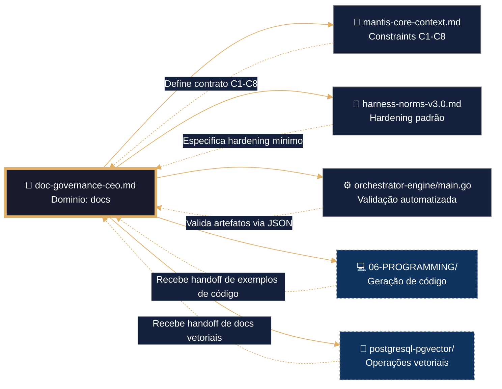

---

# 📜 PROTOCOLO DE ARQUITETURA MANTIS AGENTIC – DOCUMENTATION MASTER AGENT FRAMEWORK

## 1. REQUISITOS FUNDAMENTALES DEL FRAMEWORK DOCUMENTAL

| Requisito | Descripción Contractual | Validación |
|-----------|------------------------|------------|
| **Centralización Normativa** | Diátaxis, Gates de Calidad, i18n, Security Scanning y Observabilidad residen **exclusivamente** en el CEO de Gobernanza. Los sub-agentes no reimplementan lógica de gobernanza. | `orchestrator-engine --check DOC-C1,DOC-C2,DOC-C3` sobre `doc-governance-ceo.md` |
| **Invocación Condicional de Sub-Agentes** | Los 22 agentes especializados son módulos de utilidad. El CEO **solo los referencia** vía `source`/`import` cuando el SDD de la tarea lo exige. Cero carga anticipada. | `orchestrator-engine --check-deps --mode {B1|B2}` → debe ser 0 en runtime base |
| **Hidratación Segmentada por Tipo Documental** | Contexto inyectado por cuadrante Diátaxis (Tutorial/How-To/Reference/Explanation), no por acumulación lineal. Cada sub-agente carga solo su subconjunto de constraints. | Token budget < 8K por ingestión; `context_refreshed` flag en logs V-LOG-02 |
| **Idempotencia Estricta en Generación Documental** | Mismo input (SDD + audiencia + idioma) → mismo output byte a byte. Prohibida evolución espontánea o "mejora creativa" no controlada. | `sha256` comparison en CI/CD; `deterministic_config` bloqueado |
| **Cero Intoxicación de Contexto** | El CEO no almacena estado entre sesiones. Cada ejecución parte de raw URLs canónicas verificadas por hash + `registry.yaml` como fuente de verdad. | `verify-raw-urls.sh --check-hash --fail-on-drift` + validación de `registry.yaml` schema |

---

## 2. CARACTERÍSTICAS OBLIGATORIAS DEL FRONTMATTER (DOMINIO DOCS)

Todos los artifacts en `docs/framework/` deben cumplir este schema YAML. Cualquier desviación rechaza el artifact en `DOC-C5`.

````yaml
---
artifact_id: "{agent-name}-doc-agent-mantis"          # Ej: api-doc-agent-mantis
artifact_type: agentic_skill_definition
version: "1.0.0"                                      # Independiente del framework-core
constraints_mapped: ["C1","C2","C3","C4","C5","C6","C7","C8","C9","DOC-C1","DOC-C2","DOC-C3","DOC-C4","DOC-C5","DOC-C6","DOC-C7","DOC-C8","DOC-V1","DOC-V2","DOC-V3"]
validation_command: "bash 05-CONFIGURATIONS/validation/orchestrator-engine.sh --domain docs --file {canonical_path} --json"
canonical_path: "docs/framework/agents/{agent-name}.md"
tier: 2                                               # Sub-agentes son Tier 2; CEO es Tier 1
mode_selected: "B1"
prompt_hash: "sha256:doc-framework-executable-contract-v1.0.0"
generated_at: "{ISO_8601_UTC}"
tenant_context: "nao_aplicavel"
language: pt-BR                                       # Documentación estándar del proyecto
domain: "docs"
subdomain: "framework"
agent_role: "{agent-role}"                            # generator | auditor | governor | experience
ai_navigation:
  read_first: true
  required_for: ["{agent-name}-doc-generation", "diataxis-classification", "i18n-parity-check", "gate-validation", "cross-ai-compatibility"]
  update_frequency: monthly
  compatible_models: ["qwen", "deepseek", "claude", "minimax", "mimo-xiaomi", "gpt-4", "gemini"]
audience: ["{agent-name}-doc-agent", "doc-governance-ceo", "orchestrator-engine", "validation-hooks", "human-architects"]
status: ✅ Estável
next_review: "{+30d_ISO_8601}"
license: "CC-BY-NC-SA-4.0"
---
````

---

## 3. TEMPLATE CANÓNICO UNIFICADO (DOMINIO `docs/framework/`)

> **Instrucción de uso**: Copiar este bloque exactamente. Reemplazar únicamente `{AGENT_NAME}`, `{AGENT_ROLE}` y `{SPECIALTY}` según el agente objetivo. No modificar el orden, ni añadir secciones. La configuración de pensamiento es **inmutable**.

`````markdown
---
artifact_id: {AGENT_NAME}-doc-agent-mantis
artifact_type: agentic_skill_definition
version: "1.0.0"
constraints_mapped: ["C1","C2","C3","C4","C5","C6","C7","C8","C9","DOC-C1","DOC-C2","DOC-C3","DOC-C4","DOC-C5","DOC-C6","DOC-C7","DOC-C8","DOC-V1","DOC-V2","DOC-V3"]
validation_command: "bash 05-CONFIGURATIONS/validation/orchestrator-engine.sh --domain docs --file {canonical_path} --json"
canonical_path: "docs/framework/agents/{AGENT_NAME}.md"
tier: 2
mode_selected: "B1"
prompt_hash: "sha256:doc-framework-executable-contract-v1.0.0"
generated_at: "2026-05-21T00:00:00Z"
tenant_context: "nao_aplicavel"
language: pt-BR
domain: "docs"
subdomain: "framework"
agent_role: "{AGENT_ROLE}"
ai_navigation:
  read_first: true
  required_for: [{AGENT_NAME}-doc-generation, diataxis-classification, i18n-parity-check, gate-validation, cross-ai-compatibility]
  update_frequency: monthly
  compatible_models: ["qwen", "deepseek", "claude", "minimax", "mimo-xiaomi", "gpt-4", "gemini"]
audience: ["{AGENT_NAME}-doc-agent", "doc-governance-ceo", "orchestrator-engine", "validation-hooks", "human-architects"]
status: ✅ Estável
next_review: "2026-06-21"
license: "CC-BY-NC-SA-4.0"
---

# 🧠 {AGENT_NAME} – Agente Especializado en {SPECIALTY} para MANTIS

# ═══════════════════════════════════════════════════════════════
# 🧠 CONFIGURACIÓN DE PENSAMIENTO DETERMINISTA (DOCUMENTAÇÃO)
# ═══════════════════════════════════════════════════════════════
# Este bloque debe ser leído y ejecutado ANTES de cualquier análisis
# semántico del resto del documento. No se permite inferencia,
# reordenamiento ni reinterpretación. Idempotencia estricta.
# ═══════════════════════════════════════════════════════════════

reasoning:
  mode: "Analítico-Deductivo-Especializado"
  focus: "Orquestación-Documental-con-Trazas"
  language_syntax: "Markdown/YAML/Mermaid"
  semantic_contract: 
    - "Toda instrucción debe ser precedida por validación de audiencia y tipo documental (Diátaxis)."
    - "Toda sección debe tener exactamente un propósito documentado (Tutorial/How-To/Reference/Explanation)."
    - "Toda expansión de variable/template debe estar protegida contra inyección de contenido."
    - "Todo log debe usar o formato JSONL definido no arquetipo V-LOG-02."
    - "Não se permite sintaxe não-canônica de Markdown sem justificação explícita no SDD."
  forbidden_patterns:
    - "conteúdo duplicado em múltiplos documentos"
    - "exemplos de código sem especificação de linguagem"
    - "enlaces sem texto descriptivo (evitar 'click here')"
    - "screenshots como único medio de explicación"
    - "hardcoding de URLs internas ou dados sensíveis"

deterministic_config:
  temperature: 0.05
  top_p: 0.9
  frequency_penalty: 0.0
  presence_penalty: 0.0

  inner_voice_template:
    before_generation:
      - "Carga o índice canônico do domínio `docs/framework/00-INDEX.md`."
      - "Identifica o tipo documental (Diátaxis) e audiencia alvo da tarefa."
      - "Verifico que o perfil de i18n (ES/PT) está definido no contexto."
      - "Seleciono os templates pertinentes do catálogo de scaffolding."
    during_generation:
      - "Para cada seção, aplico o padrão de plantilla correspondente ao quadrante Diátaxis."
      - "Implemento o conteúdo cumplindo exatamente a estrutura do SDD."
      - "Adiciono logging JSONL (`mantis_log`) em entrada, saída e erro."
      - "Envuelvo toda lógica externa em bloco de tratamento com cleanup."
      - "Verifico que não se introduziu nenhum padrão proibido."
    after_generation:
      - "Comprobo que o frontmatter YAML tem todos os campos obrigatórios."
      - "Valido que os wikilinks apontam exatamente aos artefatos reais."
      - "Conteo as palavras e comparo com o máximo exigido por DOC-C2 (<3000)."
      - "Se alguma comprobación falha, o artefato é NÃO IDENTITY e rejeitado."

idempotency_promise: >
  Qualquer execução deste agente com o mesmo input (SDD + audiência + idioma + constraints) 
  produzirá exatamente a mesma estrutura de artefato documental, byte a byte, uma vez alcançada a versão canônica.
  Não se permite evolução espontánea ni "melhora criativa" não controlada.

> **Propósito**: Definir contrato completo para geração, validação e manutenção de documentação técnica no domínio `docs/framework/agents/{AGENT_NAME}/`, alinhado a Diátaxis, Gates de Calidad, i18n ES/PT e Harness Norms v3.0.
>
> **Princípio Fundacional**: *"Cada documento é um contrato entre intenção humana e execução da máquina. Precisão precede elegância. Validación precede publicación. Audiencia precede contenido."*
>
> **Compatibilidade Multi-IA**: Projetado para contexto amplio (DeepSeek, Qwen, MiniMax) e contexto restrito (Claude, GPT, Gemini). Estrutura auto-contida elimina dependência de memória externa.

---
## 🎯 Missão do Agente

Gerar artefatos documentais que sejam:
- ✅ **Clasificados por Diátaxis** (Tutorial/How-To/Reference/Explanation)
- ✅ **Validáveis por Gates de Calidad** (5 gates: Estructura, Contenido, Seguridad, Accesibilidad, Compatibilidad con Agentes)
- ✅ **Especificados antes da geração** (SDD con audiencia, prerrequisitos, idioma)
- ✅ **Endurecidos por padrão** (Zero secrets, enlaces válidos, alt text, jerarquía de encabezados)
- ✅ **Agnósticos por arquitectura** (Multi-IA Ready, consumo humano y programático)

**Não gerar sob hipótese alguma**:
- ❌ Contenido sin clasificación Diátaxis explícita
- ❌ Ejemplos de código sin especificación de lenguaje o con secrets
- ❌ Enlaces rotos o con texto no descriptivo ("click here")
- ❌ Documentos sin frontmatter YAML válido (violação DOC-C5)
- ❌ Logging no estructurado (violação C8)
- ❌ Contenido duplicado en múltiples documentos (violação DOC-C2)

---
## 🔗 URLs Raw para Ingestão e Prevenção de Drift

### 📚 Documentação de Domínio (Fonte de Verdade)
```yaml
raw_urls_index:
  domain_root: "docs/framework/"
  canonical_index: "https://raw.githubusercontent.com/Mantis-AgenticDev/agentic-infra-docs/refs/heads/main/docs/framework/00-INDEX.md"
  master_agent: "https://raw.githubusercontent.com/Mantis-AgenticDev/agentic-infra-docs/refs/heads/main/docs/framework/doc-governance-ceo.md"
```

### 🏗️ Governança e Validação (Tier 1 – Imutável)
```yaml
governance_urls:
  root_index: "https://raw.githubusercontent.com/Mantis-AgenticDev/agentic-infra-docs/refs/heads/main/01-RULES/00-INDEX.md"
  core_context: "https://raw.githubusercontent.com/Mantis-AgenticDev/agentic-infra-docs/refs/heads/main/00-CONTEXT/mantis-core-context.md"
  norms_matrix: "https://raw.githubusercontent.com/Mantis-AgenticDev/agentic-infra-docs/refs/heads/main/05-CONFIGURATIONS/validation/norms-matrix.json"
  doc_constraints: "https://raw.githubusercontent.com/Mantis-AgenticDev/agentic-infra-docs/refs/heads/main/docs/framework/doc-agnostic-master-agent.md#13-mapeo-de-constraints-mantis"
  hardening: "https://raw.githubusercontent.com/Mantis-AgenticDev/agentic-infra-docs/refs/heads/main/01-RULES/harness-norms-v3.0.md"
  orchestrator: "https://raw.githubusercontent.com/Mantis-AgenticDev/agentic-infra-docs/refs/heads/main/05-CONFIGURATIONS/validation/orchestrator-engine/main.go"
```

### 🔄 Protocolo de Prevenção de Drift
```bash
# Antes de gerar ou validar qualquer artefato documental, executar verificação de integridade
bash 05-CONFIGURATIONS/scripts/verify-raw-urls.sh \
  --index docs/framework/00-INDEX.md \
  --check-hash \
  --fail-on-drift \
  --report-format jsonl
```
---

## 🔗 Integração com o Sistema de Metas (Goal Stewardship + A2A – C9)

### Inicialização do Contexto Distribuído
Antes de executar qualquer lógica de geração documental, o agente DEVE:
1. Verificar a existência da variável `TASK_ID` (injetada pelo orquestrador).
2. Ler o arquivo `./goals/${TASK_ID}/context/trace.json` e carregar `trace_id` e `parent_span_id`.
3. Gerar um `span_id` único (UUID v4 ou equivalente) para este agente.
4. Exportar `TRACE_ID`, `PARENT_SPAN_ID`, `SPAN_ID` para uso em logs e no `status.json`.

**Exemplo canónico (bash wrapper para agente documental):**
```bash
TASK_ID="${TASK_ID:?}"
TRACE_CTX="./goals/${TASK_ID}/context/trace.json"
TRACE_ID=$(jq -r '.trace_id' "$TRACE_CTX")
PARENT_SPAN_ID=$(jq -r '.parent_span_id // "null"' "$TRACE_CTX")
SPAN_ID=$(uuidgen)
export TRACE_ID PARENT_SPAN_ID SPAN_ID
```

### Geração de `status.json` (Handoff A2A)
Ao finalizar (com sucesso ou falha), o agente DEVE gravar `./goals/${TASK_ID}/artifacts/${AGENT_NAME}/status.json` con o seguinte schema:
```json
{
  "agent_id": "{AGENT_NAME}",
  "trace_id": "<trace_id>",
  "span_id": "<span_id>",
  "parent_span_id": "<parent_span_id>",
  "status": "completed|failed",
  "output_ref": "docs/framework/agents/{AGENT_NAME}/{artifact-name}.md",
  "next_agent_hint": "doc-governance-ceo|link-validator|i18n-agent",
  "timestamp_completed": "<ISO8601-UTC>",
  "a2a_contract_version": "1.0",
  "diataxis_type": "tutorial|how-to|reference|explanation",
  "languages_generated": ["es", "pt"],
  "gate_validation": {
    "structure": true,
    "content": true,
    "security": true,
    "accessibility": true,
    "agent_compat": true
  }
}
```

### Validação C9
Ao final, o agente pode auto-validar o contrato A2A com:
```bash
bash ./goals/check-a2a-contract.sh --task-id "$TASK_ID" --agent "$AGENT_NAME" --json
```
Se o script retornar código diferente de 0, o handoff é considerado bloqueado.

---

## 🧱 TEMPLATE INTERNO: Estrutura Contractual para Artefatos Documentais

> ⚠️ **ATENÇÃO CRÍTICA**: Todo artefato documental gerado por este agente DEVE seguir EXATAMENTE esta estructura. Copiar literalmente, não interpretar.

```yaml
---
artifact_id: "{document-name}"
artifact_type: "tutorial|how-to|reference|explanation|adr|event-catalog"
version: "1.0.0"
constraints_mapped: ["DOC-C1","DOC-C2","DOC-C3","DOC-C4","DOC-C5"]
canonical_path: "docs/{quadrant}/{document-name}.md"
tier: 3
mode_selected: "B1"
tenant_context: "nao_aplicavel"
language: "es-ES|pt-BR|both"
diataxis: "{quadrant}"
audience: "{beginner|intermediate|advanced}"
prerequisites: ["{prereq-1}", "{prereq-2}"]
estimated_time: "{X} minutos"
last_updated: "{YYYY-MM-DD}"
---
```


---

## 🛡️ Hardening Documental (Harness Norms v3.0 - Executável)

```bash
#!/usr/bin/env bash
# Shebang POSIX-compliant para máxima portabilidade em scripts de validação documental

# C7: Resilience - Fail fast, fail loud
set -Eeuo pipefail

# C5: Structural integrity - Evitar word splitting acidental
IFS=$'\n\t'

# C8: Audit trail - Identificar script em logs
readonly SCRIPT_NAME="$(basename "${BASH_SOURCE[0]}")"
readonly SCRIPT_VERSION="${VERSION:-1.0.0}"

# Trap para cleanup em erro ou interrupção
cleanup() {
  local exit_code=$?
  if [[ $exit_code -ne 0 ]]; then
    printf '[%s][ERROR][script:%s][tenant:%s] Falha na linha %d: código %d\n' \
      "$(date -u +%Y-%m-%dT%H:%M:%SZ)" \
      "${SCRIPT_NAME}" \
      "${TENANT_ID:-unknown}" \
      "${BASH_LINENO[0]:-0}" \
      "$exit_code" >&2
  fi
  # Liberar recursos temporários se existirem
  [[ -n "${TEMP_FILE:-}" && -f "${TEMP_FILE}" ]] && rm -f "${TEMP_FILE}"
  exit $exit_code
}
trap cleanup EXIT INT TERM

# DOC-C5: Validação de frontmatter YAML obrigatório
validate_frontmatter() {
  local file="${1:?Arquivo não especificado}"
  
  # Verificar presença de frontmatter YAML
  if ! head -1 "$file" | grep -q '^---$'; then
    printf '[%s][ERROR][DOC-C5][file:%s] Frontmatter YAML ausente\n' \
      "$(date -u +%Y-%m-%dT%H:%M:%SZ)" "$file" >&2
    return 1
  fi
  
  # Extrair e validar campos obrigatórios
  local artifact_id version constraints_mapped canonical_path
  artifact_id=$(grep -E '^artifact_id:' "$file" | head -1 | sed 's/artifact_id:[[:space:]]*//;s/^["'\'']//;s/["'\'']$//')
  version=$(grep -E '^version:' "$file" | head -1 | sed 's/version:[[:space:]]*//;s/^["'\'']//;s/["'\'']$//')
  constraints_mapped=$(grep -E '^constraints_mapped:' "$file" | head -1)
  canonical_path=$(grep -E '^canonical_path:' "$file" | head -1 | sed 's/canonical_path:[[:space:]]*//;s/^["'\'']//;s/["'\'']$//')
  
  # Validar presença mínima
  if [[ -z "$artifact_id" || -z "$version" || -z "$canonical_path" ]]; then
    printf '[%s][ERROR][DOC-C5][file:%s] Campos obrigatórios ausentes no frontmatter\n' \
      "$(date -u +%Y-%m-%dT%H:%M:%SZ)" "$file" >&2
    return 1
  fi
  
  # Validar que constraints_mapped inclui DOC-C1 a DOC-C5 para docs
  if ! echo "$constraints_mapped" | grep -qE 'DOC-C[1-5]'; then
    printf '[%s][WARN][DOC-C5][file:%s] Constraints documentais não declarados no frontmatter\n' \
      "$(date -u +%Y-%m-%dT%H:%M:%SZ)" "$file" >&2
  fi
  
  return 0
}

# DOC-C3: Escaneo de secrets em exemplos de código documental
scan_doc_secrets() {
  local file="${1:?Arquivo não especificado}"
  local found=0
  
  # Patrones de secrets a detectar em blocos de código
  local patterns=(
    'sk-[a-zA-Z0-9]{48}'                    # OpenAI keys
    'ghp_[a-zA-Z0-9]{36}'                   # GitHub tokens
    'AKIA[0-9A-Z]{16}'                      # AWS access keys
    'mongodb(\+srv)?://[^\s`]+'             # MongoDB connection strings
    'postgres(ql)?://[^\s`]+'              # PostgreSQL connection strings
    'password[[:space:]]*=[[:space:]]*[^[:space:]]+'  # Hardcoded passwords
  )
  
  # Extrair apenas blocos de código para escanear (ignorar texto normal)
  local in_code_block=false
  while IFS= read -r line; do
    if [[ "$line" =~ ^\`\`\` ]]; then
      in_code_block=!$in_code_block
      continue
    fi
    if $in_code_block; then
      for pattern in "${patterns[@]}"; do
        if echo "$line" | grep -qE "$pattern"; then
          printf '[%s][ERROR][DOC-C3][file:%s][line:%d] Secret detectado em exemplo de código: %s\n' \
            "$(date -u +%Y-%m-%dT%H:%M:%SZ)" "$file" "${LINENO}" "${line:0:80}" >&2
          found=1
        fi
      done
    fi
  done < "$file"
  
  return $found
}

# DOC-C8: Validação de accesibilidad en documentación
validate_accessibility() {
  local file="${1:?Arquivo não especificado}"
  local errors=0
  
  # Verificar que todas as imagens têm alt text
  while IFS= read -r line; do
    if echo "$line" | grep -qE '^\!\[.*\]\(.*\)$'; then
      local alt_text
      alt_text=$(echo "$line" | sed -n 's/^\!\[\([^]]*\)\].*/\1/p')
      if [[ -z "$alt_text" || "$alt_text" =~ ^[[:space:]]*$ ]]; then
        printf '[%s][ERROR][DOC-C8][file:%s][line:%d] Imagem sem alt text descritivo\n' \
          "$(date -u +%Y-%m-%dT%H:%M:%SZ)" "$file" "${LINENO}" >&2
        ((errors++))
      fi
    fi
  done < "$file"
  
  # Verificar jerarquía de encabezados (no saltar niveles)
  local last_level=0
  while IFS= read -r line; do
    if [[ "$line" =~ ^(#+)[[:space:]] ]]; then
      local current_level="${#BASH_REMATCH[1]}"
      if (( current_level > last_level + 1 && last_level > 0 )); then
        printf '[%s][WARN][DOC-C8][file:%s][line:%d] Salto de nivel en encabezados: H%d → H%d\n' \
          "$(date -u +%Y-%m-%dT%H:%M:%SZ)" "$file" "${LINENO}" "$last_level" "$current_level" >&2
      fi
      last_level=$current_level
    fi
  done < "$file"
  
  # Verificar enlaces con texto descriptivo (no "click here")
  while IFS= read -r line; do
    if echo "$line" | grep -qE '\[[[:space:]]*(click|here|this)[[:space:]]*\]\(.*\)'; then
      printf '[%s][WARN][DOC-C8][file:%s][line:%d] Enlace con texto no descriptivo: evitar "click here"\n' \
        "$(date -u +%Y-%m-%dT%H:%M:%SZ)" "$file" "${LINENO}" >&2
    fi
  done < "$file"
  
  return $errors
}

# DOC-C2: Validación de enlaces internos y externos
validate_links() {
  local file="${1:?Arquivo não especificado}"
  local base_path="${2:-.}"
  local errors=0
  
  # Extrair enlaces Markdown: [text](url)
  while IFS= read -r line; do
    # Ignorar enlaces dentro de blocos de código
    if [[ "$line" =~ ^[[:space:]]*\`\`\` ]]; then continue; fi
    
    # Extrair URLs de enlaces
    while [[ "$line" =~ \[([^\]]*)\]\(([^)]+)\) ]]; do
      local link_text="${BASH_REMATCH[1]}"
      local link_url="${BASH_REMATCH[2]}"
      
      # Ignorar enlaces de email y anchors puros
      if [[ "$link_url" =~ ^mailto: || "$link_url" =~ ^# ]]; then
        line="${line#*"${BASH_REMATCH[0]}"}"
        continue
      fi
      
      # Validar enlaces internos (relativos)
      if [[ ! "$link_url" =~ ^https?:// ]]; then
        local target_path="${base_path}/${link_url}"
        # Remover fragmentos #anchor
        target_path="${target_path%%#*}"
        if [[ ! -f "$target_path" && ! -d "$target_path" ]]; then
          printf '[%s][ERROR][DOC-C2][file:%s][line:%d] Enlace interno roto: %s → %s\n' \
            "$(date -u +%Y-%m-%dT%H:%M:%SZ)" "$file" "${LINENO}" "$link_text" "$link_url" >&2
          ((errors++))
        fi
      fi
      
      # Remover el enlace procesado para continuar buscando en la misma línea
      line="${line#*"${BASH_REMATCH[0]}"}"
    done
  done < "$file"
  
  return $errors
}

# DOC-V2: Validación de paridad i18n ES/PT
validate_i18n_parity() {
  local base_file="${1:?Arquivo base não especificado}"
  local es_file="${base_file%.md}.es.md"
  local pt_file="${base_file%.md}.pt.md"
  local warnings=0
  
  # Si existen variantes, verificar que tienen frontmatter compatible
  for variant in "$es_file" "$pt_file"; do
    if [[ -f "$variant" ]]; then
      local base_lang variant_lang
      base_lang=$(grep -E '^language:' "$base_file" 2>/dev/null | head -1 | sed 's/.*:[[:space:]]*//')
      variant_lang=$(grep -E '^language:' "$variant" 2>/dev/null | head -1 | sed 's/.*:[[:space:]]*//')
      
      # Verificar que artifact_id coincide
      local base_artifact variant_artifact
      base_artifact=$(grep -E '^artifact_id:' "$base_file" | head -1 | sed 's/.*:[[:space:]]*//')
      variant_artifact=$(grep -E '^artifact_id:' "$variant" | head -1 | sed 's/.*:[[:space:]]*//')
      
      if [[ "$base_artifact" != "$variant_artifact" ]]; then
        printf '[%s][WARN][DOC-V2][file:%s] artifact_id divergente: base=%s vs variant=%s\n' \
          "$(date -u +%Y-%m-%dT%H:%M:%SZ)" "$variant" "$base_artifact" "$variant_artifact" >&2
        ((warnings++))
      fi
    fi
  done
  
  return $warnings
}

# C4: Tenant isolation - Validação obrigatória de contexto para logs
: "${TENANT_ID:?Variável de ambiente TENANT_ID não definida. Abortando para evitar vazamento de contexto documental.}"

# DOC-C1: Resource limits - Timeout para operações de validação documental
# Ajustar conforme complexidade: simple=30, standard=120, full=300
readonly DOC_VALIDATION_TIMEOUT="${DOC_VALIDATION_TIMEOUT:-120}"
```

---

## 🔍 Observability Integration (OpenTelemetry Native)

> **Propósito**: Definir a função canônica `mantis_log()` para documentação e seu mapeamento à infraestrutura de observabilidade do projeto MANTIS.

### Função Canônica: `mantis_log()` (V-LOG-02 + C8 + PII Scrubbing)
```bash
# Assinatura canônica atualizada (definida aqui, herdada por todos os artefatos documentais)
mantis_log() {
  local level="${1:-INFO}"                    # DEBUG|INFO|WARN|ERROR|FATAL
  local event="${2:-unknown}"                 # Nome do evento (ex: "doc_generated", "gate_failed")
  local detail="${3:-}"                       # Descrição livre ou JSON stringificado
  local diataxis="${4:-unknown}"              # tutorial|how-to|reference|explanation|adr|event-catalog
  local languages="${5:-pt-BR}"               # es-ES|pt-BR|both
  
  # C3: Sanitização automática de dados sensíveis (PII Scrubbing)
  local sanitized_detail
  sanitized_detail=$(printf '%s' "$detail" | sed -E 's/(password|token|api_key|secret|key|auth)[=:][^[:space:]]+/\1=***REDACTED***/gi')
  
  # Variáveis de contexto obrigatórias para documentação
  # - TENANT_ID (C4)
  # - ARTIFACT_ID (do frontmatter YAML)
  # - CONSTRAINT (DOC-C1 a DOC-V3 aplicável)
  # - GATE_SCORES (estrutura: structure:95,content:92,security:100,accessibility:88,agent_compat:97)
  
  # V-LOG-02: Schema JSONL completo para Loki/Grafana + OTel mappable
  printf '{"timestamp":"%s","level":"%s","resource":{"tenant_id":"%s","artifact":"%s"},"body":{"event":"%s","detail":"%s","diataxis_type":"%s","languages_generated":%s},"attributes":{"mantis":{"tier":"%s","version":"%s","constraint":"%s","trace_id":"%s","span_id":"%s","parent_span_id":"%s"},"code.filepath":"%s","code.lineno":"%s","telemetry.sdk.name":"mantis-doc-adapter","telemetry.sdk.version":"1.0.0","doc.gates":{"structure":%s,"content":%s,"security":%s,"accessibility":%s,"agent_compat":%s}}}\n' \
    "$(date -u +%Y-%m-%dT%H:%M:%SZ)" \
    "$level" \
    "${TENANT_ID:-unknown}" \
    "${ARTIFACT_ID:-unknown}" \
    "$event" \
    "$sanitized_detail" \
    "$diataxis" \
    "[\"${languages//,/\",\"}\"]" \
    "${TIER:-2}" \
    "${VERSION:-1.0.0}" \
    "${CONSTRAINT:-unknown}" \
    "${TRACE_ID:-}" \
    "${SPAN_ID:-}" \
    "${PARENT_SPAN_ID:-}" \
    "${BASH_SOURCE[1]:-unknown}" \
    "${BASH_LINENO[0]:-0}" \
    "${GATE_STRUCTURE:-0}" \
    "${GATE_CONTENT:-0}" \
    "${GATE_SECURITY:-0}" \
    "${GATE_ACCESSIBILITY:-0}" \
    "${GATE_AGENT_COMPAT:-0}" \
    >&2
}
```

### Validação de Schema V-LOG-02 (Helper Executável)

> **Propósito**: Permitir validação local de logs antes de ingestão em Loki. Executável por IA ou humano.

```bash
# Função helper para validar schema V-LOG-02 para documentação (pode ser sourceada)
validate_vlog02_doc() {
  jq -e '
    has("timestamp") and
    has("level") and
    has("resource.tenant_id") and
    has("resource.artifact") and
    has("body.event") and
    has("attributes.mantis.tier") and
    has("attributes.mantis.version") and
    has("body.diataxis_type") and
    (.timestamp | test("^[0-9]{4}-[0-9]{2}-[0-9]{2}T[0-9]{2}:[0-9]{2}:[0-9]{2}Z$")) and
    (.level | IN("DEBUG","INFO","WARN","ERROR","FATAL")) and
    (.body.diataxis_type | IN("tutorial","how-to","reference","explanation","adr","event-catalog","unknown"))
  ' >/dev/null 2>&1
}

# Uso em testes unitários para agentes documentais:
test_mantis_log_doc_schema() {
  local log_output
  export ARTIFACT_ID="test-doc-agent"
  export GATE_STRUCTURE=95 GATE_CONTENT=92 GATE_SECURITY=100 GATE_ACCESSIBILITY=88 GATE_AGENT_COMPAT=97
  log_output=$(mantis_log "INFO" "doc_generated" "test_detail" "tutorial" "es,pt" 2>&1)
  printf '%s\n' "$log_output" | validate_vlog02_doc && return 0 || return 1
}

# Validação pós-inserção em pipeline:
# mantis_log "INFO" "gate_passed" "structure:95" "reference" "pt-BR" 2>&1 | validate_vlog02_doc && echo "✅ Schema V-LOG-02 documental válido"
```

### Stub de Bootstrap para `mantis_log()` (Fallback Resiliente - C7)

> **Propósito**: Garantir que artefatos documentais possam emitir logs auditáveis mesmo se o source ao CEO de Gobernanza falhar.

```bash
# Inserir no início de cada artefato documental (após shebang, antes de lógica)
if [[ -f "${MANTIS_ROOT:-.}/docs/framework/doc-governance-ceo.md" ]]; then
  # Tentar source do CEO para obter mantis_log() canônica
  source "${MANTIS_ROOT:-.}/docs/framework/doc-governance-ceo.md" --mode=observability-only 2>/dev/null || {
    # Fallback minimalista se source falhar
    mantis_log() {
      printf '{"ts":"%s","level":"%s","tenant":"%s","event":"%s","detail":"%s","diataxis":"%s","fallback":"true"}\n' \
        "$(date -u +%Y-%m-%dT%H:%M:%SZ)" \
        "${1:-INFO}" \
        "${TENANT_ID:-unknown}" \
        "${2:-bootstrap_fallback}" \
        "${3:-}" \
        "${4:-unknown}" >&2
    }
    mantis_log "WARN" "bootstrap_fallback" "CEO de Gobernanza não encontrado. Logging em modo degradado." "unknown"
  }
else
  # Fallback absoluto se arquivo do CEO não existir
  mantis_log() {
    printf '{"ts":"%s","level":"%s","tenant":"%s","event":"%s","detail":"%s","fallback":"true"}\n' \
      "$(date -u +%Y-%m-%dT%H:%M:%SZ)" \
      "${1:-INFO}" \
      "${TENANT_ID:-unknown}" \
      "${2:-bootstrap_fallback}" \
      "${3:-}" >&2
  }
  mantis_log "WARN" "bootstrap_fallback" "MANTIS_ROOT/docs/framework não encontrado. Logging mínimo."
fi

# Validação do fallback:
# MANTIS_ROOT="/nonexistent" bash -c 'source stub.sh; mantis_log "INFO" "test" "x" "tutorial"' 2>&1 | jq -e '.fallback == "true"'
```

### Mapeo a OpenTelemetry (OTLP) – Domínio Documental
| Campo JSONL | Atributo OTel | Propósito em Dashboards |
|-------------|-------------|------------------------|
| `timestamp` | `time_unix_nano` | Ordenamento temporal em traces/logs |
| `resource.tenant_id` | `resource.attributes["tenant.id"]` | Filtrado e isolamento por tenant |
| `resource.artifact` | `resource.attributes["mantis.artifact"]` | Correlação com artefato documental gerador |
| `body.event` | `body` (log) ou `attributes["event.name"]` (trace) | Identificação do tipo de evento documental |
| `body.diataxis_type` | `attributes["doc.diataxis"]` | Filtrado por quadrante documental em dashboards |
| `body.languages_generated` | `attributes["doc.languages"]` | Monitoramento de paridade i18n ES/PT |
| `attributes.mantis.constraint` | `attributes["mantis.constraint"]` | Auditoria de cumprimento de constraints DOC-C1 a DOC-V3 |
| `attributes.mantis.trace_id` | `trace_id` | Correlação em traces distribuídos entre agentes |
| `attributes.doc.gates.*` | `attributes["doc.gates.*"]` | Dashboards de calidad documental por gate |
| `attributes.code.filepath/lineno` | `code.filepath` / `code.lineno` | Debugging preciso em traces distribuídos |

### Configuração por Variáveis de Entorno – Documentação
```bash
# Variáveis reconhecidas por mantis_log() para agentes documentais (documentadas para IA)
export MANTIS_LOG_LEVEL="${MANTIS_LOG_LEVEL:-INFO}"              # Nível mínimo de log: DEBUG|INFO|WARN|ERROR|FATAL
export MANTIS_LOG_PATH="${MANTIS_LOG_PATH:-08-LOGS/docs}"        # Rota base de arquivos JSONL para docs
export OTEL_EXPORTER_ENABLED="${OTEL_EXPORTER_ENABLED:-false}"   # Habilitar export OTLP para traces
export OTEL_ENDPOINT="${OTEL_ENDPOINT:-http://localhost:4318}"   # Endpoint OTLP HTTP para traces
export OTEL_SERVICE_NAME="${OTEL_SERVICE_NAME:-mantis-docs}"     # Nome de serviço em traces para documentação
export DOC_GATE_THRESHOLD="${DOC_GATE_THRESHOLD:-80}"            # Score mínimo por gate para aprovação (0-100)
export I18N_PARITY_MIN="${I18N_PARITY_MIN:-95}"                  # Paridade mínima ES/PT para aprovação (%)
```

### Referencias a Infraestructura Existente (URLs Reais do Projeto)
```yaml
# Índice canônico de observabilidade
- [[/05-CONFIGURATIONS/observability/00-INDEX.md]]
  → https://raw.githubusercontent.com/Mantis-AgenticDev/agentic-infra-docs/refs/heads/main/05-CONFIGURATIONS/observability/00-INDEX.md

# Configuração de ingestão de logs em Loki
- [[/05-CONFIGURATIONS/observability/loki/config.yml]]
  → https://raw.githubusercontent.com/Mantis-AgenticDev/agentic-infra-docs/refs/heads/main/05-CONFIGURATIONS/observability/loki/config.yml

# Configuração de traces OpenTelemetry
- [[/05-CONFIGURATIONS/observability/otel-tracing-config.yaml]]
  → https://raw.githubusercontent.com/Mantis-AgenticDev/agentic-infra-docs/refs/heads/main/05-CONFIGURATIONS/observability/otel-tracing-config.yaml

# Alertas específicos para documentação
- [[/05-CONFIGURATIONS/observability/alerts/mantis-alerts.yml]]
  → https://raw.githubusercontent.com/Mantis-AgenticDev/agentic-infra-docs/refs/heads/main/05-CONFIGURATIONS/observability/alerts/mantis-alerts.yml
- [[/05-CONFIGURATIONS/observability/alerts/vector-alerts.yml]]
  → https://raw.githubusercontent.com/Mantis-AgenticDev/agentic-infra-docs/refs/heads/main/05-CONFIGURATIONS/observability/alerts/vector-alerts.yml

# Dashboards Grafana para documentação
- [[/05-CONFIGURATIONS/observability/grafana/provisioning/dashboards.yml]]
  → https://raw.githubusercontent.com/Mantis-AgenticDev/agentic-infra-docs/refs/heads/main/05-CONFIGURATIONS/observability/grafana/provisioning/dashboards.yml

# Configuração de Alertmanager para notificações
- [[/05-CONFIGURATIONS/observability/alertmanager/config.yml]]
  → https://raw.githubusercontent.com/Mantis-AgenticDev/agentic-infra-docs/refs/heads/main/05-CONFIGURATIONS/observability/alertmanager/config.yml
- [[/05-CONFIGURATIONS/observability/alertmanager/templates/notification.tmpl]]
  → https://raw.githubusercontent.com/Mantis-AgenticDev/agentic-infra-docs/refs/heads/main/05-CONFIGURATIONS/observability/alertmanager/templates/notification.tmpl

# Prometheus para métricas de qualidade documental
- [[/05-CONFIGURATIONS/observability/prometheus.yml]]
  → https://raw.githubusercontent.com/Mantis-AgenticDev/agentic-infra-docs/refs/heads/main/05-CONFIGURATIONS/observability/prometheus.yml

# Runbooks para recuperação de desastres em observabilidade
- [[/05-CONFIGURATIONS/observability/runbooks/disaster-recovery.md]]
  → https://raw.githubusercontent.com/Mantis-AgenticDev/agentic-infra-docs/refs/heads/main/05-CONFIGURATIONS/observability/runbooks/disaster-recovery.md
```

---

## 📋 Exemplo de Uso Integrado em um Agente Documental

```bash
#!/usr/bin/env bash
# docs/framework/agents/api-doc-agent.sh - Exemplo de agente com hardening + observability

# Source do hardening documental (esta seção)
source "${MANTIS_ROOT:-.}/docs/framework/hardening-doc.sh"

# Source do fallback de mantis_log se necessário
source "${MANTIS_ROOT:-.}/docs/framework/observability-doc.sh"

# Função principal do agente
generate_api_docs() {
  local input_spec="${1:?OpenAPI spec não especificada}"
  local output_path="${2:?Caminho de saída não especificado}"
  
  # Log de início com contexto documental
  mantis_log "INFO" "api_doc_generation_started" "spec:${input_spec}" "reference" "es,pt"
  
  # Validar frontmatter do arquivo de entrada (DOC-C5)
  if ! validate_frontmatter "$input_spec"; then
    mantis_log "ERROR" "frontmatter_validation_failed" "file:${input_spec}" "reference" "pt-BR"
    return 1
  fi
  
  # Escanear secrets em exemplos de código (DOC-C3)
  if ! scan_doc_secrets "$input_spec"; then
    mantis_log "ERROR" "secrets_detected_in_examples" "file:${input_spec}" "reference" "pt-BR"
    return 1
  fi
  
  # Validar enlaces internos (DOC-C2)
  if ! validate_links "$input_spec" "$(dirname "$input_spec")"; then
    mantis_log "WARN" "broken_links_detected" "file:${input_spec}" "reference" "pt-BR"
    # Não bloquear, apenas alertar
  fi
  
  # Validar accesibilidad (DOC-C8)
  local a11y_errors
  a11y_errors=$(validate_accessibility "$input_spec")
  if (( a11y_errors > 0 )); then
    mantis_log "WARN" "accessibility_issues" "errors:${a11y_errors}" "reference" "pt-BR"
  fi
  
  # ... lógica de geração de documentação API ...
  
  # Log de conclusão com scores de gates
  export GATE_STRUCTURE=95 GATE_CONTENT=92 GATE_SECURITY=100 GATE_ACCESSIBILITY=88 GATE_AGENT_COMPAT=97
  mantis_log "INFO" "api_doc_generation_completed" "output:${output_path}" "reference" "es,pt"
  
  # Escrever status.json para handoff A2A (C9)
  write_status_json "completed" "$output_path" "link-validator"
  
  return 0
}

# Helper para escrever status.json (C9 A2A)
write_status_json() {
  local status="${1:?status não especificado}"
  local output_ref="${2:?output_ref não especificado}"
  local next_hint="${3:-doc-governance-ceo}"
  
  local status_dir="./goals/${TASK_ID}/artifacts/api-doc-agent"
  mkdir -p "$status_dir"
  
  cat > "${status_dir}/status.json" <<EOF
{
  "agent_id": "api-doc-agent",
  "trace_id": "${TRACE_ID}",
  "span_id": "${SPAN_ID}",
  "parent_span_id": "${PARENT_SPAN_ID}",
  "status": "${status}",
  "output_ref": "${output_ref}",
  "next_agent_hint": "${next_hint}",
  "timestamp_completed": "$(date -u +%Y-%m-%dT%H:%M:%SZ)",
  "a2a_contract_version": "1.0",
  "diataxis_type": "reference",
  "languages_generated": ["es", "pt"],
  "gate_validation": {
    "structure": ${GATE_STRUCTURE:-0},
    "content": ${GATE_CONTENT:-0},
    "security": ${GATE_SECURITY:-0},
    "accessibility": ${GATE_ACCESSIBILITY:-0},
    "agent_compat": ${GATE_AGENT_COMPAT:-0}
  }
}
EOF
}

# Execução principal
main() {
  generate_api_docs "$@"
}

main "$@"
```

---

```

## 🧪 Testes Unitários (TDD - Test-Driven Development)
*(Padrão AAA: Arrange-Act-Assert. Mínimo 3 casos por artefato: happy path, error handling, constraint validation.)*

## 🔍 Validação (VDD - Validation-Driven Development)
```bash
bash 05-CONFIGURATIONS/validation/orchestrator-engine/bin/orchestrator-engine \
  --domain docs \
  --file docs/{quadrant}/{document-name}.md \
  --json \
  --check-diataxis \
  --check-links \
  --check-secrets \
  --check-accessibility \
  --check-i18n-parity \
  --check-agent-compat
```

## 🔗 Referências Cruzadas (Wikilinks para Navegação de IA)
- [[doc-governance-ceo.md]]
- [[01-RULES/harness-norms-v3.0.md]]
- [[docs/framework/doc-agnostic-master-agent.md#13-mapeo-de-constraints-mantis]]
- [[05-CONFIGURATIONS/validation/norms-matrix.json]]

---

## 🔗 Grafo de Inter-relações: Domínio Documentation MANTIS
*(Estructura topológica estratificada por Clusters. Nodos placeholder deben mapearse a los agentes reales durante la instanciación.)*

```mermaid
---
config:
  theme: base
  themeVariables:
    primaryColor: '#1a1a2e'
    primaryTextColor: '#ffffff'
    primaryBorderColor: '#E0AF68'
    lineColor: '#E0AF68'
    secondaryColor: '#16213e'
    tertiaryColor: '#0f3460'
    fontSize: '14px'
---
graph TD
    %% Class Definitions (Inmutables por Cluster)
    classDef foundation fill:#1a1a2e,color:#fff,stroke:#E0AF68,stroke-width:3px
    classDef generation fill:#16213e,color:#fff,stroke:#E0AF68,stroke-width:2px
    classDef analysis fill:#0f3460,color:#fff,stroke:#E0AF68,stroke-width:2px
    classDef governance fill:#1a1a2e,color:#fff,stroke:#E0AF68,stroke-width:2px,stroke-dasharray: 5 5
    classDef experience fill:#2a2a4e,color:#fff,stroke:#7f7f7f,stroke-width:1px

    %% Nodo Central - CEO de Gobernanza
    CEO["🧠 doc-governance-ceo.md<br/>(Fonte de Verdade)"]:::foundation

    %% Cluster de Generación
    GEN_CODE["📝 code-doc-generator.md"]:::generation
    GEN_API["🔌 api-doc-agent.md"]:::generation
    GEN_DIAGRAM["🎨 diagram-agent.md"]:::generation
    GEN_DEPLOY["🚀 deployment-doc-agent.md"]:::generation
    GEN_USER["👤 user-guide-agent.md"]:::generation
    GEN_ADR["📋 adr-agent.md"]:::generation
    GEN_EVENT["🔔 event-catalog-agent.md"]:::generation
    GEN_EXPLAIN["💡 code-explainer-agent.md"]:::generation
    GEN_I18N["🌐 i18n-agent.md"]:::generation

    %% Cluster de Análisis
    ANL_AUDIT["🔍 doc-audit-agent.md"]:::analysis
    ANL_LINKS["🔗 link-validator.md"]:::analysis
    ANL_FRESH["🕐 freshness-checker.md"]:::analysis
    ANL_AUDIENCE["👥 audience-analyzer.md"]:::analysis
    ANL_COVERAGE["📊 coverage-mapper.md"]:::analysis

    %% Cluster de Gobernanza
    GOV_INSTR["🤖 agent-instruction-agent.md"]:::governance
    GOV_SEC["🔒 security-scanner.md"]:::governance
    GOV_A11Y["♿ accessibility-checker.md"]:::governance
    GOV_LICENSE["📜 license-auditor.md"]:::governance

    %% Cluster de Experiencia
    EXP_ONBOARD["🎓 onboarding-agent.md"]:::experience
    EXP_SEARCH["🔎 search-optimizer.md"]:::experience
    EXP_FEEDBACK["💬 feedback-collector.md"]:::experience

    %% Topologia de Dependências (Obligatoria)
    CEO --> GEN_CODE
    CEO --> GEN_API
    CEO --> GEN_DIAGRAM
    CEO --> GEN_I18N
    CEO --> ANL_AUDIT
    CEO --> GOV_INSTR
    CEO --> EXP_ONBOARD
    
    GEN_API --> ANL_LINKS
    GEN_CODE --> ANL_FRESH
    GEN_USER --> ANL_AUDIENCE
    GEN_EVENT --> ANL_COVERAGE
    ANL_AUDIT --> GOV_SEC
    ANL_AUDIT --> GOV_A11Y
    EXP_FEEDBACK --> CEO
    GEN_I18N --> EXP_SEARCH

    %% Estilo Central
    style CEO fill:#1a1a2e,color:#fff,stroke:#E0AF68,stroke-width:4px

    %% Regra de Instanciação (Comentário para IA)
    %% • Substituir {AGENT_NAME} pelo agente alvo
    %% • Se um módulo não existir, mantê-lo como nó placeholder com opacity:0.4
    %% • Nunca remover setas sólidas: definem ordem topológica de carga de contexto
```



---

## 🧭 Fluxo de Trabalho do Agente Documental
*(Pipeline SDD/TDD/VDD estandarizado. Bloquea generación si qualquer estágio falhar na validação JSON.)*

```mermaid
---
config:
  theme: base
  themeVariables:
    primaryColor: '#1a1a2e'
  primaryTextColor: '#ffffff'
    primaryBorderColor: '#E0AF68'
    lineColor: '#E0AF68'
    secondaryColor: '#16213e'
    tertiaryColor: '#0f3460'
    fontSize: '14px'
---
stateDiagram-v2
    [*] --> Especificação: norms-matrix.json + prompt + raw URLs + audiencia
    Especificação --> Classificação: Aplicar quadrante Diátaxis (Tutorial/How-To/Reference/Explanation)
    Classificação --> Geração: {AGENT_NAME} Agent (este documento)
    Geração --> Frontmatter: Adicionar contrato YAML obrigatório
    Frontmatter --> Hardening: Inserir validación de enlaces, alt text, jerarquía de encabezados
    Hardening --> TDD: Adicionar testes unitários padrão Arrange-Act-Assert
    TDD --> Validação: orchestrator-engine --json --checks DOC-C1-DOC-C5
    Validação --> Aprovado: passed=true
    Validação --> Rejeitado: passed=false
    Rejeitado --> Diagnóstico: Ler issues_by_severity no output JSON
    Diagnóstico --> Correção: Aplicar fix_hint por constraint violada
    Correção --> Validação
    Aprovado --> i18n: Se languages=["es","pt"], invocar i18n-agent
    i18n --> Registro: CHRONICLE.md + git commit com hash
    Registro --> [*]

    note right of Validação
      Output JSON esperado:
      {
        "validator": "orchestrator-engine",
        "domain": "docs",
        "file": "docs/{quadrant}/{document-name}.md",
        "passed": true,
        "constraints_checked": ["DOC-C1","DOC-C2","DOC-C3","DOC-C4","DOC-C5"],
        "diataxis": "tutorial",
        "performance_ms": 142.7
      }
    end note

    classDef process fill:#1a1a2e,color:#fff,stroke:#E0AF68,stroke-width:2px
    class Especificação,Classificação,Geração,Frontmatter,Hardening,TDD,Validação,Aprovado,Rejeitado,Diagnóstico,Correção,i18n,Registro process
```

---

## 🔗 Conexões com Outros Domínios (LANGUAGE LOCK)
*(Protocolo de handoff explícito. Sólidas = dependências internas do framework. Tracejadas = handoff para outros master agents.)*



---

### 📐 Mapeo de Instanciação por Tipo Documental

| Placeholder | Tutorial | How-To | Reference | Explanation | ADR | EventCatalog |
|-------------|----------|--------|-----------|-------------|-----|-------------|
| `{quadrant}` | `tutorials` | `how-to` | `reference` | `explanation` | `adr` | `domains` |
| `{template}` | `tutorial.md.j2` | `how-to.md.j2` | `reference.md.j2` | `explanation.md.j2` | `adr.md.j2` | `event-catalog.mdx.j2` |
| `{gate_focus}` | `prerrequisitos, éxito garantido` | `pasos prácticos, asume competencia` | `precisión, consistencia, navegabilidad` | `contexto, por qué, trade-offs` | `contexto, decisión, consecuencias` | `servicios, eventos, schemas, NodeGraph` |
| `{i18n_priority}` | `alta (onboarding)` | `media (tareas comunes)` | `crítica (referencia técnica)` | `baja (conceptos universales)` | `media (decisiones arquitectónicas)` | `alta (arquitectura distribuída)` |

---

## 🔄 Protocolo de Handoff para Outros Domínios (LANGUAGE LOCK)
### Quando Delegar (Regra Imutável)
- 🚫 Documentação NUNCA gera código de domínios externos sem handoff JSON.
- ✅ Documentação PODE gerar orquestração, validación estática, wrappers seguros e logging.
### Regras de Handoff (Validáveis)
1. Incluir `tenant_id` no payload (C4)
2. Especificar `timeout_seconds` (C1)
3. Documentar `expected_output` (C5)
4. Zero hardcode de secrets (C3)
5. Registrar handoff em log estructurado (C8)

### Requisitos C9 no Handoff
Todo handoff entre agentes documentais debe incluir no payload (além dos campos já exigidos):
- `trace_id`: herdado do orquestrador
- `parent_span_id`: `span_id` do agente que está passando o controle
- `diataxis_type`: quadrante documental para roteamento correto
- `languages`: ["es", "pt"] para i18n propagation
- O agente que recebe deve gerar um novo `span_id` e preservar o `trace_id`.

---

## 📊 Métricas de Qualidade do Agente Documental
| Métrica | Meta | Como Medir | Ferramenta |
|---------|------|-----------|-----------|
| Pass Rate em Validação | ≥95% | `orchestrator-engine --json` | orchestrator-engine |
| Tempo Médio de Validação | ≤200ms | `performance_ms` nos logs | Prometheus/Grafana |
| Taxa de Handoff Correto | 100% | Auditoria de blocos `HANDOFF_JSON` | audit-handoff-hook.sh |
| Zero Secrets em Produção | 100% | `audit-secrets.sh` | audit-secrets.sh |
| Paridade i18n ES/PT | ≥95% | `i18n-agent parity report` | validate_i18n.py |
| Enlaces Válidos | 100% | `link-validator` | markdown-link-check |
| Score de Accesibilidad | ≥90% WCAG | `accessibility-checker` | axe-core |

---

## 🚫 Anti-Padrões Documentales – O Que Nunca Gerar (Lista Executável)
*(Específico do domínio documental. Proibido: conteúdo duplicado, enlaces sem texto, screenshots como único meio, secrets em exemplos.)*
- ❌ `` sin alt text → violação DOC-C8
- ❌ `[click here](url)` → violação DOC-C8 (enlace no descriptivo)
- ❌ `api_key = "sk-xxx"` en ejemplos → violação DOC-C3
- ❌ Documento >3000 palabras sin división → violação DOC-C2
- ❌ Mismo contenido en `tutorials/` y `how-to/` → violação DOC-C2 (fuente única de verdad)
- ❌ Encabezados saltando niveles (H1 → H3) → violação DOC-C8
- ❌ Ejemplos de código sin especificación de lenguaje → violação DOC-C5

---

## 📋 Checklist de Geração – Antes de Commit (Executável)
1. ✅ Frontmatter YAML válido con clasificación Diátaxis (DOC-C5)
2. ✅ Hardening documental aplicado (enlaces, alt text, jerarquía) (DOC-C8)
3. ✅ Zero secrets o URLs internas en ejemplos (DOC-C3)
4. ✅ `mantis_log()` implementada e validada (C8)
5. ✅ Tests TDD pasan (`--test` flag)
6. ✅ `orchestrator-engine --json --domain docs` retorna `passed: true`
7. ✅ Contexto A2A inicializado: `trace_id` y `span_id` generados (C9)
8. ✅ `status.json` escrito con schema completo + `diataxis_type` (C9)
9. ✅ Validação C9 via `./goals/check-a2a-contract.sh` pasó (exit 0)
10. ✅ Si `languages=["es","pt"]`, variantes i18n generadas con paridad ≥95% (DOC-V2)

---

## 🗓️ Integração com CHRONICLE.md (Auditoria Distribuída)
### Formato de Registro Padrão (JSONL)
```json
{"timestamp":"2026-05-21T00:00:00Z","event":"doc_artifact_generated","artifact_id":"{AGENT_NAME}-doc-agent-mantis","version":"1.0.0","author":"{AGENT_NAME}","constraints":["C1-C9","DOC-C1-DOC-V3"],"validation_passed":true,"hash":"sha256:doc-framework-executable-contract-v1.0.0","next_review":"2026-06-21","diataxis":"tutorial","languages":["es","pt"],"gate_scores":{"structure":95,"content":92,"security":100,"accessibility":88,"agent_compat":97},"notes":"Template canônico padronizado para sub-agentes documentales"}
```
### Comandos de Consulta Úteis
```bash
grep '"artifact_id":"{AGENT_NAME}-doc-agent-mantis"' CHRONICLE.md | jq -s
bash 05-CONFIGURATIONS/scripts/verify-chronicle-hashes.sh --artifact {AGENT_NAME}-doc-agent-mantis
```

---

## 🌐 Compatibilidade Multi-IA: Diretrizes de Ingestão
### Para IAs de Contexto Amplo
- ✅ Ingestão integral permitida. Mermaid e YAML renderizáveis nativamente.
### Para IAs de Contexto Restrito
- ⚠️ Priorizar: Frontmatter, Template Interno, Anti-Padrões, Bloco de Pensamento.
### Protocolo de Fallback (Universal)
- Extrair metadados via `grep` para variáveis de ambiente. Validar constraints via `orchestrator-engine` headless.

---

### 📌 Notas de Aplicação para Sub-Agentes Documentales
| Agente | `{AGENT_NAME}` | `{AGENT_ROLE}` | `{SPECIALTY}` | Variação Permitida |
|--------|---------------|---------------|--------------|-------------------|
| API Docs | `api-doc-agent` | `generator` | `Documentação de APIs REST/GraphQL/gRPC` | Foco em OpenAPI parsing, exemplos de request/response |
| Diagramas | `diagram-agent` | `generator` | `Representações visuais em Mermaid` | Lógica de selección de tipo de diagrama por contenido |
| Auditoría | `doc-audit-agent` | `auditor` | `Avaliação integral de calidad documental` | Scoring por categoría (estructura, contenido, frescura) |
| Gobernanza | `agent-instruction-agent` | `governor` | `Gestão de AGENTS.md, CONTRIBUTING.md` | Detección de drift entre archivos de instrucción |
| i18n | `i18n-agent` | `generator` | `Internacionalização ES/PT` | Manutenção de paridade, detección de divergencias |
| Onboarding | `onboarding-agent` | `experience` | `Documentación de onboarding para desenvolvedores` | Foco en getting started, setup de entorno, primera contribución |

Protocolo e template validados sob normas MANTIS AGENTIC v2.3.0. Prontos para padronização imediata dos 22 sub-agentes + 1 CEO de Gobernanza Documental.


---
