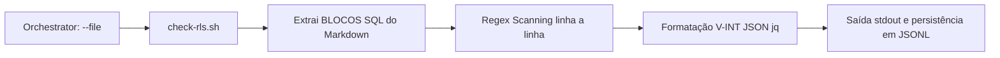

# 🔐 check-rls.sh – Validador de Isolamento por Tenant (Constraint C4)

> **Idioma**: Português do Brasil 🇧🇷  
> **Público-alvo**: Desenvolvedores seniores, arquitetos de banco de dados e equipes de segurança  
> **Versão do validador**: v3.3.0-CONTRACTUAL  
> **Última atualização**: 2026-04-25

---

## 🎯 Propósito

Este artefato valida a **Constraint C4** da governança Mantis: *"Isolamento estrito de dados por tenant_id"*. Ele impede a injeção de vulnerabilidades onde queries possam vazar dados entre diferentes clientes em ambientes Multi-Tenant.

### O que ele detecta:
| Categoria | Padrão Detectado | Severidade | Exemplo Problemático |
|-----------|------------------|------------|----------------------|
| `explicit_bypass` | `SET rls = false` | 🔴 CRITICAL | `SET rls = false; SELECT * FROM users;` |
| `missing_tenant_filter` | DML (`SELECT`, `UPDATE`...) sem `tenant_id` | 🔴 CRITICAL | `UPDATE accounts SET balance = 0;` |
| `missing_join_scoping` | Cláusula `JOIN` sem menção a `tenant_id` | 🟡 HIGH | `FROM table_a a JOIN table_b b ON a.id = b.a_id` |

### O que ele **ignora**:
- Linhas comentadas com `--`.
- Consultas isentas (white-listed) declaradas na matriz `05-CONFIGURATIONS/validation/norms-matrix.json`.

---

## 🔧 Implementação Técnica

### Arquitetura (Modo Single-File)


### Decisões de Engenharia
| Decisão | Por quê | Impacto |
|---------|---------|---------|
| **Foco Atômico (--file)** | Alinhamento com a arquitetura V3.0-CONTRACTUAL | Permite paralelização de até 1000 arquivos pelo Orquestrador. |
| **Persistência JSONL Diária** | Previne a fragmentação do file system de logs | Simplifica o parsing pelo frontend do Dashboard. |

---

## 🚀 Como Usar

### Execução Individual
```bash
# Validar um arquivo que contenha SQL
bash 05-CONFIGURATIONS/validation/check-rls.sh --file 06-PROGRAMMING/sql/minha-query.md

# A saída será estritamente um JSON parseável no stdout, e logs operacionais no stderr.
```

---

## 🔗 Referências

| Documento | Link Canônico | Propósito |
|-----------|--------------|-----------|
| Governança C4 | `[[01-RULES/harness-norms-v3.0.md#C4]]` | Definição da norma oficial |
| Normas V-INT | `[[05-CONFIGURATIONS/validation/VALIDATOR_DEV_NORMS.md]]` | Padrões de I/O do validador |

---

## 🌳 JSON Tree Final

```json
{
  "artifact": "check-rls.sh",
  "version": "3.3.0",
  "language_docs": "pt-BR",
  "canonical_path": "docs/pt-BR/validation-tools/check-rls/README.md",
  "compliance": {
    "C4": true,
    "V-INT-01": true,
    "V-LOG-01": true
  }
}
```
