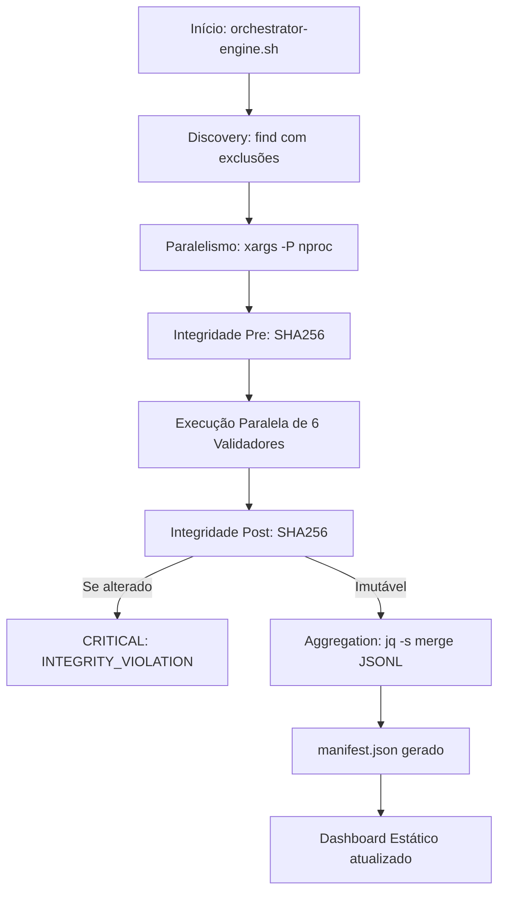

# 📊 orchestrator-engine.sh – Orquestrador Central de Validação (v4.0)

> **Idioma**: Português do Brasil 🇧🇷  
> **Público-alvo**: Arquitetos, engenheiros de plataforma e mantenedores CI/CD  
> **Versão do validador**: v4.0.0  
> **Última atualização**: 2026-04-25

---

## 🎯 Propósito

O **Orchestrator Engine** é o coração da infraestrutura de validação MANTIS. Ele não valida arquivos diretamente; em vez disso, atua como um coordenador estrito (Zero-Trust) que descobre, paraleliza, audita e agrega os resultados dos 6 validadores especialistas da plataforma.

### O que ele faz:
- Descobre artefatos `.md, .sql, .py, .go, .js, .ts, .sh, .yaml, .json`.
- Paraleliza a execução de 6 validadores por artefato usando `xargs -P $(nproc)`.
- Garante imutabilidade "Zero-Trust" calculando o SHA256 antes e depois da passagem pelos validadores.
- Consolida os arquivos `.jsonl` em um `manifest.json`.
- Alimenta os dados para o **Dashboard Estático** em HTML puro.

### O que ele **não faz**:
- Não aplica regras de validação (isso é delegado aos scripts `check-rls`, `audit-secrets`, etc.).
- Nunca modifica o conteúdo dos arquivos analisados (Modo Read-Only estrito).

---

## 🔧 Implementação Técnica

### Arquitetura de Alto Nível


---

## 🚀 Como Usar

### Execução Completa (Repositório Inteiro)
```bash
# Na raiz do repositório
bash 05-CONFIGURATIONS/validation/orchestrator-engine.sh ./
```

### Teste de Estresse / Sandbox
```bash
# Validar um diretório específico
bash 05-CONFIGURATIONS/validation/orchestrator-engine.sh 09-TEST-SANDBOX/stress-test-pool
```

### 🖥️ Acessando o Dashboard
Ao finalizar a execução, o script alimentará o dashboard estático. Você pode visualizá-lo diretamente abrindo o arquivo `index.html` em qualquer navegador (sem necessidade de servidor Node.js/Python).

**Caminho Absoluto:**
```text
file:///home/ricardo/proyectos/agentic-infra-docs-testing/08-LOGS/validation/test-orchestrator-engine/dashboard/index.html
```

---

## 🔗 Referências e Links Relacionados

| Documento | Link Canônico | Propósito |
|-----------|--------------|-----------|
| Schema de Saída | `[[05-CONFIGURATIONS/validation/schema/manifest.schema.json]]` | Contrato do `manifest.json` |
| Contrato V-LOG | `[[05-CONFIGURATIONS/validation/VALIDATOR_DEV_NORMS.md]]` | Padrões de logging exigidos |

---

## 🌳 JSON Tree Final (para agents remotos)

```json
{
  "artifact": "orchestrator-engine.sh",
  "version": "4.0.0",
  "language_docs": "pt-BR",
  "canonical_path": "docs/pt-BR/validation-tools/orchestrator-engine/README.md",
  "compliance": {
    "V-INT-01": true,
    "V-LOG-01": true,
    "V-LOG-02": true
  },
  "interface": {
    "modes": ["directory (--dir)"],
    "output": {
      "stdout": "Logs de progresso e alertas",
      "manifest": "JSON agregado em 08-LOGS/validation/test-orchestrator-engine/manifests/",
      "dashboard": "HTML Estático"
    }
  }
}
```
